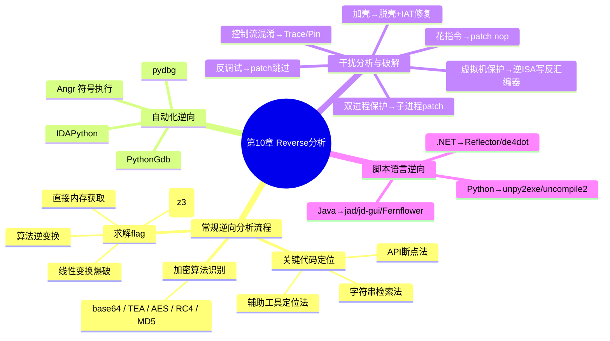

???+ abstract "本章摘要"
    本章围绕 Reverse（逆向）题型的完整解题链路展开：先讲常规逆向分析流程（关键代码定位、常见加密算法识别、求解 flag 的四种手段），再介绍 IDAPython、PythonGdb、pydbg、Angr 等自动化逆向工具，随后逐一拆解花指令、反调试、加壳、控制流混淆、双进程保护、虚拟机保护等干扰分析技术及其破解思路，最后补充 .NET、Python、Java 三类脚本语言程序的逆向方法。
## 章节导航

上一篇：第9章
下一篇：第11章 PWN
回到目录：[00-目录](00-目录.md)


## 第10章 Reverse分析

本章将从常规逆向分析流程、自动化逆向、脚本语言的逆向和干扰分析技术及破解方法来具体介绍如何进行Reverse分析。

### 10.1 常规逆向分析流程

因为在一个可执行程序（尤其是图形化的程序）中，汇编代码量比较庞大，因此需要能够定位出真正需要分析的关键代码。在找到关键代码之后，需要对关键代码采用的算法进行分析，理清程序功能。最后针对程序功能，写出对应脚本，解出flag。

#### 10.1.1 关键代码定位

### 1. API 断点法

在获取文本输入时，对于窗口类程序获取文本的方式主要是通过GetWindowText和GetDlgItemText两个API来获取。在输出结果时，程序通常会弹出对话框，调用的API通常为MessageBox。在这些API函数中下断点，在调试器中断下来之后，通过找回溯即可定位到关键代码。

### 2. 字符串检索法

## （1） 在IDA中查找字符串

打开Strings子窗口，通过Ctrl+F快捷键输入你想要查找的字符串，如图10-1所示。

## （2） 在OD中查找字符串

通过Alt+E快捷键，可以查看可执行模块，找到主模块，如图10-2所示。

点击右键，选择中文搜索引擎选项，根据需要选择搜索ASCII或者搜索UNICODE，如图10-3所示。

{ width="100%" }


<div style="text-align: center;">图10-1 在IDA中查找字符串</div>

{ width="100%" }


<div style="text-align: center;">图10-2 在OD中找到主模块</div>

{ width="100%" }

<div style="text-align: center;">图10-3 在OD中搜索字符串</div>


### 3. 辅助工具定位法

针对特定语言或者编译器生成的程序，有一些辅助工具可帮助用户快速定位按键处理程序的地址，如针对MFC程序的xspy，针对Delphi程序的Dede，等等。

#### 10.1.2 常见加密算法识别

在对数据进行变换的过程中，通常会使用一些常用的加密算法，因此如果能够快速识别出对应的加密算法，就能更快地分析出整个完整的算法。==CTF逆向中通常出现的加密算法包括base64、TEA、AES、RC4、MD5等==。

### 1. base64

==base64主要是将输入中的每3字节（共24比特）按每6比特分成一组，变成4个小于64的索引值，然后通过一个索引表得到4个可见字符。==

索引表为一个64字节的字符串，如果在代码中发现引用了这个索引表

“ABCDEFGHIJKLMNOPQRSTUVWXYZabcdefghijklmnopqrstuvwxyz0123456789+/”，那么基本上就可以确定使用了base64，如图10-4所示。此外，还有一些变种的base64，主要是改变了这个索引表。

{ width="100%" }


<div style="text-align: center;">图10-4 base64加密算法的反编译伪代码</div>


### 2. TEA

TEA算法是一种常见的分组加密算法，密钥为128比特位，明文为64比特位，主要做了32轮变换，每轮变换中都涉及移位和变换。TEA的

源码如下：

```c
void encrypt(uint32_t*v, uint32_t*k) {
    uint32_t v0 = v[0], v1 = v[1], sum = 0, i;
    uint32_t delta = 0x9e3779b9;
    uint32_t k0 = k[0], k1 = k[1], k2 = k[2], k3 = k[3];
    for (i=0; i<32; i++) {
        sum += delta;
        v0 += ((v1 << 4) + k0) ^ (v1 + sum) ^ ((v1 >> 5) + k1);
        v1 += ((v0 << 4) + k2) ^ (v0 + sum) ^ ((v0 >> 5) + k3);
    }
    v[0] = v0;
    v[1] = v1;
}

void decrypt(uint32_t*v, uint32_t*k) {
    uint32_t v0 = v[0], v1 = v[1], sum = 0xC6EF3720, i;
    uint32_t delta = 0x9e3779b9;
    uint32_t k0 = k[0], k1 = k[1], k2 = k[2], k3 = k[3];
    for (i = 0; i < 32; i++) {
        v1 -= ((v0 << 4) + k2) ^ (v0 + sum) ^ ((v0 >> 5) + k3);
        v0 -= ((v1 << 4) + k0) ^ (v1 + sum) ^ ((v1 >> 5) + k1);
        sum -= delta;
    }
    v[0] = v0;
    v[1] = v1;
}
```

对TEA的识别也比较容易，在TEA算法中有一个固定的常数0x9e3779b9或者0x61c88647。

### 3. AES

AES也是常见的分组加密算法，多次出现在CTF中。AES的加解密流程如图10-5所示。

{ width="100%" }


加密

解密

<div style="text-align: center;">图10-5 AES的加解密原理</div>


AES加密过程涉及4种操作：字节替代（SubBytes）、行移位（ShiftRows）、列混淆（MixColumns）和轮密钥加（AddRoundKey）。

其中，字节替代过程是通过S盒完成一个字节到另外一个字节的映射。S盒和逆S盒具体如下：

```c
static const uint32 FSb[256] =
{
0x63, 0x7C, 0x77, 0x7B, 0xF2, 0x6B, 0x6F, 0xC5, 0x30, 0x01, 0x67, 0x2B, 0xFE, 0xD7, 0xab, 0x76, 0xca, 0x82, 0xC9, 0x7D, 0xFA, 0x59, 0x47, 0xF0, 0xad, 0xD4, 0xA2, 0xAF, 0x9C, 0xA4, 0x72, 0xC0, 0xB7, 0xFD, 0x93, 0x26, 0x36, 0x3F, 0xF7, 0xCC, 0x34, 0xA5, 0xE5, 0xF1, 0x71, 0xD8, 0x31, 0x15, 0x04, 0xC7, 0x23, 0xC3, 0x18, 0x96, 0x05, 0x9A, 0x07, 0x12, 0x80, 0xE2, 0xEB, 0x27, 0xB2, 0x75, 0x09, 0x83, 0x2C, 0x1A, 0x1B, 0x6E, 0x5A, 0xA0, 0x52, 0x3B, 0xD6, 0xB3, 0x29, 0xE3, 0x2F, 0x84, 0x53, 0xD1, 0x00, 0TED, 0x20, 0xFC, 0xB1, 0x5B, 0x6A, 0xCB, 0xBE, 0x39, 0x4A, 0x4C, 0x58, 0xFF, 0x81, 0x82, 0x83, 0x84, 0x43, 0x4D, 0x33, 0x85, 0x45, 0xF9, 0x02, 0x7F, 0x50, 0x3C, 0x9F, 0xA8, 0x51, 0xA3, 0x40, 0x8F, 0x92, 0x9D, 0x38, 0xF5, 0莞BC, 0xB6, 0xDA, 0x21, 0x10, 0xFF, 0xF3, 0xD2, 0xCD, 0x0C, 0x13, 0xEC, 0x5F, 0x97, 0x44, 0x17, 0xC4, 0xA7, 0x7E, 0x3D, 0x64, 0x5D, 0x19, 0x73, 0x60, 0x81, 0x4F, 0xDC, 0x22, 0x2A, 0x90, 0x88, 0x46, 0xEE, 0xB8, 0x14, 0xDE, 0x5E, 0x0B, 0xDB, 0xE0, 0x32, 0x3A, 0x0A, 0x49, 0x06, 0x24, 0x5C, 0xC2, 0xD3, 0xAC, 0x62, 0x91, 0x95, 0xE4, 0x79, 0xE7, 0xC8, 0x37, 0x6D, 0x8D, 0xD5, 0x4E, 0xA9, 0x6C, 0x56, 0xF4, 0xEA, 0x65, 0x7A, 0xAE, 0x08, 0xBA, 0x78, 0x25, 0x2E, 0x1C, 0xA6, 0xB4, 0xC6, 0xE8, 0xDD, 0x74, 0x1F, 0x4B, 0xBD, 0x8B, 0x8A, 0x70, 0x3E, 0xB5, 0x66, 0x48, 0x03, 0xF6, 0x0E, 0x09, 0x0A, 0x1A, 0x2A, 0x3A, 0x4A, 0x5A, 0x6A, 0x7A, 0x8A, 0x8A, 0x8A, 0x8A, 0x8A, 0x8A, 0x8A, 0x8A, 0x8A, 0x8A, 0x8A, 0x8A, 0x8A, 0x8A, 0x8A, 0x8A, 0x8A, 0x8A, 0x8A, 0x8A, 0x8A, 0x8A, 0x8A, 0x8A, 0x8A, 0x8A, 0x8A, 0x8A, 0x8A, 0x8A, 0x8A, 0x8A, 0x8A, 0x8A, 0x8A, 0x8A, 0x8A, 0x8A, 0x8A, 0x8A, 0x8A, 0x8A, 0x8A, 0x8A, 0x8A, 0x8A, 0x8A, 0x8A, 0x8A, 0x8A, 0x8A, 0x8A, 0x8A, 0x8A, 0x8A, 0x8A, 0x8A, 0x8A, 0x8A, 0x8A, 0x8A, 0x8A, 0x8A, 0x8A, 0x8A, 0x8A, 0x8A, 0x8A, 0x8A, 0x8A, 0x8A, 0x8A, 0x8A, 0x8A, 0x8A, 0x8A, 0x8A, 0x8A, 0x8A, 0x8A, 0x8A, 0x8A, 0x8A, 0x8A, 0x8A, 0x8A, 0x8A, 0x8A, 0x8A, 0x8A, 0x8A, 0x8A, 0x8A, 0x8A, 0x8A, 0x8A, 0x8A, 0x8A, 0x8A, 0x8A, 0x8A, 0x8A, 0x8A, 0x8A, 0x8A, 0x8A, 0x8A, 0x8A, 0x8A, 0x8A, 0x8A, 0x8A, 0x8A, 0x8A, 0x8A, 0x8A, 0x8A, 0x8A, 0x8A, 0x8A, 0x8A, 0x8A, 0x8A, 0x8A, 0x8A, 0x8A, 0x8A, 0x8A, 0x8A, 0x8A, 0x8A, 0x8A, 0x8A, 0x8A, 0x8A, 0x8A, 0x8A, 0x8A, 0x8A, 0x8A, 0x8A, 0x8A, 0x8A, 0x8A, 0x8A, 0x8A, 0x8A, 0x8A, 0x8A, 0x8A, 0x8A, 0x8A, 0x8A, 0x8A, 0x8A, 0x8A, 0x8A, 0x8A, 0x8A, 0x8A, 0x8A, 0x8A, 0x8A, 0x8A, 0x8A, 0x8A, 0x8A, 0x8A, 0x8A, 0x8A, 0x8A, 0x8A, 0x8A, 0x8A, 0x8A, 0x8A, 0x8A, 0x8A, 0x8A, 0x8A, 0x8A, 0x8A, 0x8A, 0x8A, 0x8A, 0x8A, 0x8A, 0x8A, 0x8A, 0x8A, 0x8A, 0x8A, 0x8A, 0x8A, 0x8A, 0x8A, 0x8A, 0x8A, 0x8A, 0x8A, 0x8A, 0x8A, 0x8A, 0x8A, 0x8A, 0x8A, 0x8A, 0x8A, 0x8A, 0x8A, 0x8A, 0x8A, 0x8A, 0x8A, 0x8A, 0x8A, 0x8A, 0x8A, 0x8A, 0x8A, 0x8A, 0x8A, 0x8A, 0x8A, 0x8A, 0x8A, 0x8A, 0x8A, 0x8A, 0x8A, 0x8A, 0x8A, 0x8A, 0x8A, 0x8A, 0x8A, 0x8A, 0x8A, 0x8A, 0x8A, 0x8A, 0x8A, 0x8A, 0x8A, 0x8A, 0x8A, 0x8A, 0x8A, 0x8A, 0x8A, 0x8A, 0x8A, 0x8A, 0x8A, 0x8A, 0x8A, 0x8A, 0x8A, 0x8A, 0x8A, 0x8A, 0x8A, 0x8A, 0x8A, 0x8A, 0x8A, 0x8A, 0x8A, 0x8A, 0x8A, 0x8A, 0x8A, 0x8A, 0x8A, 0x8A, 0x8A, 0x8A, 0x8A, 0x8A, 0x8A, 0x8A, 0x8A, 0x8A, 0x8A, 0x8A, 0x8A, 0x8A, 0x8A, 0x8A, 0x8A, 0x8A, 0x8A, 0x8A, 0x8A, 0x8A, 0x8A, 0x8A, 0x8A, 0x8A, 0x8A, 0x8A, 0x8A, 0x8A, 0x8A, 0x8A, 0x8A, 0x8A, 0x8A, 0x8A, 0x8A, 0x8A, 0x8A, 0x8A, 0x8A, 0x8A, 0x8A, 0x8A, 0x8A, 0x8A, 0x8A, 0x8A, 0x8A, 0x8A, 0x8A, 0x8A, 0x8A, 0x8A, 0x8A, 0x8A, 0x8A, 0x8A, 0x8A, 0x8A, 0x8A, 0x8A, 0x8A, 0x8A, 0x8A, 0x8A, 0x8A, 0x8A, 0x8A, 0x8A, 0x8A, 0x8A, 0x8A, 0x8A, 0x8A, 0x8A, 0x8A, 0x8A, 0x8A, 0x8A, 0x8A, 0x8A, 0x8A, 0x8A, 0x8A, 0x8A, 0x8A, 0x8A, 0x8A, 0x8A, 0x8A, 0x8A, 0x8A, 0x8A, 0x8A, 0x8A, 0x8A, 0x8A, 0x8A, 0x8A, 0x8A, 0x8A, 0x8A, 0x8A, 0x8A, 0x8A, 0x8A, 0x8A, 0x8A, 0x8A, 0x8A, 0x8A, 0x8A, 0x8A, 0x8A, 0x8A, 0x8A, 0x8A, 0x8A, 0x8A, 0x8A, 0x8A, 0x8A, 0x8A, 0x8A, 0x8A, 0x8A, 0x8A, 0x8A, 0x8A, 0x8A, 0x8A, 0x8A, 0x8A, 0x8A, 0x8A, 0x8A, 0x8A, 0x8A, 0x8A, 0x8A, 0x8A, 0x8A, 0x8A, 0x8A, 0x8A, 0x8A, 0x8A, 0x8A, 0x8A, 0x8A, 0x8A, 0x8A, 0x8A, 0x8A, 0x8A, 0x8A, 0x8A, 0x8A, 0x8A, 0x8A, 0x8A, 0x8A, 0x8A, 0x8A, 0x8A, 0x8A, 0x8A, 0x8A, 0x8A, 0x8A, 0x8A, 0x8A, 0x8A, 0x8A, 0x8A, 0x8A, 0x8A, 0x8A, 0x8A, 0x8A, 0x8A, 0x8A, 0x8A, 0x8A, 0x8A, 0x8A, 0x8A, 0x8A, 0x8A, 0x8A, 0x8A, 0x8A, 0x8A, 0x8A, 0x8A, 0x8A, 0x8A,

0x61, 0x35, 0x57, 0xB9, 0x86, 0xC1, 0x1D, 0x9E, 0xE1, 0xF8, 0x98, 0x11, 0x69, 0xD9, 0x8E, 0x94, 0x9B, 0x1E, 0x87, 0xE9, 0xCE, 0x55, 0x28, 0xDF, 0x8C, 0xA1, 0x89, 0x0D, 0xBF, 0xE6, 0x42, 0x68, 0x41, 0x99, 0x2D, 0x0F, 0xB0, 0x54, 0xBB, 0x16};
static const uint32 RSb[256] =
{
    0x52, 0x09, 0x6A, 0xD5, 0x30, 0x36, 0xA5, 0x38, 0xBF, 0x40, 0xA3, 0x9E, 0x81, 0xF3, 0xD7, 0xFB, 0x7C, 0xE3, 0x39, 0x82, 0x9B, 0x2F, 0xFF, 0x87, 0x34, 0x8E, 0x43, 0x44, 0xC4, 0xDE, 0xE9, 0xCB, 0x54, 0x7B, 0x94, 0x32, 0xA6, 0xC2, 0x23, 0x3D, 0x5E, 0x4C, 0x95, 0x0B, 0x42, 0xFA, 0xC3, 0x4E, 0x08, 0x2E, 0xA1, 0x66, 0x28, 0xD9, 0x24, 0xB2, 0x76, 0x5B, 0xA2, 0x49, 0x6D, 0x8B, 0xD1, 0x25, 0x72, 0xF8, 0xF6, 0x64, 0x86, 0x68, 0x98, 0x16, 0xD4, 0xA4, 0x5C, 0xCC, 0x5D, 0x65, 0xB6, 0x92, 0x6C, 0x70, 0x48, 0x50, 0xFD, 0xED, 0xB9, 0xDA, 0x5E, 0x15, 0x46, 0x57, 0xA7, 0x8D, 0x9D, 0x84, 0x90, 0xD8, 0xAB, 0x00, 0x8C, 0xBC, 0xD3, 0x0A, 0xF7, 0xE4, 0x58, 0x05, 0x88, 0xB3, 0x45, 0x06, 0xD0, 0x2C, 0x1E, 0x8F, 0xCA, 0x3F, 0x0F, 0x02, 0xC1, 0xAF, 0xBD, 0x03, 0x01, 0x13, 0x8A, 0x6B, 0x3A, 0x91, 0x11, 0x41, 0x4F, 0x67, 0xDC, 0xEA, 0x97, 0xF2, 0xFF, 0xCE, 0xF0, 0xB4, 0xE6, 0x73, 0x96, 0xAC, 0x74, 0x22, 0xE7, 0xAD, 0x35, 0x85, 0xE2, 0xF9, 0x37, 0xE8, 0x1C, 0x75, 0xDF, 0x6E, 0x47, 0xF1, 0x1A, 0x71, 0x1D, 0x29, 0xC5, 0x89, 0x6F, 0xB7, 0x62, 0x0E, 0xAA, 0x18, 0xBE, 0x1B, 0xFC, 0x56, 0x3E, 0x4B, 0xC6, 0xD2, 0x79, 0x20, 0x9A, 0xDB, 0xC0, 0xFE, 0x78, 0xCD, 0x5A, 0xF4, 0x1F, 0xDD, 0xA8, 0x33, 0x88, 0x07, 0xC7, 0x31, 0xB1, 0x12, 0x10, 0x59, 0x27, 0x80, 0xEC, 0x5F, 0x60, 0x51, 0x7F, 0xA9, 0x19, 0xB5, 0x4A, 0x0D, 0x2D, 0xE5, 0x7A, 0x9F, 0x93, 0xC9, 0x9C, 0xEF, 0xA0, 0xE0, 0x3B, 0x4D, 0xAE, 0x2A, 0xF5, 0xB0, 0xC8, 0xEB, 0xBB, 0x3C, 0x83, 0x53, 0x99, 0x61, 0x17, 0x2B, 0x04, 0x7E, 0xBA, 0x77, 0xD6, 0x26, 0xE1, 0x69, 0x14, 0x63, 0x55, 0x21, 0x0C, 0x7D
};
```

如果发现程序中有S盒或者动态生成了S盒，则可以确定采用了AES加密。在2014 ISCC的Reverse7程序脱壳后，sub_4013B0函数就是一个AES加密，如图10-6所示。

{ width="100%" }


<div style="text-align: center;">图10-6 AES加密算法的主要逻辑</div>


进入字节替换子函数sub_401140之后（如图10-7所示），很明显可以发现这里用到了一个索引表byte_B6E000。

```c
result = a1;
v2 = *(_BYTE *) (a1 + 1);
*(BYTE *)a1 = byte_B6E000[*(_BYTE *)a1];
v3 = byte_B6E000[v2];
v4 = *(_BYTE *) (a1 + 2);
*(BYTE *)a1 + 1) = v3;
v5 = byte_B6E000[v4];
v6 = *(_BYTE *) (a1 + 3);
*(BYTE *)a1 + 2) = v5;
*(BYTE *)a1 + 3) = byte_B6E000[v6];
*(BYTE *)a1 + 4) = byte_B6E000[*(_BYTE *)result + 4]);
*(BYTE *)a1 + 5) = byte_B6E000[*(_BYTE *)result + 5]);
*(BYTE *)a1 + 6) = byte_B6E000[*(_BYTE *)result + 6]);
*(BYTE *)a1 + 7) = byte_B6E000[*(_BYTE *)result + 7]);
*(BYTE *)a1 + 8) = byte_B6E000[*(_BYTE *)result + 8]);
*(BYTE *)a1 + 9) = byte_B6E000[*(_BYTE *)result + 9]);
*(BYTE *)a1 + 10) = byte_B6E000[*(_BYTE *)result + 10]);
*(BYTE *)a1 + 11) = byte_B6E000[*(_BYTE *)result + 11]);
*(BYTE *)a1 + 12) = byte_B6E000[*(_BYTE *)result + 12]);
*(BYTE *)a1 + 13) = byte_B6E000[*(_BYTE *)result + 13]);
*(BYTE *)a1 + 14) = byte_B6E000[*(_BYTE *)result + 14]);
*(BYTE *)a1 + 15) = byte_B6E000[*(_BYTE *)result + 15]);
return result;
```

<div style="text-align: center;">图10-7 AES加密算法中的字节替换函数</div>


查看该索引表，如图10-8所示，发现其正是我们所知道的S盒。

```asm
char byte_86E000[]
byte_B6E000 db 63h, 7Ch, 77h, 7Bh, 0F2h, 6Bh, 6Fh, 0C5h, 30h, 1, 67h
; DATA XREF: sub_401000+B5'r
; sub_401000+C3'r ...
db 2Bh, 0FEh, 0D7h, 0ABh, 76h, 0CAh, 82h, 0C9h, 7Dh, 0FAh
db 59h, 47h, 0F0h, 0ADh, 0D4h, 0A2h, 0AFh, 9Ch, 0A4h, 72h
db 0C0h, 0B7h, 0FDh, 93h, 26h, 36h, 3Fh, 0F7h, 0CCh, 34h
db 0A5h, 0E5h, 0F1h, 71h, 0D8h, 31h, 15h, 4, 0C7h, 23h
db 0C3h, 18h, 96h, 5, 9Ah, 7, 12h, 80h, 0E2h, 0EBh, 27h
db 0B2h, 75h, 9, 83h, 2Ch, 1Ah, 1Bh, 6Eh, 5Ah, 0A0h, 52h
db 3Bh, 0D6h, 0B3h, 29h, 0E3h, 2Fh, 84h, 53h, 0D1h, 0
db 0EDh, 20h, 0FCh, 0B1h, 5Bh, 6Ah, 0CBh, 0BEh, 39h, 4Ah
db 4Ch, 58h, 0CFh, 0D0h, 0EFh, 0AAh, 0FBh, 43h, 4Dh, 33h
db 85h, 45h, 0F9h, 2, 7Fh, 50h, 3Ch, 9Fh, 0A8h, 51h, 0A3h
db 40h, 8Fh, 92h, 9Dh, 38h, 0F5h, 0BCh, 0B6h, 0DAh, 21h
dh 10h, 0EFh, 0F3h, 0D2h, 0CDh, 0Ch, 13h, 0ECh, 5Fh, 97h
```

<div style="text-align: center;">图10-8 AES加密算法用到的S盒</div>


### 4. RC4

RC4加密算法属于流加密算法，包括初始化函数和加解密函数，函数代码具体如下：

```c
/*初始化函数*/
void rc4_init(unsigned char*s, unsigned char*key, unsigned long Len)
{
    int i=0, j=0;
    //char k[256]={0};
    unsigned char k[256]={0};
    unsigned char tmp=0;
    for(i=0;i<256;i++) {
        s[i]=i;
        k[i]=key[i%Len];
    }
    for(i=0;i<256;i++) {
        j=(j+s[i]+k[i])%256;
    }
}

tmp=s[i];
s[i]=s[j];//交换s[i]和s[j]
s[j]=tmp;
}
}
/*加解密*/
void rc4_crypt(unsigned char*s, unsigned char*Data, unsigned long Len)
{
    int i=0, j=0, t=0;
    unsigned long k=0;
    unsigned char tmp;
    for (k=0; k<Len; k++)
    {
        i=(i+1)%256;
        j=(j+s[i])%256;
        tmp=s[i];
        s[i]=s[j];//交换s[i]和s[j]
        s[j]=tmp;
        t=(s[i]+s[j])%256;
        Data[k]^=s[t];
    }
}
```

==可以看出，初始化代码对字符数组s进行了初始化赋值，且赋值分别递增，之后又对s进行了256次交换操作。通过识别初始化代码，可以判断为RC4算法。==

### 5. MD5

==MD5消息摘要算法，是一种被广泛使用的密码散列函数，可以产生一个128位（16字节）的散列值，用于确保信息传输的完整性和一致性。MD5加密的函数大致如下：==

```c
MD5_CTX md5c;
MD5Init(&md5c);
MD5 UpdaterString(&md5c, plain);
MD5Final(digest,&md5c);
```

其中，MD5Init会初始化四个称作MD5链接变量的整数参数。因此如果看到这4个常数0x67452301、0xefcdab89、0x98badcfe、0x10325476，就可以怀疑该函数是否为MD5算法了。MD5Init函数代码如下：

```c
void MD5Init (MD5_CTX *context)
/* context */
{
    context->count[0] = context->count[1] = 0;
    /* Load magic initialization constants. */
    context->state[0] = 0x67452301;
    context->state[1] = 0xefcdab89;
    context->state[2] = 0x98badcfe;
    context->state[3] = 0x10325476;
}
```

#### 10.1.3 求解flag

### 1. 直接内存获取

对于一些比较简单的题目，可通过直接查看内存的方式获取flag。对于这种形式，只需要在比较的地方下个断点，然后通过查看内存即可得到flag，伪代码如下：

```c
input = get_input()
if (input == calc_flag())
{
    puts(flag is input)
}
```

这里以2015年9447CTF的the-real-flag-finder作为实例，该程序的main函数的反编译代码如图10-9所示，通过分析可以发现程序通过循环计算出了一个dest，然后与输入的参数argv[1]进行比较，如果相等，则argv[1]就是flag。

```c
v9 = (char *)argv;
if ( argc == 2 )
{
    v13 = (unsigned int)n - 1LL;
    v4 = alloca(16 * ((unsigned __int64)(unsigned int)n + 15) / 0x10));
    dest = (char *)&v9;
    strcpy((char *)&v9, src);
    v12 = 0;
    for ( i = 0; ; ++i )
    {
        v5 = dest;
        if ( !memcmp(dest, "9447", 4uLL) )
            break;
        v6 = i % (unsigned int)n;
        v7 = dest[i % (unsigned int)n];
        v8 = sub_40060D(v5, 4196426LL);
        dest[v6] = v8 ^ v7;
    }
    if ( !memcmp(dest, v9[1], (unsigned int)n) )
        printf("The flag is %s\\n", v9[1], v9);
    else
        puts("Try again");
    result = 0;
}
```

<div style="text-align: center;">图10-9 the-real-flag-finder程序的反编译代码</div>


所以该题选择在调用memcmp的地方下断点，然后运行程序。在断点断下之后，RDI寄存器指向的内容即为flag，如图10-10所示。

```text
Breakpoint 1, 0x0000000000400729 in ?? ()
gdb-pedo$ x/s $rdi
0x7FFFFFFfe3b0: "9447{C0ngr47ulaT1ons_p4l_buddy_yOUv3_solved_the_re4l__H4LT1N6_prObL3M}"
```

<div style="text-align: center;">图10-10 在GDB中读取flag</div>

### 2. 对算法进行逆变换操作

如果一个判断过程的代码如下所示，那么要分析convert的算法，然后分析结果编写出对应的逆算法，通过reverse_convert(standard)方式求得flag:

```c
input = get_input()
if (standard == convert(input))
{
    puts(flag is input)
}
```

这里以一个base64编码的程序作为实例。初步分析程序的main函数，main函数中的change函数根据输入input得到一个output字符串，然后将output字符串与“ms4otszPhcr7tMmz GMkHyFn=”进行比较，如图10-11所示，所以需要分析change函数。

```cpp
change((std::string *)&output, (std::string *)&input);
v3 = std::operator==<char,std::char_traits<char>,std::allocator<char>((std::string *)&output,
"ms4otszPhcr7tMmzGMkHyFn=");
```

<div style="text-align: center;">图10-11 定位到程序比较的地方</div>


change函数如图10-12所示，首先建立了一个to_string(i)与v22[i]的map，然后，将input转化为二进制的字符串，每次取6字节，转化为一个整数，接着查询map，得到对应的输出字节，所以可以确定其为变种的base64。

{ width="100%" }


<div style="text-align: center;">图10-12 change函数的反编译代码</div>


下面进行base64逆变换：

```python
import base64
s1 =
'ABCDEFGHIJKLMNOPQRSTUVWXYZabcdefghijklmnopqrstuvwxyz0123456789+/
s2 =
'ELF8n0BKxOCbj/WU9mwle4cG6hytqD+P3kZ7AzYsag2NufopRSIVQHMXJri51Tdv'
dict = {}
for i in range(len(s1)):
    dict[s2[i]] = s1[i]
dict['='] = '='

output = 'ms4otszPhcr7tMmzGMkHyFn='
s3 = ''
for i in range(len(output)):
    s3 += dict[output[i]]
flag = base64.b64decode(s3)
print flag
```

### 3. 线性变换的求解

如果convert是一个线性变换，那么在output=convert(input)中，output的第i位只能由input的第i位决定。这样，通过获取input[i]的所有可能输入对应的输出output[i]，即可求出input[i]。因此对于这种变换，可以进行单字符爆破。

实例来自某次国内CTF比赛，题目提供了一个cipher可执行程序和ciphertext密文数据。运行cipher，会要求输入明文，并将加密后的结果保存到out文件中，如图10-13所示。

手动尝试，发现当输入只有第1字节不同时，输出也只有第1字节不同。经过多次尝试，可以确定其为线性变换，如图10-14所示。

{ width="100%" }


<div style="text-align: center;">图10-13 cipher程序运行结果</div>


{ width="100%" }


<div style="text-align: center;">图10-14 根据输出结果推断为线性变换</div>


所以，对于该题可以采用单字节爆破的方式，代码如下：

```python
from zio import *
with open("./ciphertext') as f:
d = f.read()

flag = ''
for i in range(len(d)):
    for c in range(0x21, 0x80):
        try_input = flag + chr(c)
        io = zio("./cipher')
        io.writeline(try_input)
        io.close()
        f = open("./out", 'rb')
        d2 = f.read()
        if d2[i] == d[i]:
            flag += chr(c)
            break
print flag
```

### 4. 约束求解

如果output=convert(input)之后，需要output满足多个约束条件，那么这种情况下通常会选择约束求解，通常会用到的约束求解器为z3。

运行程序，弹出错误对话框。用OD加载，下断点

GetWindowsTextA，按下check键，程序成功断下来。调用堆栈，如图10-15所示，可以知道函数返回地址为0x40bd7b。

```text
0012F3E0 0040BD7B CALL 到 GetWindowText 来自 ha-long.004
0012F3E4 000F01F8 hWnd = 000F01F8 (class='Edit', parent=00
0012F3E8 00B47700 Buffer = 00B47700
0012F3EC 00000012 Count = 12 (18.)
0012F3F0 00528E00 ha-long.00528E00
```

<div style="text-align: center;">图10-15 程序在GetWindowTextA断下时的堆栈</div>


在IDA中查看0x40bd7b地址，发现该函数被识别为CWnd::GetWindowTextA，所以还要再回溯一层，最终到达地址0x4017AD。

0x4017AD函数的反编译代码如图10-16所示，除了对长度进行判断，要求小于40字节之外，还调用了3个子函数，对输入进行变换。

```cpp
CWnd::GetWindowTextA((int)((char *)v1 + 120), (int)&v16);
v3 = v16;
if (*((_DWORD *)v16 - 3) < 40) // size
{
    if (*((_DWORD *)v16 - 1) > 1)
    {
        sub_401960(&v16, *((_DWORD *)v16 - 3));
        v3 = v16;
    }
    v6 = (int)v3;
    v7 = strlen(v3);
    if (v7 != 3 * (v7 / 3))
        v7 = v7 - v7 & 3 + 3;
    v4 = (int)malloc(8 * v7 / 6 + 1);
    if (!v4)
    {
        LOBYTE(v22) = 0;
        v8 = (int)(v16 - 16);
        v9 = _InterlockedDecrement((volatile signed _int32 *)v16 - 1);
        v10 = v9 == 0;
        v11 = v9 < 0;
        goto LABEL_16;
    }
    sub_401380(v4, v6, strlen((const char *)v6));
    sub_401000((const char *)v4, &v18);
    v13 = sub_401040(v12, &v18);
    v5 = v13;
    if (v13)
        v5 = 1;
}
```

<div style="text-align: center;">图10-16 定位到程序的主要判断逻辑</div>


第一个函数sub_401380（如图10-17所示），比较明显地用到了我们熟悉的base64字符串，所以该函数为base64加密。

{ width="100%" }


<div style="text-align: center;">图10-17 sub_401380函数的反编译代码</div>


第二个函数sub_401000（如图10-18所示），对每个字符做了一个减3的操作。

```c
v2 = strlen(a1);
for (i = 0; i < (signed int)v2; ++i)
    a2[i] = a1[i] - 3;
return 0;
```

<div style="text-align: center;">图10-18 sub_401000函数的反编译代码</div>


第三个函数sub_401040（如图10-19所示），需要满足如下条件：

```c
a2[i]+a2[i+1] == v5[i]
a2[9]-a2[20]==22
a2[40]==0
```

```cpp
while (*v3 + v3[1] == *(int *)((char *)v3 + (char *)v5 - (char *)a2))
{
    ++v2;
    ++v3;
    if (v2 >= 39)
    {
        if (a2[9] - a2[20] == 22)
            return a2[40] == 0;
        return 0;
    }
```

<div style="text-align: center;">图10-19 sub_401040函数的反编译代码</div>


这里的条件较难直接计算，故采用约束求解的方式进行求解，代码如下：

```python
from z3 import *
import base64
s2 = [151, 130, 175, 190, 163, 189, 149, 132, 192, 188, 159, 162, 131, 99, 168, 197, 151, 151, 164, 164, 152, 166, 205, 188, 163, 162, 146, 161, 162, 135, 149, 156, 180, 218, 229, 192, 159, 185, 202, 22]
s1 = [BitVec('s1_%d' % i, 8) for i in range(41)]
s = Solver()
for i in range(39):
    s.add(s1[i]+s1[i+1] == s2[i])
s.add(s1[9] - s1[20] == 22)
s.add(s1[40] == 0)

s3 = ''
if s.check() == z3.sat:
    m = s.model()
    for i in range(40):
        s3 += chr(m[s1[i]]).as_long()

s4 = '.join([chr(ord(s3[i])+3) for i in range(len(s3))])

flag = base64.b64decode(s4)
print flag
```

???+ tip "本节要点"
    1. 关键代码定位三法：API 断点法（GetWindowText/GetDlgItemText/MessageBox 下断回溯）、字符串检索法（IDA 用 Strings 窗口 Ctrl+F，OD 用 Alt+E 找主模块再搜索中文引擎）、辅助工具定位法（MFC 程序用 xspy、Delphi 程序用 Dede）；
    2. 常见加密算法识别靠特征指纹：base64 看 64 字节索引表，TEA 看常数 0x9e3779b9/0x61c88647，AES 看 S盒/逆S盒，RC4 看初始化递增赋值 + 256 次交换，MD5 看 4 个链接变量常数；
    3. 求解 flag 四种手段：直接内存获取（比较处下断读内存）、对算法做逆变换、线性变换单字符爆破、约束求解（z3）。
### 10.2 自动化逆向

在前面的介绍中，大多数逆向都是通过手工逐步进行分析，但是出于效率的考虑，我们更希望使用脚本来对一些重复性的工作进行自动化处理。在逆向工程领域，有较多使用Python开发的工具，这些工具大多数支持分析人员编写相应脚本来完成一些自动化的处理工作。Python逆向工具详见http://pythonarsenal.com/，这里简单介绍几个常用的工具。

#### 10.2.1 IDAPython

通过IDAPython插件，分析人员能够以Python脚本的形式访问IDC脚本引擎的核心、完整的IDA插件API，以及所有与Python捆绑在一起的常见模块。

目前，默认安装的IDA中已经内置了IDAPython插件，因此我们只需要通过菜单栏选择File→Script file，然后选择要执行的Python脚本即可运行。

IDAPython有着较为详细的文档，详情请参见https://www.hexrays.com/products/ida/support/idapython_docs/。其中我们能调用到的接口位于idaapi、idautils和idc三个模块中。在IDA的安装目录下的python子目录中能够看到这3个Python脚本，如图10-20所示。


| idc.pyc | 2014/6/23 13:51 | Compiled Pytho... | 257 KB |
| --- | --- | --- | --- |
| idc.py | 2014/6/4 20:43 | Python File | 246 KB |
| idautils.pyc | 2014/6/23 13:51 | Compiled Pytho... | 26 KB |
| idautils.py | 2014/6/4 20:43 | Python File | 23 KB |
| idaapi.pyc | 2014/6/23 13:51 | Compiled Pytho... | 1,758 KB |
| idaapi.py | 2014/6/5 0:42 | Python File | 1,459 KB |

<div style="text-align: center;">图10-20 IDAPython的主要模块</div>

一个简单的IDPython脚本如下，下面的示例代码是对0x4094处的0xd8长度数据进行异或解密：

```python
from idaapi import *
from idc import *
from idautils import *

def decrypt(start, end, xor_data):
    for i in range(start, end):
        a = get_byte(i)
        patch_byte(i, a^xor_data)

decrypt(0x4094, 0x4094+0xd8, 0xab)
```

#### 10.2.2 PythonGdb

PythonGdb使我们可以通过Python脚本来编写gdb调试脚本。详细的文档请参见

https://sourceware.org/gdb/wiki/PythonGdbTutorial。之前介绍过的peda就是用PythonGdb编写的。

下面对几个经常会用到的功能进行简单包装。

### 1. 断点功能

```python
class OnBreakpoint(gdb.Breakpoint):
    def __init__(self, loc, callback):
        if isinstance(loc, int):
            loc = "*'+hex(loc)
            super(OnBreakpoint, self).__init__(loc,�_gbd.BP_BREAKPOINT, internal=False)
            self.callback = callback

    def stop(self):
        self.callback()
        return False
```

在loc处下断点，中断时，执行callback函数。

### 2. 寄存器和内存操作

```python
def get_reg(reg):
    return int(gdb.parse_and_eval("$"+reg))

def set_reg(reg, value):
    return gdb.execute("set $"+reg+" "+str(value))

def read_mem(address, length):
    inferior = gdb.selected_inferior()
    return inferior.read_memory(address, length)

def write_mem(address, value):
    inferior = gdb.selected_inferior()
    return inferior.write_memory(address, value)
```

#### 10.2.3 pydbg

pydbg是基于Python实现的一个Windows调试器框架。基于它，可以实现对Windows下程序的自动化调试。

一个pydbg的模板如下，通过bp_set可以在程序的任意点设置断点，并添加对应的处理函数：

```python
from pydbg import *
from pydbg.defines import *

def handler1(dbg):
    # some code here
    returnDBG_CONTINUE

def main():
    target = '. / reverse0.exe'
    dbg = pydbg()

dbg.load(target, create_new_console=True)

# set a break point
dbg.bp_set(0x00415fad, handler=handler1)
dbg.run()

main()
```

#### 10.2.4 Angr

Angr是一个强大的二进制分析工具，其官方文档在 https://docs.angr.io/。在逆向中，一般使用Angr的动态符号执行解出flag。Angr文档中提供了很多的实例（https://docs.angr.io/docs/examples.html），可以通过这些实例学习Angr的使用。

一个常见的Angr脚本包括以下几个步骤。

1）使用angr.Project加载要分析的二进制程序，这里通常会将选项auto_load_libs设置为false，使angr不加载动态链接库：

```python
p = angr.Project("./vul', load_options={{auto_load_libs": False})
```

2）建立程序的一个初始化状态。

使用factory.entry_state直接在程序入口点建立一个初始化状态。如果此时程序需要传递符号化的输入，那么还需要在建立初始化状态时，进行符号化：

```python
argv1 = claripy.BVS("argv1", 100 * 8)
initial_state = p.factory.entry_state(args=["./program",
```

也可以使用factory.black_state在程序的任意指定地址建立一个状态。此时，可以通过memory.store对状态中的部分内存进行符号化：

```python
s = p.factory.blank_state(addr=0x401084)
s.memory.store(0x402159, s.solver.BVS("ans", 8*40))
```

3）从初始化状态开始进行动态符号执行，使用explore进行路径的探索，通过find参数指定需要到达的地址，avoid参数则用于指定不要到达的地址：

```python
sm = proj.factory.simulation_manager(initial_state)
sm.explore(find=0x400830, avoid=0x400850)
```

4）找到之后，通过约束求解器得到flag：

```python
found = sm.found[0]
flag = found.solver.eval(argv1, cast_to=bytes)
```

???+ tip "本节要点"
    1. IDAPython 通过 idc、idautils、idaapi 三个模块调用，可脚本化异或解密、批量 patch；
    2. PythonGdb 用于包装 gdb 的断点、寄存器读写与内存读写；pydbg 提供 Windows 下自动化调试模板；
    3. Angr 动态符号执行一条龙：project 加载（auto_load_libs=False）→ entry_state/blank_state 建状态并符号化 → explore 探索路径 → solver 求解 flag。
### 10.3 干扰分析技术及破解方法

常见的干扰逆向分析的技术有花指令、反调试、加壳、控制流混淆、双进程保护、虚拟机保护等技术，下面会简单介绍这几种技术，并介绍破解的基本思路。

#### 10.3.1 花指令

==花指令是代码保护中一种比较简单的技巧。其原理是在原始的代码中插入一段无用的或者能够干扰反汇编引擎的代码，这段代码本身没有任何功能性的作用，只是一种扰乱代码分析的手段。==

### 1. 基本思路

花指令主要是影响静态分析，在IDA中表现为一些指令无法识别，导致某些函数未能识别，从而无法对这些函数进行反编译。在IDA中手动将花指令patch成nop空指令，可以去除花指令。如果二进制程序中的花指令较多，那么可以通过分析花指令的特定模式，编写IDAPython脚本对花指令进行自动化搜索和patch。

### 2. 实例分析

用IDA打开程序，发现加入了花指令，如图10-21所示。可以看出，在4010dd处插入了两个无用的字节，影响了IDA的反汇编，将这两个无用字节修改为nop指令，可以去除该花指令，如图10-22所示。

{ width="100%" }


<div style="text-align: center;">图10-21 花指令影响IDA的反汇编</div>


{ width="100%" }


<div style="text-align: center;">图10-22 通过patch去除花指令</div>


进一步分析这个程序，可以得到花指令的指令模式，主要是在某些特定的指令序列之后插入一至两个无用字节。通过IDA脚本自动去除花指令的代码如下：

```python
from idaapi import *
from idc import *
from idautils import *
start_ea = 0x401000

print 'start...'
patterns = [('73 02', 2), ('EB 03', 1), ('72 03 73 01', 1), ('74 03 75 01', 1), ('7E 03 7F 01', 1), ('74 04 75 02', 2)]

for pattern in patterns:
    ea = start_ea
    while True:
        ea = FindBinary(ea, SEARCH_DOWN, pattern[0])
        if ea == idaapi.BADADDR:
            break
        ea += len(pattern[0].replace(' ', ''))/2

        for i in range(pattern[1]):
            PatchByte(ea+i, 0x90)
            MakeCode(ea+i)
```

#### 10.3.2 反调试

反调试技术是指在程序运行过程中探测其是否处于被调试状态，如果发现其正在被调试，则使其无法正常运行。Windows下的反调试方法有很多，网上也有很多文章对其进行了总结，而且在Windows下通过OD的StringOD插件可以过滤掉大多数的反调试方法。所以，这里主要针对Linux下一些常见的反调试方法进行介绍。

### 1. Linux下常见的反调试方法

## （1） 利用ptrace

==Linux下的调试主要是通过ptrace系统调用来实现的。一个进程只能被一个程序跟踪，所以如果程序被跟踪之后再来调用ptrace(PTRACE_TRACEM)自然是会不成功的：==

```c
#include <stdio.h>
#include <sys/ptrace.h>
int main (int argc, char *argv[])
{
    if (ptrace (PTRACE_TRACEME, 0, 0, 0) == -1)
    {
        printf("Debugger detected\n");
        return 1;
    }
    printf("OK\n");
    return 0;
}
```

## （2） proc文件系统检测

读取/proc/self/目录下的部分文件，根据程序在调试和非调试状态下的文件的不同来进行反调试。例如，/proc/self/status在非调试状态下，则TracerPid为0，如图10-23所示。但若处于调试状态下，则TracePid不为0，而是跟踪进程的Pid号，如图10-24所示。

{ width="100%" }


<div style="text-align: center;">图10-23 非调试状态下/proc/self/status文件的内容</div>


{ width="100%" }


<div style="text-align: center;">图10-24 调试状态下/proc/self/status文件的内容</div>


## （3） 父进程检测

通过getppid系统调用获取得到程序的父进程，如果父进程是gdb、strace或者ltrace，则可以证明程序正在被调试。

### 2. 基本思路

针对这些反调试方法，常用的方法就是定位到反调试的代码，然后对程序进行patch，在不影响程序正常功能的情况下，跳过对调试器的检测代码。

### 3. 实例分析

本节所列举的实例来自defcamp quals 2015的r100.bin。直接运行程序时，程序将会提示输入密码。但是在gdb中运行时，不会有任何输出，猜测程序有反调试。

在程序的.init_array中有两个函数，如图10-25所示。这两个函数会在main函数执行之前执行。

其中，sub_4007A8函数如图10-26所示，通过ptrace对调试器进行检查，如果检查到调试器，则进入一个while死循环。对这个函数进行patch，可以跳过对调试器的检查。

{ width="100%" }


<div style="text-align: center;">图10-25 r100.bin中的.init_array</div>

```cpp
int64 sub_4007A8()
{
    int64 result; // rax

    if ((unsigned int)getenv("LD_PRELOAD"))
    {
        while (1)
        ;
    }
    result = ptrace(PTRACE_TRACEME, OLL, OLL, OLL);
    if (result < 0)
    {
        while (1)
        ;
    }
    return result;
}
```

<div style="text-align: center;">图10-26 r100.bin中sub_4007A8的反编译代码</div>

#### 10.3.3 加壳

加壳是指在二进制的程序中植入一段代码，在运行的时候优先取得程序的控制权，这段代码会在执行的过程中对原始的指令进行解密还原，之后再将控制权交还给原始代码，执行原来的代码。

经过加壳的程序，其真正的代码是加密存放在二进制文件中的，只有在执行时才从内存中解密还原出来，因此没法对加壳后的程序直接进行静态分析，所以首先需要进行软件脱壳。

### 1. 基本思路

在CTF中出现的带壳程序通常为已知的壳，因此大多可以通过使用专用工具或者脚本来进行脱壳。比如UPX壳，可以通过“upx - d”命令进行脱壳。

### 2. 实例分析

本节所列举的实例来自2014 ISCC的一个逆向题。首先使用工具PEiD进行查询，发现是ASProtect壳，如图10-27所示。

{ width="100%" }


<div style="text-align: center;">图10-27 PEiD查壳结果</div>


搜索ASProtect 1.2x～1.3x，可以找到对应的脱壳脚本，链接地址为http://bbs.pediy.com/showthread.php?t=89342。在OD中通过插件ODbgScript运行该脚本，如图10-28所示。

{ width="100%" }


<div style="text-align: center;">图10-28 在OD中运行脱壳脚本</div>

脚本运行完成之后，查看OD中的记录，如图10-29所示。

{ width="100%" }


<div style="text-align: center;">图10-29 脚本运行完成后OD中的记录</div>


==这里给出的OEP相对地址太大了，脚本定位出来的OEP不太准确，程序仍然保留在壳中，所以在OD中继续使用F7向下单步执行，最后程序通过一个jmp eax指令跳转到0x68FCD6，该地址才是正确的OEP。==

然后，使用LordPE将内存dump下来，找到对应的进程，点击右键，选择完整转存，将其转存为dumped.exe，如图10-30所示。

{ width="100%" }


<div style="text-align: center;">图10-30 使用LordPE进行内存dump</div>


最后，使用ImportREC工具对IAT进行修复。首先，选择对应的进程，输入正确的OEP（0x68FCD6-base=0x28FCD6）、IAT的RVA和大小，然后点击获取导入表，如图10-31所示。

点击修正转储，选择dump下来的文件dumped.exe，最后会在此处生成一个新的程序dumped_.exe。生成的dumped_.exe能够正确运行，说明脱壳成功，之后就可以对脱壳后的程序进行分析了。

### Import REConstructor v1.7e FINAL (C) 2001-2010 JackT/uCF

## 附加到一个活动进程

c:\documents and settings\ling\桌面\crackme2.exe (00000DE0)

## 找到的导入表函数

选择 DLL

advapi32.dll FThunk:0050A000 函数数：10（十进制：16）有效：是

gdi32.dll FThunk:0050A044 函数数：2E（十进制：46）有效：是

imm32.dll FThunk:0050A100 函数数：7（十进制：7）有效：是

kernel32.dll FThunk:0050A120 函数数：9C（十进制：156）有效：是

oleaut32.dll FThunk:0050A394 函数数：7（十进制：7）有效：是

openg132.dll FThunk:0050A3B4 函数数：A（十进制：10）有效：是

shell132.dll FThunk:0050A3E0 函数数：5（十进制：5）有效：是

user32.dll FThunk:0050A3F8 函数数：6A（十进制：106）有效：是

winmm.dll FThunk:0050A5A4 函数数：1（十进制：1）有效：是

## 日志

RVA:0050A314 来自 模块:ntdl1.dl1 序号:037D 名称:RtlGetLastWin32Error

RVA:0050A38C 来自 模块:ntdl1.dl1 序号:0200 名称:RtlEncodePointer

清空导入表


## 当前的导入表：

B（十进制：11）有效模块（已添加：+B（十进制：+11））

175（十进制：373）已导入函数（已添加：+175（十进制：+373））

自动跟踪

## 必需的 IAT 信息

IAT 日动稲索

0028FCD6

0050A000

OEP

显示可疑的

RVA

00000600

分眼异人专

保存村

载入树

显示无效的

新建导入表信息（IID+ASCII+加载器）

RVA 00000000

大

000027C0


添加新的区段

修正转储

清空日志

选项

关于

退出

<div style="text-align: center;">图10-31 使用ImportREC进行IAT修复</div>

#### 10.3.4 控制流混淆

对于控制流混淆的程序，没有办法直接进行静态分析，也无法进行反编译，而调试器调试也会陷入控制流的跳转混乱中。

### 1. 基本思路

对于控制流混淆的程序，通常采用Trace的方法。通过Trace工具记录下程序运行的所有指令，然后在运行这些指令的基础上进行数据流分析。常用的Trace方法既可以使用Ptrace的单步执行记录下运行的每一条指令的地址，也可以使用动态二进制插桩工具，如Pin来进行记录。

### 2. 实例分析

本节所列举的实例来自20150CTF的r0ops。用IDA打开r0ops，反编译代码如图10-32所示，通过分析可以发现程序开启了13337端口，然后接收用户输入，最后好像什么操作也没做就返回了。

```cpp
signed __int64 __usercall sub_DEAD3AF@<rax>(__int64 al@<rbp>)
{
    signed __int64 v1; // rsi@1
    signed __int64 v2; // rdi@1
    signed __int64 i; // rcx@1
}

*(_DWORD *) (a1 - 4) = accept(3, OLL, OLL);
recv(*(_DWORD *) (a1 - 4), input_data, 0x1000uLL, 0);
close(*(_DWORD *) (a1 - 4));
v1 = 0xE0B00A0LL;
v2 = 0xE0AFOA0LL;
for (i = 512LL; i; --i)
{
    *(_QWORD *)v2 = *(_QWORD *)v1;
    v1 += 8LL;
    v2 += 8LL;
}

return 0xE0AF8A0LL;
```

<div style="text-align: center;">图10-32 r0ops的反编译代码</div>


查看对应的汇编代码，如图10-33所示，可以发现，最后“mov rsp, rax”更改了堆栈。程序在retn之后会根据位于EOAF8A0中的ROP链来执行。继续单步执行，可以看见程序的控制流被完全混淆了。

{ width="100%" }


<div style="text-align: center;">图10-33 r0ops的部分汇编代码</div>

这里，我们首先使用动态二进制插桩工具Pin记录下程序运行的指令。编写的PinTools代码如下，主要是记录程序执行过程中在0xDEAD000到0xDEAD524之间的指令的RIP值。通过“pin - t itrace.so--./r0ops”进行插桩，记录下的RIP值将被写入文件itrace.out中，代码如下：

```c
#include <stdio.h>
#include "pin.H"

FILE *trace;
ADDRINT minAddr = 0x000000000DEAD000;
ADDRINT maxAddr = 0x000000000DEAD524;

VOID printip (ADDRINT ip)
{
    if ((ip >= minAddr) && (ip <= maxAddr))
        fprintf (trace, "%p\\n", (void *)ip);
}

VOID Instruction (INS ins, VOID * v)
{
    INS_InsertCall (ins, IPOINT_BEFORE, (AFUNPTR) printip, IARG_INST_PTR, IARG_END);
}

VOID Fini (INT32 code, VOID * v)
{
    fprintf (trace, "#eof\\n");
    fclose (trace);
}

INT32 Usage ()
{
    PIN_ERROR ("This Pintool prints the IPs of every instruction executed\\n"
                          + KNOB_BASE::StringKnobSummary () + "\n");
    return -1;
}

int main (int argc, char *argv[])
{
    trace = fopen ("itrace.out", "w");
    if (PIN_Init (argc, argv))
        return Usage();
    INS_AddInstrumentFunction (Instruction, 0);
    PIN_AddFiniFunction (Fini, 0);
    PIN_StartProgram();
    return 0;
}
```

然后用IDAPython脚本获取对应地址的汇编代码。这里过滤掉了ROP指令中的jmp指令和ret指令，同时，我们可以发现“add rsi,8”和“sub rsi,8”总是成对出现，所以需要将这两条指令也去掉，代码如下：

```python
from idc import *

ips = []
with open('itrace.out', 'rb') as f:
    for line in f:
        ips.append(int(line.strip(), 16))

with open('itrace_asm.out', 'wb') as f:
    for ip in ips:
        if (ip >= 0xDEAD0ED) & (ip < 0xDEAD3AF):
            mnemonic = GetMnem(ip)
            if (mnemonic == 'jmp') | (mnemonic == 'retn'):
                continue

            asm = GetDisasm(ip)
            if asm == 'add'  rsi, 8':
                continue
            if asm == 'sub'  rsi, 8':
                continue
            f.write('08x %s\n' % (ip, asm))
```

这样处理之后，itrace_asm.out中还剩下500多行汇编代码，然后对其进行静态分析，重点关注对接收数据的处理，发现接收的输入只传给了寄存器R8和R12。下面手动整理出对数据的处理过程：

```asm
r8=r8*r8
```

化简后得知需要求出一个输入，满足如下条件：

```text
0x2724090c0798e4c5 =key^ 13337 mod 2^64
```

可利用如下代码对该条件进行求解：

```python
left = 0x2724090c0798e4c5mi = 13337
mo = 64
right = []

for i in range(mo):
    m = (pow(2, i + 1))
    l = left % m
    r = 0
    for index, value in enumerate(right):
        r += value * pow(2, index)
    if pow(r, mi, m) == l:
        right.append(0)
    elif pow((r + pow(2, i)), mi, m) == l:
        right.append(1)
    else:
        raise
    r = 0
    for index, value in enumerate(right):
        r += value * pow(2, index)
    print r
```

经过8轮这样的比较，程序就会打印出flag。每次比较只是等式左边的值不同，通过在比较的地方下断点，可以知道比较的值。最终获取flag的脚本如下：

```python
from zio import *
target = ('127.0.0.1', 13337)
io = zio(target, timeout=10000, print_read=COLORED(NONE, 'red'), print_write=COLORED(NONE, 'green'))
p = 164(0xd5b028b6c97155a5)
p += 164(0x51a2c3e8e288fa45)
p += 164(0x561720a3f926b105)
p += 164(0xa325ec548e4e0385)
p += 164(0x5369761ad6ccde85)
p += 164(0x9475802813002885)
p += 164(0xcadd6a0bdc679485)
p += 164(0x7d67b37124bcbc85)
io.writeline(p)
io.interact()
```

#### 10.3.5 双进程保护

双进程保护又称为Debug Blocker，是一种在调试模式下运行自身程序的方法。这种保护通常存在两个进程，两个进程是调试器与被调试器的关系。

Debug Blocker技术的特点如下。

· 防止代码调试。通常实际功能的代码运行在子进程中，不过因为子进程已经处于调试状态了，所以无法再使用其他调试器进行附加操作。

· 父进程能够控制子进程。通过处理子进程的异常，父进程能够控制子进程的代码执行流程或者对子进程进行动态修改。

==由于真正的功能通常位于子进程中，所以要调试子进程，就必须先断开与已有调试器的链接，但是这样之后，就没有父进程处理子进程的异常，导致子进程无法正常运行，这也是逆向Debug blocker最难的部分。==

### 1. 基本思路

在CTF中出现的双进程保护题目中，通常父进程的功能都比较单一，因此我们首先针对父进程进行分析，了解其处理子进程的逻辑，然后对子进程进行patch，使子进程脱离主进程后仍能正常运行，最后再对子进程进行分析。

因为父进程相当于一个调试器。调试器在调试程序的时候会一直循环等待，直到检测到一个调试事件的发生。当调试事件发生的时候，就会调用一个与之对应的事件处理函数。调用处理函时，调试器会暂停程序等待下一步的指示。所以本节的重点就是分析父进程对应的事件处理函数。

### 2. 实例分析

本节列举的实例来自2016 alictf的debug，这是一个Windows系统下的程序，运行debug.exe，会直接提示输入flag。

用IDA打开debug.exe，IDA自动停留到main函数处，不过此处的main不能反编译，只能看反汇编代码。如图10-34所示，程序首先用CreateMutexA尝试创建了一个名为ALICTF:Bigtang的互斥体，成功或者失败将会对应跳转到不同的函数中。对于双进程而言，父进程是第一次创建，会返回成功，而子进程会因为互斥体已经存在而返回失败，所以可以知道后面的两个函数分别为parent_handle和child_handle。

{ width="100%" }


<div style="text-align: center;">图10-34 通过互斥体区分父子进程</div>


按照我们的一般思路，首先分析父进程的处理函数

parent_handle，对应的地址为4014D0，主要处理逻辑如图10-35所示。通过查看反编译代码，可以知道首先创建了子进程，然后进入调试事件处理循环之中。调试事件处理逻辑如图10-35所示，其主要完成了两件事：当异常地址为4014A6时，对4014A8处的4字节进行与0x7F的

异或操作，并将EIP寄存器增加2；当异常地址为4014B9时，对407040处的16字节进行与0x31的异或操作，并将4014B9处的2字节修改为E8B2。

{ width="100%" }


<div style="text-align: center;">图10-35 父进程的主要处理逻辑</div>


然后，对子进程的child_handle函数进行分析，发现4014A6处不能正常识别为汇编代码，如图10-36所示。所以在地址0x4014a6处会抛

出非法指令异常，而父进程能够接收到这个异常，并对此处进行patch。

{ width="100%" }


<div style="text-align: center;">图10-36 子进程的原始代码</div>


patch后的代码如图10-37所示。

{ width="100%" }


<div style="text-align: center;">图10-37 子进程patch后的代码</div>


当子进程运行到4014B9处再次发生异常，对407040和4014B9进行相应patch。

最后修改main函数，使其直接跳转到child_handle函数中，这样子进程就可以在脱离父进程的情况下正常运行了，也可以用调试器对程序进行调试操作。以上的patch操作可以通过编写IDAPython脚本来完成，对应的IDA脚本如下：

```python
from idc import *

PatchByte(0x4014a6, 0x90)
PatchByte(0x4014a7, 0x90)
for i in range(4):
    PatchByte(0x4014a8+1, Byte(0x4014a8+1)^0x7f)

for i in range(16):
    PatchByte(0x407040+i, Byte(0x407040+i)^0x31)
PatchByte(0x4014b9, 0xe8)
PatchByte(0x4014ba, 0xb2)

PatchByte(0x401493, 0xeb)
```

后面就是对子进程中的算法进行分析，其算法逻辑如图10-38所示。经过分析可以知道，首先通过TEA进行加密，然后与0x31进行异或操作，并与固定的字符串进行比较，最后，编写脚本进行解密。

```c
may_tea(&dword_407990, &dword_4079A0);
may_tea(&dword_407998, &dword_4079A0);
xor();
return sub_401210();
```

<div style="text-align: center;">图10-38 子进程的算法逻辑</div>


```python
from zio import *

def ul(v):
    return v & 0xFFFFFFFF

def retea(ct, key):
    res='
    v0 = 132(ct[0:4])
    v1 = 132(ct[4:8])
    sum = 0x1bbcdc80

    for i in range(128):
        v1 = ul(v1-
    ((v0+sum)^(16*v0+key[2])^((v0>>5)+key[3]))
        v0 = ul(v0-
    ((v1+sum)^(16*v1+key[0])^((v1>>5)+key[1]))
        sum = ul(sum - 0x9e3779b9)

    res = %08x%08x%v0, v1)
    return res

with open("./debug", 'rb') as f:
    datas = f.read() [0x7030:0x7030+0x10]

d2 = '.join(chr(ord(d)^0x31) for d in datas)

key = [0x112233,0x44556677,0x8899aabb,0xccddeeff]
flag = retea(d2[0:8], key)
flag += retea(d2[8:16], key)

print flag
```

#### 10.3.6 虚拟机保护

==虚拟机保护技术是指将代码翻译为机器和人都无法识别的一串伪代码字节流，在具体执行时再对这些伪代码进行逐一翻译、解释，逐步还原为原始代码并执行。==

这段用于翻译伪代码并负责具体执行的子程序就称为虚拟机

（VM，好似一个抽象的CPU）。它以一个函数的形式存在，函数的参数就是字节码的内存地址。

### 1. 基本思路

像一些商用的保护软件（如Vmprotect、themida等）都采用了虚拟机保护技术，CTF中也多次出现过虚拟机保护的程序，不过相对来说，虚拟机的指令集较少，因此可以在有限的时间内分析出来。

对于一个虚拟机而言，它定义了一套自己的指令集架构（ISA），包括寄存器集、内存和指令集。起初，通常会有一个vm_init阶段完成初始化操作，对寄存器进行初始化，对内存进行加载；然后进入vm_run阶段，开始取指令、解析指令，然后根据操作码opcode分派处理函数。

常见的解题思路为：首先逆向虚拟机，得到虚拟机的ISA，然后编写相应的反汇编工具对虚拟机指令进行反汇编，最后分析虚拟机的反汇编代码。

### 2. 实例分析

本节所列举的实例来自2015 zctf simulator，题目提供了一个simulator程序和一个input.bin文件，运行方式为“./simulator input.bin”。用IDA打开simulator，首先查看main函数，如图10-39所示，通过简单分析，可以猜测3个子函数的大致功能。

{ width="100%" }


<div style="text-align: center;">图10-39 simulator的主i函数</div>


其中，vm_init是对VM的寄存器进行初始化，反编译代码如图10-40所示。load_mem是将文件argv[1]中的内容读到内存中，所以主要是分析vm_run函数。在分析vm_run函数的过程中，可以识别出各个VM寄存器所表示的意义。比如本题中，分析得到的vm_init如图10-40所

示。可以看出VM有16个通用寄存器vreg、一个指令指针寄存器vpc、一个堆栈寄存器vsp和一个状态标识寄存器v_flag。

{ width="100%" }


<div style="text-align: center;">图10-40 simulator的vm_init函数</div>


vm_run函数的反编译代码如图10-41所示。通过read_byte函数获取当前vpc处的1字节作为opcode，然后根据opcode的低6比特执行不同的分支指令。此处一共有25个分支，需要逐个分析。

因为篇幅关系，这里只分析其中一个分支。当opcode为1时，程序进入sub_400C0A，如图10-42所示。此处的a1为opcode的高2比特值。

```cpp
void vm_run()
{
    unsigned int opcode; // eax@4

    if ( vpc > 0x4000 )
    {
        j_perror(4200831LL);
        j_exit();
    }
    opcode = read_byte() & 0x3F;
    if ( opcode <= 0x18 )
        JUMPOUT(_CS_, *(&off_4019A0 + opcode));
    j_perror(4200849LL);
    j_exit();
}
```

<div style="text-align: center;">图10-41 simulator的vm_run函数</div>

```cpp
int64 __fastcall sub_400COA(int a1)
{
    int v1; // edx@2
    int64 result; // rax@2
    int v3; // ST14_4@3
    int v4; // [sp+1Ch] [bp-4h]@1

    v4 = read_byte();
    if ( a1 )
    {
        v3 = read_DWORD();
        result = v4;
        vreg[v4] = v3;
    }
    else
    {
        v1 = vreg[(signed int)read_byte();
        result = v4;
        vreg[v4] = v1;
    }
    return result;
}
```

<div style="text-align: center;">图10-42 opcode为1时的处理函数</div>


该函数的功能可以看作如下形式：

```asm
if(a1)
mov regi, imm
else
mov regi, regj
```

继续分析其他分支可以得到虚拟机的所有指令集，如表10-1所示。

<div style="text-align: center;">表10-1 虚拟机指令集及意义</div>


| 操作码 | 指令意义 | 操作码 | 指令意义 |
| --- | --- | --- | --- |
| 0 | initvm | 13 | and regi, imm/regj |
| 1 | mov regi, imm/regj | 14 | or regi, imm/regj |
| 2 | mov regi, [regj] | 15 | xor regi, imm/regj |
| 3 | mov [regj], regi | 16 | cmp regi, imm/regj |
| 4 | pop regi | 17 | exit |
| 5 | push regi | 18 | mov regi, [regj] |
| 6 | print regi | 19 | mov [regj], regi |
| 7 | scanf regi | 20 | call imm/regi |
| 8 | ret | 21 | nop |
| 9 | jcc imm | 22 | inc regi |
| 10 | jcc regi | 23 | dec regi |
| 11 | add regi, imm/regj | 24 | test regi, regj |
| 12 | sub regi, imm/regj |  |  |

根据逆向出来的指令集，编写对应的反汇编工具。反汇编工具的代码如下：

```python
from zio import *
def get_byte():
    global pc, mem

ret = ord(mem[pc])
pc += 1
return ret

def get_dword():
    global pc, mem
    ret = 132(mem[pc:pc+4])
    pc += 4
    return ret

def disasm():
    global pc, mem
    while pc < len(mem):
        real_pc = pc
        opcode = get_byte()

        size = (opcode >> 6) & 3
        opcode = opcode & 0x3f

        if opcode == 0:
            print '%08x: initvm' %real_pc
            break
        elif opcode == 1:
            if size == 0:
                reg1_index = get_byte()
                reg2_index = get_byte()
                print '%08x: mov regd, regd' % (real_pc, reg1_index, reg2_index)
                else:
                reg1_index = get_byte()
                imm = get_dword()
                print '%08x: mov regd, %08x' % (real_pc, reg1_index, imm)
        elif opcode == 2:
            reg1_index = get_byte()
            reg2_index = get_byte()
            size_dict = {0: 'byte', 1: 'word', 2: 'dword'}
            print '%08x: mov regd, %s [reg%d]' %
            elif opcode == 3:
                reg1_index = get_byte()
                reg2_index = get_byte()
                size_dict = {0: 'byte', 1: 'word', 2: 'dword'}
                print '%08x: mov %s [reg%d], regd' %
            (real_pc, size_dict[size], reg2_index, reg1_index)

elif (opcode == 4) | (opcode == 5):
    reg1_index = get_byte()
    mnemonic_dict = {4: 'pop', 5: 'push'}
    print '%08x: %s reg%d' % (real_pc,
mnemonic_dict[opcode], reg1_index)
    elif (opcode == 6) | (opcode == 7):
        mnemonic_dict = {6: 'printf', 7: 'scanf'}
        reg1_index = get_byte()
        if size == 0:
            print '%08x: %s reg%d #c' % (real_pc,
mnemonic_dict[opcode], reg1_index)
        elif size == 1:
            print '%08x: %s reg%d #d' % (real_pc,
mnemonic_dict[opcode], reg1_index)
        elif size == 2:
            print '%08x: %s reg%d #x' % (real_pc,
mnemonic_dict[opcode], reg1_index)
        elif size == 3:
            print '%08x: %s byte [reg%d]' % (real_pc,
mnemonic_dict[opcode], reg1_index)
        elif opcode == 8:
            print '%08x: ret' % real_pc
        elif opcode == 9:
            imm = get_DWORD()
            jcc_mnemonic_dict = {0: 'jmp', 1: 'jz', 2: 'jnz', 3: 'jl'}
            print '%08x: %s %08x' % (real_pc,
jcc_mnemonic_dict[size], imm)
        elif opcode == 10:
            reg1_index = get_byte()
            jcc_mnemonic_dict = {0: 'jmp', 1: 'jz', 2: 'jnz', 3: 'jl'}
            print '%08x: %s reg%d' % (real_pc,
jcc_mnemonic_dict[size], reg1_index)
        elif (opcode >= 11) & (opcode <= 16):
            mnemonic_dict = {11: 'add', 12: 'sub', 13: 'and', 14: 'or', 15: 'xor', 16: 'cmp'}
            reg1_index = get_byte()
            if size == 0:
                reg2_index = get_byte()
                print '%08x: %s reg%d, reg%d' % (real_pc,
mnemonic_dict[opcode], reg1_index, reg2_index)
        else:
            imm = get_DWORD()
            print '%08x: %s reg%d, %08x' % (real_pc,

mnemonic_dict[opcode], reg1_index, imm)
elif opcode == 17:
    print '%08x: ret' %real_pc
elif opcode == 18:
    reg1_index = get_byte()
    reg2_index = get_byte()
    size_dict = {0: 'byte', 1: 'word', 2: 'dword'}
    print '%08x: mov reg%d, %s[reg%d]' %(real_pc, reg1_index, size_dict[size], reg2_index)
elif opcode == 19:
    reg1_index = get_byte()
    reg2_index = get_byte()
    if size == 0:
        print '%08x: mov byte[reg%d], reg%d' % (real_pc, reg2_index, reg1_index)
    elif size == 1:
        print '%08x: mov word[reg%d], reg%d' % (real_pc, reg2_index, reg1_index)
    elif size == 2:
        print '%08x: mov dword[reg%d], reg%d' % (real_pc, reg2_index, reg1_index)
    elif opcode == 20:
        if size == 0:
            reg1_index = get_byte()
            print '%08x: call reg%d' % (real_pc, reg1_index)
    else:
        imm = get_dword()
        print '%08x: call %08x' % (real_pc, imm)
    elif opcode == 21:
        print '%08x: nop' %real_pc
    elif (opcode == 22) | (opcode == 23):
        mnemonic_dict = {22: 'inc', 23: 'dec'}
        reg1_index = get_byte()
        print '%08x: %s reg%d' % (real_pc, mnemonic_dict[opcode], reg1_index)
    elif opcode == 24:
        reg1_index = get_byte()
        reg2_index = get_byte()
        print '%08x: test reg%d, reg%d' % (real_pc, reg1_index, reg2_index)
    else:
        print 'invalid opcode:%x' %opcode
    raise Exception('error')

pc = 0
with open('input.bin', 'rb') as f:
    mem = f.read()
disasm()
```

反汇编成功之后，对反汇编出来的虚拟机汇编进行分析，具体过程不再详述。

???+ tip "本节要点"
    1. 六大干扰技术及破解思路：花指令（patch 成 nop 或 IDAPython 批处理）、反调试（patch 跳过检测，Linux 常见 ptrace/proc/父进程检测）、加壳（UPX 等专用工具或脚本脱壳）、控制流混淆（Trace + 动态插桩 Pin 记录指令流）、双进程保护（子进程 patch 后脱离父进程）、虚拟机保护（逆向 ISA 后写反汇编器）；
    2. 脱壳三步：用 PEiD 查壳 → 运行脱壳脚本定位 OEP → LordPE 内存 dump + ImportREC 修复 IAT；
    3. r0ops 用 Pin 记录 0xDEAD000~0xDEAD524 指令 RIP，配合 IDAPython 过滤 jmp/retn 后静态分析。
### 10.4 脚本语言的逆向

C#、Java等解释型语言编译后会变为字节码，幸运的是，大多数字节码与源码存在一一对应的关系，而且保留了变量名、定义、函数名等信息，对此类语言的逆向往往比C要简单轻松。

相比C/C++这一类编译运行类程序，依靠Java虚拟机、.NET、Python解释器等运行程序，由于所生成的字节码（供虚拟机解释运行）仍然具有高度抽象性，所以对这类程序逆向得到的伪代码的可读性更强，有时甚至接近于源代码。所以对这类语言的可执行程序主要是恢复出可读代码（可以通过阅读这些代码来梳理程序的运行过程）。本节将主要介绍还原这三种语言的源代码的工具，具体的源代码分析过程则不再详细介绍。

##### 10.4.1 .NET程序逆向

.NET是微软设计的独立于操作系统之上的平台，可以将其看成一套虚拟机，无论机器运行的是什么操作系统，只要该系统安装了.NET框架，便可以运行.NET可执行程序。

#### 1. .NET程序的识别

.NET程序用查壳工具PEiD识别结果为Microsoft Visual C#/Basic.NET，如图10-43所示。

{ width="100%" }


<div style="text-align: center;">图10-43 使用PEiD识别程序是否为.NET</div>


使用IDA打开.NET程序时，在加载文件类型中会多出一个Microsoft.NET assembly选项，如图10-44所示，不过IDA只能反汇编出.NET的字节码，所以还需要专门的工具对.NET进行反编译。

{ width="100%" }


<div style="text-align: center;">图10-44 使用IDA识别程序是否为.NET</div>


#### 2. .NET程序反编译

.NET Reflector是反编译.NET程序的神器，可以在吾爱破解论坛中下载该工具。在.NET Reflector中，选择File→Open Assembly，然后选择要分析的exe程序，这样要分析的程序就被加入工具的左边栏中，逐层点开可以看到程序的Main函数，如图10-45所示。

{ width="100%" }


<div style="text-align: center;">图10-45 使用.NET Reflector对.NET程序进行反编译</div>


点击Main函数，从Main开始分析程序。Main函数的反编译代码如图10-46所示。

{ width="100%" }


<div style="text-align: center;">图10-46 Main函数的反编译代码</div>


简单阅读之后，可以发现程序将生成的flag通过网络发送到了127.0.0.1:31337上，因此只要在本地的31337端口进行监听，就可以得到flag。

使用nc监听31337端口，命令为“nc.exe - lvp 31337”，然后运行reverse100.exe，成功接收到flag，如图10-47所示。

{ width="100%" }


<div style="text-align: center;">图10-47 监听31337端口接收flag</div>


#### 3. .NET程序反混淆

通过.NET Reflector打开被混淆过的.NET程序，可以看到，函数名称及函数的可读性都很差，如图10-48所示，所有的函数名都被颠倒了。

{ width="100%" }


<div style="text-align: center;">图10-48 混淆后的函数名</div>

de4dot是一个强大的.NET反混淆工具，运行“de4dot.exe CrackMe2.exe”，可以在当前目录下生成一个文件名为CrackMe2-cleaned.exe的程序，如图10-49所示。

{ width="100%" }


<div style="text-align: center;">图10-49 使用de4dot反混淆</div>


使用.NET Reflector打开CrackMe2-cleaned.exe，可以比较容易地找到按钮对应的处理函数，如图10-50所示。分析button_0_Click函数即可得到flag。

{ width="100%" }


<div style="text-align: center;">图10-50 反混淆后的函数名</div>

#### 10.4.2 Python程序逆向

Python程序是Python源代码（.py文件）经过编译生成的对应的字节码文件（.pyc文件），再通过Python打包工具，转化为EXE或者ELF格式的可执行程序。最常见的Python打包工具包括

py2exe（http://www.py2exe.org/）和

pyInstaller（http://www.pyinstaller.org/）。

### 1. Python 程序的识别

通过IDA Pro打开要分析的程序，查看程序中的字符串，如果看到有PY2EXE_VERBOSE和较多以Py开头的字符串，如图10-51所示，那么基本就可以确定这个程序是用py2exe进行打包的。

{ width="100%" }


<div style="text-align: center;">图10-51 py2exe打包程序的识别</div>

使用pyInstaller打包的程序中依然存在较多以Py开头的字符串，如图10-52所示。

{ width="100%" }


<div style="text-align: center;">图10-52 pyInstaller打包程序的识别</div>


### 2. 字节码文件的提取

对于py2exe打包的程序，提取脚本

（https://github.com/matiasb/unpy2exe）可以得到pyc文件，如图10-53所示。

{ width="100%" }


<div style="text-align: center;">图10-53 py2exe打包程序的提取</div>


对于pyInstaller打包的程序，提取脚本

（https://github.com/Ravensss/pyinstxtractor）可以得到pyc文件，如图10-54所示。

{ width="100%" }


<div style="text-align: center;">图10-54 pyinstaller打包程序的提取</div>


生成的字节码文件（.pyc文件）的前8字节通常为03 f30d 0a 76 ed db 57，如图10-55所示。

{ width="100%" }


<div style="text-align: center;">图10-55 pyc文件的文件头</div>


但有时pyinstxtractor.py提取出来的字节码文件缺少最开始的8字节，如图10-56所示，此时需要手动在文件开始处增加缺失的那8字节。

{ width="100%" }


<div style="text-align: center;">图10-56 缺少文件头的pyc文件</div>


### 3. 字节码文件的反编译

在得到Python字节码文件之后，还需要通过反编译得到Python源代码。这里推荐使用反编译工具

uncompile2（https://github.com/wibiti/uncompile2）。使用“python setup.py install”命令安装之后的uncompile2位于C:\python27\Scripts\uncompile2处。

通过命令 “python C:\Python27\Scripts\uncompile2aaa.py.pyc>aaa.py” 即可得到Python源码，之后主要就是通过阅读Python源码来分析程序的功能。

#### 10.4.3 Java程序逆向

Java程序打包成的EXE在CTF中出现的次数不多，一个常用的打包工具为exe4j。

### 1. Java程序的识别

如果在没有提前安装好JDK或JRE环境的系统中运行EXE，将会直接报错，报错信息如图10-57所示。

{ width="100%" }


<div style="text-align: center;">图10-57 没安装好JDK或JRE环境时运行的报错信息</div>


用IDA Pro直接打开EXE，查看字符串，能够看到很多带java的字符串，如图10-58所示。

{ width="100%" }


<div style="text-align: center;">图10-58 使用IDA识别java打包的程序</div>


### 2. Jar包的提取

exe4j打包的程序在运行时，会将Jar写入系统的临时目录中，所以可以直接从临时目录中获得Jar包。

运行exe4j打包后的程序trustme.exe，让程序停留在等待输入阶段，进程不退出，如图10-59所示。

{ width="100%" }


<div style="text-align: center;">图10-59 运行trustme程序</div>


通过工具everything搜索trustme.jar，可以直接在系统的临时目录中找到对应的Jar包，如图10-60所示。

{ width="100%" }


<div style="text-align: center;">图10-60 在系统临时目录下找到trustme.jar</div>


### 3. Jar 包的反编译

在得到Jar包之后，就可以通过反编译工具对Jar包进行反编译操作了。常见的反编译工具包括jad、jd-gui、Fernflower等。

???+ tip "本节要点"
    1. .NET：PEiD 识别 Microsoft Visual C#/Basic.NET，.NET Reflector 反编译，de4dot 反混淆；
    2. Python：py2exe 用 unpy2exe、pyInstaller 用 pyinstxtractor 提取 pyc，缺失 8 字节文件头时手动补齐，再用 uncompile2 反编译回源码；
    3. Java：exe4j 打包程序运行时 Jar 落系统临时目录（everything 搜索 .jar），用 jad、jd-gui、Fernflower 反编译。
## 本篇小结

本篇介绍了CTF中逆向分析的主要方法，并结合实例进行了讲解，希望读者可以亲自尝试。在实验中可能会遇到各种各样的问题，读者需要通过不断思考来逐一解决并积累经验，提高自身的技术水平。最后希望学习逆向分析的朋友都能体会到逆向的魅力。

## 第三篇 CTF之PWN

“PWN”是一个黑客语法的俚语词，是指攻破设备或者系统，发音类似于“砰”。在CTF比赛中，PWN主要是指漏洞利用，也称为exploit。PWN题型的解题过程一般是寻找程序中存在的漏洞，并利用该漏洞达到一定的效果，如拿到shell、获取flag等。通常，该题型分值占总分值的三分之一到五分之一不等。

PWN题型的出题思路大多源于实践，一般是将出现过或者可能会出现漏洞的情况进行简化，形成小规模便于分析的程序，考察解题人挖掘和利用漏洞的能力。解答PWN题型的基本能力包括：程序逆向能力、漏洞查找能力、利用代码编写能力等。熟能生巧，做得多了，这些方面的能力便会不断地提升。

程序逆向：PWN的先导能力是逆向，对程序进行逆向操作主要是便于分析人员看懂程序。很多情况下，PWN题型对逆向能力的要求并没有Reverse题型那么高，有时只要分析部分代码即可。

·漏洞查找：分析程序主要是为了厘清程序内部的逻辑关系，以便于分析程序的脆弱性（即查找漏洞点）并构造出触发的条件，漏洞查找通常有一定的方法，懂得越多越有利于快速发现漏洞。

· 利用代码编写：利用代码主要是用来达到特定目的的功能代码，通常用脚本语言编写，掌握一定的利用代码编写的技巧对于利用成功帮助很大。

!!! warning "易错点"
    1. 花指令 patch 成 nop 时要确认被替换的确实是「无用字节」，避免误删有效指令破坏程序功能。
    2. 脱壳脚本定位出的 OEP 可能不准确（相对地址过大），需再 F7 单步找到真实 OEP；dump 后务必用 ImportREC 修复 IAT 才能正常运行。
    3. ptrace 反调试：一个进程只能被一个调试器跟踪，程序二次调用 ptrace 失败即判定被调试。
    4. pyc 文件缺少开头 8 字节文件头会导致反编译失败，须手动补齐后再反编译。
??? note "自测题"
    **基础**
    1. 关键代码定位的三种常用方法分别是什么？
    2. 在逆向中如何识别 base64？变种 base64 又是怎么来的？
    3. TEA、RC4、MD5 各自的识别特征（特征常数/结构）是什么？
    4. 求解 flag 的四种手段分别是什么？
    5. IDAPython 主要调用哪三个模块？一个异或解密脚本的要害 API 是哪些？
    6. 花指令、加壳、反调试三种保护各自的基本破解思路是什么？

    **进阶**
    7. 为什么 ptrace 反调试「二次调用会失败」？通常如何绕过？
    8. 双进程保护（Debug Blocker）为什么最难逆向？基本破解思路是什么？
    9. 虚拟机保护的通用解题流程是什么？
    10. py2exe 与 pyInstaller 打包的程序分别如何提取并反编译出 Python 源码？

    **参考答案**
    1. API 断点法（在 GetWindowText/GetDlgItemText/MessageBox 下断后回溯）、字符串检索法（IDA/OD 搜索字符串）、辅助工具定位法（xspy、Dede 等）。
    2. 代码中引用 64 字节索引表 "ABCDEFGHIJKLMNOPQRSTUVWXYZabcdefghijklmnopqrstuvwxyz0123456789+/" 即基本可确定；变种 base64 主要是替换了这个索引表。
    3. TEA 看常数 0x9e3779b9 或 0x61c88647；RC4 看初始化数组递增赋值 + 256 次交换；MD5 看 4 个常数 0x67452301、0xefcdab89、0x98badcfe、0x10325476。
    4. 直接内存获取、对算法做逆变换、线性变换的单字符爆破、约束求解（z3）。
    5. idc、idautils、idaapi 三个模块；异或解密可用 get_byte、patch_byte 等 API。
    6. 花指令 patch 成 nop（可写 IDAPython 批处理）；加壳用专用工具/脚本脱壳；反调试 patch 跳过调试器检测代码。
    7. Linux 调试靠 ptrace，一个进程只能被一个程序跟踪，程序自身再调 ptrace(PTRACE_TRACEME) 会失败从而判定被调试；绕过方法是 patch 掉检测代码，跳过检测。
    8. 真正功能在子进程且子进程已处于被调试状态，无法再次附加；且脱离父进程后无人处理子进程异常。思路是先分析父进程事件处理函数，再 patch 子进程使其脱离父进程后能独立运行。
    9. 逆向虚拟机得到其 ISA（寄存器集/内存/指令集）→ 编写对应的反汇编工具 → 分析反汇编出的虚拟机汇编代码。
    10. py2exe 用 unpy2exe、pyInstaller 用 pyinstxtractor 提取出 pyc（缺 8 字节头手动补齐），再用 uncompile2 反编译回源码。

## 本章思维导图




## 参考资料

- 原书：CTF特训营（FlappyPig战队 著，机械工业出版社 2020）。
- Python 逆向工具汇总：http://pythonarsenal.com/
- IDAPython 文档：https://www.hex-rays.com/products/ida/support/idapython_docs/
- PythonGdb 教程：https://sourceware.org/gdb/wiki/PythonGdbTutorial
- Angr 文档：https://docs.angr.io/（实例：https://docs.angr.io/docs/examples.html）
- py2exe：http://www.py2exe.org/
- pyInstaller：http://www.pyinstaller.org/
- unpy2exe：https://github.com/matiasb/unpy2exe
- pyinstxtractor：https://github.com/Ravensss/pyinstxtractor
- uncompile2：https://github.com/wibiti/uncompile2
- ASProtect 脱壳脚本：http://bbs.pediy.com/showthread.php?t=89342

*来源：CTF特训营（FlappyPig战队 著，机械工业出版社 2020），OCR 全内容保留整理版。*
