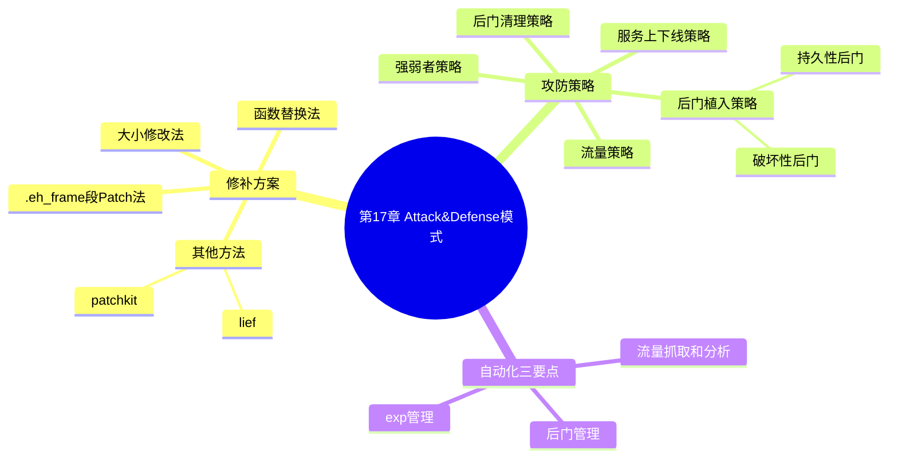

???+ abstract "本章摘要"
    本章讲解 CTF 线下赛中最原始也最正宗的 ==Attack&Defense==（A&D、攻防）模式的战术细节：前半部分按漏洞类型逐一介绍使用 IDA Keypatch 的四大补丁方案（大小修改法、函数替换法、.eh_frame 段 Patch 法与其他半自动化工具）；后半部分提炼攻防实战策略（服务上下线、后门植入、后门清理、流量、强弱者），并在文末给出 PWN 相关学习资料与练习平台，最后收束到第四篇小结。
## 章节导航

上一篇：第16章 格式化字符串漏洞
下一篇：第18章 Crypto基础
回到目录：[00-目录](00-目录.md)

## 一、Attack&Defense 模式概述

对于现在出现的诸多CTF线下赛模式来说，Attack&Defense模式又称A&D模式（攻防模式），是最原始也是最正宗的CTF攻防竞赛模式。其由Defcon推广至国内，最早由蓝莲花战队的BCTF2014呈现。后期出现了诸多变种，但是综合来说，Attack&Defense模式是最公平、公正，也是最具有挑战性的CTF线下赛模式。本章将主要介绍攻防模式下的一些策略和修补方案。

### 17.1 修补方案

在攻防模式下，漏洞修补是尤为重要的，这里会以一些常见漏洞类型不同的Patch应对方法来进行介绍。在Patch的过程中，我们通常会使用IDA的keypatch插件（http://www.keystone-engine.org/keypatch/）作为修补工具，其提供了Patcher、FillRange和Search三个功能帮助我们打补丁。

#### 17.1.1 大小修改法

在一些栈溢出或者堆溢出的特殊场景中，我们可以通过修改分配、读取、复制的内存大小来防止缓冲区溢出造成的破坏。缓冲区程序的反编译代码如图17-1所示。

```c
int __cdecl main(int argc, const char **argv, const char **envp)
{
    int buf; // [esp+1Ch] [ebp-14h]

    puts("ROP is easy is'nt it ?");
    printf("Your input :");
    fflush(stdout);
    return read(0, &buf, 100);
}
```

<div style="text-align: center;">图17-1 缓冲区程序的反编译代码</div>

如图17-1所示，此时“read(0, &buf, 100);”处存在明显的栈溢出，我们可以通过修改read的大小来修补栈溢出漏洞。从代码中我们可以看出，当读入的数据大于0x14时，可能会覆盖ebp，所以我们将read大小修改为小于0x14即可。IDA Patch功能的选项如图17-2所示。

{ width="100%" }

<div style="text-align: center;">图17-2 IDA Patch功能的选项</div>

依次选择Edit→Plugins→Keypatch Patcher，如图17-3所示，将0x64修改为0x10。

{ width="100%" }

<div style="text-align: center;">图17-3 Patcher参数设置</div>

点击Patch按钮，然后依次选择Edit→Patch program→Apple patches to input file，保存为二进制文件即可。

???+ tip "本节要点"
    1. Keypatch 插件的三个功能：Patcher、FillRange、Search，是攻防模式下打补丁的核心工具；
    2. 大小修改法适用于栈/堆溢出：把 read 等函数分配/读取/复制的大小改小，使其不再覆盖关键数据；
    3. 本例中 buf 距 ebp 为 0x14，读入大于 0x14 即覆盖 ebp，故将 read 大小 0x64 改为 0x10；
    4. 修改后要 Edit→Patch program→Apply patches to input file 保存为二进制才生效。
[OCR存疑：`is'nt` 疑为 `isn't`；`Apple patches to input file` 疑为 `Apply patches to input file`。]

#### 17.1.2 函数替换法

对于一些特殊的漏洞，比如格式化字符串漏洞，我们可以将printf函数替换为puts函数，不过这种方法通常要求程序本身带有能替换的函数。以图17-4所示的反编译代码为例。

```c
int do_fmt()
{
    int result; // eax

    while (1)
    {
        read(0, buf, 0xC8u);
        result = strncmp(buf, "quit", 4u);
        if (!result)
            break;
        printf(buf);
    }
    return result;
}

int play()
{
    puts("==============================");
    puts(" Magic echo Server");
    puts("==============================");
    return do_fmt();
}
```

<div style="text-align: center;">图17-4 程序主逻辑的反编译代码</div>

如图17-4所示，此时do-fmt()函数的printf是一个明显的格式化字符漏洞，在play函数里存在对puts函数的调用，因此，这里可以将printf替换为puts函数，具体步骤如下。

1）确定计算方法：新地址=目标地址（这里就是puts的plt地址）-当前被修改指令的下一指令地址。

2）获取puts的plt地址，该地址为0x80483B0，如图17-5所示。

{ width="100%" }

<div style="text-align: center;">图17-5 puts的plt地址</div>

3）确定被修改指令的下一指令地址为0x8048540，如图17-6所示。

{ width="100%" }

<div style="text-align: center;">图17-6 修改位置的反汇编代码</div>

4）计算出结果，并进行补码运算，如下：

```python
>>> hex(0xFFFFfff+(0x80483B0-0x8048540)+1) '0xFFFFfe70'
```

5）修改并保存：E860 FE FF->E870 FE FF，如图17-7所示。

{ width="100%" }

<div style="text-align: center;">图17-7 Patch Byte的设置</div>

结果展示如图17-8所示。

```c
int do_fmt()
{
    int result; // eax

    while (1)
    {
        read(0, buf, 0xC8u);
        result = strncmp(buf, "quit", 4u);
        if (!result)
            break;
        puts(buf);
    }
    return result;
}
```

<div style="text-align: center;">图17-8 patch后的反编译代码</div>

6）依次选择Edit→Patch program→Apply patches to input file，保存到二进制文件。

???+ tip "本节要点"
    1. 函数替换法针对格式化字符串等漏洞：把危险的 printf 换成 puts，前提是程序里已有可替换的 puts 调用；
    2. 计算相对偏移：新地址 = puts 的 plt 地址 − 当前被改指令的下一指令地址；
    3. 本例：0x80483B0 − 0x8048540 做补码运算得偏移，机器码从 E860 FE FF 改为 E870 FE FF；
    4. 修改后同样要 Patch program→Apply patches to input file 保存为二进制。
[OCR存疑：`do-fmt()` 疑为 `do_fmt()`；`格式化字符漏洞` 疑为 `格式化字符串漏洞`。]

#### 17.1.3 .eh_frame段Patch法

首先，在“.eh_frame”段写上相应的Patch代码，然后jmp到相应位置，最后再jmp到原处继续之后的逻辑，如图17-9所示。

```c
v3 = __readfqword(0x28u);
if ( dword_6041A0 )
{
    printf("Please enter the index of swordboardージ");
    read(0, &buf, &null);
    v1 = atoi(&buf);
    if ( note[2 * v1] )
         free(note[2 * v1]);
}
```

```asm
.text:0000000000402363     mov     eax, [rbp+var_14]
.text:0000000000402366     cdqe
.text:0000000000402368     sh1     rax, 4
.text:000000000040236C     mov     rdx, rax
.text:000000000040236F     lea     rax, note
.text:0000000000402376     mov     rax, [rdx+rax];
.text:000000000040237A     mov     rdi, rax
.text:000000000040237D     call     _free

...

...
```

<div style="text-align: center;">图17-9 漏洞点的关键代码</div>

如图17-9所示，第14行可能存在uaf风险，需要将释放后的指针置为0，可在.eh_frame段中将指针设为0，此时free的对象为[rdx+rax]，并将该对象赋给rdi。在执行Patch的时候，仍需要保证不影响free的对象。因此在.eh_frame中编写的代码如图17-10所示。

{ width="100%" }

<div style="text-align: center;">图17-10 Patch的主要代码</div>

将原有指针清零，最后再jmp回原逻辑。

???+ tip "本节要点"
    1. .eh_frame 段 Patch 法：在 .eh_frame 段写补丁代码，jmp 过去执行后再 jmp 回原逻辑；
    2. 适用于 use-after-free（uaf）这类需要额外逻辑的漏洞，例如 free 后将指针清零；
    3. Patch 时仍要保证不破坏 free 对象的引用关系（[rdx+rax] → rdi）；
    4. 核心手法：指针置 0 + jmp 回原处，改动最小、不影响原逻辑。
[OCR存疑：`swordboardージ` 疑为 OCR 乱码（原文如此，保留）；`sh1` 疑为 `shl`；`.eh_frame` 写法不一致但保留原文。]

#### 17.1.4 其他方法

通常而言，我们除了可以利用IDA Keypatch手动进行漏洞修补之外，还可以利用一些已有的半自动化工具进行Patch操作，如

lief（https://github.com/lief-project/LIEF）或

patchkit（https://github.com/lunixbochs/patchkit）等。

???+ tip "本节要点"
    1. 除 Keypatch 手动修补外，还有半自动化工具：lief（二进制解析/修改）、patchkit；
    2. 半自动化工具适合批量或程序化 Patch 场景；
    3. 手动 Patch 更可控，工具更适合常见漏洞的快速修复。
### 17.2 攻防策略

### 1. 服务上下线策略

很多人在看到自己的服务被打宕之后就下线，防止被植入后门不好维护，但是这种处理方式其实是错误的，需要根据具体情况来进行防守。

如果在赛场上，某道题目只有自己一支战队（或只有较少战队的flag被拿走提交，特别是在自己战队排名靠前的情况下，此时可以选择将服务下线（也就是将二进制服务删除掉），这样做可以达到两个目的：减少被植入的后门，减少修补漏洞后的后门清理工作；在不宕掉服务的情况下丢失的分数会被排名靠前的战队独享，但是服务宕掉后，可以将分数均摊给其他战队，缩小与前面战队的分数差。

如果大面积出现服务宕掉的情况，那么在保证自己的服务不会被打宕的情况下，可以选择将服务上线，让前面的人拿自己的分数，同时自己也可以获得很多别人宕掉服务的分数。

如果想要拿到exp流量或者提示流量也应该将服务上线。

### 2. 后门植入策略

后门大概可分为两种。一种是持久性后门，通过 $ \underline{\text{crontab}} $、 $ \underline{\text{at}} $等各种方式来起后门，或者直接写“.ssh”。此类后门可能是直接将提交的脚本都写进去，也就是说在流量里你甚至都看不到 $ \underline{\text{flag}} $丢失的流量。

另外一种后门是破坏性后门，通过kill all指令，或者直接通过fork bang来使gamebox的服务宕掉，所以此时会出现在拿flag的同时服务也宕掉的情况。

### 3. 后门清理策略

后门清理可以分成几种方式。如果是Web题目，要在题目权限和CTF权限上清理后门。二进制题目的后门清理方法大都具有一定的套路，su到题目权限上，然后直接kill all即可。在清理后门和进程后要注意清理crontab和at等位置。

### 4. 流量策略

通常来说，选手会拿到两种流量。一种是别的队伍攻击你的流量，另外一种是在大家都做不出题目的时候，主办方进行进攻发送的提示流量。

流量是非常重要的信息。通过定位丢失flag的流量可以快速发现别的队伍的exp。所以现在很多队伍会对流量进行混淆操作，让其他队

伍难以从流量中复现exp。分析完流量后可以进行二进制文件的修补，并复现exp。这个速度也是值得锻炼的，特别是在中层徘徊的队伍，大部分的exp靠复现，大部分的Patch靠流量。

还有一种情况刚才也提到了，在流量中你会发现没有flag丢失的流量，但是自己的flag却被提交了，这很可能是因为有后门（需要通过直接在gamebox上提交flag达到隐蔽的目的）。此时需要通过后门清理的方式来解决此类问题。

### 5. 强弱者策略

二进制漏洞的挖掘和利用的速度直接决定了一个战队在A&D模式中的强弱。弱队在觉得自己不能拿到分数的情况下，应该紧盯强队的动作，在攻击动作完成的2～3轮内完成Patch操作，在4～5轮内完成复现，这个速度越快你的排名就越靠前。所以这也决定了除了前2～3名之外，其他队伍的游戏模式会发生根本上的变化，从漏洞挖掘变成了流量分析。

上述工作中很多都可以通过脚本自动化完成。总结来说，有如下几个可以自动化实现的点。

1）流量抓取和分析：很多强队都用自己的服务来进行流量分析、定位flag等，这在现场会节约很多时间。

2）后门和管理：在赛前可以准备很多后门方便后续使用。

3）exp管理：实现exp的自动化，节约从exp到批量脚本的时间；同时应尽可能实现混淆。

???+ tip "本节要点"
    1. 服务上下线要按局势判断：自己优势领先时可下线均摊丢分、缩分差；大面积宕机时上线可反抢他人宕机分数；
    2. 后门分两类：持久性（crontab、at、.ssh，隐蔽丢 flag 无流量特征）与破坏性（kill all、fork bang 使服务宕掉）；
    3. 后门清理：Web 题要清题目权限与 CTF 权限，二进制题 su 到题目权限后 kill all，并清 crontab、at；
    4. 流量是核心资产：定位丢 flag 流量可复现别人 exp，注意对手会做流量混淆；
    5. 强弱者策略：弱队紧盯强队、2～3 轮 Patch、4～5 轮复现，前 2～3 名外游戏性质转为流量分析；
    6. 可自动化三件事：流量抓取与分析、后门管理、exp 管理（含混淆）。
[OCR存疑：`$ \underline{\text{crontab}} $` 等为 LaTeX 下划线格式残留，原文保留。]

## 相关知识链接推荐

与PWN相关的学习资料列举如下，读者可自行阅读。

- 漏洞学习系列实验：http://security.cs.rpi.edu/courses/binexpspring2015/。
- Ctfwiki，CTF技能百科全书：https://wiki.x10sec.org/。
- 各种堆漏洞利用示例：https://github.com/shellphish/how2heap。
- 堆漏洞利用技巧：

https://www.contextis.com//documents/120/Glibc_Adventures-The_Forgotten_Chunks.pdf.

- 掘金CTF——CTF中的内存漏洞利用技巧（杨坤）：

http://netsec.ccert.edu.cn/wp-content/uploads/2015/10/2015-1029-yangkun-Gold-Mining-CTF.pdf

PWN的练习平台推荐如下，读者可根据自己的情况进行选择。

- Linux系统熟练练习（初级）：https://exploit-exercises.com/。
- CTF赛题真题在线练习（初级——进阶——中级）：jarvisoj。
- CTF赛题真题练习（中级——进阶——高级）：国际赛题writeup。
- 其他（高级）：

- http://pwnable.kr/。

- https://pwnable.tw/

- https://ringzerOteam.com/。

## 本篇小结

与PWN相关的知识点比较繁杂，需要读者多动手、多实践。本篇针对的主要是小白级读者，所以介绍的内容比较粗浅，很多知识点到为止，需要读者根据自身情况去拓展。

另外，由于本篇撰写得较早，而漏洞利用技术更新迭代非常快，很多内容利用技巧和方法可能已经不适用于现有的保护机制或者很少出现在现有的CTF赛题中，但对于漏洞挖掘和利用技术来说，很多基础的东西是需要具备的，学习和分析的方法也是可以借鉴的，另外利用技术演变的过程是值得进行对比分析和研究的。

对PWN的学习，需要多动手调试，这样才能更直观地知道发生了什么以及为什么会这样，当具备了一定基础后，读者可以结合glibc源码来对堆相关的知识点进行验证和深入分析，平时多关注该领域知名人士的博客、多阅读漏洞利用相关的文章，紧跟漏洞挖掘和利用技术的发展潮流，逐步把自己磨炼成为技术牛人。

## 第四篇 CTF之Crypto

本篇主要讲解CTF中Crypto类型的题目涉及的知识和例题，主要从基础、编码、古典密码、现代密码以及真题解析几个方向进行叙述。其中基础部分讲解Crypto题目的内容和考点相关的知识，编码部分介绍各类常见密码和编解码方法，古典密码部分介绍替代密码和移位密码，现代密码部分介绍分组密码、序列密码、公钥、哈希，真题解析部分将介绍几道综合型Crypto题目。

## 本章思维导图



## 易错点

!!! warning "易错点"
    1. 服务被打宕就一味下线的做法是错的——要结合局势判断：优势领先时下线可均摊丢分、缩小分差，大面积宕机时反而应上线抢分。
    2. ==`read` 大小改到小于 0x14 即可，但要保证别改得太小影响正常输入==；同时改完必须 Apply patches to input file 保存为二进制，否则补丁不生效。
    3. ==函数替换法要求程序本身带有可替换的函数==（本例 play 里有 puts 才能替换 printf），不是所有题目都能用此方法。
    4. 后门清理只杀进程不够，还要清 crontab、at 以及题目权限与 CTF 权限上的后门。
??? note "自测题"
    **基础**
    1. Attack&Defense 模式为什么被称为最原始、最正宗的 CTF 攻防模式？它由谁推广、最早由哪支战队呈现？
    2. Keypatch 插件提供了哪三个打补丁的功能？
    3. 「大小修改法」的核心思路是什么？本章例子中为什么要把 read 大小改为小于 0x14？
    4. 「函数替换法」的原理和前提条件分别是什么？
    5. .eh_frame 段 Patch 法的大致执行流程是怎样的？适用于哪类漏洞？
    6. 除了 Keypatch 手动修补，还有哪些半自动化 Patch 工具？
> **进阶**
> 7. 函数替换法中「新地址=目标地址-当前被修改指令的下一指令地址」这个公式是做什么用的？补码运算的意义是什么？
> 8. 服务上下线的决策逻辑是什么？什么情况下下线是划算的，什么情况下应该上线？
> 9. 持久性后门和破坏性后门各自的实现手段与危害有什么不同？
> 10. 弱队在 A&D 模式下应该采取什么策略？哪些环节可以自动化？

> **参考答案**
> 1. 因为它是攻防竞赛最原初的形态；由 Defcon 推广至国内，最早由蓝莲花战队的 BCTF2014 呈现。它最公平、公正、最具挑战性。
> 2. Patcher、FillRange、Search。
> 3. 通过修改分配/读取/复制内存的大小来防止缓冲区溢出；buf 距 ebp 为 0x14，读入大于 0x14 会覆盖 ebp，所以把 read 大小改到小于 0x14。
> 4. 把危险的 printf 替换为 puts 等安全函数；前提是程序本身带有可替换的函数（如 play 里有 puts 调用）。
> 5. 在 .eh_frame 段写补丁代码→jmp 过去执行→再 jmp 回原逻辑；适用于 uaf 这类需要额外逻辑（如 free 后指针清零）的漏洞。
> 6. lief、patchkit。
> 7. 计算跳转指令的相对偏移（相对寻址），补码运算把差值转成合法的单字节机器码偏移（如 0xFFFFfe70→E870 FE FF）。
> 8. 自己（尤其排名靠前）领先、少战队拿分时下线划算——减少后门且把被独享的分数均摊给其他战队缩小分差；大面积宕机时上线，反抢他人宕机服务的分数，或为拿 exp/提示流量而上线。
> 9. 持久性：crontab、at、.ssh 等方式常驻，甚至直接内嵌提交脚本、丢 flag 无流量特征；破坏性：kill all、fork bang 使 gamebox 宕机，拿 flag 同时服务宕掉。
> 10. 紧盯强队动作，2～3 轮内完成 Patch、4～5 轮内完成复现，从漏洞挖掘转向流量分析；可自动化流量抓取与分析、后门管理、exp 管理。

## 参考资料

- 原书：CTF特训营（FlappyPig战队 著，机械工业出版社 2020）。
- Keypatch：http://www.keystone-engine.org/keypatch/
- lief：https://github.com/lief-project/LIEF
- patchkit：https://github.com/lunixbochs/patchkit
- Ctfwiki：https://wiki.x10sec.org/
- how2heap：https://github.com/shellphish/how2heap

*来源：CTF特训营（FlappyPig战队 著，机械工业出版社 2020），OCR 全内容保留整理版。*
