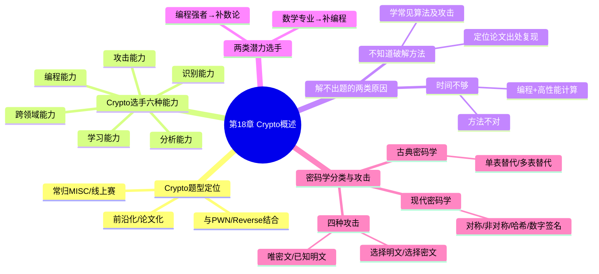

???+ abstract "本章摘要"
    本章是 Crypto 方向的入门总览。先讲 Crypto 题型的定位与趋势（常与 PWN、Reverse 相结合的走向），再概括一名合格 Crypto 选手应具备的六种能力（识别/攻击/分析/编程/学习/跨领域）与两类解不出题的常见原因，最后梳理密码学的分类（古典/现代）与四种基本攻击模型（唯密文/已知明文/选择明文/选择密文）。
## 章节导航

上一篇：第17章 流量分析与取证
下一篇：第19章 对称加密
回到目录：[00-目录](00-目录.md)

## 一、Crypto 题型的定位与趋势

纯粹密码学的考题，在CTF中被称为Crypto类型的题目，有时被归于MISC的一种，常见于线上赛，难度较高。线下赛中也会出现一些Crypto类型的题目，只是通常不会单独出现，而是结合PWN或者Web进行密码学算法的考察，此时不能称之为Crypto类型题目，但是知识点是共通的。从目前国内赛和国际赛的趋势来看，密码学类型的题目开始趋向于与PWN类型、Reverse类型的题目相结合，题目也趋向于前沿化、论文化。

与其他类型的题目相比，Crypto类型的题目对参赛者的数学功底要求很高，在很大程度上密码学的难点都是数学问题。想要成为一个合格的Crypto选手，扎实的数学功底是必须的，特别是数论的内容一定要掌握透彻。==除了数学功底之外，Crypto选手还应该锻炼如下几种能力。==

## 二、Crypto 选手的六种能力

1）==识别能力==：能够识别出题目中使用的密码算法或编码算法。

2）==攻击能力==：能够结合题目环境设置联想到针对特定算法的攻击方法。

3）分析能力：能够针对未知算法进行人工分析。

4）编程能力：能够编程实现破解该算法的程序，并对自己编写的程序的算法复杂度与运行时间有着清醒的认识。

5）学习能力：能够快速理解最新文献中的密码学攻击方法并加以实现。

6）跨领域能力：能够掌握Reverse、PWN、Web等其他领域的基本知识（因为现在Crypto与多领域结合的题目较多）。

???+ note "定义：Crypto 选手的六种能力"
    识别能力（认出密码/编码算法）、攻击能力（结合环境想到对应攻击方法）、分析能力（对未知算法人工分析）、编程能力（编程实现破解并清醒认识复杂度与运行时间）、学习能力（快速理解并实现最新文献的攻击方法）、跨领域能力（掌握 Reverse/PWN/Web 等其它领域基本知识）。
## 三、解不出题的两类原因

多数情况下，不能正确解开Crypto类型题目的原因有两种：不知道该算法的破解方法；不能在有限的时间内解开该题目。

如果是第一种原因，就需要参赛者针对常见的密码学算法及其攻击方式进行研究和学习。在实际的CTF比赛中，经常使用的密码学算法类型少之又少，比起复杂多样的Web和PWN类型的题目，Crypto可谓清爽简洁。所以，虽然不能要求你了解所有的密码学算法及其攻击方法，但是常见的密码学算法及其攻击类型都应该学习一下。好的比赛中会有一些源自最新论文的密码学题目，此类题目往往具有很高的区分度，需要选手能够找到题目对应的论文出处，并对论文中提出的方法加以实现。

如果是因为第二种原因，则可以直接认为是破解方法不对。出题者在出密码学题目的时候，考虑到比赛的时间有限，通常会保证题目能在几分钟之内破解完成。==但是，如果与同伴对算法经过仔细辩论之后还是认为需要使用这种爆破的思路去解题，那么就需要利用编程和高性能计算机去弥补时间过长的问题。==

??? note "两类解不出题的原因怎么应对？"
    ①不知道该算法的破解方法 → 系统学习常见密码算法及其攻击类型（CTF 实际用到的算法少而精，无需穷尽），好比赛的论文题需定位论文出处并复现方法；②不能在有限时间解开 → 可认为破解方法不对（出题者通常保证题目几分钟可解），若经仔细辩论仍坚持爆破思路，则用编程 + 高性能计算弥补时间。
???+ tip "本节要点"
    1. 解不出 Crypto 题的两类原因：不知道破解方法、不能在有限时间解开；
    2. 针对「不知道方法」：CTF 实际用到的密码算法「少之又少」，掌握常见算法及攻击类型即可，论文题需定位论文出处并复现；
    3. 针对「时间不够」：通常 = 破解方法不对（出题者保证几分钟可解），确需爆破时靠编程 + 高性能计算补时间。
## 四、两类潜力的 Crypto 选手

在Crypto方面有潜力的人可以分成两种：一种是数学专业的学生，他们有着很好的理论基础，对数论知识的分析能力极强，需要锻炼自己的编程能力，将理论知识转换成应用能力；另一种是编程能力较强的选手，特别擅长数据处理和并行计算等，他们要适当学习一些数学基础类课程和密码学课程，特别是要对数论等方面的知识进行深度学习，假以时日，必定能够成为优秀的CTF选手。

???+ tip "本节要点"
    1. 数学专业选手：理论基础好、数论分析能力强，短板是编程，需把理论转成应用能力；
    2. 编程强选手：擅长数据处理与并行计算，需补数学基础/密码学课程，尤其深度学数论。
## 五、密码学的分类与四种攻击

密码学可分为古典密码学和现代密码学。==古典密码学主要由单表替代、多表替代等加密方法组成，现代密码学则主要包含对称加密、非对称加密、哈希、数字签名等内容。==一般来说，密码学的攻击分为：

1）==唯密文攻击==：攻击者只拥有密文。

2）==已知明文攻击==：攻击者拥有一些与密文对应的明文。

3）选择明文攻击：攻击者可以进行加密，能够获取指定明文加密后的密文。

4）选择密文攻击：攻击者可以进行解密，能够获取指定密文解密后的明文。

???+ note "定义：四种密码学攻击模型"
    唯密文攻击（只拥有密文）、已知明文攻击（拥有部分与密文对应的明文）、选择明文攻击（可加密并获取指定明文的密文）、选择密文攻击（可解密并获取指定密文的明文）。
??? note "古典密码与现代密码怎么分？"
    古典密码学 = 单表替代、多表替代等；现代密码学 = 对称加密、非对称加密、哈希、数字签名等。
???+ tip "本节要点"
    1. 密码学分古典（单表替代、多表替代等）与现代（对称/非对称加密、哈希、数字签名）；
    2. 四种攻击模型按攻击者掌握信息递增：唯密文 → 已知明文 → 选择明文 → 选择密文；
    3. 选择明文 = 可加密（拿指定明文密文），选择密文 = 可解密（拿指定密文明文）。
## 本章思维导图

## 易错点

!!! warning "易错点"
    1. ==Crypto 常被误归为 MISC 的一种==，但纯粹密码学考题才是 Crypto；与 PWN/Web 结合考密码学时知识点共通、却不叫 Crypto 题。
    2. ==「时间不够」多半等于破解方法不对==，别一味调优爆破速度，先反思攻击思路；确需爆破再用高性能计算补时间。
    3. ==选择明文攻击与选择密文攻击别混淆==：前者是「可加密拿密文」，后者是「可解密拿明文」，权限方向相反。
??? note "自测题"
    **基础**
    1. Crypto 类型的题目和其他类型相比，最大门槛是什么？数论知识在其中的地位如何？
    2. 一名合格的 Crypto 选手应锻炼哪六种能力？
    3. 多数情况下解不出 Crypto 题的两类原因是什么？
    4. 密码学如何分类？各自包含哪些内容？
    5. 密码学攻击分为哪四种？各自的攻击者条件是什么？
    6. 为什么说和 Web/PWN 相比，Crypto 类型的题目「清爽简洁」？
    
    **进阶**
    7. 源自最新论文的密码学题目有什么特点？选手应如何应对？
    8. 「不能在有限时间解开」通常意味着什么？出题者在出题时通常会做怎样的约定？
    9. 数学专业学生和编程较强选手这两类潜力选手，各自的短板和努力方向是什么？
    10. 选择明文攻击与选择密文攻击的关键区别是什么？
    
    **参考答案**
    1. 数学功底；密码学难点很大程度是数学问题，数论内容必须掌握透彻。
    2. 识别能力、攻击能力、分析能力、编程能力、学习能力、跨领域能力。
    3. 不知道该算法的破解方法；不能在有限时间内解开该题目。
    4. 古典密码学（单表替代、多表替代等）与现代密码学（对称加密、非对称加密、哈希、数字签名等）。
    5. 唯密文攻击（只拥有密文）、已知明文攻击（拥有部分对应明文）、选择明文攻击（可加密、取指定明文密文）、选择密文攻击（可解密、取指定密文明文）。
    6. 因为 CTF 中实际用到的密码算法类型较少，不像 Web/PWN 那样复杂多样。
    7. 区分度高，需找到题目对应的论文出处并对论文方法加以实现。
    8. 通常意味着破解方法不对；出题者考虑到比赛时间有限，通常保证题目几分钟内可破解。
    9. 数学专业学生数论分析强、需练编程把理论转应用；编程强选手擅数据处理/并行计算、需补数学与密码学（尤其数论）并深度学习。
    10. 选择明文是「可加密、取指定明文加密后的密文」，选择密文是「可解密、取指定密文解密后的明文」，一个拥有加密权限、一个拥有解密权限。
## 参考资料

- 原书：CTF特训营（FlappyPig战队 著，机械工业出版社 2020）。

*来源：CTF特训营（FlappyPig战队 著，机械工业出版社 2020），OCR 全内容保留整理版。*
