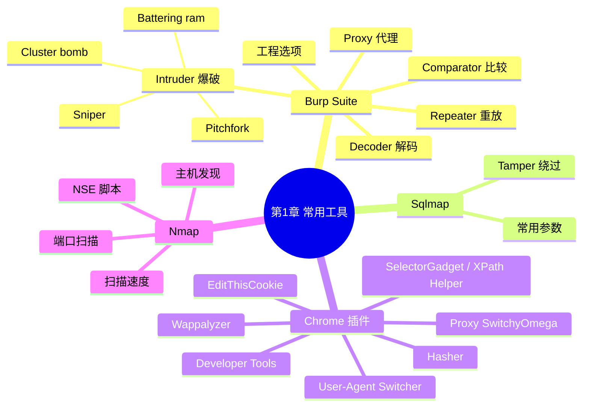

???+ abstract "本章摘要"
    本章介绍 CTF Web 方向最常用的四类工具：Burp Suite 的代理、重放、爆破、解码、比较等模块及工程选项，Sqlmap 的常用参数与 Tamper 绕过，Chrome 浏览器与常用插件（Developer Tools、Hasher、Proxy SwitchyOmega 等），以及 Nmap 的主机发现、端口扫描与扫描速度参数。
## 章节导航

上一篇：00-前言
下一篇：[第2章 SQL注入攻击](第2章 SQL注入攻击.md)
回到目录：[00-目录](00-目录.md)

## 一、Burp Suite

看到本章标题的时候，有的读者可能会想，会使用工具，有什么厉害的呢？其实不然，笔者曾听说过某SRC平台有人仅凭工具进行漏洞挖掘，拿走了将近40万的奖金，其中某个漏洞支付的奖金高达16万。

所以，在很多CTF题目或真实的渗透测试场景中，参赛者不仅要有敏锐的思维和独特的脑回路，还需要借助一些犀利的工具和脚本，才能达到事半功倍的效果。

???+ note "定义：Burp Suite"
    ==Burp Suite==（简称Burp）是一款Web安全领域的跨平台工具，基于Java开发。它集成了很多用于发现常见Web漏洞的模块，如Proxy、Spider、Scanner、Intruder、Repeater等。
所有的模块共享一个能处理并显示HTTP消息的扩展框架，模块之间无缝交换信息，可以大大提高完成Web题目的效率。接下来将为大家介绍几个在CTF中常用的模块。

### 1. Proxy代理模块

代理模块是Burp的核心模块，自然也会是我们使用最多的一个模块。它主要用来截获并修改浏览器、手机App等客户端的HTTP/HTTPS数据包。

要想使用Burp，必须先设置代理端口。依次选择Proxy→Options→Proxy Listeners→Add增加代理，如图1-1所示。

在Bind to port一栏内填写侦听的端口，这里以8080端口为例。如果要在本机使用，可以将Bind to address设置为Loopback only；如果要让局域网内的设备使用代理，则应该选择All interfaces。点击OK按钮后勾选Running，如图1-2所示。

下面以IE浏览器为例，在浏览器上依次选择Internet选项→连接→局域网设置，然后在"代理服务器"一栏中填写前文配置的Burp代理IP地址和端口，配置界面如图1-3所示。

{ width="100%" }

图1-1 设置代理

{ width="100%" }

图1-2 代理监听状态

{ width="100%" }

图1-3 IE浏览器代理设置界面

设置完成后就可以通过Burp代理来抓取IE浏览器的数据包了，如果使用的是Firefox或者是Chrome浏览器，则可在相应浏览器的配置项或插件中进行设置。

不过，以上方法会显得十分复杂，而且当我们不需要代理或需要切换代理时会非常不方便。这时候可以在浏览器中添加一些附加组件（在接下来的小节中将会介绍），从而可以方便地进行代理切换。

接下来，在Proxy→Intercept选项卡下设置Intercept is on，这样就能截获浏览器的数据包并进行修改等操作了。如果设置Intercept is off，则不会将数据包拦截下来，而是会在HTTP history中记录该请求。

在数据包内容展示界面上单击右键，可以将这个数据包发送给Intruder、Repeater、Comparator、Decoder等模块，如图1-4所示。

{ width="100%" }

图1-4 发送数据包到其他模块

???+ tip "本节要点"
    1. 代理模块用于截获并修改客户端 HTTP/HTTPS 数据包，是 Burp 的核心；
    2. 配置三步走：Proxy→Options→Proxy Listeners→Add，本机用 Loopback only，局域网用 All interfaces；
    3. Intercept is on 拦截数据包，Intercept is off 则仅记录到 HTTP history；
    4. 右键数据包可发送到 Intruder、Repeater、Comparator、Decoder 等模块。
### 2. Repeater 重放模块

在需要手工测试HTTP Header中的Cookie或User-Agent等浏览器不可修改的字段是否存在注入点，以及需要发现复杂的POST数据包中是否存在SSRF时，一般需要用到Repeater模块。

在Proxy中单击右键并选择Send to Repeater（或者Ctrl+r）就可以将截获的数据包发向Repeater模块，这个模块应属于实践中最常用的模块。在这个模块中，左边为将要发送的原始HTTP请求，右边为服务器返回的数据。在界面左侧可以方便地修改将要发送的数据包，用于手工测试Payload等操作，修改完成后点击Go按钮，即可在右侧收到服务器的响应。这里以笔者的一台虚拟机为例进行说明，如图1-5所示。

{ width="100%" }

图1-5 Repeater模块

下面详细介绍左侧的Headers和Hex标签页。

Headers标签页既可以方便地添加HTTP头信息，又可以避免在手动修改HTTP头时因缺少空格等原因产生问题。例如，我们有时候会在CTF中遇到检查IP地址的题目，此时就可以添加X-Forwarded-For、X-Real-IP等HTTP头尝试绕过。在添加之后，可以在Raw标签页中发现这个新增加的HTTP头信息。

Hex标签页更多用于修改HTTP数据包的十六进制编码。比如，可以将其用在文件上传类型的CTF题目中以截断后缀，或者是使用这些编码来对WAF进行模糊测试，并让我们可以顺利上传Webshell，该部分的相关内容将会在后面的小节中提到。

??? note "Repeater 适合做什么？"
    手工测试浏览器不可修改的字段（Cookie、User-Agent）是否存在注入点；发现复杂 POST 数据包中是否存在 SSRF；Headers 标签页加 X-Forwarded-For、X-Real-IP 绕过 IP 检查；Hex 标签页做十六进制截断后缀、WAF 模糊测试。
### 3. Intruder暴力破解模块

暴力破解（以下简称"爆破"）是一种低成本但可能带来高回报的攻击方式。大家应该了解过近些年出现的各种撞库漏洞。当然，在撞库的时候需要考虑性能和效率以进行多线程并发。这时候可以用Python或其他语言编写脚本进行撞库。Burp中也提供了简单易用的Intruder模块来进行爆破。

Intruder模块包含Sniper、Battering ram、Pitchfork、Cluster bomb等四种攻击类型，可以方便地进行Fuzz等测试。在Proxy等模块中，在想要测试的数据包上点击右键并选择Send to Intruder（或者Ctrl+1）即可将数据包发向Intruder模块。Intruder模块中包含了Target、Position、Payload、Options这四个标签页，可分别用于设置不同的功能，下面笔者将依次对其进行介绍。

在Target标签页中可以设置攻击目标的地址（Host）和目标端口（Port），并且可以选择是否使用HTTPS，如图1-6所示。

{ width="100%" }

图1-6 设置攻击目标

在Position标签页中可以设置攻击的位置和攻击的方法。攻击位置可以自动选择（一般自动选择的变量通常会比较多，不推荐自动选择）。手动选择的方法是：如果你的Burp已经进行了自动选择，那么先点击Clear§按钮，然后选择你要爆破的变量，再点击Add§按钮即可，如图1-7所示。

{ width="100%" }

图1-7 设置方法与攻击位置

接下来笔者将介绍四种攻击类型（Attack type），下面以有两个要爆破的变量为例进行说明。

#### (1) Sniper型

只需要设置一个Payload set，在两个变量的位置逐一替换Payload，每次只替换一个位置，先替换前面再替换后面。如果你的Payload set中有两个Payload，那么在爆破时会发送四次请求，结果如表1-1所示。

表1-1 Sniper型攻击请求过程

| Request | Position | Payload |
| --- | --- | --- |
| 1 | 1 | Payload_set1_Payload1 |
| 2 | 1 | Payload_set1_Payload2 |
| 3 | 2 | Payload_set1_Payload1 |
| 4 | 2 | Payload_set1_Payload2 |

#### (2) Battering ram型

只需要设置一个Payload set，在两个变量的位置同时替换相同的Payload。如果你的Payload set中有两个Payload，在爆破时会发送两次请求，结果如表1-2所示。

表1-2 Battering ram型攻击请求过程

| Request | Position | Payload |
| --- | --- | --- |
| 1 | 1,2 | Payload_set1_Payload1 |
| 2 | 1,2 | Payload_set1_Payload2 |

#### (3) Pitchfork型

需要设置两个Payload set，这时候两个变量的位置和两个Payload set是一一对应的关系。这个类型可以用来进行撞库攻击等，用你已知的账号密码去测试其他网站。爆破时会发送两个请求，结果如表1-3所示。

表1-3 Pitchfork型攻击请求过程

| Request | Position | Payload |
| --- | --- | --- |
| 1 | 1,2 | Payload_set1_Payload1, Payload_set2_Payload1 |
| 2 | 1,2 | Payload_set1_Payload2, Payload_set2_Payload2 |

#### (4) Cluster bomb型

需要设置两个Payload set，这时候每个位置的Payload将在Payload set中进行排列组合。在爆破时共要发送 $2\times2=4$ 个请求，结果如表1-4所示。

表1-4 Cluster bomb型攻击请求过程

| Request | Position | Payload |
| --- | --- | --- |
| 1 | 1,2 | Payload_set1_Payload1, Payload_set2_Payload1 |
| 2 | 1,2 | Payload_set1_Payload1, Payload_set2_Payload2 |
| 3 | 1,2 | Payload_set1_Payload2, Payload_set2_Payload1 |
| 4 | 1,2 | Payload_set1_Payload2, Payload_set2_Payload2 |

接下来介绍Payload标签页，Payload set可用于设置每个位置使用的Payload集合。Payload type可用于设置这个Payload集合的内容。Payload type中常用的选项具体包含如下几种。

- Runtime file：用于从文件中加载Payload。
- Dates：用于设置日期及日期格式。
- Numbers：用于设置数字的开始和结束以及步长。
- Character blocks：用于设置长度爆破，Fuzz超长的Post变量，有时候可以绕过WAF等。

Burp里面还提供了很多其他的Payload类型，请读者自行探索。

最后是Options标签页，在Options标签页中通常需要对Request Engine中的参数进行设置。第一个参数为线程数量，默认值为1；第二个参数为网络连接失败时的重传次数，默认为三次；第三个参数为每次重传前的暂停时间；第四个参数为调节数据包发送速度的选项；第五个参数为开始时间。读者可以根据自己的电脑性能及网络状态等因素设置这些参数。

为了方便观察结果，一般会将响应信息按照请求的返回长度或响应状态码进行排序，或者在过滤器中设置匹配字符串或者正则表达式，以便对结果进行筛选和匹配。

???+ tip "本节要点"
    1. Intruder 四种攻击类型：Sniper（单 set 逐位替换）、Battering ram（单 set 同时替换）、Pitchfork（双 set 一一对应）、Cluster bomb（双 set 排列组合）；
    2. 手动选爆破位置：先 Clear§，选中变量后 Add§，不推荐自动选择；
    3. Payload type 常用：Runtime file、Dates、Numbers、Character blocks；
    4. Options 的 Request Engine：线程数（默认 1）、失败重传次数（默认 3）、重传暂停、发送速度、开始时间；
    5. 结果按响应长度/状态码排序，或用过滤器匹配字符串/正则筛选。
### 4. Decoder解码模块

Decoder模块为我们提供了丰富的编码与解码工具，可以方便地对HTTP/HTTPS中需要的数据进行编码和解码，并且支持用文本格式或十六进制模式进行查看，如图1-8所示。

{ width="100%" }

图1-8 解码模块

在这里，将需要处理的数据输入文本框中，然后选择编码或者解码的模式。除了编码和解码以外，Decoder模块还提供了如MD5、SHA等常见的哈希算法，十分方便。==不过，在一般情况下笔者不推荐使用Smart decode进行解码，因为在CTF中智能解码一般都不准确。==

!!! warning "易错点"
    ==CTF 中不要依赖 Smart decode 智能解码==——题目数据常有非常规编码，智能解码结果不可靠，应明确选择具体的编码/解码模式。
### 5. Comparator 比较模块

在某些诸如Bool盲注的正确和错误的回显题目中，有时候两次数据包之间的差别很小，比较难发现，这时可以使用比较模块来进行比较，以发现差异，如图1-9所示。

{ width="100%" }

图1-9 比较模块

??? note "Comparator 什么时候用？"
    Bool 盲注等正确/错误回显差别很小的场景，用 Comparator 对比两次数据包的差异。
### 6. 工程选项介绍

在工程选项中，这里只介绍一些比较常用的名称解析相关的模块，如图1-10所示。

{ width="100%" }

图1-10 自定义名称解析

这里可以将域名（也可以是不存在的域名）与IP进行绑定，有时候会遇到一些有这方面需求的题目，而且后文中出现的example.com也都是在这里绑定的。

Burp的常用功能与基本的使用方式就介绍到这里，其他功能读者可以自行探索或查看官方提供的文档，文档地址为：https://portświgger.net/burp/help。

[OCR存疑：portświgger 疑为 portswigger。]

## 二、Sqlmap

???+ note "定义：Sqlmap"
    ==Sqlmap==是一款开源的渗透测试工具，其可以自动检测并利用SQL注入漏洞。Sqlmap配备了强大的检测引擎，在CTF的Web类型的题目中经常会遇到注入类型的题目（见2.2节）。如果题目比较简单，甚至可以直接用Sqlmap得到flag。
但是，一般的题目还是需要进行绕过操作的，比如绕过空格或关键字检测等，这时候则可以调用Sqlmap的一些Tamper，或者自行编写Tamper来进行绕过，从而得到flag。

Sqlmap使用Python开发，常见的Linux发行版本都自带了Python环境，但若想要在Windows系统下使用Sqlmap，则需要自行安装Python环境。在GitHub中下载源码包（https://github.com/sqlmapproject/sqlmap），解压后便可以使用了，正确安装环境并部署源码包之后，在命令行下输入python sqlmap.py后会显示类似图1-11所示的界面。

{ width="100%" }

图1-11 Sqlmap运行界面

Sqlmap提供了强大的命令行功能，而且在Burp中也存在Sqlmap的插件。下面就来介绍一些基本的参数及其作用（见表1-5）。

表1-5 Sqlmap的常用参数

| 参数 | 作用 |
| --- | --- |
| -h, --help | 显示帮助文档 |
| -u URL, --url=URL | 对指定 url 进行扫描 |
| -r REQUEST_FILE | REQUEST_FILE 为包含 HTTP 请求的数据包文件，可以从 Burp 中导出 |
| --data=DATA | 指定 POST 数据 |
| --dbs | 查询数据库 |
| --tables | 查询表 |
| --columns | 查询字段 |
| --dump | 转储数据 |
| -D DB | 指定数据库名 |
| -T TBL | 指定表名 |
| -C COL | 指定字段名 |
| --users | 查询数据库用户 |
| --privileges | 查询用户权限 |
| --threads=NUM | 设置线程数，可以根据自己电脑的性能和网络状态在 NUM 处指定数字，在 Bool 盲注时可以提高速度 |
| --user-agent=AGENT | 自定义 User-Agent |
| --random-agent | 随机选择 User-Agent |
| --tamper=TAMPER | 指定 Tamper 对 Payload 进行处理，可以指定多个 Tamper，之间使用逗号分隔 |

Tamper通常用来绕过一些过滤或者WAF，此处将为大家列举一些常见Tamper的功能（见表1-6）。这些Tamper脚本存放在Sqlmap目录下的tamper目录中，大家可以通过这些Tamper的代码学习一些绕过技巧（后面的章节也会介绍一些常见的绕过方法），或者是自己尝试编写有针对性的Tamper。

表1-6 常用Tamper及作用

| Tamper 文件名 | 作用 | Tamper 文件名 | 作用 |
| --- | --- | --- | --- |
| greatest.py | 用 Greatest 函数替代大于号 | base64encode.py | 用 Base64 编码 Payload |
| equaltollike.py | 用 like 替代等号 | space2comment.py | 使用注释符替换空格 |
| charencode.py | 用 URL 编码 Payload | unmagicquotes.py | 宽字节绕过 GPC |
| randomcase.py | 随机大小写 | apostrophemask.py | 用 utf8 替代引号 |

[OCR存疑：表1-6 中 equaltollike.py 疑为 equaltolike.py。]

此外，Sqlmap还存在sqlmapapi.py，可以方便地通过API进行调度。更多的Sqlmap指令可在官方文档中找到，文档地址为：https://github.com/sqlmapproject/sqlmap/wiki。

???+ tip "本节要点"
    1. Sqlmap 自动检测并利用 SQL 注入，简单题可直接出 flag；
    2. 绕过空格/关键字过滤时用 Tamper（自带或自写）；
    3. 数据包可从 Burp 导出后用 -r 直接喂给 Sqlmap；
    4. 常用 Tamper：greatest.py 替代大于号、equaltolike.py 替代等号、space2comment.py 注释符替换空格、base64encode.py、charencode.py 等。
## 三、浏览器与插件

由于比赛时可能会遇到兼容性方面的问题，并且题目有可能会对浏览器做出限制，或者需要考察特定浏览器的漏洞，所以笔者建议大家将IE、Firefox（开发者版本）及Chrome等主流浏览器各安装一个。本节主要介绍Chrome的插件，Firefox中也会有类似的插件。笔者不推荐用IE来答题，不过还请读者根据自己的喜好自行选择。

在Chrome中安装扩展可直接在地址栏中输入chrome://extensions/并按回车键进入，也可以依次选择右上角的设置→更多工具→扩展进入相同的界面。

这里推荐几个在日常和CTF比赛中比较常用的Chrome浏览器插件。

### 1. Developer Tools

Developer Tools是Chrome浏览器自带的开发者工具，也是最常用的功能，它集成Elements、Console、Sources、Network、Application等丰富的开发工具于一体，可以让Chrome对网页的元素、样式和脚本进行实时编辑、调试和监控。这里简单介绍一下常用面板的功能。

- Elements：查看网页源码经过浏览器渲染后的所有元素，可手动修改元素的属性和样式，并在浏览器中得到实时的反馈。
- Console：记录并显示开发者或浏览器输出的日志和调试信息，并可以作为与JS进行实时交互的命令行Shell。
- Sources：通常用于下断点调试JS。
- Network：记录发起请求后服务器响应的各种资源信息（包括状态码、资源类型、大小、耗时等），可以查看每个请求和响应的元信息。
- Application：记录网站加载的所有资源信息，包括存储数据（Local Storage、Session Storage、IndexedDB、Web SQL、Cookies）、缓存数据、字体、图片、脚本、样式表等。
- Security：从技术层面判断当前网页的安全性，如，是否有可疑代码、证书是否合法、通信链路是否安全等。注意，其并不能判断该网站是否为钓鱼网站或是否含有欺诈信息！

在CTF比赛中，需要处理JS相关的题目时，可以在Console面板中直接运行JS代码，而在XSS题目中，在Elements面板中可以方便地定位元素的位置等。

### 2. Hasher

一款可以快速计算常见哈希算法（MD5/SHA1/HMAC/CRC等）、常用加密算法（AES/DES/RC4等）、编码转换（Base64/ROT13/HTML字符实体等）、网络地址转换、时间转换及进制转换等功能的工具，与前面Burp中的Decoder模块类似。

### 3. Proxy SwitchyOmega

这是Chrome的一款代理插件，可以在多个代理配置文件之间快速切换。在前面的小节中我们说过，Burp切换代理时不是十分方便，这时候就可以将Burp与它结合，从而实现点击鼠标就能完成代理的切换。此外，在遇到内网渗透相关的题目时，打通socket隧道后也可以用它来让浏览器全局使用代理进行内网渗透。同时，它还可以配合"梯子"以实现科学上网。

### 4. Edit This Cookie

EditThisCookie是一个Cookie管理器，它可以方便地添加、删除、修改、查询和锁定站点的Cookies。这个插件可以配合XSS的题目使用，例如，当我们获得管理员的Cookies后，可以方便地修改这个站点的Cookies，从而以管理员的身份登录并进行后续获取flag的操作。

### 5. User-Agent Switcher for Chrome

这款工具可以让我们方便地进行User-Agent的切换，这一点在某些限制User-Agent的题目中可能会用到，比如模拟微信客户端UA进行访问等。

### 6. Wappalyzer

这款插件可以方便地查看当前站点的服务器型号、版本、服务器端语言等信息，可以帮我们进行一些初步的信息收集。==不过，此处获取到的信息仅可作为参考，因为部分比赛题目会使用障眼法来影响你的判断，例如，Apache服务器返回了一个伪造的IIS头。==

!!! warning "易错点"
    ==Wappalyzer 的指纹信息仅供参考==——题目可能伪造 Server 头等指纹（障眼法），不要据此作唯一判断。
### 7. SelectorGadget和XPath Helper

这两个插件都是用来定位、提取和选择指定元素的XPath，通常配合爬虫使用。

当然，Chrome中的插件还有很多，这里就不再一一举例说明了。希望大家在CTF比赛或是实际的渗透测试中也能发掘出一些好用的插件，并提高熟练度。

???+ tip "本节要点"
    1. 三个主流浏览器都装上：题目可能限制浏览器或考察特定浏览器漏洞；
    2. Developer Tools 六面板：Elements 改元素、Console 跑 JS、Sources 断点、Network 看请求、Application 看存储、Security 看安全；
    3. Proxy SwitchyOmega 一键切换代理，配合 Burp 和 socket 隧道；
    4. EditThisCookie 配合 XSS 拿到的 Cookie 冒充管理员；
    5. Wappalyzer 做初步信息收集，但注意障眼法。
## 四、Nmap

说到Nmap，想必大家在入门之前都听说过。它的设计目标是快速地扫描大型网络，当然，用它扫描单个主机也没有问题。它可以使我们方便地发现网络上有哪些主机，这些主机可以提供什么服务（应用程序名和版本），这些服务运行在什么操作系统（包括版本信息）上。Nmap还可以探测到这些主机使用了什么类型的报文过滤器或防火墙，以及其他一些很有用的功能。下面就来简单介绍一下Nmap的基本命令和使用方法。Nmap的命令格式如下：

???+ note "定义：Nmap"
    ==Nmap== 是一款网络扫描器：可快速扫描大型网络或单台主机，发现存活主机、服务（应用名与版本）与操作系统版本，并探测主机的报文过滤器/防火墙类型。
{ width="100%" }

表1-7 Nmap常用的主机发现相关的参数

| 参数 | 作用 | 参数 | 作用 |
| --- | --- | --- | --- |
| -sP | 使用 Ping 扫描 | -PE; -PP; -PM | 使用 ICMP Ping types 扫描 |
| -P0 | 不使用 Ping 扫描 | -PR | 使用 ARP Ping 扫描 |
| -PS | 使用 TCP SYN PING 扫描 | -n | 禁止 DNS 反向解析 |
| -PA | 使用 TCP SYN ACK 扫描 | -R | 反向解析域名 |
| -PU | 使用 UDP Ping 扫描 |  |  |

表1-8 Nmap常用的扫描参数

| 选项 | 作用 | 选项 | 作用 |
| --- | --- | --- | --- |
| -T | 时序扫描 | -sW | TCP 窗口扫描 |
| -p/-F | 端口扫描顺序 | -sM | TCP maimon 扫描 |
| -sS | TCP SYN 扫描（默认） | --scanflags | 自定义 TCP 扫描 |
| -sT | TCP 连接扫描 | -sI | 空闲扫描 |
| -sU | UDP 扫描 | -sO | IP 扫描 |
| -sN;-sF;-sX | 隐蔽扫描 | -b | FTP Bounce 扫描 |
| -sA | TCP ACK 扫描 |  |  |

表1-9 Nmap常用的扫描速度相关的参数

| 选项 | 作用 | 选项 | 作用 |
| --- | --- | --- | --- |
| -T0,-T1 | 慢速扫描，躲避 IDS 与 WAF 等 | -T4 | 快速扫描 |
| -T2 | 稍慢速扫描 | -T5 | 极速扫描 |
| -T3 | 默认 |  |  |

表1-10 Nmap常用的扫描端口相关的参数

| 选项 | 作用 | 选项 | 作用 |
| --- | --- | --- | --- |
| -F | 快速扫描端口（只扫描最常用的100个端口） | --top-ports | 开放率高的1000个端口的扫描（默认） |
| -r | 按照端口号从小到大的顺序进行扫描 | -p | 只扫描特定端口，如：-p 22、100-1024、9999 |

一般来说，如果我们输入命令nmap 192.168.1.1，实际上Nmap使用的是SYN扫描192.168.1.1开放率最高的1000个端口。笔者在实践中经常使用的扫描命令是：

| nmap -sS -sV -p- 192.168.1.1 |
| --- |

或：[OCR存疑：原文此处疑缺失一条命令]

此外，Nmap扫描器还支持自定义扫描脚本（NSE），并提供了大量的常见服务的相关脚本，如SQL注入检测脚本、SMB漏洞扫描脚本、FTP爆破脚本等。

更加详细和全面的Nmap资料，大家可以在Nmap官网上获取，官方文档地址为：https://nmap.org/book/man.html。

???+ tip "本节要点"
    1. Nmap 可发现主机、服务版本、操作系统，还能探测防火墙类型；
    2. 默认命令 nmap 192.168.1.1 = SYN 扫描开放率最高的 1000 个端口；
    3. 实战常用：`nmap -sS -sV -p- 192.168.1.1`（SYN 扫描 + 版本探测 + 全端口）；
    4. NSE 脚本支持 SQL 注入检测、SMB 漏洞扫描、FTP 爆破等。
## 本章思维导图

## 易错点

!!! warning "易错点"
    1. CTF 中不要用 Smart decode 智能解码，结果不可靠，要明确选择编码/解码模式。
    2. Wappalyzer 的指纹信息仅供参考，题目可能用伪造的 Server 头等障眼法误导你。
    3. ==默认 nmap 只扫 1000 个常用端口==，想要全端口扫描必须加 `-p-`，否则会漏掉非常用端口上的服务。
    4. Intruder 的 Position 自动选择变量通常过多，不推荐，要手动 Clear§ 后 Add§。
??? note "自测题"
    **基础**
    1. Burp 的 Proxy 模块有什么作用？设置代理端口要走哪条菜单路径？
    2. Repeater 和 Intruder 分别适合什么场景？
    3. Intruder 的四种攻击类型各有什么特点？Sniper 型和 Battering ram 型的区别是什么？
    4. Sqlmap 的 -u 与 -r 参数有什么区别？--dbs 的作用是什么？
    5. Nmap 默认扫描多少端口？加哪个参数实现全端口扫描？
    6. Chrome 的 Developer Tools 中 Console、Network、Application 面板分别能做什么？
    
    **进阶**
    7. 题目检查访问者 IP 时，可以如何利用 Repeater 的 Headers 标签页尝试绕过？
    8. 文件上传题目中，Hex 标签页可以怎么用？
    9. 空格被过滤时，可以调用哪个 Tamper？大于号被过滤时呢？
    10. 为什么说 Wappalyzer 的结果只能作为参考？
    
    **参考答案**
    1. 截获并修改浏览器、手机 App 等客户端的 HTTP/HTTPS 数据包；Proxy→Options→Proxy Listeners→Add。
    2. Repeater 用于手工修改并重放单个请求（如测试 Cookie、User-Agent 注入点、复杂 POST 的 SSRF）；Intruder 用于爆破与 Fuzz。
    3. Sniper 用一个 Payload set 逐一替换各位置；Battering ram 用一个 set 同时替换所有位置；Pitchfork 两个 set 与位置一一对应；Cluster bomb 两个 set 排列组合。
    4. -u 对指定 URL 扫描，-r 从 Burp 导出的数据包文件扫描；--dbs 查询数据库。
    5. 默认 SYN 扫描开放率最高的 1000 个端口；`-p-` 实现全端口扫描。
    6. Console 运行 JS 与查看日志；Network 查看每个请求/响应的元信息；Application 查看 Local Storage、Cookies 等存储数据。
    7. 在 Headers 标签页添加 X-Forwarded-For、X-Real-IP 等 HTTP 头尝试绕过 IP 检查。
    8. 用十六进制编码截断上传文件后缀，或对 WAF 进行模糊测试以顺利上传 Webshell。
    9. 空格被过滤用 space2comment.py；大于号被过滤用 greatest.py。
    10. 部分题目会伪造指纹（如 Apache 返回伪造的 IIS 头），仅凭指纹判断会被误导。
## 参考资料

- 原书：CTF特训营（FlappyPig战队 著，机械工业出版社 2020）。
- Burp Suite 官方文档：https://portswigger.net/burp/help
- Sqlmap 项目与文档：https://github.com/sqlmapproject/sqlmap
- Nmap 官方文档：https://nmap.org/book/man.html

*来源：CTF特训营（FlappyPig战队 著，机械工业出版社 2020），OCR 全内容保留整理版。*
