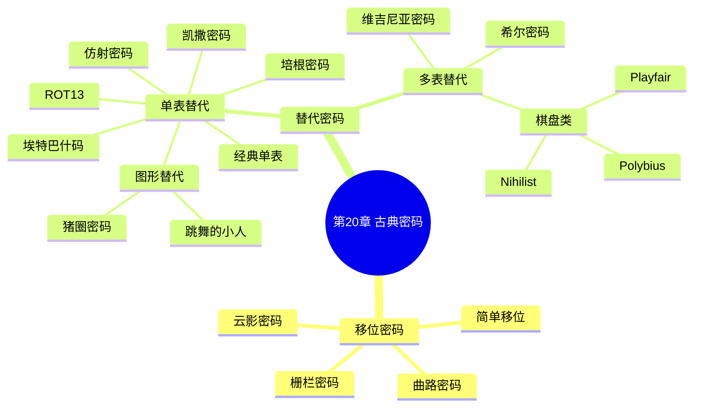

???+ abstract "本章摘要"
    本章系统讲解 CTF 中常见的古典密码，从密码与编码的本质区别（密钥 k）出发，将古典密码分为移位密码（简单移位、曲路、云影、栅栏）与替代密码（单表替代：凯撒、ROT13、埃特巴什、培根、仿射；多表替代：棋盘类、维吉尼亚、希尔）两大类，逐一给出其加解密原理、Python 实现与常见攻击策略（爆破、词频分析、已知明文攻击）。
## 章节导航

上一篇：第19章 常见编码
下一篇：第21章 现代密码
回到目录：[00-目录](00-目录.md)

## 一、古典密码概述

==古典密码作为最简单的密码加密类别，也是CTF竞赛中的常客，其对于数论的要求不是很高，很容易入门。==古典密码如今已不再单独作为加密算法使用，但是它们是许多现代密码算法的基石。

古典密码在形式上可分成移位密码和替代密码两类，其中替代密码又可分为单表替代和多表替代。

???+ tip "本节要点"
    1. 古典密码对数论要求不高，容易入门，是许多现代密码算法的基石；
    2. 形式上分为移位密码与替代密码两大类，替代密码又分单表替代与多表替代。
## 二、移位密码

### 1. 简单移位密码

==密码和编码最大的区别就是密码多了一个很关键的信息：密钥k。==

在讲解密码学的过程中，我们一般使用m代表明文，c代表密文。

移位密码在所有密码学中是最基础、最简单的一种密码形式。可以简单地将这种密码理解为明文根据密钥进行了位置的变换而得到的密文。

举个例子，样例数据如下：

m="flag{easy_easy_crypto}"
k="3124"

当明文为m，密钥为k时，移位密码首先以k的长度（也就是len(k)=4）切分m，具体如下：


| flag\no} | {eas | y_ea | sy_c | rypt |
| --- | --- | --- | --- | --- |

可以看到，总共分成了6部分，然后按照密钥3124的顺序对每一部分都进行密钥变化，变化规则如表20-1所示。

<div style="text-align: center;">表20-1 密钥变化规则表</div>


| 明文字符位置 | 1 | 2 | 3 | 4 |
| --- | --- | --- | --- | --- |
| 密文字符位置 | 3 | 1 | 2 | 4 |

上述6部分经过变化后变为如下形式：


| flag | {eas | y_ea | sy_c | rypt |
| --- | --- | --- | --- | --- |
| loa{g} | ea{s} | _eya | y_sc | yprt |

所以密文为：

lafgea{s_eyay_scyprt}o

移位密码加密完毕，可以使用Python完成此过程：

```python
def shift_encrypt(m,k):
    l=len(k)
    c="."
    for i in range(0,len(m),l):
        tmp_c=[""]*l
        if i+1>len(m):
            tmp_m=m[i:]
        else:

tmp_m=m[i:i+1]
for kindex in range(len(tmp_m)):
    tmp_c[int(k[kindex])-1]=tmp_m[kindex]
c+="".join(tmp_c)
return c

m="flag{easy_easy_crypto}"
k="3124"
print shift_encrypt(m,k)
```

[OCR存疑：上述代码第8行 `if i+1>len(m)` 疑为 `if i+l>len(m)`；第11行 `tmp_m=m[i:i+1]` 疑为 `tmp_m=m[i:i+l]`；全段代码缩进多有缺失，为 OCR 原样。]

针对移位密码的解密也非常简单，分组之后按照密钥恢复每组的明文顺序即可，代码如下：

```python
def shift_decrypt(c,k):
    l=len(k)
    m="."
    for i in range(0,len(c),l):
        tmp_m=[""]*l
        if i+l>=len(c):
            tmp_c=c[i:]
            use=[]
            for kindex in range(len(tmp_c)):
                use.append(int(k[kindex]) - 1)
            use.sort()
            for kindex in range(len(tmp_c)):
                tmp_m[kindex] =
    tmp_c[use.index(int(k[kindex])-1)]
    else:
        tmp_c=c[i:i+1]
        for kindex in range(len(tmp_c)):
            tmp_m[kindex] = tmp_c[int(k[kindex]) - 1]
    m+="".join(tmp_m)
    return m
c="lafgea{s_eyay_scyprt}o"
k="3124"
print shift_decrypt(c,k)
```

[OCR存疑：上述代码中 `tmp_m[kindex] =` 与 `tmp_c[use.index(int(k[kindex])-1)]` 因 OCR 断行分离；`tmp_c=c[i:i+1]` 疑为 `tmp_c=c[i:i+l]`；缩进缺失为 OCR 原样。]

上面仅仅只是正常加解密，下面来介绍一下移位密码的攻击策略。所谓攻击，即在不知道密钥的情况下，由密文恢复出明文。移位密码的密钥仅仅是字符变换的顺序，所以常用的攻击方式有两种：爆破和语义分析。

如果使用爆破方式，则首先爆破字段长度，然后爆破顺序。其实根本不用那么麻烦，比如下面这段密文：

lafgea{s_eyay_scyprt}o

在做题的时候，我们很清楚flag的格式是flag{xxxx}，观察上面这个密文，前4个字符flag都有，而且位置对应关系就是3124，可以直接用肉眼观测出密钥。

### 2. 曲路密码

将明文填入一个表中，并按照一定的曲路遍历，是移位密码的一种。例如，明文为abcdefghijklmnopqrstuvwxyz，曲路如图20-1所示。

{ width="100%" }


<div style="text-align: center;">图20-1 曲路密码示意图</div>


那么密文就是ejotyxcnidchmrwvqlgbafkpu。解密过程反过来遍历曲路即可。

### 3. 云影密码

云影密码仅包含01248五个数字，其中0用于分割，其余数字用于做加和操作之后转换为明文，因此解码方式如下：

```python
def c01248_decode(c):
    l=c.split("0")
    origin = "abcdefghijklmnopqrstuvwxyz"
    r="
    for i in l:
        tmp=0
        for num in i:
            tmp+=int(num)
            r+=origin[tmp-1]
    return r
print c01248_decode("8842101220480224404014224202480122")
```

[OCR存疑：上述代码 `r="` 未闭合，疑 OCR 丢掉了闭合引号；`r+=origin[tmp-1]` 缩进缺失，为 OCR 原样。]

输出结果如下：

welldone

### 4. 栅栏密码

栅栏密码是一种规则比较特殊的移位密码，其密钥只有一个数字k，表示栅栏的长度。所谓栅栏密码，就是将要加密的明文分成k个一组，然后取每组的第一个字符依次连接，拼接而成的字符串就是密文，样例数据如下：

m="flag{zhalan_mima_hahaha}"
k=4
如上，在这种情况下，首先将明文m按照长度每4个分为一组：
flag {zha lan_ mima _hahaha}
总共分成了6组，然后依次取出每组的第1个字符，如下：
f{lm_a
依次取出第2个、第3个、第4个，放置在后面，如下：
f{lm_alzaihhahnmaaga_ah}

这就是栅栏密码的加密方法，Python实现代码如下：

```python
def zhalan_encrypt(m,k):
    chip=[]
    for i in range(0,len(m),k):
        if i+k>=len(m):
            tmp_m=m[i:]
        else:
            tmp_m=m[i:i+k]
        chip.append(tmp_m)
    c=""
    for i in range(k):
        for tmp_m in chip:
            if i < len(tmp_m):
                c+=tmp_m[i]
    return c

m="flag{zhalan_mima_hahaha}"
k=4
print zhalan_encrypt(m,k)
```

栅栏密码的解密方法是加密的逆过程，Python实现代码如下：

```python
def zhalan_decrypt(c,k):
    l=len(c)
    partnum=l/k
    if l%k!=0:
        partnum+=1
    m=[""]*l
    for i in range(0,l,partnum):
        if i+partnum>=len(c):
            tmp_c=c[i:]
        else:
            tmp_c=c[i:i+partnum]
        for j in range(len(tmp_c)):
            m[j*k+i/partnum]=tmp_c[j]
        return "".join(m)
c="f{lm_alzaihhahnmaaga_ah}"

k=4

print zhalan_decrypt(c, k)
```

???+ tip "本节要点"
    1. 密码与编码的本质区别在于是否含密钥 k；m 表示明文、c 表示密文；
    2. 简单移位密码：按密钥长度切分明文，再按密钥数字顺序重排每组，攻击靠爆破字段长度/顺序或语义分析；
    3. 曲路密码：明文填入表中按曲路遍历，解密反过来遍历；
    4. 云影密码只含 01248 五个数字，0 分割、其余数字加和后映射字母；
    5. 栅栏密码密钥只有一个数字 k，明文每 k 个一组取每列字符拼接。
## 三、替代密码

替代密码如名字所示，首先建立一个替换表，加密时将需要加密的明文依次通过查表替换为相应的字符，明文字符被逐个替换后，会生成无任何意义的字符串，即密文，替代密码的密钥就是其替换表。

如果替换表只有一个，则称之为单表替代密码。如果替换表有多个，依次使用，则称之为多表替代密码。

==针对替代密码最有效的攻击方式是词频分析。==

### 1. 单表替代密码

#### (1) 凯撒密码

提起单表替代密码，不得不提的就是凯撒密码，这个密码在无数CTF竞赛中被作为考题。其原理相当简单，凯撒密码通过将字母移动一定的位数来实现加密和解密。明文中的所有字母都在字母表上向后（或向前）按照一个固定的数目进行偏移后被替换成密文。例如，当偏移量是3的时候，所有的字母A都将被替换成D，B变成E，依此类推，X将变成A，Y变成B，Z变成C。在偏移量为4的时候，字母的替代结果如下所示：

ABCDEFGHIJKLMNOPQRSTUVWXYZ
EFGHIJKLMNOPQRSTUVWXYZABCD

由此可见，位数就是凯撒密码加密和解密的密钥。因为只考虑可见字符，并且都是ASCII码，所以128是模数。

举个例子，样例数据如下：

m="flag{kaisamima}"
k=3

加密方法非常简单，在每个字符上加上k的取值3即可。使用python加密，代码如下：

```python
def caesar_encrypt(m, k):
    r=" "
    for i in m:
        r += chr((ord(i) + k) % 128)
    return r

m="flag{kaisamima}"
k=3
print caesar_encrypt(m, k)
```

结果输出如下:

iodj~nd1vdplpd

解密方法是加密的逆过程，将加号换成减号即可，代码如下：

```python
def caesar_decrypt(c,k):
    r="."
    for i in c:
        r += chr((ord(i) - k) % 128)
    return r
c="iodj~ndlvdplpd\x00"
k=3
print caesar_decrypt(c,k)
```

[OCR存疑：上述代码密文 `c="iodj~ndlvdplpd\x00"` 中 `\x00` 疑为 OCR 对 `\x7d`（即 `}`）的误读；且密文与上文加密输出 `iodj~nd1vdplpd` 存在 `1`/`l` 之差异，保留原文。]

结果如下:

flag{kaisamima}

针对单表替代密码的攻击方法本来是词频分析，但是凯撒密码的密钥的取值空间太小了，直接爆破也是很简单的攻击方法。所以针对凯撒密码的攻击方法就是爆破密钥k，样例数据如下：

c="39.4H/?BA2,0.2@.?J"

如上所示的密文c，在没有密钥k的情况下，我们爆破密钥k，并判断结果中是否包含flag格式的字符串，以爆破出明文m，代码如下：

```python
def caesar_decrypt(c,k):
    r="."
    for i in c:
        r += chr((ord(i) - k) % 128)
    return r

def caesar_brute(c,match_str):
    result = []
    for k in range(128):
        tmp = caesar_decrypt(c, k)
        if match_str in tmp:
            result.append(tmp)
    return result

c="39.4H/?BA2,0.2@.?J"
print caesar_brute(c, "flag")
```

结果如下：

['flag{brute_caesar}']

由此可见，凯撒密码是非常容易破解的。如果不知道flag的格式，match_str可以为空，那就可以打印出所有的爆破结果，然后通过

肉眼去观察哪个结果是具有语言逻辑的。

#### (2) ROT13

在凯撒密码中，有一种特例，当k=13，并且只作用于大小写英文字母的时候，我们称之为ROT13。ROT13准确来说并不能算是一种密码，而是一种编码，它没有密钥。ROT13也是CTF中的常客。

ROT13通常会作用于MD5、flag等字符串上，而我们都知道，MD5中的字符只有"ABCDEF"，其对应的ROT13为"NOPQRS"，flag对应的ROT13为"SYNT"，所以当看到这些字眼的时候，就可以识别出ROT13了。因为英文字母只有26个，所以不论是加13还是减13，效果都是一样的，所以ROT13的加密和解密函数也是一样的，示例代码如下：

```python
def rot13(m):
    r=" "
    for i in m:
        if ord(i) in range(ord('A'),ord('Z')+1):
            r+=chr((ord(i)+13-ord('A'))%26+ord('A'))
        elif ord(i) in range(ord('a'),ord('z')+1):
            r += chr((ord(i) + 13 - ord('a')) % 26 + ord('a'))
        else:
            r+=i
        return r
c="2cf24dba5fb0a30e26e83b2ac5b9e29e1b161e5c1fa7425e73043362938b9824"
print rot13(c)
print rot13(rot13(c))
```

结果如下：

2ps24qon5so0n30r26r83o2np5o9r29r1o161r5p1sn7425r73043362938o9824
2cf24dba5fb0a30e26e83b2ac5b9e29e1b161e5c1fa7425e73043362938b9824

可以看到，经过两次加密之后，字符串就恢复原状了，这是因为第二次加密实际上是一个解密的过程。

#### (3) 埃特巴什码

与凯撒密码不同的是，埃特巴什码（Atbash Cipher）的替代表不是通过移位获得的，而是通过对称获得的。其通过将字母表的位置完全镜面对称后获得字母的替代表，然后进行加密，如下：

## ABCDEFGHIJKLMNOPQRSTUVWXYZ ZYXWVUTSRQPONMLKJIHGFEDCBA

加密的Python代码如下：

```python
def atbash_encode(m):
    alphabet="ABCDEFGHIJKLMNOPQRSTUVWXYZ"
    Origin=alphabet+alphabet.lower()
    TH_A=alphabet[::-1]
    TH_a=alphabet.lower()[::-1]
    TH=TH_A+TH_a
    r="
    for i in m:
        tmp=Origin.find(i)
        if tmp!=-1:
            r+=TH[tmp]
    else:

r+=i
return r
print atbash_encode("flag{ok_atbash_flag}")
```

[OCR存疑：上述代码 `r="` 未闭合（疑 OCR 丢闭合引号），且 `else:` 后 `r+=i` 缩进错乱，为 OCR 原样。]

输出结果如下：

uozt{lp_zgyzhs_uozt}

因此，解密方式可以直接再次替换为如下内容：

```python
def atbash_encode(m):
    alphabet="ABCDEFGHIJKLMNOPQRSTUVWXYZ"
    Origin=alphabet+alphabet.lower()
    TH_A=alphabet[::-1]
    TH_a=alphabet.lower() [::-1]
    TH=TH_A+TH_a
    r="."
    for i in m:
        tmp=Origin.find(i)
        if tmp!=-1:
            r+=TH[tmp]
        else:
            r+=i
    return r
print atbash_encode(atbash_encode("flag{ok_atbash_flag}"))
```

[OCR存疑：上述代码 `alphabet.lower() [::-1]` 中 `.lower()` 与 `[::-1]` 之间多一空格，疑为 OCR 排版，保留原文。]

输出结果如下：

flag{ok_atbash_flag}

#### (4) 经典单表替代密码

上述几种密码都是单表替代密码的特例，经典的单表替代密码就是用一个替代表对每一个位置的字符进行查表替换。例如，假设替换表内容如下：

abcdefghijklmnopqrstuvwxyz

zugxjitlrkywdhfbnvosepmacq

即将所有的a替换为z，b替换为u，依此类推，加密方式如下：

```python
def
substitution_encode(m,k,origin="abcdefghijklmnopqrstuvwxyz");
    r="""
    for i in m:
        if origin.find(i) != -1:
            r += k[origin.find(i)]
    else:
        r += i
return r
print
substitution_encode("flag{good_good_study}", "zugxjitlrkywd hfbnvosepmacq")
```

[OCR存疑：上述代码函数定义 `def` 与函数名被断行；`r="""` 疑 OC​R 误读；`origin="...";` 末尾分号、`"zugxjitlrkywd hfbnvosepmacq"` 中 `wd` 与 `hf` 之间疑有空格误入，均保留原文。]

输出结果如下：

iwzt{tffx_tffx_osexc}

因为是单表替代，所以没有替代表时，爆破的难度会较高，一般来说会给出一段具有足够语言意义的密文，然后使用词频统计的方法

进行攻击，详情请参见多表替代密码。如果有替代表，则使用如下方式解密：

```python
def
substitution_decode(c,k,origin="abcdefghijklmnopqrstuvwxyz")
    r = ""
    for i in c:
        if k.find(i) != -1:
            r += origin[k.find(i)]
    else:
        r += i
return r
print
substitution_decode("iwzt{tffx_tffx_osexc)","zugxjitlrkywd hfbnvosepmacq")
```

[OCR存疑：上述代码 `def` 与函数名断行；`substitution_decode("...osexc)"` 中密文末尾的 `)` 疑为 `}` 之 OCR 误读；`r = ""` 位置及缩进错乱，保留原文。]

输出结果如下：

flag{good_good_study}

#### (5) 培根密码

培根密码一般使用两种不同的字体表示密文，密文的内容不是关键所在，关键是字体。使用AB代表两种字体，五个一组，表示密文，明密文对应如表20-2所示。

## 表20-2 培根密码对应表

| a | AAAAA | g | AABBA | n | ABBAA | t | BAABA |
| --- | --- | --- | --- | --- | --- | --- | --- |
| b | AAAAAB | h | AABBB | o | ABBAB | u-v | BAABB |
| c | AAAAAB | i-j | ABAAA | p | ABBBA | w | BABAA |
| d | AAAABB | k | ABAAB | q | ABBBB | x | BABAB |
| e | AABAA | l | ABABA | r | BAAAA | y | BABBA |
| f | AABAB | m | ABABB | s | BAAAAB | z | BABBB |

可以使用在线工具解密：

http://rumkin.com/tools/cipher/baconian.php

#### (6) 图形替代密码

猪圈密码和跳舞的小人都是典型的图形替代类密码，图形替代密码是通过将明文用图形进行替代以实现加密。猪圈密码使用不同的格子来表示不同的字母，如图20-2所示。


| A | B | C |
| --- | --- | --- |
| D | E | F |
| G | H | I |


| J | K | L |
| --- | --- | --- |
| M | N | O |
| P | Q | R |

{ width="100%" }


{ width="100%" }

<div style="text-align: center;">图20-2 猪圈密码</div>


例如，flag这四个字符就是：

{ width="100%" }


解密时一一对应即可。

跳舞的小人密码源自《福尔摩斯探案集》，是使用小人图案来表示不同的字母，同时用举旗子来表示单词结束。读者可自行在网上查找对应表。

#### (7) 仿射密码

仿射密码的替代表的生成方式依据：c=am+b mod n，其中，m为明文对应字母得到的数字，n为字符数量，c为密文，a和b为密钥。加密代码如下：

```python
def
affine_encode(m,a,b,origin="abcdefghijklmnopqrstuvwxyz"):
    r="
    for i in m:
        if origin.find(i) != -1:
            r += origin[(a * origin.index(i) + b) % len(origin)]
    else:
        r += i

return r
print affine_encode("affinecipher",5,8)
```

[OCR存疑：上述代码 `r="` 未闭合、`def` 与函数名断行、`else:` 后 `r += i` 缩进错乱，为 OCR 原样。]

输出如下：

ihhwvcswfrcp

在拥有密钥的情况下，解密只需要求出a关于n的逆元即可，即 $ m=\text{mod}_{iv}(a) \cdot (c-b)\mod n $，代码如下：

```python
def
affine_decode(c,a,b,origin="abcdefghijklmnopqrstuvwxyz"):
    r="
    n=len(origin)
    ai=primefac.modinv(a,n)%n
    for i in c:
        if origin.find(i) != -1:
            r+=origin[(ai*(origin.index(i))-b))%len(origin)]
        else:
            r+=i
    return r
print affine_decode("ihhwvcswfrcp",5,8)
```

[OCR存疑：上述代码 `r="` 未闭合、`def` 与函数名断行；`r+=origin[(ai*(origin.index(i))-b))%len(origin)]` 括号不配对，疑 OCR 误读，保留原文。]

输出如下：

affinecipher

因为明密文空间一样，所以n很容易得知。那么，在没有密钥的情况下，一般有以下几种思路：第一种是爆破，在密钥空间小的时候可

以这样做；第二种是因为仿射密码也是单表替代密码的特例，字母也是一一对应的，所以也可以使用词频统计进行攻击；第三种是已知明文攻击，如果我们知道了任意两个字符的明密文对，那么我们可以推理出密钥ab，代码如下：

```python
def
    affine_guessab(m1, c1, m2, c2, origin="abcdefghijklmnopqrstuvwxyz"):
        x1 = origin.index(m1)
        x2 = origin.index(m2)
        y1 = origin.index(c1)
        y2 = origin.index(c2)
        n = len(origin)
        dxi = primefac.modinv(x1 - x2, n) % n
        a = dxi * (y1 - y2) % n
        b = (y1 - a * x1) % n
        return (a, b)
print affine_guessab("a", "i", "f", "h")
```

输出如下：

（5，8）

### 2. 多表替代密码

#### (1) 棋盘类密码

Playfair、Polybius和Nihilist均属于棋盘类密码。此类密码的密钥为一个 $ 5\times5 $的棋盘。棋盘的生成符合如下条件：顺序随意；不得出现重复字母；i和j可视为同一个字（也有将q去除的，以保证总数为25个）。生成棋盘后，不同的加密方式使用了不同的转换方式。生成棋盘的方式如下：

```python
def gen_cheese_map(k, use_Q=True, upper=True):
    k=k.upper()
    k0="."
    origin = "ABCDEFGHIJKLMNOPQRSTUVWXYZ"
    for i in k:
        if i not in k0:
            k0+=i
    for i in origin:
        if i not in k0:
            k0+=i
    if use_Q==True:
        k0=k0[0:k0.index("J")]+k0[k0.index("J")+1:]
    else:
        k0 = k0[0:k0.index("Q")]+k0[k0.index("Q")+1:]
    if upper==False:
        k0=k0.lower()
    assert len(k0)==25
    r=[]
    for i in range(5):
        r.append(k0[i*5:i*5+5])
    return r
print gen_cheese_map("helloworld")
```

[OCR存疑：上述代码 `k0="."` 疑为 `k0=""` 之 OCR 误读；`def gen_cheese_map` 疑为 `gen_chess_map`（棋盘 chess），保留原文。]

输出结果如下：

[ 'HELOW', 'RDABC', 'FGIKM', 'NPQST', 'UVXYZ']

Playfair根据明文的位置去寻找新的字母。首先将明文字母两同一组进行切分，并按照如下规则进行加密。

1）若两个字母不同行也不同列，则需要在矩阵中找出另外两个字母（第一个字母对应行优先），使这四个字母成为一个长方形的四个角。

2）若两个字母同行，则取这两个字母右方的字母（若字母在最右方则取最左方的字母）。

3）若两个字母同列，则取这两个字母下方的字母（若字母在最下方则取最上方的字母）。

针对两个字符的变换方式如下所示：

```python
def _playfair_2char(tmp,map):
    for i in range(5):
        for j in range(5):
            if tmp[i][j] == tmp[0]:
                ai = i
                aj = j
            if tmp[i][j] == tmp[1]:
                bi = i
                bj = j
        if ai == bi:
            axi = ai

bxi=bi
axj=(aj+1)\%5
bxj=(bj+1)\%5
elif aj==bj:
    axj=aj
    bxj=bj
    axi=(ai+1)\%5
    bxi=(bi+1)\%5
else:
    axi=ai
    axj=bj
    bxi=bi
    bxj=bj
return map[axi][axj]+map[bxi][bxj]
```

[OCR存疑：上述代码中变量 `tmp[i][j]` 应为 `map[i][j]`、`\%5` 应为 `%5` 之 OCR 产物；循环与条件判断的逻辑缩进错乱，保留原文。]

因此加密方式如下所示：

```python
def playfair_encode(m, k="", cheese_map=[]):
    m=m.upper()
    origin = "ABCDEFGHIJKLMNOPQRSTUVWXYZ"
    tmp="""
    for i in m:
        if i in origin:
            tmp+=i
    m=tmp
    assert k!=" or cheese_map!=[]
    if cheese_map==[]:
        map=gen_cheese_map(k)
    else:
        map=cheese_map
    m0=[]
    idx=0
    while idx<len(m):
        tmp=m[idx:idx+2]
        if tmp[0]!=tmp[1]:
            m0.append(tmp)
            idx+=2
        elif tmp[0]!="X":
            m0.append(tmp[0]+'X')
            idx+=1
        else:
            m0.append(tmp[0]+'Q')

idx+=1
if idx==len(m)-1:
    if tmp[0] != "X":
        m0.append(tmp[0] + 'X')
        idx += 1
else:
    m0.append(tmp[0] + 'Q')
    idx += 1
r=[]
for i in m0:
    r.append(_playfair_2char(i,map))
return r
print playfair_encode("Hide the gold in the tree stump", "playfairexample")
```

[OCR存疑：上述代码 `tmp="""` 疑 OCR 误读；`assert k!=" or cheese_map!=[]` 中 `k!="` 疑为 `k!=""` 之 OCR 误读；`while` 循环尾部的 `idx+=1` 及后续 `if/else` 缩进错乱，保留原文。]

输出结果如下：

[ 'BM', 'OD', 'ZB', 'XD', 'NA', 'BE', 'KU', 'DM', 'UI', 'XM', 'MO', 'UV', 'IF']

解码方式如下所示：

```python
def _playfair_2char_decode(tmp,map)
    for i in range(5):
        for j in range(5):
            if map[i][j] == tmp[0]:
                ai = i
                aj = j
            if map[i][j] == tmp[1]:
                bi = i
                bj = j
        if ai == bi:
            axi = ai
            bxi = bi
            axj = (aj - 1) % 5
            bxj = (bj - 1) % 5
        elif aj == bj:
            axj = aj
            bxj = bj

axi=(ai-1)%5
bxi=(bi-1)%5

else:
    axi=ai
    axj=bj
    bxi=bi
    bxj=aj

return map[axi][axj]+map[bxi][bxj]

def playfair_decore(c,k="",cheese_map=[]):
    assert k != "" or cheese_map != []
    if cheese_map == []:
        map = gen_cheese_map(k)
    else:
        map = cheese_map
    r=[]
    for i in c:
        r.append(_playfair_2char_decode(i,map))
    return """.join(r)

print playfair_decore(['BM', 'OD', 'ZB', 'XD', 'NA', 'BE', 'KU', 'DM', 'UI', 'XM', 'MO', 'UV', 'IF'],"playfaiexample")
```

[OCR存疑：上述代码 `def playfair_decore` 疑为 `playfair_decode`；`"""` 疑为 `""`；`bxj=bj` 处应为 `bxj=aj`；密钥 `"playfaiexample"` 疑为 `"playfairexample"` 之 OCR 误读，均保留原文。]

输出结果如下：

HIDE THE GOLD IN THE TREX ESTUMP

Polybius密码相对简单一点，只是用棋盘的坐标作为密文，可能不一定是数字，坐标可以用字母表示，代码如下。

```python
def polybius_encode(m, k="", name="ADFGX", cheese_map=[]):
    m=m.upper()
    assert k != "" or cheese_map != []
    if cheese_map == []:
        map = gen_cheese_map(k)
    else:
        map = cheese_map
    r=[]
    for x in m:

for i in range(5):
    for j in range(5):
        if map[i][j]==x:
            r.append(name[i]+name[j])
    return r
print polybius_encode("helloworld",k="abcd")
```

[OCR存疑：上述代码 `for x in m:` 后的循环体缩进缺失、`return r` 缩进错乱，为 OCR 原样。]

输出结果如下：

['D F', 'AX', 'FA', 'FA', 'FG', 'XD', 'FG', 'GD', 'FA', 'AG']

解密方式也是参照map去寻找对应的明文，代码如下：

```python
def polybius_decode(c, k="", name="ADFGX", cheese_map=[]):
    assert k != "" or cheese_map != []
    if cheese_map == []:
        map = gen_cheese_map(k)
    else:
        map = cheese_map

    r="
    for x in c:
        i=name.index(x[0])
        j=name.index(x[1])
        r+=map[i][j]
    return r
print polybius_decode(['DF', 'AX', 'FA', 'FA', 'FG', 'XD', 'FG', 'GD', 'FA', 'AG'], k="abcd")
```

[OCR存疑：上述代码 `r="` 未闭合，疑 OCR 丢闭合引号，保留原文。]

输出结果如下：

HELLOWORLD

Nihilist和Polybius原理相同。

#### (2) 维吉尼亚密码

凯撒密码是单表替代密码，其只使用了一个替代表，维吉尼亚密码则是标准的多表替代密码。

首先，多表替代密码的密钥不再是固定不变的，而是随着位置发生改变的。在维吉利亚密码中，根据密钥的字母来选择。比如密钥是LOVE，那么明文会每四个一组进行循环，使用的密钥如表20-3所示。

<div style="text-align: center;">表20-3 维吉尼亚密码密钥实例</div>


| L-LMNOPQRSTUVWXYZABCDEFGHIJKO-OPQRSTUVWXYZABCDEFGHIJKLMNV-VWXYZABCDEFGHIJKLMNOPQRSTUE-EFGHIJKLMNOPQRSTUVWXYZABCD |
| --- |

明文的第一个位置会使用 "L" 进行加密，第二个位置会使用 "O" 进行加密，第三个位置会使用 "V" 进行加密，第四个位置会使用 "E" 进行加密，到第五个位置时又会回归到使用 "L" 进行加密。

一般情况下，维吉尼亚密码的破解必须依赖爆破+词频统计的方法来进行，推荐一个破解的网站：http://quipqiup.com/index.php。

Os drnuzearyuwn,y jtkjzoztzoes douwlr oj y ilzwex eq lsdexosa kn pwodw tsozj eq ufyoszlbz yrl rlufydlx pozw douwlrzlbz,ydderxosa ze y rlatfyr jnjzli;mjy gfbmw vla xy wbfnsy symmyew(mjy vrwm qrvvrf),hlbew rd

symmyew,mebhsymw rd symmyew,vbomgeyw rd mjy lxrzy,lfk wr dremj.Mjy

eyqybzye kyqbhjyew mjy myom xa hyedrevbfn lf bfzyewy wgxwmbmgmbrf.Wr

mjy dsln bw f1_2jyf-k3_jg1-vb-vl_1

打开网站，使用方法如图20-3和图20-4所示。

{ width="100%" }


<div style="text-align: center;">图20-3 quipquip网站使用</div>


在Puzzle中输入密文，在Clues中输入可以通过尝试推测出的明密文对应，代码如下：

dsln=flag
bw=is
mjy=the

点击solve计算结果，如图20-4所示。

{ width="100%" }


<div style="text-align: center;">图20-4 quipquip网站计算结果</div>


可以看到一条类似flag的语句，得到flag：n1_2hen-d3_hul-mi_ma_a。

对于自己破解维吉尼亚密码来说，其实也是词频统计，因为间隔密钥长度的字符使用的替代表是相同的。所以，如果密文长度足够长，并且知道密钥长度，是可以通过词频统计的方式进行破解的。

关于密钥的长度，可以使用卡西斯基试验和弗里德曼试验来获取。卡西斯基试验是类似于the这样的常用单词，如果使用了重复的密钥加密，那么两个相同的连续串的间隔将是密钥长度的倍数。获取这

样的值并计算最大公约数，就可以得到密钥长度。这种攻击方法可以参考22.2节。

#### (3) 希尔密码

希尔密码（Hill Cipher）是运用基本矩阵论原理的替换密码，由 Lester S. Hill 在 1929 年发明。将每个字母当作二十六进制数字：

A=0，B=1，C=2，依次类推。将一串字母当成n维向量，与一个n×n的矩阵相乘，再将得出的结果模26。注意，用作加密的矩阵（即密钥）在 $ Z_{26}^{n} $中必须是可逆的，否则就不可能译码。只有矩阵的行列式与26互质才是可逆的。例如，明文act：

 $$ \begin{bmatrix}0\\ 2\\ 19\end{bmatrix} $$ 

密钥：

$$ \begin{bmatrix}{{{6}}}&{{{24}}}&{{{1}}} \\{{{13}}}&{{{16}}}&{{{10}}} \\{{{20}}}&{{{17}}}&{{{15}}}\end{bmatrix} $$ 

加密过程为：

 $$ \begin{bmatrix}6&24&1\\ 13&16&10\\ 20&17&15\end{bmatrix}\begin{bmatrix}0\\ 2\\ 19\end{bmatrix}\equiv\begin{bmatrix}67\\ 222\\ 319\end{bmatrix}\equiv\begin{bmatrix}15\\ 14\\ 7\end{bmatrix}\bmod26 $$ 

所以密文为POH。

???+ tip "本节要点"
    1. 替代密码的核心是「替换表」，密钥即替换表；单表一处替换表，多表依次用多个替换表；
    2. 凯撒密码 = 对 ASCII 字符加固定偏移（模 128），密钥空间小，直接爆破或匹配 "flag" 即可；
    3. ROT13 是 k=13 只作用于英文字母的特例，加解密相同，无密钥，属编码；看到 NOPQR、SYNT 可识别；
    4. 埃特巴什码靠字母表镜面对称，加解密同函数；
    5. 培根密码用字体/AB 五元组编码，关键是字形而非内容；
    6. 仿射密码 c=am+b mod n，解密求 a 的逆元，可爆破/词频/已知明文攻击；
    7. 棋盘类（Playfair/Polybius/Nihilist）共用 5×5 棋盘，i/j 合一或去 q；
    8. 维吉尼亚密码密钥随位置循环，用卡西斯基/弗里德曼试验求密钥长度后词频破解；
    9. 希尔密码基于矩阵，密钥矩阵需在 Z₂₆ⁿ 中可逆（行列式与 26 互质）。
## 本章思维导图



## 易错点

!!! warning "易错点"
    1. ==密码与编码的本质区别是是否有密钥 k==，ROT13 无密钥，严格说是编码而非密码，别混淆。
    2. 凯撒密码实现用 `% 128` 取模，若只在字母表内偏移则应在 26 上取模，两套实现别混用。
    3. ==ROT13 只作用于大小写英文字母==，数字（如 MD5 里的 0-9）不变，看到 `NOPQR`、`SYNT` 即识别 ROT13。
    4. 培根密码的关键是「字形/字体」而非密文内容本身，解的是 AB 五元组，不是字母串。
    5. 希尔密码的密钥矩阵必须可逆（行列式与 26 互质），否则无法译码。
    6. 维吉尼亚密码破解要先确定密钥长度（卡西斯基/弗里德曼试验），间隔密钥长度的字符才共用一个替代表。
??? note "自测题"
    **基础**
    1. 密码与编码的本质区别是什么？文中用什么字符代表明文和密文？
    2. 简单移位密码的加密过程是怎样的？密钥 3124 的作用是什么？
    3. 栅栏密码的密钥是什么？加密时如何从分组中抽取字符？
    4. 凯撒密码加密时模数为什么取 128？
    5. ROT13 与一般凯撒密码的区别是什么？为什么它没有密钥？
    6. 埃特巴什码（Atbash）与凯撒密码生成替代表的方式有何不同？
    7. 培根密码的核心是什么？如何从密文还原明文？
    8. 仿射密码的加密公式是什么？解密为什么要求 a 的逆元？
    
    **进阶**
    9. 没有密钥时，仿射密码有哪几种攻击思路？
    10. 维吉尼亚密码破解为什么要先求密钥长度？卡西斯基试验的原理是什么？
    
    **参考答案**
    1. 密码多了一个关键信息「密钥 k」；用 m 表示明文、c 表示密文。
    2. 按密钥长度（len(k)=4）切分明文，再按密钥数字顺序重排每组字符；3124 表示把每组第 1 个字符放到第 3 位、第 2 个放到第 1 位、第 3 个放到第 2 位、第 4 个放到第 4 位。
    3. 密钥只有一个数字 k，表示栅栏长度；明文每 k 个一组，依次取每组的第 1 个字符拼接，再取第 2、3、4 个放在后面。
    4. 因为凯撒密码只考虑可见 ASCII 字符，字符总数为 128，所以在 128 上取模。
    5. ROT13 是 k=13 且只作用于大小写英文字母的凯撒密码特例；加密和解密函数相同（加 13 或减 13 效果一样），没有密钥，严格说是编码。
    6. 凯撒靠字母表移位，埃特巴什靠字母表位置镜面对称（A↔Z、B↔Y…）生成替代表。
    7. 关键是字体/字形，用 AB 两种样式五个一组表示一个字母，按 A/B 五元组查表还原。
    8. c=am+b mod n；解密时 m=mod_inv(a)·(c-b) mod n，需要求 a 关于 n 的逆元。
    9. ① 密钥空间小时爆破；② 词频统计（仿射是单表替代特例）；③ 已知两个明密文对可推出密钥 a、b。
    10. 因为间隔密钥长度的字符才共用一个替代表，才能用词频统计还原；卡西斯基试验利用重复连续串的间隔是密钥长度的倍数，取公约数即可得到密钥长度。
## 参考资料

- 原书：CTF特训营（FlappyPig战队 著，机械工业出版社 2020）。
- 培根密码在线解密：http://rumkin.com/tools/cipher/baconian.php
- 维吉尼亚密码在线破解：http://quipqiup.com/index.php

*来源：CTF特训营（FlappyPig战队 著，机械工业出版社 2020），OCR 全内容保留整理版。*
