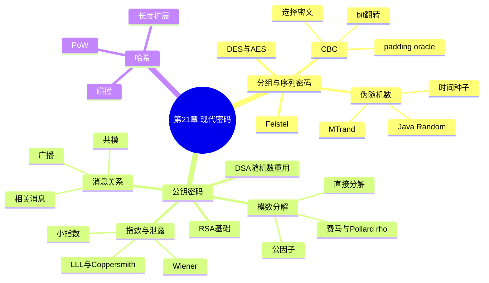

???+ abstract "本章摘要"
    本章从分组密码、序列密码与公钥密码三条主线梳理 CTF Crypto 的现代密码考点：CBC 的可塑性与预言机、伪随机数状态恢复，以及 RSA 的模数、指数、部分泄露与消息关系攻击。最后介绍哈希碰撞和长度扩展攻击，将算法性质与实际题目的攻击入口连接起来。
## 章节导航

上一篇：[第20章 古典密码](第20章 古典密码.md)
下一篇：[第22章 真题解析](第22章 真题解析.md)
回到目录：[00-目录](00-目录.md)

## 第21章 现代密码

### 21.1 分组密码和序列密码

分组密码是将明文消息编码表示后的bit序列，按照固定长度进行分组，在同一密钥控制下用同一算法逐组进行加密，从而将各个明文分组变换成一个长度固定的密文分组的密码。有一种简单的理解方式，古典密码中的替代密码，是对一个字符进行替代，分组密码则是对一个分组进行替代。序列密码是利用一个初始密钥生成一个密钥流，然后依次对明文进行加密。通常，CTF中关于序列密码的考点是如何恢复这个初始密钥。

#### 21.1.1 DES/AES基本加解密

DES属于迭代型分组密码，涉及参数包括分组长度、密钥长度、迭代次数和圈密钥长度。DES的分组长度为64bit，密钥长度为64bit，圈数为16，圈密钥长度为48bit。

AES同属于迭代型分组密码，其分组长度为128bit。当密钥长度为128bit时，圈数为10；当密钥长度为192bit时，圈数为12；当密钥长度为256bit时，圈数为14。

虽然DES现在已经被证明是不安全的，并且已经被成功攻击，但是在CTF题目中一般不会出考察关于机器性能的题目，不会去暴力破解DES或者AES。如果题目真的是寻找DES或者AES的密文，那么其一般会有一个隐藏的、颇费脑力才能解开的密钥。

在DES和AES中，有两种加解密模式：一种模式是ECB模式，一种模式是CBC模式。关于这两种模式的异同点会在下文中重点介绍，这里只需要知道CBC模式的加密会比ECB模式的加密多一个初始向量IV即可。

在Python中，我们使用PyCrypto进行DES/AES的加解密，这里选取AES进行介绍（DES的方法与之相同），代码如下：

```python
from Crypto.Cipher import AES
m="flag{aes_666666}"
key="1234567890abcdef"
iv="fedcba0987654321"
cipher = AES.new(key, AES.MODE_CBC, iv)
c=cipher.encrypt(m)
print c.encode("hex")
cipher = AES.new(key, AES.MODE_CBC, iv)
m=cipher.decrypt(c)
print m

```

输出结果如下：

f5e6826d043126e68533c613a78e8618
flag{aes_666666}

因为密文里面包含不可见字符，所以在输出时使用了hex编码。

#### 21.1.2 分组密码CBC bit翻转攻击

首先来了解两种加密模式。

· ECB：一种基础的加密模式，密文被分割成分组长度相等的块（若不足则补齐），然后单独逐个加密，并逐个输出组成密文。

· CBC：一种循环模式，前一个分组的密文与当前分组的明文进行异或操作后再加密，这样做的目的是增强破解难度。

在CBC模式下，明文分组并与前一组密文进行异或操作的模式造就了CBC模式的bit翻转攻击。

在CBC模式的密文中，在不知道密钥的情况下，如果我们有一组明密文，就可以通过修改密文，来使密文解密出来的特定位置的字符变成我们想要的字符了。

原理很简单，首先我们进行一次完整的AES的CBC模式的加密，代码如下：

```python
from Crypto.Cipher import AES
m="hahahahahahahaha1;admin=0;uid=1"
key="1234567890abcdef"
iv="fedcba0987654321"
cipher = AES.new(key, AES.MODE_CBC, iv)

c=cipher.encrypt(m)
print c.encode("hex")

```

输出结果如下：

49a98685a527bdfa4077c400963a4e3c9effb4148566f10bce9e07ccbb731896

在CBC模式的加密过程中，明文长度是32字节，16字节为一组，实际上是被分成了两组，如下：

| hahahahahahahaha | =1; admin=0; uid=1 |
| --- | --- |

在CBC模式下首先对第一组进行加密，并与初始向量iv进行异或操作，再对第二组进行加密，并与第一组的密文进行异或操作。因为第二组加密后与第一组进行异或操作了，所以，可以利用异或操作来进行明文的修改。

首先，我们找到想要修改的位置：

=1; admin=0; uid=1

我们想要将admin=0改成admin=1，也就是将第二组的第10个字符从“0”变成“1”。已知分组密码的明文和密文的长度都是相同的，都是两组，而第二组的第10个字符的密文异或过第一组的第10个字符

的密文，如果我们通过异或“0”再异或“1”，那么在解密的时候，“0”异或“0”就变成了0，也就是说，明文就变成了“1”。下面使用Python写一个攻击的函数，代码如下：

```python
def cbc_bit_attack_mul(c,m,position,target):
    l = len(position)
    r=c
    for i in range(l):
        change=position[i]-16

tmp=chr(ord(m[position[i]])^ord(target[i])^ord(c[change]))
        r=r[0:change]+tmp+r[change+1:]
    return r

```

其中c是密文，m是明文，position和target是两个长度相同的list，position代表想要改变的字符在明文中的位置（从0开始），target代表想要改变的字符。使用此函数进行攻击，代码如下：

```python
from Crypto.Cipher import AES
m="hahahahahahahahahah=1;admin=0;uid=1"
key="1234567890abcdef"
iv="fedcba0987654321"
cipher = AES.new(key, AES.MODE_CBC, iv)
c=cipher.encrypt(m)
print c.encode("hex")

def CBC_bit_attack_mul(c, m, position, target):
    l = len(position)
    r=c
    for i in range(l):
        change=position[i]-16

tmp=chr(ord(m[position[i]))^ord(target[i])^ord(c[change]))
        r=r[0:change]+tmp+r[change+1:]
    return r

c_new=cbc_bit_attack_mul(c,m, [16+10-1], ['1])
cipher = AES.new(key, AES.MODE_CBC, iv)
m=cipher.decrypt(c_new)
print m

```

输出结果如下：

49a98685a527bdfa4077c400963a4e3c9effb4148566f10bce9e07ccbb731896
♣(r i ♣ C ♣ ♣ ♣ ♣ #=1; admin=1; uid=1

可以看到，通过对攻击获取到的c_new进行解密后，admin的值成功变成了1，但是，第一组的明文变成了乱码。通常，如果CTF赛题的考点是bit翻转攻击的话，那么第一组的明文一般是无关紧要的，所以可以不用考虑这个乱码的问题。

#### 21.1.3 分组密码CBC选择密文攻击

通过CBC模式选择密文攻击，可以很快恢复出AES的向量IV。CBC模式下，明文每次加密前都会与IV异或，每组IV都会更新为上一组的密文。如果构造两个相同的C，也就是待解密的密文为C|C时，那么我们得到的密文是通过如下步骤得到的：

```python
Decrypt(C)^C=M_1

Decrypt(C)^IV=M_0

```

所以：

```python
Decrypt(C)^C^Decrypt(C)^IV=M_1^M_0

IV=M_1^M_0^C

```

即可获得IV。

```python
def cbc_chosen_cipher_recover_iv(cc,mm):
    assert cc[0:16]==cc[16:32]
    def _xorstr(a, b):
        s = ""
        for i in range(16):
            s += chr(ord(a[i]) ^ ord(b[i]))
        return s
    p0=mm[0:16]
    p1=mm[16:32]

return _xorstr(_xorstr(p0, p1), cc[0:16])
print
cbc_chosen_cipher_recover_iv("1"*32, "3eXZvNanqYff/kGAyqkXJ4WileaC78ffnZAUOJX/Q2Q=" .decode("base64"))

```

输出结果如下：

```python
iv=key\_\_is\_\_danger

```

#### 21.1.4 分组密码CBC padding oracle攻击

分组密码CBC模式的padding oracle攻击需要满足如下特定条件：

1）加密时采用了PKCS $ _{5} $的填充（填充的数值是填充的字符个数）；

2）攻击者可以和服务器进行交互，可以获取密文，服务器会以某种返回信息告知客户端的padding是否正常。

攻击效果是在不清楚key和IV的时候解密任意给定的密文。

padding oracle攻击是利用服务器通过对padding检查时的不同回显进行的。这是一种侧信道攻击。利用服务器对padding的检查，可以从末位开始逐位爆破明文。

在CBC模式下对某一个block  $ C_2 $ 的解密是根据如下算式进行的：

```python
 $ M_2 = D_k(C_2)^C_1 $。可以在 $ C_2 $前拼接一个我们构造的 $ F $，向服务器发送 $ F|C_2 $

```

解密。因此爆破最后一位明文的流程如下：

1）枚举 $ M_{2} $的最后一位x；

2）构造F的最后一位为 $ x^1 $；

3）发送并观察padding的判断结果是否正确，若错误则返回1。

使用以上方法的原因是，当F的最后一位为 $ x^1 $时，如果x的值和 $ M_2 $的最后一位相同，那么，在解密的时候有： $ D_k(C_2)[-1]^x 1=1 $，为padding的长度，进而可以确认 $ D_k(C_2)[-1] $的值。同理依次可以逆推出倒数第二位，第三位。

#### 21.1.5 Feistel结构分析

在Feistel结构中，如果右边的加密是线性的话，那么可以实现已知明文攻击。分析如下题目：

```python
import os
def xor(a,b):
    assert len(a)==len(b)
    c="."
    for i in range(len(a)):
        c += chr(ord(a[i])^ord(b[i]))
    return c

def f(x,k):
    return xor(xor(x,k),7)

def round(M,K):
    L=M[0:27]
    R=M[27:54]
    new_l=R
    new_r=xor(xor(R,L),K)
    return new_l+new_r

def fez(m,K):
    for i in K:
        m=round(m,i)
    return m

K=[]
for i in range(7):
    K.append(os.urandom(27))
m=open("flag","rb").read()
assert len(m)<54
m+=os.urandom(54-len(m))

test=os.urandom(54)
print test.encode("hex")
print fez(test,K).encode("hex")
print fez(m,K).encode("hex")

```

我们可以看到F函数就是简单的 $  \mathrm{L}^{\mathrm{~R~}} \mathrm{k}  $，并且只有7轮，那么我们列出7轮密钥和明密文的关系，可以很容易推理出k的值，然后用k再去异或密文就可以得到flag。

```python
def xor(a,b):
    assert len(a)==len(b)
    c=" "
    for i in range(len(a)):
        c += chr(ord(a[i])^ord(b[i]))
    return c

m1="c8b84d08e5a8e60a49578f387fff5a90e9e7c181734bf05be4f5403c9ea24a0b8741a329991637e11fa69019cd3b01d7c95b65f5abd5".decode("hex")
c1="5c3660c27cb9b3785a5ce06022e88bc831017e882d39475ea85d919ad9e5ac498f86c553216cab1f8f7468353d46ba8971efa9ca8c81".decode("hex")
c2="519ab6fc0e435da00516b844f8fe664bfe9445992f478dc650701739a11ffda5bbe643159d7e8cd03a2104c798a1ca734b905ee6c76".decode("hex")

#m1="a58d3c144a0a43268de2ef69c550f795cc73fe0edc9026c624c95653c06b71e17abbab4e78c61040fecd88a5df302c7e379930451298".decode("hex")
#c1="060bbfdccd57baef9f7c712be4546f8a63d12abd9b9c2e4a853046f072089125b691790a7b30e31506c22f25f231496945fb7ad4cea3".decode("hex")
#c2="9101661585e8e39fde9cdaee916763c7781a5688ce868e09750efea4919e2d5467ed4bb518072bc3015884962cf9cb7039339cc82be7".decode("hex")
c11=c1[0:27]
c1r=c1[27:54]
c21=c2[0:27]
c2r=c2[27:54]
m11=m1[0:27]
m1r=m1[27:54]

r=xor(xor(c11,c21),m1r)
print r.encode("hex")
print xor(c1r,xor(m1r,xor(m1l,xor(c2r,r)))
print r

```

#### 21.1.6 攻击伪随机数发生器

序列密码的设计思想是将种子密钥通过密钥流生成器产生的伪随机序列（也称为乱数序列）与明文简单结合生成密文。我们将与明文结合的元素称为密钥流（也称之为乱数），将产生密钥流元素的部件称为密钥流发生器。一个序列密码方案是否具有很高的密码强度主要取决于密钥流发生器的设计。

计算机中的随机数有多种生成方式，但是很多方式都存在着脆弱性，可以实现一定程度的攻击。

首先最简单的是，如果随机数发生器使用时间作为种子，那么可以对时间种子进行爆破，实现攻击。观察如下题目：

```python
class Unbuffered(object):
    def __init__(self, stream):
        self.stream = stream
    def write(self, data):
        self.stream.write(data)
        self.stream.flush()
    def __getattr__(self, attr):
        return getattr(self.stream, attr)
import sys
sys.standout = Unbuffered(sys.standout)
import signal
signal.alarm(600)

import random
import time
flag=open("/root/level0/flag","r").read()

random.seed(int(time.time()))
def check():
    recv=int(raw_input())
    if recv==random.randint(0,2**64):
        print flag
        return True
    else:
        print "tql"
        return False

while 1:
    if check():
        break

```

该题目中使用了int(time.time())作为种子，这是很容易爆破的，那么我们可以根据当前时间向前逆推，实现爆破。攻击代码如下：

```python
from zio import *
import time
import random
target="47.74.44.24",10000)

io=zio(target)

def getstream(times):
    for i in range(times-1):
        random.randint(0,2**64)
        return random.randint(0,2**64)

times=0
now=int(time.time())+10
while 1:
    now-=1
    times+=1
    seed=random.seed(now)
    io.writeline(str(getstream(times)))
    if "atum" not in io.readline():
        break

```

除了爆破种子外，还有其他的攻击方式。首先我们简单介绍一下伪随机数发生器中常常使用的一种结构，如图21-1所示。

{ width="75%" }

*图21-1 伪随机数发生器结构示意图*

当种子被输入后，通过某种算法会生成state0到staten，通过另外一种算法，每个state可以生成我们的output。我们可以通过若干个output逆推出一个完整的state，进而实现随机数的预测。以java.util.Random为例，首先它使用48bit的seed作为初态，然后state之间的变换函数为：

 $$  next\_{s}tate=(state*multiplier+addend)\bmod(2\land precision) $$

其中：

```python
multiplier=25214903917

addend=11

precision=48

```

这是一个线性变换，而state到output的变换方式为向右移动16个bit。可以通过图21-2来理解。

{ width="75%" }

*图21-2 伪随机数发生器结构示意图2*

那么它的攻击思路如图21-3所示。

{ width="75%" }

*图21-3 伪随机数发生器攻击示意图*

因为从state到output的过程中出现了信息损失，我们可以通过联立两个output的函数的方式，逆推出state，然后就可以预测后续所有的随机数。考虑如下题目：

```python
class Unbuffered(object):
    def __init__(self, stream):
        self.stream = stream
    def write(self, data):
        self.stream.write(data)
        self.stream.flush()
    def __getattr__(self, attr):
        return getattr(self.stream, attr)
import sys
sys.standout = Unbuffered(sys.standout)
import signal
signal.alarm(600)
import os
os.chdir("root/level1")

flag=open("flag","r").read()

import subprocess
o = subprocess.check_output(["java", "Main"])
tmp=[]
for i in o.split("\\n")[0:3]:
    tmp.append(int(i.strip())

v1=tmp[0] % 0xFFFFfff
v2=tmp[1] % 0xFFFFfff
v3=tmp[2] % 0xFFFFfff
print v1
print v2
v3_get=int(raw_input())
if v3_get==v3:
    print flag

```

攻击代码如下：

```python
from zio import *
import time
import random
target="47.74.44.24",10001)

io=zio(target)

v1=int(io.readline().strip())
v2=int(io.readline().strip())
def liner(seed):
    return ((seed*25214903917+11) & 0اراھااااااا

for i in range(0xFFFF+1):
    seed=v1*65536+i
    if liner(seed)>16 == v2:
        print seed
        print liner(liner(seed))>>16
        io.writeline(str(liner(liner(seed))>>16))
        print io.readline()

```

还有一种更加复杂的随机数生成方式，MTrand，这也是Python中常用的。它的state是624个32bit的words，并且state之间不是单纯的线性关系，而是由前624个生成后面624个。关系如图21-4所示。

{ width="75%" }

*图21-4 MTrand伪随机数发生器结构示意图*

从state计算output的过程如图21-5所示。

{ width="75%" }

*图21-5 MTrand伪随机数发生器产生output示意图*

在这个过程中，首先state到output的过程是完全可逆的。那么就可以利用如下方式进行攻击。首先我们收集624个int的output，然后逆向出624个state，然后就可以利用这624个state任意推理出后续的所有随机数。

代码如下：

```python
class Unbuffered(object):
    def __init__(self, stream):
        self.stream = stream
    def write(self, data):
        self.stream.write(data)
        self.stream.flush()
    def __getattr__(self, attr):
        return getattr(self.stream, attr)
    import sys
    sys.standout = Unbuffered(sys.standout)
    import os
    os.chdir("/root/level2")

    from random import *

while 1:
    a=raw_input("#")
    target=getrandbits(32)
    if a!=str(target):
        print target
    else:
        print open("flag","rb").read()

```

攻击方法如下：

```python
from zio import *
target = ("47.74.44.24", 10002)
io = zio(target)

getlist = []
for i in range(624):
    print i
    io.read_until("#")
    io.writeline("1")
    getlist.append(int(io.readline().strip()))
import libprngcrack
r = libprngcrack.crack_prng(getlist)

io.read_until("##")
io.writeline(str(r.getrandbits(32)))
io.interact()

```

其中libprngcrack.py可以在我们的git仓库中找到。

对于分组密码，还有复杂的差分攻击、积分攻击等攻击方式，对于序列密码，还有快速相关攻击等攻击方式，感兴趣的读者可以自行了解。

### 21.2 公钥密码

前面介绍的几种类型的密码有一个共同的特点，就是加密密钥与解密密钥是相同的，不同之处是密钥的使用方法，也就是说通信的双方持有的密钥是相同的，这样才能一方加密传输，一方解密获得信息。但是这样就会存在一个密钥分配的问题，即密钥是怎样分给通信双方的呢？Diffie和Hellman在1976年的论文《密码学的新方向》中提出了全新的密码思想，即一个密码体制中的加密密钥和解密密钥不同，其中，加密密钥是公开的，解密密钥是保密的，且由公开的加密密钥难以推出保密的解密密钥。这种密码体制称为公开密钥密码体制，也称为公钥密码体制。

公钥密码体制的算法很多，所有的公钥算法都是基于某个困难的数学问题而产生的，其中，最受CTF青睐的就是RSA了。学习RSA，首先需要具备一定的数论知识，否则很难理解透彻。

#### 21.2.1 RSA基础

Alice向Bob广播了一句信息：“Bob老师，我有重要情况汇报！”

Bob很聪明，他知道Alice发现了什么但是不能通过广播的方式直接汇报，于是他立即生成了两个大素数p和q，通过乘法计算出了n=p*q，并取了一个合适的素数，通常是e=65537。此时Bob掌握着4个数字(n, e, p, q)，并且广播通信，向所有人包括Alice传递了一个信息(n, e)，注意(n, e)就是加密密钥。当然攻击者Cat现在也通过广播通信截取到了(n, e)。

Alice拿到(n, e)之后，首先将重要情况信息通过hex和padding转换成一串数字m，然后进行一次计算得到了c： $ c = m^e \mod n $。转换成Python就是：

```python
c=pow(m, e, n)

```

此时，Alice掌握了四个数字 $ (c, m, e, n) $，并通过广播通信将c传给Bob，此时攻击者Cat也监听到了c，那么Alice、Bob、Cat所掌握的信息分别如下：

Alice c,m,e,n
Bob c,e,n,p,q

Bob比Cat多掌握了p和q的值，Bob通过计算e关于n的欧拉函数的逆元，可以求出d，即满足 $ e*d=1 \mod(n) $，(n)是n的欧拉函数，又因为 $ n=p*q $，所以 $ (n)=(p-1)*(q-1) $。这里可以通过扩展的欧几里得算法求出d，在primefac包中有如下算式：

```python
import primefac
d=primefac.modinv(e, (p-1)*(q-1))%((p-1)*(q-1))

```

所以Bob又多掌握了一个d，通过d可以进行如下计算 $ m=c^d \mod n $。

转化为Python代码，如下所示：

```python
m=pow(c, d, n)

```

至此，Bob通过hex处理，掌握了Alice的情报。而对于Cat来说，由于他们没有掌握p和q的值，所以无法计算出d，从而无法解密c得到m。

(d, n) 即为此密码的私钥。

整个通信过程请牢记，下面针对RSA的攻击会围绕这个过程来进行。

有的时候攻击可能不会直接给出数字，这时可以使用openssl的命令来读取pem文件中的信息。查看公钥文件的命令如下：

```bash
openssl rsa -pubin -in pubkey.pem -text -modulus

```

解密结果如下：

rsa�tul -decrypt -inkey private.pem -in flag.enc -out flag

#### 21.2.2 直接模数分解

在前文的通信过程中，n=p*q是所有计算的模数。Bob比Cat多知道的情报就是p和q，而说Cat无法破译出密码是因为Cat无法知道p和q的值，也正是因为通过分解n计算出p和q是一件很困难的事情，这就是有名的大数分解难题。

但是，如果n取值过小，Cat可以通过爆破的手段分解得到p和q，从而就可以轻而易举地破解出密文了。

在现实生活中，一般认为2048bit以上的n是安全的，但是在CTF竞赛中，并不会让选手破解那么长的n，通常n会小于等于256bit。这种情况下就要推出神器yafu，一个有名的开源模数分解神器（https://sourceforge.net/projects/yafu/）。

PyCrypto中提供了用于生成大素数、素性检测等的函数，代码如下：

```python
from Crypto.Util.number import
long_to_bytes, bytes_to_long, getPrime, isPrime
print isPrime(getPrime(1024))

```

输出结果如下：

下面我们生成两个大素数，并计算其乘积：

```python
from Crypto.Util.number import
long_to_bytes, bytes_to_long, getPrime, isPrime
p=getPrime(128)
q=getPrime(128)
n=p*q
print p
print q
print n

```

输出结果如下：

102543140947308319247809743928685897903
61018158290670105343444420109232399649
6256993605945354279979074310942065756850337682319572399209
620615130907036047

getPrime的参数是要生成的大素数的bit位。我们用命令行打开yafu，并使用factor(n)来分解n，如图21-6所示。

{ width="75%" }

*图21-6 yafu使用方法示意图*

由图21-6可以得知，使用yafu很快即可分解成功。下面我们通过一道例题来介绍一个完整的攻击流程。在CTF的题目中，选手往往是作

为Cat这一方，在没有私钥，只有公钥的情况下来获取明文。也就是说，我们目前掌握的信息如下：

```python
n=41376961156168948196303384218941117367850019509202049026037168194982219784159
e=65537
c=4161293100530874836836422603625206824589693933040432789074054165274087272587

```

题目中只给出了 $ (n,e,c) $三者的信息，为了能够计算出d从而解出c，我们必须要将n分解。继续使用yafu进行分解，如图21-7所示。

我们使用yafu成功分解了n，接下来使用分解出的p和q来计算d，从而解得明文m，代码如下：

{ width="75%" }

*图21-7 yafu使用方法示意图2*

```python
from Crypto.Util.number import
long_to_bytes, bytes_to_long, getPrime, isPrime
import primefac
def modinv(a, n):
    return primefac.modinv(a, n) % n

#from problem
n=41376961156168948196303384218941117367850019509202049026
037168194982219784159
e=65537
c=41612931005308748368364226036252068245896939330404327890
74054165274087272587
#from yafu
p=130451115685568383270871808144053983073
q=317183651045971246384245233153006206783
#calc
d=modinv(e, (p-1)*(q-1))
m=pow(c,d,n)
print long_to_bytes(m)

```

输出结果如下：

```python
flag(rsa_256bit_brute)

```

在将m转换为字符串的时候，我们使用了PyCrypto提供的long_to_bytes函数。

#### 21.2.3 费马分解和Pollard_rho分解

前文中可以直接将n分解成功的原因是Bob选择的两个大素数太小了，导致可以被爆破。即使选择p和q计算出的n很大，也会因为p和q差距过远或者过于接近而产生问题。

我们都知道 $ n=p*q $，其中，p和q都是大素数，也就是奇数，这样必定存在a和b，使得 $ a=(p+q)/2 $， $ b=(p-q)/2 $， $ n=a^2-b^2 $。这时我们通过枚举大于n的完全平方数，就可以分解n。这种方法适用于p和q的差距很小的情况，这样 $ b=(p-q)/2 $的值就很小，可以在一个很短的时间内分解完毕。以上就是费马分解的原理。

Pollard_rho分解则与之相反，Pollard_rho算法的原理就是通过某种方法得到两个整数a和b，计算p=gcd(a-b,n)，直到p不为1，或者a、b出现循环为止。然后再判断p是否为n，如果p=n成立，那么返回n是一个质数，否则返回p是n的一个因子，接着，我们又可以递归地计算Pollard(p)和Pollard(n/p)，这样，我们就可以求出n的所有质因子了。具体操作中，我们通常使用函数 $ x_2=x_1^2+c $来逐步迭代计算a和b的值，实践中，通常取c为1，即b=a^2+1，在下一次计算中，将b的值赋给a，再次使用上式来计算新的b的值，当a、b出现循环时，即可退出并进行判断。在实际计算中，a和b的值最终肯定会出现一个循环，而如

果用光滑的曲线将这些值连接起来，则可以近似地看成是一个  $ \rho $ 型的。对于Pollard_rho，它可以在 $ O(sqrt(p)) $ 的时间复杂度内找到n的一个小因子p，所以当n的两个素因子差距过大，即有一方过小的话都可以通过Pollard_rho进行分解。

在题目中是看不出是否可以使用以上两种分解方法的，因为你只能看到n的大小。不过幸运的是，yafu已经集成了上述两种分解方法，我们可以在做题的时候进行尝试。示例数据如下：

| n=40003963084931664837928689702805869527008665552550339099 |
| --- |
| 9660397836552414782717932219347083510671465404310870455755 |
| 7873545256203398133147742886667634689260940869337064075066 |
| 6094586030306611707290485539584897620500431213781096229928 |
| 7381552449300766105225260113447885298725734181704824515128 |
| 33863359887844080223 |
| e=65537 |
| c=45467951339908792054500021483518298236395846525441668793 |
| 4456047449525960033743567173500481739066410954430849010592 |
| 6502308966705116695535035592562727138662665331619216044921 |
| 2038838205382718010919644475045497101659405979532162352440 |
| 4323105909723162531844619963882495059819497474740269955274 |
| 6346829359679622002 |

使用 yafu 进行分解，如图 21-8 所示。

{ width="75%" }

*图21-8 yafu使用方法示意图3*

由图21-8可知，使用yafu很快即可分解完毕，我们可以看到即使n的长度是1024bit的，也会由于其中一个素因子太小而导致成功分解。分解成功后，我们利用分解出的p和q计算出d，进而求得如下明文：

```python
from Crypto.Util.number import
long_to_bytes,bytes_to_long,getPrime,isPrime
import primefac
def modinv(a,n):
    return primefac.modinv(a,n) % n
n=40003963084931664837928689702805869527008665552550339099
9660397836552414782717932219347083510671465404310870455755
7873545256203398133147742886667634689260940869337064075066

6094586030306611707290485539584897620500431213781096229928738155244930076610522526011344788529872573418170482451512833863359887844080223
e=65537
c=4546795133990879205450002148351829823639584652544166879344560474495259600337435671735004817390664109544308490105926502308966705116695535035592562727138662665331619216044921203883820538271801091964447504549710165940597953216235244043231059097231625318446199638824950598194974747402699552746346829359679622002
p=2216926567
q=18044784919992194237585989334578563660204747572295361057832476137066041790220376398211438074695212284147383328992141008273893825361573862824688985896794753602992647361219820726062881047431512552434281683132367144586261697813029063103899933971099643790107555395987335773839106223531693331380363831369
d=modinv(e, (p-1)*(q-1))
m=pow(c,d,n)
print long_to_bytes(m)

```

结果输出如下:

flag{yafu_is_great}

我们再来看一道例题，题目提供的信息如下:

```python
n=3161262255255421133292506694323988711204792818702640666084331634444148712428915950639954540974469931426618702044672318134908678730641981414037034058320359158246813987154679178159391832232990193738454116371045928434239936027006539348488316754611586659587677659791620481200732564068367148541242426533823626586574915275209508300120574819113851895932912208783915652764568319771482309338434364094681579135086703127977870534715039005822312878739611630155714313119545610939253355808742646891815442758660278514976431521933763272615653261044607041876212998883732724662410197038419721773290601109065965674129599626151139566369

e=65537

c=631583911592660652215412683088688785438938386403323323131247534561958531288570612134139288090533619548876156447498627938626419617968918299212863936839701943643735437264304062828205809984533592547599060829451668240569384130130080928292082888526567902695707215660020201392640388518379063244487204881439591813398495285025704285781072987024698133147354238702861803146548057736756003294248791827782280722670457157385205787259979804892966529536902959813675537028879407802365439024711942091123058305460856676910458268097798532901040050506906141547909766093323197363034959926900440420805768716029052885452560625308314284406

```

这里n是2048bit，同样也适用于利用yafu进行分解，如图21-9所示。

由图21-9可以看出，即使p和q都很大，都是1024bit，也会由于两者之间差距的太小，从而在很快的时间内被分解出来。后续工作不必多说，与前面的相同，代码如下：

```python
from Crypto.Util.number import
long_to_bytes, bytes_to_long, getPrime, isPrime
import primefac
def modinv(a, n):
    return primefac.modinv(a, n) % n

n=31612622552554211332925066943239887112047928187026406660
843316344414871242891595063995454097446993142661870204467
2318134908678730641981414037034058320359158246813987154679
1781593918322329901937384541163710459284342399360270065393
4848831675461158665958767765979162048120073256406836714854
1242426533823626586574915275209508300120574819113851895932
9122087839156527645683197714823093384343640946815791350867
0312797787053471503900582231287873961163015571431311954561
0939253355808742646891815442758660278514976431521933763272
6156532610446070418762129988837327246624101970384197217732
90601109065965674129599626151139566369

```

{ width="75%" }

*图21-9 yafu使用方法示意图4*

{ width="72%" }

```python
6375614107934719809398451422359883451257033337168560937824719275885709824193760523306327217910106187213556299122895037021898556005848447
q=56225103425920179745019828423382255030086226600783237398582720244250840205090747144995470046432814267877822949968612053620215667790366338413979256357713975498764498045710766375614107934719809398451422359883451257033337168560937824719275885709824193760523306327217910106187213556299122895037021898556005848927
d=modinv(e, (p-1) * (q-1)) % ((p-1) * (q-1))
m=pow(c, d, n)
print long_to_bytes(m)

```

结果输出如下：

flag{yafu_is_great_2}

#### 21.2.4 公约数模数分解

如果Alice和Bob之间进行了两次消息传递的过程，且Bob不小心在两次通信中生成的大素数有一个是相同的，那么Cat就可以通过对两次通信的n进行求公约数的计算进而分解出两次通信的n。示例数据如下：

| n1=20738684819333548643191606154039112721439040675563306544625610909152027142345256262044893684039033760000345977227424255285988276861540874795272459885167107786711703072061037153346655860470716109813270970850484359246596333995482370527386351240478391323324528003628936781466053608725537623942740662936457390959060237568952795905984480747252131953431486919915454767666173211766324971698216729056823719403935948246337025169136328423690760181754201413129998612840290312288870691831451331041035467130371628700808661866849510093563933041998781857605089430254020646589100840668279175307364268614722979502349459733201313546503e1=65537c1=10090071772506699356786817523796638879795767956430881122259413581074147487255697901583915872785212226386740804827031504209013873678271195490184347976909726113849992567822732157901385759397285354278581100781103793501095790350579211837202869075148545917946318684882307466012864770911316092169851618822067233715426324048255853708450136404819266324205387044518115007295318784925546421927454569531083129940396100397500370100209536940952970102117541579218613344705063697081553171695308476917272505352835269504338531141476596188545187942246478960128160164215522712217334328256482344238841803967431362175455511277916355166899n2=878694363144561890728567357812896906573640784523197867606351774399014997167610859083801847814153926783013529738894633813311821250175399588172832350502802204668189285239027528757845589294842002240172592437039145913325644279117109076704408399599880119140534125194348645296775405922662 |
| --- |

| 5932411826416078823933001491318960906984915240483169327050095599908132247012527635762389099349506096964924979658397390303632051436652851864517075326335258047336448737074832375662685357471901942613707493194883688141285652944494050725201823425363699537027265328300525799788818915926941670469334797614788843342658967211459367897335358473 |
| --- |
| e2=65537 |
| c2=2376551337745495498143783836277905001359434157198875983392352023653607956661119590940353134537809948406199264950807793814467908135189088355697785995909979521012650621199555373370092020230056650644191695731622240605564238060013790626918092343022945758900319577845906202131059334831755086808000264738974511885291809342237068425531476274334194179741298917802236690469954206288086549174681813931598960921390785087102754534749899379867108150767902748565046767786034338660373855710245844554905441305478943537774211805862142044160564509820005472808015696120569279067519522505841771038640641946630692512034529992860041798564 |

这种攻击情况通常适用于多组加密过程，并且e为65537，同时n都很大的情况。下面对 $ n_{1} $和 $ n_{2} $进行gcd计算，代码如下：

| import primefac |
| --- |
| n1=207386848193335486431916061540391127214390406755633065 |
| 446256109091520271423452562620448936840390337600003459772 |
| 274242552859882768615408747952724598851671077867117030720 |
| 610371533466558604707161098132709708504843592465963339954 |
| 823705273863512404783913233245280036289367814660536087255 |
| 376239427406629364573909590602375689527959059844807472521 |
| 319534314869199154547676661732117663249716982167290568237 |
| 194039359482463370251691363284236907601817542014131299986 |
| 128402903122888706918314513310410354671303716287008086618 |
| 668495100935639330419987818576050894302540206465891008406 |
| 68279175307364268614722979502349459733201313546503 |
| n2=878694363144561890728567357812896906573640784523197867 |
| 606351774399014997167610859083801847814153926783013529738 |
| 894633813311821250175399588172832350502802204668189285239 |
| 027528757845589294842002240172592437039145913325644279117 |
| 109076704408399599880119140534125194348645296775405922662 |
| 593241182641607882393300149131896090698491524048316932705 |

0095599908132247012527635762389099349506096964924979658397390303632051436652851864517075326335258047336448737074832375662685357471901942613707493194883688141285652944494050725201823425363699537027265328300525799788818915926941670469334797614788843342658967211459367897335358473
```python
print primefac.gcd(n1,n2)
```

## 结果输出如下:

138208427362519321415796957719893409115158845620691465306429847756182160793457792813274524318954977765983352345599351851847522651053763764408505742877046122880607112556561553947348312144520937951670858255004254249125124519847923450697994182336796590877082479065096323414024512145988695828388117148558948090639

通过最大公约数的计算得到了 $ n_{1} $和 $ n_{2} $都有一个共同的素因子p，那么接下来的工作就简单了。通过 $ n_{1} $、 $ n_{2} $分别去除素因子p，可以成功分解 $ n_{1} $和 $ n_{2} $，后续步骤与之前一样。下面解密两段密文，代码如下：

```python
from Crypto.Util.number import
long_to_bytes, bytes_to_long, getPrime, isPrime
import primefac
def modinv(a, n):
    return primefac.modinv(a, n) % n
n1=207386848193335486431916061540391127214390406755633065
446256109091520271423452562620448936840390337600003459772
274242552859882768615408747952724598851671077867117030720
610371533466558604707161098132709708504843592465963339954
823705273863512404783913233245280036289367814660536087255
376239427406629364573909590602375689527959059844807472521
319534314869199154547676661732117663249716982167290568237
194039359482463370251691363284236907601817542014131299986
128402903122888706918314513310410354671303716287008086618
668495100935639330419987818576050894302540206465891008406
68279175307364268614722979502349459733201313546503

n2=8786943631445618907285673578128969065736407845231978676063517743990149971676108590838018478141539267830135297388946338133118212501753995881728323505028022046681892852390275287578455892948420022401725924370391459133256442791171090767044083995998801191405341251943486452967754059226625932411826416078823933001491318960906984915240483169327050095599908132247012527635762389099349506096964924979658397390303632051436652851864517075326335258047336448737074832375662685357471901942613707493194883688141285652944494050725201823425363699537027265328300525799788818915926941670469334797614788843342658967211459367897335358473
p1=primefac.gcd(n1,n2)
p2=p1
q1=n1/p1
q2=n2/p2
e1=65537
e2=65537
d1=modinv(e1,(p1-1)*(q1-1))
d2=modinv(e2,(p2-1)*(q2-1))
m1=pow(c1,d1,n1)
m2=pow(c2,d2,n2)
print long_to_bytes(m1)
print long_to_bytes(m2)

```

结果输出如下:

flag{first_part}
flag{second_part}

#### 21.2.5 其他模数分解方式

当上面的几种方法都无法分解模数时，可以尝试使用一些网站来进行分解，如http://factordb.com/index.php。

有的时候，题目中也会提供一些其他信息来辅助选手分解n。下面来看一道真题，来自于MMA CTF 2016:

| n=19402643768027967294480695361037227649637514561280461352 |
| --- |
| 7084201921973289935127108520878719863491843834420315449452 |
| 6396647744668558716802515477506017878289709799394980084590 |
| 3218890975275725416699258462920097986424936088541112790958 |
| 8752113361882491072807536614676195110796490702486595362822 |
| 6726792866926525293518444863899787759378193010386641694958 |
| 5686541509642494048554242004100863315220430074997145531929 |
| 1282008857582740378753495390186693362634698032772810486571 |
| 9811484441323675468054987447275352886643468604879983338154 |
| 2018876362229842605213500869709361657000044182573308825550 |
| 237999139442040422107931857506897810951 |
| npp=194026437680279672944806953610372276496375145612804613 |
| 5270842019219732899351271085208787198634918438344203154494 |
| 5263966477446685587168025154775060178782897097993949800845 |
| 9032188909752757254166992584629200979864249360885411127909 |
| 5887521133618824910728075366146761951107964907024865953628 |
| 2267267928669265252935757418867172314593546678104100129027 |
| 3392560689409874128167797443399949716651095556804014673244 |
| 8739754185248680577030089506331508396544509846796673890539 |
| 2320963293379345531703349669197397492241574949069875012089 |
| 1727540142317831609604255311602462673896570345433429909406 |
| 80603153790486530477470655757947009682859 |
| e=65537 |
| c=79912191895910145721966238173857378790272081084698008026 |
| 2970656425850862601067451387549602917729057581965036680273 |
| 0803283761137036255380767766538866086463895539973594615882 |
| 3219747381409316893338731061244598493225567545790100625419 |
| 8813821117657462166810122853176982835828997315039334310994 |

| 8611583609219420213530834364837438730411379305046156670015 |
| --- |
| 0245472630199322889898082280916012069487413042221977798085 |
| 9273807511102467898227385692258661541523855521114884742758 |
| 9678238745186253649783665607928382002868111278077054871294 |
| 8379231895367142350440419935411584029433721887797979967117 |
| 92610439969105993917373651847337638929 |

题目中在提供了(n, e, c)的同时，还提供了npp的值，npp的值为

```python
 $ (p+2)*(q+2) $。构造一个方程： $ x^{2}-(p+q)x+p*q=0 $。此方程中 $ (p+q) $的值和pq的值都可以通过npp和n转化得到，而此方程的两个根即为p和q的值。

```

此题的c经过了n和npp两次加密，攻击代码如下：

| n=19402643768027967294480695361037227649637514561280461352708420192197328993512710852087871986349184383442031544945263966477446685587168025154775060178782897097993949800845903218890975275725416699258462920097986424936088541112790958875211336188249107280753661467619511079649070248659536282267267928669265252935184448638997877593781930103866416949585686541509642494048554242004100863315220430074997145531929128200885758274037875349539018669336263469803277281048657198114844413236754680549874472753528866434686048799833381542018876362229842605213500869709361657000044182573308825550237999139442040422107931857506897810951 |
| --- |
| npp=19402643768027967294480695361037227649637514561280461352708420192197328993512710852087871986349184383442031544945263966477446685587168025154775060178782897097993949800845903218890975275725416699258462920097986424936088541112790958875211336188249107280753661467619511079649070248659536282267267928669265252935757418867172314593546678104100129027339256068940987412816779744339994971665109555680401467324487397541852486805770300895063315083965445098467966738905392320963293379345531703349669197397492241574949069875012089172754014231783160960425531160246267389657034543342990940680603153790486530477470655757947009682859 |
| e=65537 |

```python
pq=n
pqq=(npp-n-4)/2
import gmpy2
gn1=gmpy2.mpz(n)
gn2=gmpy2.mpz(npp)
a=gmpy2.mpz(1)
b=gmpy2.mpz(-pq)
c=gmpy2.mpz(n)
i=gmpy2.mpz(gmpy2.iroot(b*b-4*a*c,2)[0])
x1=(-b-i)/2
x2=(-b+i)/2
print x1*x2-n
p1=x1
q1=x2
p2=x1+2
q2=x2+2
print p1
print p2
print q1
print q2
from Crypto.Util.number import
long_to_bytes,bytes_to_long,getPrime,isPrime
import primefac
def modinv(a,n):
    return primefac.modinv(a,n) % n
c=79912191895910145721966238173857378790272081084698008026
2970656425850862601067451387549602917729057581965036680273
0803283761137036255380767766538866086463895539973594615882
3219747381409316893338731061244598493225567545790100625419
8813821117657462166810122853176982835828997315039334310994
8611583609219420213530834364837438730411379305046156670015
0245472630199322889898082280916012069487413042221977798085
9273807511102467898227385692258661541523855521114884742758
9678238745186253649783665607928382002868111278077054871294
8379231895367142350440419935411584029433721887797979967117
92610439969105993917373651847337638929
d2=modinv(65537,(p2-1)*(q2-1))
m2=pow(c,d2,npp)
d1=modinv(65537,(p1-1)*(q1-1))
m1=pow(m2,d1,n)
print long_to_bytes(m1)

```

{ width="75%" }

*图21-10 代码运行结果*

#### 21.2.6 小指数明文爆破

Alice拿到Bob传给她的公钥(n, e)，如果Bob使用的e太小了，比如e=3，且Alice要传给Bob的明文也很小，比如就几个字节，那么，Alice在进行加密的过程中使用的公式 $ c=m^{e}mod n $中，e=3，m很小，而n很大，所以有可能会发生这样一种情况，即：

 $$  m^{e}<n $$ 

那么此时：

 $$  c=m^{3} $$ 

直接对c开三次根号即可得到m。当然这是一种极端的情况。如果 $ m^3>n $但是并没有超过n太多，即：

 $$ \mathrm{k}^{*}\mathrm{n}<\mathrm{m}^{3}<(\mathrm{k}+1)^{*}\mathrm{n} $$ 

且k是可以爆破的大小时，则可以通过关系式 $ k \cdot n - c = m^3 $来爆破明文，代码如下：

 $$ \begin{array}{l}n=4796670818328963996250136316376186439945424169101446717\\280565851836842313516802528514472102847629717934143445093\\195527532506017365630195948444011274041110915303284015065\\9\\e=3\end{array} $$

```python
c=10968126341413081941567552025256642365567988931403833266852196599058668508079150528128483441934584299102782386592369069626088211004467782012298322278772376088171342152839

```

下面，我们通过爆破k来解答此题：

```python
from Crypto.Util.number import
long_to_bytes, bytes_to_long, getPrime, isPrime
import primefac
def modinv(a, n):
    return primefac.modinv(a, n) % n
n=4796670818328963996250136316376186439945424169101446717
280565851836842313516802528514472102847629717934143445093
195527532506017365630195948444011274041110915303284015065
9
e=3
c=1096812634141308194156755202525664236556798893140383326
685219659905866850807915052812848344193458429910278238659
236906962608821100446778201229832227877237608817134215283
9
import gmpy2
i=0
while 1:
    if (gmpy2.i.root(c+i*n, 3)[1]==1):
        print long_to_bytes(gmpy2.i.root(c+i*n, 3)[0])
        break
    i=i+1

```

结果输出如下:

flag{let_me_do_sth_good}

#### 21.2.7 选择密文攻击

如果可以对任意密文解密，但不能对C解密，那么可以使用选择密文攻击。首先求出C在N上的逆元 $ C^{-1} $，然后求 $ C^{-1} $的明文 $ M' $。 $ M' $即为明文的逆元，再次求逆即可。

如果存在交互可以对任意密文进行解密，并获取1bit的话，则可以实现RSA parity oracle攻击，此时可以通过例题中的railgun进行学习。

#### 21.2.8 LLL-attack

如果Bob使用的e是3，同时Alice习惯性地在密文前面附上了一句

众所周知的问候语，也就是说明，密文的一部分已经泄露，或者Bob不

小心泄露了生成的p或者q的一部分，又或者Bob泄露了明文的部分

bit。那么在泄露的信息长度足够的时候，可以通过Coppersmith

method的方法求得明文。

假设已知条件如下：

| n=6605504825889906202615748618066615187648800018528841933516316527012434141085944518043517968365397208826746013914157780887914632131531725863903538584417200527430582588764927544641557369303652648618292067488950921453386626677080964591489000067415450844331150724748818976858613279276478837816955089131430026237158610099210296694041096318330028075396562522499372070896421812111982381954403594724817813599972527870269930328689605408419124792951097063104670279395547265345199330843872092262422909324703892472836919443820718316384657112213693649570846294917435669334446894791207245948586388312000876428472397897528075326181 |
| --- |
| e=3 |
| base=0x9876543210fedcba0000000000000000000000000000000000000000000000000000000000000000000000000000000000000000000000000000000000000000000000000000000000000000000000000000000000000000000000000000000000000000000000000000000000000000000000000000000000000000000000000000000000000000000000000000000000000000000000000000000000000000000000000000000000000000000000000000000000000000000000000000000000000000000000000000000000000000000000000000000000000000000000000000000000000000000000000000000000000000000000000000000000000000000000000000000000000000000000000000000000000000000000000000000000000000000000000000000000000000000000000000000000000000000000000000000000000000000000000000000000000000000000000000000000000000000000000000000000000000000000000000000000000000000000000000000000000000000000000000000000000000000000000000000000000000000000000000000000000000000000000000000000000000000000000000000000000000000000000000000000000000000000000000000000000000000000000000000000000000000000000000000000000000000000000000000000000000000000000000000000000000000000000000000000000000000000000000000000000000000000000000000000000000000000000000000000000000000000000000000000000000000000000000000000000000000000000000000000000000000000000000000000000000000000000000000000000000000000000000000000000000000000000000000000000000000000000000000000000000000000000000000000000000000000000000000000000000000000000000000000000000000000000000000000000000000000000000000000000000000000000000000000000000000000000000000000000000000000000000000000000000000000000000000000000000000000000000000000000000000000000000000000000000000000000000000000000000000000000000000000000000000000000000000000000000000000000000000000000000000000000000000000000000000000000000000000000000000000000000000000000000000000000000000000000000000000000000000000000000000000000000000000000000000000000000000000000000000000000000000000000000000000000000000000000000000000000000000000000000000000000000000000000000000000000000000000000000000000000000000000000000000000000000000000000000000000000000000000000000000000000000000000000000000000000000000000000000000000000000000000000000000000000000000000000000000000000000000000000000000000000000000000000000000000000000000000000000000000000000000000000000000000000000000000000000000000000000000000000000000000000000000000000000000000000000000000000000000000000000000000000000000000000000000000000000000000000000000000000000000000000000000000000000000000000000000000000000000000000000000000000000000000000000000000000000000000000000000000000000000000000000000000000000000000000000000000000000000000000000000000000000000000000000000000000000000000000000000000000000000000000000000000000000000000000000000000000000000000000000000000000000000000000000000000000000000000000000000000000000000000000000000000000000000000000000000000000000000000000000000000000000000000000000000000000000000000000000000000000000000000000000000000000000000000000000000000000000000000000000000000000000000000000000000000000000000000000000000000000000000000000000000000000000000000000000000000000000000000000000000000000000000000000000000000000000000000000000000000000000000000000000000000000000000000000000000000000000000000000000000000000000000000000000000000000000000000000000000000000000000000000000000000000000000000000000000000000000000000000000000000000000000000000000000000000000000000000000000000000000000000000000000000000000000000000000000000000000000000000000000000000000000000000000000000000000000000 |

如所知条件，除了常规的Cat知道的(n, e, c)之外，我们还知道m的一部分，为base，此时，我们可使用LLLattack进行攻击。

目前，GitHub上提供了进行LLLattack的sage代码，链接地址为https://github.com/mimoo/RSA-and-LLL-attacks。

我们可以使用sage-online进行解决，首先登录sagemath的在线版，链接地址为http://www.sagemath.org。

选择sagemath online并注册账号，然后选择create new project，如图21-11所示。

{ width="75%" }

*图21-11 sagemath online上新建一个项目*

新建一个sagews，如图21-12所示。

{ width="75%" }

*图21-12 sagemath online使用方法示意图*

修改GitHub中LLLattack的源代码，并执行，代码如下：

{ width="72%" }

```python
53451993308438/2092262422909324/7038924/72836919443820/718316
3846571122136936495708462949174356693344468947912072459485
86388312000876428472397897528075326181
ZmodN = Zmod(N);
C=50914347296067996471206132313401726967572614676384033734
2493411055818623664115844443674190631269444040761374004286
3227889182558932172591718169167643851425721397306076230444
8157095783870088689239698932268426180261525017683052065767
2566986118693899055342488599895558649859959818014882032199
5036399594564768158742982792863666885052914647001664221589
5516220392138729095491230129790916728380275118877734158749
7155942072022517346786613010384892896362040794853435381349
# Problem to equation (default)
P.<x> = PolynomialRing(ZmodN) #, implementation='NTL')
base=0x9876543210fedcba0000000000000000000000000000000000000000000000000000000000000000000000000000000000000000000000000000000000000000000000000000000000000000000000000000000000000000000000000000000000000000000000000000000000000000000000000000000000000000000000000000000000000000000000000000000000000000000000000000000000000000000000000000000000000000000000000000000000000000000000000000000000000000000000000000000000000000000000000000000000000000000000000000000000000000000000000000000000000000000000000000000000000000000000000000000000000000000000000000000000000000000000000000000000000000000000000000000000000000000000000000000000000000000000000000000000000000000000000000000000000000000000000000000000000000000000000000000000000000000000000000000000000000000000000000000000000000000000000000000000000000000000000000000000000000000000000000000000000000000000000000000000000000000000000000000000000000000000000000000000000000000000000000000000000000000000000000000000000000000000000000000000000000000000000000000000000000000000000000000000000000000000000000000000000000000000000000000000000000000000000000000000000000000000000000000000000000000000000000000000000000000000000000000000000000000000000000000000000000000000000000000000000000000000000000000000000000000000000000000000000000000000000000000000000000000000000000000000000000000000000000000000000000000000000000000000000000000000000000000000000000000000000000000000000000000000000000000000000000000000000000000000000000000000000000000000000000000000000000000000000000000000000000000000000000000000000000000000000000000000000000000000000000000000000000000000000000000000000000000000000000000000000000000000000000000000000000000000000000000000000000000000000000000000000000000000000000000000000000000000000000000000000000000000000000000000000000000000000000000000000000000000000000000000000000000000000000000000000000000000000000000000000000000000000000000000000000000000000000000000000000000000000000000000000000000000000000000000000000000000000000000000000000000000000000000000000000000000000000000000000000000000000000000000000000000000000000000000000000000000000000000000000000000000000000000000000000000000000000000000000000000000000000000000000000000000000000000000000000000000000000000000000000000000000000000000000000000000000000000000000000000000000000000000000000000000000000000000000000000000000000000000000000000000000000000000000000000000000000000000000000000000000000000000000000000000000000000000000000000000000000000000000000000000000000000000000000000000000000000000000000000000000000000000000000000000000000000000000000000000000000000000000000000000000000000000000000000000000000000000000000000000000000000000000000000000000000000000000000000000000000000000000000000000000000000000000000000000000000000000000000000000000000000000000000000000000000000000000000000000000000000000000000000000000000000000000000000000000000000000000000000000000000000000000000000000000000000000000000000000000000000000000000000000000000000000000000000000000000000000000000000000000000000000000000000000000000000000000000000000000000000000000000000000000000000000000000000000000000000000000000000000000000000000000000000000000000000000000000000000000000000000000000000000000000000000000000000000000000000000000000000000000000000000000000000000000000000000000000000000000000000000000000000000000000000000000000000000000000000000000000000000000000000000000000000000000000000000000

```

如图21-13所示，可以得到m的值，接下来使用num2str进行数字的转化，代码如下：

```python
m=1861040492750592458109753184254913405
print long_to_bytes(m)

```

结果输出如下:
flag{llattack}

至此LLL-attack攻击完毕。

以上方法同样适用于p泄露三分之二的情况。给出的代码在泄露的字节略小于三分之二时也是可以接受的，在条件合适的情况下，1024bit的p只泄露了576bit的情况下也可成功破解，链接地址为http://inaz2.hatenablog.com/entries/2016/01/20。

2016-09-27 002928.sgxws

Run
Help
Control
Help
0
0
/
C
Q
=
日
A
A
Time

Mode
Help
Data
Control
Program
Plots
Calculus
Linear
Graphs
Number Theory
Rings

```python
// TEST 1
//////////////////////////////////////////////////////////////////////////////////////////////////////////////////////////////////////////////////////////////////////////////////////////////////////////////////////////////////////////////////////////////////////////////////////////////////////////////////////////////////////////////////////////////////////////////////////////////////////////////////////////////////////////////////////////////////////////////////////////////////////////////////////////////////////////////////////////////////////////////////////////////////////////////////////////////////////////////////////////////////////////////////////////////////////////////////////////////////////////////////////////////////////////////////////////////////////////////////////////////////////////////////////////////////////////////////////////////////////////////////////////////////////////////////////////////////////////////////////////////////////////////////////////////////////////////////////////////////////////////////////////////////////////////////////////////////////////////////////////////////////////////////////////////////////////////////////////////////////////////////////////////////////////////////////////////////////////////////////////////////////////////////////////////////////////////////////////////////////////////////////////////////////////////////////////////////////////////////////////////////////////////////////////////////////////////////////////////////////////////////////////////////////////////////////////////////////////////////////////////////////////////////////////////////////////////////////////////////////////////////////////////////////////////////////////////////////////////////////////////////////////////////////////////////////////////////////////////////////////////////////////////////////////////////////////////////////////////////////////////////////////////////////////////////////////////////////////////////////////////////////////////////////////////////////////////////////////////////////////////////////////////////////////////////////////////////////////////////////////////////////////////////////////////////////////////////////////////////////////////////////////////////////////////////////////////////////////////////////////////////////////////////////////////////////////////////////////////////////////////////////////////////////////////////////////////////////////////////////////////////////////////////////////////////////////////////////////////////////////////////////////////////////////////////////////////////////////////////////////////////////////////////////////////////////////////////////////////////////////////////////////////////////////////////////////////////////////////////////////////////////////////////////////////////////////////////////////////////////////////////////////////////////////////////////////////////////////////////////////////////////////////////////////////////////////////////////////////////////////////////////////////////////////////////////////////////////////////////////////////////////////////////////////////////////////////////////////////////////////////////////////////////////////////////////////////////////////////////////////////////////////////////////////////////////////////////////////////////////////////////////////////////////////////////////////////////////////////////////////////////////////////////////////////////////////////////////////////////////////////////////////////////////////////////////////////////////////////////////////////////////////////////////////////////////////////////////////////////////////////////////////////////////////////////////////////////////////////////////////////////////////////////////////////////////////////////////////////////////////////////////////////////////////////////////////////////////////////////////////////////////////////////////////////////////////////////////////////////////////////////////////////////////////////////////////////////////////////////////////////////////////////////////////////////////////////////////////////////////////////////////////////////////////////////////////////////////////////////////////////////////////////////////////////////////////////////////////////////////////////////////////////////////////////////////////////////////////////////////////////////////////////////////////////////////////////////////////////////////////////////////////////////////////////////////////////////////////////////////////////////////////////////////////////////////////////////////////////////////////////////////////////////////////////////////////////////////////////////////////////////////////////////////////////////////////////////////////////////////////////////////////////////////////////////////////////////////////////////////////////////////////////////////////////////////////////////////////////////////////////////////////////////////////////////////////////////////////////////////////////////////////////////////////////////////////////////////////////////////////////////////////////////////////////////////////////////////////////////////////////////////////////////////////////////////////////////////////////////////////////////////////////////////////////////////////////////////////////////////////////////////////////////////////////////////////////////////////////////////////////////////////////////////////////////////////////////////////////////////////////////////////////////////////////////////////////////////////////////////////////////////////////////////////////////////////////////////////////////////////////////////////////////////////////////////////////////////////////////////////////////////////////////////////////////////////////////////////////////////////////////////////////////////////////////////////////////////////////////////////////////////////////////////////////////////////////////////////////////////////////////////////////////////////////////////////////////////////////////////////////////////////////////////////////////////////////////////////////////////////////////////////////////////////////////////////////////////////////////////////////////////////////////////////////////////////////////////////////////////////////////////////////////////////////////////////////////////////////////////////////////////////////////////////////////////////////////////////////////////////////////////////////////////////////////////////////////////////////////////////////////////////////////////////////////////////////////////////////////////////////////////////////////////////////////////////////////////////////////////////////////////////////////////////////////////////////////////////////////////////////////////////////////////////////////////////////////////////////////////////////////////////////////////////////////////////////////////////////////////////////////////////////////////////////////////////////////////////////////////////////////////////////////////////////////////////////////////////////////////////////////////////////////////////////////////////////////////////////////////////////////////////////////////////////////////////////////////////////////////////////////////////////////////////////////////////////////////////////////////////////////////////////////////////////////////////////////////////////////////////////////////////////////////////////////////////////////////////////////////////////////////////////////////////////////////////////////////////////////////////////////////////////////////////////////////////////////////////////////////////////////////////////////////////////////////////////////////////////////////////////////////////////////////////////////////////////////////////////////////////////////////////////////////////////////////////////////////////////////////////////////////////////////////////////////////////////////////////////////////////////////////////////////////

```

*图21-13 sagemath online使用示意图*

```python
n=93349377334484560756031142086790901335276559064580432824735004567988751415648830617936580383688095318734763846475747947760683566685845262473176411867953623819286408799114072960907863151883942416320744202085286877444696431121201568289444082938109420468770253453515929889828385480770293599077948553598433641577

pbits = 512
kbits = 128
pbar=26009596637502938643363140767474023201128602860272416766866642115593768934857799915513538773094516413541887435644845

pbar=pbar<<128

print "upper %d bits (of %d bits) is given" % (pbits-kbits, pbits)

PR.<x> = PolynomialRing(Zmod(n))
f = x + pbar

x0 = f.small_roots(X=2^kbits, beta=0.4)[0]  # find root < 2^kbits with factor >= n^0.3
print x0 + pbar

```

当只知道部分明文的时候，也可以使用LLAttack，代码如下：

```python
import time
def matrix_overview(BB, bound):
    .....
    def coppersmith_howgrave_univariate(pol, modulus, beta, mm, tt, XX):
        .....
    length_N = 1024  # size of the modulus
    Kbits = 72  # size of the root
    e = 3

# RSA gen (for the demo)
N=0xcccb42e1da27b1c1c1047a7377ea3bfe9bd85b50b753f58b2e5fe28144dd281ee9940ffc752b9fccde6bff54f90a67de0856239f6dd69f4467bf712551c9ce974f4c3d5fc05ecbbeae3a8197b96ee6fb094fb6a50f946fd19dc56c9f108718890c922095b27d43eb435e59e901814fdd751269c900704684eb0c2fd74676c7a7
C=0xa4957e1adc6d775f61fb07d62e07e078f7ae2d91686bb4b65151d34ce0a1e28373ea3e6bbe3462f905c5fd71db7fd5aa46d38cd5c25e129ca180f3d37194588660eace46bc3187b6c0e687119dff24d9a3aed959b832403d568ec1195107a71cb4f7088c064755e7d40ce431c11456207d777d2ba3e8c3af72a84957ce959810
partial_m=0xa6717a7ee57e329b717a29f2a9fc503641bf481d5c24198fe2f9c15dc3ddee11a184c46b0065b54fa332aebfed130d7d44da249ec51d270000000000000000
# Problem to equation (default)
ZmodN = Zmod(N);
P.<x> = PolynomialRing(ZmodN) #, implementation='NTL')
pol = (partial_m - 2^Kbits + x)^e - C
dd = pol.degree()

# Tweak those
beta = 1
epsilon = beta / 7
mm = ceil(beta**2 / (dd * epsilon))
tt = floor(dd * mm * ((1/beta) - 1))
XX = ceil(N**((beta**2/dd) - epsilon))

# b = N
# <= beta / 7
# optimized value
# optimized value
# optimized value
# Coppersmith
roots = coppersmith_howgrave_univariate(pol, N, beta, mm, tt, XX)

# output
print "we found:", str(roots)

```

#### 21.2.9 Wiener Attack & Boneh Durfee Attack

上面两节中列举的示例都是因为Bob选择的e太小造成了可被攻击的问题。如果Bob选择的e很大，但产生的d太小，也会被成功攻击。这就是RSA Wiener Attack（维纳攻击）。

在CTF竞赛中，识别出RSA Wiener Attack很简单，一般来说，如果e很大，远远超过65537，那么基本就可以确定是Wiener Attack了。Wiener Attack在GitHub上也有成功攻击的脚本，参考地址为https://github.com/pablocelayes/rsa-wiener-attack。

首先，我们观察一道题目：

| n=1313574815292206885180756225999183352617573077748412402 |
| --- |
| 361299385182995544315659317181056610877051421582054298434 |
| 366384628728238658282404304650374878788958961300712939146 |
| 924623273554347714992953896818860228246128759623369980018 |
| 510903034630068587902332753924726414167598272532192331996 |
| 526745256698375386515996907148763648820487157993038367334 |
| 704505387006372217560899308016271641548644802753242438372 |
| 469507180157132200526110633487733404721165939792933355560 |
| 883710762675539342705632062585700225708072249843776896075 |
| 036011216974006149214689479830830757175242276982108849236 |
| 8556922971780160003588288119154938395902573141227 |
| c=2484709721197628568638797402073216500708160464312296481 |
| 998154858152984191027965025447989735734511441378560655450 |
| 049827280421394684794686868637129792025922467050637633861 |
| 712489439050924034250791362044295391037523401336182117452 |
| 300215045245450296408968446161318116489796932195251728012 |
| 370464275380708222965034038535444718036607417409791819713 |
| 679701286765333564430457444950590872952872847451701520252 |

433653744766600366204445415719316381678856907782811329370712566969122411760039675147452944459447458029499649366966091750148097800564333924237813299417594128610382764223185901473523134684572326437208151512306054708160038
e=12472643612658556362688127761946639081739344859218714559709965256052431749454548817304848413467042472979918287245463205407261868802360251297270401156355632353781495808009882081279433630964865363142433940032882642884450512435389188371663310332918875493370370678126485453550431880160141317463203769606991758739033821056257388276263873215055545829450351157247182688694880384130007649807631727142268128439032681266998342978959845080161998058458873402929597438304194185927609154133353292494116640984586259361644245928207767098232359227782789358653930183953329941354597878943049060831604918661559869393575572607525778785647

可以看到本题的e很大，这里尝试采用Wiener Attack进行攻击，首先从GitHub上复制下源码，然后对RSAwienerHacker.py进行修改，代码如下：

```python
Created on Dec 14, 2011

@author: pablocelayes

import ContinuedFractions, Arithmetic,
RSAVulnerableKeyGenerator

def hack_RSA(e, n):
    ...
    Finds d knowing (e, n)
    applying the Wiener continued fraction attack
    ...
    frac = ContinuedFractions.rational_to_contrfrac(e, n)
    convergents =
    ContinuedFractions.convergents_from_contrfrac(frac)

for (k, d) in convergents:

# check if d is actually the key
if k != 0 and (e * d - 1) % k == 0:
    phi = (e * d - 1) // k
    s = n - phi + 1
    # check if the equation  $ x^2 - s \times x + n = 0 $
    # has integer roots
    discr = s * s - 4 * n
    if (discr >= 0):
        t = Arithmetic.is_perfect_square(discr)
        if t != -1 and (s + t) % 2 == 0:
            print("Hacked!")
            return d

# TEST functions

def test_hack_RSA():
    print("Testing Wiener Attack")
    times = 5

while (times > 0):
    e, n, d =
    RSAvulnerableKeyGenerator.generateKeys(1024)
    print("("e,n) is ("e, e, ", n, "))")
    print("d = ", d)

hacked_d = hack_RSA(e, n)

if d == hacked_d:
    print("Hack WORKED!")
    else:
        print("Hack FAILED")

    print("d = ", d, ", hacked_d = ", hacked_d)
    print("------------------")
    times == 1

if __name__ == "__main__":
    # test_is_perfect_square()
    # print(?------------------?)
    test_hack_RSA()

```

其中，hack_RSA(e, n)函数即为进行攻击的函数，这里我们修改此文件如下（为了避免报错，我们在此文件的头部插入一句sys指令，用于增加回溯的空间）：

```python
Created on Dec 14, 2011
@author: pablocelayes

import ContinuedFractions, Arithmetic,
RSAvulnerableKeyGenerator
import sys

sys.setrecursionlimit(10000000)

def hack_RSA(e, n):
    Finds d knowing (e, n)
    applying the Wiener continued fraction attack
    frac = ContinuedFractions.rational_to_contrfrac(e, n)
    convergents =
    ContinuedFractions.convergents_from_contrfrac(frac)

    for (k, d) in convergents:
        # check if d is actually the key
        if k != 0 and (e * d - 1) % k == 0:
            phi = (e * d - 1) // k
            s = n - phi + 1
            # check if the equation x^2 - s*x + n = 0
            # has integer roots
            discr = s * s - 4 * n
            if (discr >= 0):
                t = Arithmetic.is_perfect_square(discr)
                if t != -1 and (s + t) % 2 == 0:
                    print("Hacked!")
                return d

```

| if __name__ == "main":\n    n = |
| --- |
| 131357481529220688518075622599918335261757307774841240236 |
| 129938518299554431565931718105661087705142158205429843436 |
| 638462872823865828240430465037487878895896130071293914692 |
| 462327355434771499295389681886022824612875962336998001851 |
| 090303463006858790233275392472641416759827253219233199652 |
| 674525669837538651599690714876364882048715799303836733470 |
| 450538700637221756089930801627164154864480275324243837246 |
| 950718015713220052611063348773340472116593979293335556088 |
| 371076267553934270563206258570022570807224984377689607503 |
| 601121697400614921468947983083075717524227698210884923685 |
| 56922971780160003588288119154938395902573141227 |
| e = |
| 124726436126585563626881277619466390817393448592187145597 |
| 099652560524317494545488173048484134670424729799182872454 |
| 632054072618688023602512972704011563556323537814958080098 |
| 820812794336309648653631424339400328826428844505124353891 |
| 883716633103329188754933703706781264854535504318801601413 |
| 174632037696069917587390338210562573882762638732150555458 |
| 294503511572471826886948803841300076498076317271422681284 |
| 390326812669983429789598450801619980584588734029295974383 |
| 041941859276091541333532924941166409845862593616442459282 |
| 077670982323592277827893586539301839533299413545978789430 |
| 49060831604918661559869393575572607525778785647 |
| print hack_RSA(e, n) |

输出结果如下：

Hacked!

2355246239

算出来的结果是d，然后进行解密并转化：

9246232735543477149929538968188602282461287596233699800185109030346300685879023327539247264141675982725321923319965267452566983753865159969071487636488204871579930383673347045053870063722175608993080162716415486448027532424383724695071801571322005261106334877334047211659397929333555608837107626755393427056320625857002257080722498437768960750360112169740061492146894798308307571752422769821088492368556922971780160003588288119154938395902573141227c=2484709721197628568638797402073216500708160464312296481998154858152984191027965025447989735734511441378560655450049827280421394684794686868637129792025922467050637633861712489439050924034250791362044295391037523401336182117452300215045245450296408968446161318116489796932195251728012370464275380708222965034038535444718036607417409791819713679701286765333564430457444950590872952872847451701520252433653744766600366204445415719316381678856907782811329370712566969122411760039675147452944459447458029499649366966091750148097800564333924237813299417594128610382764223185901473523134684572326437208151512306054708160038d=2355246239m=pow(c,d,n)def num2str(num):tmp=hex(num)[2:].replace("L","")if len(tmp) % 2 == 0:return tmp.decode("hex")else:return ("0"+tmp).decode("hex")print num2str(m)

结果输出如下:

flag{wiener_attack}

如果d没有足够小，那么其bit数量略大时，Wiener Attack将不会起作用。这时，我们可以尝试Boneh Durfee attack进行攻击。具体代码参见Git的相关内容。

#### 21.2.10 共模攻击

Bob为了省事，在两次通信的过程中使用了相同的n，而Alice是对相同的m加密，在这种情况下，Cat可以不计算d而直接计算出m的值。

想要使用共模攻击的前提是有两组及以上的RSA加密过程，而且其中两次的m和n都是相同的，那么Cat可以通过计算直接计算出m。

下面使用一个案例进行讲解，样例数据如下:

| n1=216601909310132705594879831419663472796660444685720003 |
| --- |
| 256282825785951191018409177946177335359959767100977028061 |
| 312770067865224425556078424859756166892975595833524131600 |
| 871636568510197694656378569675118198034739401547125163805 |
| 801466200189214063546686045237233408958430098993976180676 |
| 792001886507540962422961660607359582709307431739120108524 |
| 671140473015299834966692506713427308041494287002804014814 |
| 217351848999654681918028442856999853702385281635056743503 |
| 805286001438806195122936225768545257007854741017472933168 |
| 149803112973824298449506439778257712687573040882595312582 |
| 22093667847468898823367251824316888563269155865061 |
| e1=65537 |
| c1=116232425200635647215096990390342103293142382340688361 |
| 307564573351426716591585783790605005542768316573220122855 |
| 620477067363771035345435651796608637964960711875338608961 |
| 481538568456389893844296589631349152308985721737204542713 |
| 695434357089944572808193633187834130337740144474506480515 |
| 002145086990568653205061047332037162420711362282693264514 |
| 121597608186768141294282525232488223166333393938210526140 |
| 338846616493766042457446511429594989172351380773668181098 |
| 927382982511617673445016871138683311342889844662944158896 |
| 358636607537174765940112365421598000993718723961814486554 |
| 48842148998667568104710807411358117939831241620315 |

```python
n2=21660190931013270559487983141966347279666044468572000325628282578595119101840917794617733535995976710097702806131277006786522442555607842485975616689297559583352413160087163656851019769465637856967511819803473940154712516380580146620018921406354668604523723340895843009899397618067679200188650754096242296166060735958270930743173912010852467114047301529983496669250671342730804149428700280401481421735184899965468191802844285699985370238528163505674350380528600143880619512293622576854525700785474101747293316814980311297382429844950643977825771268757304088259531258222093667847468898823367251824316888563269155865061e2=70001
c2=8180690717251057689732022736872836938270075717486355807317876695012318283159440935866297644561407238807004565510263413544530421072353735781284166685919420305808123063907272925594909852212249704923889776430284878600408776341129645414000647100303326242514023325498519509077311907161849407990649396330146146728447312754091670139159346316264091798623764434932753276554781692238428057951593104821823029665203821775755835076337570281155689527215367647821372680421305939449511621244288104229290161484649056505784641486376741409443450331991557221540050574024894427139331416236263783977068315294198184169154352536388685040531

```

如所给条件，两次rsa的通信过程中给出的n都是相同的，那么我们可以假设两次加密的明文是相同的，并利用共模攻击进行攻击，代码如下：

```python
from Crypto.Util.number import
long_to_bytes, bytes_to_long, getPrime, isPrime
import primefac
def same_n_sttack(n, e1, e2, c1, c2):
    def egcd(a, b):
        x, lastX = 0, 1
        y, lastY = 1, 0
        while (b != 0):
            q = a // b
            a, b = b, a % b
            x, lastX = lastX - q * x, x

y, lastY = lastY - q * y, y
return (lastX, lastY)

s = egcd(e1, e2)
s1 = s[0]
s2 = s[1]
if s1<0:
    s1 = - s1
    c1 = primefac.modinv(c1, n)
    if c1<0:
        c1+=n
    elif s2<0:
        s2 = - s2
        c2 = primefac.modinv(c2, n)
        if c2<0:
            c2+=n
    m=(pow(c1, s1, n)*pow(c2, s2, n)) % n
    return m
n1=216601909310132705594879831419663472796660444685720003
256282825785951191018409177946177335359959767100977028061
312770067865224425556078424859756166892975595833524131600
871636568510197694656378569675118198034739401547125163805
801466200189214063546686045237233408958430098993976180676
792001886507540962422961660607359582709307431739120108524
671140473015299834966692506713427308041494287002804014814
217351848999654681918028442856999853702385281635056743503
805286001438806195122936225768545257007854741017472933168
149803112973824298449506439778257712687573040882595312582
22093667847468898823367251824316888563269155865061
e1=65537
c1=116232425200635647215096990390342103293142382340688361
307564573351426716591585783790605005542768316573220122855
620477067363771035345435651796608637964960711875338608961
481538568456389893844296589631349152308985721737204542713
695434357089944572808193633187834130337740144474506480515
002145086990568653205061047332037162420711362282693264514
121597608186768141294282525232488223166333393938210526140
338846616493766042457446511429594989172351380773668181098
927382982511617673445016871138683311342889844662944158896
358636607537174765940112365421598000993718723961814486554
48842148998667568104710807411358117939831241620315

n2=216601909310132705594879831419663472796660444685720003
256282825785951191018409177946177335359959767100977028061
312770067865224425556078424859756166892975595833524131600

```

| 87163656851019769465637856967511819803473940154712516380580146620018921406354668604523723340895843009899397618067679200188650754096242296166060735958270930743173912010852467114047301529983496669250671342730804149428700280401481421735184899965468191802844285699985370238528163505674350380528600143880619512293622576854525700785474101747293316814980311297382429844950643977825771268757304088259531258222093667847468898823367251824316888563269155865061e2=70001c2=8180690717251057689732022736872836938270075717486355807317876695012318283159440935866297644561407238807004565510263413544530421072353735781284166685919420305808123063907272925594909852212249704923889776430284878600408776341129645414000647100303326242514023325498519509077311907161849407990649396330146146728447312754091670139159346316264091798623764434932753276554781692238428057951593104821823029665203821775755835076337570281155689527215367647821372680421305939449511621244288104229290161484649056505784641486376741409443450331991557221540050574024894427139331416236263783977068315294198184169154352536388685040531print long_to_bytes(same_n_sttack(n1,e1,e2,c1,c2)) |
| --- |

结果输出如下:

flag{gongmogongjì}

#### 21.2.11 广播攻击

Bob不仅仅多次选择的加密指数较低（这里可以取3也可以取其他较小的素数），而且这几次加密过程，加密的信息都是相同的，那么有如下算式：

 $$ c_{1}\equiv\mathrm{m^{e}m o d n_{1}} $$ 

 $$ \mathrm{c}_{2}{\equiv}\mathrm{m}^{\mathrm{e}}\mathrm{m o d}\mathrm{n}_{2} $$ 

 $$ \mathrm{c}_{3}{\equiv}\mathrm{m}^{\mathrm{e}}\mathrm{m o d}\mathrm{n}_{3} $$ 

那么通过中国剩余定理，可以计算出一个数 $ c_{x} $为：

 $$ \mathbf{c}_{\mathrm{x}}\equiv\mathrm{m}^{3}\mathrm{m o d}\mathrm{n}_{1}\mathrm{n}_{2}\mathrm{n}_{3} $$ 

然后通过对 $ c_{x} $开三次方即可得到m。如果是其他素数作为加密指数，比如19，就需要19次通信过程然后开19次方。

下面通过一个例子来进行讲述，示例数据如下:

```python
n1=318427300060370805189637413792305719821109433484280942455796263779478229480186479242089398175533523417514220893460721545083949963163245812283897564937977251885268346311324707880393087251697372873844147740326378215065568805986435100138260131741556578775493884283347142798731345622523713652256922919976771402911318694612872119263902680372447

```

| 828106190537583980179056188763444960983125695272433492970 |
| --- |
| 186776210826970427967263373650120779504562144549568484169 |
| 414728174097849739634968159093879505371284315755891144874 |
| 167288726532940890552228894527124730606216416908379908058 |
| 1576844026544196507061780947576680321314108392647 |
| e1=3 |
| c1=186520726679999624322881730478510518612831376202645966 |
| 210643814098781011963857603545581091819261016297464480432 |
| 570072703339763123756556830925044799769295704711794841460 |
| 526270721050369407621775367119953639580437673598093947594 |
| 330655221057893515536083466747201666567609453193717537518 |
| 911957683472655991436844659974733558348448840021872608155 |
| 937787223148468283232348789126016987184213797163422067891 |
| 361419969389502827729593627213296794394921204513391046833 |
| 007552322554655528446226717519264772535582489711264532359 |
| 508232501484821394999610621912346652815164555282745683152 |
| 1727714312875817605387842910776003281468632177134 |
| n2=594724249641259016588602283011797903127084943856541471 |
| 894554076965680165906014541401243904067543635555473098575 |
| 873237803838873064318349070533354398243369777016103428434 |
| 001943669825258120794789933172487024771334811251355174485 |
| 620361847444596686797910161348213493725128802532623904054 |
| 631215756322659780820672897406326684762366337619762079571 |
| 247637961420618486660089181426644142009695085863226604146 |
| 843272803909823521920242966781302386628187626031331940878 |
| 979916867137196793191106769323394305835163013695613197701 |
| 954588061239333150086236356170568629175180812130765936995 |
| 0091831457743559304935521177616970170121899847499 |
| e2=3 |
| c2=532983937600338642453139053029175525378313653737230697 |
| 025838077884141193896827782073073691404446992445703794861 |
| 889581708118396784774784986461241834523597459532470448901 |
| 563306198101997952932516015630478868451153901641913820502 |
| 910328853204962783652871873535424947961116942318481883522 |
| 506096482075806087940053866811962413333361016007502831907 |
| 391220279780757270664354871692245617691164648727369361608 |
| 292446990132738501454701695981491653176562526595635039331 |
| 401581914711766829281799816670121284259356566848123756233 |
| 416040911128024572113382172969883195688487985204807646382 |
| 5139448367617549344936160289592539599562603182308 |
| n3=161947756897595270125905761568194846999859872746754892 |
| 056798737158380854160886579471567424929925198222355446324 |
| 526791331901143954037269071931861662543251564994541507287 |
| 985739993596224309303302021272639244648268872252359711761 |
| 671542145023402745748738468554137063690903753202449476423 |

5715359165776748613722244237454618534625777019222793493467304333894049695939845924618377175428182083061659479862995561534893358459425241809160308555104350834921888371703396141707886926364364568511870728602018394122222536081801604623257186337824087463875063459411092787941122075073888812296045329605966948887174839303850054066549742331e3=3
c3=56537261971453461628378794041129292234708934241500623599492236054809993089458119558859048280887450688383162997431051833341166123967621065567645821142714578598634926086505265631519468437627610732981529419608470499569773474149861616309893753444615252761070299110608388653964994342395869950839385196794419980540285703423073352381718752590813640713624989959818173320902028724671829912267909600281104679202709735798484743339777607531820611774508541070974653249746559131361804224877198967927897074633208445500712006065089400145934143164857831974809927265562676588011008120329753404441512900600390241426493424854902736641

三次都使用3作为加密指数，我们假设三次加密的明文是相同的，下面利用广播攻击进行攻击，代码如下：

```python
import gmpy2
from Crypto.Util.number import
long_to_bytes, bytes_to_long, getPrime, isPrime
import primefac

def broadcast_attack(data):
    def extended_gcd(a, b):
        x, y = 0, 1
        lastx, lasty = 1, 0
        while b:
            a, (q, b) = b, divmod(a, b)
            x, lastx = lastx-q*x, x
            y, lasty = lasty-q*y, y
            return (lastx, lasty, a)
    def chinese_remainder_theorem(items):
        N = 1
        for a, n in items:
            N * = n

result = 0
for a, n in items:
    m = N/n
    r, s, d = extended_gcd(n, m)
    if d != 1:
        N=N/n
        continue
    result += a*s*m
    return result % N, N
x, n = chinese_remainder_theorem(data)
m = gmpy2.i.root(x, 3) [0]
return m
n1=3184273000603708051896374137923057198211094334842809424557962637794782294801864792420893981755335234175142208934607215450839499631632458122838975649379772518852683463113247078803930872516973728738441477403263782150655688059864351001382601317415565787754938842833471427987313456225237136522569229199767714029113186946128721192639026803724478281061905375839801790561887634449609831256952724334929701867762108269704279672633736501207795045621445495684841694147281740978497396349681590938795053712843157558911448741672887265329408905522288945271247306062164169083799080581576844026544196507061780947576680321314108392647
e1=3
c1=1865207266799996243228817304785105186128313762026459662106438140987810119638576035455810918192610162974644804325700727033397631237565568309250447997692957047117948414605262707210503694076217753671199536395804376735980939475943306552210578935155360834667472016665676094531937175375189119576834726559914368446599747335583484488400218726081559377872231484682832323487891260169871842137971634220678913614199693895028277295936272132967943949212045133910468330075523225546555284462267175192647725355824897112645323595082325014848213949996106219123466528151645552827456831521727714312875817605387842910776003281468632177134
n2=594724249641259016588602283011797903127084943856541471894554076965680165906014541401243904067543635555473098575873237803838873064318349070533354398243369777016103428434001943669825258120794789933172487024771334811251355174485620361847444596686797910161348213493725128802532623904054631215756322659780820672897406326684762366337619762079571247637961420618486660089181426644142009695085863226604146843272803909823521920242966781302386628187626031331940878979916867137196793191106769323394305835163013695613197701954588061239333150086236356170568629175180812130765936995

```

| 0091831457743559304935521177616970170121899847499 |
| --- |
| e2=3 |
| c2=532983937600338642453139053029175525378313653737230697 |
| 025838077884141193896827782073073691404446992445703794861 |
| 889581708118396784774784986461241834523597459532470448901 |
| 563306198101997952932516015630478868451153901641913820502 |
| 910328853204962783652871873535424947961116942318481883522 |
| 506096482075806087940053866811962413333361016007502831907 |
| 391220279780757270664354871692245617691164648727369361608 |
| 292446990132738501454701695981491653176562526595635039331 |
| 401581914711766829281799816670121284259356566848123756233 |
| 416040911128024572113382172969883195688487985204807646382 |
| 5139448367617549344936160289592539599562603182308 |
| n3=161947756897595270125905761568194846999859872746754892 |
| 056798737158380854160886579471567424929925198222355446324 |
| 526791331901143954037269071931861662543251564994541507287 |
| 985739993596224309303302021272639244648268872252359711761 |
| 671542145023402745748738468554137063690903753202449476423 |
| 571535916577674861372224423745461853462577701922279349346 |
| 730433389404969593984592461837717542818208306165947986299 |
| 556153489335845942524180916030855510435083492188837170339 |
| 614170788692636436456851187072860201839412222253608180160 |
| 462325718633782408746387506345941109278794112207507388881 |
| 2296045329605966948887174839303850054066549742331 |
| e3=3 |
| c3=565372619714534616283787940411292922347089342415006235 |
| 994922360548099930894581195588590482808874506883831629974 |
| 310518333411661239676210655676458211427145785986349260865 |
| 052656315194684376276107329815294196084704995697734741498 |
| 616163098937534446152527610702991106083886539649943423958 |
| 699508393851967944199805402857034230733523817187525908136 |
| 407136249899598181733209020287246718299122679096002811046 |
| 792027097357984847433397776075318206117745085410709746532 |
| 497465591313618042248771989679278970746332084455007120060 |
| 650894001459341431648578319748099272655626765880110081203 |
| 29753404441512900600390241426493424854902736641 |

```python
data = [(c1, n1), (c2, n2), (c3, n3)]
print long_to_bytes(broadcast_attack(data))

```

结果如下：

because it's too short,i need to pad sth...or you can brute it by
6.5.6...ahahahahahahahahahahahahahahahahahahahahahahahahag{broadcast_attack}

至此攻击完毕。

#### 21.2.12 相关消息攻击

当Alice使用同一公钥对两个具有某种线性关系的消息 $ M_1 $和 $ M_2 $进行加密，并将加密后的消息 $ C_1 $、 $ C_2 $发送给Bob时，我们就可以获得对应的消息 $ M_1 $与 $ M_2 $。这里，我们假设模数为N，两者之间的线性关系为 $ M_1 = a \times M_2 + b $，那么当 $ e = 3 $时，可以得到：

 $$ M_{2}=\frac{2a^{3}bC^{2}-b^{4}+C_{1}b}{aC_{1}-a^{4}C_{2}+2ab^{3}}=\frac{b}{a}\frac{C_{1}+2a^{3}C_{2}-b^{3}}{C_{1}-a^{3}C_{2}+2b^{3}} $$ 

Python代码如下：

```python
def relate_message_attack(a, b, c1, c2, n):
    b3 = gmpy2.powmod(b, 3, n)
    part1 = b * (c1 + 2 * c2 - b3) % n
    part2 = a * (c1 - c2 + 2 * b3) % n
    part2 = gmpy2.invert(part2, n)
    return part1 * part2 % n

```

#### 21.2.13 DSA

除了RSA以外，CTF还会考察椭圆曲线、离散对数等问题，这里介绍一个经常出现的针对离散对数的问题。

使用相同的k，即r也相同，如果知道两个不同的消息利用相同的r，就可以进行攻击了。

已知：

 $$ \mathrm{s}\equiv\mathrm{k}^{-1}(\mathrm{H}(\mathrm{m})+\mathrm{x r})\bmod\mathrm{q} $$ 

那么：

 $$ \mathrm{s}_{3}\mathrm{k}\equiv\mathrm{m}_{3}+\mathrm{xr}\bmod\mathrm{q} $$ 

 $$ \mathrm{s}_{4}\mathrm{k}\equiv\mathrm{m}_{4}+\mathrm{xr}\bmod\mathrm{q} $$ 

JarvisOJ上的一道原题DSA代码如下：

```python
p =
int("00c0596c3b5e933d3378be3626be315ee70ca6b5b11a519b5523d40e5ba74566e22cc88bfec56aad66918b9b30ad281388f0bbc6b8026b7c8026e91184bee0c8ad10ccf296becfe50505383cb4a954b37cb588672f7c0957b6fdf2fa0538fdad83934a45e4f99d38de57c08a24d00d1cc5d5fbdb73291cd10ce7576890b6ba089b", 16)
q = int("00868f78b8c8500bebf67a58e33c1f539d3570d1bd", 16)
g =
int("4cd5e6b66a6eb7e92794e3611f4153cb11af5a08d9d4f8a3f250037291ba5fff3c29a8c37bc4ee5f98ec17f418bc7161016c94c84902e4003a7987f0d8cf6a61c13afd5673caa5fb411508cdb3501bdff73e747925f76586f4079fea12098b3450844a2a9e5d0a99bd865e0570d5197df4a1c9b8018fb99cdce9157b98500179", 16)
f3 = open(r"packet3/message3", 'r')
f4 = open(r"packet4/message4", 'r')
data3 = f3.read()
data4 = f4.read()
sha = SHA.new()
sha.update(data3)
m3 = int(sha.hexdigest(), 16)
sha = SHA.new()
sha.update(data4)
m4 = int(sha.hexdigest(), 16)
print m3, m4
s3 = 0x30EB88E6A4BFB1B16728A974210AE4E41B42677D
s4 = 0x5E10DED084203CCBCEC3356A2CA02FF318FD4123
r = 0x5090DA81FEDE048D706D80E0AC47701E5A9EF1CC
ds = s4 - s3
dm = m4 - m3
k = gmpy2.mul(dm, gmpy2.invert(ds, q))
k = gmpy2.f_mod(k, q)
tmp = gmpy2.mul(k, s3) - m3
x = tmp * gmpy2.invert(r, q)
x = gmpy2.f_mod(x, q)
print int(x)

```

### 21.3 哈希

hash，一般翻译为“散列”，也有直接音译为“哈希”的，还有人称之为杂凑函数。把任意长度的输入，通过哈希算法，变换成固定长度的输出，该输出就是哈希值。这种转换是一种压缩映射，即哈希值的空间通常远小于输入的空间，不同的输入可能会哈希成相同的输出，所以不可能从哈希值来唯一确定输入值。即哈希是一种将任意长度的消息压缩到某一固定长度的消息摘要的函数。

哈希函数有很多，常见的有MD5、sha1、sha256等。

#### 21.3.1 哈希碰撞

哈希函数H需要满足如下性质：

1）H能够应用到任何大小的数据块上；

2）H能够生成大小固定的输出；

3）对于任意给定的x， $ H(x) $的计算很简单，但从 $ H(x) $逆推x是不可能的。

在Python中，一般是使用hashlib库中的函数。如果想要将hash变成字符串的话，还需要配合hexdigest使用，示例代码如下：

```python
import hashlib
print hashlib.sha256("hello").hexdigest()
print hashlib.md5("hello").hexdigest()
print hashlib.sha1("hello").hexdigest()

```

结果如下:

2cf24dba5fb0a30e26e83b2ac5b9e29e1b161e5c1fa7425e73043362938b9824
5d41402abc4b2a76b9719d911017c592
aaf4c61ddcc5e8a2dabede0f3b482cd9aea9434d

在PPC模式的CTF赛题中，经常会出现一个proof your work的过程，其目的是防止选手大量交互占用服务器资源，所以在所有的交互之前会让选手消耗自身资源来计算一些东西，一般是求一个hash，使hash满足某些特定的条件。举例来说，如果需要满足的条件如下：

```python
salt="123456"
hashlib.sha256(salt+x).hexdigest() [0:6]="123456"

```

那么通过程序爆破即可：

```python
salt="123456"
import string
import hashlib
for i1 in string.printable:
    for i2 in string.printable:
        for i3 in string.printable:
            for i4 in string.printable:
                if
        hashlib.sha256(salt+i1+i2+i3+i4).hexdigest()
        [0:6]="123456":
            print salt+i1+i2+i3+i4

```

结果如下:

1234562Z9J

根据王小云院士提出的密码哈希函数的碰撞攻击理论，可以在一个任意的prefix后面加上不同的padding使其串的MD5一样。详情可以

参考fastcoll，参考地址为http://www.win.tue.nl/hashclash/。

sha1也出现了碰撞，不同内容但是sha1相同的文件可以参考https://security.googleblog.com/2017/02/announcing-first-sha1-collision.html。

在碰撞完的两个不同内容的串后面加入相同的字符后，两者的哈希还是相同的，这也是一个常见考点。

#### 21.3.2 哈希长度扩展攻击

在计算hash的方式secret+message为明文的情况下，可以进行哈希长度扩展攻击，使攻击者在不知道secret的情况下修改message并得到另外一个hash值。

下面我们结合一道例题进行讲解

（https://www.jarvisoj.com），Web题目：flag在管理员手里（题目url：http://web.jarvisoj.com:32778/）。

首先，我们会看到一个页面，其上可以下载得到一个备份文件，对备份文件进行处理，可以得到如图21-14所示的PHP源码。

```php
<?php
$auth = false;
$role = "guest";
$salt =;
if (isset($_COOKIE["role"]))
{
    $role = unserialize($_COOKIE["role"]);
    $hsh = $_COOKIE["hsh"];
    if ($role == "admin" && $hsh == md5($salt.strrev($_COOKIE["role"])))
    {
        $auth = true;
    }
    else
{
        $auth = false;
    }
}
else
{
$s =阳市
setcookie('role', $s);
$hsh = md5($salt.strrev($s));
setcookie('hsh', $hsh);
if ($auth)
{
    echo "<h3>Welcome Admin. Your flag is "
}
else
{
    echo "<h3>Only Admin can see the flag!!</h3>";
}

```

*图21-14 PHP源码*

简单来说，我们需要达成如下所示的条件：

```python
if ($role === "admin" && $hsh ===
md5 ($salt.strrev($_COOKIE["role"])))

```

但是，目前我们并不知道salt的值是什么，所以必须通过hash扩展攻击来进行计算。在cookie中一共有两个值，role和hsh，其中，role经过反序列化后可以得到$role，我们需要修改其为admin，并且计算新的hsh，使其满足如下条件：

$hsh === md5($salt.strrev($_COOKIE["role"]))

首先，我们需要满足$\text{role}="admin"，因此我们需要将cookie中的role变成：

原始：目标：
s:5:"guest"; s:5:"admin";

计算$hsh的时候，所计算的是salt+role在cookie中翻转字符串后的MD5，这里我们使用哈希扩展攻击的神器，即hashpump进行计算。首先我们安装hashpump，命令如下：

```bash
$ sudo apt-get install git
$ git clone https://github.com/bwall/HashPump.git
$ apt-get install g++ libssl-dev
$ cd HashPump
$ make
$ sudo make install

```

安装完成后，我们并不知道salt的长度，所以多进行几次尝试，最终发现长度是12，代码如下：

```python
import os
import requests
import urllib

def rev(s):
    i=0
    r="""
    while i<len(s):
        if s[i]=="\":
            r+=chr(int(s[i+2:i+4],16))
            i+=4
        else:
            r+=s[i]
            i+=1
        return urllib.quote(r[::-1])

for i in range(4,32):
    tmp=os.popen('''hashpump -s
3a4727d57463f122833d9e732f94e4e0 --data ';"tseug":5:s' -a ';"nmda":5:s' -k ''''+str(i)).read()
    hsh=tmp.split("\n")[0]
    role=rev(tmp.split("\n")[1])
    cookies={"role":role,"hsh":hsh}
    print cookies
    if "CTF" in
    requests.get("http://web.jarvisoj.com:32778/" ,cookies=cookies).content:
        print
    requests.get("http://web.jarvisoj.com:32778/" ,cookies=cookies).content

```

结果如图21-15所示。

{ width="75%" }

*图21-15 运行结果图*

## 本章梳理

??? note "OCR 保真说明"
    原文中部分示例代码存在断行、缩进或符号残缺。本章只做代码围栏等排版封装，未在代码围栏内补写或改正字符；运行示例前应结合上下文核验。
???+ tip "21.1 分组密码和序列密码要点"
    1. DES 与 AES 都是迭代型分组密码；CBC 比 ECB 多了初始向量 IV，且前一密文分组会影响后一明文分组。
    2. CBC bit 翻转利用异或可控性修改下一分组的指定明文，但前一分组通常会被破坏；选择密文可由重复密文块推导 IV。
    3. padding oracle 的关键前提是 PKCS 填充与可区分的服务端回显；攻击按字节枚举并从块末尾逆推。
    4. 伪随机数攻击首先判断种子或状态是否可恢复：时间种子可爆破，Java Random 可由输出枚举残余状态，MTrand 可由足量输出恢复状态。
???+ tip "21.2 公钥密码要点"
    1. RSA 的私钥恢复通常围绕 n 的因数、欧拉函数与 d 的求解；先从题目泄露条件判断攻击入口，不应只按模数位数猜测。
    2. 可利用的异常包括：模数可分解、p/q 过近或一方过小、模数有公因子、e 或 d 过小、部分明文或素因子泄露，以及同模数、广播、相关消息等关系。
    3. LLL/Coppersmith 适合处理足量部分泄露；Wiener 与 Boneh-Durfee 针对异常小的私钥指数；DSA 重用随机数 k 会使私钥可被推导。
???+ tip "21.3 哈希要点"
    1. 哈希把任意长度输入压缩为固定长度摘要，天然存在不同输入映射到同一输出的可能。
    2. PoW 题目常把哈希前缀条件变成可枚举的计算题；碰撞与相同后缀拼接是常见的构造性质。
    3. 当认证采用易受影响的 `secret + message` 形式时，可尝试长度扩展，在不知道 secret 的情况下构造新消息及对应哈希。
## 易错点

!!! warning "易错点"
    1. CBC bit 翻转能控制的是下一分组的明文，且会破坏前一分组，必须确认被破坏内容是否无关紧要。
    2. padding oracle 不是「能解密」本身，而是服务端能泄露 padding 是否有效这一侧信道；没有可区分回显就不满足前提。
    3. RSA 攻击先检查题目给出的额外关系：共因子、相同模数、相同明文、低指数、部分 bit 泄露分别对应不同方法。
    4. 哈希长度扩展针对特定迭代式结构和不安全的拼接认证方式；不能把它等同于任意哈希都可逆或任意 MAC 都可伪造。
    5. 伪随机数不等于密码学安全随机数，是否可预测取决于种子、状态转移和输出泄露程度。
??? note "自测题"
    **基础**
    1. CBC 模式相对 ECB 多了什么输入？它如何影响相邻分组？
    2. CBC bit 翻转攻击为什么通常会破坏前一组明文？
    3. padding oracle 攻击依赖的两个服务端条件是什么？
    4. Java `Random` 和 MTrand 的状态恢复分别需要利用什么信息？
    5. RSA 中由 p、q 如何得到用于解密的 d？
    6. 哪些 p、q 的取值关系会让 RSA 模数更容易被分解？
    7. 小指数明文攻击在什么不等式条件下可直接开根恢复明文？
    8. 哈希长度扩展攻击针对哪种消息认证拼接形式？
    
    **进阶**
    9. 同模攻击与广播攻击的已知条件分别是什么？
    10. 一道 RSA 题泄露了高位明文或部分素因子时，为什么应考虑 LLL/Coppersmith？
    
    **参考答案**
    1. CBC 多了初始向量 IV；每组明文会先与前一密文分组（首组与 IV）异或。
    2. 修改前一密文分组会参与当前组异或，且该密文分组自身解密对应的前一组会失真。
    3. 使用 PKCS 填充，且攻击者能提交密文并从回显区分 padding 是否正确。
    4. Java `Random` 利用相邻输出恢复或枚举状态残余；MTrand 收集足量输出后逆向 tempering 恢复内部状态。
    5. 计算 φ(n)=(p-1)(q-1)，再求 e 关于 φ(n) 的模逆元 d。
    6. 一方素因子过小、两者过近，或不同模数之间重用了同一素因子。
    7. 当 m^e<n 时，c=m^e，可直接对 c 开 e 次根；接近时可枚举 n 的倍数。
    8. 易受攻击的 `secret + message` 型认证摘要。
    9. 同模攻击要求同一 n、同一 m 以互素的不同 e 加密；广播攻击要求同一 m 用低 e 对至少 e 组不同模数加密。
    10. 这些泄露把未知量限制为小根问题，格规约方法可在泄露量足够时求出未知部分。
## 本章思维导图



## 参考资料

- 原书：CTF特训营（FlappyPig战队 著，机械工业出版社 2020）。
- YAFU：https://sourceforge.net/projects/yafu/
- HashClash / fastcoll：http://www.win.tue.nl/hashclash/
- SHA-1 碰撞公告：https://security.googleblog.com/2017/02/announcing-first-sha1-collision.html
- RSA and LLL attacks：https://github.com/mimoo/RSA-and-LLL-attacks

*来源：CTF特训营（FlappyPig战队 著，机械工业出版社 2020），OCR 全内容保留整理版。*
