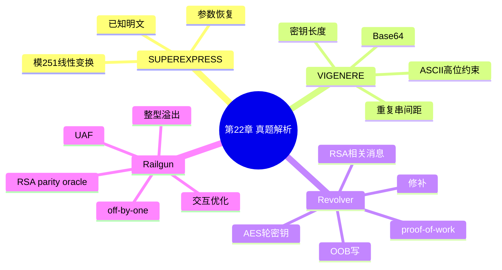

???+ abstract "本章摘要"
    本章以 SUPEREXPRESS、VIGENERE、Revolver 与 Railgun 四道题说明 Crypto 题目的分析路径：先把程序归约为可识别的数学变换，再利用已知明文、编码约束、内存越界或预言机条件建立攻击。两道综合题还展示了 Crypto 与 Reverse、PWN、AD 机制交叉时，漏洞控制与密码学推理如何配合。
## 章节导航

上一篇：[第21章 现代密码](第21章 现代密码.md)
下一篇：[第23章 APK基础](第23章 APK基础.md)
回到目录：[00-目录](00-目录.md)

## 第22章 真题解析

在真正的解题过程中，不仅要考察之前介绍的知识的运用能力，也会考察代码的分析能力。之前为了方便理解，我们都是使用自己编写的函数进行解题，其实在PyCrypto中有很多函数可以直接使用，这样会节约很多时间。本章将介绍一些常用的函数，并针对几道CTF真题进行讲解。

### 22.1 SUPEREXPRESS

首先下载题目文件（https://www.jarvisoj.com），这里包含两个文件，其中encrypted包含一行字符串，如下：

805eed80cbbccb94c36413275780ec94a857dfec8da8ca94a8c313a8ccf9

problem.py里面是用Python编写的加密算法，具体代码如下：

```python
import sys

key = '****CENSORED*****'
flag = 'TWCTF{****CENSORED*****}'

if len(key) % 2 == 1:
    print("Key Length Error")
    sys.exit(1)

n = len(key) / 2
encrypted = ''
for c in flag:
    c = ord(c)
    for a, b in zip(key[0:n], key[n:2*n]):
        c = (ord(a) * c + ord(b)) % 251
        encrypted += '%02x' % c

print encrypted

```

题目的意思是某flag经过加密之后变成了encrypted中的字符串，我们需要通过破解密码将明文恢复出来。

首先，我们对加密程序进行分析。加密程序中首先给出了两个值：一个是key，中间给出了些许字符；一个是flag，也给出了部分字符。然后进行了如下判断：

```python
if len(key) % 2 == 1:
    print("Key Length Error")
    sys.exit(1)

```

这一段保证了key的长度是偶数位的。再往下：

```python
n = len(key) / 2
encrypted = ''

```

n是key长度的一半，结合后文对n的运用，这里的作用是通过0～n和n～2n将key劈成了两半。encrypted是存储结果的字符串。

而后进行了一个循环，代码如下：

```python
for c in flag:
    c = ord(c)
    for a, b in zip(key[0:n], key[n:2*n]):
        c = (ord(a) * c + ord(b)) % 251
    encrypted += '%02x' % c

```

循环对flag的每一个字符都进行了操作，并且这个操作具有如下两个特点。

1）每个字符的变换都是相同的，不会因为字符的位置不同而发生改变，所以这是一个单表替代密码。

2）针对每个字符的变换都是与key中的每一个字符进行一个稍微有些复杂的线性变换。模数是固定的251。

满足以上两个条件之后，我们可以不用再看这个函数了，因为已经可解了，无论这个变化有多复杂，最终都可以用一个变化来概括：

```python
for i in range(len(m)):
    c[i] = (ord(m[i]) * k + 1) % 251

```

接下来，我们需要通过已知条件来计算出k和l的值。想要计算这个值，首先要知道几个已知的对应的明密文，而我们知道，明文的前6个字符是：

TWCTF{

密文的前6个字符是：

"805eed80cbbccb94c36413275780ec94a857dfec8da8ca94a8c313a8ccf9".decode("hex") [0:6]

所以其实可以列出如下6个方程：

(ord('T') * k + 1) % 251 == 0x80
(ord('W') * k + 1) % 251 == 0x5e
(ord('C') * k + 1) % 251 == 0xed
(ord('T') * k + 1) % 251 == 0x80
(ord('F') * k + 1) % 251 == 0xcb
(ord('{}' * k + 1) % 251 == 0xbc

为了方便，这里先不解方程，而是直接爆破：

```python
for k in range(251):
    for l in range(251):
        if (ord('T')*k+1) %251==0x80 and
    (ord('W')*k+1) %251==0x5e and (ord('C')*k+1) %251==0xed and
    (ord('T')*k+1) %251==0x80 and (ord('F')*k+1) %251==0xcb and
    (ord('{}')*k+1) %251==0xbc:
    print k,l

```

结果如下:

156 76

这是加密密钥，当然这里也可以直接计算出解密密钥，具体代码如下：

```python
(0x80*k+1) %251 == ord('T')
(0x5e*k+1) %251 == ord('W')
(0xed*k+1) %251 == ord('C')
(0x80*k+1) %251 == ord('T')
(0xcb*k+1) %251 == ord('F')
(0xbc*k+1) %251 == ord('{}')
for k in range(251):
    for l in range(251):
        if (0x80*k+1) %251 == ord('T') and
(0x5e*k+1) %251 == ord('W') and (0xed*k+1) %251 == ord('C') and

(0x80*k+1)%251==ord('T') and (0xcb*k+1)%251==ord('F') and
(0xbc*k+1)%251==ord('{}':
    print k,l

```

结果如下：
214 51

上面输出的结果就是解密密钥了，然后执行解密脚本获得flag，代码如下：

```python
k=214
l=51

r=" "
for i in
"805eed80cbbccb94c36413275780ec94a857dfec8da8ca94a8c313a8ccf9".decode("hex"):
    r+=chr((k*ord(i)+1) %251)
print r

```

结果如下:

TWCTF{Faster_Than_Shinkansen!}

是不是很神奇呢？有时候分析程序，不一定必须将算法研究透彻，知道其变换的本质及与其对应的攻击方法即可。

### 22.2 VIGENERE

题目地址为https://www.jarvisoj.com。首先，打开题目所给的文件，可以发现该题也有一个密文，还给出了加密的程序，下面分析加密的程序：

```python
# Python 3 Source Code
from base64 import b64encode, b64decode
import sys
import os
import random

chars =
    'abcdefghijklmnopqrstuvwxyzABCDEFGHIJKLMNOPQRSTUVWXYZ0123456789+/'

def shift(char, key, rev = False):
    if not char in chars:
        return char
    if rev:
        return chars[(chars.index(char) - chars.index(key)) % len(chars)]
    else:
        return chars[(chars.index(char) + chars.index(key)) % len(chars)]

def encrypt(message, key):
    encrypted =
    b64encode(message.encode('ascii').decode('ascii')
        return '.join([shift(encrypted[i], key[i % len(key)]) for i in range(len(encrypted))])

def decrypt(encrypted, key):
    encrypted = '.join([shift(encrypted[i], key[i % len(key)]], True) for i in range(len(encrypted))])
    return
b64decode(encrypted.encode('ascii').decode('ascii')

def generate_random_key(length = 5):
    return ''.join(map(lambda a : chars[a % len(chars)], os.urandom(length)))

if len(sys.argv) == 4 and sys.argv[1] == 'encrypt':
    f = open(sys.argv[3])
    plain = f.read()
    f.close()

    key = generate_random_key(random.randint(5,14))

    print(encrypt(plain, key))

    f = open(sys.argv[2], 'w')
    f.write(key)
    f.close()

elif len(sys.argv) == 4 and sys.argv[1] == 'decrypt':
    f = open(sys.argv[3])
    encrypted = f.read()
    f.close()

    f = open(sys.argv[2])
    key = f.read()
    f.close()

    print(decrypt(encrypted, key), end = '')

else:
    print("Usage: python %s encrypt|decrypt (key-file) (input-file)" % sys.argv[0])

```

分析程序得知，程序进行了两次变化，一次base64变化，一次维吉尼亚加密。

这就产生一件麻烦的事情了，因为是对base64的内容进行维吉尼亚加密，所以词频统计不那么有用了。面对这种情况，首先我们要结合之前的介绍，思考base64的工作方式（如图22-1所示）。

{ width="100%" }

<div style="text-align: center;">图22-1 base64示意图</div>

如图22-1所示，base64在工作的时候，将三个字符变成了四个字符。也就是说，每个编码前的字符对应着1～2个编码后的字符。编码后的字符被维吉尼亚加密了，我们不知道密钥是什么，甚至不知道密钥的长度。但是有这样一句话：

```python
encrypted =
b64encode(message.encode('ascii')).decode('ascii')

```

这句话限制了明文的取值范围是0～127，也就是说所有明文的最高bit都是0。

下面开始进行破解工作，首先我们需要知道的是密钥的长度。这里提供了一个好用的猜解密钥长度的方法，即求解3个间隔的最大公约

数。因为如果是三个出现的字母相同时，很大概率上是同一密文对应相同位置的密钥的情况，那么此时这两个相同的三个间隔就是密钥长度的整数倍。所以如果有多组的话，它们的最大公约数就是密钥的长度。

首先来看看哪些3字符出现了2次及以上次数，打印出它们的间隔：

```python
a="a7TFeCShtf94+t5quSA5ZBn4+3tqLT10EvoMsNxeeCm50Xoet+1fvy821r6Fe4fpeAw1ZB+as3Tphe8xZXQ/s3tbJy8BDzX4vN5svYqIZ96rt35dKuz0DfCPf4nfKe300fM9utiauTe5tgs5utLpLTh0FzYx001sJYKgJvu10OfiuT100BCks+aaJZm8Kwb4u+LtLCqbZ96lv3bieCahtegx+7nzqyO6YCb4b9LovCELZ9Pe0L5rLSABDzXaftxseAw1JzCF0MGjeCacKb69u9T1gCudZT6Os3ojhcWxD914vNHfeCuaJvH4s4aarBK1GdsT8G4UKZhfJB+y0LbjqCONZT6baF1WiZeNtfsNtuoo+c=="
chars =
'abcdefghijklmnopqrstuvwxyzABCDEFGHIJKLMNOPQRSTUVWXYZ0123456789+/
i=0
slist=[]
snum=[]
sjg=[]
while i<len(a)-4:
    s=a[i]+a[i+1]+a[i+2]
    if s not in slist:
        slist.append(s)
        snum.append(1)
        sjg.append(i)
    else:
        snum[slist.index(s)]+=1
        sjg[slist.index(s)]=i-sjg[slist.index(s)]
    i+=1
for i in range(len(snum)):
    if snum[i>=2:
        print slist[i],sjg[i]

```

结果如下:

T10 144
eAw 192
Aw1 192
BDz 156
DzX 156
4vN 204
Z96 96
eCa 60
ZT6 60

可以看到满足条件的字符还是不少的，下面就来计算这些数字的最大公约数：

```python
def gcd(a, b):
    if a < b:
        a, b = b, a

while b != 0:
    temp = a % b
    a = b
    b = temp

return a

ans=[144,192,192,156,156,204,96,60,60]
ff=144
for i in ans:
    print "gcd", ff, i
    ff=gcd(ff, i)
print ff

```

结果如下:

| gcd | 144 | 144 |
| --- | --- | --- |
| gcd | 144 | 192 |
| gcd | 48 | 192 |
| gcd | 48 | 156 |
| gcd | 12 | 156 |
| gcd | 12 | 204 |
| gcd | 12 | 96 |
| gcd | 12 | 60 |
| gcd | 12 | 60 |
| 12 |  |  |

至此我们得到了维吉尼亚密码的密钥长度为12。

下面考虑在分析中提到的明文的每个字符的最高bit都是0的问题。我们来看一张图（图22-2）。

{ width="100%" }

<div style="text-align: center;">图22-2 bit分析示意图</div>

图22-2中有两组加密，我们现在需要定位到所有明文的最高bit对应到密文中的位置。比如，第一个明文，其最高bit就在vinegere加密之后的密文的第一个字节里；第二个明文，在密文的第二个字节里；第三个明文在密文的第三个字节里；第四个明文在密文的第五个字节里；依次类推，以9个明文为一组，也就是12个密文为一组进行循环。

12字节的密钥能够控制9个明文中的最高bit位，也就是说每个被选中的密钥能够控制所有分组的对应字符的最高bit位。

因为最高bit位需要为0，所以我们可以通过枚举密钥的单个字符，观察base64解密之后明文所有对应位置的最高bit位是否为0来确定这个密钥的正确性，代码如下：

```python
from base64 import b64encode, b64decode
a="a7TFeCShtf94+t5quSA5ZBn4+3tqLT10EvoMsNxeeCm50Xoet+1fvy8
21r6Fe4fpeAw1ZB+as3Tphe8xZXQ/s3tbJy8BDzX4vN5svYqIZ96rt35dK
uz0DfCPf4nfKe300fM9utiauTe5tgs5utLpLTh0FzYx001sJYKgJvul0Of
iuT100BCks+aaJZm8Kwb4u+LtLCqbZ96lv3bieCahtegx+7nzqyO6YCb4b
9LovCELZ9Pe0L5rLSaBDzXaftxseAw1JzCF0MGjeCacKb69u9T1gCudZT6
Os3ojhcWxD914vNHfeCuaJvH4s4aarBK1GdsT8G4UKZhfJB+y0LbjqCONZ
T6baF1WiZeNtfsNtuoo+c=="

chars =
'abcdefghijklmnopqrstuvwxyzABCDEFGHIJKLMNOPQRSTUVWXYZ0123456789+/
def shift(char, key, rev = False):
    if not char in chars:
        return char
    if rev:
        return chars[(chars.index(char) -
chars.index(key)) % len(chars)]
    else:
        return chars[(chars.index(char) +
chars.index(key)) % len(chars)]

def decrypt(encrypted, key):
    encrypted = '.join([shift(encrypted[i], key[i %
len(key)], True) for i in range(len(encrypted))])
    return b64decode(encrypted)

def check(key,loc):
    s=decrypt(a,key)
    i=0
    calc=0
    while i < 270:

if ord(s[i+loc])<128:
    calc+=1
i+=9
print calc,key

print

for i in chars:
    check("shAxI8HxYL"+i+"1",8)

```

## 结果如下:

11 shAx18HxYLa1
14 shAx18HxYLb1
18 shAx18HxYLC1
15 shAx18HxYLd1
12 shAx18HxYLe1
15 shAx18HxYLf1
18 shAx18HxYLg1
20 shAx18HxYLh1
17 shAx18HxYLi1
10 shAx18HxYLj1
14 shAx18HxYLk1
23 shAx18HxYLl1
18 shAx18HxYLm1
7 shAx18HxYLn1
13 shAx18HxYLo1
22 shAx18HxYLp1
15 shAx18HxYLq1
8 shAx18HxYLr1
15 shAx18HxYLs1
20 shAx18HxYLt1
13 shAx18HxYLu1
9 shAx18HxYLv1
16 shAx18HxYLw1
21 shAx18HxYLx1
14 shAx18HxYLy1
9 shAx18HxYLz1
17 shAx18HxYLA1
24 shAx18HxYLB1
15 shAx18HxYLC1
3 shAx18HxYLD1

| 12 | shAxI8HxYLE1 |
| --- | --- |
| 30 | shAxI8HxYLF1 |
| 21 | shAxI8HxYLG1 |
| 1 | shAxI8HxYLH1 |
| 9 | shAxI8HxYLI1 |
| 28 | shAxI8HxYLJ1 |
| 21 | shAxI8HxYLK1 |
| 2 | shAxI8HxYLL1 |
| 9 | shAxI8HxYLM1 |
| 27 | shAxI8HxYLN1 |
| 20 | shAxI8HxYLO1 |
| 6 | shAxI8HxYLP1 |
| 12 | shAxI8HxYLQ1 |
| 22 | shAxI8HxYLR1 |
| 17 | shAxI8HxYLS1 |
| 8 | shAxI8HxYLT1 |
| 14 | shAxI8HxYLU1 |
| 23 | shAxI8HxYLV1 |
| 16 | shAxI8HxYLW1 |
| 7 | shAxI8HxYLX1 |
| 12 | shAxI8HxYLY1 |
| 21 | shAxI8HxYLZ1 |
| 18 | shAxI8HxYL01 |
| 9 | shAxI8HxYL11 |
| 12 | shAxI8HxYL21 |
| 22 | shAxI8HxYL31 |
| 19 | shAxI8HxYL41 |
| 8 | shAxI8HxYL51 |
| 11 | shAxI8HxYL61 |
| 16 | shAxI8HxYL71 |
| 13 | shAxI8HxYL81 |
| 14 | shAxI8HxYL91 |
| 18 | shAxI8HxYL+1 |
| 16 | shAxI8HxYL/1 |

如上述代码所示，如果在某个位置的字符能够满足所有的30组的最高bit都是0，那么密钥这个位置的字符就是可以确定的。通过程序测试，可以得知利用该方法确定的密钥组成为：

| s | h | A | 未知 | 1 | 8 | H | 未知 | XorY | L | F | 未知 |
| --- | --- | --- | --- | --- | --- | --- | --- | --- | --- | --- | --- |

接下来就简单了，爆破未知位置即可，代码如下：

```python
from base64 import b64encode, b64decode
a="a7TFeCShtf94+t5quSA5ZBn4+3tqLT10EvoMsNxeeCm50Xoet+1fvy821r6Fe4fpeAw1ZB+as3Tphe8xZXQ/s3tbJy8BDzX4vN5svYqIZ96rt35dKuz0DfCPf4nfKe300fM9utiauTe5tgs5utLpLTh0FzYx001sJYKgJvul0OfiuT100BCks+aaJZm8Kwb4u+LtLCqbZ96lv3bieCahtegx+7nzqyO6YCb4b9LovCELZ9Pe0L5rLSaBDzXaftxseAw1JzCF0MGjeCacKb69u9T1gCudZT6Os3ojhcWxD914vNHfeCuaJvH4s4aarBK1GdsT8G4UKZhfJB+y0LbjqCONZT6baF1WiZeNtfsNtuoo+c=="
chars =
'abcdefghijklmnopqrstuvwxyzABCDEFGHIJKLMNOPQRSTUVWXYZ0123456789+/
def shift(char, key, rev = False):
    if not char in chars:
        return char
        if rev:
            return chars[(chars.index(char) -
chars.index(key)) % len(chars)]
    else:
        return chars[(chars.index(char) +
chars.index(key)) % len(chars)]

def decrypt(encrypted, key):
    encrypted = '.join([shift(encrypted[i], key[i %
len(key)], True) for i in range(len(encrypted))])
    return b64decode(encrypted)
for i3 in chars:
    for i7 in chars:
        for i8 in "XY":
            for i11 in chars:
                key="shA"+i3+"I8H"+i7+i8+"LF"+i11
                tmp=decrypt(a,key)
                if "the flag is" in tmp:
                    print tmp

```

结果如下:

SKK is a Japanese Input Method developed by Sato Masahiko. Original SKK targets Emacs. However, there are various SKK programs that work other systems such as SKKFEP(for Windows), AquaSKK(for MacOS X) and eskk(for vim). OK, the flag is TWCTF{C14sslcaL CiPhEr iS v3ry fun}.

最终得到flag。由这两题可以看出，解答Crypto类型的题目时，判断什么情景用什么攻击方法是基础能力，最关键的考察点还是加密算法的分析能力。

### 22.3 Revolver

这是强网杯线下赛中的一道题目，题目类型为

Reverse+PWN+Crypto，是在线下赛中引入Crypto类型题点的突破性尝试。题目为note式交互方式。

### 1. 初始化和验证

题目中的选项1、2为初始化和验证功能模块，包含一个proof过程。通过proof过程可以消耗一定的攻击者计算资源，使用此措施可以有效地避免拒绝服务攻击。具体实现代码如下：

```cpp
1. bool open_insurance()
2. {
3.     strand((unsigned)time(NULL));
4.     char ch[16 + 1] = {0};
5.     const char CCH[] =
    "0123456789abcdefghijklmnopqrstuvwxyzABCDEFGHIJKLMNOPQRSTUVWXYZ+";
6.     for (int i = 0; i < 16; ++i)
7.         {
8.             int x = rand() / (RAND_MAX / (sizeof(CCH) - 1));
9.             ch[i] = CCH[x];
10.         }
11.     string chs = ch;
12.     string ins;
13.     MD5 md5;
14.     cout << "opening:" << md5.digestString(ch) << "#"
<< chs.substr(0,13);
15.     cin >> ins;
16.     if (ins == chs.substr(13, 16))
7.         {
18.             return true;

19. }
20. else
21. {
22. return false;
23. }
24. }

```

在验证proof的过程中，只需要爆破3个字符碰撞MD5即可，使用Python计算所消耗的时间低于1秒。具体攻击代码如下：

```python
1. def open_insurance(io):
2. io.read_until("action")
3. io.writeline("1")
4. io.read_until("action")
5. io.writeline("1")
6. io.read_until("opening")
7. md5=io.read(32)
8. io.read(1)
9. st=io.read(13)
10. t =
_0123456789abcdefghijklmnopqrstuvwxyzABCDEFGHIJKLMNOPQRSTUVWXYZ+
11. for i in t:
12. for j in t:
13. for k in t:
14. if hashlib.md5(st + i + j + k).hexdigest() == md5:
15. io.writeline(i + j + k)
16. return

```

验证完成后，程序会读取flag文件，随机生成AES256的32字节密钥并进行加密，然后存储于下述关键结构中：

```cpp
1. struct secret_st
2. {
3. unsigned int secret_size;
4. uint8_t rules[16];

5. uint8_t key[32];
6. uint8_t flag[32];
7. } secret;

```

结构中secret_size为rules的长度，key为AES256的密钥，flag为使用AES256加密后的flag密文。初始化完成后会给予3发子弹，并且不可再次装填。每发子弹都可以实现选项3中的一个功能。

### 2. 功能

选项3中包含7个功能，均为用于攻击或用于检查的实用功能。进入选项3的条件是通过proof打开保险，并且拥有一定数量的子弹。

选项3-1会打印出AES256加密后的密文。

选项3-2可以修改rules的大小，即对上述结构体中的secret_size进行更改，需要注意的是，这里最大可以改到32，而rules仅有16字节，代码如下：

```cpp
1. case 2:
2. {
3.  cout<<"more train:";
4.  cin>>tmp;
5.  if (tmp>32)
6.         bye();
7.  secret.secret_size=tmp;
8.  break;
9. }

```

选项3-3可以输入rules，且输入的长度不可以超过16字节，但是在服务端打印rules时是以secret_size作为长度限制的，代码如下：

```cpp
1. case 3:
2. {
3. string rules;
4. cout<<"repeat train rules";
5. cin>>rules;
6. if (rules.length() > 16)
7. {
8.     cout<<"wrong rules"<<endl;
9.     bye();
10. }
11. else
12. {
13.     rules.copy((char
    *)secret.rules,secret.secret_size-1,0);
14.     int tmp_i;
15.     DUMP("your
    rules:",tmp_i,secret.rules,secret.secret_size);
16. }
17. break;
18. }

```

选项3-4使用e=65537的RSA进行了AES256的密钥加密并进行打印。

选项3-5在使用AES256进行加密的时候，因为flag为32位，并且采取的是ECB模式，所以一共进行了 $ 14 \times 2 $次密钥扩展，共 $ 14 \times 2 \times 2 = 56 $个轮密钥，此选项可以任意打印其中一个，代码如下：

```cpp
1. case 5:
2. {
3. int action_in;
4. cout<<"1-56:"<<endl;
5. action_in=get_action(56);
6. if (action_in==0)

7. {
8. bye();
9. }
10. else
11. {
12. int i;
13. printf("hit:");
14. for (i = 0; i < 16; i++)
15. printf("%02x", *(record + ((action_in - 1) * 16) + i));
16. printf("\n");
17.
18. }
19. }

```

选项3-6使用了e=3，n长度为1024bit的RSA对AES256的key进行了加密并打印，同时padding为固定值。

选项3-7提供了一个修改rules的选项，可以指定一个位置，该功能会将该位置的数值自减1，需要注意的是，提供该功能时长度限制为48，而结构体中rules的长度只有16，且该功能不消耗子弹。代码如下：

```cpp
1. case 7:
2. {
3.   cout<<"break the rules:"<<endl;
4. unsigned int loc;
5. cin>>loc;
6. if (loc<0 or loc>=48)
7.     bye();
8.     else
9.     {
10.     secret.rules[loc]-=1;
11. }
12.   cout<<"break the rules success"<<endl;
13. magazine+=1;

14. break;
15. }

```

### 3. OOB Write+Related Message Attack

选项3-6中的e=3，n只有1024bit，具有良好的攻击特性，可是虽然通过选项3-2和选项3-3可以泄露AES256密钥的高16字节信息，但是此时子弹数量只有3枚且已经消耗完毕（包括需要使用一枚获得flag的密文信息），无法实现任何一种攻击过程，因此选项3-2和选项3-3为干扰选项。

选项3-7中存在48-16=32字节的越界写（Out Of BoundWrite，OOB Write），虽然只能更改一个字节，但是可以构造出RSA中相关消息攻击的攻击条件。

首先，使用选项3-6获取AES256的key被e=3的RSA加密的密文，然后使用选项3-7对secret结构体中存储的AES256的key进行1字节的修改，最后再次使用选项3-6获取AES256的key被e=3的RSA加密的密文。因为两次加密使用了相同的公钥，并且两次加密的线性关系已知，即相差1，所以这里可以使用相关消息攻击回复明文。攻击的核心代码如下：

```python
1. import gmpy2
2. def getmessage(a, b, c1, c2, n):
3.     b3 = gmpy2.powmod(b, 3, n)
4.     part1 = b * (c1 + 2 * c2 - b3) % n
5.     part2 = a * (c1 - c2 + 2 * b3) % n
6.     part2 = gmpy2.invert(part2, n)
7.     return part1 * part2 % n

8. def fire(io):
9.     io.read_until("action.")
10.     io.writeline("3")
11.     io.read_until("action.")
12.     io.writeline("1")
13.     io.read_until("flag.")
14.     aes_c=io.read(64).decode("hex")
15.
16.     io.read_until("action.")
17.     io.writeline("3")
18.     io.read_until("action.")
19.     io.writeline("6")
20.     io.read_until("c:")
21.     c2=int((io.readline().strip(),16)
22.
23.     io.read_until("action.")
24.     io.writeline("3")
25.     io.read_until("action.")
26.     io.writeline("7")
27.     io.read_until(":")
28.     io.writeline("47")
29.
30.     io.read_until("action.")
31.     io.writeline("3")
32.     io.read_until("action.")
33.     io.writeline("6")
34.     io.read_until("c:")
35.     c1=int((io.readline().strip(),16)
36.
37.     id1 = 0
38.     id2 = 1
39.     a = 1
40.     b = id1 - id2
41.     message = getmessage(a, b, c1, c2, n) - id2
42.     message = hex(message+1)[2:]
43.     print message
44.     print message[64:]
45.     key=message[64:].decode("hex")
46.     flag=decrypt(aes_c,key)
47.     return flag

4. AES Round-key Recovery Attack

```

本次加密使用的是AES256，flag长度为32位，一共会进行 $ 14 \times 2 $次密钥扩展，每次扩展32字节，每次加密使用16字节。依据选项3-5，可以获取 $ 14 \times 2 \times 2 = 56 $个16字节中的任意一个。

依据密钥扩展算法，轮密钥是可以恢复初始密钥的，恢复方法如下：

```cpp
1. static void
2. aes_expandDecKey(uint8_t * const k, uint8_t * const rc)
3. {
4. uint8_t i;
5.
6. for (i = 28; i > 16; i == 4) {
7. k[i + 0] ^= k[i - 4];
8. k[i + 1] ^= k[i - 3];
9. k[i + 2] ^= k[i - 2];
10. k[i + 3] ^= k[i - 1];
11. }
12.
13. k[16] ^= rj_sbox(k[12]);
14. k[17] ^= rj_sbox(k[13]);
15. k[18] ^= rj_sbox(k[14]);
16. k[19] ^= rj_sbox(k[15]);
17.
18. for (i = 12; i > 0; i == 4) {
19. k[i + 0] ^= k[i - 4];
20. k[i + 1] ^= k[i - 3];
21. k[i + 2] ^= k[i - 2];
22. k[i + 3] ^= k[i - 1];
23. }
24.
25. *rc = (uint8_t)((*rc >> 1) ^ ((*rc & 1) ? 0x8d : 0));
26. k[0] ^= rj_sbox(k[29]) ^ (*rc);
27. k[1] ^= rj_sbox(k[30]);
28. k[2] ^= rj_sbox(k[31]);
29. k[3] ^= rj_sbox(k[28]);
30. }

```

### 5. Known High Bits Message Attack

选项3-6中还隐藏着一种攻击方法，因为flag只有256bit，前面padding了256bit的1，那么实际可以看为512个0和256个1是已知的，也就是说，如果将明文视为1024bit，那么其实前768bit是已知的，由512个0和256个1组成。再爆破1个bit即可完成密文高bit位泄露攻击。

### 6. 检查与修补

因为题目中出现的公钥对于checker来说均有私钥与之对应，所以使用私钥进行检查可以保证密码学考点的完整性和不可破坏性。因此该题主要是使用私钥去解密key，然后验证flag。下面主要对4个功能进行check，代码如下：

```python
1. def checker_main(target,flag_ssh):
2.     if exp_1(target)==False:
3.         return False, "hb_len_modify ERROR"
4.     if exp_2(target,flag_ssh)==False:
5.         return False, "e3rsa_or_rule_modify ERROR"
6.     if exp_3(target,flag_ssh)==False:
7.         return False, "backdoor_rsa_aeskey_flag ERROR"
8.     if exp_4(target)==False:
9.         return False, "roundkey_leak ERROR"
10.     return True, "OK"

```

检查的内容具体如下。

1）首先，flag是读进来的，为了保证flag的open不会被篡改，并且在checker拥有私钥的前提下，进行如下操作：获取flag的密文（被AES256加密），获取AES256的key的密文（被RSA加密），使用私钥解密key，使用key解密flag，使用paramiko ssh登录gamebox并cat flag，验证两个flag是否相等。通过以上步骤，可以保证flag在内存中是确实存在的。

2）保证所有攻击流程不会被篡改：在拥有私钥的前提下，所有攻击流程的每一个步骤都可以进行完整的验证，思路非常简单，以正常数据（比如不会越界的数据）走完攻击流程，并用私钥解密，观察flag与ssh获取的flag是否相同。

3）读取了不连续的aes轮密钥进行检查。

综上所述，patch方法必须非常精确，否则会checkdown。修补方法具体如下：

1）修改程序中造成OOB Write的size，将48改为16即可；

2）需要保证不能拿到连续的两个轮密钥，对输入进行限制或者返回错误的轮密钥；

3）修改padding，使高bit不可知。

### 22.4 Railgun

这是XCTF2018Final的AD题目，题目的类型为PWN+Crypto，提供了note式交互页面，具有如下关键数据。

· 玩家描述description，开始的时候输入，是个指针malloc存储。

· 玩家姓名 player bss，开始的时候输入。

·剩余硬币数量coin bss，初始为0，uint型，可以被整型溢出。

boss的个数。

· 10个boss的结构体数组，初始化直接生成，10个malloc，结构体所有数据初始化。结构体中包含怪物所用AES的key，怪物等级，怪物存活。

一套RSA，初始化直接生成，p、q、e、d和n。

· 一套用于检查的RSA，固定n和e，checker知道p和q。

·评论地址。

关键note操作如下所示。

1）程序加载：最开始要过一个pow（否则生成RSA的素数消耗的资源过大），过完之后开始各种初始化，并输入玩家姓名。

2）操作1，modify。修改玩家姓名（存在null byte

offbyone）。

3）操作2，mining。挖掘coin（coin+=1可以直接撞）。

4）操作3，status。根据bossnumber打印怪物状态，打印公钥。

5）操作4，Index。获取flag选项，读取flag，在后面填充足够数量的随机字符串，然后使用RSA一套对flag进行加密，然后打印密文。

6）操作5，railgun。攻击怪物，选择一个怪物，接受一个密文，使用d解密，对解密结果的后16位使用该怪物的AES的key进行AES-ECB加密，询问是否消耗1个硬币，若消耗，则给出密文，询问是否消耗1个硬币（这里不进行硬币余额的判断），若消耗1个硬币，则将怪物存活状态改为击杀。

7）操作6，accelerator。技能，花费200个硬币，可以释放掉第十个boss，boss个数=9（boss个数=9的时候不能使用该操作）。

8）操作7，comment。评论，malloc一块内存，然后填入评论，自己输入长度，长度不能超过256，评论的时候判断是否已经存在评论，若存在评论则无法进行再次评论，而是直接打印评论。

9）操作8，check。checker使用的选项，用checker使用的RSA可以获得RSA一套中的d以及第1个怪物和第10个怪物的key（checker check flag的正确性+RSA的正确性+aeskey的正确性）。

10）操作9，exit。退出（free）。

本题从理论上不可获取shell，选手通过二进制漏洞修改或者泄露密码学部分的信息实现攻击。本题的攻击利用、修补、稳定性维持都具有较高的难度。所有的flag获取都必须通过RSA parity oracle进行，通过off-by-one漏洞、UAF漏洞实现信息的泄露或修改。本题除了解题难度较高之外，还具有一定的性能优化难度，因为需要fast mining和RSA parity oracle，因此如何减少交互数量，提升运行速度也是非常关键的，否则极有可能一次攻击都无法完成。

<div style="text-align: center;">题目的第一种攻击方式为null byte off-by-one(fake chunk)+integer-overflow(or fast mining)+rsa parity oracle(feat high-bits known accelerate)。</div>

选手在添加自我描述部分的时候存在off-by-one，通过off-by-one修改数组头指针，使其上移到description，使得堆结构体可控。堆结构体中存储的是AES的密钥，通过修改AES的密钥可以解密RSA的密文解密的后16字节，然后判断明文的奇偶性，从而进行RSA parity oracle。

本题除了上述漏洞的利用之外，还考察了如下考点。

· 迷惑点：leak的明文长度较多，所以会造成可以LLLAttack的假象。

· 整型溢出攻击方式：为了避免挖矿，可以通过整型溢出获得硬币，这里考察了一个奇偶性质的问题，因为每次攻击都需要花费两个硬币，所以如果将硬币mining到奇数的话，硬币的数量永远不会为0。

· RSA parity oracle优化问题：完整的RSA parity oracle要交互1024次流程才能leak完毕，但是因为明文数量约为模数的一半，且明文后面有padding，所以可以在攻击过程的初始状态和结束状态进行优化，减少一半的攻击次数。

本题可以通过查表方式来进行，不用整型溢出，手动挖矿，但是因为时间和交互次数问题，会降低exp的稳定性。

题目的第二种攻击方式为：Use After Free+integer-overflow(or fast mining)+rsa parity oracle(feat high-bits known accelerate)。

后续攻击方式与第一种相同，达成RSA parity oracle攻击条件可以使用另外一个漏洞。使用大量硬币释放掉最后一个boss后，使用多

次评论UAF操控最后一个boss的内容，然后通过攻击怪物选项使用RSA parity oracle。

## 本篇小结

学习CTF中Crypto类型的题目需要一定数学功底和逻辑思维，对于初学者来说并不是一个友好的CTF分类，但是一旦掌握了Crypto的做题技巧，会是你在CTF竞赛中非常重要的得分点。

古典密码是CTF竞赛中常见的较为简单的考点，选手只需要能够识别加密方式以及了解相关攻击技巧，即可快速解题。具有挑战性的古典密码类型题目是较为罕见的。

分组密码和序列密码是CTF中的核心考点，在了解了本书介绍的基本攻击方法后，可以针对分组密码、序列密码的各类结构及分析技巧进行深入研究，例如差分攻击、积分攻击、快速相关攻击等，这些内容是国内大型比赛以及国际比赛的重点考核区域。

公钥密码是CTF线上赛的必考内容，近年来基于格的问题越来越流行，在学习完基本的公钥密码知识体系和攻击方式后，深入研究格相关知识和基于格的攻击技巧是在公钥密码领域提升做题能力的关键。

哈希函数相关的考点较少，了解基本的哈希碰撞、彩虹表、长度扩展攻击等相关知识即可应付大多数竞赛情况。

当前区块链已成为CTF竞赛的热门领域，作为密码学选手，了解区块链相关领域的基本知识和做题技巧也是帮助队伍获得好成绩的关键。

## 第五篇 CTF之APK

本篇主要讲解CTF中APK的知识点，主要包括三个方面：首先，介绍APK类型题目的基础知识点，包括题目的概述、Android系统的基本特性以及ARM架构的基础知识；其次，介绍Dalvik层的逆向分析技术，主要包括静态分析和动态调试两个方面；最后，介绍Native层的逆向分析技术，主要包括调用特征分析、静态分析、动态调试三个方面。

## 本章梳理

??? note "OCR 保真说明"
    原文中部分示例代码存在断行、缩进或符号残缺。本章只做代码围栏等排版封装，未在代码围栏内补写或改正字符；运行示例前应结合上下文核验。
???+ tip "22.1 SUPEREXPRESS 要点"
    1. 先识别每个字符经历的相同模 251 线性变换，再把多轮过程归约为单一的仿射形式。
    2. 已知 flag 前缀能提供多组明密文对，足以爆破或求出变换参数并逐字解密。
???+ tip "22.2 VIGENERE 要点"
    1. 密文先经过 Base64，再在 Base64 字符集内做维吉尼亚式移位；直接词频分析会受编码层影响。
    2. 重复三字符的间距可用最大公约数猜测密钥长度；明文 ASCII 最高位为 0 则提供了逐位置筛选密钥字符的约束。
    3. 先用确定位置缩小密钥空间，再爆破剩余位置，是将编码结构转化为可验证条件的典型思路。
???+ tip "22.3 Revolver 要点"
    1. proof-of-work、越界读写、AES 轮密钥泄露和 RSA 相关消息攻击共同构成题目的攻击面，必须先核对资源限制与子弹消耗。
    2. OOB 写可对 AES key 建立已知线性差分，进而把两份 e=3 RSA 密文转成相关消息攻击条件。
    3. 防护应同时收紧长度边界、阻止连续轮密钥泄露，并使 padding 的高位不再可知。
???+ tip "22.4 Railgun 要点"
    1. 题目把 off-by-one、UAF、整型溢出与 RSA parity oracle 组合，目标是通过内存控制建立明文奇偶性预言机。
    2. 攻击稳定性不仅取决于漏洞是否存在，还取决于硬币资源、交互次数与 parity oracle 的高位已知优化。
## 易错点

!!! warning "易错点"
    1. 读懂循环后应先判断整体是否等价于一个简单代数变换，不能因为实现多轮就默认需要逐轮逆向。
    2. VIGENERE 题中的 Base64 不是附属细节：ASCII 输入范围恰好给出了高位约束，是恢复密钥的重要信息。
    3. Revolver 的不同功能有干扰项和资源代价，必须先规划调用顺序，否则即便找到了攻击原理也无法完成利用。
    4. Railgun 的 parity oracle 是由密码学功能与内存漏洞共同产生的；单独拥有 RSA 密文或单独拥有内存破坏都不足以完成攻击。
??? note "自测题"
    **基础**
    1. SUPEREXPRESS 中每个字符的变换为何能视为单表替代？
    2. 已知 `TWCTF{` 前缀能为 SUPEREXPRESS 提供什么信息？
    3. VIGENERE 题如何利用重复字符串间距猜测密钥长度？
    4. 为什么 Base64 前的 ASCII 明文能约束 Base64 后、再加密后的密钥位置？
    5. Revolver 中 proof 机制的目的是什么？
    6. Revolver 的 OOB 写会影响结构体中的哪类关键数据？
    7. AES 轮密钥泄露为什么可能回推出初始密钥？
    8. Railgun 中整数溢出或快速挖矿服务于什么资源需求？

    **进阶**
    9. Revolver 如何把一次字节减一转换为 RSA 相关消息攻击条件？
    10. Railgun 的 RSA parity oracle 为什么可以通过明文高位已知条件减少交互？

    **参考答案**
    1. 因为各字符经过相同 key 处理，位置不改变变换规则，整体可归约为固定模数上的单一映射。
    2. 提供已知明密文对，可用于求解或爆破仿射变换参数。
    3. 收集重复三字符的出现间距并求最大公约数，间距通常是密钥长度的倍数。
    4. ASCII 明文最高 bit 为 0，经 Base64 分组后映射为特定位置的位约束，可筛选相应的密钥字符。
    5. 让交互方先消耗计算资源，降低拒绝服务式大量交互的风险。
    6. 越界范围可越过 rules，影响后续的 AES key 等相邻结构字段。
    7. AES 密钥扩展是可逆关系；获得足够的连续轮密钥材料即可向前恢复原始密钥。
    8. 获得攻击功能所需的硬币，支持持续查询或触发攻击流程。
    9. 先获得 e=3 下的 RSA 密文，再通过越界写使同一明文发生已知线性差异，最后用两份密文恢复消息。
    10. 已知高位缩小了候选区间，因此在二分式奇偶性查询中可跳过部分初始或末尾范围。
## 本章思维导图



## 参考资料

- 原书：CTF特训营（FlappyPig战队 著，机械工业出版社 2020）。
- JarvisOJ：https://www.jarvisoj.com
- PyCryptodome 文档：https://pycryptodome.readthedocs.io/

*来源：CTF特训营（FlappyPig战队 著，机械工业出版社 2020），OCR 全内容保留整理版。*
