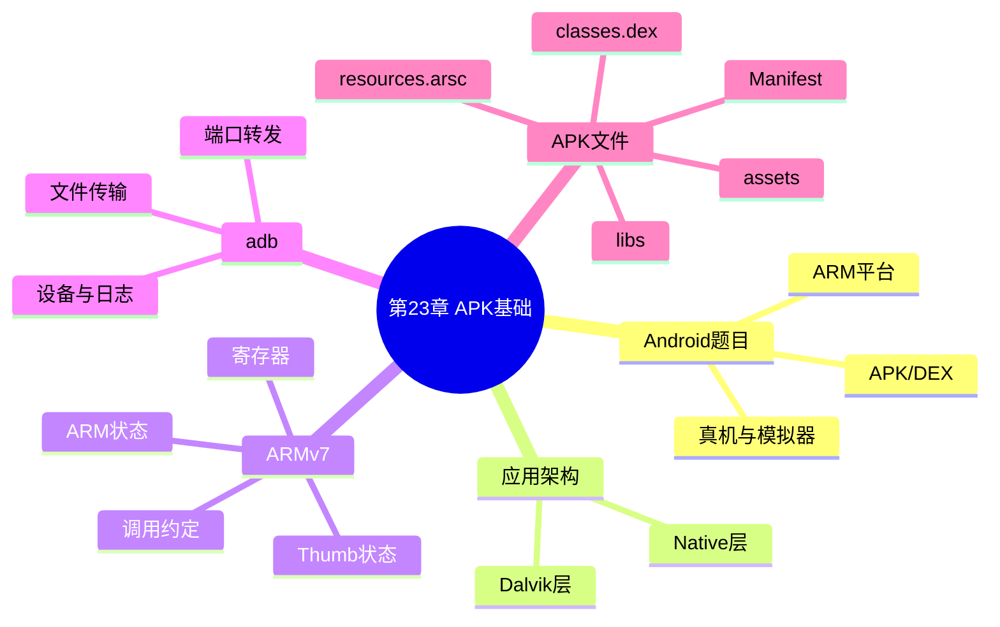

???+ abstract "本章摘要"
    本章给出 Android CTF 逆向的起点：题目通常围绕 APK 或 DEX 展开，分析对象可分为 Dalvik 层与 Native 层。随后介绍 Android 的四层架构、ARMv7 的寄存器与两种执行状态、常用 adb 命令，以及 APK 压缩包中的关键文件，为第 24、25 章的 Dalvik 与 Native 分析打下基础。
## 章节导航

上一篇：[第22章 真题解析](第22章 真题解析.md)
下一篇：[第24章 Dalvik层逆向分析](第24章 Dalvik层逆向分析.md)
回到目录：[00-目录](00-目录.md)

## 第23章 APK基础

本章将简要介绍CTF比赛中Android题目的类型，以及作为Android逆向人员必须具备的基础知识。

### 23.1 Android题目类型

CTF比赛中的Android题目主要以APK逆向为主，一般的出题方式是：提供一个APK安装程序，让选手进行逆向和调试分析，从而得出隐藏在其中的flag；也有可能不直接提供APK安装程序，而是需要通过流量、解密或者拼装等方式获得，但是最终都会获取一个APK文件（或者dex文件）来进行逆向操作。

目前，市面上大部分的Android系统都部署在ARM处理器平台上，CTF比赛中所出的大部分题目也是基于ARM平台的，因此推荐在做此类题目的时候准备一部Android手机，这样调试起来会比较方便；当然，模拟器也可以，但是模拟器在性能上会稍微差点且操作烦琐，同时不排除有的APK可能会对模拟器进行验证，徒增烦恼。如果想深入研究Android，推荐使用谷歌的Nexus系列手机，刷机和调试都非常方便。

解答Android题目对于工具的依赖非常强，熟练掌握几款工具能够让你在解题时得心应手。因此，本章将以介绍各类知名的逆向工具为主，辅以原理解析，并讲解几个例题作为巩固，以达到较好的效果。

同时，本章也会简要介绍Android操作系统的结构以及ARM处理器架构的相关基础知识，已经掌握这些基础知识的读者可以直接跳过。

???+ tip "本节要点"
    - Android CTF 最终通常会落到 APK 或 DEX 文件的逆向与调试；
    - 题目主要基于 ARM 平台，真机便于调试，模拟器可能受性能或反模拟器检测影响；
    - 工具熟练度与架构基础共同决定分析效率。
### 23.2 Android基本架构

Android操作系统可分为4层，分别是Linux内核层、系统运行层、应用框架层和应用层，而CTF中的Android题目主要集中在应用层，不会涉及过多系统方面的知识。

从开发人员的角度来看，一个Android应用可以分为两个部分：一部分使用Java实现，也称Dalvik虚拟机层；一部分使用C/C++实现，也称Native层。从出题的角度来看，题目的主要逻辑既可以出在Dalvik层，也可以出在Native层。对Dalvik层的代码进行逆向操作比较方便，属于较简单的题型，而对Native层的代码进行逆向操作可能会比较复杂，属于较难的题型。

#### 23.2.1 Android的Dalvik虚拟机

Android应用虽然可以使用Java开发，但是Android应用却不是运行在标准的Java虚拟机上，而是运行在谷歌专门为Android开发的Dalvik虚拟机上。虽然Android从5.0开始默认使用ART虚拟机，抛弃了Dalvik虚拟机，但是Dalvik虚拟机的基础知识仍然是逆向必不可少的，尤其是DEX文件的反编译。

Dalvik虚拟机中运行的是Dalvik字节码，并不是Java字节码，所有的Dalvik字节码均由Java字节码转换而来，并打包成一个DEX（Dalvik Executable）可执行文件。Dalvik虚拟机有一套自己的指令集，以及一套专门的Dalvik汇编代码。

#### 23.2.2 Native层

Android既可以使用Java开发，也可以与C/C++结合开发，甚至可以使用纯C/C++开发。使用C/C++开发的代码经过编译后会形成一个so文件，会在Android应用运行时加载到内存中。这与x86平台中Linux加载so库的方式非常相似，唯一不同的是如何将Native层的函数与Dalvik层的函数进行关联，使得Native层的函数在Dalvik层中可以很方便地调用。

Native层中的函数与Dalvik层的函数有多种关联方式，具体的细节将在Native层（第25章）进行详细阐述，这里先简单了解其整体概念。

???+ tip "本节要点"
    - Android CTF 的主要落点是应用层；
    - Dalvik 层对应 Java 侧的 Dalvik 字节码与 DEX 文件，反编译相对直接；
    - Native 层编译为 `so` 文件，需识别其与 Dalvik 层之间的调用关联；
    - Android 5.0 后默认 ART，但 DEX 与 Dalvik 汇编仍是逆向基础。
### 23.3 ARM架构基础知识

目前绝大多数Android应用都运行在ARM处理器架构上，这里简单介绍一下ARM处理器架构的几个重要特性。

主流的32位ARM处理器架构的版本为ARMv7，64位的ARM处理器的原理与之类似，鉴于目前的题目很少涉及64位的ARM处理器，这里主要介绍32位的ARM处理器中适用于ARMv7的特性。

ARM处理器共有37个32位寄存器，其中31个为通用寄存器，6个为状态寄存器。

ARM处理器共有7种运行模式，除用户模式之外，其余6种模式称为特权模式，Android应用主要运行在用户模式下。

在用户模式下，处理器可以访问的寄存器为不分组寄存器R0~R7、分组寄存器R8~R14、程序计数器R15（PC）以及当前的程序状态寄存器CPSR。

ARM处理器有两种工作状态：==ARM状态和Thumb状态==，处理器可以在这两种状态下随意切换。这两种状态的主要区别是，ARM状态下会执行32位对齐的ARM指令，而在Thumb状态时主要执行16位对齐的Thumb指令。处理器判断当前状态的主要标志是程序状态寄存器CPSR中的T标

志，当T位为1时，处理器处于Thumb状态，反之则处于ARM状态。两种状态下寄存器的命名有所不同，具体如下。

· 两种状态下R0~R7与CPSR相同。

· ARM状态下的R11对应Thumb状态下的FP。

· ARM状态下的R12对应Thumb状态下的IP。

· ARM状态下的R13对应Thumb状态下的SP。

· ARM状态下的R14对应Thumb状态下的LR。

· ARM状态下的R15对应Thumb状态下的PC。

为什么ARM要设计两种状态？下面以一个实例来介绍一下ARM处理器的指令集。

例如有这样的简单函数：

```c
int func(int i, int j) {
    int x = i + j - i / j * 3;
    printf("%d\\n", x);
    return x;
}
```

使用ARM交叉编译工具编译后，汇编代码为：

```asm
=> 0x2a0008ec <func>: push {r4, lr}
0x2a0008ee <func+2>: adds r4, r0, r1
0x2a0008f0 <func+4>: blx 0x2a00090c
<_divsi3>
0x2a0008f4 <func+8>: sub.w r0, r0, r0,
ls1 #2
0x2a0008f8 <func+12>: add r4,
r0
0x2a0008fa <func+14>: ldr r0,
[pc, #12] ; (0x2a000908 <func+28>)
0x2a0008fc <func+16>: mov r1,
r4
0x2a0008fe <func+18>: add r0,
pc
0x2a000900 <func+20>: blx
0x2a0006c0 <printf@plt>
0x2a000904 <func+24>: mov r0,
r4
0x2a000906 <func+26>: pop
{r4, pc}
```

可以看出，ARM的汇编代码与Intel x86的汇编代码非常相似，参数都是采用从目标到源的方式，汇编指令也比较相似，熟悉Intel x86汇编的读者应该一下子就能看懂大部分的指令，下面挑选几个比较特殊的知识点进行讲解。

#### 23.3.1 函数调用/跳转指令

在ARM汇编中，函数调用和跳转指令都可以使用b系列指令，常见的有b、bx、bl、blx。其中，带“x”的指令表示根据地址的最后一位进行Thumb模式和ARM模式的切换，当地址最后一位为1时切换至Thumb模式，为0时切换至ARM模式（寄存器PC的值的最后一位总为0）；带“1”的指令表示处理器跳转的时候，会将当前指令的下一条指令地址存入寄存器LR中，这样当子程序需要跳转回来时，只需要把LR的值存入PC即可。

在ARM处理器中，寄存器PC是可以直接修改的，既可以直接赋值，也可以使用出栈操作修改寄存器PC的值。因此直接将LR的值赋给PC是可行的，但这只在子程序和调用者都处在ARM模式时才可以，如果模式不同，则需要bx lr指令（想一想这是为什么？）。

在函数调用的时候，按照约定，函数的前4个参数会依次存储在寄存器R0~R3中，剩余的参数（如果有）则会依次保存在栈里。

#### 23.3.2 出栈入栈指令

ARM汇编的出栈入栈指令与Intel x86的指令很像，都是使用push和pop指令，不同的是ARM汇编的push和pop指令后面可以接多个单数，例如上面的“push{r4, lr}”。

#### 23.3.3 保存/恢复寄存器的值

ARM汇编提供了LDR、STR、LDM、STM系列指令用于将寄存器的值存入内存以及将寄存器的值从内存中读出，其中LDR、STR用于处理单个寄存器，LDM、STM用于一次性保存或恢复多个内存器，因此有时候我们也会看见使用LDM、STM系列指令执行出栈入栈操作。例如，指令“stmdb sp!，{r4,r5,r6,r7,r8,r9,r10,r11,lr}”，它其实相当于“push {r4,r5,r6,r7,r8,r9,r10,r11,lr}”。

???+ tip "本节要点"
    - ARMv7 的用户态重点关注 R0~R15 与 CPSR；
    - CPSR 的 T 位决定 ARM 或 Thumb 状态，`bx`/`blx` 会依据跳转地址末位参与状态切换；
    - `bl`/`blx` 会把返回地址放入 LR，返回时可恢复到 PC；
    - 调用约定中前四个参数使用 R0~R3，其余参数在栈上；
    - `LDR`、`STR` 处理单寄存器，`LDM`、`STM` 可处理多个寄存器。
### 23.4 adb

adb（android debug bridge）是谷歌官方提供的命令行工具，用来连接真机或者模拟器，只要在相应的Android系统设置中打开USB调试，即可使用adb连接手机。adb最主要的功能是查看连接的手机、打开一个shell、查看日志、上传与下载文件，相关命令如下。

1）查看连接的手机或模拟器：adb devices。

2）安装APK：adb install<APK路径>。

3）卸载APP：adb uninstall<package>。

4）打开shell：adb shell。

5）查看日志：adb logcat。

6）上传文件：adb push xxx/data/local/tmp。

7）下载文件：adb pull/data/local/tmp/some_file some_location。

8）将本地端口转发到远程设备的端口：adb forward[--no-rebind]LOCAL REMOTE。

9）列出所有的转发端口adb forward -list。

10将远程设备的端口转发到本地：adb reverse[--no-rebind]REMOTE LOCAL。

11）列出所有反向端口转发：adb reverse--list。

12）终止ADB Server: adb kill-server。

13）启动ADB Server：adb start-server。

14）以root权限重启ADB DAEMON：adb root。

15）重启设备：adb reboot。

16）重启并进入bootloader：adb reboot bootloader。

17）重启并进入recovery：adb reboot recovery。

18）将system分区重新挂载为可读写分区：adb remount。

19）通过TCP/IP连接设备（默认端口5555）：adb connect HOST[:PORT]。

Windows系统可以从谷歌的Android官网上下载Android SDK，其中包含了adb；Linux与Mac系统可以从官网上下载Android SDK，也可以直接使用包管理工具下载android-platform-tools。

在Linux系统中，如果adb无法正常连接，比如使用“adb devices”列出手机时显示“no permissions”，这时可以使用“adb kill-server”命令结束adb进程，然后使用root权限重新运行“adb devices”；一次性的解决办法可以参考

http://source.android.com/source/initializing.html（需要梯子）中的Configuring USB Access一节，将所使用手机的ID写入系统的udev规则中。

???+ tip "本节要点"
    - `adb devices`、`adb shell`、`adb logcat` 是连接、交互和取日志的基本组合；
    - `adb push`/`pull` 用于文件交换，`forward`/`reverse` 用于调试端口转发；
    - 连不上设备时先检查 USB 调试、设备权限与 adb Server 状态；
    - 真机 Linux 权限问题可按原文所述配置 udev 规则。
### 23.5 APK文件格式

这里简单介绍一下APK的文件格式。APK文件其实是一个zip压缩文件，使用unzip可以直接解压，例如，下面是某个APK解压后的第一层目录：

```text
AndroidManifest.xml
META-INF
assets
classes.dex
libs
res
resources.arsc
```

其中，AndroidManifest.xml是这个APK的属性文件，所有的APK都需要包含这个文件，这个文件中写明了该APK所具有的Activity、所需要的函数、启动类是哪一个等信息。当然，直接打开解压后的该文件将会是乱码，需要使用工具去解析。

META-INF是编译过程中自动生成的文件夹，尽量不要去手动修改。

assets文件夹比较有意思，存放在这个文件夹里面的文件将会原封不动地打包到APK里，因此这个文件夹里经常会存放一些程序中会使用的文件，例如解密秘钥或者加密后的密文等。

classes.dex是存放Dalvik字节码的DEX文件，若用编辑器直接打开会看到一堆乱码，如何去解析DEX文件将在第24章讨论的内容。

libs文件夹包含Native层所需的lib库，一般为libxxx.so格式，libs文件夹中可以包含多个lib文件。

res文件夹存放与资源相关的文件，例如位图。

resources. arsc 文件里面存放着 APK 中所使用资源的名字、ID、类型等信息，若用编辑器直接打开，看到的也会是乱码，如何解析会在第24章进行讨论。

???+ tip "本节要点"
    - APK 本质上是 ZIP 压缩包，先解压可快速获得静态分析入口；
    - `AndroidManifest.xml` 揭示组件与启动信息，`classes.dex` 是 Dalvik 代码主体；
    - `assets` 可能保留密钥、密文等直接可用的数据，`libs` 中的 `libxxx.so` 通向 Native 分析；
    - `resources.arsc` 与 `res` 共同承载资源信息。
## 易错点

!!! warning "易错点"
    - ==Android 应用的 Java 代码并不运行在标准 Java 虚拟机上==，分析目标是 DEX 中的 Dalvik 字节码；
    - ARM/Thumb 切换不能只看反汇编显示的指令，必须结合 CPSR 的 T 位和跳转地址末位；
    - `bl` 与 `b` 的差别在于前者保存返回地址，遗漏 LR 的去向会造成调用链判断错误；
    - `adb forward` 是本地到设备，`adb reverse` 是设备到本地，方向不要混淆；
    - 不要把 `assets`、`classes.dex`、`libs` 当成互斥入口，Android 题的校验逻辑常跨层分布。
??? note "自测题"
    **基础**
    1. Android CTF 题目最终通常需要得到什么文件来进行逆向？
    2. Android 应用从实现角度可分成哪两层？两层通常分别使用什么语言？
    3. Dalvik 字节码通常被打包成什么文件？
    4. ARM 与 Thumb 状态下的指令对齐宽度分别是什么？
    5. 哪些寄存器通常承载函数调用的前四个参数？
    6. `adb logcat`、`adb push`、`adb forward` 分别用于什么？
    7. APK 解压后 `AndroidManifest.xml`、`classes.dex`、`libs` 各有什么作用？

    **进阶**
    8. 为什么跨 ARM/Thumb 状态返回时可能需要使用 `bx lr`？
    9. 面对一个 APK，如何按文件入口规划 Dalvik 与 Native 层的初步分析？

    **参考答案**
    1. 通常是 APK 文件或 DEX 文件。
    2. Dalvik 虚拟机层和 Native 层，通常分别由 Java 与 C/C++ 实现。
    3. DEX（Dalvik Executable）文件。
    4. ARM 状态执行 32 位对齐 ARM 指令，Thumb 状态主要执行 16 位对齐 Thumb 指令。
    5. R0~R3，剩余参数在栈上。
    6. 分别用于查看日志、向设备上传文件、将本地端口转发至远程设备端口。
    7. Manifest 保存组件等属性信息，DEX 保存 Dalvik 字节码，`libs` 保存 Native 层 `so` 库。
    8. `bx` 会根据目标地址末位切换执行状态，直接把 LR 写入 PC 只适用于调用者与子程序都在 ARM 状态的情形。
    9. 先检查 Manifest、assets 与 resources，再从 `classes.dex` 做 Dalvik 静态/动态分析；发现 `libxxx.so` 后追踪 JNI 关联并转入 Native 分析。
## 本章思维导图



## 参考资料

- 原书：CTF特训营（FlappyPig战队 著，机械工业出版社 2020）。
- Android USB Access 配置：http://source.android.com/source/initializing.html

*来源：《CTF特训营》（FlappyPig战队 著，机械工业出版社 2020），OCR 全内容保留整理版。*
