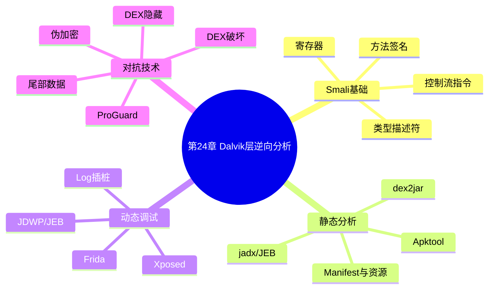

???+ abstract "本章摘要"
    本章系统覆盖 Android Dalvik 层逆向：先从 BakSmali 的寄存器、类型、方法签名和指令规则读起，再给出 Apktool、dex2jar、jd-gui、FernFlower、jadx、JEB 等静态分析路径。之后介绍重打包日志调试、JEB 动态调试、Xposed 与 Frida Hook，并归纳 ProGuard、DEX 破坏、伪加密、尾部加数据和 DEX 隐藏等常见对抗手段。
## 章节导航

上一篇：[第23章 APK基础](第23章 APK基础.md)
下一篇：[第25章 Native层逆向](第25章 Native层逆向.md)
回到目录：[00-目录](00-目录.md)

## 第24章 Dalvik层逆向分析

本章主要介绍Dalvik层逆向的相关知识与解题方法。学习本章时，需要熟练掌握Java、BakSmali的基础知识，以及命令行的基本操作方法。逆向Android程序的时候，推荐使用Linux/Mac平台，以获取更好的命令行支持。

在Dalvik层分析的时候，理解原理很重要，选择一款合适的工具也很重要，有时候一款合适的工具，能够达到事半功倍的效果。

本章首先介绍在逆向分析的过程中所需的基础知识，以及会使用到的几种优秀工具，随后会探讨目前Dalvik层中使用到的混淆及加固技术。

### 24.1 Dalvik基础知识

目前，主流的DEX文件反汇编工具为BakSmali和Dedexer，两者在语法上有很多相似之处，而我们在比赛中经常会用到的工具是BakSmali。下面通过一个例子来了解BakSmali的语法。

例如这样一个简单的Java方法：

```java
public String func(int i, int j) {
    return String.valueOf(i + j - i / j * 3);
}
```

编译成DEX文件，再反汇编成BakSmali，代码如下：

```smali
# virtual methods
.method public func(II)Ljava/lang/String;
.locals 2
.param p1, "i" # I
.param p2, "j" # I
```

```smali
.prologue
.line 54
add-int v0, p1, p2
```

```smali
div-int v1, p1, p2
```

```smali
mul-int/lit8 v1, v1, 0x3
```

```smali
sub-int/2addr v0, v1
```

```smali
invoke-static {v0}, Ljava/lang/String;
>valueOf(I)Ljava/lang/String;
```

```smali
move-result-object v0
return-object v0
.end method
```

下面通过几个关键点阐述一下。

#### 24.1.1 寄存器

Dalvik虚拟机与Java虚拟机的一个最大的不同之处就是Dalvik虚拟机是基于寄存器架构的，它在代码中使用了大量的寄存器。这种设计可以将一部分虚拟机寄存器映射到处理器寄存器上，从而提高运算速度；另一部分寄存器则是通过调用栈进行模拟。Dalvik虚拟机中的每个寄存器都是32位，支持任何类型。Dalvik虚拟机最多可使用65536个寄存器，但是，目前笔者还没有遇到可以用这么多寄存器的函数。

Dalvik虚拟机中的寄存器有两种表示方法——v命名法和p命名法，在前文BakSmali语法中采取的是p命名法。在该代码中，以“p”开头的寄存器表示的是传入的参数，例如，p0代表第一个参数，p1代表第二个参数，以此类推；以“v”开头的寄存器表示的是局部变量，v0代表第一个局部变量，v1代表第二个局部变量，以此类推。而v命名法是将所有参数变量和局部变量都以“v”打头，并没有对参数变量和局部变量进行区分，这么来看，p命名法似乎更符合使用习惯。

在BakSmali语法中，在函数的开始会使用“.locals”字段描述该函数使用的局部变量的个数，使用“.param”字段描述函数参数变量。

#### 24.1.2 类型

Dalvik虚拟机中只有11种变量类型，这些类型可用来表示Java中的所有类型。在BakSmali语法中并不写出类型的全称，而是使用如表24-1所示的语法。

<div style="text-align: center;">表24-1 Dalvik虚拟机的变量类型及其说明</div>


| 语法 | 含义 | 语法 | 含义 |
| --- | --- | --- | --- |
| V | void, 只用于返回值类型 | J | long |
| Z | boolean | F | float |
| B | byte | D | double |
| S | short | L | Java 类类型 |
| C | char | [ | 数组类型 |
| I | int |  |  |

对于32位的变量类型，用一个寄存器就可以储存；而对于64位的变量类型，例如J、D，则需要使用两个连续的寄存器来存储，例如v0、v1。

上述11个类型中，除去L类型和[类型为引用类型，其余类型都是基本类型。

L类型可用来表示Java中的类，例如Java中的类java.lang.String对应的L类型是“Ljava/lang/String;”的形式。字母L后直接跟包的绝对路径，Java表示中的“.”替换为“/”，最后用分号“;”表示对象名结束。

[类型可用来表示基本类型和Java类型的数组。一般表示为[后面紧跟基本类型描述符。例如[I表示int]，I表示int]，I表示int]，以此类推，注意多维数组的维数最多为255个。[类型也可以与L类型结合使用，例如“[Ljava/lang/String;”表示Java中的String[]。

#### 24.1.3 方法

BakSmali语法中的方法定义以“.method”指令开始，以“.end method”指令结束。对于不同类型的方法，BakSmali会用“#”注释该方法的类型，“#virtual methods”表示该方法是一个虚方法，“#direct methods”表示该方法是一个普通方法。

Dalvik虚拟机使用方法名、参数类型和返回值来详细描述一个方法。例如上面的 “func(II)Ljava/lang/String;”，“func” 是方法名，括号里的 “II” 表示两个整型，最后的 “Ljava/lang/String;” 表示返回值。

符号 “->” 的含义与C++类似，例如 “Ljava/lang/String;->valueOf(I)Ljava/lang/String;” 表示方法

“String.valueOf(int)”。

#### 24.1.4 指令特点

Dalvik指令集与Intel x86的汇编指令有很大的相似性，参数都是采用从目标到源的方式。

Dalvik指令集相当于一种变长指令。之前说过，Dalvik指令集具有65535个寄存器，显然要表示这么多寄存器需要16位的空间，但是一般的函数普遍用不到这么多数量的寄存器，如果均采用16位空间存储寄存器编号，会使指令的体积增大，因此Dalvik指令通过“/”后缀来表明寄存器编号的范围（有时也会用来表示常量的取值范围）。常见的后缀有16、from16等，例如“move vA, vB”表示将vB寄存器的值赋给vA，其中A和B的值都占用4位（即0~15），默认没有后缀是4位；“move/from16 vA, vB”表示A的值占用8位，B的值占用16位；而“move/16 vA, vB”中，A和B的值都占16位，以此来节省空间。为了方便阅读，也有的参考文档会将上面三个指令分别写成“move vA, vB”“move/from16 vAA, vBBBB”“move/16 vAAAA, vBBBB”。

Dalvik指令集通过“-”后缀来表示不同的类型，常见的类型有“-wide”“-void”“-object”“-int”等，其中“-wide”表示的是64位常规类型的字节码，而32位的字节码没有后缀。

下面就来介绍几个经常用到的指令。

### 1. 返回指令

常见的返回指令有return-void、return vAA、return-wide vAA、return-object vAA，返回指令是函数结尾时运行的最后一条指令，将向调用者返回指定值（也可能返回空）。需要注意的是，所有函数最后调用的指令都必须是返回指令，如果没有返回值也必须调用return-void，否则编译会不通过。

### 2. 方法调用指令

方法调用指令的模板是 “invoke-kind{vA, vB, vC}, method” 和 “invoke-kind/range{vAAAA..vBBBB}, method”，其中参数写在方法名之前，这两种指令的区别就是后面的指令可以使用范围表示参数。

kind可设置为virtual表示调用实例的虚方法，super表示调用实例的父类方法，direct表示调用实例的直接方法，static表示调用实例的静态方法，interface表示调用实例的接口方法。

方法调用的返回值必须使用 “move-result1-” 类指令来获取，例如上面代码中的`move-result-object` v0。

### 3. 跳转指令

跳转指令是我们修改代码时经常遇到的指令，常见的有“goto”“if-test vA, vB, cond”“if-testz vAA, cond”等，其中的test可以

取“eq”“ne”“ge”等值，与x86汇编类似。

有了这些知识储备，上面的BakSmali反汇编代码应该很容易就能看懂了。Dalvik指令集在网上都有公开的资料，可以非常方便地查到，指令集的知识不是本章的重点，这里不再详述。

### 24.2 静态分析

逆向APK程序的第一步就是对APK文件进行反编译，生成BakSmali格式的代码或者直接生成Java代码，随后才能读懂程序逻辑，分析可能的攻击面，最终找出可能的出题点，进而解出题目。

本节将介绍Dalvik层的静态分析方法，以及与之配合的几款优秀工具。

#### 24.2.1 使用Apktool反编译APK程序

Apktool是一款优秀的APK文件反编译工具，能够将APK文件解压缩，并且将其中的DEX文件转化为BakSmali代码，将resources.arsc文件转化为XML等可阅读格式，是反编译APK文件的首选工具。此外，Apktool还整合了Smali和BakSmaliApktool工具，支持对修改之后的BakSmali代码进行重新打包并签名，因此也是破解Android程序最常用到的工具。

https://ibotpeaches.github.io/Apktool/。Apktool是跨平台工具，同时也支持Windows/macOS/Linux系统；Apktool需要Java的支持，且Java版本需要大于1.7。读者可以按照以下步骤自己编译一个最新版的Apktool：

```bash
$ git clone https://github.com/iBotPeaches/Apktool.git
$ cd Apktool
$ ./gradlew build shadowJar
# 编译生成的 jar文件位于 brut.apktool/apktool-cli/build/libs/
中
```

载安装最新版的Apktool），不过这里还是建议能够自己编译，因为如果目标APK针对Apktool做了混淆，那么编译好的发行版是没有符号的，因此会无法定位到被混淆的位置。

安装完成后，可以使用 “-version” 参数查看Apktool的版本，如果成功回显则表示安装成功，例如：

```bash
$ apktool -version 2.2.0
```

Apktool使用过程中常用的编译和反编译功能命令如下，可以运行命令 “apktool” 以及 “apktool-advance” 查看。

· 反编译APK文件：apktool d[ecode][options]<file_apk>。

· 编译APK文件：apktool b[uild][options]<app_path>。

接下来使用一个具体的实例来讲解。有一个app-debug.apk文件，首先在命令行下进入APK文件所在的目录，然后输入命令“apktool d app-debug.apk”，Apktool就会开始解析APK文件，输出部分信息后，反编译之后的内容会存入同目录下的同名文件夹中，具体如下：

```bash
$ apktool d app-debug.apk
I: Using Apktool 2.2.0 on app-debug.apk
I: Loading resource table...
I: Decoding AndroidManifest.xml with resources...
I: Loading resource table from file:
```

/Users/user/Library/apktool/framework/1.apk
I: Regular manifest package...
I: Decoding file-resources...
I: Decoding values */* XMLs...
I: Baksmaling classes.dex...
I: Copying assets and libs...
I: Copying unknown files...
I: Copying original files...

进入同目录下的app-debug目录，目录结构如下:

```bash
$ tree -L l
```

```text
AndroidManifest.xml
apktool.yml
original
res
smali
```

其中，AndroidManifest.xml文件为APK中的AndroidManifest.xml文件解析之后的可读格式，apktool.yml文件保存着Apktool工具在反编译过程中使用的相关信息，original目录保存着APK文件中原始的AndroidManifest.xml文件和META-INF目录，res目录包含了APK中使用的各种资源文件，smali目录就是Apktool将DEX文件反编译后的BakSmali反汇编代码。

之前APK文件直接通过zip解压后还有一个resources.arsc文件，里面存放着APK中所用资源的名字、ID、类型等关联信息，该文件去哪

了呢？原来，Apktool将resources.arsc文件解密为多个XML文件存放到res/values/目录下了，具体如下：

```bash
$ tree res/values
res/values
    attrs.xml
    bools.xml
    colors.xml
    dimens.xml
```

```text
    drawables.xml
    ids.xml
    integers.xml
    public.xml
    strings.xml
    styles.xml
```

其中，比较重要的是public.xml文件。这个文件中存放着Android程序中所使用的ID与类型、变量名的对应关系，当我们在阅读代码的过程中遇到形如“R.id.xxx”或者“findViewById(xxx)”等形式的代码时，只需要到public.xml中查找该ID所对应的变量类型和变量名，再到相应的XML文件中（例如strings.xml）查找相应的值即可。

AndroidManifest.xml文件存放了该APK的相关属性，做过Android开发的读者应该了解这个文件。AndroidManifest.xml是每个APK中必需的文件。它位于整个项目的根目录，描述了APK中需要向外暴露的组件（例如Activity、Service等），声明它们各自的实现类，声明主程序的入口类，声明所需权限等。

我们拿到一个APK文件，反编译后查看的第一个文件一般都是AndroidManifest.xml。一般情况下，首先要查看该APK包含几个Activity，随后找到该APK的启动Activity；随后查看一下Application组件中是否含有android:name参数，该参数所指向的Activity会在启动Activity实例化之前初始化，有一些题目会将部分关键代码放在这个类中；此外还要留意一下该APK有没有定义其他组件，例如Service、Receiver等，它们可能会用来实现不同进程的RPC调用；关注一下该APK所需的权限，寻找可能的攻击面等。

如下所示的是一个简单的AndroidManifest.xml：

```xml
<?xml version="1.0" encoding="utf-8"?>
<manifest
<लग्नैन:android="http://schemas.android.com/apk/res/android"
<package="com.xx.sample.myapplication">
<application
<android:allowBackup="true"
<android:icon="@mipmap/ic_ launcher"
<android:label="@string/app_name"
<android:supportsRtl="true"
<android:theme="@style/AppTheme">
<activity
<android:name="MainActivity"
<android:label="@string/app_name"
<android:theme="@style/AppTheme.NoActionBar">
<intent-filter>
<action
<android:name="android.intent.action.MAIN"/>
<category
<android:name="android.intent.category.LAUNCHER"/>
</intent-filter>
</activity>
```

```xml
</application>
</manifest>
```

本例中，该APK中只包含了一个Activity，其完整路径是
com.xx.sample.myapplication.MainActivity，同时这个Activity也是该APK的启动Activity。Activity中若包含<action
android:name="android.intent.action.MAIN"/>和<category
android:name="android.intent.category.LAUNCHER"/>属性，即为启动Activity，一个APK中只能有一个Activity。

随后，就可以去smali目录中修改了，smali目录是按照Java的目录格式设置的，能够比较容易地找到目标代码。

修改完成后，返回上层目录，使用apktool b app-debug编译出新的APK。在未指定输出目录的情况下，Apktool会将编译后的APK放在反编译后的dist目录下：

```bash
$ apktool b app-debug
I: Using Apktool 2.2.0
I: Checking whether sources has changed...
I: Checking whether resources has changed...
I: Building apk file...
I: Copying unknown files/dir...
$ tree app-debug/dist
app-debug/dist
app-debug.apk
```

此时编译完成后的APK还不能安装，因为它还没有签名，我们可以使用Google Android源码库（AOSP）提供的签名工具对它进行签名。

首先，下载编译签名程序signapk.jar，可以从地址https://android.googlesource.com/platform/build/+/master/tools/signapk/src/com/android/signapk/SignApk.java处下载并用javac编译。

随后我们需要生成自己的签名文件，这里可以选择使用openssl生成签名文件，遵循如下步骤：

```bash
openssl genrsa -out tmpkey.pem 4096
openssl req -new -key tmpkey.pem -out tmprequest.pem
openssl x509 -req -days 9999 -in tmprequest.pem -signkey
tmpkey.pem -out mykey.pem
openssl pkcs8 -topk8 -outform DER -in tmpkey.pem -inform PEM -out mykey.pk8 -nocrypt
rm tmp*.pem
```

这里的mykey.pem是公钥证书，mykey.pk8是私钥文件。

此外，我们也可以使用Android源码库中提供的测试用签名文件

testkey.pk8和testkey.x509.pem（下载地址（需要梯子）为

https://android.googlesource.com/platform/build/+/master/target/product/security/）。随后就可以签名了，命令如下：

签名完成之后就可以装到手机里运行了。

#### 24.2.2 使用dex2jar生成jar文件

使用Apktool工具可以反编译出APK文件中的BakSmali代码，但是BakSmali代码毕竟还是比较底层的代码，理解起来比较困难，那么，有没有什么办法能够直接将APK文件反编译成Java代码呢？答案是有的，那就是使用dex2jar工具包。

dex2jar，顾名思义，就是将DEX文件转换为Jar文件，除此之外还包含很多其他功能。dex2jar是开源工具，源码可以直接从GitHub（https://github.com/pxb1988/dex2jar）上克隆下来，然后切换到dex2jar目录，运行“./gradlew build”命令，稍等片刻编译出最新版的dex2jar。

编译后的程序位于dex-tools/build/distributions/目录下，该目录下会生成两个压缩包，类似于dex-tools-2.1-SNAPSHOT.zip和dex-tools-2.1-SNAPSHOT.tar。随意挑选其中一个文件，解压到任意目录，并且将解压后的目录加入系统的环境变量中，就可以正常使用dex2jar了。

dex2jar中最常用的功能就是将APK安装包中的DEX文件转化为Jar文件，命令很简单，使用d2j-dex2jar.sh filename，即可在同目录下生成同名的Jar文件，如何查看这个Jar文件将在24.2.3节介绍。

dex2jar工具包中还包含了其他多个有用的工具。

· d2j-apk-sign：可以为APK签名的小工具，该工具将使用dex2jar工具包的签名文件进行签名，可以替代24.2.1节中使用SignApk工具签名的方法。

· d2j-baksmali：可以将APK安装包中的DEX文件转化为BakSmali代码，作用与24.2.1节Apktool的部分功能相似。

· d2j-smali：可以将BakSmali代码编译回DEX文件。

· d2j-dex2smali：可以将DEX文件转化为BakSmali代码。

· d2j-dex-recompute-checksum：可以重新计算DEX文件校验和的小工具，有时候我们直接修改DEX文件后，可以用这个小工具重新计算校验和。

还有一些其他工具，有兴趣的读者可以使用“-h”参数查看各个小工具的具体功能。

#### 24.2.3 使用jd-gui查看反编译的Java代码

24.2.2 节中我们提取了 Jar 文件，那么如何利用 Jar 文件查看 Java 代码呢？这里我们可以使用 jd-gui 工具来实现 Jar 文件的反编译。

jd-gui是开源软件，读者可以从GitHub上

（https://github.com/java-decompiler/jd-gui）直接将其克隆下来，切换到jd-gui的目录，运行“./gradlew build”命令，稍等片刻即可编译出最新版的jd-gui。

编译完成后的jd-gui程序位于build/libs目录下，文件名类似于jd-gui-1.4.0.jar，将jd-gui-1.4.0.jar复制到自己喜欢的路径，使用命令java-jar jd-gui-1.4.0.jar即可运行。

运行界面如图24-1所示，直接将Jar文件拖入，即可反编译查看Java代码。

{ width="100%" }


<div style="text-align: center;">图24-1 JD-GUI布局</div>

#### 24.2.4 使用FernFlower反编译Jar文件

有时候，我们使用jd-gui反编译Jar文件时，有的类或者方法会反编译失败，这是由于Java代码过于复杂等原因造成的jd-gui无法正常反编译，这时，我们可以使用另一款工具FernFlower来反编译Jar文件。

FernFlower工具由JetBrains公司开发，该公司也开发出很多知名IDE，如intellij IDEA、PyCharm、WebStorm而FernFlower就是作为其IDE之一的intellij IDEA所使用的默认反编译器，使用了智能的分析技术，反编译效果非常好。

FernFlower目前已经开源，可以从GitHub地址（https://github.com/feshOr/fernflower）直接克隆下来，切换到fernflower目录，直接输入命令“./gradlew jar”即可完成编译。

编译完成后，在build/lib目录下会生成fernflower.jar文件，将其复制到自己喜欢的路径即可开始使用。运行的命令为：

其中，jar_path为Jar文件的路径，out_dir为输出目录。输出目录不会主动创建，如果输出目录不存在的话，则需要先手动创建一个。

反编译完成后，在输出目录下会看到一个Jar文件，不过不用担心，这个Jar文件中的class文件都已经替换为了Java文件，直接使用unzip解压，即可获得按照Java约定放置的Java类文件夹和“.java”文件。

jd-gui和FernFlower工具各有优缺点：jd-gui本身包含图形界面，运行起来比较方便，FernFlower则是命令行格式，会一次性将所有的类都反编译出来；jd-gui反编译的效果稍微欠缺，FernFlower反编译的效果还是非常好的。我们在使用的过程中，可以将这两个工具结合使用。

#### 24.2.5 使用Android Killer/jadx/APK Studio逆向分析平台

之前我们介绍了几个常用的反编译Dalvik层的工具，不难发现，在一般的反编译过程中，这几个工具几乎是固定的，顺序和命令也几乎固定，每次反编译都需要做一些重复的工作，会极大地浪费宝贵的比赛时间，那么，能不能用一个整合的反编译平台省去这些重复工作呢？当然可以。

本节将介绍三个较为知名的反编译平台，它们部分或全部整合了之前介绍的Apktool、dex2jar、jd-gui等主流反编译工具，极大地提高了我们的反编译效率。三个平台分别是Android Killer、jadx和APK Studio。

### 1. Android Killer

Android Killer由吾爱破解的legend_brother开发，是一款可视化Android应用逆向工具，集APK反编译、APK打包、APK签名、编码互转、ADB通信等特色功能于一身，支持logcat日志输出，语法高亮，基于关键字项目内搜索，可自定义外部工具；吸收并融汇了多种工具的功能与特点，打造一站式逆向工具操作体验，大大简化了Android应用、游戏修改过程中各类烦琐的工作。

Android Killer集合了之前讲过的Apktool、dex2jar、jd-gui、signapk、adb logcat等一系列工具，是目前笔者所使用过的Dalvik静态逆向平台中功能最全的一款。它在后续版本中将添加断点调试BakSmali代码的功能，并且完全免费，不足之处在于它是闭源软件，并且只支持Windows系统，使用Linux或Mac的读者可能需要寻找其他替代软件。

我们可以从吾爱破解的论坛中搜索到Android Killer的最新版。目前笔者能够下载到的版本是Android Killer V1.3.1正式版。

如图24-2所示的是Android Killer工作的主界面，蓝色的主界面看起来非常的清爽，每个功能键都有标注，非常容易上手。

{ width="100%" }


<div style="text-align: center;">图24-2 Android Killer布局</div>

将要反编译的APK文件直接拖入Android Killer中，或者使用“打开”操作，Android Killer会自动使用Apktool反编译APK文件，在“工程管理器”选项卡中，可以浏览当前的反编译目录，双击相应的smali文件即可进行编辑，可以看到，Android Killer对BakSmali代码进行了代码高亮处理，如图24-3所示。

Android Killer还囊括了在逆向过程中经常用到的小工具，例如编码转换、MD5计算等，如图24-4所示。

Android Killer的重打包功能也非常方便。只需点击“编译”按钮，Android Killer就会自动完成重打包以及签名的操作；点击“安装”按钮，Android Killer就会调用其自带的adb将重编译完成后的APK安装到目标手机中，非常方便，如图24-5所示。

除此之外，Android Killer还集成了一些其他的常用功能，例如，列出BakSmali代码中的字符串，如图24-6所示。

Android Killer还设有“插入代码管理器”，可以将自己经常用到的插桩代码保存起来，使用时只需点开复制粘贴即可，不用再到处去找自己保存到哪里了，如图24-7所示。

{ width="100%" }


<div style="text-align: center;">图24-3 Android Killer反编译</div>

{ width="100%" }


<div style="text-align: center;">图24-4 Android Killer小工具</div>


最后，需要注意的一点是，Android Killer毕竟还是基于Apktool等工具来实现的，目前Android Killer已经好久没有升级了，但是Apktool等工具依旧在更新，如果我们重打包失败，可以考虑失败是否由于Apktool版本过低导致。在Android Killer中升级Apktool很简单，点击“APKTOOL管理器”按钮打开APKTOOL管理器，点击下方的“下载最新的Apktool”，根据网页的提示即可将Apktool升级至最新版本，如图24-8所示。

{ width="100%" }


<div style="text-align: center;">图24-5 Android Killer反编译</div>

{ width="100%" }


<div style="text-align: center;">图24-6 Android Killer查看字符串</div>

{ width="100%" }


<div style="text-align: center;">图24-7 Android Killer代码管理器</div>

{ width="100%" }


<div style="text-align: center;">图24-8 Android Killer更新Apktool</div>


### 2. jadx

jadx集成了dex2jar和jd-gui的主要功能，可以实现一键反编译DEX、APK或者Jar文件生成Java代码。jadx是开源软件，使用Java开发，全平台都可用。

jadx的源码可以从https://github.com/skylot/jadx上获取，将源码克隆到任意位置后，切换到jadx目录下，使用“./gradlew

dist”命令即可编译jadx（编译需要Java SDK环境）。编译成功后，切换到jadx目录的“build/jadx/bin”目录下，命令行执行其中的“jadx-gui”程序，即可运行jadx。

使用jadx的打开功能或者直接将APK文件拖入jadx中，即可自动反编译APK文件，显示出Java代码。jadx的代码高亮效果如图24-9所示。

File View Navigation Tools Help
app-release.apk
Source code
android support
com.a.sample.myapplication
onCreate(Bundle) = onCreateOptions(MenuMenu)
onOptionsItemSelected(Menu)
Resources
package com.a.sample.myapplication

```java
import android.os.Bundle
import android.support.design.widget.FloatingActionButton
import android.support.v7.a.u;
import android.support.v7.widget.Toolbar;
import android.view.Menu
import android.view.MenuItem
import android.widget.Button;
import android.widget.TextView;
import android.widget.Toast;
public class MainActivity extends u()
    protected void onCreate(Bundle bundle) {
        super.onCreate(bundle);
        setContentView(int) R.layout.activity_main;
        a(Toolbar) findViewBy(R.id.toolbar);
        ((FloatingActionButton) findViewBy(R.id.fab)), setOnClickListener(new (this));
        ((Button) findViewBy(R.id.button)), setOnClickListener(new b(TextView) findViewBy(R.id.textView), this);
    }
```

```java
        public boolean onCreatedOptionsMenu(Menu menu) {
            getMenuInflater().inflatelR.menu.menu_main.menu;
            return true;
        }
```

```java
        public boolean onOptionsItemSelectedMenuItem menuItem() {
            if (menulten.getItemId) { R.id.action_settings }
            return super.onOptionsItemSelected(menulten);
        }
        Toast.makeText(this, "Just another uiless button", 1, show);
        return true;
    }
}
```

<div style="text-align: center;">图24-9 jadx界面</div>


### 3. APK Studio

APK Studio是另一款比较著名的APK反编译工具，主要集成了Apktool和jarsigner签名的功能，用于修改BakSmali代码以及进行重打包和签名的操作。APK Studio是开源软件，使用Qt5开发，跨平台可用。

## APK Studio的源码可以从

https://github.com/vaibhavandeyvpz/apkstudio中获取，将源码克隆到任意路径后，切换到apkstudio目录即可开始编译。

因为APK Studio是使用Qt5开发的，编译过程会比较复杂，首先需要安装Qt5编译环境，Linux、macOS用户可以使用包管理工具直接安装Qt5，Windows用户可以直接下载GitHub上提供的安装版（其实Windows用户用Android Killer就足够了）。接着在APK Studio执行下面的命令即可完成编译，注意，如果是KDE 5.x的Linux系统，则需要加入下面IF里的命令：

```bash
lrelease res/lang/en.ts
qmake apkstudio.pro CONFIG+=release
# {IF} On KDE 5.x
export CXXFLAGS="$CXXFLAGS -DNO_NATIVE_DIALOG"
# {/IF}
make
```

在macOS系统编译的时候经常会遇到这样的问题，如果执行“ $ l_{release} $ res/lang/en.ts”命令时提示“ $ l_{release} $命令不存在”，那么首先需要确认Qt5j是否已安装，然后需要将Qt5添加到系统执行路径中。使用brew包管理器的用户可以执行“brew link qt5--force”命令来完成此项操作。

在macOS系统中，如果在执行“qmake apkstudio.pro CONFIG+=release”语句时提示“Project ERROR:Xcode not set up properly.You may need to confirm the license agreement by running/usr/bin/xcodebuild.”，则需要修改Qt5的一段代码。打开Qt5的安装目录，例如笔者使用brew安装的默认目录为“/usr/local/Cellar/qt5/5.6.1-1/”，打开该目录下的“mkspecs/features/mac/default_pre.prf”文件，将其中的“isEmpty($$list($$system("/usr/bin/xcrun-find xcrun2>/dev/null")))”语句修改为“isEmpty($$list($$system("/usr/bin/xcrun-find xcodebuild2>/dev/null"))”。

若Qt5编译过程中出现其他问题，读者可自行搜索相关资料。

编译完成后，还需要手动配置Apktool才能正常使用APK Studio。点开设置，修改“Vendor Path”，设置Apktool的路径即可。

使用 “打开” 操作或者将APK文件直接拖入APK Studio中，APK Studio就会自动调用Apktool进行反编译，如图24-10所示。

{ width="100%" }

<div style="text-align: center;">图24-10 APK Studio界面</div>


点击上面的锤子形状的按钮即可进行重打包操作，编译成功后，下方会有提示。点击钥匙形状的按钮可以进行签名操作。APK Studio 的签名操作需要使用自己的keystore，若没有keystore则可以用下面的命令生成一个（“keytool”工具是安装Java的时候自带的）：

```bash
keytool -genkey -alias demo.keystore -keyalg RSA -validity 40000 -keystore demo.keystore
```

点击钥匙按钮，输入keystore路径以及keystore密码、key的别名、key的密码，即可进行签名操作，如图24-11所示。

{ width="100%" }


<div style="text-align: center;">图24-11 APK Studio 签名</div>

APK Studio签名底层使用的是jarsigner工具，jarsigner工具也是开发APK时使用的默认签名工具，但是使用jarsigner对重打包的APK文件进行签名时，失败率却是比较高的，因此使用APK Studio对重打包的APK文件进行签名往往会不成功，这里还是推荐使用24.2.1节的签名方法。

本节介绍了三款逆向分析平台，总的来说，Android Killer功能最为强大、最为齐全，缺点就是只支持Windows平台；jadx非常“酷炫”，但是只能用来查看反编译的Java代码；APK Studio编译非常麻烦，虽然集成了反编译BakSmali和重打包功能，但是用户体验并不好。如何选择，需要各位读者自己判断。

下一节将介绍大名鼎鼎的逆向分析平台JEB，该平台也是功能最为强大、笔者最为喜欢的Android逆向分析平台。

#### 24.2.6 使用JEB进行静态分析

JEB全称JEB Decompiler，由PNF Software公司开发，是一款闭源商业软件，支持对APK、DEX、Jar文件的反编译。JEB目前有两个版本，JEB1和JEB2。JEB1是最为经典的版本，目前已经停止对其的开发与维护；JEB2仍在开发过程中，功能也在不断完善，其动态调试等功能还是很值得期待的。JEB2售价不菲，商业版是每人每月150美元；企业版是每月300美元，可供四人同时使用。有兴趣的读者可以去JEB2的官网（https://www.pnfsoftware.com/）查看。

JEB在反编译DEX文件的过程中参考了Apktool等工具，但是其与Apktool原版并不完全相同。同时，JEB在反编译DEX时生成Java文件的行为也与jd-gui、FernFlower等工具的结果不同，其反编译生成的并不是标准的Java文件，其中包含了“label、goto”等非Java语句，使用这个Java文件进行重打包是肯定会失败的，有时也会使语句晦涩难懂，但是大部分情况下并不会影响理解。

JEB最出色同时也是最吸引笔者的一项功能就是其交叉引用功能，换句话说，你可以随便为类、方法、变量等改名字。这个功能也是JEB能够打败其他反编译工具的关键，其交叉引用功能非常方便，对某个

成员改名后，该成员在其他类里的引用也会相应地改名，成为反混淆过程中的利器。

介绍到此为止，下面我们赶紧来体验一下。在笔者编写初稿时，JEB2还不是很稳定，JEB1还是首选，但是到截稿时，JEB2已经非常成熟了，基本包含了JEB1的所有功能，因此本节我们以JEB2为例进行讲解。笔者使用的是JEB2正式版，其自带中文，用户体验还是比较友好的。

JEB的结构如图24-12所示。

{ width="100%" }


<div style="text-align: center;">图24-12 JEB</div>


启动完毕的界面如图24-13所示，可以看到在没有打开APK的情况下，已经有很多标签页显示出来了。

{ width="100%" }


<div style="text-align: center;">图24-13 JEB布局</div>


将APK文件拖入JEB中的“工程浏览器”下，或者使用“打开”操作打开APK文件，就可以直接开始反编译了，如图24-14所示。左边是

文件树状图和类的树状图，右边默认显示的是BakSmali汇编代码。

选中相应的类，按下 “TAB” 按钮，JEB会切换到 “反编译的 Java” 一栏中，将反编译后的 Java 代码显示出来，如图24-15所示。在 “反编译的 Java” 一栏中直接双击目标类，也会将反编译后的 Java 代码直接显示出来。

{ width="100%" }


<div style="text-align: center;">图24-14 JEB反编译Smali</div>

{ width="100%" }


<div style="text-align: center;">图24-15 JEB反编译Java</div>


我们重点来看一下“反编译的Java”一栏中有什么重要的功能。

左键点击代码中的某个方法名，再右击一下，会显示提示菜单，此处比较重要的是“交叉引用”“备注”和“转换”三个功能，后面的字母代表该功能的快捷键，如图24-16所示。

add_android

coord: (0,29,23) | addr: Loom/a/easyjava/b:->a(V | loc: ? Available decompilers: dex, x86, x86_64, arm, mips


<div style="text-align: center;">图24-16 JEB右键</div>


交叉引用功能可用于查看该方法在其他哪个地方被使用，如图24-17所示。

{ width="100%" }

<div style="text-align: center;">图24-17 JEB交叉引用</div>


注释功能类似于IDA的注释功能，添加注释后会在该行语句的末尾添加注释，以方便查看，如图24-18所示。

?

<div style="text-align: center;">图24-18 JEB添加注释</div>


改变进制常数，也就是进制转换功能，是笔者最喜欢的功能之一。JEB的进制转换功能可以使整数在十进制、十六进制和八进制之间互相转换。不要小看这个进制转换功能，在反编译的过程中，该功能能够节约大量的时间，尤其是在转换进制查看资源引用时会特别方便。

下面我们来看一下JEB的其他功能。

双击Manifest文件可以对Manifest.xml文件进行预览，在这里，我们能够看到解密之后的Manifest.xml文件，如图24-19所示。

资源文件提供了对res目录的预览功能，我们需要点击左侧的Resources文件进入，该文件是查找Java代码中对id的引用过程中必不可少的功能。通过图24-20可以看到，public.xml中对id的表示都是十六进制，此时就是我们的整数进制转换功能登场的时候了。

资源栏会显示对APK文件中assets目录的预览，并且能够以十六进制的形式显示文件，非常方便。

以上就是对使用JEB进行静态分析的基本介绍了，关于使用JEB2进行动态调试的相关内容，将在24.3节中详细介绍。

{ width="100%" }


<div style="text-align: center;">图24-19 JEB查看Manifest.xml</div>

{ width="100%" }


<div style="text-align: center;">图24-20 JEB查看资源文件</div>

#### 24.2.7 其他的静态分析软件

在静态分析领域，除了上述几款笔者经常用到的软件之外，还有一些软件的知名度也非常高。

知名的恶意软件分析工具包Androguard也是在静态分析过程中经常会用到的工具。Androguard是开源软件，可以从地址https://github.com/androguard/androguard下载，其包含多个小工具，主要用于对APK进行各个方面的分析。例如androapkinfo.py可以用来查看APK文件的信息，androaxml.py可以用来解密APK包中的AndroidManifest.xml文件，androodd.py可以用来生成APK文件中每个类的方法的调用流程图，androdiff.py可以用来比较两个APK文件的差异，androgexf.py可以用来生成APK的GEXF格式的图形文件。目前Androguard的开发进度比较快，上层框架经常修改，因此这里不再详细介绍，有兴趣的小伙伴可以参看其官方文档。

逆向工具IDA Pro也是支持对DEX文件的静态分析的，只要将APK文件拖入IDA Pro中，在弹出的窗口中选择class.dex，IDA Pro就会自动识别出DEX的文件格式，并且对其进行反编译，如图24-21所示。更多关于IDA Pro的内容可参阅网上相关信息。

{ width="100%" }

<div style="text-align: center;">图24-21 IDA Pro反编译Dex</div>

### 24.3 动态调试

本节将介绍Dalvik层的动态调试方法。相比静态调试，动态调试更简单，它通过对关键代码的插桩、打断、Hook等方式，直接跳过复杂的分析流程，可一步得到最终结果，使用非常方便。本节将介绍两种调试方法——log调试和smali动态调试，以及两个知名Hook框架——Xposed和frida。

#### 24.3.1 使用 $ \log $调试

log调试是一种最简单也是最常见的调试方法，通过修改反编译后的BakSmali汇编代码，加入自定义的语句，可以实现打印信息、修改执行流程、篡改返回值等功能。不过，这里需要注意的是，log调试需要对APK进行重打包，因此并不适用于使用了完整性校验、签名校验等保护技术的APK。在选择log调试的时候，首先要仔细研究代码，根据是否存在类似的反篡改措施来判断是否使用log调试。

进入正题，Android开发框架提供了多个log静态方法，都位于android.util.Log类中，比较常见的方法如下：

· Log.v(String tag, String msg);

· Log.d(String tag, String msg);

• Log.i(String tag, String msg);

· Log.w(String tag, String msg);

• Log.e(String tag, String msg).

需要注意的是，这些方法都具有两个参数，因此我们在插入log调试代码时，不仅需要传入打印的字符串变量，还需要另一个变量来保

存tag参数的字符串。因此在实际操作中，为了尽量减少代码的修改，可以从上下文中选取一个不再使用的局部变量，用来存储tag字符串。

下面来看一个实例，假设我们在分析过程中发现了关键的跳转代码，其中v0表示我们的输入，v1表示目标字符串，如果输入与目标字符串相等，则跳转至得到flag的流程，如果输入与目标字符串不相等，则跳转至没有得到flag的流程。因此，根据动态调试的理念，如果我们能够直接得到v1的值，就可以直接得到flag了：

```smali
invoke-virtual {v0, v1}, Ljava/lang/String;
>equals(Ljava/lang/Object;)Z
move-result v0
if-eqz v0, :cond_0
```

此时，我们需要插入代码打印出v1的内容。log打印需要两个参数，一个是v1（已经确定了），还需要再找一个局部变量来存储tag的内容。这里包含两个思路：一个是可以将log方法的两个参数都写为v1，这样可以减少对其他局部变量的影响，缺点是缺少标识，使得log打印的信息容易被其他logcat信息淹没；另一个思路就是找一个不再使用的变量，或者即将被赋予新值的变量，来承担起tag的作用。如果实在找不到闲置的局部变量，又不想使用第一个思路，则可以修改你要打印语句所在的方法的声明，将局部变量数量加一，但是笔者并不推荐这种做法，因为该做法可能会产生不可预知的后果。

好的，假设现在我们找到了闲置的局部变量v2，只要按照BakSmali汇编的语法来插入log语句就行了，这里笔者选择了Log.v方法。完整的代码如下：

```smali
const-string v2, "PWN"
invoke-static {v2, v1}, Android/util/Log;->v(Ljava/lang/String;Ljava/lang/String;)I
invoke-virtual {v0, v1}, Ljava/lang/String;->equals(Ljava/lang/Object;)Z
move-result v0
if-eqz v0, :cond_0
```

然后按照Apktool重打包的步骤，完成重打包后运行即可。使用adb logcat命令可以查看log的输出信息，如图24-22所示，使用grep命令结合tag参数，可以更快找到我们想要的调试信息。

```bash
$ adb logcat l grep PWN
\underline{V/PWN} ( 2872): flag{this_is_flag}
```

<div style="text-align: center;">图24-22 log法打印flag</div>

#### 24.3.2 smali动态调试

24.3.1节介绍了传统的log调试法，可以看出，使用log调试还是比较烦琐的，需要仔细阅读代码，那么有没有一种方法可以在不修改BakSmali代码的情况下去直接调试BakSmali代码呢？答案是有的，本节将介绍直接调试BakSmali代码的方法——使用JEB2进行调试。本来笔者还想做一个使用Smalidea插件调试的教程，但是最新版的IntelliJ IDEA已经不兼容最新版的Smalidea插件了，为了不误导读者，故将这部分内容删去了。

介绍这种方法之前，必须先了解为什么BakSmali代码可以被调试。

调试特性的出现最开始是为了满足开发人员的需求。Dalvik虚拟机在最初的版本中就加入了对调试的支持，为了与传统Java开发的调试接口统一，Dalvik虚拟机实现了JDWP（Java Debug Wire Protocol，Java调试有线协议），可以支持使用JDWP的调试器来调试Android程序，例如Java程序员所熟知的jdb。

Dalvik虚拟机为JDWP的实现加入了DDM（Dalvik Debug Monitor，Dalvik调试监控器）特性，可以使用DDMS（Dalvik Debug Monitor Server，Dalvik调试监视器服务）查看，运行Android SDK的tools目

录下的monitor即可打开DDMS。DDMS主要用于实现设备截屏、查看线程信息、文件预览、模拟来电、模拟短信、模拟GPS信息等功能。DDMS功能强大，但是它不能用于调试BakSmali代码，因此DDMS也不是本节的重点。

每一个启用调试的Dalvik虚拟机实例都会启动一个JDWP线程，该线程一直处于空闲状态，直到打开DDMS或者调试器连接。那么什么是启用调试的Dalvik虚拟机实例呢？新的App应用启动时，Android服务框架会为它创建一个新的Dalvik虚拟机，Android服务框架会首先检查系统属性ro.debuggable是否为1，如果是1，则新开的Dalvik虚拟机会启用调试；如果是0，则Android服务框架会进一步检查APK的AndroidManifest.xml文件，如果<application>元素中包含了android:debuggable="true"则会开启调试，否则就不开启调试。

查看ro.debuggable属性的方法，是运行“adb shell getprop ro.debuggable”命令，如果显示为1则表示已启用，显示为0则表示未开启。

可见，若想使用BakSmall调试功能，要么需要系统属性

ro.debuggable为1，要么需要APK具有android:debuggable="true"属性。在默认情况下，使用Android AVD生成的模拟器的ro.debuggable属性为1，在默认情况下，使用Google Android源码库（AOSP）编译出来的镜像的ro.debuggable属性也为1。那么如果ro.debuggable属性为

0呢？一个很简单的办法就是使用Apktool对APK进行反编译，修改
AndroidManifest.xml文件，为其添加上
android:debuggable="true"属性，再重打包回去。这种方法具有一定的局限性，因此这里采用特定的方法修改系统的ro.debuggable属性。

setpropex，是一款可以修改系统属性的工具，使用这个工具需要root权限。源码位于https://github.com/jduck/rootadb中。克隆到任意路径，切换进去，执行ndk-build命令即可完成编译（没有ndk-build命令？先去下载Android NDK吧）。编译完成后的可执行程序位于libs/armeabi目录下，有两个文件setpropex和setpropex-pie，使用哪一个文件取决于系统版本，如果是Android5.0以上的版本，则需要使用setpropex-pie文件。

编译完成后，adb push到手机里，运行即可修改系统属性，示例命令如下：

```bash
$ adb push setpropex-pie /data/local/tmp
[100%] /data/local/tmp/setpropex-pie
$ adb shell
shell@hammerhead: / $ su
shell@hammerhead: / # getprop ro.debuggable
0
shell@hammerhead: / # /data/local/tmp/setpropex-pie
ro.debuggable 1
shell@hammerhead: / # getprop ro.debuggable
1
```

这样就成功修改了系统的ro.debuggable属性，可以对任意的APK进行调试了。Android本身还带有一个setprop命令用于修改系统属性，但是这个命令基本没用。

下面开始介绍具体的调试方法。

JEB2相比JEB1的进步之处就是它增加了APK的动态调试功能，而且这个功能不需要烦琐的操作，只需要点击一个按钮即可进入调试。

目前JEB2的调试功能并不稳定，使用时需要多加注意。JEB2的动态调试界面如图24-23所示。

<div style="text-align: center;">⚫️ ⚫️ ⚪️</div>


{ width="100%" }


coord: (8601,26,32) | addr: Lcom/a/sample/t.../onClick(Android/View/View/V+80h | loc: T

<div style="text-align: center;">图24-23 JEB动态调试界面</div>


使用JEB2的动态调试功能前，需保证系统设定了ro.debuggable属性或者APK本身具有android:debuggable="true"属性，然后就可以调试了。

开始调试的方法非常简单，首先在手机上运行APK；然后点击JEB2上方的调试按钮，在弹出的对话框中选择目标手机以及要调试的App的名字，点击Attach，即可进入调试模式。需要注意的是，目标App的Flags一栏中需要有D属性，如果没有，则是系统的ro.debuggable属性没有设置好，需要重新设置，如图24-24所示。

{ width="100%" }


<div style="text-align: center;">图24-24 JEB选择目标进程</div>


图24-25中的按钮从左至右分别为调试、运行、暂停、停止、单步进入、单步执行、跳出函数、运行到指针处，都是极为常见的调试按钮。

{ width="100%" }


<div style="text-align: center;">图24-25 JEB动态调试按钮</div>


进入JEB2的调试模式之后，Project Explorer一栏中会出现新的一项——VM。VM中包括Locals栏、Breakpoints栏和Threads栏，其中

Locals栏用于显示局部变量，Breakpoints栏用于显示断点信息，Threads栏用于显示APK运行的所有线程，如图24-26所示。

在BakSmali代码栏中，选择某一行，使用Control+B（macOS系统中是Command+B）快捷键下断点，下了断点的语句会在它的左边显示断点标志。下完想要的断点之后，点击运行按钮，然后触发目标事件，就能将断点下在目标代码处了，这个时候的调试与一般的调试方法一样，如图24-27所示。

{ width="100%" }


| Name | Type | Value | Extra |
| --- | --- | --- | --- |
| this | Lcom | id=3829 |  |
| v0 | int | 315306496 | 12CB3200h |
| v1 | int | 315306496 | 12CB3200h |
| v2 | int | 2131099682 | 7F060022h |
| v3 | int | 1 | 1h |
| v4 | int | 316032032 | 12D64420h |
| v5 | int | 314700800 | 12C1F400h |

<div style="text-align: center;">a) JEB 动态调试窗口 (1)</div>


| VM/Breakpoints | VM/Threads | Name |
| --- | --- | --- |
| Address | Thread ID State | MAIN |
| ✓ Lcom/a/sample/findmydex/a;->onCli... | PRE PAUSED | main |
| ✓ 2 WAITING Signal Catcher |  |  |
| 3 WAITING FinalizerWatchdogDaemon |  |  |
| 4 RUNNING Binder_1 |  |  |
| 5 WAITING GCDaemon |  |  |
| 6 WAITING FinalizerDaemon |  |  |
| 7 WAITING HeapTrimmerDaemon |  |  |
| 8 WAITING ReferenceQueueDaemon |  |  |
| 9 RUNNING Binder_2 |  |  |
| 10 RUNNING Binder_3 |  |  |
| 11 RUNNING RenderThread |  |  |
| 12 WAITING AsyncTask #1 |  |  |
| 13 WAITING AsyncTask #2 |  |  |
| 14 RUNNING hwuiTask1 |  |  |
| 15 RUNNING hwuiTask2 |  |  |
| Description | Thread type | Enter to date |
| Stack | Thread | MemoryCode |

b) JEB 动态调试窗口 (2)

<div style="text-align: center;">图 24-26</div>


{ width="100%" }


<div style="text-align: center;">图24-27 JEB动态调试界面</div>


总的来说，JEB2的动态调试功能还是非常强大的，能在比赛过程中节约不少的时间。

#### 24.3.3 使用Xposed框架Hook进程

本节将介绍Xposed框架，大部分Android发烧友应该都听说过Xposed框架。Xposed框架可以在不修改APK的情况下影响APK的运行，基于它可以制作出许多功能强大的模块，被誉为“Android第一神器”。

Xposed框架从本质上讲采用的是Hook技术，该框架通过在/system/bin/目录的app_process程序下注入代码，使之在启动的时候优先加载Xposed框架的XposedBridge.jar文件，该文件在内部会检索安装的APK，检查APK是否具有Xposed模块的标志，如果有，则将该APK注册为Xposed模块。此后，当其他的APK运行时，注册的模块会优先运行，并根据代码进行相关的Hook操作。Xposed框架是开源软件，更多信息可查看GitHub了解更多内容

（https://github.com/rovo89/Xposed）。

下面我们来看一下Xposed框架的安装步骤。根据Xposed框架的原理，我们首先要做的是向app_process程序注入代码，Xposed官方给出了两种方法：一种是直接修改app_process程序，另一种是通过刷入刷机包来替换app_process程序。

在这之前，首先需要安装Xposed框架的模块管理器，网址为 http://repo.xposed.info/module/de.robv.android.xposed.installer，需要注意的是，5.0以上和5.0以下版本的系统需要安装不同的模块管理器。根据安装页面上的提示，5.0以下（不包括5.0）的系统需要安装名字为de.robv.android.xposed.installer_vXXX.apk的APK，5.0以上的系统需要安装名字为XposedInstaller_3.0_XXX.apk的APK。

第一种方法比较简单，但是该方法需要具有ROOT权限，并且需要机型与系统版本的支持，该方法多见于5.0以下（不包括5.0）的系统中。打开之前安装的“XposedInstaller”，点击“框架”，会依次出现如图24-28所示的界面，直接点击其中的“安装/更新”即可，图24-28中笔者已经用该方法成功修改了app_process程序。若是“安装/更新”按钮为灰色，则说明你的手机不支持使用该方法进行安装，需要选择第二种方法。

{ width="100%" }


## 10 :22

## Xposed Installer

## 欢迎使用 Xposed 安装器请选择您想进行的操作：

## 框架

此处您能管理 Xposed 框架，任何模块的正常运行都需要它。

## 模块

框架本身不增加任何功能。您需要使用模块。安装模块后在此处激活它们。

## 下载

此处您能访问模块仓库，您可以搜索并下载您喜欢的模块，并及时更新它们。

## 设置

此处可配置 Xposed 安装器和框架。

## 日志

显示并保存/发送Xposed框架产生的日志。

## 关于

了解 Xposed 作者、获取帮助支持的方法等信息。


| 版本： | 激活 | 程序自带 |
| --- | --- | --- |
| app_process | 58 | 58 |
| XposedBridge.jar | 54 | 54 |
| 框架 | 安装/更新 |  |
| 卸载 |  |  |
| 安装方式 | 经典（直接写入/system） |  |
| 重启 | 软重启 |  |

<div style="text-align: center;">图24-28 Xposed框架界面</div>


第二种方法略微烦琐。

首先从网站http://dl-xda.xposed.info/framework/下载适用于自己手机的刷机包，其中，sdk21代表5.0系统，sdk22代表5.1系统，sdk23代表6.0系统（其他版本的系统在完稿时暂时还不支持）；随后选择自己手机的处理器架构（ARM、ARM64、X86），下载最新版，例如笔者下载的是xposed-v86-sdk22-arm.zip，代表ARM架构的5.1系统，Xposed框架版本是86。

下载完刷机包后使用recovery刷入即可。这里的recovery需要第三方的recovery，可能有的读者对于recovery刷机的方法还不太熟悉，这里做个简单的介绍。假设手机系统现在是原厂镜像，那么首先需要刷入第三方recovery，笔者比较喜欢CM的recovery镜像，因此要去CM官网上下载针对自己手机的recovery镜像，网址为http://download.cyanogenmod.org/。例如笔者的Nexus 5手机，下载的recovery镜像为cm-13.0-20160820-SNAPSHOT-ZNH5YA00J2-hammerhead-recovery.img。随后在手机开机状态下使用“adb reboot bootloader”命令，或者在关机状态下按住音量下键和电源键五秒钟进入手机的fastboot模式，然后使用“fastboot flash recovery cm-13.0-20160820-SNAPSHOT-ZNH5YA00J2-hammerhead-recovery.img”命令即可刷入recovery，再重启即可。随后在手机开机状态下使用“adb<nl>

reboot recovery” 命令，或者在关机状态下按住音量上键和电源键即可进入recovery模式。进入CM的recovery模式后，刷入刷机包也有两种方法。第一种，需要使用USB数据线将手机与电脑相连，在手机端依次选择“Apply update”→“Apply from ADB”，然后在电脑端的刷机包路径下，输入“adb sideload xposed-v86-sdk22-arm.zip”命令，稍等片刻即可刷入完成；另一种方法，需要事先将刷机包传入手机，然后在手机端依次选择“Apply update”→“Choose from emulated”，选择自己刷机包的路径，稍等片刻即可完成刷机。这里推荐第一种刷机方法。

刷机完成后，再打开XposedInstaller，可以看到app_process成功刷入了。如图24-29所示的是刷入前后的对比图，可以看到，无论刷入成功与否，“安装/卸载”按钮始终都是灰色的。如果想卸载，也很简单，只要刷入Xposed框架的卸载刷机包即可，具体可查看官网教程。

## □ ☐

## 9 :48

{ width="100%" }


## Framework

The Xposed framework is not installed. Please download the latest ZIP file from XDA and flash it manually via recovery.

Install/Update

## FRAMEWORK

Uninstall

## INSTALLATION MODE

Classical (write to /system directly)

## REBOOT

## Soft reboot

Reboot

## ☐

## 7 :16

Xposed framework version 86 is active.

{ width="100%" }


## Framework

Install/Update

## FRAMEWORK

## INSTALLATION MODE

Uninstall

Classical (write to / system directly)

## REBOOT

Soft reboot

Reboot

<div style="text-align: center;">图24-29 Xposed刷机界面</div>


完成了app_process的修改工作，只是完成了Hook环境的搭建，下面才是真正进入Hook的过程。

Xposed模块从本质上来讲是一个Android App，需要有一定的Android APK开发经验，开发环境可以选择Android studio或者IntelliJ IDEA，两者之间的区别并不大，这里笔者选择的是IntelliJ IDEA。

打开Intellij IDEA，新建一个“Empty Activity”工程，包命名为“com.a.sample.xposed”，打开工程下的app/build.gradle文件，在“dependencies”依赖中，添加如下两个依赖：

provided 'de.robv.android.xposed:api:82'
provided 'de.robv.android.xposed:api:82:sources'

随后同步Gradle。之后打开app/src/main/AndroidManifest.xml文件，在application属性中添加如下三个子属性：

<meta-data
    android:name="xposedmodule"
    android:value="true"/>
<meta-data
    android:name="xposeddescription"
    android:value="Xposed example"/>
<meta-data
    android:name="xposedminversion"
    android:value="54"/>

其中，xposedminversion表示支持的最低的Xposed API版本，这里添加的三个属性就是之前提到的Xposed模块的标志了。

完成了环境准备工作之后，现在就可以新建一个Hook类了，例如笔者新建了一个Sample类，代码如下：

```java
package com.a.sample.xposed;
```

```java
import de.robv.android.xposed.IXposedHookLoadPackage;
import de.robv.android.xposed.XC_MethodHook;
import de.robv.android.xposed.XposedBridge;
import de.robv.android.xposed.callbacks.XC_LoadPackage;
import java.util.Arrays;
import java.util.Locale;
```

```java
import static
```

de.robv.android.xposed.XposedHelpers.findAndHookMethod;

```c
/**
 * Created on 16/10/3.
*/
```

```java
public class Sample implements IXposedHookLoadPackage {
```

```java
    private static final String appName =
    "com.a.sample.xposed";
```

```java
    private static String completeClassName(String className) {
        return appName + "." + className;
    }
```

```c
    // s.length <= 1024
    private static void log(String s) {
        XposedBridge.log(s);
    }
```

```java
    @Override
    public void handleLoadPackage(XC_LoadPackage.LoadPackageParam lpparam) throws Throwable {
```

```java
if (!appName.startsWith(lpparam.packageName))
    return;
```

```java
log("Loaded app: " + lpparam.packageName);
```

```java
findAndHookMethod(completeClassName("a"),
lpparam.classLoader, "a", byte[]).class, new
XC_MethodHook() {
    @Override
    protected void
beforeHookedMethod(MethodHookParam param) throws Throwable
{
    log(String.format(Locale.ENGLISH,
"beforeHookedMethod: %s.%s",
param.thisObject.getClass().getName(),
param.method.getName());
    for (int i = 0; i < param.args.length;
i++) {
        log(String.format(Locale.ENGLISH,
"\targument %d is: %s", i, param.args[i].toString());
        log(Arrays.toString((byte[])
    );
    }
```

```java
    @Override
    protected void
afterHookedMethod(MethodHookParam param) throws Throwable
{
    param.setResult("");
}
}
```

简单讲解一下上面的类。要想实现Xposed框架的Hook功能，Hook类需要实现Xposed框架的IXposedHookLoadPackage接口，并实现该接口的handleLoadPackage方法。该方法在每一个新的APK运行的时候都将被Xposed框架调用，传入的参数类型为

XC_LoadPackage.LoadPackageParam，该参数包含所启动的APK的包信息。因此可以使用appName.startsWith(lpparam.packageName)来判断启动的APK是否为我们想要Hook的APK，如果不是则返回。

接下来使用Xposed框架的核心方法findAndHookMethod，使用该方法能够Hook指定类的某个方法的传入参数及返回值，该方法的定义如下：

findAndHookMethod(String className, ClassLoader loader
classLoader, String methodName, Object...
parameterTypesAndCallback)

其中，className是要Hook的类名；classLoader可以直接填入传入参数lpparam的classLoader，如上面例子所示；methodName是要Hook的方法名；随后要填入方法的参数类型，用逗号隔开；最后填入一个XC_MethodHook类的回调方法，该方法定义了beforeHookedMethod和afterHookedMethod两个回调方法。两个回调方法分别代表方法调用前传入的参数以及函数调用后返回的值。这两个回调方法的参数类型都是MethodHookParam，传入的参数可以使用param.args操作获取到一个Object列表，传出的参数可以使用setResult方法修改返回值。

Xposed框架提供的log方法XposedBridge.log()可以将log同时输出到logcat和XposedInstaller中，点击XposedInstaller中的“日志”按钮即可查看，非常方便。

编写完Hook类后，还需要最后一步，在app/src/main/assets/目录下新建xposed_init文件，这个文件主要用于声明要调用的Hook类的类名（Java类的表示形式），例如本例中就要写入：

com.a.sample.xposed.Sample

最后编译并安装APK，编译过程中建议关闭proguard混淆，或者将Hook类添加到proguard混淆例外中。安装完成后打开XposedInstaller，点击“模块”，即可看到刚才编写的Xposed模块了，如图24-30所示。点击右边的小方块打上对勾，然后重启手机，即可应用该模块。

{ width="100%" }


Xposed

Xposed example

{ width="100%" }


{ width="100%" }

<div style="text-align: center;">图24-30 Xposed启动模块</div>


以上就是Xposed框架的一个简单教程，该教程提供的方法可以满足最基础的Hook操作。同时，Xposed框架作为“Android第一神器”，还提供了很多更加强大的功能，具体可查看Xposed框架的官方文档。

#### 24.3.4 使用Frida框架Hook进程

本节将介绍另一个强大的Hook框架——Frida。Frida是一个全平台支持的Hook框架，它支持Windows、Mac、Linux、iOS和Android各平台。虽然各平台在底层实现的方式并不相同，但在上层都抽象为相同的JavaScript API调用，注意是JavaScript API，非常灵活，同时也需要使用者具有一定的JavaScript编写能力。

针对Android的Frida来讲，实现Hook需要在手机端运行一个frida-server，frida-server本身集成了Google的V8解释器（新版的好像换成了Duktape），用于解析JavaScript代码。frida-server的实现原理是使用ptrace系统调用在目标进程中注入一段代码，随后断开ptrace调试，该代码与frida-server之间使用pipe管道进行通信，frida-server与客户端的代码之间使用adb的端口转发进行通信，因此frida-server需要使用Root权限运行。

Frida是开源软件，网站位于http://www.frida.re/，源码托管于GitHub，有兴趣深入研究其实现原理的读者可以去GitHub查看。

下面就来介绍在Android系统中使用Frida框架来进行Hook操作的基本方法。Frida的原理如图24-31所示。

{ width="100%" }


<div style="text-align: center;">图24-31 Frida原理</div>


如图24-31所示，我们要区分Frida框架的三个层次，分别是客户端、服务端、注入代码。客户端，指的是运行在电脑上的Frida程序，这一部分代码主要负责唤醒服务端、将JavaScript语言的Hook代码传递到服务端、接收远程服务端传回的信息、封装远程调用等功能，在

Frida中，客户端的实现语言有很多种，例如Python、JavaScript、C#等，本节将着重介绍Python和JavaScript两种客户端实现方式。服务端，指的是运行在手机上的frida-server，该frida-server内置了Google V8解释器，用于接收客户端传过来的JavaScript代码并执行，也就是说，真正的Hook代码必须使用JavaScript语言编写。注入代码，指的是使用ptrace注入目标进程中的代码，这段代码由服务端实现，我们作为使用者并不需要太过于关注该代码。

了解了Frida框架的三个层次之后，下面先来讲解Frida客户端的实现方式。

### 1. Frida客户端实现

## （1） Python客户端

Frida框架的Python客户端是Frida客户端中使用最为广泛的一种，也是安装最容易、代码最易实现的一种。

首先安装Frida的依赖库，代码如下：

pip install frida

安装完成后可以使用 “frida-ps-U” 命令查看远程服务端有没有启动。

下面就可以编写客户端代码了，示例如下：

```python
import frida, sys
```

```python
def on_message(message, data):
    if message['type'] == 'send':
        print("[*] {0}".format(message['payload》）
    else:
        print(message)
```

```python
jscode = ""
//jscode here
""
```

```python
process =
frida.get_usb_device().attach('com.some.package')
script = process.create_script(jscode)
script.on('message', on_message)
script.load()
sys.stdin.read()
```

上面的jcode为需要填入的传给客户端的JavaScript代码，包名“com.some.package”为目标APK的名字，on_message函数在下方会注册成消息处理函数。运行后即可启用一个Frida客户端。

## （2） JavaScript客户端

相对于Python客户端来说，JavaScript客户端的实现就比较烦琐了。但是其也有自己的优点，即它可以使客户端和服务端使用同一种语言，而不用在IDE之间来回切换。

使用JavaScript客户端需要安装nodejs和npm环境，Mac和Linux用户可以利用包管理器轻松实现。

nodejs和npm环境安装完成后，需要新建一个目录，例如新建一个名为frida的目录，然后在目录中新建一个名为package.json的文件，写入如下内容：

```json
{
    "name": "frida_tools",
    "version": "0.0.0",
    "private": true,
    "scripts": {
        "start": "node app.jsx"
    },
    "dependencies": {
        }
    }
```

其中，name可以随意，dependencies暂时留空，随后输入如下命令安装最新版Frida：

npm install co frida frida-load --save

安装完成后，新建一个名为app.jsx的文件，注意，后缀不能为js，因为Frida框架的JavaScript客户端的实现需要ES6标准。在app.jsx写入如下内容：

```javascript
'use strict';
const co = require('co');
```

```javascript
const frida = require('frida');
```

```javascript
const load = require('frida-load');
```

```javascript
let target = 'com.some.package';
let file = './agent.jsx';
```

```javascript
let session, script;
co(function *() {
    const device = yield frida.getUsbDevice();
    session = yield device.attach(target);
    onMessage('Pid: ' + session.pid);
    const source = yield load(require.resolve(file));
    script = yield session.createScript(source);
    script.events.listen('message', onMessage);
    yield script.load();
} .catch(onError);
```

```javascript
function onError(error) {
    console.error(error.stack);
}
```

```javascript
function onMessage(message) {
    if (message.type === 'send') {
        console.log(message.payload);
    } else if (message.type === 'error') {
        console.error(message.stack);
    } else {
        console.log(message);
    }
}
```

Frida中使用co库来进行异步调用，代码看上去会略微烦。其中，target变量，指明了目标APK的包名；file变量指明了需要传入服务端的JavaScript代码的位置；onError和onMessage函数分别为错误消息处理函数和普通消息处理函数。其实在该代码中，除了target和file两个变量之外，其余的代码都不需要另做修改，可以直接拿来复用。

以上就完成了客户端代码的编写，下面来介绍服务端代码的编写。

### 2. Frida服务端实现

编写服务端代码之前，首先要下载并启动服务器。我们可以从网址https://github.com/frida/frida/releases下载最新版的frida-server，下载完成后依次使用如下命令将frida-server发送至手机上，修改权限并运行：

```bash
adb push frida-server /data/local/tmp/
adb shell "chmod 755 /data/local/tmp/frida-server"
adb shell "/data/local/tmp/frida-server &"
```

frida-server运行后，我们在PC端可以使用 “frida-ps-U” 命令快速查看frida-server是否运行成功，如果该命令运行成功，则会返回当前运行的进程信息。需要注意的是，frida-server对高版本Android系统的支持并不好，目前笔者测试的最稳定的系统版本是5.1.1。

现在终于可以进行服务端Hook代码的编写了，一个典型的Hook代码如下：

```javascript
'use strict';
if (Java.available) {
```

```javascript
Java.perform(()=> {
    let classz = Java.use('com.some.package.a');
    clazz.a.implementation = function (s) {
        send('called');
        console.log(s);
        return this.a(s);
    };
});
```

在Frida中进行Dalvik层Hook之前必须使用Java.available变量判断当前的Dalvik层Hook是否可用；此外，Dalvik层的Hook代码必须定义为一个函数并使用Java.perform(...)方法注册，这里笔者使用的是一个匿名函数。

使用Java.use()函数选取要Hook的类，直接使用“-”操作符选择类中的方法即可，例如，上面的clazz.a表示的是com.some.package.a类中的a方法。

在Frida中对Dalvik层方法进行Hook时，并不是像Xposed一样提供了一个before回调和一个after回调，而是直接将方法修改掉。将目标方法的implementation属性修改为一个新的函数，即可完成Hook，此后调用该方法时，将直接调用新函数。如果想运行原方法，在函数内部调用“this.”方法名即可，例如上面的this.a。需要注意的是，此处新函数的参数类型虽然不用声明，但是数量必须与原函数相同，否则将无法找到目标函数。

在Hook函数内部既可以使用console.log将变量打印出来，也可以使用send函数将变量发送到客户端打印出来，这两个函数的调用结果有时候相同，有时候不同，我们可以同时使用。

读者此时可能会提出疑问，如果有的方法名字相同、参数数量也相同，那么这样的重载方法该怎么区分呢？答案是使用overload函数，在目标方法后调用overload函数可用于指明重载函数的类型，overload函数传入代表类型的字符串作为参数，有几个参数就传入几个参数字字符串。例如下面两个例子：

clazz.a.overload('java.lang.String').implementation = ...
clazz.a.overload('java.lang.String', 'int').implementation = ...

表示Hook的是包含一个参数且类型为String的a方法，以及包含两个参数且类型分别为String和int的a方法。

这里需要注意的是，如果传入的参数为数组类型，则需要写作

Dalvik中参数类型的表示形式。例如“byte[]”类型需写作“[B”，

字符串数组“String[]”类型需要写作“[Ljava/lang/String;”，关于这点一定要注意。

特别的，类的构造方法和析构方法可分别用$new和$dispose来表示。

Frida还有很多其他的API调用，这里就不展开介绍了，具体可以查看官方API手册（http://www.frida.re/docs/javascript-api/#java），此外还有一些隐藏的API调用，具体可以查看相关源码。

最后，将客户端和服务端代码整合起来，就能完成Hook了。

Frida框架对于Dalvik层的Hook就介绍到这里。相对Xposed框架来说，Frida框架的使用就显得难以理解了，Frida服务端使用JavaScript实现，如何实现Java类与JavaScript对象之间的无缝转换成为需要考虑的主要问题。Xposed框架使用Java开发，因此其对Java对象的掌握就更加明确一些；而Frida框架的优点是不需要反复重启手机，熟练使用之后还是非常好用的，如何取舍需要读者结合实际自行判断。

关于Frida对Native层Hook功能的更多内容可参见后文的第25章。

### 24.4 Dalvik层混淆及加固技术

本节将介绍在比赛中经常遇到的Dalvik层混淆及加固技术，了解这些技术的原理和特征，将对我们的解题带来很大帮助。

#### 24.4.1 ProGuard混淆

ProGuard混淆是Android SDK默认的，自带的混淆器，其主要功能是对类名、方法名、变量名等标识符进行混淆，将它们修改为无意义的字母组合，如图24-32所示，我们在APK中经常看见的a、b、c类并不是出题者故意设计的，而是由ProGuard混淆器混淆之后的结果。

{ width="100%" }


<div style="text-align: center;">图24-32 ProGuard混淆之后的类</div>


ProGuard混淆的开启方式非常简单，只要在编译之前将build.grade配置文件中的minifyEnabled属性设为true即可，因此大部分的题目默认都会开启该混淆。

但是需要注意的是，ProGuard混淆并不会混淆所有的类名、方法名、变量名，对于一些重要的接口类、接口方法等是不会做混淆的，例如Activity类的onCreate方法，如果混淆则APK将无法启动。要想查看ProGuard混淆默认不对哪些名字做修改，可以查看Android SDK的默

认混淆设置，该设置文件位于Android SDK目录下的tools/proguard/proguard-android.txt文件中。

我们在解题的时候，还是要从关键的接口方法入手，逐步进行查看。这里推荐使用JEB来查看APK的方法逻辑，熟练使用它的交叉引用和重命名功能，将看懂的方法改为我们容易辨识的名字，这样对于提高做题速度有非常大的帮助。

#### 24.4.2 DEX破坏

我们在解题的时候，无论是使用单独的工具还是使用反编译平台，第一步一般都会使用Apktool对APK进行反编译，因此有的题目针对这点，做了一些专门的处理。它们会将classes.dex等文件的部分字段改掉，改掉的部分不会影响APK在手机中的正常运行，但是会影响Apktool对反编译的处理，使得Apktool进入异常处理流程最终退出反编译。

针对这种加固方法没有一个一概而论的解决办法，具体情况还要具体分析，现在只能提供两种解决思路：一种是跟随Apktool的报错信息，逐步回溯查看到底是解析什么字段的时候出现的问题，进而解决问题，使用该方法需要具有一定的代码阅读能力；另一种思路是找到一个正常的APK文件，对其中的classes.dex、AndroidManifest.xml等需要解析的文件进行对比，查看能否找到异常的字段，进而将异常字段改回。

此外，要记住随时将Apktool更新到最新版本，新版本可能会修复一些BUG，从而排除是由于Apktool版本过低而不是题目的原因造成的反编译失败。

#### 24.4.3 APK伪加密

APK伪加密也是在比赛过程中偶尔会遇到的加固方式。APK文件从本质上来说是一个ZIP压缩文件，通过将其加密字段设为1，可以达到伪加密的效果，使得在使用unzip等工具解压该APK的时候，提示输入密码，但是无论输入什么密码都是不对的。而在Android系统中，APK文件属于Android软件文件，Android系统有一套单独的解包工具，在解包过程中会跳过加密字段，因此修改加密字段并不会影响APK的运行，但会影响我们反编译。

APK伪加密的原理是修改对标记为“P K 0102”的连续4位字节后的第5位字节，1表示加密、0表示不加密。因此我们要去除伪加密只需将相关字节设置为0即可。同时，Android Killer工具自带一键去除伪加密功能，使用Windows系统的读者可以尝试一下。

#### 24.4.4 APK增加数据

有的APK会在正常的APK文件末尾增加一些没用的数据来破坏解压缩流程，使得解压缩失败。这个方法与上面的伪加密类似，都是因为电脑与手机处理APK文件的逻辑不一样而造成的。Android系统在处理APK文件时，是根据标志头和标志尾来界定APK的范围的，因此在APK尾部附加信息并不会影响APK的运行。而在电脑中，这个APK文件却会被界定为错误的压缩文件，从而使得解压缩失败。

解决的方法就是将多余的数据剔除，当然，多余的数据中是否包含提示或者脑洞之类的语句，还是需要注意一下的。

#### 24.4.5 DEX隐藏

DEX隐藏也可以称为DEX加壳，就是将真正需要执行的DEX隐藏到某个位置。APK执行的时候实际上执行的是解壳程序，解壳程序将真正的DEX文件解密出来，再使用DexClassLoader动态加载，DEX隐藏的实现方式灵活多变，这里也无法形成一个统一的解决方案。需要注意的是，解密出来的DEX文件都需要使用DexClassLoader加载，而使用DexClassLoader加载DEX文件需要将DEX文件首先保存到文件中，因此其调用DexClassLoader和保存文件的位置就是解题的突破口。

## 学习梳理

???+ tip "Dalvik 与 Smali 读码要点"
    - `p` 寄存器表示参数，`v` 寄存器表示局部变量；`.locals` 与 `.param` 是函数入口的优先检查点；
    - 方法签名由类、方法名、参数描述符和返回值描述符组成，例如 `Ljava/lang/String;->valueOf(I)Ljava/lang/String;`；
    - `L...;` 表示对象引用，`[` 表示数组；`J`、`D` 等 64 位类型占用连续两个寄存器；
    - 分析控制流时先定位 `invoke-*`、`move-result-*`、`if-*`、`goto` 与 `return-*`，再沿寄存器追踪数据；
    - 指令的 `/from16`、`/16` 后缀反映操作数宽度，不能当成不同的业务语义。
???+ tip "静态分析工作流"
    1. 用 Apktool 解包并读 `AndroidManifest.xml`、`assets`、`res/values/public.xml`；
    2. 从启动 Activity、Application、Service、Receiver 和权限声明建立入口与攻击面；
    3. 用 jadx / jd-gui / FernFlower 获得 Java 视图，同时保留 Smali 作为最终事实来源；
    4. 对混淆符号用 JEB 的交叉引用与重命名持续注释；
    5. 修改 Smali 后重打包、签名、安装，再做行为验证。
???+ tip "动态分析与 Hook 选择"
    - 需要快速观察已有变量且可重打包时，优先考虑 `Log` 插桩；
    - APK 可调试或可设置 `ro.debuggable` 时，用 JEB/JDWP 断点直接查看寄存器和调用链；
    - Xposed 适合基于 Java 回调的系统级模块化 Hook，环境安装与重启成本较高；
    - Frida 由客户端、`frida-server`、注入 JavaScript 三部分组成，适合快速、交互式 Hook，重载方法必须显式用 `overload` 区分。
!!! warning "易错点"
    - ==`move-result-*` 必须紧随产生返回值的 `invoke-*` 使用==，读码或插桩时破坏这一关系会导致逻辑或验证失败；
    - APK 重打包后的安装失败常见于签名、资源、版本或完整性校验，不能只把问题归因于 Smali 修改；
    - `ro.debuggable=1` 与 `android:debuggable="true"` 是两条不同的调试开启路径；
    - ==Frida 重载方法的参数类型要按 Java/Dalvik 描述符精确指定==，数组如 `byte[]` 对应 `[B`；
    - 反编译失败先排查工具版本、伪加密、尾部数据、DEX 字段破坏与壳，而不是直接断言 APK 无法分析。
??? note "自测题"
    **基础**
    1. BakSmali 中 `p` 与 `v` 寄存器各代表什么？
    2. `Ljava/lang/String;->valueOf(I)Ljava/lang/String;` 如何拆解？
    3. 为什么 `J`、`D` 类型需要连续两个寄存器？
    4. 静态分析 APK 时，为什么要先读 Manifest 和 `public.xml`？
    5. Apktool、dex2jar、jadx、JEB 各自最适合承担什么任务？
    6. Log 插桩为何可能不适用于有完整性校验的 APK？
    7. Xposed 与 Frida 的 Hook 代码主要分别使用什么语言？
    8. APK 伪加密为何会影响电脑端解压而不影响 Android 运行？

    **进阶**
    9. 如何从 `DexClassLoader` 与文件写入点定位被隐藏的 DEX？
    10. 遇到全是 `a`、`b`、`c` 的类和方法时，如何以可复用方式恢复语义？

    **参考答案**
    1. `p` 表示传入参数，`v` 表示局部变量。
    2. 它表示 `java.lang.String` 类的 `valueOf` 方法，接收一个 `int`，返回 `String`。
    3. Dalvik 单个寄存器为 32 位，`long` 与 `double` 为 64 位。
    4. Manifest 提供组件、入口和权限；`public.xml` 把资源 ID 映射回类型和变量名。
    5. Apktool 适合资源/Smali 解包与回包；dex2jar 转换 DEX 为 Jar；jadx 适合快速 Java 浏览；JEB 强于交叉引用、重命名与调试。
    6. 插桩会改变 APK 内容，可能触发完整性或签名校验。
    7. Xposed 模块通常用 Java，Frida 的真正 Hook 逻辑用 JavaScript。
    8. 它只篡改 ZIP 的加密字段，Android 的 APK 解包逻辑会跳过该字段。
    9. 追踪解密后 DEX 的落盘和 `DexClassLoader` 调用位置，那里是动态加载链的关键点。
    10. 从未混淆接口、生命周期、字符串、资源 ID 和调用关系起步，结合 JEB 交叉引用与重命名逐步恢复语义。
## 本章思维导图



## 参考资料

- 原书：CTF特训营（FlappyPig战队 著，机械工业出版社 2020）。
- Apktool：https://ibotpeaches.github.io/Apktool/
- jadx：https://github.com/skylot/jadx
- Frida：https://frida.re/
- Xposed：https://github.com/rovo89/Xposed

*来源：《CTF特训营》（FlappyPig战队 著，机械工业出版社 2020），OCR 全内容保留整理版。*
