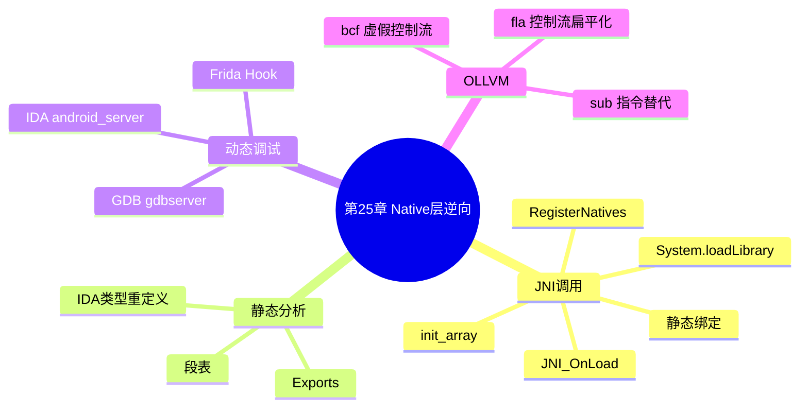

???+ abstract "本章摘要"
    本章转入 Android Native 层：先解释 Java 与 C/C++ 之间的 JNI 静态绑定、动态注册与库加载链，再以 IDA Pro 识别导出函数、`JNI_OnLoad`、`init_array` 为静态分析入口。随后给出 IDA、GDB、Frida 的动态调试方法，并归纳 OLLVM 的控制流扁平化、虚假控制流和指令替代三类常见混淆。
## 章节导航

上一篇：[第24章 Dalvik层逆向分析](第24章 Dalvik层逆向分析.md)
下一篇：[第26章 IoT基础知识](第26章 IoT基础知识.md)
回到目录：[00-目录](00-目录.md)

## 第25章 Native层逆向

本章将介绍Native层的逆向破解，Native层的逆向破解是比赛中的重点，也是比赛中中等难题和难题必定要涉及的知识。因此，掌握Android Native层的逆向破解是从新手通往高手的必由之路。

本章将分为四个部分讲解Native层的逆向破解，首先了解一下Java层调用Native层的机制和原理，然后研究一下静态分析和动态调试Native层lib的方法。

### 25.1 Native层介绍

本节将讲解Native层的机制和原理，换句话说也是Android NDK的原理，具体将从正向和逆向两个方面来介绍Android NDK的调用原理。

#### 25.1.1 正向——使用NDK编写Native层应用

本节将从开发者的角度研究NDK的机制。

Android NDK是Google提供的一个开发工具包，使用这个工具包能够让Java层的代码调用到Native层，也就是C/C++代码，使APK能够实现一些更加底层的功能。Android NDK目前支持x86、ARM、MIPS等架构，但是一般题目中只会出现ARM架构，因此本节的所有实例均默认为ARM架构。

## Android NDK可以从网址

https://developer.android.com/ndk/downloads/index.html处下载完成后解压到任意目录，然后将解压目录添加到系统路径里，当能够成功调用“ndk-build”命令时，则表示安装成功。

本节将介绍标准的Android NDK开发方法，一般来说，中等难度的题目会采用本节所介绍的方法开发APK。

NDK开发的目的是为了使Java层能够调用C/C++层中的某个函数，而不是使Native层独立于Java层运行，而NDK正是提供了这样一种方法，使得Java层的方法与C/C++层的函数能够耦合起来，让调用C/C++层的函数与调用普通Java方法一样简单。

开发的第一步需要在Java文件中声明要使用Native层的方法的名字，方法的名字前面需要加上native参数，表明该方法是一个Native层方法，例如，新建了如下所示的一个类，里面有一个Native方法：

```java
public class NdkTest {
    public native String getNativeString();
}
```

将这个文件保存为NdkTest.java，然后在同目录下，运行“javahNdkTest”命令，就会在同目录下生成NdkTest.h文件。当类在某个包（package）里面时，需要将包的全称写清楚。

下面来看一下新生成的这个文件，文件的内容非常简单，具体如下：

```c
/* DO NOT EDIT THIS FILE - it is machine generated */
#include <jni.h>
/* Header for class NdkTest */
```

```c
#ifdef _Included_NdkTest
#define _Included_NdkTest
#ifdef _cplusplus
extern "C" {
#endif
/*
    * Class: NdkTest
    * Method: getNativeString
    * Signature: ()Ljava/lang/String;
    */
JNIEXPORT jstring JNICALL Java_NdkTest_getNativeString (JNIEnv *, jobect);
#ifdef _cplusplus
```

首先是一个头文件<jni.h>，这个头文件中声明了NDK中JNI调用所需的各个变量。其次声明了一个函数

Java_NdkTest_getNativeString，返回值为jstring。该函数的参数有两个，类型分别为JNIEnv*和object，第一个参数为当前线程的

JNIEnv环境变量指针，第二个参数object为该函数所属java类实例的指针。与方法getNativeString()没有参数不同，这两个参数JNIEnv*和object是每个JNI函数必须的，如果上层的Java声明中包含了参数的话，则JNI函数的参数列表将按数量增加，类型则与声明的变量类型对应。

需要注意的是，函数Java_NdkTest_getNativeString的声明前有JNIEXPORT参数，这个参数表明该函数是导出的，即使NDK在编译过程中关闭了符号，该符号也会存在，并且仍然是一个导出函数，因此是可以从IDA的Exports窗口中看到的。

头文件生成后，下面进行第二步，编写相关函数的实现，一个简单的示例代码如下：

```c
#include "NdkTest.h"
```

```c
JNIEXPORT jstring JNICALL
Java_NdkTest_getNativeString(JNIEnv* env, jobject obj)
```

```c
{
    return (*env�) -> NewStringUTF(env, "Just a test!");
}
```

这个函数返回了一个Java字符串“Just a test!”，更多的JNI函数请查阅Android JNI调用文档。

第三步修改编译参数，即新建两个文件：Android.mk、Application.mk，示例代码如下：

```makefile
Android.mk
LOCAL_PATH := $(call my-dir)
include $(CLEAR_VARS)
LOCAL_MODULE := ndk_test
LOCAL_SRC_FILES := NdkTest.c
include $(BUILD_SHARED_LIBRARY)
Application.mk
APP_ABI := armeabi-v7a
APP_PIE := true
```

然后使用ndk-build编译就行了，上面的LOCAL_MODULE变量指明了生成的lib库文件的名字，例如本例中生成的库文件名为libndk_test.so。

最后一步，显式地加载lib库文件，NDK生成的库文件需要显式加载，毕竟APK事先是不知道你要加载什么库的，加载库文件的指令一般

写在类的static字段里，例如，之前的NdkTest类可以修改为如下代码：

```java
public class NdkTest {
    static {
        System.loadLibrary("ndk_test");
    }
    public native String getNativeString();
}
```

这样，一个简单的NDK JNI调用例子就写好了，就可以像调用Java方法一样调用C/C++函数了。

从这个步骤中不难看出，NDK JNI调用需要具备三个条件，分别是：需要有System.loadLibrary方法显式加载lib库文件；其次Java类中需要有native声明的方法；最后需要Native层中有带JNIEXPORT参数的形如Java_Package_Class_method的函数。

这三个条件是形成JNI调用的充分条件，那么它们是不是必要条件呢？答案是：前两个条件是必要条件，是所有类型的JNI调用都需要具有的条件，但是最后一个就不一定了，因为Native函数是可以动态注册的。接下来，我们将详细介绍Native函数动态注册的原理。

#### 25.1.2 JNI调用特征分析

本节我们将从源码的角度分析Dalvik虚拟机加载外部lib库的执行流程，来看一下是否有隐藏在开发者文档之外的耦合方法。

本节的源码以Android 7.0.0_r1为例。想要查看Android源码的读者可以访问这个网站（http://androidxref.com/）查看，搜索和浏览都非常方便。

首先定位到System.loadLibrary()方法，其位于源码的/libcore/ojluni/src/main/java/java/lang/System.java路径下，该方法代码如下：

1529 public static void loadLibrary(String libname) {
1530
Runtime.getRuntime().loadLibrary0(VMStack.getCallingClass
Loader(), libname);
1531 }

可以看出这个方法的流程非常简单，首先调用

VMStack.getCallingClassLoader()方法获取当前的ClassLoader，然后调用Runtime里的loadLibrary0方法。

下面来看一下loadLibrary0方法，该方法位于/libcore/ojluni/src/main/java/java/lang/Runtime.java目录下，具体代码如下：

959 synchronized void loadLibrary0(ClassLoader loader, String libname) {
960 if (libname.indexOf((int)File.separatorChar) != -1) {
961 throw new UnsatisfiedLinkError(
962 "Directory separator should not appear in library name: " + libname);
963 }
964 String libraryName = libname;
965 if (loader != null) {
966 String filename = loader.findLibrary(libraryName);
967 if (filename == null) {
968 // It's not necessarily true that the ClassLoader used
969 // System.mapLibraryName, but the default setup does, and it's
970 // misleading to say we didn't find "libMyLibrary.so" when we
971 // actually searched for "libMyLibrary.so.so".
972 throw new UnsatisfiedLinkError(loader + " couldn't find \"") + 973
System.mapLibraryName(libraryName) + "\");
974 }
975 String error = doLoad(filename, loader);
976 if (error != null) {
977 throw new UnsatisfiedLinkError(error);
978 }
979 return;
980 }
981
982 String filename = System.mapLibraryName(libraryName);
983 List<String> candidates = new ArrayList<String>();

984 String lastError = null;
985 for (String directory : getLibPaths()) {
986 String candidate = directory + filename;
987 candidates.add(candidate);
988
989 if (IoUtils.canOpenReadOnly(candidate)) {
990 String error = doLoad(candidate, loader);
991 if (error == null) {
992 return; // We successfully loaded the library. Job done.
993 }
994 lastError = error;
995 }
996 }
997
998 if (lastError != null) {
999 throw new UnsatisfiedLinkError(lastError);
1000 }
1001 throw new UnsatisfiedLinkError("Library" + libraryName + " not found; tried " + candidates);
1002 }

从上面的代码可以看出，loadLibrary0方法根据传入的 ClassLoader类型的参数值不同，会进入不同的执行流程，当 ClassLoader不为空时，会利用ClassLoader的findLibrary方法来获取lib文件的路径，这个方法主要是对传入的lib名字补上“lib”前缀和“.so”后缀，然后从一个路径表里查找最终的绝对路径。找到绝对路径后将路径传入doLoad方法里继续执行。

doLoad方法仍然在这个类里面，代码如下（省略了注释的部分）：

1031 private String doLoad(String name, ClassLoader loader) {
1032 // ...
1051 String librarySearchPath = null;
1052 if (loader != null && loader instanceof BaseDexClassLoader) {
1053 BaseDexClassLoader dexClassLoader = (BaseDexClassLoader) loader;
1054 librarySearchPath = dexClassLoader.getLdLibraryPath();
1055 }

1056 //...
1059 synchronized (this) {
1060 return nativeLoad(name, loader, librarySearchPath);
1061 }
1062 }

这个方法也比较简单，首先获取LD_LIBRARY_PATH路径的值，然后将库文件名字、ClassLoader实例、LD_LIBRARY_PATH路径的值传入nativeLoad函数中继续载入。

Java层的nativeLoad方法在Native层定义为Runtime_nativeLoad函数，源码位于/libcore/ojluni/src/main/native/Runtime.c中，具体代码如下：

77 JNIEXPORT jstring JNICALL
78 Runtime_nativeLoad(JNIEnv* env, jclass ignored,
jstring javaFilename,
79     jobject javaLoader, jstring
javaLibrarySearchPath)
80 {
81     return JVM_NativeLoad(env, javaFilename,
javaLoader, javaLibrarySearchPath);
82 }

这个函数非常简单，将参数原封不动地传给了JVM_NativeLoad函数。

## JVM_NativeLoad函数位于源码

的/art/runtime/openjdkjvm/OpenjdkJvm.cc路径下，具体代码如下：

322 JNIEXPORT jstring JVM_NativeLoad(JNIEnv* env,
323 jstring javaFilename,
324 jobject javaLoader,
325 jstring
javaLibrarySearchPath) {
326 ScopedUTFChars filename(env, javaFilename);
327 if (filename.c_str() == NULL) {
328 return NULL;
329 }
330
331 std::string error_msg;
332 {
333  art::JavaVMExt* vm = art::Runtime::Current()-
>GetJavaVM();
334 bool success = vm->LoadNativeLibrary(env,
335 filename.c_str(),
336 javaLoader,
337
javaLibrarySearchPath,
338 &error_msg);
339 if (success) {
340 return nullptr;
341 }
342 }
343
344 // Don't let a pending exception from JNI_OnLoad
cause a CheckJNI issue with NewStringUTF.
345 env->ExceptionClear();
346 return env->NewStringUTF(error_msg.c_str());
347}

这个函数也不长，简单看一下，首先将lib库的路径名从jstring类型转化为普通字符串，然后使用art::Runtime::Current()->GetJavaVM()调用获取当前的Java虚拟机指针，新建一个std::string类型的变量error_msg来保存返回的字符串，最后将所有的变量全部传入vm->LoadNativeLibrary函数中。

接下来调用的函数JavaVMExt::LoadNativeLibrary就非常长了，这个函数也是加载lib库的核心函数，重点代码摘录如下，全部代码位于/art/runtime/java_vm_ext.cc文件中，有兴趣的读者可以研究学习一下。JavaVMExt::LoadNativeLibrary函数代码如下：

722 const std::string& path,
723 jobject
class_loader,
724 jstring
library_path,
725 std::string*
error_msg) {
726 error_msg->clear();
727
732 SharedLibrary* library;
733 //...
789 const char* path_str = path.empty() ? nullptr : path.c_str();
790 void* handle = android::OpenNativeLibrary(env,
791 runtime_-
>GetTargetSdkVersion(),
792 path_str,
793
class_loader,
794
library_path);

795
796 //...
844 sym = library->FindSymbol("JNI_OnLoad", nullptr);
845 if (sym == nullptr) {
846 VLOG(jni) << "[No JNI_OnLoad found in \"" << path << "]\";
847 was_successful = true;
848 } else {
849 // Call JNI_OnLoad. We have to override the current class
850 // loader, which will always be "null" since the stuff at the
851 // top of the stack is around
Runtime.loadLibrary(). (See
852 // the comments in the JNI FindClass function.)
853 ScopedLocalRef<object> old_class_loader(env, env->NewLocalRef(self->GetClassLoaderOverride());
854 self->SetClassLoaderOverride(class_loader);
855
856 VLOG(jni) << "[Calling JNI_OnLoad in \"" << path << "]\";
857 typedef int (*JNI_OnLoadFn)(JavaVM*, void*);
858 JNI_OnLoadFn juni_on_load =
reinterpret_cast<JNI_OnLoadFn>(sym);
859 int version = (*jni_on_load)(this, nullptr);
860
861 if (runtime -> GetTargetSdkVersion() != 0 && runtime -> GetTargetSdkVersion() <= 21) {
862
fault_manager.EnsureArtActionInFrontOfSignalChain();
863 }
864
865 self-
>SetClassLoaderOverride(old_class_loader.get());
866
867 if (version == JNI_ERR) {
868 StringAppendF(error_msg, "JNI_ERR returned from JNI_OnLoad in \"%s\"", path.c_str());
869 } else if (IsBadJNIVersion(version)) {
870 StringAppendF(error_msg, "Bad JNI version returned from JNI_OnLoad in \"%s\"": %d", 871 path.c_str(), version);
872 // ...
873 } else {
874 was_successful = true;

880 }
881 VLOG(jni) << "[Returned " << (was_successful ?
"successfully" : "failure")
882 << " from JNI_OnLoad in \"" << path <<
"\"]";
883 }
884
885 library->SetResult(was_successful);
886 return was_successful;
887}

简单解释一下上面的代码。

首先，声明一个SharedLibrary类型的指针library用于指向加载之后的lib库文件，程序首先会检查目标lib库文件是否已经加载，如果已经加载，则直接返回，如果未加载则会调用

于/system/core/libnativeloader/native_loader.cpp路径下，主要功能是调用Linker（Android系统中的连接器）的dlopen函数加载lib库。

dlopen调用完成后，会使用library-

>FindSymbol("JNI_OnLoad", nullptr)命令查找lib库中是否有名为“JNI_OnLoad”的导出函数。如果没有，则返回；如果有，则调用它，然后判断它的返回值是否合法，如果返回值合法，则加载库函数成功。

以上就是Java加载外部lib库的大概流程，我们不难看出其中包含两个关键代码：一个是dlopen函数的调用，另一个是JNI_OnLoad函数的调用。这两个调用都是能够被我们自定义的代码打断的。

对于dlopen调用，熟悉Linux系统编程的同学应该知道，dlopen调用时会搜索目标lib文件代码中是否包含init_array段，如果包含这个段，则dlopen会在加载的时候运行它。

对于JNI_OnLoad调用，如果lib文件中具有该导出函数，在加载过程中会自动运行它。

因此，上述两个调用，是Android题目中中等难题和难题经常使用的两个技术点，下面我们举个例子来看一下。

首先看一下JNI_OnLoad函数，如下代码是一个JNI_OnLoad函数动态注册Native方法的示例：

```c
#include <stdlib.h>
#include <string.h>
#include <stdio.h>
#include <jni.h>
#include <assert.h>
```

```c
/* This is a trivial JNI example where we use a native method
    * to return a new VM String. See the corresponding Java source
    * file located at:
    * apps/samples/hello-
```

jni/project/src/com/example/HelloJni/HelloJni.java
*/
string native_hello(JNIEnv* env, jobject thiz)
{
    return (*env)->NewStringUTF(env, "动态注册JNI");
}

```c
/**
* 方法对应表
*/
static JNINativeMethod gMethods[] = {
    {"stringFromJNI", "()Ljava/lang/String",
    (void*)native_hello}, //绑定
};
```

```c
/*
* 为某一个类注册本地方法
*/
static int registerNativeMethods(JNIEnv* env
```

    , const char* className
    , JNINativeMethod* gMethods, int numMethods) {
        jclass class;
        clazz = (*env)->FindClass(env, className);
        if (clazz == NULL) {
            return JNI_FALSE;
        }
        if ((*env)->RegisterNatives(env, class, gMethods, numMethods) < 0) {
            return JNI_FALSE;
        }

```c
        return JNI_TRUE;
    }
```

```c
}
```

```c
/*
* 为所有类注册本地方法
*/
static int registerNatives(JNIEnv* env) {
    const char* kClassName =
    "com/example/hellojni/HelloJni"; //指定要注册的类
    return registerNativeMethods(env, kClassName, gMethods,
        sizeof(gMethods) / sizeof(gMethods[0]);
}
```

```c
/*
* System.loadLibrary("lib")时调用
* 如果成功则返回JNI版本，若失败则返回-1
*/
JNIEXPORT jint JNICALL JNI_OnLoad(JavaVM* vm, void* reserved) {
    JNIEnv* env = NULL;
    jint result = -1;
```

```c
    if ((*vm)->GetEnv(vm, (void**) &env, JNI_VERSION_1_4) != JNI_OK) {
        return -1;
    }
    assert(env != NULL);
```

```c
    if (!registerNatives(env)) { //注册
        return -1;
    }
    //成功
    result = JNI_VERSION_1_4;
```

```c
    return result;
}
```

再来看一下init_array的内容，下面的范例能够在init_array中添加内容，代码如下：

```c
void my_init(void) __attribute__((constructor));
void my_init(void)
{
    //Do something
}
```

同样，在这个代码段里运行(*env)->RegisterNatives函数，也可以动态地增加Native调用。

综上所述，我们在解题过程中需要重点关注两个入口——

JNI_OnLoad函数和init_array段，重点关注一个函数——(*env)->RegisterNatives函数，那么所有动态注册的Native函数就尽在掌握了。

在25.2节中，我们将学习高效的逆向lib库文件。

### 25.2 使用IDA Pro静态分析

对于静态分析来说，最知名同时也是使用得最多的当属大名鼎鼎的静态反汇编分析工具IDA Pro了。IDA Pro从6.1版本开始，提供了对Android程序的逆向与动态调试功能。目前最新的IDA Pro 7.0已经内置了Android NDK中关键数据结构的定义，已经可以不用添加外置“.h”头文件来解码Android NDK中的结构定义了。

因此，本节将主要介绍IDA Pro在静态分析中的使用方法，其他静态分析工具本节暂不介绍了，有兴趣的读者可以自行查看相关文档。

同样的，本节也不是IDA Pro的入门教程，重点在介绍使用IDA Pro逆向过程中用到的一些技巧。

按照做题的一般步骤，拿到APK文件后，通过unzip解压缩，在lib目录下一般会看到相应的so文件，很显然，将这个so文件拖入IDA Pro，我们的逆向旅程就正式开始了。

打开一个so文件的第一步，就是查看其导出表，即Exports选项卡，查看是否有我们感兴趣的函数。根据25.1节的内容，我们感兴趣的函数有两类，一类是标准的Native方法命名的函数，另一类是JNI_OnLoad函数，如图25-1所示。

{ width="100%" }


<div style="text-align: center;">图25-1 IDA Pro查看导出表</div>


在这个so文件中没有找到标准的Native方法命名的函数，但是找到了JNI_OnLoad函数，双击该函数，如图25-2所示。

{ width="100%" }


<div style="text-align: center;">图25-2 IDA Pro查看JNI_OnLoad函数</div>


在没有加入混淆的情况下，直接按F5键，就可以反编译成C语言的形式（若不能反编译，请考虑一下是否定义了函数，在汇编语言的第一句按p定义函数），效果如图25-3所示。

{ width="100%" }


<div style="text-align: center;">图25-3 IDA Pro查看反编译的C代码</div>


可能有读者会产生这样的疑问，这个JNI_OnLoad函数为什么与标准的定义不一样？里面的代码要如何处理？这里就要讲一下逆向过程中的第一个技巧：重定义函数参数类型。

首先，我们将光标移动到函数名 “JNI_OnLoad” 上，然后右键选择 “Set item type” 或者直接按y快捷键，弹出修改函数名称及参数的选项，将函数定义改成标准形式（这里还是保留“__fastcall”参数），如图25-4所示。

{ width="100%" }


<div style="text-align: center;">图25-4 IDA Pro修改参数类型</div>


然后点击OK，函数的参数就被修改了，同时，代码中原先的各种调用也成功显示出来了，如图25-5所示。

{ width="100%" }


<div style="text-align: center;">图25-5 IDA Pro查看反编译效果</div>


同样的，在处理标准的Native方法命名的函数时也是一样的思路。因为标准的Native方法命名的函数，其前两个参数是确定的，但

是后面还有几个参数，这个是与Java层里面的定义相关的。有时候，IDA Pro并不能正确地识别参数个数，需要手动修改函数的定义，我们只需要将函数参数类型修改为正确的类型即可，例如object、jstring、jint等，这些Android NDK的标准类型目前都是受IDA Pro支持的。

下面讲解在逆向分析过程中往往会被忽视的部分——init_array 段。

要想查看该字段，首先要打开IDA Pro的Segments窗口，具体方法我们可以依次点击菜单栏的View→Open subviews→Segments来操作，如图25-6所示是某个so文件的Segments窗口。


| Name | Start | End | R | W | X | D | L | Align | Base | Typ |  |
| --- | --- | --- | --- | --- | --- | --- | --- | --- | --- | --- | --- |
| .pit | 000011DC | 00001484 | R | . | X | . | L | dword | 01 | pu |  |
| .text | 00001484 | 00002F28 | R | . | X | . | L | dword | 02 | pu |  |
| .ARM.extab | 00002F28 | 00002F64 | R | . | . | . | L | dword | 03 | pu |  |
| .rodata | 00003098 | 000051D9 | R | . | . | . | L | qword | 04 | pu |  |
| .fini_array | 00006DC0 | 00006DC8 | R | W | . | . | L | dword | 05 | pu |  |
| .init_array | 00006DC8 | 00006DD0 | R | W | . | . | L | dword | 06 | pu |  |
| .got | 00006EF8 | 00007000 | R | W | . | . | L | dword | 07 | pu |  |
| .data | 00007000 | 0000700C | R | W | . | . | . | L | dword | 08 | pu |
| .bss | 0000700C | 0000700D | R | W | . | . | . | L | byte | 09 | pu |
| extern | 00007010 | 000070A4 | ? | ? | ? | . | L | para | OA | pu |  |
| abs | 00007160 | 0000716C | ? | ? | ? | . | L | para | OB | pu |  |

<!-- source-integrity:namestartendrwxdlalignbasetyp.pit000011dc00001484r.x.ldword01pu.text0000148400002f28r.x.ldword02pu.arm.extab00002f2800002f64r...ldword03pu.rodata00003098000051d9r...lqword04pu.finiarray00006dc000006dc8rw..ldword05pu.initarray00006dc800006dd0rw..ldword06pu.got00006ef800007000rw..ldword07pu.data000070000000700crw..ldword08pu.bss0000700c0000700drw..lbyte09puextern00007010000070a4???.lparaoapuabs000071600000716c???.lparaobpu -->

<div style="text-align: center;">图25-6 IDA Pro查看段表</div>


我们可以从这里看到init_array，双击进入该字段，如图25-7所示。

{ width="100%" }


<div style="text-align: center;">图25-7 IDA Pro查看init_array</div>


双击进入sub_14C0，可以看到隐藏的代码，如图25-8所示。

{ width="100%" }


<div style="text-align: center;">图25-8 IDA Pro查看init_array代码</div>


那么，空的init_array段是什么样呢，如图25-9所示，全部为0。

{ width="100%" }


<div style="text-align: center;">图25-9 IDA Pro查看空的init_array</div>


在比赛时，一定不要忘记看一眼init_array段，说不定会有不一样的收获。

下一节，我们将介绍多种动态调试的方法。

### 25.3 动态调试

本节将介绍在Android题目解题过程中经常使用到的动态调试和HOOK方法。Native层的动态调试，与Dalvik层的动态调试的出发点类似，都是为了绕过静态调试的冗长过程，争取一步得到答案。但是Native层的动态调试有其特殊性，因为Native层的函数可以做得很复杂，有时静态逆向完全看不懂，此时必须以动态调试来辅助。因此，在做题时，静态调试和动态调试总是相辅相成的，不能割裂开来。

本节将介绍使用最多的两种动态调试方法——IDA Pro调试和GDB调试，还将介绍Frida HOOK框架在Native层中的应用以及一些常用的小技巧。

#### 25.3.1 使用IDA Pro进行动态调试

使用IDA Pro进行动态调试对初学者来说最容易上手，且它的调试界面更为友好。

使用IDA Pro进行动态调试，首先需要有一个能够ROOT的手机。现在假设我们已经有了一个能够ROOT的手机，然后开始本节的教程。

第一步，在手机端启动IDA Pro的远程调试器客户端。

先找到IDA Pro目录下的android_server文件，这个文件对应着32位ARM处理器的Android系统调试，64位ARM处理器的Android系统调试需要android_server64文件。如果不知道这个文件在哪里，那么直接在IDA Pro的目录下搜索即可。

找到android_server文件之后，将该文件传到手机端的/data/local/tmp目录下。随后进入adb shell，并切换到ROOT权限，启动android_server（没有赋予运行权限的请先赋予运行权）。下面我们将完整命令列出，如下：

android_server
shell@hammerhead:/data/local/tmp # ./android_server
IDA Android 32-bit remote debug server(ST) v1.21. Hex-Rays
(c) 2004-2016

Listening on port #23946...

第二步，打开端口转发。从上面的输出可以看出，IDA Pro的android_server监听在23946端口，因此我们需要将Android上的这个端口流量转发到调试主机上来，使用adb命令即可办到，命令如下：

```bash
$ adb forward tcp:23946 tcp:23946
```

这样，手机上的23946端口就绑定到我们调试主机的23946端口了。

第三步，运行IDA Pro并连接调试客户端。依次选择

Debugger→Attach→Remote ARMLinux/Android debugger，并填写目标调试客户端的IP和端口，如图25-10所示，这里我们选择连接到本机的23946端口。

{ width="100%" }


<div style="text-align: center;">图25-10 IDA Pro动态调试</div>


点击 “OK”， IDA Pro会弹出一个供你选择调试进程的窗口，如图25-11所示。

{ width="100%" }


<div style="text-align: center;">图25-11 IDA Pro选择附加进程</div>


选择我们想要调试的进程，点击 “OK” 即可。

最后一步，就是开始调试了。如图25-12所示的是一个典型的IDA Pro调试界面，汇编代码区、寄存器区、内存区、模块区等信息一目了然，在工具栏里可以使用各种按钮执行单步进入、单步跳过等操作，可以点击汇编代码左侧的蓝色小点下断点，非常容易上手，这里就不展开介绍了。

需要注意的是，动态调试不能与静态调试割裂开，一定要再打开一个IDA Pro窗口进行静态比对，你会省去很多工作。

25.3.2节将介绍笔者最常用的动态调试工具——GDB。

{ width="100%" }

<div style="text-align: center;">图25-12 IDA Pro动态调试</div>

#### 25.3.2 使用GDB进行动态调试

GDB是GNU默认的调试器，同时也是笔者最常用的调试器。GDB作为命令行形式的调试器，虽然功能强大，但是上手还是有一定难度的，使用者需要对常用的命令有一定了解，初学者也不要气馁，多学多用，很快就能上手了。

下面我们来讲解一下GDB在Android系统上的调试方法。

目前，编译能够在ARM处理器架构的Android系统上直接运行的GDB仍然是一个业界难题，虽然有人成功但是其运行效果并不稳定。因此在实际操作的时候，更多是使用gdbserver进行远程调试。

我们可以从Google的Android源码库AOSP上面下载编译好的gdbserver，网址是https://android.googlesource.com/platform/prebuilds/misc/，按照网页上的提示，将这个Git仓库克隆下来，你就拥有了覆盖大多数平台的gdbserver了。

同样，编译好的支持各版本Android系统的GDB也可以从Google源码库中下载，例如，macOS系统版本的GDB网址是

n-x86/，Linux系统版本的GDB网址是

https://android.googlesource.com/platform/prebuilds/gdb/linux-x86/。如果你喜欢自行开发，也可以自己编译GDB和gdbserver，只是过程略微复杂一些。

至此，工具已经齐全，下面正式开始调试吧。

第一步，在手机端运行gdbserver。与IDA Pro远程调试类似，需要将gdbserver传到手机端运行起来。gdbserver支持三种启动方式，分别是normal模式、attach模式、multi模式。normal模式，顾名思义就是普通模式，这种模式主要用于使用gdbserver启动新的程序，并使代码断在新进程的第一个指令处；attach模式，就是附加模式，该模式可以附加在指定的进程上，对指定的进程执行调试操作，该模式也是我们使用最多的模式；multi模式，该模式在启动时并不指定目标进程，可以使用GDB客户端远程指定，可以理解为将远程的gdbserver模拟成本地模式。

这里我们假设使用的是attach模式来调试目标进程，目标进程的pid为888，命令如下：

从上面的命令可以看出，gdbserver在运行的时候，除了使用命令“--attach”来指定模式之外，还使用了参数“tcp:31137”来指定监听端口。gdbserver与IDA Pro的远程服务端不同，它没有默认的端口，需要我们自己指定。这里的端口31137是笔者随意指定的未被占用的端口。

gdbserver的启动参数还有很多，但是最常用的就是上面这种模式，其他的参数可以通过gdbserver的帮助手册查看。

第二步，开启端口转发。这里也与IDA Pro类似，使用adb开启端口转发，命令如下：

```bash
$ adb forward tcp:31137 tcp:31137
```

第三步，开始使用GDB调试。这里，我们运行GDB，然后使用“target remote:port”命令来连接远程的调试器。命令如下：

```bash
$ gdb -q
(gdb) target remote :31137
Remote debugging using :31137
Reading /data/local/tmp/dumpso from remote target...
warning: File transfers from remote targets can be slow.
Use "set sysroot" to access files locally instead.
Reading /data/local/tmp/dumpso from remote target...
Reading symbols from target:/data/local/tmp/dumpso... (no debugging symbols found)...done.
Reading /system/bin/linker from remote target...
Reading /system/bin/linker from remote target...
```

```text
Reading symbols from target:/system/bin/linker...Reading
/system/bin/.debug/linker from remote target...
(no debugging symbols found)...done.
0xb6fefa94 in __dl__start () from
target:/system/bin/linker
(gdb)
```

提示这样的回显，就说明GDB连接成功，可以开始我们的调试工作了。这里需要强调的是，使用GDB调试APK时，一般是没有源码和调试符号的，因为命令行的局限性，不能有一个全局的纵览，一定要结合IDA Pro的静态分析功能来辅助进行。

下面为了更好地帮助大家入门，简单介绍一下GDB的常用命令，如果是使用x86版GDB的读者，需要注意的是，ARM版的GDB调试并不支持x86版GDB的所有功能，如果是老手的话则可以跳过本节的剩余内容了。

### 1. 查看内存

```bash
x/FMT ADDRESS
```

x命令用来查看内存。

ADDRESS是一个表达式，这个表达式的最终计算结果需要执行合法的内存区域。FMT参数用于指明内存的读取格式和输出格式，这两个格式分别用一个小写字母指定，读取格式有：o(octal)、x(hex)、

d(decimal)、u(unsigned decimal)、t(binary)、f(float)、

a(address)、i(instruction)、c(char)、s(string)、z(hex,左侧补

0)，输出格式有：b(byte)、h(halfword)、w(word)、g(giant、8字

节)；除了这两种格式，还可以使用数字指明读取的个数。在这里，如

果不指明格式和个数，则会按照x/1aw的格式进行输出。

例如如下示例。

x/10i$p：读取当前PC指向位置往后的10条汇编指令。

x/5a 0x222：读取内存0x222处的5个双字的值。

### 2. 查看数据

print/FMT EXP

print命令用来打印变量、字符串、表达式等的值，可简写为p。

FMT参数用于指定输出格式，可以参考x命令；EXP是要输出的表达式。print接收一个表达式，GDB会根据当前程序运行的数据来计算这个表达式，表达式可以是当前程序运行中的const常量、变量、函数等内容。如果是寄存器变量，则需要使用“$寄存器名”的语法格式，例如“p$r1”。

例如如下示例。

p count: 打印count的值。

p coul+cou2+cou3：打印表达式值。

### 3. 设置断点

```bash
break [LOCATION] [thread THREADNUM] [if CONDITION]
```

break命令用来设置断点，可以简写为b。

LOCATION参数用于指定断点的位置，可以是函数名、源代码行数（如果有）、内存地址等，如果给内存地址下断点，则需要在内存地址前加星号（*）。

thread THREADNUM参数用于指定该断点使用于哪个线程，需要将THREADNUM修改为目标线程号，线程号可以用“i threads”命令查看。

if CONDITION参数用于设置条件断点，将需要CONDITION设置为一个表达式，当运行到该断点时，GDB会运行该表达式，如果结果为真即可触发断点，反之断点将会被跳过。

上面三个参数都不是必须的，如果break命令没有传入参数，那么GDB默认会在当前汇编语句处添加断点。

### 4. 调试代码

常用的调试命令如下所示。

· next：单步跟踪（步过），在有源码的情况下，函数调用会被当作一条简单语句执行，可简写为n。

· step：单步跟踪（步入），在有源码的情况下，函数调用进入被调用函数体内，可简写为s。

· finish：退出函数。

· until：在一个循环体内单步跟踪时，这个命令可以运行程序直到退出循环体，可简写为u。

· continue：继续运行程序，可简写为c。

· stepi 或 si，nexti 或 ni：单步跟踪一条机器指令，一条程序代码可能由数条机器指令完成，stepi 和 nexti 可以单步执行机器指令。

· info program：用于查看程序是否正在运行、进程号、被暂停的原因等信息。

### 5. 修改变量

有时候我们需要修改寄存器或其他变量的值，例如，修改函数返回值，可以使用set命令修改变量。

例如如下示例。

· set$r0=0修改寄存器r0的值为0。

- set*(unsigned int*)$sp=0修改当前堆顶的值为0。

### 6. 查看栈信息

常用的查看栈信息的命令如下所示。

·bt命令：可以打印出当前的调用栈，以方便我们回溯。

· up、down命令：用于在调用栈的帧之间移动。

· frame命令：用于跳转到指定的帧。

好了，基本的GDB命令差不多就是这些，要想了解更多的GDB命令，一定要熟练使用GDB的帮助功能（输入help命令即可查看），查看更多关于各个命令的详细信息。

此外，笔者最近也在尝试借助GDB的Python接口开发一款GDB调试辅助工具，使GDB的操作更加友好。

#### 25.3.3 使用Frida框架HOOK进程

在25.2节中，我们介绍了Frida框架在Java层中的运用，同样的，Frida框架对Native层的支持也非常好，本节我们将学习如何使用Frida框架对C/C++HOOK进程。

本节介绍的内容仅涉及Frida框架的服务端代码，忘记Frida三层结构的读者请抓紧时间回第24章复习。

首先来看一下Frida框架HOOK函数的传入参数和返回值。

我们可以使用Module.findExportByName方法来找到目标函数的地址，该方法的定义如下:

Module.findExportByName(module|null, exp)

其中，第一个参数填写的是要查找的导出函数所在lib库的名字（如果不知道lib库的名字则可以填写null）；第二个参数填写的是要查找的目标函数名，这里需要写成导出表里的全称，不要写成IDA Pro中提供的化简完的格式。

该方法返回一个NativePointer对象，该对象代表一个本地地址，可以用该对象的toInt32()或toString([radix=16])方法将地址打印出

来。也就是说，使用Module.findExportByName方法可以找到指定的导出函数的地址，从而对该地址进行HOOK操作。

找到想要HOOK的函数地址后，我们可以使用Interceptor.attach方法注册HOOK函数，该方法的定义如下：

```javascript
Interceptor.attach(target, callbacks)
```

其中，第一个参数target是一个NativePointer对象，用于指定需要HOOK的函数的地址；第二个参数callbacks是一个object对象，该对象至少需要包含onEnter和onLeave两个回调中的一个，onEnter和onLeave分别定义如下：

```javascript
onEnter: function (args)
```

onEnter表示传入参数的HOOK函数，该函数会在HOOK的目标函数之前调用，其中，参数args代表传入的参数数组，其本质上是

NativePointer对象的数组，可以用args[0]、args[1]等来访问，可以用args[?].replace()函数来替换。

```javascript
onLeave: function (retval)
```

onLeave表示对返回值参数的HOOK函数，该函数在HOOK目标函数之后调用，其中参数retval为NativePointer对象，指向返回值，可以用retval.replace()方法来替换返回值。需要注意的是，如果需要在onLeave回调外面使用这个返回值，那么需要对该返回值做一次深拷贝，否则会有不可预料的错误，深拷贝方法可以使用ptr(retval.toString())。

下面列举一个简单的例子来说明，代码如下：

```javascript
Interceptor.attach(Module.findExportByName("libc.so", "read"), {
    onEnter: function (args) {
        this.fileDescriptor = args[0].toInt32();
    },
    onLeave: function (retval) {
        if (retval.toInt32() > 0) {
            /* do something with this.fileDescriptor */
        }
    }
});
```

这里可能会有读者提出疑问，万一想要HOOK的函数没有导出应该怎么办呢？答案很简单，我们可以自己构造一个NativePointer对象。

构造新的NativePointer对象可以使用语句 “new NativePointer(s)”，这里的s既可以是数字，也可以是能够转化为数字的字符串；该语句也可以简化为 “ptr(s)”。此外，NativePointer

对象还支持isNull、add、sub、and、or、xor、shr、shl、equals、compare、toInt32、toString等方法。

因此，我们自己构造一个NativePointer对象，指向我们想要HOOK的函数的起始地址。此外，因为32位ARM处理器架构有ARM和Thumb两种模式，因此当我们手动构造NativePointer对象时，对于Thumb指令需要将地址加1；而当我们使用Module.findExportByName方法获取函数地址时，Frida会自动帮我们处理这种情况。

## 这里教大家一个通用的方法，首先，我们可以使用

Module.findBaseAddress方法找到目标lib库的初始地址，随后加上目标函数的偏移（这个偏移可以根据IDA Pro计算出来），然后使用正常的步骤HOOK即可，示例代码如下：

```javascript
var libc = Module.findBaseAddress('libc.so');
libc.add(ptr('0x1222'))
Interceptor.attach(libc, callbacks)
```

除了上面介绍的基本的HOOK方法之外，还有另外一个很有用的方法：hexdump，该方法的定义如下：

hexdump(target[， options])

其中，target是一个NativePointer对象，options是可选的，用于指定效果，具体的效果可以查看官方文档，这里一般为空。

这个方法，顾名思义，就是打印内存所用的方法，非常好用。该方法会返回一个hexdump格式的字符串，需要你自己使用send或者console.log打印出来。

### 25.4 OLLVM混淆及加固技术

Android Native层的混淆和加固技术非常多，因为C语言可以做出非常多样的变化，但是我们在一般的比赛题目中，不会去加非常强的混淆，要不然题目根本就没法做了，稍微难一点的题目可能会使用OLLVM混淆，因此，本节将重点介绍OLLVM混淆技术。

OLLVM的全称是Obfuscator-LLVM，是以LLVM编译器为基础开发的、增加了混淆功能的编译器。该编译器支持大部分语言（C、C++、Objective-C、Ada、Fortran），支持大部分处理器架构（x86、x86-64、PowerPC、PowerPC-64、ARM、Thumb、SPARC、Alpha、CellSPU、MIPS、MSP430、SystemZ、XCore），是一个功能非常强大的编译器。

OLLVM的源码位于https://github.com/obfuscator-llvm/obfuscator，有兴趣的读者可以自行研究。

OLLVM支持三种混淆方式，参数分别为-fla、-sub、-bcf，这三种混淆方式是相互独立的，下面我们来深入讲解一下这三种混淆方式。

首先我们先看一下未混淆的代码是什么样的，原始代码具体如下:

```c
unsigned int mod = n % 4;
unsigned int result = 0;
```

```c
if (mod == 0)
    result = (n | 0xBAAAD0BF) * (2 ^ n);
else if (mod == 1)
    result = (n & 0xBAAAD0BF) * (3 + n);
else if (mod == 2)
    result = (n ^ 0xBAAAD0BF) * (4 | n);
else
    result = (n + 0xBAAAD0BF) * (5 & n);
return result;
}
```

使用clang编译器或者未加混淆参数的OLLVM编译器编译出来的汇编代码，其用IDA Pro查看的流程图（去掉了栈溢出检测等无关代码）如图25-13所示。

{ width="100%" }


<div style="text-align: center;">图25-13 IDA Pro查看反编译流图</div>


可以看到，流程非常容易识别，反汇编起来毫无压力。

下面就来看一下各个混淆方式的效果。

#### 25.4.1 -fla

-fla是control flow flattening的缩写，这里我们直译成“控制流扁平化”，或者称为“fla混淆”，根据官方文档的说法，该混淆将代码划分为许多基础块，将这些基础块放到一个无限循环中，并使用一个新的变量和switch语句来控制循环的流程。

混淆后用IDA Pro查看的流程图如图25-14所示。

这种混淆方式乍一看很复杂，其实还是比较简单的。在一开始的初始化流程中，OLLVM编译器会新建一个本地变量，同时赋予该本地变量一个整数，这个本地变量可用于控制流程，在本例中，该本地变量的值被存在寄存器LR中。

代码中所有的基础块都可以分为两类，一类是存储在为寄存器LR赋值的语句块中，另一类是存储在没有为寄存器LR赋值的块中；随后我们可以根据对寄存器LR赋值和判断的情况，将为LR赋值的块按照先后顺序排列，同时丢弃掉没有为LR赋值的块，形成一个有向图，最后将图中没有意义的块全部去除，即可还原出混淆前的代码了。

{ width="100%" }

<div style="text-align: center;">图25-14 IDA Pro查看混淆后的流图1</div>

#### 25.4.2 -bcf

-bcf的全称是“Bogus Control Flow”，这里直译为“虚假控制流”。这个混淆方法的主要思想是将所有基础块的代码再复制一遍，再添加一个永远为真的虚假分支，使得你在查看代码的时候能够发现有的流程重复出现了两次，例如，之前的代码使用“bcf混淆”后的效果如图25-15所示。

{ width="100%" }

<div style="text-align: center;">图25-15 IDA Pro查看混淆后的流图2</div>


该混淆会使得你在使用上一步的溯源分析时，即试图将所有的基础块划分成一个有向图的过程时进入一个无尽循环。因为我们在以基础块为基本单位进行静态分析时，是看不到跳转的具体判断情况的。

因此对于bcf混淆，我们可以从源码中找出些许解决方法。源码中有一段注释如下：

{ width="100%" }


```c
// * The results of these terminator's branch's conditions are always true, but these predicates are
```

```c
// opacificated. For this, we declare two global values: x and y, and replace the FCMP_TRUE
// predicate with (y < 10 || x * (x + 1) % 2 == 0)
(this could be improved, as the global
// values give a hint on where are the opaque
predicates)
```

从上面的注释代码中可以看到，bcf混淆使用了一个永真式“y<10||x*(x+1)%2==0”来作为判断的条件，结果为真则跳转到真正的分支，结果为假则跳转到无尽的循环。

因此我们只要抓住这个跳转条件，将无尽循环的分支整个去掉，就能够绕过bcf混淆了。

#### 25.4.3 - sub

-sub是Instructions Substitution的缩写，这里直译为“指令替代”，这种混淆的思想是将常见的基础指令，例如加、减、乘、除等价替换成一些复杂的指令。之前的代码使用sub混淆之后使用IDA pro查看的流程图如图25-16所示。

由图25-16中可以看到，程序的主要流程并没有发生变化，只是代码变得略微复杂一些。OLLVM对于代码替换的支持可以查看官方的相关说明https://github.com/obfuscator-llvm/obfuscator/wiki/Instructions-Substitution，处理起来比之前两个混淆简单很多。

{ width="100%" }

<div style="text-align: center;">图25-16 IDA Pro查看混淆后的流图3</div>


本节介绍了OLLVM混淆的细节，希望能够帮助读者对OLLVM混淆的细节有进一步的了解。

## 本篇小结

本篇主要从Android基础知识、Dalvik层逆向、Native层逆向三个方面介绍了CTF中Android题目的类型和解法。

在第23章中，我们梳理了Android题目的类型、APK文件格式的结构、Android系统的基本架构、ARM平台的基本属性以及ADB的基本用法，补足了Android逆向的基础知识。

在第24章中，我们讲解了Dalvik虚拟机的基础知识，并且从静态分析、动态调试两个方面讲解了Dalvik层的逆向分析方法，介绍了Apktool、dex2jar、jd-gui、FernFlower、JEB等优秀的逆向工具，讲解了Xposed、Frida等优秀的HOOK工具，分析了Proguard、APK伪加密、DEX隐藏等常见的混淆及加密技术，具备了初步的Dalvik层逆向能力。

在第25章中，我们讲解了Native调用的原理，介绍了使用IDA Pro对APK进行逆向的技巧，重点讲解了使用IDA Pro、GDB、Frida等工具进行动态调试和HOOK的方法，最后我们简要介绍了常见的OLLVM混淆的混淆思路，初步具备了对Native层的逆向能力。

希望本篇内容能够对喜爱Android逆向的同学提供一些帮助，谢谢。

## 第六篇 CTF之IoT

本篇可以算是本书的一大特色，加入了近几年CTF比赛中逐渐开始出现的IoT类赛题。事实上，对于IoT类题目，更专业的分类应该叫作Embedded System，即嵌入式系统。传统安全主要研究的是互联网上的安全，嵌入式系统近几年在传感器网络中大量应用，使得相关的安全问题也日益凸显，即物联网安全。

当然，嵌入式系统安全的范围要远比物联网更大，甚至包括物理层上的攻防。由于本书主要讨论的是CTF竞赛中有关嵌入式系统的问题，因此超出CTF比赛范围的内容在这里不会多做介绍，有兴趣的读者可以参考相关的研究著作或论文。

基于以上原因，在接下来的章节里，我们一律使用“IoT”这个名称来描述这类问题，以符合现在行业主流的认知。

在本篇中，你将学习到在解决IoT类题目时要用到的一些必要的基础知识，在CTF竞赛当中此类题目的应对办法和技巧，以及一些与无线电通信相关的题目的应对技巧，最后还有一些实例讲解，帮助大家培养解决IoT相关题目的能力。

另外，本节所涉及的大部分例题，都可以在笔者开发的一个OJ平台上找到，大家如果对平台上的其他题目感兴趣，也可以在上面练习，OJ平台地址为：https://www.jarvisoj.com/。

## 学习梳理

???+ tip "JNI 调用链与静态入口"
    - 标准静态绑定同时具备 `System.loadLibrary`、Java 的 `native` 声明，以及 `JNIEXPORT Java_包名_类名_方法名` 形式的导出函数；
    - 动态注册会隐藏标准命名，优先追踪 `JNI_OnLoad`、`init_array` 和 `RegisterNatives`；
    - `System.loadLibrary` 经由运行时加载库，最终围绕 `dlopen` 和可选的 `JNI_OnLoad` 展开；
    - IDA 中先看 Exports、再查 `JNI_OnLoad` / `init_array`，必要时重定义 JNI 函数参数类型以恢复反编译语义。
???+ tip "Native 动态分析工作流"
    1. 在可控设备上启动 `android_server` 或 `gdbserver`，再用 `adb forward` 转发调试端口；
    2. 始终保留静态 IDA 窗口作为地址、模块、函数与控制流的参照；
    3. 在 GDB 中使用 `x` 查看内存、`p` 查看表达式、`b` 设置断点、`n/s/si/ni` 单步、`bt` 回溯调用栈；
    4. Frida 中对导出函数使用 `Module.findExportByName`，对非导出函数使用模块基址加偏移；
    5. 手工构造 32 位 ARM Thumb 函数地址时注意加 `1`，避免落在错误执行状态。
???+ tip "OLLVM 识别与还原方向"
    - `-fla` 将基础块塞入循环和状态变量控制的分发器，可从状态变量赋值关系恢复真实顺序；
    - `-bcf` 插入不透明永真条件与伪分支，先识别真实条件再剪掉死循环；
    - `-sub` 将基础运算换成等价复杂指令，控制流仍可作为主要分析骨架；
    - 对复杂 Native 逻辑，静态反编译、单步调试和 Hook 应交替验证。
!!! warning "易错点"
    - ==找不到 `Java_...` 导出符号不代表没有 Native 方法==，动态注册很可能把映射藏在 `RegisterNatives` 中；
    - `init_array` 在库加载时早于普通业务调用执行，漏看它会漏掉解密、注册或反调试入口；
    - GDB 远程调试端口由使用者指定，必须与 `adb forward` 和 `target remote` 的端口一致；
    - ==Frida 的 `retval` 若要跨回调保存，需要深拷贝==，直接保存原对象可能引入错误；
    - OLLVM 的 `-fla`、`-bcf`、`-sub` 可独立叠加，不能仅凭流程图复杂度就把它们混为一谈。
??? note "自测题"
    **基础**
    1. 一个标准 JNI 静态绑定的三项条件是什么？
    2. `JNIEnv*` 与 `jobject` 在 JNI 导出函数参数中分别代表什么？
    3. 为什么分析 Native 层要把 `JNI_OnLoad`、`init_array`、`RegisterNatives` 放在首位？
    4. IDA 静态分析 `so` 时应先查看哪两个区域或入口？
    5. `android_server`、`gdbserver` 与 `adb forward` 在远程调试中各承担什么角色？
    6. GDB 的 `x`、`p`、`break`、`bt` 分别用于什么？
    7. Frida Hook 导出 Native 函数的两个核心 API 是什么？
    8. `-fla`、`-bcf`、`-sub` 各对应哪类 OLLVM 混淆？

    **进阶**
    9. Native 函数未导出时，如何用 Frida 按 IDA 偏移进行 Hook？
    10. 如何把动态调试结果反哺到对 OLLVM 保护函数的静态还原？

    **参考答案**
    1. `System.loadLibrary` 加载库、Java 中的 `native` 方法声明、Native 中对应 `JNIEXPORT` 导出函数；动态注册可替代第三项的标准命名形式。
    2. `JNIEnv*` 是当前线程 JNI 环境指针，`jobject` 是所属 Java 类实例指针。
    3. 它们覆盖库加载时的自动执行与 Native 方法动态映射，是隐藏逻辑最集中的入口。
    4. Exports 与 `init_array`，并重点检查 `JNI_OnLoad`。
    5. 前两者是设备端远程调试服务，`adb forward` 把其设备端端口映射至调试主机。
    6. 分别查看内存、打印表达式、设置断点、显示调用栈。
    7. `Module.findExportByName` 定位地址，`Interceptor.attach` 注册回调。
    8. 控制流扁平化、虚假控制流、指令替代。
    9. 用 `Module.findBaseAddress` 取模块基址，加 IDA 中的函数偏移后构造 `NativePointer`，再 `Interceptor.attach`；Thumb 地址需考虑最低位。
    10. 先在动态环境中记录真实分支条件、关键状态变量与输入输出，再把这些事实标回基础块图，过滤伪分支并验证还原顺序。
## 本章思维导图



## 参考资料

- 原书：CTF特训营（FlappyPig战队 著，机械工业出版社 2020）。
- Android NDK：https://developer.android.com/ndk/
- Android 源码浏览：http://androidxref.com/
- OLLVM：https://github.com/obfuscator-llvm/obfuscator
- Frida JavaScript API：https://frida.re/docs/javascript-api/

*来源：《CTF特训营》（FlappyPig战队 著，机械工业出版社 2020），OCR 全内容保留整理版。*
