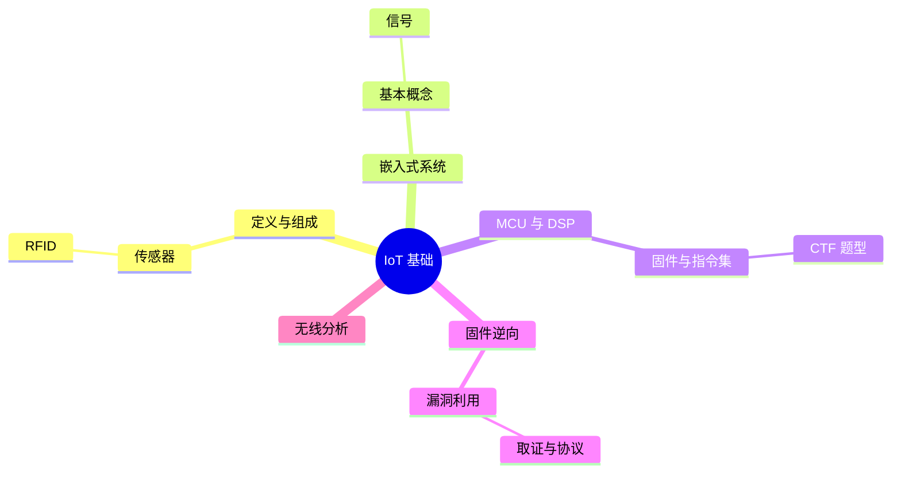

???+ abstract "本章摘要"
    本章从 IoT 作为以嵌入式系统为基础的传感器网络切入，区分传感器、RFID、嵌入式系统、MCU、DSP、FPGA 等概念，并将 CTF 中的 IoT 赛题归为固件逆向、漏洞利用、取证、协议分析与无线信号分析。重点是建立设备、固件与数据链路之间的解题地图。
## 章节导航

上一篇：[第25章 Native层逆向](第25章 Native层逆向.md)

下一篇：[第27章 IoT固件逆向工程](第27章 IoT固件逆向工程.md)

回到目录：[00-目录](00-目录.md)

## 一、IoT基础知识

本章不打算对IoT的背景进行详细的介绍，一是因为IoT是一个面向应用场景的领域，场景错综复杂，若要讲清楚，其篇幅将远远超过本书所能接受的范围。二是因为在CTF竞赛中我们并不需要去了解过多的细节，了解太多的信息有时会适得其反。因此，本章将挑选一些有必要的以及科普性质的内容为读者做一个简要介绍，读者只需要大致理解IoT的作用及用法即可，无须对其中的技术名词进行深究，重在掌握解题方法，而非其概念。

### 26.1 什么是IoT

之前我们已经提到过，IoT安全的本质是以嵌入式系统为基础的传感器网络上的安全问题，包括车联网、传感器网络、工控网络等。简单地说，物联网可以看作是一类特殊的网络，相比传统的互联网，功能简化很多，但数据交互的次数要比传统的互联网更加频繁。其核心可以看成是由传感器技术、RFID技术、嵌入式系统技术这三大技术所组成的一个复杂系统。

· 传感器技术：计算机应用中的关键技术。大家都知道，到目前为止，绝大部分计算机处理的都是数字信号，需要传感器将模拟信号转换成数字信号，这样计算机才能处理。

· RFID标签：也是一种传感器技术，RFID技术是融合了无线射频技术和嵌入式技术的综合技术，在自动识别、物品和物流管理方面有着广阔的应用前景。

· 嵌入式系统技术：是综合了计算机软硬件、传感器技术、集成电路技术、电子应用技术的复杂技术。基于嵌入式系统的智能终端产品随处可见，小到遥控器，大到卫星系统。嵌入式系统正在改变着人们的生活，推动着工业生产以及国防工业的发展。

如果将物联网比作人体，那么传感器就相当于是人的眼睛、鼻子、皮肤等感官，接收到信息后要进行分类处理，而承担数据处理工作的就是嵌入式系统。这个例子很形象地描述了传感器、嵌入式系统在物联网中的位置与作用。图26-1展示了物联网各大技术之间的关系。

{ width="73%" }

*图26-1 IoT领域各大技术之间的关系*

说了这么多，大家对IoT应该有了一个大致的了解，我对IoT的定义：IoT就是一类以嵌入式系统为基础，承担主要用于数据感知与收集（传感器）、控制指令传送的一种低功耗、协议简化的无线通信网络。

根据以上定义，就可以比较清晰地将IoT与传统互联网相互区分开来。传统互联网要求高度互联，数据传输可靠，数据传送量大，大多使用大型服务器和交换设备作为基础设施，多为星形网络，数据中心化。而IoT则与之相反，组成IoT的设备大多为处理能力较弱的低功耗设备、微控制器，网络更偏向于网格化，每个节点作为数据源的同时也会承担数据转发工作，整体组网比较自由，容错能力较强，传输数据量比互联网要小很多，但数据实时性会比互联网更好。

### 26.2 什么是嵌入式系统

什么是嵌入式系统呢？简单地说，嵌入式系统就是一类具有完整计算能力的单板系统或者片上系统（SoC）。经常单独使用，或者以组件的形式作为一个庞大系统的一部分，处理一些特定的工作。下面列举一些生活中的例子，手机、摄像头、空调、汽车以及PC等常见的电子产品都含有嵌入式系统，可谓无处不在。嵌入式系统的中流砥柱要数微控制器和DSP了，前者负责逻辑控制工作，后者负责数据的处理（主要是浮点数的处理）。这里可以不夸张地说，离开了微控制器，一切电子设备都将无法正常工作。

当然，嵌入式系统存在的范围不只是在我们看得到的地方，在许多我们看不到的地方，比如卫星、导弹、月球车等航天军事方面，也有大量的应用，可以说，嵌入式系统撑起了整个电子世界。既然嵌入式系统如此重要，那么它的安全问题势必更为重要。虽然事实如此，可是嵌入式系统上的安全直到近几年才开始慢慢被行业所关注，而且安全问题日益凸显，从这里可以看出，IoT安全将会成为其中的第一个爆发点。

### 26.3 嵌入式系统的基本概念

嵌入式系统常被用于底层信号和逻辑的处理，要理解其原理，需要大量的硬件和逻辑电路的知识，包括模拟电路和数字电路，甚至还包括控制理论、电力电子、无线通信的相关知识。其背后有庞大的知识体系，建议有兴趣的读者可以翻看电子相关专业的培养方案，读一读相关教材，慢慢就会理解整个体系了。

本书不希望为读者增加太多前置知识方面的负担，毕竟本书只是一本CTF比赛用书，知识够用即可，因此接下来讲解一些基本的概念，知道这些概念，在今后的学习中若有需求，可以自己去寻找相应的资料。这些概念也足可以帮助大家理解本章所要讲述的内容。

模拟信号：又称原始信号，即域上连续的信号，可以将其简单理解为实际电压的变化信号，交流电就是最常见的模拟信号。其特点是，模拟信号是物理世界的一个变化的电信号，无法被计算机系统储存以及理解，只能使用模拟器件进行运算和处理。

数字信号：又称采样信号，即通过一定间隔对模拟信号在某些特定时刻的值进行测量，并用二进制表示，会得到一串数列，而该数列可以在一定程度上反映原始信号的特点，但它是离散的。两个时刻之间的某个点的模拟信号值我们并不知道，也就是说，丢失了部分模拟

信号的信息，但使得模拟信号的特征可以在一定程度上被计算机存储以及处理了。

单片机：单片微型计算机的简称，专业名称为微控制器，本质是在单硅片上集成内核、SRAM，ROM或FLASH，以及一些外围逻辑控制器（例如UART、SPI、GPIO等总线设备）所组成的一个拥有较完整处理能力的芯片。而此类芯片，我们一般不称之为CPU，而称其为MCU，即Microcontroller Unit。由于单片机厂商较多，内核指令集各不相同，市场占有率也大有区别，当今最有名的要数Intel 8051单片机了，被各大高校的单片机教材所采用。另外，常见的还有Atmel公司推出的AVR系列单片机，ARM公司推出的Cortex M系列单片机，Microchip公司的PIC单片机。

固件：所谓固件（firmware），当然是固化的，无法修改，一般是指单片机中固化的程序，一般只读不写，主要包含了单片机运行的程序代码和运行所需的数据。当然，固件可以存储在单片机内部的片上存储区，也可以存储在片外单独的存储芯片上，与硬盘上的数据的主要区别是，固件只读不写，出厂即固化完毕，除了特殊需要，正常使用过程中都不会对固件进行修改。

架构/指令集：这个想必大家都不会陌生，类比x86指令集，大家应该很容易理解，也可称为指令系统。不过MCU市场巨大，多家公司都有自己的产品，前面提到的8051/AVR/PIC都有自己的指令集。其中，

8051是复杂指令集，而剩下的均为精简指令集。也许这时候你会问为什么没有提到MIPS，那是因为MIPS最初与x86一样，是为CPU设计的指令集，至今没有出现过MIPS架构的MCU。

DSP：数字信号处理/数字信号处理器。由于数字信号处理技术的不断发展，嵌入式设备经常要处理一些常用的如积分变换、数字滤波等需要大量浮点运算的工作，而DSP就是一种从硬件来对此类算法进行加速，浮点处理能力更强的芯片。这类芯片往往会弱化外设，主要承担计算工作，因此接口控制功能较弱。随着ARM在CPU中集成了DSP单元，现在单独使用DSP芯片的需求已逐渐减少。

嵌入式处理器：现在又被称为应用处理器（Application Processor），个人认为叫应用处理器更贴切一些。最开始是因为在嵌入式系统中有类似于PC的应用需求，比如液晶屏显示、触摸、音频等没有经过调制的功能，需要大量的计算资源，而当时MCU的计算能力都被用于处理接口通信数据，而处理数据的能力已经所剩无几，所以才有了这种应用处理器，用于应用层的计算工作。最有名的嵌入式处理器是ARM的Cortex A系列处理器，以及MIPS架构的处理器。Intel的Core M系列处理器也可以看作是一类应用处理器。

基带：原指基本频带，即信源发出的没有经过调制的原始电信号（可以是数字信号，也可以是模拟信号）的固有频宽。随着数字调制

技术的发展，现在通信行业所指的基带是一类能够进行数字调制并产生原始数字信号的处理模块、芯片或软件。

Datasheet：又称为数据表，厂商在开发出芯片之后，会提供此文档，文档中会详细描述芯片的性能、工作电气特性。如果是MCU，还会给出内部的框图、寄存器文档、指令集、内存管理方式等详细信息。学会寻找并阅读数据表是一个电子工程师应该具备的最基本能力，也是必须掌握的技能，甚至是解答IoT类题目的关键所在，所以这里强烈建议读者养成阅读数据表的好习惯。

FPGA：现场可编程门阵列，简单地说，就是逻辑可编程的芯片，注意，逻辑电路的连接是可编程的。什么意思呢，大家可能会知道一些通过软件来实现向CPU编程的操作方法。但总的来说，操作需要经过CPU已经设计好的状态机来完成，也就是需要通过取指、译码、执行、访存、回写这5个步骤。而什么是硬件可编程呢？举个简单的例子，比如，我想计算1+1，如果通过软件实现，那么CPU需要通过前面所说的5个步骤才能得到结果，每个步骤都会花费至少微秒级的时间。如果用逻辑实现一个加法器，然后在输入端加上对应的电平，那么输出端会在纳秒级时间内就得到一个结果，这就是为什么硬件加速会比较件快很多的原因。软件具有串行性，而硬件逻辑具有并行性，只要堆砌更多的单元，就总能得到更大的计算能力，这也是为什么CPU不断堆砌核心的原因。前面说了这么多，是为了让大家直观地体会什么是FPGA，

但它有什么用呢？要知道，有大量的CPU或者ASIC在方案验证的时候，不可能直接进行流片生产，因为这样成本太高。一般是先在FPGA上实现要完成的电路并进行测试，测试完毕后才会进行实际生产。也就是说，目前大家能买到的CPU都是在FPGA上进行过方案验证的。虽然FPGA可以实现一样的功能，但是由于其灵活性，成本必然比ASIC要高，所以更多的时候只是作为方案验证使用。当然，对于个别需要逻辑可修改的场合，比如SSD的主控器，还是会直接使用FPGA的。

频谱：频率谱密度的简称，是频率的分布曲线。根据傅立叶分解原理，复杂的信号总可以分解为有限或无穷多个正弦信号的叠加，通过分析这些正弦信号的成分，就可以了解原信号的特征，是一种重要的研究手段和分析工具。

无线传感器网络（WSN）：是一种分布式传感网络，是由传感器节点通过无线电组织形成的多跳自组织网络。WSN中的传感器通过无线方式通信，因此网络设置比较灵活，设备位置可以随时更改，还可以与互联网进行有线或无线方式的连接。

### 26.4 CTF中常见的IoT题型归类

前面说了那么多，我相信有些读者可能摸不着头脑，没关系，可以继续往后看，结合后面要讲述的知识，大家可以更快掌握本书想要表达的内容。在本节中，我们将CTF中可能涉及的IoT类赛题进行归类，并各个击破，帮助大家轻松攻克此类赛题。

逆向工程：此类赛题最常见，也是难度比较高的。题目往往涉及一些单片机或者嵌入式处理器的固件，还有极少的题目可能会将基带固件抑或是FPGA的逻辑出作逆向，由于嵌入式处理器的架构繁多，同一架构下不同型号的产品还会存在细微差别。作为一个初学者，很难在短时间内熟练掌握那么多不同的汇编指令系统，所以此类题比较难，也是最重要的一类。

漏洞利用（PWN）：由于Linux、Android、Windows CE在嵌入式环境中的大量使用，原来在x86 Windows/Linux上的漏洞利用方法也可以方便地迁移到嵌入式环境中，只是由于架构不同，细节上的处理会略有不同而已。虽然嵌入式系统的架构层出不穷，但大多数处理能力较弱，并不能很容易地支持TCP/IP，因此这部分可以出成PWN题目的限制就会比较多。从目前的情况看来，这类题目大多都集中在网络功能比较成熟的ARM-Linux和MIPS-Linux这两个平台上，不确定以后会出哪些新类型，但由于各种限制，CTF题目的发挥空间还是较小，所以此类题

目的解题方法相对比较明确，所需要做的就是掌握一般PWN类型题目的技巧。

取证（forensic）：比较常见的题目是提供一个嵌入式系统的固件，让你分析并提取其中的有用信息，例如管理员密码和后门账户等。这类题目的解题方法相对比较固定，大部分情况下只要了解固件的结构即可。

协议分析（MISC）：此类题目一般需要分析一些无线传感器网络的数据包格式，比如胎压传感器的数据包格式。大致解题思路是通过diff推测数据包的每个字节的大致含义，从而推断出大致的协议。这类题目往往还会让你去伪造某个条件的数据包，或者提供一系列数据包让你去找出其中伪造的数据包。当然，这类题目的难点主要在于某些校验位可能使用了CRC或另外的特定算法，因此并不容易伪造。

无线信号分析：这类题目的解题思路是最明显的，但要求选手有无线通信相关领域的专业知识。题目一般会提供一段无线通信的原始波形，让选手分析出这段信号所传输的内容。考过的类型有简单的ASK、FSK调制的无线信号解调，抑或复杂的4G通信的原始信号。显然，此类题目既可以比较容易，也可以专业性非常强，如果出现专业性很强的题目，就需要选手具有熟练的专业知识。因此，这类题目也可以是最难的，是对基础知识的掌握程度要求最高的一类题目。

## 学习梳理

### 26.1 什么是IoT

???+ tip "本节要点"
    - IoT 的核心由传感器、RFID 与嵌入式系统等技术共同构成。
    - 它通常面对低功耗、协议简化和频繁的数据交互场景。
    - 与传统互联网相比，IoT 更常见弱节点、网格化组网和较小的数据量。
### 26.2 什么是嵌入式系统

???+ tip "本节要点"
    - 嵌入式系统可作为独立单板或片上系统，也可成为大型系统中的功能组件。
    - MCU 侧重逻辑控制，DSP 偏向数据与浮点计算，二者承担的角色不同。
    - 设备普及使安全问题从软件层延伸到大量现实环境中的硬件终端。
### 26.3 嵌入式系统的基本概念

???+ tip "本节要点"
    - 先分清模拟信号、数字信号与采样带来的信息取舍。
    - 固件、指令集、数据表、处理器和 FPGA 是阅读 IoT 题目的基础词汇。
    - 查找并阅读 Datasheet 是从芯片型号走向可验证分析的重要步骤。
### 26.4 CTF中常见的IoT题型归类

???+ tip "本节要点"
    - 固件逆向需要结合架构、指令集和固件组织形式。
    - PWN、取证、协议和无线题分别关注运行环境、文件系统、报文语义和物理波形。
    - 题目类型决定了首选入口：先识别对象，再选择工具与验证方法。
!!! warning "易错点"
    - 先确认架构、数据形态或调制方式，再选择反汇编、文件系统、协议或波形分析路径。
    - 不要把工具自动识别、反编译输出或单次解码结果直接当成结论；需要以地址、结构、校验或运行行为复核。
    - 原文中的 OCR 异常字符和不完整代码均按全内容保留原则呈现，阅读或复现时应回查上下文。
??? note "自测题"
    #### 基础
    1. IoT 核心可由哪三类技术概括？
    2. IoT 与传统互联网在节点能力和组网上有哪些区别？
    3. MCU 与 DSP 在书中分别主要承担什么工作？
    4. 固件通常包含什么，为什么是分析对象？
    5. Datasheet 对 IoT 解题有什么价值？
    
    #### 进阶
    6. 拿到未知 IoT 文件时，如何初步判断应走逆向、取证还是协议分析？
    7. 为什么题目中的网络结构会影响攻击或分析方法？
    8. 面对陌生术语，怎样避免只停留在概念记忆？
    
    #### 参考答案
    1. 传感器技术、RFID 技术与嵌入式系统技术。
    2. IoT 多为低功耗、处理能力较弱的节点，常偏向网格化并由节点兼任数据源和转发角色。
    3. MCU 主要承担逻辑控制，DSP 主要承担包括浮点处理在内的数据计算。
    4. 它包含设备运行所需的程序代码和数据，直接反映设备功能与配置。
    5. 它可提供芯片性能、寄存器、指令集和内存管理等可验证信息。
    6. 先识别文件或数据的形态：可执行/固件侧重逆向与取证，报文侧重协议，波形侧重无线分析。
    7. 节点能力、链路方式和协议约束决定可用的交互、调试和伪造条件。
    8. 回到具体设备、芯片和数据流，结合 Datasheet、固件与题目输入建立对应关系。
## 本章思维导图

## 参考资料

- 《CTF特训营》本章 OCR 原文。
- 本章原文保留的图 26-1 与相关术语说明。
- 本章正文出现的工具、项目与链接均随原文保留。

*来源：《CTF特训营》，OCR 全内容保留整理版。*

