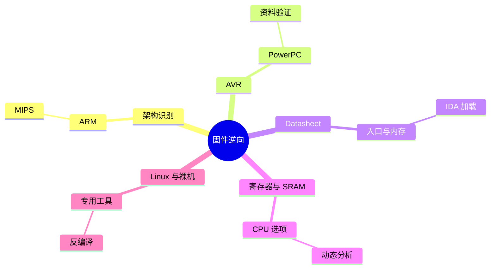

???+ abstract "本章摘要"
    本章围绕 IoT 固件逆向的实际工作流展开：先认识 ARM、MIPS、AVR、PowerPC 等常见架构，再通过芯片手册确定处理器特征；随后介绍在 IDA 中寻找入口点、处理寄存器与 SRAM、调整 CPU 选项，并覆盖动态调试、专用 IDE 与反编译工具的使用场景。
## 章节导航

上一篇：[第26章 IoT基础知识](第26章 IoT基础知识.md)

下一篇：[第28章 固件结构分析](第28章 固件结构分析.md)

回到目录：[00-目录](00-目录.md)

## 一、IoT固件逆向工程

在本章中，我们开始介绍目前CTF中关于IoT的解题技巧，即IoT固件的逆向工程相关的技巧。此类题目往往会提供一个IoT设备的固件让选手分析，完成题目所要求的任务，而对于所给固件，在很多情况下并不是像我们常见的x86机器上Windows或者Linux系统下的程序（即ELF程序）一样可以直接被IDA自动识别并分析，而是一个对于IDA看来完全未知的binary文件，此时IDA无法自动分析，需要我们手动让IDA识别代码和数据，这当中包括非常多的技巧。

另外，IoT设备所使用的架构并非传统安全所熟悉的x86或x86-64汇编，这当中又包含了许多没有听说过的架构，对于这类CPU架构的汇编以及固件的组织形式，参赛选手往往都是比较陌生的，因此这也是一大难点之一。

所以，针对IoT固件的逆向工程，我们需要一些特别的技巧或者工具，在接下来的内容中，笔者将详细展开介绍。

### 27.1 常见IoT架构介绍

目前，在市场上能够见到的单片机架构至少有几十种，每种架构的不同产品又有不同的分支，且对于不同子型号的产品，指令集还会存在细微的差异，对于架构指令集的介绍，不是一本书可以囊括的，这里仅列举出一些比赛中最容易出现的架构。

### 1. ARM

ARM最常见不过，几乎已经深深地融入我们的生活中，90%的手机处理器都使用了该架构，是当之无愧的老大哥。最有代表性的就是高通骁龙处理器了，其已成为高性能手机必备的标识。ARM家族子架构众多，在ARMv4t架构之前，其主要应用于嵌入式环境、汽车电子等领域。而从ARMv7i开始，作为ARM第7代架构，根据不同的应用场景，衍生出了Cortex A、Cortex M和Cortex R三种子架构，下面分别对这三种子架构进行介绍。

Cortex A作为高性能旗舰产品的代表，A即Application，也就是前面列举的概念里提到的应用处理器，几乎所有的手机、PDA、平板、路由器都使用了这种架构，其特点是处理能力强，功耗较高，适用于有大量逻辑数据需要处理的场合。其支持的指令集包括ARM和Thumb，以及现在最新的Thumb-2。

Cortex M, M是MCU的意思，也就是说，该架构多用于微控制器，其特点是高性能低功耗，身为32位处理器，其提供了比目前主流的8位、16位MCU更好的性能，同时还很好地兼顾了功耗，使得在每兆赫兹功耗相当甚至更低的情况下，具有高于现有其他MCU的性能。同时该系列处理器使用的指令集为最新的Thumb-2，有极高的代码密度，很好地兼顾了各个方面，如今，该架构的MCU已经成了热门之选。该系列处理器也经过了多次更新换代，最早的Cortex M3成为Cortex M3系统中使用最为广泛的架构72MB的主频，相对低廉的成本，成就了这款性价比最高的架构。后来发布的还有Cortex M4（F），主频可达168MB，特点是集成了DSP核，使得MCU也可以完成DSP的部分功能，并且集成了FPU，浮点处理能力大大增强，甚至在某些程度上越来越向Cortex A的性能靠拢。而在2015年发布的Cortex M7架构，主频甚至达到了惊人的400MHz，主要面向物联网和穿戴领域，其性能已超越了早期的Cortex A架构，它甚至可以承担图像处理、高级音频处理、车联网应用的应用级处理工作，同时又具有控制器的控制功能，强大到令人生畏。该系列的代表产品有ST公司的STM32系列，以及TI公司的Stellaris系列。

Cortex R，其中R代表RTOS，即专门为实时操作系统准备。它是所有衍生产品中体积最小的ARM处理器，这一点也最不为人所知。

Cortex-R处理器主要针对高性能实时应用，例如，硬盘控制器（或固态驱动控制器）、企业中的网络设备和打印机、消费电子设备（例如

蓝光播放器和媒体播放器），以及汽车应用（例如安全气囊、制动系统和发动机管理）。Cortex-R系列在某些方面与高端微控制器（MCU）类似，但是，针对的是比通常使用标准MCU的系统还要大型的系统。例如，Cortex-R4非常适合汽车应用。Cortex-R4主频可以高达600MHz（具有2.45DMIPS/MHz），配有8级流水线，具有双发送、预取和分支预测的功能，以及低延迟中断系统，可以中断多周期操作而快速进入中断服务程序。Cortex-R4还可以与另外一个Cortex-R4构成双内核配置，一同组成一个带有失效检测逻辑的冗余锁步（lock-step）配置，因而非常适合安全攸关的系统。

Cortex-R5能够很好地服务于网络和数据存储应用，它扩展了

Cortex-R4的功能集，从而提高了效率和可靠性，增强了可靠实时系统

中的错误管理。它提供低延迟外设端口（LLPP），可实现快速外设的

读取和写入（而不必对整个端口进行“读取－修改－写入”操作）。

Cortex-R5还可以实现处理器独立运行的“锁步”（lock-step）双核

系统，每个处理器都能通过自己的“总线接口和中断”执行自己的程

序。这种双核实现能够构建出非常强大和灵活的实时响应系统。

Cortex-R7极大地扩展了R系列内核的性能范围，时钟速度可超过1GHz，性能达到3.77DMIPS/MHz。Cortex-R7上的11级流水线增强了错误管理功能，改进了分支预测功能。多核配置也有多种不同的选项：锁步、对称多重处理和不对称多重处理。Cortex-R7还配有一个完全集

成的通用中断控制器（GIC）来支持复杂的优先级中断处理。不过，值得注意的是，虽然Cortex-R7具有高性能，但是它并不适合于运行那些特性丰富的操作系统（例如Linux和Android）的应用，Cortex-A系列才更适合这类应用。

至于近两年新出的ARMv8也称为Aarch64架构，即64位ARM架构，其衍生架构与ARMv7类似，只不过命名方式不同而已，比如，Cortex A53/A57就是最早上市的ARMv8架构，其指令集也与ARMv7存在较大差异，当然，也不乏追捧者让Aarch64很快地进入Android题目中。

对于ARM架构的比赛题，大多都集中在Android类型的题目中，该部分在本书移动安全部分已经有了相当详尽的介绍。有时也会出现ARM-Linux（比如树莓派），vxworks（比如基带系统）。有的甚至不带操作系统，比如Cortex M系列MCU的裸机程序。后面的几种情况，就是本篇要讨论的IoT类赛题了。

### 2. MIPS

MIPS是Microprocessor without Interlocked Pipeline Stage的缩写。顾名思义，该处理器的设计思路是无内部互锁的流水线设计，其体系结构本身就是为了获得较高的流水线性能而设计的。通过细化流水，将一条指令的执行过程进行更细致的划分，使得一次同时在执行的指令更多，从而提高并行度，提高CPU使用率。而Intel在设计x86

的时候却采用了另外的思路，虽然x86架构也有流水线设计，但似乎并没有在细化流水上下功夫。CISC似乎都是如此，在性能的提高上，选择了另外一条路，即使用多个核心叠加，增加同时运行的线程。而ARM也紧随其后加入了这个行列。到如今，也确确实实是多核心的策略获得了完胜。但从设计理念来看，虽然是MIPS更加先进，然而受制于工艺和应用场景，优势没有得到很好地发挥，再加上精简指令集对于复杂计算有着先天的不足，处理能力一般，对于现在大量的多应用需求场景，细化流水带来的提升并不明显，因此难免没落。

当然，MIPS也有一个比较显著的优势，由于采用了细化流水的策略，因此应对单线程、计算简单且重复的应用，有着先天的优势，例如，其在网络数据包处理和转发上的能力就明显较强。因此在许多网络设备、路由器的CPU中被大量采用，当然，如今MIPS已经被拆分出售，一代知名架构就此陨落。

在如今的CTF比赛中，仍然会涉及MIPS，题目多为PWN和逆向。然而这里还需要提一点的就是，在MIPS体系结构中，硬件并没有支持NX。MIPS架构下的ELF程序，NX保护开或者不开，都是一样的，从任何位置都可以执行代码。

8051是由Intel在1981年设计制造的8位MCU，是现存的为数不多的复杂指令集MCU，由于其架构简单，且Intel将其授权给其他很多公司，因此在8位单片机领域，8051系列及其衍生产品占据了大量的市场份额，有许多公司甚至以其为基础开发了功能更多、更强大的产品。由于其较强的稳定性，在恶劣的工控网络中也被大量使用，是使用最为广泛的MCU之一。

目前8051在CTF比赛中还未出现，但由于其广泛的应用，笔者认为在今后的比赛中，也许会大量出现。

### 4. AVR

AVR是1997年由ATMEL公司研发出的增强型内置Flash的精简指令集高速8位单片机。AVR的单片机可以广泛应用于计算机外部设备、工业实时控制、仪器仪表、通信设备、家用电器等各个领域。1997年，由ATMEL公司挪威设计中心的A先生和V先生，利用ATMEL公司的Flash新技术，共同研发出RISC精简指令集高速8位单片机，简称AVR。传统单片机（如8051）往往因为工艺及设计水平不高、功耗高和抗干扰性能差等原因，所以采取稳妥方案，即采用较高的分频系数对时钟分频，使得指令周期变长，执行速度变慢。如8051的实际运行时钟频率为输入晶振频率的12分之一，也就是说，12个晶振周期为一个系统时钟周期。而AVR彻底打破了这种旧设计的格局，废除了机器周期，采用精简指令集，以字作为指令长度单位，将内容丰富的操作数与操作码安排

在一字之中，取指周期短，还可以预取指令，实现流水作业，故可高速执行指令。再加上其价格低廉，在推出之后，也迅速获得了市场的认可，占领了大量市场。

在CTF竞赛中，已经出现了基于AVR平台的逆向题。

### 5. PowerPC

PowerPC简称PPC，其前身为1991年，Apple、IBM、Motorola组成的AIM联盟所发展出的POWER架构。其诞生的目的是为了抗衡Intel的x86架构，市场定位包括高性能计算、小型机、嵌入式处理器，以及普通用户的PC机。其中，Motorola为PPC的代表性厂商，其产品线有MPC505、821、850、860、8240、8245、8260、8560等近几十种产品，也曾辉煌一时，但由于采用封闭体系和松散联盟体制，最终PowerPC也没能战胜Intel，于是从2005年起，苹果被迫放弃了PPC并转向Intel，从此，PPC在个人电脑领域宣告失败。而后PPC架构主要面向嵌入式处理器和小型机市场。

对于PPC架构由于普遍采用大端序，因此所出的PWN题比较难以利用，所以仍然是以固件分析以及逆向为主要题型。

### 6. 其他架构

以上所介绍的各种架构是在CTF竞赛中出现过的类型，也是目前非常常见的架构，应用广泛，无论是对于竞赛还是安全研究都有长足的意义，但还有一些是比赛中尚未涉及的，在这里做一个简单的科普，以供大家查阅和参考。

· PIC32是Microchip公司开发的32位RISC单片机，其指令数量只有33~58条指令，比AVR、8051、ARM都要精简不少，具有高效率的特点，也是使用较为广泛的架构之一。

· MSP430是美国德州仪器公司设计的一款超低功耗的8位混合信号处理器（Mixed Signal Processor），其以低功耗著称，同时针对实际应用，将不同功能的模拟电路和数字电路集成在一块芯片上，有着独有的应用场景。

· 另外值得一提的还有IA64架构，它是Intel设计的纯64位指令集架构，但由于其设计理念过于超前，在推出时遭到了微软的反对，故而还是以没落为结局。

### 27.2 芯片手册的寻找与阅读

工欲善其事，必先利其器，要做好某款芯片的程序逆向，那么首先要对架构特性有所了解，我们都知道，以往的经验大多都以x86/x86-64这两款为人所熟知的架构为主。那么，在这里我想请问一下各位读者都有阅读过Intel的芯片手册（Datasheet）吗？想必答案大多都是否定的，Intel的x86架构大概有几千页的Datasheet，可能读者对于Intel出过Datasheet这件事也未必知晓。当然这对于x86架构的学习并不会构成什么大问题，由于x86是被广泛应用的架构，所以各种大牛整理的资料也已经涵盖了开发中遇到的大部分问题。然而，换作一块嵌入式芯片，那就完全不同了，一来，嵌入式芯片的应用量不会有x86那么大，再者，研究这些芯片的工程师也不会像x86那么多，所以，芯片真正细节的内容，就应该由我们自己去阅读厂商的资料来获得了。本节将介绍如何获得芯片的Datasheet，以及获得Datasheet之后如何阅读。

首先，如何获得Datasheet呢？获得Datasheet的手段有很多，常见的芯片可以通过Google搜索获取到，当然，最好的办法就是去厂商的官网上寻找。以Intel x86的Datasheet为例，可以直接在Intel的官方网站上获得文档，文档名称为“Intel 64 and IA-32 Architectures Software Developer's Manual”。

为了方便大家寻找Datasheet，这里推荐一个网站——http://www.alldatasheet.com/，这个网站几乎收录了所有公开的芯片Datasheet，只要不是非常冷门或者厂商有意保密的文档，在这上面都可以找到。例如，我们需要找STM32F103这一款Cortex M3内核MCU的，直接搜索即可，搜索结果如图27-1所示。

{ width="75%" }


*图27-1 alldatasheet网站搜索结果页面*

数字103后面的字母代号表示了不同的子型号，子型号主要用于区分芯片的一些细节信息，比如FLASH大小、RAM大小，以及管脚等的不同，但架构都是相同的，所以对于软件逆向项目，只需要看其中任意一个即可。

获得了Datasheet之后，我们需要去阅读Datasheet，为了能与大家已有的知识相衔接，这里特意列举一个大家熟悉的架构示例来进行分析。前文我们提到了STM32F103这款MCU，当然，实际上这并不是一款MCU，而是一个系列，只不过这个系列的MCU都采用了Cortex M3内核，Cortex M3内核实际上也是ARM架构的一种，而不同的子型号只是在功能外设上有所不同而已，内核还是一样的，所以分析方法大同小异。我们先随便下载一个Datasheet。STM32F103系列中，最为常用的型号是STM32C103CB，所以在alldatasheet网站上，我们直接搜索这个型号即可，然后将相应的Datasheet下载下来。如图27-2所示，单击Download子菜单的链接，就可以将Datasheet的PDF版本下载下来了。

打开Datasheet，我们首先需要关注芯片的引脚定义，如图27-3所示。

{ width="75%" }


*图27-2 alldatasheet的下载页面*

<div style="text-align: center;">Table 5. Medium-density STM32F103xx pin definitions</div>


| Pins | Pin name | Type(1) | I/O Level(2) | Main function(3)(after reset) | Alternate functions(4) |  |  |  |  |  |  |  |
| --- | --- | --- | --- | --- | --- | --- | --- | --- | --- | --- | --- | --- |
| LFBGA100 | UFBG100 | LQFP48/UFQFPN48 | TFBGA64 | LQFP64 | LQFP100 | VFQFPN36 | Default | Remap |  |  |  |  |
| A3 | B2 | - |  | - | 1 | - | PE2 | I/O | FT | PE2 | TRACECK |  |
| B3 | A1 | - |  | - | 2 | - | PE3 | I/O | FT | PE3 | TRACED0 |  |
| C3 | B1 | - |  | - | 3 | - | PE4 | I/O | FT | PE4 | TRACED1 |  |
| D3 | C2 | - |  | - | 4 | - | PE5 | I/O | FT | PE5 | TRACED2 |  |
| E3 | D2 | - |  | - | 5 | - | PE6 | I/O | FT | PE6 | TRACED3 |  |
| B2 | E2 | 1 | B2 | 1 | 6 | - | VBAT | S |  | VBAT |  |  |
| A2 | C1 | 2 | A2 | 2 | 7 | - | PC13-TAMPER-RTC(5) | I/O |  | PC13(6) | TAMPER-RTC |  |
| A1 | D1 | 3 | A1 | 3 | 8 | - | PC14-OSC32_IN(5) | I/O |  | PC14(6) | OSC32_IN |  |
| B1 | E1 | 4 | B1 | 4 | 9 | - | PC15-OSC32_OUT(5) | I/O |  | PC15(6) | OSC32_OUT |  |
| C2 | F2 | - | - | - | 10 | - | VSS_5 | S |  | VSS_5 |  |  |
| D2 | G2 | - | - | - | 11 | - | VDD_5 | S |  | VDD_5 |  |  |
| C1 | F1 | 5 | C1 | 5 | 12 | 2 | OSC_IN | I |  | OSC_IN |  | PD0(7) |
| D1 | G1 | 6 | D1 | 6 | 13 | 3 | OSC_OUT | O |  | OSC_OUT |  | PD1(7) |
| E1 | H2 | 7 | E1 | 7 | 14 | 4 | NRST | I/O |  | NRST |  |  |
| F1 | H1 | - | E3 | 8 | 15 | - | PC0 | I/O |  | PC0 | ADC12_IN10 |  |
| F2 | J2 | - | E2 | 9 | 16 | - | PC1 | I/O |  | PC1 | ADC12_IN11 |  |
| E2 | J3 | - | F2 | 10 | 17 | - | PC2 | I/O |  | PC2 | ADC12_IN12 |  |

*图27-3 Datasheet中的引脚定义*

引脚定义给出了芯片每根引脚的位置以及第一功能和复用功能，在调试中，如果设备有I/O或者外设的通信，就会用到这部分信息了，在实际进行硬件调试时，可以使用逻辑分析仪分析对应管脚的信号，或者解串口调试设备进行调试。当然，在CTF比赛中，实际情况下不会存在调试实际硬件的情况，这些情况下我们普遍会使用模拟器进行调试，所以对I/O引脚具体位置的关注可能并不会太多。当然在这里列举的原因在于这部分内容对于单片机的理解非常重要，也是不容忽视的。

然后是内存映射图，从内存映射图中，我们可以分析出固件加载的位置，以及各个外设所在的内存地址范围，没有这部分内容我们将无法确定程序所加载的基地址，因此在IDA中无法得到正确的反汇编结果。图27-4所示的是一个典型的内存分布图。

{ width="74%" }

*图27-4 datasheet中的内存映射图*


通过阅读STM32F103的内存分布图，我们重点关注 $ ^{*} $的方面具体如下。首先，我们可以看到Flash Memory的内存范围是0x08000000-0x0801FFFF，这段是什么意思？我们都知道单片机的程序是存储在Flash里的，所以Flash的起始地址也就是程序开存放的地址，也是我们使用IDA分析时需要指定的ROM加载地址，只有加载在正确的地址上，才能正确地识别指令。其次是0x20000000开始的SRAM，这部分被称为内存，程序动态执行的变量都会存在该部分。最后要关注0x40000000开始的部分，这部分为外设寄存器映射地址，当程序访问外设寄存器时，会使用这部分地址来访问。

最后，我们还需要了解芯片各个寄存器的地址以及功能，这部分描述了寄存器每个二进制位对应的配置含义，有着重要的作用，例如，可以计算UART的波特率，CPU时钟配置的一个各引脚定时器的状态，都是通过操作寄存器来设定的，因此，上面提到的寄存器读写，要想知道具体完成了什么功能，还要参考这部分内容。而此部分内容较为复杂，原厂并没有直接将这部分内容合并在Datasheet中，而是放在了另一篇汇总文档中。文档的名称是“Cortex-M3 programming manual”，大家可以自行参考，此外，这篇文档也不仅仅只适用于此款芯片，因为架构的共性，对于STM32F10xxx/20xxx/21xxx/L1xxxx这么多系列都是适用的，大家在阅读和寻找参考资料时，也需要注意。

### 27.3 使用 IDA 手动寻找固件入口点

通过阅读STM32F103芯片的Datasheet，我们已经了解到了分析所需要的必要信息，接下来以STM32F103的程序为例来简单分析下。在分析的最开始，先要寻找入口点，入口点标识着程序开始执行的位置，也是入手的关键。这里给出的例子的地址是https://www.jarvisoj.com（Confused ARM）。程序是一个Intel hex格式的STM32程序，IDA可以直接识别并加载基地址，所以这里不存在固件基地址分析的问题，那么我们接下来就来分析这个题目。

首先，我们需要用IDA加载这个hex文件，在加载之前需要注意的是，在Load a New File界面，Processor type要选择ARM Little-endian[ARM]，这一步比较关键，因为Intel hex格式的文件并不包含目标CPU的信息，所以最好自己指定，以方便分析，如图27-5所示。

{ width="72%" }


*图27-5 IDA加载Intel hex格式文件的界面*


点击确定后，IDA会自动完成分析，由于Intel hex格式的程序中会包含基地址信息，所以IDA能够将程序加载到正常的基地址，因此只需要选对CPU即可。加载后的界面如图27-6所示。

<div style="text-align: center;">IDA - C:\Users\wjh\Desktop\confusedARM.hex</div>


{ width="75%" }


*图27-6 IDA加载Intel hex文件后的界面*


注意，IDA已经成功识别到程序加载到的基地址是0x08000000，与我们之前Datasheet所指的Flash存储区基地址相吻合，那么，程序是从哪个地址开始执行的呢？注意任何单片机在上电或者Reset的时候，都会事先进入Reset Handler去执行Reset代码，所以我们只需要找到Reset向量的位置即可，也就是Reset Handler的位置。可以看到，程序在开头定义了一些DCD，这部分并没有被IDA识别成代码，而事实上

这部分也确实并非代码，IDA在这方面还是比较智能的。下面简单整理一下这些数据，如图27-7所示。

{ width="74%" }


*图27-7 固件起始地址处的数据*


我们先看第一个0x20000730，从前面的memory map中可以看出，这部分是SRAM的地址。那么究竟是什么的地址呢？这里介绍一些常识，在与硬件相关的程序中，一般都会定义一些中断向量的位置，Reset也是其中一个中断向量，在复位时，硬件会自动将PC设置为Reset的地址，而其他就是一些定时器、外设的中断向量位置。这个表就称为中断向量表。所以，分析以0x0800000位置开始的内容是中断向量表。那么在这张表中势必会包含Reset向量的位置。首先，Reset代码不可能在SRAM区域中，那么第一个地址0x20000730，不可能为

Reset向量的位置。接着再来看第二个地址0x8000101，这个地址是所有地址里面最低的地址，最有可能是Reset向量的位置，我们到该地址处将数据转换成代码。这里还有一个需要注意的点，那就是这个地址的最低位是1，这也就暗示着实际地址为0x8000100+1，表示实际地址为0x8000100，且指令集为Thumb。所以我们需要先按Alt+G将T寄存器值修改为1以将该段代码注释为CODE16，然后直接在0x8000100地址处按C将数据转换为指令即可。最后结果如图27-8所示。

{ width="76%" }


*图27-8 将数据转为指令之后的效果*

可见，IDA识别出了附近的函数调用，其中有意思的是loc_80000EC这个位置，显然，这里设定了SP的值，也就是设定了堆栈指针的位置为0x20000730，这个值是不是似曾相识？没错，在Flash起始地址的值就是该值，它表明了初始堆栈指针的位置。看到这里，应该很明显了，0x08000100地址确实就是整个程序的入口点，也即Reset向量的位置，在该位置处的代码，设定了一系列初始化操作（在sub_8000A00中），以及初始堆栈指针，最终跳至loc_8000188执行。至此，我们已经找到了程序的入口点，可以进行进一步的分析了。

寻找入口点的关键步骤总结如下：①用IDA加载程序，选择正确的CPU；②找到中断向量表，寻找其中地址最小的指针；③跳至该指针处，若IDA未能正确识别代码，则手动将该处数据转为指令（对于ARM，需要自行确定该处是ARM还是THUMB指令集）。

### 27.4 寄存器地址和SRAM地址的处理方法

继续分析上节的例子，我们可以看到0x080000F6处有一个比较大的跳转，一直跳转到了0x8001084，可以猜测跳转到的就是main函数，跟踪进去看一下，如图27-9所示。

{ width="72%" }


*图27-9 固件main函数的位置*

由图27-9可以看到，跳转处有一些字符串的操作，判断跳转到的是main函数，然后进行验证。这里有几个地方十分显眼，那就是以0x40000000开头的地址和0x20000000开头的地址，从前面的memory map中我们了解到，前者是特殊功能寄存器的基地址，而后者是SRAM的起始地址。接下来再来看看伪代码，如图27-10所示。

```c
void _fastcall sub_8001084(int a1)
{
    int v1; // r001
    int v2; // r001

    v1 = sub_8000A00(a1);
    v2 = sub_80006A4(v1);
    sub_80007F0(v2);
    sub_8000A50(115200);
    sub_8000AA8(0x40013800, 64);
    sub_8000560(0x2000000C, 0x2000026C);
    while (1)
    {
        if (v20000000)
        {
            sub_8000BA4("Key is :0x2008x,0x2008x,0x2008x\r\n", 020000000, 020000000) = 0;
        }
        if (!sub_80007E2(0x40010800, 2))
        {
            sub_800055C(0x2000000C, 0x2000026C);
            sub_8000248(0x2000001C, 0x2000031C);
            sub_8000AA8(0x40013800, 64);
            sub_8000BA4("Fl4g 1s :PCTF(%08x%08x%08x%08x)\r\n", 02000031C, 02000032)
        }
    }
}

```
*图27-10 main函数的伪代码*


程序中频繁调用了这些寄存器和内存地址，那么现在问题来了，既然这些地址都是具有特殊意义的，在程序中也经常被访问，但以这

种格式显示，并不便于我们分析。所以下面，我们将介绍一些处理这些地址的技巧。

首先，如果我们要将操作数转为Offset，那么首先需要添加一个对应地址段的segment，因为程序在加载时只识别了以0x08000000开始的segment，所以我们要手动添加以0x40000000开头的segment，添加方法为：[Edit]–[Segments]–[Create segment⋯]，这里的设置如图27-11所示。

{ width="48%" }


*图27-11 添加segment界面*

其中，End address需要尽可能大，涵盖memory map中所关心的寄存器地址范围即可，但也不宜过大，否则IDA容易卡。点击OK按钮之后，segment就加上了。然后，我们将鼠标放在0x40013800这个数上，按0键，数据就被转换为对应的offset了，如图27-12所示。

{ width="75%" }


*图27-12 将数据转换为指针的效果*


当然，我们还可以更进一步，将unk_40013800改为寄存器的名字，从memory map中，我们查到0x40013800地址为USART1的基地址，所以这里就将其名字改为USART1，右击rename即可，如图27-13所示。

{ width="41%" }


*图27-13 修改地址名字界面*


向SRAM的地址0x20000000添加segment的方法与此同理，这里不再赘述。全部添加完毕后，我们再看一下反编译窗口，如图27-14所示。

```c
void _fastcall _noreturn sub_8001084(int a1)
{
    int v1; // r001
    int v2; // r001

    v1 = sub_8000A00(a1);
    v2 = sub_80006A4(v1);
    sub_80007F0(v2);
    sub_8000A50(115200);
    sub_8000AA8(&USART1, 64);
    sub_8000560(&unk_2000000C, &unk_2000026C);
    while (1)
    {
        if (unk_20000000)
        {
            sub_8000BA4("Key is :0x%08x,0x%08x,0x%08x,0x%08x\r\n", unk_20000000) = 0;
        }
        if (!sub_80007E2(&GPIOA, 2))
        {
            sub_800055C(&unk_2000000C, &unk_2000026C);
            sub_8000248(&unk_2000001C, &unk_2000031C);
            sub_8000AA8(&USART1, 64);
            sub_8000BA4("Fl4g 1s :PCTF(%08x%08x%08x%08x)\r\n", unk_2000031C)
        }
    }
}

```
*图27-14 修改地址名字后的效果*


更进一步的，我们还可以将连续的存储区域改为数组，以及通过一些较为明显的函数可以将其改为猜测的名称，于是程序又变成了如图27-15所示的样子。

```python
void _fastcall _noreturn sub_8001084(int a1)
{
    int v1; // r001
    int v2; // r001

    v1 = sub_8000A00(a1);
    v2 = sub_80006A4(v1);
    sub_80007F0(v2);
    sub_8000A50(115200);
    sub_8000AA8(&USART1, 64);
    sub_8000560(DWORD_2000000C, &unk_2000026C);
    while (1)
    {
        if (unk_20000000)
        {
            printf("Key is: 0x%08x,0x%08x,0x%08x,0x%08x\r\n");
            DWORD_2000000C[0],
            DWORD_2000000C[1],
            DWORD_2000000C[2],
            DWORD_2000000C[3]);
        unk_20000000 = 0;
    }
    if (!sub_80007E2(&GPIOA, 2))
    {
        sub_800055C(DWORD_2000000C, &unk_2000026C);
        sub_8000248(&unk_2000001C, dword_2000031C);
        sub_8000AA8(&USART1, 64);
        printf("F14g 1s : PCTF(%08x%08x%08x%08x)\r\n");
        DWORD_2000031C[0],
        DWORD_2000031C[1],
        DWORD_2000031C[2],
        DWORD_2000031C[3]);
    }
}

```
*图27-15 经过寄存器识别后的伪代码*


这样一来，我们就处理好了特殊功能寄存器以及RAM的地址范围，接下来，我们的分析就容易多了。

### 27.5 IDA之CPU高级选项

继续上面的例子，我们知道，ARM的架构有许多种，IDA虽然可以在一定程度上智能地选择合适的子架构来分析代码，但要想达到最好的分析效果，我们最好指定最精确的属性。如图27-16所示，我们在Processor type选择ARM后，单击右侧的Set按钮，使CPU设置生效，同时，右侧还有一个Processor options按钮，这个就是CPU的高级选项了，下面我们打开来看一下。打开后的界面如图27-17所示。

{ width="72%" }

*图27-16 CPU高级选项的进入位置*


在弹出的界面里，继续点击Edit ARM architecture options按钮，接下来会弹出如图27-18所示的对话框。

{ width="72%" }


*图27-17 CPU高级选项界面*

{ width="39%" }


*图27-18 CPU架构选项*


在前面的介绍中，我们知道，Cortex M架构属于ARMv7-M，而默认的CPU选项是any，即IDA会根据实际情况进行智能分析，那么我们这次就直接选择ARMv7-M，看看IDA将如何做出分析。选择后确认，我们再到入口点0x8000100处看一下，如图27-19所示。

{ width="74%" }


*图27-19 修改CPU具体架构之后的效果*


我们将会很惊喜地发现，IDA已经正确识别了入口点，并且针对Cortex M的Thumb-2指令集做出了十分准确的分析。这样就能节省不少分析步骤。剩下的分析，就与正常的逆向工程一样了。

### 27.6 动态调试环境搭建

在前面的章节中，我们讲到了使用IDA分析嵌入式固件的一些技巧，属于静态分析的范畴，但是在大多数情况下，我们需要动态调试指定的程序，一般会使用与目标程序相同CPU的设备进行真机调试。但比赛中很多情况都是难以预料的，我们也不可能同时准备如此多的设备，于是，在软件仿真环境下调试也是我们必须掌握的技巧之一。本节将介绍一些常见的调试环境及工具。

### 1. Linux类环境

诸如ARM-Linux、MIPS-Linux这类基于GNU/Linux操作系统的可执行文件，一般都可以使用基于Debian的环境。Qemu是一个多架构虚拟化系统，里面包括所有常见架构的虚拟化环境，而Debian官方出了一套基于Qemu针对不同架构CPU的镜像，所以可以十分方便地下载到（下载地址为https://people.debian.org/~aurel32/qemu/）。

Debian官方除了提供最常见的i386/x86_64架构的虚拟化Debian系统以外，还提供了armel、armhf、mips、MIPS、PPC、SH4、SparC等架构，几乎涵盖了使用Linux系统的所有CPU类型。Debian还很有特色地提供了FreeBSD系统的虚拟机，不过，只有i386和x86_64平台的。每

种架构的页面上都有镜像的使用说明，但是为了方便初学者参考，这里以mipsel为例，这里列举几个镜像，依次简单说明。

· 文件系统（squeeze发行版）：
debian_squeeze_MIPSel_standard.qcow2
· 内核2.6.32（32位）：vmlinux-2.6.32-5-4kc-malta
· 内核2.6.32（64位）：vmlinux-2.6.32-5-5kc-malta
· 文件系统（wheezy发行版）：
debian_wheezy_MIPSel_standard.qcow2
· 内核3.2.0（32位）：vmlinux-3.2.0-4-4kc-malta
· 内核3.2.0（64位）：vmlinux-3.2.0-4-5kc-malta

对于版本的选择，大家可以根据自己的需要来选择32位或64位系统，以及Debian的发行版本。推荐大家使用Linux系统启动，需要事先完整安装qemu，这里以32位3.2.0内核和wheezy发行版为例进行说明，启动方法如下：

```bash
qemu-system-MIPS -M malta -kernel vmlinux-3.2.0-4-4kc-malta -hda debian_wheezy_MIPS_standard.qcow2 -append
"root=/dev/sda1 console=tty0" -redir tcp:23946::23946 -redir tcp:10022::22

```
在启动命令行中，转发了2个端口，23946和22，虚拟机默认开启了ssh服务，所以只需ssh本机的10022端口即可。23946端口可用于远程gdb或者通过IDA的dbg_server进行调试，当然端口名称可以自己选择，默认用户名密码为root/root。

对于ARM架构的虚拟机，使用方法类似，只是在启动虚拟机时，“-M”参数不同以及ARM-Linux需要指定initrd的区别，读者可以根据网站上的说明自行尝试。

### 2. 裸机环境（无操作系统）

针对之前Confused ARM这道题，程序在实际运行时是没有操作系统的，属于裸机运行的模式，其文件结构并不符合elf标准，因此在ARM-Linux环境中是无法正常运行的。这时候就需要一些针对裸机系统的模拟工具。日本有一个实验室制作了几乎所有的芯片交叉编译环境，同时还提供了对应平台的模拟器用于运行程序，还有ld、as和gdb之类的工具，非常方便。读者可以自行下载

（http://kozos.jp/vmimage/burning-asm.html），该编译环境是一个基于CentOS的虚拟机，以ARM环境为例，可以使用arm-elf-run程序来运行我们要分析的目标。实际功能还有很多，大家可以自行挖掘。

另外，如果不习惯使用虚拟机，也可以使用Docker，功能是完全相同的，下载地址为https://hub.docker.com/r/blukat29/cross/。

### 27.7 专业调试工具

本节将向大家介绍一些商业软件，下文介绍的工具本属于电子工程师所使用的开发和调试工具（大多数电子工程师仅会使用它的编译器以及调试环境），但由于其具有强大的仿真内核，可以完美仿真其宣传所支持的产品，而且这些软件甚至可以直接调试生成的hex或者bin/elf文件，正好为我们做逆向分析提供了方便。本节将介绍两款最为好用的专业软件。

### 1. MDK

MDK原为Keil公司开发的业界领先的微控制器（MCU）软件开发工具，其中最有名的是μVision系列IDE。有超过10万名微控制器开发人员在使用这种得到业界认可的解决方案。其Keil C51编译器自1988年引入市场以来已成为事实上的行业标准，并支持超过500种8051变种。2005年，Keil公司被ARM收购。其Keil产品线更名为Microcontroller Development Kit（MDK），软件仍以μVision命名。MDK软件支持的CPU内核类型包括8051、C16x、ARM7、ARM9以及Cortex M，这些均可以使用MDK进行开发和调试。由于该软件为商业软件，所以资源还需要各大读者自行寻找。这里还需说明一点的是，MDK在5.x版本之前，采用了集成所有当时所支持CPU的方式，因此安装后直接可用，而在5.x版本之后，默认不安装任何Device Pack，即芯片支持包，而是采用组件

的方式来让用户自行选择所需要支持的CPU包。因此安装好μVision本体还是不够的，还需要安装对应的Device Pack，对应的Device Pack可以到这里下载：https://www.keil.com/dd2/pack/，一般下载对应厂商的Pack即可。前面的例子中，我们只需要下载

STMicroelectronics STM32F1 Series Device Support即可，其他的Pack可以在有需要的时候再下载。

这里仍然使用前面的例子来简单介绍一下如何使用MDK来反汇编调试单片机的hex和bin程序。

安装软件的过程这里不再赘述，如果有不明白的地方可以自行参考网络上的教程，这里给出新建工程以及调试的方法。首先我们单击Project→NewμVision Project…，如图27-20所示，然后随便找个地方保存即可（在创建工程之前，首先将要调试的hex文件与工程放在同一个目录下）。

保存之后则会弹出如图27-21所示的对话框，让我们选择CPU。

{ width="75%" }


*图27-20 MDK创建工程后的保存对话框*

{ width="75%" }


*图27-21 MDK选择CPU界面*


由于之前已经下载好了对应的Device Pack，所以这里直接选择了STM32F103CB，至于尾缀可根据需要酌情选择。选择完毕后确认，如果是5.x版本的MDK，则会弹出如图27-22所示的窗口。

{ width="58%" }


*图27-22 创建工程后弹出的窗口*


这个功能是开发时才需要使用的，而我们的需求并不需要这个，所以直接Cancel即可，到这里，就完成了工程的创建了。图27-23所示的就是工程刚刚创建好的示意图。

<div style="text-align: center;">C:\Users\Jiaheng\Desktop\test\test.uvproj - \mu Vision</div>


{ width="66%" }


*图27-23 MDK主界面*


接下来，在Source Group 1上单击右键，将我们打算分析的hex文件加入工程，操作如图27-24所示。

{ width="67%" }


*图27-24 为工程添加文件*


在弹出的对话框中，文件类型选择All Files(*.*)，然后找到我们需要的hex即可，如果是bin文件则与之同理，如图27-25所示。

{ width="60%" }

*图27-25 选择文件类型处*


单击Add按钮后，会弹出一个以“Get FileType for…”为标题的窗口，直接单击OK按钮即可。至此，待调试的文件就加入工程了。接下来，我们将完成工程的最后设置。右键单击Target 1，选择Options for Target ‘Target 1’，如图27-26所示。

{ width="56%" }


*图27-26 工程设置的打开方法*


接着会弹出如图27-27所示的Options选项卡，选中Debug选项卡，在该页面中选中左上角的Use Simulator，然后去掉选项卡下方的Load

Application at Startup复选框。接下来，单击OK，关闭选项卡即可。

{ width="75%" }


*图27-27 工程设置界面*


最后，依次选择Debug→Start/Stop Debug Session或者按 Ctrl+F5 启动仿真调试，进入如图27-28所示的窗口。

### C:\Users\Jiaheng\Desktop\test\test.uvproj - \uVision

{ width="75%" }


*图27-28 调试窗口*


最后一步，在底部的Command窗口中，输入load ConfusedARM.hex，如图27-29所示，回车确认即可。

{ width="76%" }


*图27-29 在Command窗体输入加载命令*


然后，单击左上角的RST按钮： $ \text{RST} $，PC指针就会回到hex文件的入口点，如图27-30所示。

<div style="text-align: center;">C:\Users\Jiaheng\Desktop\test\test.uvproj - \uVision</div>


{ width="75%" }


*图27-30 调试开始*


下断点的方法为，在要下断点的位置前的灰色或绿色区域单击即可，如图27-31所示。

{ width="63%" }

*图27-31 Disassembly 窗体下断点*


调试界面的总体窗口的布局如图27-32所示。

#### C:\Users\liaheng\Desktop\test.tar.png - \Vision

```text
File Edit View Project Flash Debug Peripherals Tools SVCS Window Help

```
{ width="75%" }

*图27-32 调试界面总体布局*


另外，寄存器区只有基本的内核寄存器，如果要查看GPIO或USART的寄存器状态，就要用到其中的System Viewer功能了，依次选择Peripherals→System Viewer，如图27-33所示。

这里包含了所有外设的寄存器，可以选择某一个外设进行查看，其仿真功能还是非常全面的。另外，针对UART，这里自带了一个将USART转化为Terminal的小工具。单击工具栏上的Serial Windows选择对应的USART即可，如图27-34所示。

打开之后，我们就可以在右下角的UART#1窗口中与程序进行UART交互了，如图27-35所示。

介绍了这么多，可以说MDK是最为强大的嵌入式处理器调试工具，运用得当将会起到事半功倍的效果，当然，这款软件的功能也不仅仅只有那么多，更多的调试技巧还请读者自行练习和发现。

<div style="text-align: center;">C:\Users\Jiaheng\Desktop\test\test.uvproj - \Vision</div>


{ width="76%" }


*图27-33 System Viewer打开位置*


{ width="72%" }

*图27-34 UART窗体打开位置*


{ width="68%" }


*图27-35 UART窗体显示当前固件的输出*


### 2. AVR Studio

AVR Studio是ATMEL公司为其AVR单片机开发的集成环境汇编及开发调试软件，可以免费使用。ATMEL AVR Studio集成开发环境（IDE）包括AVR Assembler编译器、AVR Studio调试工具、AVR Prog串行、并行下载功能和JTAG ICE仿真等功能。AVR Studio汇集了汇编语言编译、软件仿真、芯片程序下载、芯片硬件仿真等一系列基础功能，与任意一款高级语言编译器配合使用即可完成高级语言的产品开发调试。这款软件是专门为AVR单片机设计的，具有很强的仿真功能，利用软件仿真功能可以十分准确地调试AVR单片机的程序。当然，这款软件也仅能用于AVR系列单片机。

本节将简单介绍一下这款软件的使用。由于AVR Studio为免费软件，大家可以去Atmel的官网下载

(http://www.atmel.com/tools/ATMELSTUDIO.aspx).

安装过程非常简单，下面主要介绍如何使用，本书以AVR Studio 4.13为例，截至写作本章时的最新版本为7.0，两个版本略有区别，但使用上大同小异，在新版本的AVR Studio中，着重增强的是开发方面的功能，很多功能对我们来说并没有用，因此轻量级的4.13也是不错的选择，关键在于，如果要使用下一节提到的Hapsim模拟工具的话，那么该工具并不会支持更高版本的AVR Studio，所以这里笔者建议读者并不需要非得选择最新版本，对于MCU的仿真功能，4.x版本已经足够使用。

打开AVR Studio之后，默认会弹出Welcome窗口，如图27-36所示，如果没有弹出，那么可以依次选择Project→Project Wizard打开Welcome窗口。

{ width="71%" }


*图27-36 AVR Studio启动界面*


在Welcome窗口中，直接单击Open。文件类型仍然选择All

Files(*.*)，然后选择hex文件或者elf文件。单击Open，进入如图27-37所示的窗口。

{ width="71%" }


*图27-37 AVR Studio 选择模拟器界面*


因为我们没有具体的芯片，所以这里选择模拟器AVR Simulator，具体芯片型号根据实际需要进行选择即可。选择完毕后点击Finish按钮，完成之后就进入调试界面，如图27-38所示。

{ width="76%" }


*图27-38 AVR Studio调试界面*

在调试界面中依次选择View→Memory Window即可打开内存查看器，查看内存中的数据值，但是需要注意的是，AVR单片机为哈弗结构的单片机，因此存储区可分为程序存储区和数据存储区，在实际使用时，要注意选对区域，否则查看到的将是错误的值。如图27-39所示，其中左上角的选择框可以选择当前要查看哪个存储区（程序或数据）。

{ width="62%" }


*图27-39 内存查看器*


总之，AVR Studio的使用还是非常容易上手的，更多的功能，还请各位读者自行尝试和发现，用多了大家就会发现，AVR Studio确实

是一款AVR全系列调试的利器。

### 3. Hapsim

Helmi名字的原意是Helmi’s AVR Periphery Simulator，是一个开源的AVR外设模拟器，其作为AVR Studio的一个插件使用。它可以将串行设备诸如USART、I2C、SPI等串行接口虚拟成终端来交互。这一点在调试串口按终端方式工作的程序中非常有用，本节将简单介绍这款软件的使用方法。该插件是可以免费使用的，各位读者可以从这里下载（http://www.helmix.at/hapsim/）。

在使用Hapsim软件之前，需要先启动AVR Studio，并使用可执行文件，利用前文中讲到的方法创建好工程，然后，启动Hapsim软件即可，如图27-40所示。

{ width="52%" }


*图27-40 Hapsim启动界面*


这款软件可以模拟1602液晶、数字键盘、IO口以及将TWI或USART转为COM口的功能，可以方便我们与程序之间进行交互。比如，如果我希望使用TWI与程序进行交互，则可以通过依次选择File→New Control→Terminal来创建一个Terminal，如图27-41所示。

{ width="75%" }


*图27-41 创建Terminal界面*


这样就可以创建一个Terminal了，然后还需要根据实际使用情况进行一些设置，比如，如果想连接TWI和Terminal，就需要在Options→Terminal Settings选项中进行相应的设置，如图27-42和图27-43所示。

如图27-43所示，在Serial模式中选择TWI，同时为了方便，勾选Local Echo前的方框。单击OK按钮之后，就可以通过Terminal窗口和程序的TWI进行通信了，如果是USART，在Serial选项中相应选择USART即可。当然，还有其他的高级技巧，读者可以自行实践和发现。

{ width="51%" }


*图27-42 打开Options选项卡*

{ width="51%" }


*图27-43 Terminal Setting窗体*

### 27.8 反编译工具

基于以上分析，我们已经可以找到正确的反汇编分析方法了，然而IDA目前泄露出来的6.8版本，只能进行x86/x86_64和ARM32的反编译操作。而即使是最新的6.9版本，也只是增加了aarch64和PPC的反编译支持。对于IoT程序的分析，反编译工具可以提供非常多的便利。

当然，如果没有最新的IDA也没关系。这里为大家提供了一个代替方案，有一个名为Retargetable Decomplier的在线免费反编译工具，目前支持x86、ARM、MIPS、PIC32和PPC平台的反编译，该工具在很大程度上能够代替IDA F5的功能，并且还能够支持目前IDA尚不支持的MIPS和PIC32，同时也提供了一个IDA的插件，使用上还是比较方便的。而且在线反编译提供的反编译结果也足够方便阅读。

## 在此笔者将此工具推荐给大家

（https://retdec.com/decompilation/），在大多数情况下，只需要上传bin文件即可下载到反编译后的源码。当然，大家也可以进一步选择使用该工具提供的API和IDA插件以进行更高级的交互式反编译分析。

## 学习梳理

### 27.1 常见IoT架构介绍

???+ tip "本节要点"
    - IoT 设备的指令集和子型号差异很大，先识别架构是固件逆向的起点。
    - ARM、MIPS、AVR、PowerPC 等平台在寄存器、调用约定和加载方式上各有特点。
    - 面对陌生架构，应先缩小芯片与指令集范围，再验证具体型号。
### 27.2 芯片手册的寻找与阅读

???+ tip "本节要点"
    - 芯片型号、厂商页面和 Datasheet 能把二进制中的地址、寄存器和外设映射回真实语义。
    - 手册不是背景资料，而是校验入口点、内存布局和中断逻辑的依据。
    - 读取手册时应记录型号、内核、存储区与外设地址等可复用线索。
### 27.3 使用 IDA 手动寻找固件入口点

???+ tip "本节要点"
    - 未知裸机固件无法总被 IDA 自动识别，需要从复位向量、初始化代码和跳转关系定位入口。
    - 代码与数据的边界应靠指令语义、交叉引用和运行环境交叉验证。
    - 错误入口会导致后续函数识别和反汇编结果整体偏离。
### 27.4 寄存器地址和SRAM地址的处理方法

???+ tip "本节要点"
    - 外设寄存器与 SRAM 地址需要结合 Datasheet 和固件访问模式解释。
    - 为地址命名、划分数据区和识别读写方向，能显著提升反汇编可读性。
    - 地址含义必须以芯片文档与代码行为相互验证。
### 27.5 IDA之CPU高级选项

???+ tip "本节要点"
    - CPU 选项影响指令解码、内存模型和反汇编结果。
    - 加载参数应服务于已确认的架构、字节序和地址布局。
    - 遇到大量异常指令时，应优先回查加载配置而不是急于解释伪代码。
### 27.6 动态调试环境搭建

???+ tip "本节要点"
    - Linux 类设备可借助模拟或远程调试环境复现程序行为。
    - 裸机设备则更依赖硬件接口、调试器和对运行状态的观察。
    - 动态调试用于验证静态推断，不能替代对固件结构的理解。
### 27.7 专业调试工具

???+ tip "本节要点"
    - MDK、AVR Studio、Hapsim 等工具分别贴近不同 MCU 或开发生态。
    - 选择工具时应匹配目标架构、调试接口和是否存在操作系统。
    - 工具界面上的寄存器、内存和断点信息可用来验证关键控制流。
### 27.8 反编译工具

???+ tip "本节要点"
    - 反编译结果只是辅助阅读，必须与反汇编、调用关系和真实指令核对。
    - 对于支持有限或配置不完整的架构，反编译错误尤需警惕。
    - 把反编译工具作为交叉验证的一环，而不是唯一事实来源。
!!! warning "易错点"
    - 先确认架构、数据形态或调制方式，再选择反汇编、文件系统、协议或波形分析路径。
    - 不要把工具自动识别、反编译输出或单次解码结果直接当成结论；需要以地址、结构、校验或运行行为复核。
    - 原文中的 OCR 异常字符和不完整代码均按全内容保留原则呈现，阅读或复现时应回查上下文。
??? note "自测题"
    #### 基础
    1. 为什么 IoT 固件常不能被 IDA 自动正确识别？
    2. 固件逆向前首先应确认哪些目标属性？
    3. Datasheet 在逆向中的主要作用是什么？
    4. 为什么需要手动寻找入口点？
    5. IDA 的 CPU 高级选项会影响什么？
    
    #### 进阶
    6. 静态分析发现疑似外设地址后，怎样提高判断可信度？
    7. 何时适合选择动态调试，何时必须先完成静态梳理？
    8. 如何看待反编译器给出的高层伪代码？
    
    #### 参考答案
    1. 固件可能是未知格式、裸机二进制或使用陌生架构，需要人工提供加载和内存信息。
    2. 架构、子型号、指令集、字节序、基地址和内存布局。
    3. 为寄存器、内存区域、外设和启动行为提供权威的可验证解释。
    4. 入口错误会让 IDA 将代码和数据混淆，后续分析难以成立。
    5. 会影响指令解码、内存模型及其对二进制的解释方式。
    6. 将访问模式与 Datasheet 的寄存器定义、位宽和外设行为逐一对照。
    7. 需要验证路径、输入或状态变化时适合动态调试；架构、入口和加载错误时必须先完成静态梳理。
    8. 它是阅读线索，关键逻辑仍需回到指令、交叉引用和运行验证确认。
## 本章思维导图



## 参考资料

- 《CTF特训营》本章 OCR 原文。
- 本章原文中的 IDA、MDK、AVR Studio、Hapsim 等工具说明。
- 芯片 Datasheet 与厂商资料应作为架构和地址判断的依据。

*来源：《CTF特训营》，OCR 全内容保留整理版。*


