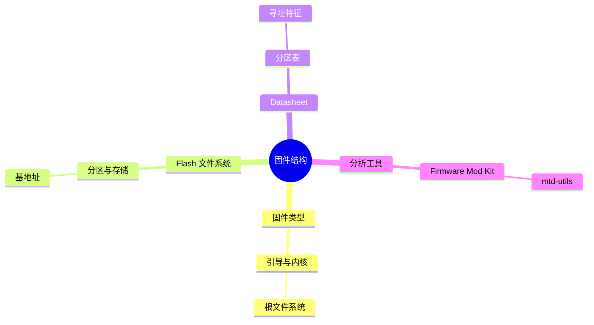

???+ abstract "本章摘要"
    本章把注意力从单条指令扩展到固件整体结构：识别常见固件类型与 Flash 文件系统，借助 Datasheet、分区表和特定指令模式确定基地址，并介绍 Firmware Mod Kit、mtd-utils 等用于拆解、查看和挂载固件内容的工具。
## 章节导航

上一篇：[第27章 IoT固件逆向工程](第27章 IoT固件逆向工程.md)

下一篇：[第29章 无线信号分析](第29章 无线信号分析.md)

回到目录：[00-目录](00-目录.md)

## 一、固件结构分析

在前面的章节中，我们讨论了裸机系统（即整个固件就是一个程序）的固件逆向工程方法，但是在实际环境中，我们碰到的固件多是一系列文件或者文件系统，甚至是数据和代码的混合，这种时候我们就需要对固件结构先进行分析，从中分离出代码、文件以及部分数据后再进行更加精确的分析。甚至在有些固件中，存在压缩或加密的代码或者数据，此时我们也需要先对该部分数据进行解压或者加密处理，然后才能继续对其进行分析。本章就为大家介绍复杂固件的分析方法。

### 28.1 常见固件类型

在前面的章节中，笔者已经向大家介绍了单片机程序的分析方法，那么，接下来我们来分析嵌入式系统的固件。在前文中已经介绍过固件的概念，本章将展开详细介绍。

事实上，在介绍完单片机软件逆向工程的时候，我们已经分析了一种最基本的固件，那就是裸机程序。裸机程序是组成最为简单的固件，只包含代码和代码需要引用的数据。更复杂的固件往往会含有不止一个可执行文件。也许此时你会想到，更复杂的固件是不是仍然会包含文件系统呢？答案是肯定的，在这里笔者可以负责任地告诉大家，固件就是程序+文件系统的组合，由文件系统将多个程序组合成一个更大、更复杂的二进制文件。当然这里的大小指的是一个相对的概念。很多时候，固件的大小往往只有几MB，而在Windows或Linux上的可执行文件动辄就是几百MB，当然两者是不能比的，相比而言，固件是麻雀虽小，五脏俱全。

本节将会列举一些常见的固件类型，大概可分为如下几种。

· 裸机程序：前面已经提到过，它是组成最简单的固件，也是最容易分析的固件，IDA可以正确识别并分析这种类型的固件。

· 文件系统镜像：往往包含完整的嵌入式文件系统，内部组织了多个文件结构，还可能会维护Linux的根目录，需要根据具体服务提取相应的bin文件进行分析。文件系统镜像还会包含众多的配置文件诸如xml或conf/ini文件等。

· 带压缩的镜像：嵌入式系统在空间上通常会希望结构尽可能紧凑，所以希望对固件内容进行压缩，由引导代码进行解压操作，这类固件的主体内容已经被压缩，因此提取和分析固件代码的难度会更大。此类固件往往是只读的。

· 带压缩的文件系统：与带压缩的镜像类似，这种固件采用了支持压缩的文件系统，例如Squashfs这类文件系统，可以使用lzma之类的算法对文件系统主体进行压缩，当然也正因为如此，这种固件在实际运行时，文件系统也是只读的。

由于裸机程序在前文中已经有了详细的分析，因此本节将着重介绍文件系统的分析。关于固件的识别，在Linux中仍然可以使用常用的binwalk、file等命令进行初步的判定。

### 28.2 Flash文件系统

与普通计算机系统不同的是，嵌入式系统往往需要使用低成本的存储器，诸如EEPROM或Nor/Nand Flash等，这些存储器在特性、写入和磨损性能上，与机械硬盘乃至SSD有着诸多区别。因此，在文件系统设计上，也并不适合直接照搬PC上的常用文件系统，所以在这样的环境下，就诞生了许多针对Flash存储器而设计的特殊文件系统，这里列举一些最常见的Flash文件系统，具体如下。

· JFFS/JFFS2：全名是Journaling Flash File System，是Red Hat公司开发的闪存文件系统，最早是为NOR Flash设计的，自2.6版本以后开始支持NAND Flash，极适合用于嵌入式系统，多见于32MB以下的Nor型Flash固件中。它支持三种压缩算法：zlib、rubin以及rtime。

· YAFFS/YAFFS2：全称为Yet Another Flash File System，是由Aleph One公司发展出来的NAND flash嵌入式文件系统。与JFFS不同的是，YAFFS最初是专门针对Nand型Flash所设计的，对于大容量的Flash读写更有优势，而JFFS在小容量的FLASH中更具优势，两者各有侧重。这种文件系统多见于128MB以上的Nand型Flash固件中。

· Squashfs：是一套供Linux核心使用的GPL开源只读压缩文件系统。Squashfs能为文件系统内的文件、inode及目录结构提供压缩操

作，并支持最大1024千字节的区块，以提供更大的压缩比。这种文件系统多用于存储资源紧张的场合，OpenWrt以及DD-Wrt的固件使用的就是这种文件系统。多见于4～16MB的Nor型Flash中。

### 28.3 固件基地址确定方法

在前面的讨论中，我们是用IDA加载分析hex文件，但在很多时候，我们拿到的是一个并不包含加载基地址信息的固件，这时候就需要通过一些方法来确定加载地址，并在IDA中使用正确的基地址加载程序，才能得到正确的分析结果。但在没有任何信息的时候，确定基地址确实是非常难的，本节会根据笔者的经验总结一些常用的方法，在碰到具体问题时，往往还需要各位读者仁者见仁、智者见智使用一切资源去分析。需要注意的是，确定固件基地址并不是必须的，只有在某些特殊情况下才需要。例如，裸机程序的bin文件，需要自行确定基地址。某些使用了多个操作系统的固件，例如，华为某些终端使用了vxworks操作系统，并非elf格式的文件，其内核代码直接加载入内存，此时如果要使用IDA静态分析，则仍然需要确定基地址。

### 1. 查阅Datasheet

对于裸机程序，其加载的基地址一定是确定的，而该地址在Datasheet中是可以找到的，而且一般就是程序存储区的起始地址。以上文中提到的Confused ARM为例，其加载地址0x08000000就是Memory Maps中Flash区域的起始地址。对于其他芯片的裸机程序，同样可以通过查询Datasheet得出结论。

### 2. 在固件分区表中查找

这里以某款3G路由的固件为例（该路由比较有代表性），该固件是一种典型的固件结构，在固件最头部有分区表，标明了每个分区的加载地址，若没有加载地址则表示该分区不会被映射到内存中。分区表的结构大概如图28-1所示。


| 000000C0 | 70 | 54 | 61 | 62 | 6C | 65 | 48 | 65 | 61 | 64 | 00 | 00 | 00 | 00 | 00 | 80 | pTableHead | 1 |
| --- | --- | --- | --- | --- | --- | --- | --- | --- | --- | --- | --- | --- | --- | --- | --- | --- | --- | --- |
| 000000D0 | 42 | 4F | 4F | 54 | 52 | 4F | 4D | 5F | 56 | 30 | 31 | 2E | 30 | 32 | 00 | 00 | BOOTROM_V01.02 |  |
| 000000E0 | 48 | 36 | 39 | 32 | 30 | 43 | 53 | 5F | 45 | 35 | 33 | 37 | 32 | 00 | 00 | 00 | H6920CS_E5372 |  |
| 000000F0 | 42 | 6F | 6F | 74 | 4C | 6F | 61 | 64 | 00 | 00 | 00 | 00 | 00 | 00 | 00 | 00 | BootLoad |  |
| 00000100 | 00 | 00 | 00 | 00 | 00 | 00 | 00 | 00 | 00 | 00 | 02 | 00 | 00 | 00 | FC | 2F |  | u/ |
| 00000110 | 00 | 00 | FC | 2F | 01 | 01 | 00 | 00 | 00 | 00 | 00 | 00 | 00 | 00 | 00 | 00 | u/ |  |
| 00000120 | 4E | 76 | 42 | 61 | 63 | 6B | 4C | 54 | 45 | 00 | 00 | 00 | 00 | 00 | 00 | 00 | NvBackLTE |  |
| 00000130 | 00 | 00 | 02 | 00 | 00 | 00 | 00 | 00 | 00 | 00 | 18 | 00 | 00 | 00 | 00 | 00 |  |  |
| 00000140 | 00 | 00 | 00 | 00 | 0D | 01 | 00 | 00 | 00 | 08 | 00 | 00 | 00 | 00 | 00 | 00 |  |  |
| 00000150 | 4E | 76 | 42 | 61 | 63 | 6B | 47 | 55 | 00 | 00 | 00 | 00 | 00 | 00 | 00 | 00 | NvBackGU |  |
| 00000160 | 00 | 00 | 1A | 00 | 00 | 00 | 00 | 00 | 00 | 00 | 10 | 00 | 00 | 00 | 00 | 00 |  |  |
| 00000170 | 00 | 00 | 00 | 00 | 0E | 01 | 00 | 00 | 00 | 08 | 00 | 00 | 00 | 00 | 00 | 00 |  |  |
| 00000180 | 42 | 6F | 6F | 74 | 52 | 6F | 6D | 00 | 00 | 00 | 00 | 00 | 00 | 00 | 00 | 00 | BootRom |  |
| 00000190 | 00 | 00 | 2A | 00 | 00 | 00 | 2C | 00 | 00 | 00 | 30 | 00 | 80 | 3F | 00 | 30 | * | 0 1? 0 |
| 000001A0 | 00 | 40 | 00 | 30 | 02 | 01 | 00 | 00 | 00 | 00 | 00 | 00 | 00 | 00 | 00 | 00 | @ 0 |  |
| 000001B0 | 42 | 6F | 6F | 74 | 52 | 6F | 6D | 00 | 00 | 00 | 00 | 00 | 00 | 00 | 00 | 00 | BootRom |  |
| 000001C0 | 00 | 00 | 5A | 00 | 00 | 00 | 2C | 00 | 00 | 00 | 30 | 00 | 80 | 3F | 00 | 30 | Z | , 0 1? 0 |
| 000001D0 | 00 | 40 | 00 | 30 | 02 | 01 | 00 | 00 | 00 | 00 | 00 | 00 | 00 | 00 | 00 | 00 | @ 0 |  |
| 000001E0 | 2F | 79 | 61 | 66 | 66 | 73 | 32 | 00 | 00 | 00 | 00 | 00 | 00 | 00 | 00 | 00 | /yaffs2 |  |
| 000001F0 | 00 | 00 | 8A | 00 | 00 | 00 | 00 | 00 | 00 | 00 | A0 | 00 | 00 | 00 | 00 | 00 | 1 |  |
| 00000200 | 00 | 00 | 00 | 00 | 08 | 01 | 00 | 00 | 01 | 44 | 00 | 00 | 00 | 00 | 00 | 00 |  | D |
| 00000210 | 2F | 79 | 61 | 66 | 66 | 73 | 35 | 00 | 00 | 00 | 00 | 00 | 00 | 00 | 00 | 00 | /yaffs5 |  |
| 00000220 | 00 | 00 | 2A | 01 | 00 | 00 | 00 | 00 | 00 | 00 | F0 | 05 | 00 | 00 | 00 | 00 | * | 8 |
| 00000230 | 00 | 00 | 00 | 00 | 12 | 01 | 00 | 00 | 01 | 44 | 00 | 00 | 00 | 00 | 00 | 00 |  | D |
| 00000240 | 2F | 79 | 61 | 66 | 66 | 73 | 30 | 00 | 00 | 00 | 00 | 00 | 00 | 00 | 00 | 00 | /yaffs0 |  |
| 00000250 | 00 | 00 | 1A | 07 | 00 | 00 | 00 | 00 | 00 | 00 | C0 | 00 | 00 | 00 | 00 | 00 |  | A |
| 00000260 | 00 | 00 | 00 | 00 | 06 | 01 | 00 | 00 | 01 | 02 | 00 | 00 | 00 | 00 | 00 | 00 |  |  |
| 00000270 | 56 | 78 | 57 | 6F | 72 | 6B | 73 | 00 | 00 | 00 | 00 | 00 | 00 | 00 | 00 | 00 | VxWorks |  |
| 00000280 | 00 | 00 | DA | 07 | 00 | 00 | AA | 01 | 00 | 00 | B0 | 01 | 80 | 3F | 00 | 30 | U | 8° 1? 0 |
| 00000290 | 00 | 40 | 00 | 30 | 03 | 01 | 00 | 00 | 00 | 00 | 00 | 00 | 00 | 00 | 00 | 00 | @ 0 |  |
| 000002A0 | 46 | 61 | 73 | 74 | 42 | 6F | 6F | 74 | 00 | 00 | 00 | 00 | 00 | 00 | 00 | 00 | FastBoot |  |

<div style="text-align: center;">图28-1 一个固件头部的分区表信息</div>


图28-1中，VxWorks分区，可以看到，0x30003F80就是加载vxworks分区的基地址（注意字节是4字节对齐的，不要找错位），若这个位置上的4字节均为0，则说明该分区不会被映射进内存。其中，前面的0x01b00000是指该分区的最大大小，对于有分区表的固件来说，确定要分析区域的基地址可以比较方便地在分区表中找到。

### 3. 一些特殊技巧

确定固件基地址并不是一件容易的工作，不过针对特别的架构还是存在一些特殊技巧的，例如PPC架构，利用其汇编语言的特性，仍然可以快速确定固件的基地址。这里介绍一下在Power PC程序下的特殊技巧。在PowerPC中，虽然寄存器是32位的，但是如果要将数据装入寄存器中，由于其指令宽度的限制，一条指令只能操作16位数据，所以指令中会使用@highest:Bit[48~63]、@higher:Bit[32~47]、@h:Bit[16~31]、@l:Bit[0~15]这4种标记来表示取操作数的具体哪一部分。对于32位的PowerPC，寄存器是32位的。因为每次只能取16位，所以第16位被看作符号，在操作的时候，操作数会被当作符号扩展。例如，指令“li r25,0x80008000@1”，在操作时，bit15是1，所以低16位被符号扩展为0xFFFF8000，然后装入r25。

理解了这一点，我们再来看@ha。@ha是为了在装入地址的时候防止由于符号扩展而引起错误才引入的一种标记，特点是，@ha并不直接取高16位，而是将新数的bit16当作符号位并且根据bit15来进行设置。举个例子，“lis r25,0xc0008000@ha”，在取高16位时，由于bit15为1，所以相应地，在操作后也将bit16设置为1，即r25=0xc0010000。这个特性对我们来说有什么作用呢？接下来举一个实际例子。比如，加载固件后，IDA默认从地址0开始加载。我们找一条以@ha结尾的指令，如图28-2所示。

{ width="100%" }


<div style="text-align: center;">图28-2 PowerPC固件中的相对寻址指令</div>


显然，这里我们要加载到r9的寄存器地址为0x339ab8，而如果image base为0的话，那么我们看一下这样操作会发生什么，具体如下。

由于bit15为1，@ha会将bit16设置为1，而现在的情况是，bit16

已经为1，即r9=0x330000。而下一句，r9加上了地址@1，即

0xFFFF9ab8，注意在现在这种情况下，

0xFFFF9ab8+0x330000=0x329ab8，并不等于0x339ab8，加载地址是错

误的，也就是说，要加载的该地址并非0x339ab8，那么应该是多少

呢？根据观察可以发现，当加载的地址为0x349ab8时，这两句的结果

是正确的，即 $ 0xFFFF9ab8+0x350000=0x349ab8 $，符合地址，因此可以推断，该固件的基地址为 $ 0x10000 $。在PowerPC的固件分析中，可以巧妙地使用这个特性，以确定基地址。

而至于ARM/MIPS等结构，目前并没有十分有效的方法可以在信息完全未知的条件下只通过指令判断基地址，因此此类固件还是需要经验以及额外的信息来进行辅助判断，这样会更有效一些。

### 28.4 固件分析工具

在某些情况下，我们不仅需要固件中的代码，还需要提取其中的配置文件，比如Web页面的管理员配置文件以及分析文件系统结构等。本节将介绍一些解包固件的常用工具。

### 1. Firmware Mod Kit

Firmware Mod Kit简称fmk，固件编辑工具，广泛应用于Squashfs类型的固件编辑，支持多款路由器。经过测试的固件有OpenWrt和DD-Wrt的所有固件，以及TP-Link、ASUS、D-Link的大部分路由型号的固件。因此，如果大家拿到的是Squashfs格式文件系统的固件，可以首先尝试使用此工具来提取分析。此工具最早放在Google code上，如今Google code已经关闭，大家可以到GitHub的镜像上下载（https://github.com/mirror/firmware-mod-kit）。使用其中的extract-firmware.sh脚本就可以提取固件。

### 2. mtd-utils

由于jffs/jffs2和yaffs/yaffs2是基于MTD的文件系统，因此可以使用Linux下的mtd-utils中的内核工具来获得对这两种文件系统的支持。此节将介绍如何使用mtd-utils直接挂载此类固件。这里以jffs2为例，具体步骤如下。

1）首先安装好mtd-utils，ubuntu可以直接使用apt-get安装。

2）想要识别jffs2文件系统，宿主机Linux首先要能识别这个文件系统。

使用cat/proc/filesystems查看内核是否已经支持jffs2文件系统。如果不支持，则使用modprobe jffs2命令开启内核对jffs2的支持。

3）加载mtddram模块、mtdblock模块。

modprobe mtdblock
modprobe mtdram total_size=12288

其中，total_size 的单位是 KB，并且其大小要大于固件的大小，否则在复制固件时会出现空间不足无法继续的问题。加载完毕后，在 dev 目录中会出现 /dev/mtdblock0。

4）复制jffs2镜像文件到/dev/mtdblock0：

```bash
dd if=jffs2-rootfs.img of=/dev/mtdblock0

```
5）最后一步，挂载mtdblock0即可：

```bash
mount -t jffs2 /dev/mtdblock0 /mnt

```
这样，我们就成功地将jffs2固件挂载到/mnt中了，接下来就可以很方便地使用文件浏览器去浏览其中的文件，以及提取固件中的某些内容了。yaffs2与此同理，也可以挂载，读者可以自行实践。

## 学习梳理

### 28.1 常见固件类型

???+ tip "本节要点"
    - 固件可能包含引导程序、内核、根文件系统和厂商配置等不同组成部分。
    - 先识别文件类型和内部结构，才能选择正确的拆包、提取或逆向路径。
    - 同一镜像中可能混合多个分区或数据格式，不能只把它当作单一可执行文件。
### 28.2 Flash文件系统

???+ tip "本节要点"
    - Flash 文件系统的设计与擦写特性、分区布局和嵌入式存储介质紧密相关。
    - 文件系统类型决定目录、配置、账号和可执行文件的提取方式。
    - 分析时要保留镜像与提取结果的对应关系，避免混淆分区边界。
### 28.3 固件基地址确定方法

???+ tip "本节要点"
    - 基地址是把原始二进制解释为有效代码和数据的关键前提。
    - 可通过 Datasheet、分区表和特殊寻址/跳转模式交叉推断。
    - 基地址结论应以可解析的函数、字符串引用和控制流作为验证。
### 28.4 固件分析工具

???+ tip "本节要点"
    - Firmware Mod Kit 适合协助识别、提取和重建常见固件内容。
    - mtd-utils 等工具可服务于 MTD 分区和 Flash 文件系统的查看、挂载或处理。
    - 工具输出必须回到原始镜像和文件系统结构中验证，避免误把提取结果当成唯一事实。
!!! warning "易错点"
    - 先确认架构、数据形态或调制方式，再选择反汇编、文件系统、协议或波形分析路径。
    - 不要把工具自动识别、反编译输出或单次解码结果直接当成结论；需要以地址、结构、校验或运行行为复核。
    - 原文中的 OCR 异常字符和不完整代码均按全内容保留原则呈现，阅读或复现时应回查上下文。
??? note "自测题"
    #### 基础
    1. 为什么固件镜像不能简单等同于一个可执行程序？
    2. 分析固件时识别 Flash 文件系统有什么价值？
    3. 确定基地址为什么重要？
    4. 书中给出的基地址推断途径有哪些？
    5. Firmware Mod Kit 和 mtd-utils 的用途分别偏向什么？

    #### 进阶
    6. 如何验证一个推断出的基地址而不是只接受猜测？
    7. 从文件系统中找账号或配置时，为什么仍要保留原始镜像证据？
    8. 面对多个嵌套或压缩层，应怎样安排分析顺序？

    #### 参考答案
    1. 它可能包含多个分区、引导程序、内核、文件系统和配置数据。
    2. 它决定如何提取文件、定位配置与账号，并理解存储结构。
    3. 错误基地址会使反汇编、函数识别和地址引用失真。
    4. 查阅 Datasheet、在分区表中查找，以及结合特殊技巧进行判断。
    5. 前者偏向固件提取和处理，后者偏向 MTD/Flash 文件系统的操作。
    6. 检查加载后是否出现合理的控制流、字符串引用、函数边界，并与文档或分区信息互证。
    7. 提取过程可能有偏差，原始镜像可用于复核路径、分区和内容来源。
    8. 先记录外层识别结果和偏移，再逐层提取并维护来源关系，避免跳步混淆。
## 本章思维导图



## 参考资料

- 《CTF特训营》本章 OCR 原文。
- 本章原文中的 Firmware Mod Kit 与 mtd-utils 使用说明。
- 固件结构、分区与基地址判断均应以原始镜像和芯片资料交叉验证。

*来源：《CTF特训营》，OCR 全内容保留整理版。*
