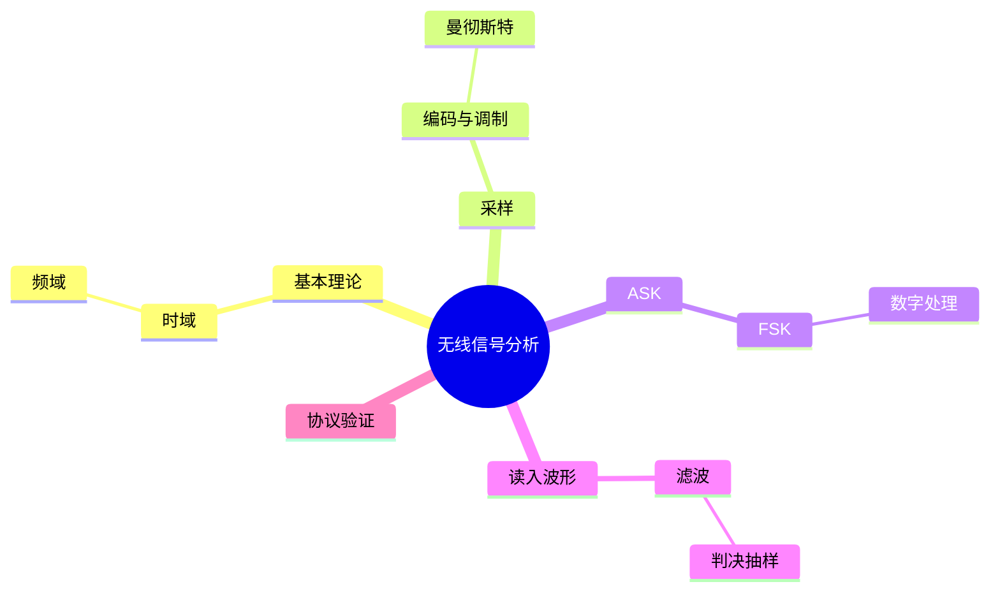

???+ abstract "本章摘要"
    本章介绍 CTF 无线题所需的信号处理入口：从无线通信的基本术语出发，理解曼彻斯特编码、ASK 与 FSK 等常见调制/编码方式及其解调思路，并以 Matlab 的观察、滤波和判决能力连接原始波形与可读数据。
## 章节导航

上一篇：[第28章 固件结构分析](第28章 固件结构分析.md)

下一篇：[第30章 经典赛题讲解](第30章 经典赛题讲解.md)

回到目录：[00-目录](00-目录.md)

## 一、无线信号分析

近期的CTF比赛中，除了出现了大量综合性IoT固件分析类赛题之外，还出现了不少与通信相关的题目。当然，无线通信安全是一个非常古老的话题，早在二战时期，军事专家们就对此进行了大量分析，也由此产生了大量的安全方法以及攻防思路。但在线上比赛中，此类题目的出题方式比较受限制，因此在本书中，针对一些可能出现的题型，将会介绍一些有用的基础知识以及分析方法。

### 29.1 无线通信基本理论介绍

无线通信是一门很大的专业，其中包含的理论数不胜数、高深莫测。如果要详尽叙述，那就是通信专业几十门课程的体量了。但考虑到CTF比赛中已经涉及了部分简单的无线通信相关问题，因此在本节中做一些简单介绍，帮助读者掌握此类题目的解题套路和方法。本节将会提出一些在后面会使用到的概念，具体如下。

· 射频信号：射频信号就是经过调制的，拥有一定发射频率的电磁波。其本质就是电磁辐射，用于传递信息。

·频谱：表示一个信号包含的频率范围，即信号通过傅立叶分解后，可以看到其频率的组成。

· 绝对带宽：一个信号所包含的所有频谱分量的宽度。

·有效带宽：对于频谱无限宽的信号，其绝大部分的能量都集中在相当窄的频带内，这个频带称为有效带宽。

关于频谱的直观解释，图29-1用最直观的角度阐述了频谱的物理意义和数学意义，读者们可以结合其他资料来理解。可以说，理解了频谱，对于无线通信相关的知识就已经理解了大半。

{ width="100%" }

图29-1 无线信号的傅立叶分解

### 29.2 常见调制方式与解调方法

由于线上赛的限制，出题者不可能给出设备来分析或抓取空间中的无线信号，因此，往往都采用向选手提供原始信号采样波形的方式。我们需要掌握的就是数字信号处理的方法，在没有这些方法之前，相信各位读者都能直观地想出一些所谓的“土方法”，也能通过脚本解决问题。但这些方法其实并非问题的本质，若要详细说道，仅凭本书还远远不够。本节将结合目前比赛中容易出现的类型，专门为大家分析归类。目前比赛中已出现的无线信号分析类题目还处于比较简单的阶段，毕竟大家不都是通信专业的学生。在此可将无线信号分析类题目归类为如下两种。

### 1. 曼彻斯特编码

曼彻斯特编码也称为相位编码（Phase Encode，PE），是一种同步时钟编码技术，被物理层使用来编码一个同步位流的时钟和数据。它在以太网媒介系统中的应用属于数据通信中的两种位同步方法里的自同步法（另一种是外同步法），即接收方利用包含同步信号的特殊编码从信号自身提取同步信号来锁定自己的时钟脉冲频率，以达到同步的目的。

曼彻斯特编码常用于局域网传输或无线电信号传输。曼彻斯特编码将时钟和数据包含在数据流中，在传输代码信息的同时，也将时钟同步信号一起传输给对方，每位编码中都有一跳变，不存在直流分量，因此具有自同步能力和良好的抗干扰性能。但每一个码元都被调成两个电平，所以数据传输速率只有调制速率的1/2。

在曼彻斯特编码中，每一位的中间都有一跳变，位中间的跳变既可作时钟信号，又可作数据信号；从低到高跳变表示“1”，从高到低跳变表示“0”。还有一种是差分曼彻斯特编码，每位中间的跳变仅提供时钟定时，而用每位开始时有无跳变表示“0”或“1”，有跳变为“0”，无跳变为“1”。

需要特别注意的是，在每一位的“中间”必有一跳变，根据此规则，可以得出曼彻斯特编码波形图的画法。例如，传输二进制信息0，若将0看作一位，则我们以0为中心，在两边用虚线界定这一位的范围，然后在这一位的中间画出一个电平由高到低的跳变。后面的每一位以此类推即可画出整个波形图。并且，曼彻斯特编码在实际使用时的规定有歧义，有时候使用从低到高的跳变表示为0，从高到低的跳变表示为1，有的场合下又会反过来。因此，在实际解题时，还需要各位选手在不确定的情况下对这两种情况都做一下尝试。

ASK是最常见的二进制调试方式之一，用信号振幅的有和无分别表示1和0，其时域波形如图29-2所示，很容易区分。

{ width="100%" }

图29-2 ASK调制的时域信号

下面看一个实际捕捉到的波形，如图29-3所示。

{ width="100%" }

图29-3 实际捕捉到的ASK调制时域波形

从图29-3中可以很明显地看出，1和0分别用有波形和无波形表示，当然还有一个很明显的特点，就是最宽的信号是最窄信号宽度的2倍，这也意味着，在此次传输中使用了曼彻斯特编码。那么ASK是如何

解调获得其所包含的内容呢？可以用程序扫描某一段时间内的最大值，如果最大值大于阈值，就表示为1，否则就表示为0。鉴于ASK比较简单，这种方法当然可行。不过，本节将向大家介绍一种通用方法，对于ASK调制，都可以使用通用方法。

ASK的通用解调方法为：

[对原型号取绝对值或平方] - [低通滤波器] - [判决抽样] - [曼彻斯特解码]

具体的示例，将在后文中详细介绍，这种解调方式的重点在于，低通滤波器如何设计。

### 3. FSK

FSK也是最常见的调制方式之一，用两种不同的频率表示0和1，比如用低频波形表示0，用高频波形表示1。在时域上看起来的样子如图29-4所示。

由图29-4可以看到，如果说ASK使用波形的有和无分别表示1和0的话，那么FSK就是使用波形的疏和密来分别表示二进制的0和1。与ASK不同的是，FSK不能再使用计算包络的方法来解调，既然是频率的区别，那么也可以通过每一段波形的过零点次数来区分频率，由此即可分析出调制过的信号。

{ width="100%" }

图29-4 FSK调制的时域波形

FSK的通用解调方法为将该信号同时通过低通和高通滤波器，这样将得到两路互补的ASK信号，对两路信号分别进行包络判断和阈值检测，即可判断当前位是0还是1。

### 29.3 Matlab在数字信号处理中的应用

Matlab作为工程计算的重要工具，对于信号分析与处理有着重要应用，其强大的滤波器设计工具箱是我们在本节中最需要关注的内容。本节就以ASK的例子为大家分析一下Matlab在数字信号处理中的使用方法。这里使用的功能主要是Matlab的sptool，即信号处理工具箱在滤波器设计方面的应用。由于Matlab为商业软件，因此大家需要自行下载安装。

打开Matlab之后，输入sptool，会弹出工具箱界面，如图29-5所示。

{ width="100%" }

图29-5 sptool界面

由图29-5可以看出，工具箱的主要功能分为三栏，左边为我们待处理的时域信号，中间是滤波器，最右边是各种频谱工具。在大多数情况下，我们只会用到左边和中间两栏的功能。在使用前，我们首先需要将待处理的信号导入工具箱中。这里以ASK信号为例，依次选择File→Import导入我们希望处理的信号波形，如图29-6所示。

{ width="100%" }

图29-6 导入信号界面

在导入信号之前，需要先将原始信号加入Workspace，加入方法这里不再赘述，可以直接使用UIOpen功能导入。选中信号x，单击右侧的箭头，表示将x信号导入sptool，Name可随意，默认为sig1，完成后点

击OK按钮即可。接下来，信号sig1就出现在sptool的信号窗口中了，如图29-7所示。

{ width="100%" }

图29-7 导入信号后的界面

单击Signals区域底部的View按钮，可以画出信号的原始波形，如图29-8所示。

接下来，我们进行最关键的步骤——滤波器的设计。单击Filters区域底部的New按钮，打开滤波器设计窗口，如图29-9所示。

以设计低通滤波器为例，在左下方的Response Type中选择Lowpass，其他选项保持默认设置即可，关键在于Frequency

Specifications这个区域。Fs意为采样频率，这里可以随意给出一个

值，比如1000，那么下方的Fpass和Fstop就需要我们通过Fs来计算了。我们看一下时域的波形，可以发现，波形的基本宽度为64个点的整数倍，如果采样率为1000的话，那么我们需要解调出方波波形的原始频率应该为64个点对应一个波形，那么1000个点对应的就是15.625个周期，而1000个点是每秒采样的点数，所以在假设采样率为1000时，可以推测出此时原信号频率为15.625Hz（注意，这个频率并非真实频率，而是我们通过Fs的假设后，用于计算参数的频率）。比如，我们的目标是保留原信号，滤掉原信号每个周期中的高频抖动，那么这里就设Fpass=16，Fstop=48（一般取Fstop=3Fpass，这是一个经验做法，如果效果不佳，则可以继续调整）。填完后单击Design Filter，滤波器就设计完毕了，如图29-10所示。

{ width="100%" }

图29-8 预览时序波形界面

{ width="100%" }

图29-9 滤波器设计界面

{ width="100%" }

图29-10 滤波器设计完毕后的效果

完成后关闭窗口，此时，sptool的Filters区域就出现了我们刚才设计的filt1滤波器，如图29-11所示。

最后一步，应用滤波器，在Signals区域选中sig1，在Filters区域选中filt1，然后点击Apply按钮，会弹出Apply Filter窗口，如图29-12所示。

{ width="100%" }

图29-11 滤波器保存后的效果

{ width="100%" }

图29-12 滤波器使用界面

其他参数不变，Output Signal的名称可以自己选择，这里使用默认设置，单击OK按钮，此时在Signals区域就会出现一个新的sig2信号，效果如图29-13所示。

{ width="100%" }

图29-13 滤波器应用之后的信号时序图

可以看到，时序图中现在就只剩下低频信号了。最后一步，如果需要在后面的计算中使用该信号，则可以使用File→Export功能，如图29-14所示。

{ width="100%" }

图29-14 信号导出界面

如果要选中多个数据，可以按住Ctrl键点选。选择完毕后，点击Export to workspace按钮即可。这样，sig2就被导出至Workspace以供后续使用了。

## 学习梳理

### 29.1 无线通信基本理论介绍

???+ tip "本节要点"
    - 无线分析先要建立频率、带宽、采样和时域/频域观察的基本视角。
    - 原始波形的幅度、周期与频率变化是判断传输方式的直接证据。
    - 任何解调结论都应能回到波形特征和采样条件中解释。
### 29.2 常见调制方式与解调方法

???+ tip "本节要点"
    - 曼彻斯特编码利用跳变承载比特，需先确认 01/10 与比特值的对应关系。
    - ASK 关注载波幅度变化，FSK 关注载波频率变化。
    - 解调后还需检查字节序、前导码、校验和与协议字段，不能止步于比特串。
### 29.3 Matlab在数字信号处理中的应用

???+ tip "本节要点"
    - Matlab 可用于读入样本、绘制波形、设计滤波器和验证判决结果。
    - 处理顺序通常是观察、预处理/滤波、抽样判决、编码解码和内容验证。
    - 参数阈值应由波形和采样率支持，并通过输出是否自洽进行回检。
!!! warning "易错点"
    - 先确认架构、数据形态或调制方式，再选择反汇编、文件系统、协议或波形分析路径。
    - 不要把工具自动识别、反编译输出或单次解码结果直接当成结论；需要以地址、结构、校验或运行行为复核。
    - 原文中的 OCR 异常字符和不完整代码均按全内容保留原则呈现，阅读或复现时应回查上下文。
??? note "自测题"
    #### 基础
    1. 无线信号分析中为什么要同时观察时域和频域？
    2. 曼彻斯特编码的核心特征是什么？
    3. ASK 和 FSK 分别观察什么变化？
    4. 为什么解调出的比特串还不能直接视作答案？
    5. Matlab 在本章工作流中可承担哪些任务？

    #### 进阶
    6. 若 01 与 10 的曼彻斯特映射不确定，应如何处理？
    7. 滤波和判决阈值如何避免成为拍脑袋参数？
    8. 发现疑似前导码后下一步应做什么？

    #### 参考答案
    1. 它们分别更直观地显示幅度/时序变化与频率成分，有助于判断调制方式。
    2. 每个比特周期存在跳变，具体的 01/10 对应关系需要结合题目验证。
    3. ASK 观察载波幅度，FSK 观察载波频率。
    4. 还可能存在字节序、前导码、编码、校验和和协议字段。
    5. 读取样本、绘图、滤波、抽样判决和结果验证。
    6. 分别尝试两种映射，再结合帧格式、可读性、校验和或题目约束验证。
    7. 依据采样率、波形分布和预期符号周期设置，并比较处理前后的可验证输出。
    8. 划定有效载荷起点，按字节和协议字段分析，并核验校验机制。
## 本章思维导图

## 参考资料

- 《CTF特训营》本章 OCR 原文。
- 本章原文的波形图、调制示意与 Matlab 操作说明。
- 无线题的最终解释应同时满足波形、编码和协议层面的约束。

*来源：《CTF特训营》，OCR 全内容保留整理版。*
