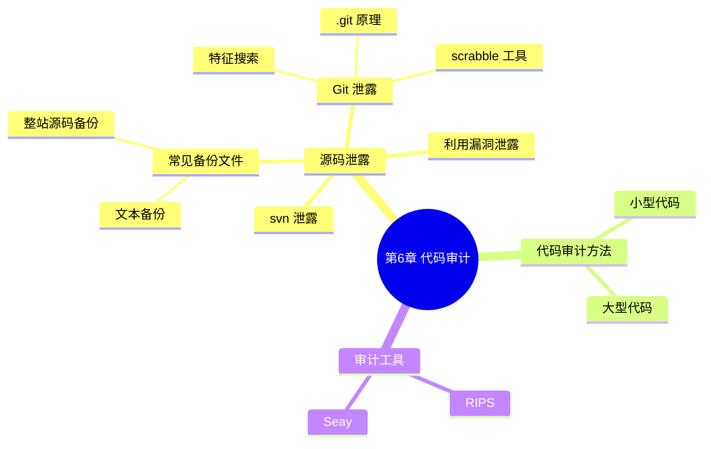

???+ abstract "本章摘要"
    本章围绕 CTF 中的代码审计展开：先介绍源码泄露的几种途径（常见备份文件、Git 泄露、svn 泄露、利用文件包含/下载漏洞），再讲解小型代码与大型代码的审计方法与技巧，最后介绍 RIPS 与 Seay 两款代码审计工具。
## 章节导航

上一篇：[第5章 利用特性进行攻击](第5章 利用特性进行攻击.md)
下一篇：[第7章 条件竞争](第7章 条件竞争.md)
回到目录：[00-目录](00-目录.md)

代码审计，顾名思义就是检查源代码中的安全缺陷，检查程序源代码是否存在安全隐患，或者是否有编码不规范的地方，通过自动化工具或者人工审查的方式，对程序源代码逐行进行检查和分析，发现这些源代码缺陷引发的安全漏洞，并提供代码修订措施和建议。

???+ note "🟡 定义：代码审计"
    ==代码审计==就是检查源代码中的安全缺陷，看程序是否存在安全隐患或编码不规范，再由自动化工具或人工审查逐行分析，发现漏洞并给出修订建议（即本段原文所定义的整个过程）。本定义框为 AI 概括，原文见上方段落。
## 6.1 源码泄露

CTF比赛中经常会出现需要源码审计的题目，==源码有时候会直接提供给你，有时候则需要自己去找==，因此下面为大家列出几种常用的源码泄露的途径及利用技巧。

### 1. 常见备份文件

在实战中，备份文件一般是由于维护人员的疏忽，忘记删除而留在服务器中的文件。这时攻击者就能够通过枚举常见备份文件名来得到关键代码，从而进行源代码的审计。为了能够找到这些备份文件，我们可以使用一些敏感文件扫描工具来进行探测，这类工具比较多，这里就不逐一介绍了。一般常见备份文件有以下两种类型。

#### （1） 文本备份文件

技术人员在Linux系统下会使用诸如vim或gedit等文本编辑器，当编辑器崩溃或因异常退出时会自动备份当前文件；有时候程序开发者在编写代码时，也可能会将实现某功能后的代码备份后再进行后续开发工作。下面以index.php为例列出一些可能的备份文件：

```
index.php.txt
index.php.old
...
```

#### （2） 整站源码备份文件

有时候题目会将整站源码打包，然后放在网站的根目录下，这时，只要找到这个压缩包就能开始进行源码审计了。下面列出一些常见的整站备份文件名，举例如下：

```
www
wwdata
wwwroot
web
webroot
backup
dist
...
```

后面再加上各种压缩文件后缀名，举例如下：

```
.zip
.tar
.tar.gz
.7z
.rar
...
```

==有时候，还可以利用其他可能会泄露目录结构或文件名的敏感文件来获取备份文件的位置，如“.DS_Store”等。==

???+ tip "本节要点"
    1. 备份文件常因维护人员疏忽遗留，攻击者通过枚举常见文件名即可获得关键代码；
    2. 文本备份常见形如 index.php.txt、index.php.old；
    3. 整站备份常见文件名：www、wwdata、wwwroot、web、webroot、backup、dist，再叠加 .zip/.tar/.tar.gz/.7z/.rar 等后缀；
    4. 敏感文件（如 .DS_Store）可泄露目录结构与文件名，辅助定位备份文件。
### 2. Git 泄露

大家对GitHub一定都不陌生，这上面不仅可以找到各种好用的开源工具，而且可以上传一些自己开发的项目，是我们获取源码的一个途径。

#### （1） 通过特征搜索

当某个网站存在某个明显特征字符串的时候，就有可能通过GitHub的搜索功能来搜索到该项目。下面的例子是NJCTF 2017的题目chall，进入题目提供的登录界面后可以看到一个非常显眼的字符串，如图6-1所示。

{ width="75%" }

*图6-1 题目界面*


通过搜索“请登录，b

[OCR存疑：此处原文截断，“通过搜索“请登录，b””一句在 OCR 中原样中断，后续内容缺失，未臆造补全。]

#### （2） 通过.git泄露

==我们知道每个git项目的根目录下都存在一个.git文件夹，这个文件夹的作用就是存储项目的相关信息==，这里笔者推荐的工具是GitHack和scrabble，下面就来结合git原理将scrabble源码简要分析一遍。

{ width="75%" }

*图6-2 GitHub搜索结果*

了解git原理之前，我们首先应在本地建立一个git工程并初始化，然后再commit一次，如图6-3所示。

{ width="75%" }

*图6-3 初始化git工程*

然后，进入.git目录下，看看目录中有什么文件，如图6-4所示。

{ width="75%" }

*图6-4 git 目录结构*

这里列举几个比较关键的文件。

- HEAD：标记当前git在哪个分支中。
- refs：标记该项目里的每个分支指向的commit。
- objects: git本地仓库存储的所有对象。

而git的对象有如下四个。

- commit：标记一个项目的一次提交记录。
- tree：标记一个项目的目录或者子目录。
- blob：标记一个项目的文件。
- tag：命名一次提交。

所以，我们可以通过下面的几个操作找到项目的每个文件夹及文件，首先是确定commit对象，如图6-5所示。

{ width="75%" }

*图6-5 确定commit对象*

其中，第三条命令最后的参数只需要输入第二条命令返回结果的前6位即可，然后我们就能查看里面的tree对象和blob对象了，如图6-6所示。

{ width="75%" }

*图6-6 查看对象*

这样就可以看到之前commit的三个文件了，由于这三个文件是空的，所以blob标识是相同的。由于样例文件为空，所以最后一条读blob数据的命令返回为空，但在实际情况下一般不会这样。

在实战过程中，根据这个原理，可以将当前项目完全还原下来。

接下来，我们来分析一下scrabble的源码，以便更进一步了解visit 目录恢复文件的原理(https://github.com/denny0223/scrabble).

[OCR存疑：此处“visit 目录”疑为 OCR 误识，结合语境或指 git 目录，按原文保留。]

首先是输入存在“.git”目录中的url，接着就是查看HEAD文件获取分支的位置，然后得到分支的hash值，代码如下：

```bash
domain=$1
ref=$ (curl -s $domain/.git/HEAD | awk '{{print $2}}')
tmp_dir='echo $domain | awk -F'[:']' {print $4}'
mkdir $tmp_dir
cd $tmp_dir
lastHash=$ (curl -s $domain/.git/$ref)
```

[OCR存疑：上段 shell 中 `ref=$ (`、`lastHash=$ (` 疑为 `ref=$(...)` 命令替换，`$` 后空格为 OCR 缺失，`-F'[:']'` 引号紊乱，均按原文保留。]

得到hash值后首先本地初始化一个git，接着通过parseCommit获取全部对象，最后使用reset重设分支，这样就将项目重新建立在本地了，代码如下：

```bash
git init
cd .git/objects/
parseCommit $lastHash
cd ../../

echo $lastHash > .git/refs/heads/master
git reset --hard
```

接下来，我们来看看三个自定义函数：parseCommit、parseTree、downloadBlob。

1）parseCommit函数用于下载commit对象，同时会将其parent也一并下载下来，代码如下：

```bash
function parseCommit {
    echo parseCommit $1
    downloadBlob $1
    tree=$(git cat-file -p $1| sed -n 'lp' | awk '{{print $2}}')
    parseTree $tree
    parent=$(git cat-file -p $1 | sed -n '2p' | awk '{{print $2}}')
    [ ${#parent} -eq 40 ] && parseCommit $parent
}
```

2）parseTree函数用于下载tree对象，同时列出tree下的所有对象，分类为tree或者blob后处理，代码如下：

```bash
function parseTree {
    echo parseTree $1
    downloadBlob $1
    while read line
        do
            type=$((echo $line | awk '{{print $2}}'))
            hash=$((echo $line | awk '{{print $3}}'))
            [ "$type" = "tree" ] && parseTree $hash ||
            downloadBlob $hash
            done <<(git cat-file -p $1)
}
```

3）downloadBlob函数用于将与hash对应的文件下载下来：

```bash
function downloadBlob {
    echo downloadBlob $1
    mkdir -p ${1:0:2}
    cd $_
    wget -q -nc $domain/.git/objects/$ {1:0:2}/${1:2}
    cd ..
}
```

理解了git目录结构和原理之后，再遇到与git相关的题目时就能够自如地应对题目的变化了，==我们需要找到的其实就是下载项目对应commit的hash==。

XDCTF 2015的Web2就是git泄露的实例。该例题中的“.git”文件夹下留着的项目只有README.md和“.gitignore”，README.md告诉我们“All source files are in git tag 1.0”，所以我们只需要找到tag=1.0的hash即可，直接找到refs/tags/1.0并读取hash，然后在代码上将lastHash的值修改为我们得到的hash值，还原出来后就能得到flag了。

??? note "Git 为什么能泄露源码？"
    每个 git 项目根目录都有一个 .git 文件夹，存有 HEAD（当前分支）、refs（各分支指向的 commit）、objects（所有对象）。只要下载到对应 commit 的 hash，就能按 commit/tree/blob 逐层还原出全部文件，scrabble 等工具即据此自动恢复项目。
### 3. svn 泄露

svn与git类似，同样是项目初始化时会生成一个“.svn”目录，所以也可以用工具来解决，笔者这里推荐使用svn-extractor，内容与git差不多，所以不再赘述。

### 4. 利用漏洞泄露

如果能发现任意文件包含漏洞或者任意文件存在下载漏洞，就有可能下载到题目的源码，对其进行审计。

任意文件包含和下载的漏洞的表现形式包含但不限于以下几种：

• http://example.com/download.php?file=abc.pdf
• http://example.com/show_image.php?file=1.jpg
• http://example.com/read.aspx?file=/upload/1.txt

将file参数修改为“../index.php”这种形式，就可以利用漏洞下载源代码文件了，通常比赛题目中这种漏洞是与别的漏洞配合起来使用的，如XSS和SSRF漏洞。

???+ tip "本节要点"
    1. Git 泄露核心：拿到 HEAD/refs 找到 commit hash，再用 commit/tree/blob 对象逐层还原；
    2. .git 目录三个关键项：HEAD（当前分支）、refs（分支指向的 commit）、objects（存储的所有对象）；
    3. git 四种对象：commit（提交记录）、tree（目录/子目录）、blob（文件）、tag（命名一次提交）；
    4. svn 泄露用 svn-extractor，原理与 git 类似；
    5. 文件包含/下载漏洞把 file 参数改成 ../index.php 即可下载源码，常与 XSS、SSRF 配合使用。
## 6.2 代码审计的方法与技巧

代码审计是CTF比赛中非常重要的一环，不仅在线上赛占据半壁江山，在攻防赛中也是Web方向的主要考核内容。代码审计不仅需要对各种漏洞、waf绕过技巧非常熟悉，还需要有耐心在茫茫代码中找到那一个存在漏洞的考点。下面就来介绍代码审计方面的一些常用方法和技巧。

### 1. 小型代码

线上赛题目的代码量一般都不大，所以相对来说还是比较容易找到漏洞的，通常可以按照如下所示的几个步骤来进行审计。

1）找到各个输入点。

2）找到针对输入的过滤并尝试绕过。

3）找到处理输入的函数并查看有无漏洞。

4）找到漏洞后进行最充分的利用。

下面利用ASIS 2016的一个简单审计题Binary Cloud示范一下。该题的大概思路是利用PHP7的opcache来执行代码，但关键还是在于如何上传文件。利用主页的一个文件包含漏洞我们可以读到关键源码，下面就来看一下如何上传文件。题目的源码如下：

```php
<?php
function ew($haystack, $needle) {
    return $needle === "" || (($temp = strlen($haystack) - strlen($needle)) >= 0 && strpos($haystack, $needle, $temp) !== false);
}

function filter_directory() {
    $data = parse_url($_SERVER['REQUEST_URI]);
    $filter = ["cache", "binarycloud"];
    foreach ($filter as $f) {
        if (preg_match("/" . $f . "/i", $data['query'])) {
            die("Attack Detected");
        }
    }
}

function error($msg) {
    die("<script>alert('$msg');history.go(-1);</script>");
}

filter_directory();
if ($SERVER['QUERY_STRING'] && $_FILES['file']['name']) {
    if (!file_exists($_SERVER['QUERY_STRING']))
    error("error3");
    $name = preg_replace("/[^a-zA-Z0-9\.]/"," "",
    basename($_FILES['file']['name']));
    if (ew($name, ".php")) error("error");
    $filename = $_SERVER['QUERY_STRING'] . "/". $name;
    if (file_exists($filename)) error("exists");
    if (move_uploaded_file($_FILES['file']['tmp_name'], $filename)) {
        die("uploaded at <a href=$filename>\$filename</a> <hr><a href='javascript:history.go(-1);'>Back</a>");
    } else {
        error("error");
    }
}

?>
```

[OCR存疑：上述 PHP 中 `parse_url($_SERVER['REQUEST_URI]);` 疑缺 `']`、`if ($SERVER['QUERY_STRING']...` 疑缺 `$_`（应为 `$_SERVER`），均按原文保留。]

通过源码，我们首先可以找到可控的输入点为$_FILES、$_SERVER['QUERY_STRING']和$_SERVER['REQUEST_URI']。然后查看有无过滤，分析上传代码之后可以找到如下两个过滤函数：

```php
ew($haystack, $needle)
//这里判断的是上传文件的后缀名是不是.php
filter directory()
//这个函数的过滤是使parse_url($_SERVER['REQUEST_URI']）
['query']的结果不能包含"cache"
```

[OCR存疑：上段 `filter directory()` 疑为 `filter_directory()`（缺下划线），函数体注释换行后 `['query']` 与上一行同属一句注释，按原文保留。]

==可以发现，输入的$\_SERVER['REQUEST_URI']$经过了函数 parse_url的处理==，那么这个函数有没有什么特性可以利用呢？通过下面的测试可以看到，我们成功地将query这个结果去掉了，从而绕过了过滤：

```text
/1.php?url=/home/binarycloud/www/cache
array(2) {
    ["path"] => string(6) "/1.php"
    ["query"] => string(31)
    "url=/home/binarycloud/www/cache"
}
//1.php?url=/home/binarycloud/www/cache
array(2) {
    ["host"] => string(10) "1.php?url="
    ["path"] => string(27) "/home/binarycloud/www/cache"
}
```

这样就能成功构造输入，绕过过滤，将文件上传到我们希望的目录下了。

???+ tip "本节要点"
    1. 小型代码审计四步：找输入点 → 找过滤并绕过 → 找处理函数看漏洞 → 最大化利用；
    2. Binary Cloud 示例：可控点 $_FILES、$_SERVER['QUERY_STRING']、$_SERVER['REQUEST_URI']；
    3. ew() 判断后缀名是否 .php，filter_directory() 用 parse_url 过滤 query 中的 cache/binarycloud；
    4. 绕过点：parse_url 对形如 //1.php?… 的输入会把“query”解析进 host，从而去掉 query 结果、绕过过滤。
!!! warning "易错点"
    ==parse_url 的解析结果随 URL 形态变化==——`/1.php?url=...` 与 `//1.php?url=...` 得到的键完全不同，出题过滤常遗漏这种“键漂移”，绕过时要构造带 `//`（或其它 scheme/authority 形式）的输入去验证。
### 2. 大型代码

攻防赛及实战中一般都是对CMS型的框架进行审计，漏洞触发条件一般都不算太难，主要问题还是需要从大量代码中快速定位到这些漏洞，同样也可以按照下面这几个步骤来进行审计：

1）找到危险函数：

2）向上回溯寻找有无可用输入点：

3）尝试绕过针对输入点的过滤；

4）寻找触发漏洞的方法。

这里用的是phpok之前存在的一个注入的例子。==首先寻找危险函数==，可以找到一个通用的插入数据库的函数，代码如下：

```php
public function save_log($data)
{
    return $this->db->insert_array($data, 'wealth_log');
}
```

然后，查找是否有调用此函数并且有输入点的地方，在framework/model/wealth.php中发现wealth_autosave满足条件，其中存在$_SERVER['QUERY_STRING']可以让我们输入。

$ _SERVER['QUERY_STRING']是直接取出来的，没有经过过滤，代码如下：

```php
<?php
public function wealth_autosave($uid = 0, $note = "", $main_id = "", $ext = %) {
    ...
    if ($_SERVER['QUERY_STRING》） {
        $url.'='?' . $_SERVER['QUERY_STRING');
    }
    $data['url'] = substr($url, 0, 255);
    ...
    foreach ($wealth_list as $key => $value) {
        if (!$value['rule']) {
            unset($wealth_list[key]);
            continue;
        }
        $log = $data;
        $log['wid'] = $value['id》；
        $log['status'] = $value['ifcheck'] ? 0 : 1;
        $log['mid'] = $main_id;
        foreach ($value['rule'] as $k => $v) {
            ...
            if ($ext && is_array($ext) && count($ext) > 0)
        }
        $val = str_replace($kk, $vv, $val);
        }
        $val = round($val, $value['dnum');
        $log['val'] = $val;
        $get_val = $this->get_val($log['goal_id'], $log['wid》；
        $this->save_log($log);
    }
}
```

[OCR存疑：上段 PHP 中 `$ext = %)`、`$_SERVER['QUERY_STRING》）`、`$url.'='?'`、`$value['id》；`、`$value['dnum');`、`$log['wid》；` 等多处存在 OCR 全角混排与缺字符（`）`/`》`/`；`/缺 `$`、`]`），均按原文保留。]

最后看看如何触发这个漏洞就可以了，发现在framework/api/register_control.php中存在调用，代码如下：

```php
if($uid){
    //保存用户与用户的关系
    if($_SESSION['introducer']){
        $this->model('user')-
    >save_relation($uid,$_SESSION['introducer']);
    }
    $this->model('wealth')-
>wealth_autosave($uid,P_Lang('会员注册'));
}
```

[OCR存疑：上段两处 `->` 被 OCR 断行（`'user')-` + `>save_relation`）、（`'wealth')-` + `>wealth_autosave`），按原文保留。]

即注册成功就能触发漏洞，如图6-7所示。

{ width="75%" }

*图6-7 触发漏洞*

??? note "大型代码审计为什么先找危险函数？"
    大型框架代码量巨大，正向逐个读输入点不现实；先定位危险函数（如拼 SQL 的 insert_array / save_log）再向上回溯调用链，能快速收敛到“危险函数 + 未过滤输入”的交点，即漏洞所在。
### 3. 审计工具

目前还没有比较完美的自动化代码审计工具，==代码审计工具的结果仍然需要人工处理==。这里为大家推荐两款国内比较流行的代码审计工具，分别是收费的“RIPS”和免费的“Seay源代码审计系统”。

RIPS是一款非常优秀的源码审计工具，现在已经是一款收费工具了，并且报价不菲。虽然RIPS的免费版只是一个雏形，但依然可以从中窥探其优秀的算法，并根据我们的需要对其进行修改。

🟡==RIPS的主要思路就是利用PHP的函数token_get_all来分析代码的语法==，通过一定的规则识别出每个漏洞，再通过回溯追踪输入点来查看是否能够构成漏洞。

当然，开源版RIPS的缺点也很明显，==一是漏洞规则不够准确，可能出现误报、漏报的情况==；二是输入追踪比较潦草，尤其是包含文件时几乎没有处理，所以导致了准确度较低的问题。

我们可以将它当作一个源码审计系统框架，基于其算法思路来编写我们自己的系统，关键代码位于lib/scanner.php中。

它的使用方法很简单，直接在路径上填入待扫描的源码文件夹就可以了，如图6-8所示。

{ width="75%" }

*图6-8 RIPS设置界面*

扫描完成后，结果将直接显示出来，并且指出你可以输入的地方，这样你就可以有针对性地寻找漏洞了，如图6-9所示。

{ width="75%" }

*图6-9 RIPS扫描结果*

接下来介绍的是 “Seay源代码审计系统”，该源码审计系统的设计思路比较简单，自动审计的过程主要是根据各种正则表达式匹配的结果来判断是否存在漏洞，主要还是简化了审计人员的一些重复工作，是一款比较实用的工具。

下面列出其中几个比较常用的功能。

#### （1） 自动审计功能

这个功能就是与预先设置好的正则匹配表达式相匹配，如果匹配成功则会打印出来，图6-10为一个检测一句话后门的结果。

{ width="75%" }

*图6-10 检测结果*

当然，你也可以选择使用自定义的规则，在系统配置的规则管理选项中进行设置就可以了，如图6-11所示。

{ width="75%" }

*图6-11 规则管理*

#### （2） 全局搜索功能

通过这个功能，你可以在所选的目录下搜索你输入的字符串，通常可以查找关键函数、变量或关键字符串，如图6-12所示。

{ width="75%" }

*图6-12 全局搜索*

除了上面介绍的两款代码审计工具之外，我们还可以借助安全狗、D盾、护卫神等扫描Webshell的工具来扫描一下代码，检查是否有被预留Webshell或是明显危险的函数调用，以防出现问题。

???+ tip "本节要点"
    1. 大型代码审计四步：找危险函数 → 向上回溯找输入点 → 绕过输入过滤 → 找触发方式；
    2. phpok 示例：危险函数 save_log → 向上回溯到 wealth_autosave（取未过滤的 $_SERVER['QUERY_STRING']）→ 注册即触发（register_control.php）；
    3. RIPS：用 token_get_all 分析语法 + 规则识别漏洞 + 回溯追踪输入点；缺点为规则不准（误报漏报）、包含文件处理差；
    4. Seay：基于正则匹配的自动审计，另有自定义规则、全局搜索等实用功能；
    5. 可配合安全狗、D盾、护卫神等 Webshell 扫描工具排查预留后门与危险函数。
## 本章思维导图



## 易错点

!!! warning "易错点"
    1. ==还原 git 项目定位的是“对应 commit 的 hash”==，不是随便一个 blob，找错 hash 还原不出完整项目。
    2. ==parse_url 会随 URL 形态“键漂移”==，过滤 query 时 `//1.php?url=...` 会把 query 内容并入 host，从而绕过过滤，审计时勿只测一种 URL 形态。
    3. ==自动化工具结果仍需人工处理==，RIPS 等存在误报、漏报，不能作为唯一判据。
??? note "自测题"
    **基础**
    1. 什么是代码审计？它主要通过哪些方式完成？
    2. 常见的源码泄露途径有哪几类？
    3. .git 目录下 HEAD、refs、objects 分别标记什么？
    4. git 的四种对象是什么，各代表什么？
    5. 小型代码审计的四步流程分别是什么？
    6. 大型代码审计的四步流程分别是什么？
    
    **进阶**
    7. scrabble 还原 git 项目时，最终需要拿到的是什么？为什么？
    8. Binary Cloud 题中 filter_directory() 的过滤逻辑是什么？如何通过 parse_url 绕过它？
    9. RIPS 的主要思路是什么？开源版有哪些缺点？
    10. 为什么说「目前还没有比较完美的自动化代码审计工具」？
    
    **参考答案**
    1. 代码审计即检查源代码中的安全缺陷，看是否存在安全隐患或编码不规范，通过自动化工具或人工审查逐行检查分析，发现漏洞并提供修订建议。
    2. 常见备份文件、Git 泄露、svn 泄露、利用文件包含/下载漏洞，共四类。
    3. HEAD 标记当前 git 所在分支；refs 标记项目每个分支指向的 commit；objects 存储 git 本地仓库的所有对象。
    4. commit（一次提交记录）、tree（目录或子目录）、blob（文件）、tag（命名一次提交）。
    5. 找输入点 → 找针对输入的过滤并尝试绕过 → 找处理输入的函数看有无漏洞 → 利用漏洞。
    6. 找危险函数 → 向上回溯找有无可用输入点 → 尝试绕过输入点过滤 → 寻找触发漏洞的方法。
    7. 最终需要下载项目对应 commit 的 hash；因为 git 的目录/文件对象都要从该 commit 开始按 commit→tree→blob 逐层还原。
    8. 用 parse_url 取 query 并检测其中是否包含 cache/binarycloud；输入形如 `//1.php?url=...` 时 query 内容被解析进 host，得到无 query 的结果，从而绕过关键词检测。
    9. 利用 PHP 的 token_get_all 分析语法，按规则识别漏洞再回溯追踪输入点；缺点是规则不准（误报漏报）、输入追踪潦草、包含文件几乎不处理。
    10. 规则不够准确、输入追踪潦草，自动审计结果仍会有误报漏报，必须人工复核处理。
## 参考资料

- 原书：CTF特训营（FlappyPig战队 著，机械工业出版社 2020）。
- scrabble（denny0223）：https://github.com/denny0223/scrabble
- GitHack：Git 泄露还原工具。
- svn-extractor：svn 泄露还原工具。
- RIPS：收费源码审计工具（免费版为雏形）。
- Seay 源代码审计系统：免费源码审计工具。

*来源：CTF特训营（FlappyPig战队 著，机械工业出版社 2020），OCR 全内容保留整理版。*