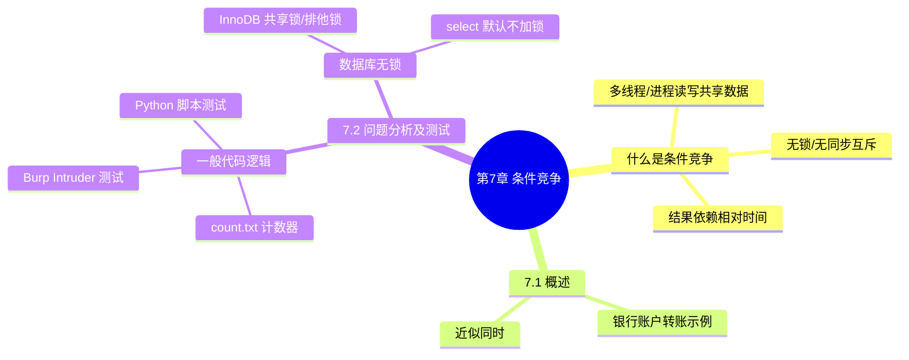

???+ abstract "本章摘要"
    本章讲解 Web 应用中的==条件竞争（Race Condition）==漏洞：多个线程或进程同时读写共享数据、又没有加锁或同步互斥时，结果依赖执行相对时间而触发的不一致问题。书中从「一般代码逻辑」和「数据库无锁」两条线索入手，给出银行转账、网站计数器的例子，并用 Burp Intruder 与 Python 脚本两种方法演示了并发测试，最后说明 InnoDB 的共享锁/排他锁机制与 select 默认不加锁这一关键利用点。
## 章节导航

上一篇：[第6章 代码审计](第6章 代码审计.md)
下一篇：[第8章 案例解析](第8章 案例解析.md)
回到目录：[00-目录](00-目录.md)

## 第7章 条件竞争

条件竞争（Race Condition）在日常的Web应用开发中，通常不如其他漏洞受到的关注度高。因为普遍的共识是，条件竞争是不可靠的，大多数时候只能靠代码审计来识别发现，而依赖现有的工具或技术很难在黑盒/灰盒中识别并进行攻击。即便该漏洞很难被发现，也仍然有很多企业曾被曝出相关漏洞，例如星巴克咖啡、小密圈的App产品等。本章所要讲解的条件竞争漏洞仅限于Web应用之中。

在CTF的比赛中，条件竞争是一个较为常见的考点之一。第一种情况是出题人在题目中给出了一定提示，或者是设计了较为明显的逻辑问题。第二种情况则是出题人通过本书前面章节讲解的一些手段将题目源码泄露出来，从而使我们能够识别并进行测试。

近年来，CTF比赛中条件竞争相关题目出现的频率有了明显提升，例如，HCTF 2016、OCTF 2017 中均有相关题目。

### 7.1 概述

???+ note "定义：条件竞争"
    条件竞争指多个线程或进程在读写同一份共享数据时，其最终结果取决于这些操作执行的相对先后时序；当共享代码、变量、文件等被并发访问而缺乏锁或同步互斥管理时，就会产生输出不一致的漏洞。
在讲解之前，我们先来了解什么是条件竞争漏洞。==条件竞争是指多个线程或者进程在读写一个共享数据时，结果依赖于它们执行的相对时间的情形。==当多个线程或进程同时访问相同的共享代码、变量、文件等而没有锁或没有进行同步互斥管理时，则会触发条件竞争，导致输出不一致的问题。

在编写代码时，由于大部分服务端语言编写的代码是以线性方式执行的，而Web服务器往往是多个线程并行执行，因而很可能会出现一些问题。下面列举一个简单的例子。

有一个银行账户A和一个银行账户B里面各有1000元钱，现在有两名用户同时登录到了账户A，并且两人都想完成同一个操作：从账户A转100元到账户B，那么正常的操作结果应该是两名用户转账结束之后，账户A里面剩余800元，账户B里面剩余1200元。

但是，考虑下面这样一种情况，如果两名用户在同一个时刻发起了转账请求，那么服务器的处理过程如下。

1）用户甲发起转账请求，服务器验证账户A的余额为1000元，可以转账。

2）用户乙同时发起转账请求，服务器验证账户A的余额为1000元，可以转账。

3）服务器处理用户甲的请求，从账户A里面扣除100元（此时账户A余额为900元），并将其存入账户B（此时账户B余额为1100元）。

4）服务器处理用户乙的请求，从账户A里面扣除100元（此时账户A余额为900元），并将其存入账户B（此时账户B余额为1200元）。

5）处理结果：账户A余额为900元，账户B余额为1200元。

出现上述情况的原因就是条件竞争，正常情况下，因为账户A作为一个共享变量，在某一个时刻有且只有一个用户能够操作账户A的余额，==但是由于服务器没有进行适当的加锁或是同步互斥管理，使得两个用户同时访问并修改账户A的余额，从而引发错误。==

注意，这里所说的同时并非真正意义上的同时，而是两个操作之间时间间隔极小，对比服务端的延迟，可以近似于同时。==当然上述示例只是一个说明性的例子，因为仅仅只有两个用户时是很难做到同时的，所以在真正实际操作的时候，往往会设置很大的进程数或线程数同时发起请求，从而使得某两个进程或线程能够幸运地做到同时。==

???+ tip "本节要点"
    1. 条件竞争 = 多线程/进程并发读写共享数据、无锁或未互斥时，结果依赖执行相对时序；
    2. 服务端语言线性执行，但 Web 服务器多线程并行，二者叠加容易出问题；
    3. 银行转账例子：两用户同时读余额都通过校验，最终只扣一次，账户余额出错；
    4. 实际操作要开很大进程/线程数同时请求，才能让某两个操作"近似同时"地撞上。
### 7.2 条件竞争问题分析及测试

接下来将分别从因一般代码逻辑问题引发的条件竞争和因数据库无锁引发的条件竞争来分析条件竞争问题及相关测试方法。

### 1. 一般代码逻辑引发的条件竞争

对于不涉及数据库的这一类问题，其主要原因在于服务端的代码对于共享资源的处理存在问题，首先来看一个较为简单的例子，示例代码如下：

```php
<?php
$cnt=file_get_contents("count.txt");
//count.txt的初始内容为0
$cnt+=1;
echo "This site was visited $cnt times.";
file_put_contents("count.txt", $cnt);
?>
```

在这个例子中，我们想要实现的功能就是记录这个网站页面被访问了多少次。假设每一次用户请求，服务端都应将count.txt中的数值加1，用户得到的输出内容每次都应该与实际请求次数一致，但是这段代码因为条件竞争的原因很可能没办法对访问次数进行准确记录，从而导致用户得到的输出内容与实际请求次数不一致。

如果存在两个用户同时访问，就会造成count.txt里面的数值本应该增加2，却只增加了1的情况，如图7-1所示。

到这里，大家已经不难窥见条件竞争漏洞的原理了，接下来以样例代码为例，介绍一下常见的条件竞争漏洞的测试方法。

<div style="text-align: center;">时间轴</div>

| 线程一 |  |
| --- | --- |
| $cnt=file_get_contents("count.txt"); |  |
|  | 线程二 |
| $cnt=file_get_contents("count.txt"); |  |
| 线程一 |  |
| $cnt+=1;echo "This site was visited $cnt times.";file_put_contents("count.txt", $cont); |  |
|  | 线程二 |
| $cnt+=1;echo "This site was visited $cnt times.";file_put_ contents("count.txt", $cont); |  |
| 线程一 | 线程二 |
| 线程结束后 count.txt 由 0 变成 1 | 线程结束后 count.txt 由 0 变成 1 |

*图7-1 多用户同时访问形成的条件竞争*

首先，我们利用前面介绍的Burp的Intruder模块进行测试，截取数据包之后进行配置，在Payloads一栏配置访问总次数为1000，如图7-2所示。

Payloads

{ width="3%" }

Payload Sets

You can define one or more payload sets. The number of payload sets depends on the payload types are available for each payload set, and each payload type can be custom

Payload set:

{ width="2%" }

Payload count: 1,000

Payload type: Null payloads

Request count: 0

{ width="3%" }

? Payload Options [Null payload]

This payload type generates payloads whose value is an empty string. With no payload base request unmodified.

{ width="2%" }

Generate 1000

payloads

{ width="2%" }

Continue indefinitely

*图7-2 设置访问数量为1000次*

然后，在Options一栏配置并发线程数为80（如图7-3所示），当然这个数目越大就越容易触发条件竞争，但是数目过大可能会对服务器造成一定负担。

{ width="75%" }

*图7-3 设置线程数量为80*

我们期望最后结果的值应该是1000次，但是从实验结果可以发现，1000个访问请求最后只记录了786次，如图7-4所示。

{ width="76%" }

*图7-4 Burp测试条件竞争的结果*

接下来，我们用一个简短的Python脚本来进行测试，测试代码如下：

```python
import requests
import threading
import Queue
url = "http://example.com/count.php"

requests_time = 0
message_queue = Queue.Queue()
stop = 0

def output():
    global message_queue, stop
    while stop!=1 or message_queue.empty() != True:
        try:
            msg = message_queue.get()
            except:
                continue
        print msg

def request():
    global requests_time, message_queue
    while requests_time < 1000:
        message_queue.put(requests.get(url).content)
        requests_time += 1

Thread_count = 80
threading.Thread(target=output).start()
for i in xrange(Thread_count):
    t = threading.Thread(target=request, args=())
    t.start()
    stop = 1
```

需要注意的是，这里设置了requests_time<1000，但是总共发送的请求数量肯定会超过1000，==原因也是因为条件竞争。==

由图7-5可以看出，我们发起了超过1000次的访问，但是输出结果的最大值远远不够1000。

{ width="75%" }

*图7-5 Python测试条件竞争的结果*

以上就是两种较为常用的条件竞争测试方法（Brup测试和Python脚本测试），当然还有很多其他可以快速实现并发的编程语言（如Golang等）也可用来进行测试，有兴趣的读者可以自行研究。

???+ tip "本节要点"
    1. 不涉及数据库的条件竞争，根因是服务端对共享资源的处理缺乏同步，如 count.txt 计数器的 read→加1→write 不是原子操作；
    2. 两用户同时访问时，count.txt 本应加 2 却只加了 1；
    3. Burp 测试：Intruder 的 Payloads 配 Null payloads、总次数 1000，Options 配并发线程 80；
    4. 线程数越大越容易触发，但过大加重服务器负担；实测 1000 次请求只记了 786 次；
    5. Python 脚本用 threading + Queue 起 80 线程，`requests_time<1000` 也因竞争会发出超过 1000 次请求；
    6. 其他可快速并发测试的语言还有 Golang 等。
### 2. 数据库无锁机制引发的条件竞争

在说明之前，这里需要简单介绍下数据库的锁机制。在MySQL数据库中，不同的存储引擎支持不同的锁机制，以InnoDB存储引擎为例，InnoDB中常用的有两种行级锁（对单行数据加锁）：共享锁（读锁）和排他锁（写锁）。

两种锁实现的语法不同，其功能自然也不同。==共享锁，顾名思义，就是多个事务对于同一数据可以共享一把锁，都能访问到数据，但是只能读不能修改；==排他锁，即一个事务获取了一个数据行的锁，其他事务就不能再获取该行的其他锁（排他锁或者共享锁）了，也就是说，一个事务在读取一个数据行时，其他事务不能对该数据进行增、删、改查操作。

对于update、insert、delete语句，InnoDB会自动给设计的数据集添加排他锁。对于普通的select语句，InnoDB不会加任何锁。以下是select语句设置共享锁和排他锁的方式：

```sql
SELECT ... LOCK IN SHARE MODE;

SELECT ... FOR UPDATE;

//设置共享锁

//设置排他锁
```

但是，我们在编写服务端程序与数据库进行交互的时候，出于对一些原因的考虑，并不会对select语句加锁，而这通常会成为我们成功利用条件竞争漏洞的关键点。接下来，我们来看看概述里面所列举的例子，如图7-6所示。

{ width="71%" }

*图7-6 数据库查询语句未加锁导致的条件竞争*

讲到这里，相信大家已经基本能够理解其中的原因了，==由于查询数据库的select语句无锁，即当多个线程同时访问时均能获取到结果，从而导致我们能够利用条件竞争漏洞。==OCTF 2017中有一道题目便与我们所列举的这个例子类似，具体将在8.3节的实例中进行详细介绍。

???+ tip "本节要点"
    1. InnoDB 两种行级锁：共享锁（读锁，多事务可共享读、不能改）、排他锁（写锁，独占一行）；
    2. update/insert/delete 语句被 InnoDB 自动加排他锁，普通 select 不加任何锁；
    3. 设置共享锁用 `SELECT ... LOCK IN SHARE MODE;`，排他锁用 `SELECT ... FOR UPDATE;`；
    4. 服务端代码通常不对 select 加锁，正是利用条件竞争的关键点；
    5. OCTF 2017 有一道类似例题，详见 8.3 节。
## 本章思维导图



## 易错点

!!! warning "易错点"
    1. 条件竞争的"同时"是近似同时，不是严格同一时刻：单靠两个用户很难撞上，必须用大线程/进程数并发才能触发。
    2. ==InnoDB 对普通 select 语句默认不加锁==，这是数据库类条件竞争能被利用的根因；update/insert/delete 才会自动加排他锁。
    3. Burp 并发线程数不是越大越好，过大可能加重服务器负担；需在"容易触发"和"不过载"之间权衡。
    4. 书中测试代码 `requests_time<1000` 也会因竞争发出超过 1000 次请求，理解"条件竞争让请求数不可控"这一点。
??? note "自测题"
    **基础**
    1. 什么是条件竞争？它通常由什么条件触发？
    2. 银行账户转账例子中，为什么两名用户各转 100 元后账户 A 只剩 900 元而非 800 元？
    3. count.txt 计数器代码为什么无法准确记录访问次数？
    4. Burp Intruder 测试条件竞争时，Payloads 一栏如何配置？Options 一栏如何配置？
    5. InnoDB 的共享锁和排他锁分别有什么特点？
    6. 普通 select 语句加上共享锁和排他锁的 SQL 语法分别是什么？
    
    **进阶**
    7. 为什么说"同时"其实是一种近似，实际操作中如何提高触发概率？
    8. 数据库类条件竞争为什么说 select 默认不加锁是关键利用点？
    9. 书中的 Python 测试脚本设置了 `requests_time<1000`，为什么实际请求数会超过 1000？
    10. 除了 Burp 和 Python，还有哪些语言适合做并发测试？
    
    **参考答案**
    1. 指多个线程或进程读写共享数据时，结果依赖执行相对时间；当共享代码/变量/文件被并发访问又缺乏锁或同步互斥时会触发，导致输出不一致。
    2. 两用户同时读到的余额都是 1000，都通过校验后各自执行"扣 100 再存 100"，后一次扣款覆盖了前一次，最终只实际扣了一次（900）。
    3. 因为 read→加 1→write 这三个步骤不是原子操作，两个请求可能读到同一个旧值，各自加 1 后写入，使本应加 2 只加了 1。
    4. Payloads 一栏把总访问次数配为 1000（Payload type 用 Null payloads）；Options 一栏把并发线程数配为 80。
    5. 共享锁：多个事务可共享同把锁、都能读但不能改；排他锁：一个事务拿到某行锁后，其他事务不能再获取该行的其他锁，也不能增删改查。
    6. 共享锁 `SELECT ... LOCK IN SHARE MODE;`，排他锁 `SELECT ... FOR UPDATE;`。
    7. "同时"指两操作时间间隔极小、相对服务端延迟可近似为同时；实际操作中开很大的进程/线程数并发请求，让某两个操作"幸运地"撞上。
    8. 服务端与数据库交互时通常不对 select 加锁，多个线程同时 select 都能拿到结果，从而可并发通过校验、利用条件竞争。
    9. 因为条件竞争本身：多个线程同时判断 `requests_time<1000` 都成立后才各自递增，导致实际发送的请求数超过 1000 才停下。
    10. 能快速实现并发的语言都可以，如 Golang 等。
## 参考资料

- 原书：CTF特训营（FlappyPig战队 著，机械工业出版社 2020）。
- Burp Suite 官方文档：https://portswigger.net/burp/help
- Python requests 库：https://docs.python-requests.org/

*来源：CTF特训营（FlappyPig战队 著，机械工业出版社 2020），OCR 全内容保留整理版。*
