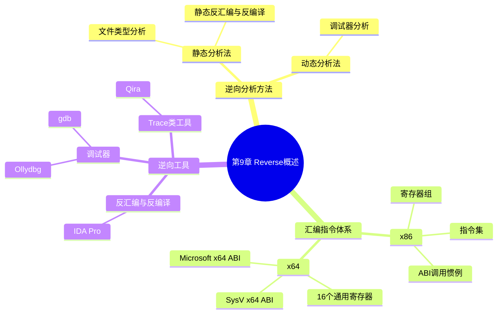

???+ abstract "本章摘要"
    本章是 Reverse 方向的入门总览：先讲逆向分析的两大方法（静态分析法与动态分析法），再介绍 Intel x86/x64 指令体系的寄存器组、汇编指令集与应用程序二进制接口（ABI），最后介绍常用工具——反汇编/反编译工具 IDA Pro、调试器 Ollydbg 与 gdb、以及 Trace 类工具 Qira。
## 章节导航

上一篇：[第8章 案例解析](第8章 案例解析.md)
下一篇：[第10章 Reverse分析](第10章 Reverse分析.md)
回到目录：[00-目录](00-目录.md)

本章将讲解逆向分析的主要方法、汇编指令体系结构和常用逆向分析工具。

## 9.1 逆向分析的主要方法

逆向分析主要是将二进制机器码进行反汇编得到汇编代码，在汇编代码的基础上进行功能分析。经过反编译生成的汇编代码中缺失了源代码中的符号、数据结构等信息，因此需要尽可能地通过逆向分析还原以上信息，以便分析程序原有的逻辑和功能。逆向分析的主要方法包括静态分析法和动态分析法。

### 1. 静态分析法

==静态分析法是在不执行代码文件的情形下，对代码进行静态分析的一种方法。==静态分析时并不执行代码，而是观察代码文件的外部特性，主要包括文件类型分析和静态反汇编、反编译。

文件类型分析主要用于了解程序是用什么语言编写的或者是用什么编译器编译的，以及程序是否被加密处理过。

在逆向过程中，主要是使用反汇编工具查看内部代码，分析代码结构。

???+ note "定义：静态分析法"
    不执行代码文件、仅观察代码文件外部特性（文件类型分析、静态反汇编/反编译）来分析代码的方法。
### 2. 动态分析法

==动态分析法是在程序文件的执行过程中对代码进行动态分析的一种方法，其通过调试来分析代码，获取内存的状态等。==在逆向过程中，通常使用调试器来分析程序的内部结构和实现原理。

???+ note "定义：动态分析法"
    在程序执行过程中，通过调试器分析代码、获取内存状态等来还原程序内部结构与实现原理的方法。
注意：在CTF中，常见的逆向目标为Windows、Linux平台下的x86、x64二进制可执行程序，本章中也只针对Windows和Linux平台下的逆向分析进行介绍。

!!! warning "易错点"
    ==本章（乃至本书）的 Reverse 范围限定在 Windows/Linux 平台下的 x86、x64 二进制可执行程序==，不涉及 ARM/MIPS 等嵌入式架构，遇到那些架构的题目需另外补充知识。
???+ tip "本节要点"
    1. 逆向 = 反汇编得到汇编代码，再在汇编代码基础上还原符号、数据结构等缺失信息，从而还原逻辑与功能；
    2. 静态分析法不执行代码，只看文件外部特性：文件类型分析（语言/编译器/是否加密）+ 静态反汇编、反编译；
    3. 动态分析法在执行过程中用调试器分析，获取内存状态，还原内部结构与实现原理；
    4. 本章范围限定：Windows/Linux 平台下的 x86、x64 二进制可执行程序。
## 9.2 汇编指令体系结构

因为逆向分析的程序所使用的处理器架构通常为Intel架构，所以这里对Intel x86和x64指令体系做一个简单的介绍，包括寄存器组、指令集、调用规范。

### 9.2.1 x86指令体系

#### 1. 寄存器组

x86指令体系中的寄存器组具体如下。

- 通用寄存器：包括EAX、EBX、ECX、EDX、ESI、EBP、ESP。
- 指令指针寄存器（EIP）：指向当前要执行的指令。
- 状态标识寄存器（EFLAGS）：根据状态标识寄存器中状态的值控制程序的分支跳转。
- 段寄存器：CS、DS、SS、ES、FS、GS。在当前的操作系统中，CS、DS、SS和ES的段寄存器的基地址通常为0。
- 特殊寄存器：包括DR0-DR7，用于设置硬件断点。

???+ note "定义：寄存器组"
    x86 指令体系中的寄存器分为通用寄存器（EAX/EBX/ECX/EDX/ESI/EBP/ESP）、指令指针寄存器 EIP、状态标识寄存器 EFLAGS、段寄存器（CS/DS/SS/ES/FS/GS）与特殊寄存器（DR0-DR7，用于硬件断点）。
#### 2. 汇编指令集

x86汇编代码有两种语法记法：Intel和AT&T。常用的逆向分析工具IDA Pro、Ollydbg和MASM通常使用Intel记法，而UNIX系统上的工具gcc通常遵从AT&T记法。Intel记法在实践中占据统治地位，也是本书中使用的记法。

Intel的汇编语言程序语句格式为：

操作项 目的操作数，源操作数

其中，操作项一般是汇编语言中的一些指令，比如add（加法）、mov（移动）等指令。目的操作数和源操作数一般都是寄存器、内存地址或者立即数。

指令主要包括以下几类。

（1）数据传送类指令

数据传送类指令是使用最频繁的指令，格式为：MOV DEST，SRC

功能：将一个字节、字或双字从源操作数SRC传送至目的操作数DEST。

（2）栈操作与函数调用

如表9-1所示，栈操作包括入栈（PUSH）和出栈（POP）。函数调用与返回通过CALL/RET指令实现。CALL指令将当前的EIP保存到堆栈中，RET指令读取堆栈，得到返回地址。

<div style="text-align: center;">表9-1 栈操作相关指令说明</div>

| 名称 | 格式 | 功能 |
| --- | --- | --- |
| 入栈 | PUSH SRC | ESP+=4;[ESP]=SRC |
| 出栈 | POP DEST | DEST=DEST;ESP-=4 |
| 调用函数 | CALL FUNC | PUSH EIP;EIP=FUNC |
| 函数返回 | RET | EIP=[ESP];ESP-=4 |

[OCR存疑：表9-1 中「入栈」功能的 ESP+=4、与「出栈」功能的 DEST=DEST;ESP-=4 疑为 OCR 错乱，按 x86 栈向下增长的语义应为入栈 ESP-=4、出栈 DEST=[ESP];ESP+=4。]

（3）算数、逻辑运算指令

如add、sub、mul、div、and、or、xor等算数逻辑运算。

（4）控制转移指令

- cmp：对两个操作数执行减法操作，修改状态标识寄存器。
- test：对两个操作数执行与操作，修改状态标识寄存器。
- jmp：强制跳转指令。
- jcc：条件跳转指令，包括jz、jnz等。

（5） 特殊指令

一些具有特殊意义的指令，如：

- int3指令：对应字节码为0xcc，主要用于设置软断点。
- int 0x80: Linux系统中32位的系统调用指令。

#### 3. x86应用程序二进制接口

调用惯例是指一系列规则，其规定了在机器层面如何进行函数调用。对于特定的系统来说，它是由应用程序二进制接口（Application Binary Interface，ABI）定义的。x86指令体系中的函数调用如图9-1所示，当发生函数调用时，首先将参数从右向左加入堆栈中，然后通过call指令将函数的返回地址压入堆栈中。最后，在新函数中将之前的ebp保存到堆栈中，同时esp会减去一定的值，留下一部分栈空间给局部变量使用。

{ width="76%" }

*图9-1 x86指令体系中的函数调用示意图*

???+ note "定义：ABI"
    应用程序二进制接口（Application Binary Interface，ABI）定义了调用惯例——在机器层面如何进行函数调用的一整套规则。
??? note "x86 函数调用时栈如何变化？"
    参数从右向左入栈 → call 把返回地址压入栈 → 新函数把旧的 ebp 保存入栈 → esp 减去一定值，为局部变量留出栈空间。
???+ tip "本节要点"
    1. Intel 记法统治逆向实践，格式为「操作项 目的操作数，源操作数」；IDA/Ollydbg/MASM 用 Intel，UNIX 的 gcc 用 AT&T；
    2. 指令五类：数据传送（MOV）、栈操作与函数调用（PUSH/POP/CALL/RET）、算术逻辑（add/mul/xor 等）、控制转移（cmp/test/jmp/jcc）、特殊指令（int3/int 0x80）；
    3. int3 字节码 0xcc 用于软断点，int 0x80 是 Linux 32 位系统调用；
    4. x86 函数调用：参数从右向左入栈 → call 压返回地址 → 保存旧 ebp → esp 减值为局部变量留空间。
### 9.2.2 x64指令体系

x64指令体系与x86指令体系大致相同，这里主要针对不同点进行说明。

#### 1. 寄存器组

通用寄存器增加到16个，分别为RAX、RBX、RDX、RCX、RBP、RDI、RSI、RSP，R8～R15。

#### 2. 系统调用指令

系

[OCR存疑：此处原文疑似截断，仅残留「系」字，「系统调用指令」小节的具体说明内容缺失。]

#### 3. x64应用程序二进制接口

有两种广泛使用的x64 ABI，列举如下。

- Microsoft’s x64 ABI：主要用于Windows操作系统中的64位程序。
- SysV x64 ABI：主要用于Linux、BSD、MAC等操作系统中的64位程序。

==Microsoft’s x64 ABI的前4个参数通过寄存器RCX、RDX、R8、R9传递，其余则是通过栈传递，但在栈上会预留下0x20字节的空间用于临时保存前4个参数，返回值为RAX。==对应的函数调用形式如下：

RAX func(RCX, RDX, R8, R9, [rsp+0x20], [rsp+0x28], .....)

==SysV x64 ABI的前6个参数（RDI、RSI、RDX、RCX、R8、R9）通过寄存器传递，其余则是通过栈传递，在栈上没有为前6个参数预留空间，返回值为RAX寄存器。==对应的函数调用形式如下：

RAX func(RDI, RSI, RDX, RCX, R8, R9, [RSP+8], [RSP+0x10], .....)

??? note "Microsoft 与 SysV 两种 x64 ABI 有何不同？"
    Microsoft x64 ABI：前 4 参数走 RCX/RDX/R8/R9，其余走栈，栈上预留 0x20 字节临时保存前 4 参数；SysV x64 ABI：前 6 参数走 RDI/RSI/RDX/RCX/R8/R9，其余走栈，栈上不预留空间；两者返回值均为 RAX。
???+ tip "本节要点"
    1. x64 通用寄存器扩到 16 个：RAX/RBX/RDX/RCX/RBP/RDI/RSI/RSP + R8～R15；
    2. 两种主流 x64 ABI：Microsoft x64 ABI（Windows）与 SysV x64 ABI（Linux/BSD/MAC）；
    3. 参数字数不同：Microsoft 前 4 参数走寄存器、SysV 前 6 参数走寄存器，返回值都是 RAX。
## 9.3 逆向分析工具介绍

工欲善其事，必先利其器。在掌握了逆向的基础知识后，我们还需要掌握一些合适的逆向分析工具。

### 9.3.1 反汇编和反编译工具

反汇编工具有很多，但功能最强大、应用最广泛的当属IDA Pro（简称IDA）。在反编译方面，最好的反编译工具为IDA自带的Hex-Ray插件（快捷键为F5），所以这里主要介绍IDA。

IDA支持的文件类型非常丰富，除了包括PE格式、ELF格式之外，还包括DOS、Mach-O、.NET等文件格式。同时IDA还支持几十种不同的处理器架构。

#### 1. IDA打开文件

通过菜单栏中的File→Open，选择要分析的目标程序，得到如图9-2所示的窗口，可以看出，IDA自动识别出了程序为x86_64的ELF程序，直接点击OK即可。

{ width="75%" }

*图9-2 IDA打开文件*

#### 2. IDA主窗口介绍

IDA的主窗口如图9-3所示，主要包括以下几个区域。

{ width="75%" }

*图9-3 IDA主窗口*

##### （1） 工具栏区域

工具栏包括与IDA常用工具相对应的工具，可以使用菜单中的View/Toolbar来显示或者隐藏工具栏。

##### （2） 导航带

导航带是加载文件的地址空间的线性视图，默认情况下，其会呈现二进制文件的整个地址范围。不同的颜色表示不同类型的文件，如代码或者数据。同时，还会有一个细小的当前位置指示符（默认为黄色）指向与当前反汇编窗口中显示的地址范围对应的导航带地址。通常，我们分析程序时，主要分析程序自身，而不是分析相应的库函数，可以根据导航带确定大致的范围。

##### （3） 函数窗口

函数窗口上显示了所有的函数。如果程序是带有符号的，那么IDA会自动解析符号信息，将函数的真实名称显示出来，函数名通常有利于分析人员猜测函数的功能。此外，IDA使用了FLIRT签名库的方式来识别库函数，因此即使是没有带符号信息的二进制程序，IDA也很可能自动识别出部分库函数。对于不能识别的函数，函数名通常会以sub_开头，后面再加上函数的起始地址。

##### （4） 数据显示窗口

IDA为每一个数据显示窗口都提供了标签，通过菜单中的View/Open subviews可以打开相应的数据显示窗口，主要的数据显示窗口包括：反汇编窗口、反编译窗口、导入表窗口、导出表窗口、结构体窗口等。

##### （5） 消息窗口

消息窗口显示的是IDA输出的信息。在这里，用户可以找到与文件分析有关的状态消息，以及由用户操作导致的错误消息。消息窗口基本上等同于一个控制台输出设备。

#### 3. IDA的基本使用

##### （1） 函数修正

一般以push ebp/rbp指令开头的地址为一个函数的起始地址，但是有时候IDA并没有将其正确地识别为函数，此时就需要手动地将其创建为函数，创建函数之后通常就能对该函数进行反编译操作了。

创建函数的方式为：在函数的起始地址的汇编代码处，点击右键，选择Create Function，对应的快捷键为P。

##### （2） 指令修正

在IDA中，如果某些指令或者数据识别有误，可以进行手动修正。

如图9-4所示，地址0x4010D9和0x4010DB汇编指令跳转的目标地址为0x4010DF，程序运行到0x4010D9时，必然会跳转到0x4010DF，而不会运行到0x4010DD，所以需要在0x4010DD处使用快捷键D将其转化为数据。

{ width="67%" }

*图9-4 IDA错误的反汇编代码*

然后，在地址0x4010DF处使用快捷键C将其转化为代码，得到如图9-5所示的结果。

{ width="68%" }

*图9-5 IDA修正后的反汇编代码*

##### （3） 数据修正

同理，在数据段中，一个数据的长度可能为1、2、4或者8字节，此时可以通过快捷键D来修改为对应的类型。

如果数据段中的某个部分为一个字符串，但是IDA并没有正确识别，那么可以使用快捷键A将其转换为一个ASCII字符串。

##### （4） 注释信息与重命名

在使用IDA分析程序的时候，经常会通过修改程序中的变量或者函数名等信息帮助读者理解，点击右键，选择Rename即可进行重命名。

此外，还可以为代码添加注释，使用快捷键“；”可以在反汇编窗口中添加注释，使用快捷键“/”可以在反编译窗口添加注释。

对于一些针对不常用处理器架构编写的程序，可以开启汇编的自动注释功能。开启的方式为勾选界面中的Auto comments，如图9-6所示。

{ width="75%" }

*图9-6 IDA开启自动注释功能界面*

##### （5） 二进制程序的patch

由上文可以知道，0x4010dd处的两个字节为多余字节，虽然经过代码修正后能够看到正常的反汇编代码，但是并不能直接进行反编译。此时，将多余的两个字节转化为空指令（nop指令，对应的字节码为0x90），这样函数就能够正常地反编译了。

修改的方法如图9-7所示，依次选择菜单栏中的Edit→Patch program→Change byte功能进行修改。

{ width="56%" }

*图9-7 IDA对程序进行patch*

##### （6） 交叉引用

IDA中包含了两类基本的交叉引用：代码交叉引用和数据交叉引用。

- 代码交叉引用用于表示一条指令将控制权转交给另一条指令。通过代码交叉引用，可以知道哪些指令调用了哪个函数或指令。
- 数据交叉引用可用于追踪二进制文件访问数据的方式。通过数据交叉引用，可以知道哪些指令访问了哪些数据。

???+ note "定义：交叉引用"
    IDA 中的两类交叉引用：代码交叉引用表示指令间控制权转交（谁调用了谁），数据交叉引用用于追踪二进制文件访问数据的方式（哪些指令访问了哪些数据）。
???+ tip "本节要点"
    1. 反汇编最强工具是 IDA Pro，反编译用其自带 Hex-Ray 插件（F5）；支持 PE/ELF/DOS/Mach-O/.NET 等格式与几十种处理器架构；
    2. IDA 主窗口五区域：工具栏、导航带、函数窗口、数据显示窗口、消息窗口；
    3. 基本使用：函数修正（Create Function/P）、指令修正（D 转数据、C 转代码）、数据修正（D 改长度、A 转 ASCII 字符串）、注释（反汇编窗口「；」、反编译窗口「/」）与重命名（Rename）、二进制 patch（多余字节改 nop 0x90）、交叉引用；
    4. 自动注释开关为勾选 Auto comments，适合不常用处理器架构。
### 9.3.2 调试器

在软件的开发过程中，程序员会使用一些调试工具，以便高效地找出软件中存在的错误。而在逆向分析领域，分析者也会利用相关的调试工具来分析软件的行为并验证结果。==调试器的两个最基本的特征是：断点设置和代码跟踪。==

???+ note "定义：调试器的两个基本特征"
    断点设置（程序运行到指定代码行时暂停并显示状态）与代码跟踪（逐条执行汇编代码并允许观察/改变程序状态）。
- 断点允许用户选择程序中任意位置的某行代码，一旦程序运行到这一行，那么它将指示调试器暂停运行程序，并显示程序的当前状态。
- 代码跟踪允许用户在程序运行时跟踪它的执行，跟踪意味着程序每执行一条汇编代码然后暂停，并允许用户观察甚至改变程序的状态。

常用的调试器包括：Ollydbg、x64dbg、Windbg 和 gdb 等。其中，Ollydbg 可以调试 Windows 下的 32 位用户态程序；x64 db 可以调试 Windows 下的 64 位应用程序；Windbg 是微软提供的调试器，可以对用户程序和系统内核进行调试，但是 GUI 界面相对来说没有那么友好；gdb 是 Linux 系统下所用的主要调试器。下面主要讲解最常用到的 Ollydbg 和 gdb。

#### 1. Ollydbg

Ollydbg（简称OD）是Windows下的一款具有可视化界面的用户态调试工具。OD具有GUI界面，非常容易上手。这里推荐使用从吾爱破解论坛下载的吾爱破解专用版Ollydbg，该版本具有强大的对抗反调试的功能。

[OCR存疑：原文小节标题为「1. 011ydbg」，疑为「1. Ollydbg」的 OCR 识别错误（0→O）。]

##### （1） 主界面

OD主界面如图9-8所示，各部分介绍如下。

{ width="75%" }

*图9-8 OD主界面*

- 反汇编窗口：载入程序后，窗口内显示的是程序反汇编后的源代码。
- 信息窗口：进行动态调试时，窗口内会显示出当前代码行的各个寄存器的信息，或者API函数的调用、跳转等信息，可以用来辅助了解当前代码行的寄存器的运行情况。
- 数据窗口：默认以十六进制的方式显示内存中的数据。
- 寄存器窗口：动态显示CPU各个寄存器的内容，包括数据寄存器、指针及变址寄存器、段寄存器，以及控制寄存器中的程序状态字寄存器。
- 堆栈窗口：显示堆栈的内容。调用API函数或子程序时，通过查看堆栈可以知道传递的参数等信息。
- 命令行：在原本的OD中是没有命令行的，这个是一个外置的插件，可以方便地在动态调试时输入命令。一般来说，主要是输入下断点或者清除断点的命令。“命令行命令.txt”文件中有详细的命令及功能介绍，大家可以查看。

##### （2） 断点操作

动态调试时要使程序在关键代码处中断，然后根据显示的动态信息进行动态分析，这就需要对程序下断点。断点有一般断点、内存断点、硬件断点等类型，一般断点是最常使用的断点方式。

###### 1）一般断点

==一般断点就是将输入的断点地址处的第一个字节用INT3指令来代替。==当程序运行到断点地址时，就会执行INT3指令，Ollydbg就会捕捉到这个指令而中断下来。

下断点一般有如下两种方式：

- F2键：在反汇编窗口中的代码行上面按F2键就可以下断点。下断点后，虚拟地址处将呈红色状态。如果想取消断点，再按一下F2键即可。
- 命令行方式：可以在命令行中使用bp命令下断点。如bp 4516B8或者bp MessageBoxA。

###### 2）内存断点

内存断点分为两种：内存访问断点和内存写入断点。==OD每一时刻只允许有一个内存断点。==

内存访问断点：在程序运行时调用被选择的内存数据就会被OD中断。根据这个特点，在破解跟踪时只要在关键数据内存中下断点，就可以知道程序在什么地方和什么时候用到了跟踪的数据。该功能对于一些复杂算法的跟踪有很大的帮助。从破解上讲，一个注册码的生成一定是由一些关键数据或者原始数据计算而来的，所以在内存中一定会用到这些关键数据，那么内存访问断点就是比较好的中断方法。

内存写入断点：在程序运行时向被选择的内存地址写入数据就会被OD中断。根据这个特点，在破解时可以跟踪一个关键数据是什么时候生成的，生成的代码段在什么地方。所以，如果不知道一个关键数据的由来，就可以用内存写入断点的方式查看计算的核心。

如果想要设置内存断点，则可以在数据窗口中的十六进制栏内选择一部分内存数据，然后单击鼠标右键出现功能菜单，选择“断点”，然后从中选择内存访问断点或者内存写入断点。

###### 3）硬件断点

硬件断点并不会将程序代码改为INT3指令，如果有些程序有自校验功能，就可以使用硬件断点了。下中断的方法和下内存断点的方法相同，共有三种方式：硬件访问、硬件写入、硬件执行。最多一共可以设置4个硬件断点。

##### （3） 代码跟踪操作

代码跟踪操作主要包括一些常见的快捷键，用于对程序进行动态跟踪。

- F9键：载入程序后，按F9键就可以运行程序了。
- F7键：单步跟踪（步入），即一条代码一条代码地执行，遇到Call语句时会跟入执行该语句调用地址处的代码或者调用的函数代码。
- F8键：单步跟踪（步过），遇到Call语句时不会跟入。
- F4键：执行到所选代码。
- ALT+F9 键：执行到程序领空，如果进入到引用的 DLL 模块领空，则可以用此快捷键快速回到程序领空。

??? note "三种断点有什么区别？"
    一般断点把断点地址首字节换成 INT3（0xCC），最常用；内存断点分访问/写入两种、每时刻只能有一个，用于跟踪关键数据的读写；硬件断点不改 INT3、最多设 4 个，适合有自校验的程序。
!!! warning "易错点"
    ==有自校验功能的程序不要用一般断点==（INT3 替换会触发校验失败），应改用硬件断点（不改代码字节、最多 4 个）。
#### 2. gdb

gdb是一个由GNU开源组织发布的、UNIX/Linux操作系统下的、基于命令行的、功能强大的程序调试工具。

（1）安装

在大多数Linux发行版中，gdb都是默认安装的，如果没有，那么在Ubuntu下可以通过apt-get进行安装，安装命令为：

```bash
sudo apt-get install gdb
```

如果需要调试其他架构的elf程序，则可以安装gdb-multiarch，安装命令为：

[OCR存疑：原文此处 gdb-multiarch 的安装命令缺失（「安装命令为：」后直接跳到下一段）。]

此外，gdb也有很多插件，如peda、gef、pwndbg等，这里的插件提供了一些额外的命令，便于对程序进行逆向分析。这些插件都可以在Github上找到，根据其安装说明进行安装即可。图9-9为gdb安装了peda插件之后运行的界面，可以通过peda help命令查看新增的命令。

{ width="75%" }

*图9-9 gdb安装peda插件后的界面*

##### （2） 基本的调试操作

表9-2至表9-7展示了基本的调试操作命令及其说明。

###### 1）启动和结束gdb

###### 表9-2 启动和结束gdb

| 命令 | 功能 | 命令 | 功能 |
| --- | --- | --- | --- |
| gdb program | 启动 gdb 开始调试 program | quit | 退出调试器 |

###### 2）通用命令

<div style="text-align: center;">表9-3 gdb的通用命令</div>

| 命令 | 功能 |
| --- | --- |
| run arguments | 运行被调试程序（指定参数 arguments） |
| attach processID | 把调试器附加到 PID 为 processID 的进程上 |

###### 3）断点

<div style="text-align: center;">表9-4 gdb断点命令</div>

| 命令 | 功能 |
| --- | --- |
| break *address | 下断点 |
| info breakpoints | 查看所有断点 |
| delete number | 删除某个断点 |

###### 4）运行调试目标

<div style="text-align: center;">表9-5 运行调试目标</div>

| 命令 | 功能 |
| --- | --- |
| step1 | 执行一条机器指令，单步进入子函数 |
| next1 | 执行一条机器指令，不会进入子函数 |
| continue | 继续执行 |

[OCR存疑：表9-5 中 step1、next1 疑为 stepi、nexti（si/ni，单步执行一条机器指令）的 OCR 识别错误。]

###### 5）查看和修改程序状态

<div style="text-align: center;">表9-6 查看和修改程序状态</div>

| 命令 | 功能 |
| --- | --- |
| x/countFormatSize addr | 以指定格式 Format 打印地址 address 处的指定大小 size、指定数量 count 的对象 Size:b（字节）、h（半字）、w（字）、g（8字节） Format: o（八进制）、d（十进制）、x（十六进制）、u（无符号十进制）、t（二进制）、f（浮点数）、a（地址）、i（指令）、c（字符）、s（字符串） |
| info register | 查看寄存器 |
| backtrace | 打印函数调用栈回溯 |
| set $reg=value | 修改寄存器 |
| set *(type*) (address)=value | 修改内存地址 addr 为 value |

###### 6）其他命令

<div style="text-align: center;">表9-7 gdb的其他常用命令</div>

| 命令 | 功能 |
| --- | --- |
| shell command | 执行 shell 命令 command |
| set follow-fork-mode parent/child | 当发生 fork 时，指示调试器跟踪父进程还是子进程 |
| handler SIGALRM ignore | 忽视信号 SIGALRM，调试器接收到的 SIGALRM 信号不会发送给被调试程序 |
| target remote ip:port | 连接远程调试 |

???+ tip "本节要点（调试器）"
    1. 调试器两大基本特征：断点设置与代码跟踪；常用调试器有 Ollydbg/x64dbg/Windbg/gdb；
    2. OD 主界面六部分：反汇编窗口、信息窗口、数据窗口、寄存器窗口、堆栈窗口、命令行（外置插件）；
    3. 断点三类：一般断点（F2 或 bp 命令，INT3 替换）、内存断点（访问/写入，每时刻仅 1 个）、硬件断点（不改代码、最多 4 个）；
    4. 代码跟踪快捷键：F9 运行、F7 步入、F8 步过、F4 执行到所选代码、ALT+F9 回到程序领空；
    5. gdb 常用插件 peda/gef/pwndbg，基本操作见表 9-2～表 9-7。
### 9.3.3 Trace类工具

Trace类工具通过一定的方式监控并记录程序的运行，然后使分析者在记录的信息中得到程序的一些动态信息。例如，strace工具是Linux下的一个用来跟踪系统调用的工具。这里主要介绍一个更为强大的Trace类工具：Qira。

Qira的官方主页为http://qira.me/，由著名的黑客geohot开发。安装完成之后，运行命令qira-s/bin/ls，这样相当于在4000端口开启服务/bin/ls，使用nc localhost 4000即可连接上去。同时，还会开启3002的Web端口，如图9-10所示。

[OCR存疑：运行命令 qira-s/bin/ls 疑为 qira -s /bin/ls 的 OCR 识别错误。]

浏览器Web界面主要包括以下几个部分。

{ width="75%" }

*图9-10 Qira的浏览器Web页面*

1）最左边两列为fork，每次用nc连一次4000端口，就会多一个fork。图9-10中的两列表示链接过两次4000端口。

2）右边的最上面有4个框，分别对应如下信息。

- 113表示程序运行的第113条指令。
- 0表示第0个fork。
- 0x80484c7表示指令的地址。
- 0xf6fff01c表示数据的地址。

3）右边的下面是程序运行的指令、寄存器、内存、调用的系统调用等。

???+ note "定义：Trace 类工具"
    通过监控并记录程序运行，让分析者从记录信息中获取程序动态信息的一类工具（如 Linux 的 strace、geohot 开发的 Qira）。
???+ tip "本节要点（Trace 类工具）"
    1. Trace 类工具监控并记录程序运行，从记录中得到动态信息；strace 跟踪 Linux 系统调用，Qira 更强大；
    2. Qira 由 geohot 开发，`qira -s /bin/ls` 在 4000 端口开启服务（nc 连接）、3002 端口提供 Web 界面；
    3. Qira Web 界面：最左两列为 fork（每 nc 一次多一个）、右边最上 4 个框（指令序号/fork 号/指令地址/数据地址）、右边下方为指令/寄存器/内存/系统调用。
## 本章思维导图



## 易错点

!!! warning "易错点"
    1. ==本章 Reverse 范围为 Windows/Linux 下的 x86、x64 二进制程序==，嵌入式等其它架构不在此列。
    2. ==x86 的 Microsoft 与 SysV 两种 x64 ABI 参数传递规则不同==（前 4 个寄存器 vs 前 6 个寄存器），混淆会导致栈布局分析错误。
    3. ==有自校验功能的程序不要下一般断点==（INT3 替换首字节会触发校验失败），应改用硬件断点（最多 4 个）。
??? note "自测题"
    **基础**
    1. 逆向分析的两大主要方法是什么？各自的核心动作是什么？
    2. Intel 记法的汇编语句格式是什么？目的操作数和源操作数通常是什么？
    3. CALL 指令和 RET 指令分别做什么？
    4. int3 指令的字节码是什么？主要用于做什么？int 0x80 是什么？
    5. x64 相比 x86，通用寄存器由几个增到几个？
    6. IDA 反编译插件叫什么？快捷键是什么？
    7. 在 IDA 中把某地址转成数据、转成代码、转成 ASCII 字符串分别用什么快捷键？
    8. OD 中 F2、F7、F8、F9 键分别有什么作用？
    9. gdb 中下断点、查看所有断点、删除断点的命令分别是什么？
    10. Qira 运行时开启了哪两个端口，分别做什么用？
    
    **进阶**
    11. Microsoft x64 ABI 与 SysV x64 ABI 在参数传递上有何区别？
    12. 为什么分析程序时应主要分析程序自身而不是库函数？可以借助哪个窗口区分？
    13. 程序有自校验功能时，为什么不能用一般断点？应该改用哪种断点？
    
    **参考答案**
    1. 静态分析法（不执行代码、观察文件外部特性）与动态分析法（执行过程中用调试器分析，获取内存状态）。
    2. 「操作项 目的操作数，源操作数」；目的/源操作数一般是寄存器、内存地址或立即数。
    3. CALL 把当前 EIP 保存（压入堆栈）再跳转；RET 读取堆栈得到返回地址。
    4. int3 字节码为 0xcc，用于设置软断点；int 0x80 是 Linux 32 位系统调用。
    5. 由 8 个（算上常用通用寄存器）增到 16 个通用寄存器：RAX/RBX/RDX/RCX/RBP/RDI/RSI/RSP + R8～R15。
    6. Hex-Ray 插件，快捷键 F5。
    7. 转数据用 D、转代码用 C、转 ASCII 字符串用 A。
    8. F2 下/取消断点、F7 单步步入、F8 单步步过、F9 运行程序。
    9. break *address 下断点、info breakpoints 查看、delete number 删除。
    10. 4000 端口开启 /bin/ls 服务（用 nc 连接）、3002 端口提供浏览器 Web 界面。
    11. Microsoft x64 ABI 前 4 参数走 RCX/RDX/R8/R9、栈上预留 0x20 字节；SysV x64 ABI 前 6 参数走 RDI/RSI/RDX/RCX/R8/R9、栈上不预留空间；返回值均为 RAX。
    12. 分析目标是程序自身逻辑而非标准库函数，减少干扰；可借助 IDA 导航带观察地址范围确定程序自身的大致区间。
    13. 一般断点会把断点地址首字节替换成 INT3，程序自校验会检测到字节被改而失败；应改用硬件断点（不改代码字节，最多 4 个）。
## 参考资料

- 原书：CTF特训营（FlappyPig战队 著，机械工业出版社 2020）。
- IDA Pro 官网：https://hex-rays.com/ida-pro/
- Qira 官方主页：http://qira.me/

*来源：CTF特训营（FlappyPig战队 著，机械工业出版社 2020），OCR 全内容保留整理版。*
